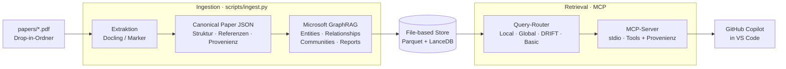

# Research-GraphRAG

**Ein schlanker, container-freier Scientific-GraphRAG als persönlicher Forschungsassistent für lokale wissenschaftliche PDF-Paper – direkt nutzbar aus GitHub Copilot über einen MCP-Server.**

> **Status:** **Phase 0–6 umgesetzt**, dazu die Phase-7-Ausbaupunkte **A2 (Zitationsgraph)** und **A1 (LLM-Bridge & Antwort-Synthese)**. Phase 0: Fundament + **Offline-Hybrid-Durchstich** (Roadmap-M1) – `pip install -e .`, Ingestion (`pypdf` → TF-IDF/SQLite) und belegte Basic-Search-Antworten laufen und sind getestet. Phase 1: **145 Paper** aus dem bisherigen `Recherche`-Ordner nach `papers/` migriert und [`Übersicht.md`](Übersicht.md) portiert (reduzierter Umfang – `recherche/`-Artefakte bewusst ausgelassen). Phase 2: **robuste Extraktion** (Canonical-Schema **0.2.0** mit Section-Heuristik, größenbasiertem Chunking, DOI/arXiv, Qualitätsflags), **Qualitätsreport** und **Übersicht-Entwürfe** (`scripts/update_overview.py` → `data/overview_drafts.md`) – Umfangsabgrenzung in [ADR 0006](docs/adr/0006-canonical-model-phase2-scope.md). Phase 3: **GraphRAG-Index (Offline-Hybrid)** – deterministischer **Paper-Ähnlichkeitsgraph** (TF-IDF) mit **Louvain-Communities** und extraktiven Zusammenfassungen, integriert in `python -m scripts.ingest` und einsehbar über `python -m scripts.graph_info` ([ADR 0007](docs/adr/0007-graphrag-index-phase3-option-b.md)). Phase 4: **Retrieval & Query-Router** – **Basic/Local/Global/DRIFT** als deterministische, belegbare Offline-Modi plus schlanker Heuristik-Router (`python -m scripts.ask [--mode …]`); der **Provenienz-Assembler** liefert Paper · Abschnitt · Seite/Chunk (Index-Schema **0.2.0**) ([ADR 0008](docs/adr/0008-retrieval-and-query-router-phase4.md)). Phase 5: **MCP-Server (stdio)** – die vier Retrieval-Modi sowie `get_paper` und `list_topics` sind als **MCP-Tools** für GitHub Copilot registriert (FastMCP; Fehlerübersetzung an der Server-Grenze; **kein** serverseitiges LLM-Sampling), eingebunden über [`.vscode/mcp.json`](.vscode/mcp.json); der Index wurde additiv auf Schema **0.3.0** (Identifikatoren für `get_paper`) erweitert ([ADR 0009](docs/adr/0009-mcp-server-stdio-phase5.md)). Phase 6: **Drop-in-Workflow & Qualitätssicherung** – der `ingest`→On-Read-Kreislauf ist verifiziert und **gehärtet** (atomarer Index-Swap: Build nach `*.sqlite.tmp` + `os.replace`, ein Fehler lässt den Alt-Index intakt); neu sind `python -m scripts.status` (read-only Index-/Korpus-Status + Konsistenz-Check) und `python -m scripts.qa` (Prüf-Fragen je Modus durchspielen), Nachweis über einen Freshness-/Atomaritäts-Regressionstest und die QS-Harness ([ADR 0010](docs/adr/0010-drop-in-workflow-and-qa-phase6.md)). Die weiteren Phasen folgen der [Roadmap](Roadmap.md); die Umsetzung ist die **Offline-Variante (Option B, [ADR 0005](docs/adr/0005-graphrag-index-backend-open.md))**. Phase 7 / A2: **Intra-Korpus-Zitationsgraph** – aus dem Referenzabschnitt entstehen deterministische, gerichtete `CITES`-Kanten (DOI/arXiv/Titel-Match gegen den eigenen Korpus, Präzision vor Recall), additiv im Index (`citation_edges`) und abfragbar über `python -m scripts.citations` sowie das MCP-Tool `get_citations` ([ADR 0011](docs/adr/0011-intra-corpus-citation-graph-phase7.md)). Phase 7 / A1: **LLM-Bridge & Antwort-Synthese** – das Paket `generation/` realisiert den injizierbaren Generierungs-Port aus [ADR 0004](docs/adr/0004-llm-bridge-via-mcp-sampling.md) und bildet alle vier Modi auf **eine** nummerierte Evidenz mit Zitier-Contract ab; das Tool `answer_question` liefert sie in einem Aufruf und formuliert auf Wunsch (`synthesize = true`) per **MCP-Sampling** über das Client-Modell – ohne Sampling degradiert es sichtbar (`generated = false`) bei voller Evidenz ([ADR 0012](docs/adr/0012-llm-bridge-and-answer-synthesis-phase7.md)). Phase 7 / A3: **Chunking-Verfeinerung** – die Messung widerlegte die vermutete Ursache (nicht die Seitengrenze, sondern die **übersegmentierende Überschriften-Heuristik**), deshalb wirken jetzt **Reject-Regeln** und eine **Section-Absorption**; die Seite ist kein Segmentierungskriterium mehr, sondern eine **Provenienz-Range** (`page_number` … `page_end`, Canonical **0.3.0**, Index **0.4.0**). Ergebnis am realen Korpus: `short_chunk`-Anteil **20,1 % → 3,7 %**, Chunks **14 397 → 11 339**, Qualitäts-Flags **3074 → 320** ([ADR 0013](docs/adr/0013-chunking-refinement-phase7.md)). Phase 7 / A4: **Hybrid-Retrieval** – über **einer** Tokenisierung stehen jetzt der TF-IDF-Kosinus und ein **handimplementiertes BM25** (Term-Sättigung + Längennormalisierung), verbunden per **Reciprocal Rank Fusion**; das ist der neue Default aller Chunk-Modi, umschaltbar per `--scoring`. Belegt wird der Nutzen mit einem versionierten Gold-Set und dem Harness `python -m scripts.eval_retrieval` (Hit@5 **0,735 → 0,882**, bei Fakt-Fragen **0,773 → 0,955**); der Index bleibt unverändert (**kein Re-Ingest**), `Citation` weist die Teil-Scores `score_tfidf`/`score_bm25` aus ([ADR 0014](docs/adr/0014-hybrid-retrieval-bm25-tfidf-phase7.md)). Phase 7 / A5: **Rausch-Reduktion** – der extrahierte Seitentext wird jetzt **normalisiert** (Ligaturen wie `configuration` repariert, nicht dekodierbare `/uniXXXXXXXX`-Glyphen entfernt), die Überschriften-Erkennung verwirft **Bibliografie-Zeilen** (URL/DOI, `et al`, Code-Zeichen, Satzpunkt-Ende sowie kleingeschriebene Fließtextreste wie `methods.`) und schaltet im Referenzabschnitt den Numerierungs-Zweig ab, und eine kuratierte **Keyword-Politik** (`keywords.py`) filtert Rausch-Terme aus Community-Keywords und Übersicht-Entwürfen – als **Nachfilter**, damit der Ähnlichkeitsgraph unberührt bleibt. Ergebnis am realen Korpus: verrauschte Abschnittstitel **267 → 0**, Rausch-Anteil der Keywords **6,0 % → 0 %**, Ligaturen **3628 → 0**, `CITES`-Kanten **256 → 382**, MRR@5 **0,641 → 0,650** bei unverändertem Hit@5 (Canonical-Schema **0.4.0**, [ADR 0015](docs/adr/0015-noise-reduction-keywords-and-sections-phase7.md)). Phase 7 / A6: **Quantitative Retrieval-Evaluation** – die Messung reicht jetzt über die geteilte Chunk-Primitive hinaus auf die **Modi als Ganzes**, mit zwei Diagnosen, die **Auswahl- von Rankingfehlern trennen**; Global wird nie ohne **Selektivität und Trivial-Baselines** ausgewiesen (das Vergleichsinstrument ist der **Lift**, denn die nackte Coverage hätte die triviale Strategie „größte Communities" gekürt: 0,567 vs. 0,248). Neu sind das Paket `evaluation/`, das eingefrorene [`eval/retrieval-baseline.json`](eval/retrieval-baseline.json) und ein **qid-genauer** Regressions-Check (`--check`) mit Fingerprint-Guard ([ADR 0016](docs/adr/0016-quantitative-retrieval-evaluation-phase7.md)). Phase 7 / A7: **Router-Härtung** – auch hier korrigierte die Messung die Erwartung: Signal-Konflikte sind mit **1 von 44** Fragen praktisch inexistent, der Schaden lag im **rohen Substring-Matching** (15 von 26 korpus-häufigen Teilwörtern leiteten fehl) und in **einem** Signal (`which papers` schickte 16 von 22 Fakt-Fragen in den schwächeren Modus). Der Router deklariert die Match-Art jetzt **je Signal** (Wortgrenze/Wortanfang für Englisch, Teilwort nur für deutsche Stämme), behandelt `basic` als **Rückfallebene** statt als gleichrangigen Modus, fällt bei Gleichstand sichtbar dorthin zurück (Konfidenz `weak`) und **weist die Entscheidung aus** – in der CLI und additiv als `routing` in `answer_question`. Gemessen wird gegen ein **Router-Gold-Set** mit aus dieser README abgeleiteten Contract-Labels: Contract-Treue der Prüf-Fragen **6/10 → 10/10**, Gold-Set **83/84**, Signal-Abdeckung **69/69**, end-to-end Hit@5 **0,765 → 0,882** ([ADR 0017](docs/adr/0017-router-hardening-phase7.md)).
>
> **Wie es weitergeht:** **Phase 8 ist umgesetzt** – der Korpus-Zufluss läuft über den
> Eingangsordner `new_papers/` und **einen** Befehl (`python -m scripts.intake`): dreistufige
> Duplikatprüfung (sha256 → DOI/arXiv → Titel-Ähnlichkeit) mit **abgestufter** Konsequenz, danach
> Index-Neubau und eine Entwurfszeile direkt in [`Übersicht.md`](Übersicht.md). Auch hier hat die
> Vorabmessung die Vorgabe korrigiert: Das Kriterium „gleiche DOI/arXiv-ID" leitet im eigenen
> Korpus bei **17 von 155** Identifikatoren fehl (14 zitierte Fremd-IDs aus dem Volltext-Fallback
> und 3 Träger desselben ACM-Vorlagen-Platzhalters) – deshalb löscht nur der **bitgenaue**
> sha256-Treffer, und
> der Identifikator-Vergleich ist doppelt gehärtet ([ADR 0019](docs/adr/0019-corpus-intake-new-papers-phase8.md)).
> Der aktive Plan umfasst noch **zwei** Phasen ([Roadmap](Roadmap.md#der-aktive-plan--bearbeitungsreihenfolge))
> – **Phase 15** (Skalierung) und danach **Phase 14** (Referenz-Ernte); dazu einen nachgelagerten
> Restpunkt aus Phase 10 und einen bewusst zurückgestellten aus Phase 9. **Phase 13**
> (**Referenz-Einträge ohne Volltext**: ein
> Paper hinter einer Bezahlschranke wird über DOI/arXiv-ID zu einem ausdrücklich unvollständigen
> Korpus-Eintrag) ist **abgeschlossen**. Aus **Phase 9** sind **S0 (Machbarkeit)** und **S1 (Kandidatensuche)**
> umgesetzt: Die Quellen sind erreichbar – allerdings **nur über einen authentifizierenden
> Unternehmens-Proxy** (Negotiate/NTLM), den kein Standard-Python-Client von sich aus bedient.
> Deshalb liegt der gesamte Netzzugang hinter einem **injizierbaren Port**; alles andere ist
> netzfrei und offline getestet. `python -m scripts.discover` sucht bei **arXiv und OpenAlex** zu
> einer Anfrage aus dem eigenen Bestand, dedupliziert mit der **bestehenden** Intake-Logik und
> schreibt einen append-only Bericht – **kein Download, kein MCP-Werkzeug**
> ([ADR 0020](docs/adr/0020-online-candidate-search-phase9.md)). **S2 (Volltext-Download) bleibt
> zurückgestellt**, weil arXiv im Feed keine Lizenz ausweist und OpenAlex nur bei 15 von 51
> gemessenen Treffern – für eine belastbare Whitelist zu wenig. Aus **Phase 10** sind **V1**, **V2**
> und **V3** umgesetzt: Die Local Search hängt nicht mehr an **einem** Seed, sondern an den **Top-5**
> der Chunk-Wertung, deren Chunk-Nachbarschaften per Rang-Fusion zusammengeführt werden – Hit
> 0,618 → **0,912**, MRR 0,532 → **0,654** bei **0 Regressionen** und unberührten übrigen Modi
> ([ADR 0021](docs/adr/0021-local-multi-seed-phase10.md)). DRIFT sucht nicht mehr in **einer**
> Community, sondern in der **Vereinigung der Top-5**, und fällt ohne passende Community sichtbar
> auf die corpusweite Suche zurück – die leere Antwort bei 12 von 34 Fragen entfällt damit
> (0,235 → **0,647**, wovon die Hälfte der Treffer aus genau diesem Fallback stammt und deshalb
> **getrennt** ausgewiesen wird, [ADR 0022](docs/adr/0022-drift-community-union-and-fallback-phase10.md)).
> `LocalSearchResult.seed` heißt dadurch `seeds`, `DriftSearchResult.community` heißt
> `communities`. Mit **V3** ist zuletzt der einzige bis dahin **ungemessene** Fragetyp erschlossen:
> Multi-Hop wird gegen die 382 `CITES`-Kanten gemessen – die einzige **nicht-lexikalische**
> Labelquelle des Repos. Dabei ist erstmals beziffert, dass der Paper-Ähnlichkeitsgraph
> Zitationsnähe trägt (**Lift 8,20** gegen 0,98 einer Zufallsauswahl), und Local schlägt Basic auf
> dieser Ebene deutlich (0,955 vs. 0,750). Zwei Vorgaben wurden dabei korrigiert: Der
> Recall des Zitationsgraphen lässt sich so **nicht** messen – ausgewiesen werden stattdessen
> strukturelle Schranken –, und eine Frage nach dem **Titel** eines Papers wird zu zwei Dritteln
> über die **Bibliografie** der zitierenden Paper beantwortet, was der Bericht als solches
> markiert statt es als Erfolg zu verbuchen
> ([ADR 0023](docs/adr/0023-multihop-citation-evaluation-phase10.md)). Die abgeschlossenen
> Phasen 0–7 sind mit allen Kennzahlen in der [Roadmap-Historie](docs/roadmap-historie.md)
> archiviert.
>
> **Hinweis zu allen Kennzahlen dieses Abschnitts:** Sie wurden gegen einen Korpus von **145**
> Papern gemessen und bleiben als datierte Belege der jeweiligen Phase stehen. Der Bestand ist
> inzwischen auf **468** Paper (30 399 Chunks) gewachsen; beide Gold-Sets sind dagegen neu
> abgeleitet und beide Baselines neu eingefroren (Phase 11 / B5). Der aktuelle Stand steht in der
> [Roadmap-Historie](docs/roadmap-historie.md#b5--messgrundlage-nachführbar-halten) – er ist mit
> den obigen Zahlen **nicht** vergleichbar, weil sich Korpus *und* Labels geändert haben.
>
> **Phase 12 ist umgesetzt – Zitierfähigkeit.** Aus einem Suchtreffer entsteht jetzt ohne
> Handarbeit eine korrekte Literaturangabe in **Harvard** und **APA**. Auch hier stand die
> Messung vor dem Code, und sie korrigierte zwei Annahmen: Bis dahin lieferte **eines von acht**
> Werkzeugen überhaupt einen extern auflösbaren Identifikator (alle übrigen nur eine interne
> `paper_id` und einen lokalen Dateipfad), und die extrahierten Identifikatoren sind für
> Zitationszwecke **nicht verlässlich genug** – 29 von 129 kuratierten Übersichtsangaben weichen
> ab, teils legitim als Publisher-DOI, teils als echter Extraktionsfehler. Umgesetzt ist deshalb
> keine „bessere Regex", sondern eine **zweite Quelle** mit ausgewiesener Herkunft: Die
> Zitationsdaten liegen versioniert in `metadata/paper_metadata.json`, werden **feldweise** nach
> der Kette `manual > curated > resolved > extracted` aufgelöst, und jede Ausgabe nennt, welche
> Herkunft je Feld gewonnen hat ([ADR 0025](docs/adr/0025-citable-paper-metadata.md)). Die lokal
> nicht gewinnbaren Felder – Autoren, Venue, Publikationsjahrgang – beschafft der **separat
> startbare** Lauf `python -m scripts.resolve_metadata` über OpenAlex; übernommen wird
> **automatisch**, aber ein nicht eindeutiger Beleg trägt sichtbar `confidence = weak`
> ([ADR 0026](docs/adr/0026-online-metadata-resolution.md)). Ergebnis am realen Korpus:
> **vollständig zitierfähig 0 → 336** von 341 Papern, Identifikator in **9 von 9** Werkzeugen.
>
> **Phase 13 ist umgesetzt – Referenz-Einträge ohne Volltext.** Ein Paper, von dem nur der
> Abstract öffentlich ist, wird über seine DOI oder arXiv-ID zu einem ausdrücklich
> **unvollständigen** Korpus-Eintrag: `python -m scripts.resolve_references` macht aus der
> kuratierten Liste `new_papers/referenzen.txt` je eine native Stub-Datei `*.refjson`
> ([ADR 0029](docs/adr/0029-reference-stub-resolution-phase13.md)), der Intake nimmt sie wie ein
> PDF an und führt `document_kind` in Canonical- und Index-Schema
> ([ADR 0030](docs/adr/0030-reference-entries-in-corpus-phase13.md)), und seit R3 ist die
> Unvollständigkeit **überall sichtbar** – als Pflichtfeld in jedem Zitat, jeder Paper-Referenz,
> jedem Beleg und in `get_paper`, dazu als Klartext „Referenz-Eintrag ohne Volltext" im
> Provenienz-Label, den der Zitier-Contract in der Antwort zu benennen verlangt
> ([ADR 0031](docs/adr/0031-reference-contract-and-guardrail-phase13.md)). Der befürchtete
> Verdrängungseffekt trat **ein** und wurde deshalb behoben, aber erst **nach** einer Messung mit
> vorab fixierter Entscheidungsregel: Die naheliegende harte Nachrangigkeit erreicht zwar 0
> Regressionen, findet aber **keine einzige** der zehn Fragen mehr, die nur ein Abstract
> beantwortet – sie hätte die Messwerte gerettet, indem sie den gemessenen Gegenstand entfernt.
> Gewählt ist deshalb die schmalste Regel ohne jeden Parameter: Referenz-Einträge werden
> **umsortiert, nicht aussortiert** (13 Regressionen → **3 ohne Totalverlust**, Handprobe
> **10/10**).
>
> **Als Nächstes: Phase 15 – Skalierung, und zwar vor Phase 14.** Der Bestand steht bei **468**
> Papern; die Auslegung „max. ~500" stammt aus der Zeit mit 145 und ist damit erreicht. Drei
> Stellen sind gemessen und beziffert: Eine Anfrage kostet **3,65 s**, wovon **97 %** auf den
> Wiederaufbau des Vektorraums entfallen und nur 0,094 s auf die eigentliche Suche; im
> Aufnahmepfad sind der Zitationsgraph und der Ähnlichkeitsgraph **quadratisch** in der
> Paperzahl. Genau auf diese quadratische Achse drückt Phase 14: Ein Referenz-Eintrag bringt
> **einen** Chunk (linear, vernachlässigbar), aber einen vollen Knoten im Graphen. Deshalb steht
> die Skalierung zuerst – wer zuerst zuführt und danach misst, misst ein anderes System. Die
> Phase beginnt wie S0, R0 und E0 mit einer **Wegwerf-Messung samt Abbruchkriterium**, hält sich
> strikt an Bordmittel (kein Qdrant, kein Neo4j, keine Embeddings – aber **SQLite FTS5** ist
> vorhanden und bislang ungenutzt) und schreibt am Ende eine Auslegung **mit Messdatum** fest.
> Mit ihr endet auch [`Übersicht.md`](Übersicht.md) als Format: Von 482 Zeilen sind nur noch
> **131 kuratiert**; die 131 Wertungen werden maschinenlesbar gerettet, bevor die Datei außer
> Dienst geht ([Roadmap](Roadmap.md#phase-15--skalierung-den-wachsenden-bestand-tragen)).

---

## Ziel & Kontext

Dieses Projekt baut ein **GraphRAG-System** über einer lokalen Sammlung wissenschaftlicher Paper (PDF). Ziel ist ein **persönlicher Forschungsassistent**, der die Inhalte der Paper für einen AI-Agenten (GitHub Copilot) deutlich besser nutzbar macht – von präzisen Detailfragen bis zu corpusweiten Zusammenhängen.

- **Kein Teil einer wissenschaftlichen Arbeit**, sondern ein Werkzeug, das die tägliche Arbeit mit Papern erleichtert (u. a. begleitend zu einer Masterarbeit genutzt).
- **Konsolidierte Forschungsbasis:** ersetzt den bisherigen separaten `Recherche`-Ordner und vereint PDFs, die kuratierte [Literaturübersicht](Übersicht.md) und den GraphRAG-Index an einem Ort.
- **Klein & lokal:** aktuell **468** Paper (Stand 2026-08-28). Die ursprüngliche Auslegung „max. ~500" stammt aus der Zeit mit 145 Papern und ist damit faktisch erreicht; sie wird in [Phase 15](Roadmap.md#phase-15--skalierung-den-wachsenden-bestand-tragen) durch eine **gemessene** Auslegung mit Messdatum ersetzt.
- **Container-frei:** reine Python-Umgebung, kein Docker- oder Datenbank-Server nötig.
- **Drop-in-Workflow:** neue PDFs in einen Ordner legen, kurz ein Skript ausführen – fertig.

### Welche Fragen soll der Assistent beantworten?

| Fragetyp                          | Beispiel                                                       |
| --------------------------------- | -------------------------------------------------------------- |
| Präzise Detailfragen             | „Welche Methode verwendet Paper X in Abschnitt 4?"            |
| Cross-Paper-Synthese              | „Welche Forschungsrichtungen zeichnen sich im Korpus ab?"     |
| Zitations-/Autoren-/Methodennetze | „Welche Paper bauen auf Methode Y auf?"                       |
| Exakte Fakten                     | „Wie lautet die DOI bzw. der berichtete F1-Score in Paper Z?" |
| Widersprüche & Vergleiche        | „Wo widersprechen sich die Ergebnisse zu Thema T?"            |

## Literaturbasis & Übersicht

Die Paper stammen aus der Literaturrecherche zur Masterarbeit. Dieses Repo wird der **zentrale Ort** dafür und löst den bisherigen `Recherche`-Ordner ab: die PDFs liegen in `papers/`. Die zugehörige Recherche (Prompts, Zusammenfassungen, Forschungslücken) ist für `recherche/` vorgesehen, in Phase 1 aber bewusst noch nicht migriert.

Ergänzend zum GraphRAG-Index bleibt die **kuratierte Quellen-Tabelle** [`Übersicht.md`](Übersicht.md) erhalten – eine menschlich gepflegte Landkarte der Literatur nach **Themenclustern** und **Sub-Forschungsfragen (SRQ)**. Sie beantwortet, *welche* Quellen es gibt und wie relevant sie sind; der GraphRAG-Index beantwortet, *was inhaltlich* in ihnen steht.

| Aspekt | `Übersicht.md` (kuratiert) | GraphRAG-Index (automatisch) |
|---|---|---|
| Zweck | Quellen einordnen, bewerten, SRQ zuordnen | Inhalte durchsuchbar/fragbar machen |
| Pflege | menschlich, mit Pipeline-Entwurf | vollautomatisch bei Ingestion |
| Stärke | Relevanz, Struktur, Nachvollziehbarkeit | Detail-, Synthese- und Multi-Hop-Fragen |

Die Ingestion kann für neue PDFs **Entwurfszeilen** der Übersicht vorbefüllen (Titel, Links, Keywords, Kurzzusammenfassung); die wertenden Spalten (Relevanz, SRQ-Zuordnung) bleiben in deiner Hand.

## Kernidee: Lean Scientific GraphRAG

Statt Roh-PDFs „blind" in ein RAG zu werfen, trennen wir sauber in zwei Schichten:

1. **PDF-Verstehen zuerst:** hochwertige Extraktion in ein **kanonisches Paper-Modell** (Struktur, Metadaten, Referenzen, Provenienz).
2. **GraphRAG darüber:** Microsoft GraphRAG erzeugt aus diesem sauberen Zwischenformat einen Wissensgraphen mit Entitäten, Beziehungen, Communities und Community-Reports und beantwortet Fragen über **Local / Global / DRIFT / Basic Search**.

Der Zugriff erfolgt über einen **MCP-Server** (stdio), den GitHub Copilot in VS Code als Werkzeugquelle einbindet. Jede Antwort liefert **Provenienz** (Paper, Abschnitt, Seite/Chunk) zurück, damit Aussagen überprüfbar bleiben.

> **Warum GraphRAG und nicht nur klassisches Vektor-RAG?** Für reine „finde die Passage"-Fragen genügt hybride Vektor-Suche. Sobald **Zusammenhänge über mehrere Paper** (Methoden, Zitationen, Themen, Widersprüche) gefragt sind, spielt GraphRAG seine Stärken aus. Der Nutzen der globalen/Community-Suche wächst mit dem Bestand mit – bei den anfänglichen ~145 Papern war er moderat, bei heute **468** deutlich sichtbar (Lift der Community-Auswahl 3,55 → 5,80).

## Architektur-Überblick



- **Ingestion** (links): PDF → kanonisches JSON → GraphRAG-Index. Angestoßen durch ein manuelles Skript; nur neue/geänderte PDFs werden neu verarbeitet (Dedup per Datei-Hash).
- **Retrieval** (rechts): Der Query-Router wählt den passenden Suchmodus; der MCP-Server stellt die Ergebnisse Copilot als Werkzeuge bereit.

> **Hinweis:** Das Diagramm zeigt das **Zielbild**. Die aktuelle Umsetzung folgt der **Offline-Variante (Option B)** – `pypdf` statt Docling, TF-IDF + `networkx`/Louvain + SQLite statt GraphRAG/LanceDB (siehe [Tech-Stack](#tech-stack) und [ADR 0005](docs/adr/0005-graphrag-index-backend-open.md)).

### Vertiefung

Diese README beschreibt Ziel und Stand. Wer wissen will, **welche Features** es gibt und wo sie
verbaut sind, liest [docs/features.md](docs/features.md); **wie** sie zusammenarbeiten, erklärt
[docs/funktionsweise.md](docs/funktionsweise.md) mit Diagrammen; die Funktionsweise **eines
Moduls** steht jeweils in dessen Modul-Doku unter `src/research_graphrag/<paket>/doc/`. Eine
**Schritt-für-Schritt-Anleitung zum Online-Modus** (Einrichtung, Anfrage wählen, Bericht lesen,
Vorschlag übernehmen, Fehlerdiagnose) steht in
[docs/online-recherche.md](docs/online-recherche.md). Die
Aufgabenteilung dieser Dokumente regelt [ADR 0018](docs/adr/0018-code-documentation-architecture.md).
Der **weitere Plan** steht in der [Roadmap](Roadmap.md), die **Entstehungsgeschichte** der
abgeschlossenen Phasen 0–7 mit allen Kennzahlen in der
[Roadmap-Historie](docs/roadmap-historie.md).

## Workflow: neue Paper hinzufügen

Der empfohlene Weg ist der **Intake** über den Eingangsordner – er ist der einzige, der
Doppelbestand zuverlässig verhindert:

1. PDF(s) in den Ordner `new_papers/` legen.
2. **Erst trocken prüfen:** `python -m scripts.intake --dry-run`. Der Lauf zeigt jede geplante
   Aktion an und verändert **nichts**.
3. Übernehmen: `python -m scripts.intake`. Das Skript prüft je Datei in drei Stufen:

   | Stufe | Kriterium | Konsequenz |
   | --- | --- | --- |
   | 1 | **sha256** identisch zu einem Korpus-Paper | Datei wird **gelöscht** – eine byte-identische Kopie liegt nachweislich in `papers/` |
   | 2 | **DOI/arXiv** identisch zu einem gehärteten Korpus-Schlüssel | Datei wandert nach `new_papers/_duplikate/` (umkehrbar); hartes Löschen nur mit `--delete-identifier-duplicates` |
   | 3 | **Titel-Ähnlichkeit** ≥ 0,85 | Datei **bleibt liegen**, Befund im Bericht |
   | – | kein Treffer | Datei wandert nach `papers/` |

   Angenommen werden **zwei Dokumenttypen**: `*.pdf` und – seit Phase 13 / R2 – `*.refjson`
   (Referenz-Einträge ohne Volltext, siehe [`new_papers/README.md`](new_papers/README.md)). Die
   drei Stufen gelten für beide; ein Stub wird beim Übernehmen nach seinem **Titel** benannt.
   Trifft ein PDF in Stufe 2 auf einen vorhandenen **Referenz-Eintrag**, gilt **„Volltext schlägt
   Referenz-Eintrag"**: Das PDF wird übernommen, der Stub abgelöst
   ([ADR 0030](docs/adr/0030-reference-entries-in-corpus-phase13.md)).

   Ein Referenz-Eintrag ist danach in **jeder** Ausgabe als unvollständig erkennbar: Das Feld
   `document_kind` (`full` / `reference`) gehört seit Phase 13 / R3 zum Contract jedes Zitats,
   jeder Paper-Referenz und jedes Belegs; ein Abstract-Beleg trägt zusätzlich den Klartext
   „Referenz-Eintrag ohne Volltext" und statt einer Seite die Angabe „ohne Seite (Abstract)". In
   der Chunk-Suche stehen Referenz-Einträge **hinter** den Volltext-Treffern – aber sie fallen
   nicht heraus, sodass sie dort vorn bleiben, wo kein Volltext antworten kann
   ([ADR 0031](docs/adr/0031-reference-contract-and-guardrail-phase13.md)).

4. Für die übernommenen Paper läuft automatisch **ein** Ingest-Lauf (Extraktion, Index,
   Ähnlichkeits- und Zitationsgraph, Qualitätsreport – voller Re-Index mit atomarem Swap), und
   [`Übersicht.md`](Übersicht.md) bekommt je Paper eine **Entwurfszeile** mit der ID `Z1`, `Z2`, …
   Die wertenden Spalten (`Relevanz fuer Expose`, `SRQ-Zuordnung`, `Themenfokus`) bleiben
   `(manuell)` – die Kuratierung inklusive Umbenennung der ID bleibt bei dir.
5. Der Abschlussbericht listet jede Entscheidung samt Grund und die Qualitäts-Flags der neuen
   Paper; dieselben Angaben stehen append-only in `data/intake_log.md`.
6. Der MCP-Server nutzt die aktualisierten Artefakte sofort (**On-Read**: er lädt den Index pro
   Anfrage frisch, **kein Server-Neustart** nötig).

> **Zwei Dinge, die man wissen muss:**
>
> - **Stufe 1 löscht unwiderruflich.** Deshalb ist `--dry-run` kein Zierrat, sondern der erste
>   Schritt. Gelöscht wird ausschließlich, wenn der Hash beweist, dass dieselbe Datei bereits im
>   Korpus liegt.
> - **Eine neuere Version gilt als Duplikat.** `arXiv:1234.5678v2` trägt dieselbe
>   Identifikator-Wurzel wie `v1` und landet in der Quarantäne. **Wer ersetzen will, löscht zuerst
>   die alte Datei in `papers/`** und lässt den Intake danach laufen.

Der **direkte Weg** bleibt daneben bestehen: PDF nach `papers/` legen, `python -m scripts.ingest`
ausführen und die Übersicht mit `python -m scripts.update_overview` nachziehen. Er dedupliziert
aber nur über Dateiname und Hash – ein inhaltsgleiches PDF unter anderem Namen würde doppelt
indiziert.

## Fragetypen → Suchmodus

> Diese Tabelle ist der **Contract des Query-Routers**: Aus ihr leitet das Router-Gold-Set seine
> Labels ab, und gegen sie wird die Router-Treue gemessen ([ADR 0017](docs/adr/0017-router-hardening-phase7.md)).

| Fragetyp                             | Primärer Suchmodus | Warum                                                                                      |
| ------------------------------------ | ------------------- | ------------------------------------------------------------------------------------------ |
| Detailfrage zu einem Paper           | Local + Basic       | Startet an relevanten Entitäten, zieht TextUnits/Beziehungen; Basic für exakte Passagen. |
| Cross-Paper-Synthese / Themen        | Global              | Nutzt Community-Reports (Map-Reduce) für corpusweite Fragen.                              |
| Zitations-/Methodennetze (Multi-Hop) | Local (Fan-out) + `get_citations`     | Folgt Ähnlichkeitskanten im Graphen; **echte Zitationen** liefert `get_citations` (Intra-Korpus, [ADR 0011](docs/adr/0011-intra-corpus-citation-graph-phase7.md)); Text2Cypher siehe Roadmap. |
| Exakte Fakten (DOI, Metrik, Abk.)    | Basic               | Top-k auf Chunks über die **Hybrid-Wertung** (BM25 + TF-IDF, Rang-Fusion; [ADR 0014](docs/adr/0014-hybrid-retrieval-bm25-tfidf-phase7.md)).       |
| Widersprüche / Vergleiche           | DRIFT               | Verbindet globale Community-Info mit lokaler Verfeinerung.                                 |

## Datenmodell (Überblick)

Zwei komplementäre Graph-Sichten:

- **Lexical/Document Graph:** `Paper` → `Section` → `Chunk` (+ `Figure`, `Table`, `Reference`) – erhält Struktur & Provenienz.
- **Domain Graph:** `Concept`, `Method`, `Dataset`, `Metric`, `Result`, `Claim`, `Author` und Beziehungen wie `CITES`, `USES_METHOD`, `EVALUATES_ON`, `SUPPORTED_BY`. Davon ist **`CITES` umgesetzt** (Intra-Korpus, deterministisch aus dem Referenzabschnitt, [ADR 0011](docs/adr/0011-intra-corpus-citation-graph-phase7.md)); die übrigen Kantentypen brauchen LLM-/Entitätsextraktion und bleiben Zielbild.

Details und Ausbaustufen siehe [Roadmap](Roadmap.md).

## Tech-Stack

> **Offline-Variante (Option B, [ADR 0005](docs/adr/0005-graphrag-index-backend-open.md)):** In der aktuellen Offline-Umgebung sind **Microsoft GraphRAG, Docling und LanceDB nicht beschaffbar** (empirisch geprüft). Die **implementierte** Variante nutzt daher `pypdf` (Extraktion), **TF-IDF + handimplementiertes BM25** (`scikit-learn`/`numpy`, Rang-Fusion – [ADR 0014](docs/adr/0014-hybrid-retrieval-bm25-tfidf-phase7.md)), `networkx`/**Louvain** und **SQLite**; ein LLM kommt nur zur Abfragezeit über die **LLM-Bridge** (MCP-Sampling, [ADR 0004](docs/adr/0004-llm-bridge-via-mcp-sampling.md)). Die folgende Tabelle bleibt das **Zielbild** (Option C), falls Wheels/Modelle verfügbar werden.

| Schicht                | Wahl (MVP)                                                                                                                         | Später / Optional                                                                  |
| ---------------------- | ---------------------------------------------------------------------------------------------------------------------------------- | ----------------------------------------------------------------------------------- |
| PDF-Extraktion         | **Docling** (pure Python)                                                                                                    | **Marker** (formel-/layoutlastig), GROBID (Referenzen, benötigt Docker/Java) |
| Zwischenformat         | Canonical Paper**JSON/JSONL**                                                                                                | —                                                                                  |
| Index & Retrieval      | **Microsoft GraphRAG** (file-based)                                                                                          | Inkrementelles`graphrag update`                                                   |
| Vektor-/Speicher       | **LanceDB + Parquet** (eingebettet)                                                                                          | Qdrant/Weaviate (bei starkem Wachstum)                                              |
| Graph (Erweiterung)    | —                                                                                                                                 | **Kuzu** (embedded, Cypher, Text2Cypher)                                      |
| Agent-Anbindung        | **MCP-Server (Python, stdio)**                                                                                               | HTTP/SSE (Remote/Multi-User)                                                        |
| Consumer-Agent         | **GitHub Copilot** (VS Code)                                                                                                 | weitere MCP-Clients                                                                 |
| LLM/Embeddings (Index) | **entschieden (Option B):** offline **TF-IDF** im Index, LLM nur zur Abfragezeit via Bridge; Cloud-API/Ollama = Zielbild, falls verfügbar ([ADR 0005](docs/adr/0005-graphrag-index-backend-open.md)) | —                                                                                  |

Alle MVP-Komponenten laufen **ohne Container** unter Windows in einer Python-Umgebung.

## Geplante Projektstruktur

```
research-graphrag/
├─ new_papers/                 # Eingangsordner des Intake (nicht versioniert)
│  ├─ referenzen.txt           # kuratierte DOI-/arXiv-Liste der Referenz-Einträge (versioniert, Phase 13)
│  ├─ *.refjson                # Stub-Dateien der Referenz-Einträge (Phase 13 / R1)
│  └─ _duplikate/              # Quarantäne der Identifikator-Duplikate
├─ papers/                     # Alle Paper-PDFs und Referenz-Einträge *.refjson (nicht versioniert)
├─ Übersicht.md                # Kuratierte Literaturübersicht (Quellen-Tabelle)
├─ metadata/                   # Zitierfähige Metadaten (versioniert, Phase 12)
│  └─ paper_metadata.json      # Herkünfte `resolved` (online) und `manual` (Handpflege)
├─ recherche/                  # (Phase 1) Rechercheartefakte – bewusst ausgelassen, nicht vorhanden
│  ├─ prompts/                 # Research-Prompts (Suchstrategien)
│  ├─ zusammenfassungen/       # Zusammenfassungen je Recherche-Runde
│  └─ forschungsluecken.md     # Themencluster × SRQ (Gap-Analyse)
├─ data/
│  ├─ canonical/               # extrahiertes Canonical Paper JSON (Cache)
│  ├─ manifest.json            # Datei-Hash → Paper-ID (Dedup)
│  ├─ index/                   # Offline-Hybrid-Index (SQLite + TF-IDF)
│  ├─ quality_report.json      # Qualitätsreport der Ingestion (+ .md)
│  ├─ intake_log.md            # Intake-Protokoll (append-only, mit Hash je Löschung)
│  ├─ online_candidates.md     # Bericht der Online-Kandidatensuche (append-only, Phase 9 / S1)
│  ├─ metadata_log.md          # Protokoll der Metadaten-Auflösung (append-only, Phase 12 / K2)
│  ├─ references_log.md        # Protokoll der Referenz-Auflösung (append-only, Phase 13 / R1)
│  └─ online_raw/              # datierte Rohantworten der abgefragten Dienste
├─ scripts/
│  ├─ intake.py                # new_papers/ → Duplikatprüfung → papers/ → Ingest → Übersicht
│  ├─ ingest.py                # Drop-in → Extraktion → Index-Update
│  ├─ citations.py             # Zitationen eines Papers (read-only, Phase 7 / A2)
│  ├─ cite.py                  # Literaturangabe eines Papers in Harvard/APA (read-only, Phase 12)
│  ├─ discover.py              # Online-Kandidatensuche ohne Download (separat startbar, Phase 9 / S1)
│  ├─ resolve_metadata.py      # Zitationsdaten online auflösen (separat startbar, Phase 12 / K2)
│  ├─ resolve_references.py    # DOI/arXiv-Liste → Stub-Dateien im Eingang (separat startbar, Phase 13 / R1)
│  ├─ eval_retrieval.py        # Hit@k/MRR, Modus-Ebene, Regressions-Check (Phase 7 / A4 + A6), Router (A7), Multi-Hop (Phase 10 / V3)
│  └─ update_overview.py       # Entwurfszeilen → Übersicht.md (append-only)
├─ src/research_graphrag/
│  ├─ intake.py                # Korpus-Zufluss mit Duplikatprüfung (Phase 8)
│  ├─ extraction/              # pypdf → Canonical JSON (Option B, inkl. Textnormalisierung)
│  ├─ indexing/               # Index-Orchestrierung (TF-IDF + BM25 + networkx/SQLite)
│  ├─ retrieval/               # Query-Router (Local/Global/DRIFT/Basic)
│  ├─ overview/                # Übersicht-Entwürfe (Staging, Phase 2)
│  ├─ generation/              # LLM-Bridge: Evidenz + optionale Antwort-Synthese (Phase 7)
│  ├─ evaluation/             # Gold-Set, Kennzahlen, Modus-Lauf, Baseline (Phase 7 / A6) + Router-Messung (A7) + Multi-Hop (Phase 10 / V3)
│  ├─ online/                 # Online-Kandidatensuche: Transport-Port, arXiv/OpenAlex, Dedup, Bericht (Phase 9 / S1) + Metadaten-Auflösung (Phase 12 / K2) + Referenz-Einträge (Phase 13 / R1)
│  ├─ bibliography/           # Zitierfähige Metadaten: Herkünfte, Auflösung, Harvard/APA (Phase 12 / K1)
│  ├─ keywords.py             # kuratierte Keyword-Politik (Phase 7 / A5)
│  └─ mcp_server/             # MCP-Server (stdio) mit Tools
├─ eval/                      # Prüf-Fragen & Stichproben (pragmatische QS) + Gold-Set und Baseline (Hit@k/MRR) + Router-Gold-Set + Multi-Hop-Gold-Set und -Baseline
├─ pyproject.toml
├─ README.md
└─ Roadmap.md
```

## Voraussetzungen

- **Python 3.11+** (WinPython-Basis: 3.13) in einer virtuellen Umgebung (`.venv`).
- **Kein Docker**, kein externer Dienst.
- **LLM/Embeddings (Option B):** Der Index nutzt offline **TF-IDF** (kein externes Backend, keine Secrets); ein LLM kommt nur **zur Abfragezeit** über die **LLM-Bridge** (Copilot via MCP-Sampling, [ADR 0004](docs/adr/0004-llm-bridge-via-mcp-sampling.md)). Cloud-API/Ollama bleiben Zielbild ([ADR 0005](docs/adr/0005-graphrag-index-backend-open.md)).
- **VS Code** mit GitHub Copilot für die MCP-Anbindung (Phase 5, umgesetzt – siehe [`.vscode/mcp.json`](.vscode/mcp.json)).

## Nutzung

```powershell
# 1. Umgebung einrichten (venv nutzt die WinPython-Toolchain wieder, offline)
python -m venv --system-site-packages .venv; .\.venv\Scripts\Activate.ps1
pip install -e . --no-build-isolation

# 2. Paper hinzufügen (empfohlen: über den Eingangsordner new_papers/)
python -m scripts.intake --dry-run   # zeigt jede geplante Aktion, verändert nichts
python -m scripts.intake

# 2a. (alternativ) PDFs direkt nach papers/ kopieren und indexieren
python -m scripts.ingest

# 2b. (optional) Entwurfszeilen für die Übersicht nachziehen (append-only an Übersicht.md)
python -m scripts.update_overview

# 2c. (optional) Status/Konsistenz prüfen und Prüf-Fragen als QS durchspielen
python -m scripts.status
python -m scripts.qa

# 2e. (empfohlen) Den nicht reproduzierbaren Bestand sichern (außerhalb der Arbeitskopie)
python -m scripts.backup --ziel D:\Sicherung\research-graphrag --dry-run
python -m scripts.backup --ziel D:\Sicherung\research-graphrag
python -m scripts.backup --ziel D:\Sicherung\research-graphrag --pruefen

# 2d. (optional) Retrieval quantitativ messen (Hit@k/MRR gegen das Gold-Set)
python -m scripts.eval_retrieval
python -m scripts.eval_retrieval --scoring tfidf   # Vergleich gegen die reine TF-IDF-Wertung
python -m scripts.eval_retrieval --modi           # Modi als Ganzes (Local/Global/DRIFT), dauert einige Minuten
python -m scripts.eval_retrieval --check          # Regressions-Check gegen die eingefrorene Baseline
python -m scripts.eval_retrieval --router         # Contract-Treue des Query-Routers (ohne Index, sofort)
python -m scripts.eval_retrieval --zitationen     # Multi-Hop gegen den Zitationsgraphen, dauert einige Minuten

# 3. Frage mit belegter Quelle stellen (Basic/Local/Global/DRIFT; ohne --mode = Heuristik-Router)
python -m scripts.ask "Welcher F1-Score wird berichtet?"
python -m scripts.ask "Welche Forschungsrichtungen zeichnen sich ab?" --mode global
python -m scripts.ask "Which papers use FAISS?" --scoring bm25   # Wertung explizit wählen

# 3b. (optional) Zitationen eines Papers innerhalb des Korpus ansehen
python -m scripts.citations <paper_id>

# 3b2. Fertige Literaturangabe zu einem Paper (Harvard und APA)
python -m scripts.cite <paper_id>
python -m scripts.cite <paper_id> --stil apa

# 3c. (optional) Belege nummeriert über die LLM-Bridge aufbereiten
#     (CLI hat offline kein Modell → sichtbarer Noop-Fallback, Belege bleiben vollständig)
python -m scripts.ask "Welche Datensätze werden genutzt?" --synthese

# 3d. (optional, benötigt Netz) Neue Literatur zu einem Thema des eigenen Korpus suchen
#     Lädt nichts herunter, schreibt nur einen Bericht nach data/online_candidates.md
#     Der Proxy wird aus der Windows-Konfiguration (auch PAC) ermittelt; die Variable
#     überschreibt das nur, wenn ein anderer Endpunkt gelten soll:
# $env:RESEARCH_GRAPHRAG_PROXY = "host:port"
python -m scripts.discover --community 2
python -m scripts.discover --seed <paper_id> --seit 2023

# 3e. (optional, benötigt Netz) Fehlende Zitationsdaten (Autoren, Venue, Jahr) auflösen
#     Schreibt nach metadata/paper_metadata.json; wirksam beim nächsten scripts.ingest
python -m scripts.resolve_metadata --dry-run
python -m scripts.resolve_metadata --limit 50

# 3f. (optional, benötigt Netz) Paper ohne Volltext über DOI/arXiv-ID erfassen
#     Liest new_papers/referenzen.txt und legt je Kennung eine Stub-Datei *.refjson im
#     Eingangsordner ab (Titel, Autoren, Jahr, Venue, Abstract) – kein Volltext-Download.
python -m scripts.resolve_references --dry-run
python -m scripts.resolve_references

# 4. MCP-Server nutzen: .vscode/mcp.json ist eingerichtet – in Copilot Chat
#    (Agent-Modus) die bereitgestellten Werkzeuge aufrufen
```

Der MCP-Server stellt u. a. Werkzeuge bereit wie `search_local`, `search_global`, `search_drift`, `search_basic`, `get_paper`, `get_citations`, `get_reference` und `list_topics` – jeweils mit Quellenangaben. **Jeder** Beleg trägt seit Phase 12 zusätzlich die extern auflösbaren `identifiers` (DOI/arXiv/URL) und einen `citation_key`; die **fertige Literaturangabe** in Harvard und APA liefern `get_reference`, `get_paper` und der `references`-Block von `answer_question` ([ADR 0025](docs/adr/0025-citable-paper-metadata.md)). Dazu kommt `answer_question`: ein Aufruf, der den Modus selbst wählt und **nummerierte Belege** mit Zitier-Contract liefert (optional per `synthesize = true` vom Client-Modell formuliert). Wählt der Router den Modus (`mode = "auto"`, Default), weist die Antwort unter `routing` aus, **warum** – mit Konfidenzstufe und auslösenden Signalen ([ADR 0017](docs/adr/0017-router-hardening-phase7.md)).

## Qualitätssicherung (pragmatisch)

Da dies ein persönliches Werkzeug ist: keine formale Evaluation, aber gezielte Prüfungen.

- Kleines, festes **Prüf-Fragen-Set** über alle Fragetypen.
- **Stichproben** der Provenienz (stimmen Quelle/Seite?).
- **Qualitäts-Gates** in der Ingestion (fehlender Abstract, kaputte Referenzen, OCR-Rauschen, leere Tabellen).
- **Quantitativ** ergänzt seit A4: ein versioniertes Gold-Set mit mechanisch abgeleiteten Labels und der Harness `python -m scripts.eval_retrieval` (Hit@k/MRR) machen Retrieval-Änderungen messbar statt nur plausibel ([ADR 0014](docs/adr/0014-hybrid-retrieval-bm25-tfidf-phase7.md)).
- **Seit A6** reicht die Messung über die geteilte Chunk-Primitive hinaus auf die **Modi als Ganzes** (`--modi`), und `--check` meldet Regressionen **qid-genau** gegen eine eingefrorene Baseline; ein Fingerprint-Guard verweigert den Vergleich, sobald der Korpus nicht mehr passt ([ADR 0016](docs/adr/0016-quantitative-retrieval-evaluation-phase7.md)).
- **Seit A7** ist auch der **Query-Router** messbar: `--router` prüft seine Treue zum Fragetyp-Contract dieser README gegen ein versioniertes Gold-Set – ohne Index und in Sekunden, mit einer Label-Regel, die sich aus der Tabelle „Fragetypen → Suchmodus" ableiten lässt ([ADR 0017](docs/adr/0017-router-hardening-phase7.md)).
- **Seit V3** ist der letzte ungemessene Fragetyp abgedeckt: `--zitationen` misst **Multi-Hop** gegen die `CITES`-Kanten – die einzige **nicht-lexikalische** Label-Quelle des Repos. Dazu gehört eine **strukturelle** Ebene, die den Paper-Ähnlichkeitsgraphen ganz ohne Textanfrage prüft (Lift **8,20** gegen 0,98 einer Zufallsauswahl), und eine Diagnose, die Treffer aus dem **Literaturverzeichnis** als solche ausweist, statt sie als Erfolg zu verbuchen ([ADR 0023](docs/adr/0023-multihop-citation-evaluation-phase10.md)).

## Projektstatus & Roadmap

**Phase 0 ist umgesetzt** (Fundament + Offline-Hybrid-Durchstich, Roadmap-M1: 1 PDF → Index → belegte Antwort). **Phase 1 (Migration) ist im reduzierten Umfang umgesetzt:** 145 Paper aus dem bisherigen `Recherche`-Ordner nach `papers/` übernommen und [`Übersicht.md`](Übersicht.md) portiert (mit funktionierenden internen Links); die `recherche/`-Artefakte wurden bewusst ausgelassen, der Pilot-Korpus liegt als Vorschlag in [`eval/pilot-korpus.md`](eval/pilot-korpus.md). **Phase 2 ist umgesetzt:** robuste PDF-Extraktion (Canonical-Schema 0.2.0), Qualitätsreport und Übersicht-Entwürfe ([ADR 0006](docs/adr/0006-canonical-model-phase2-scope.md)). **Phase 3 ist umgesetzt:** Offline-Hybrid-**GraphRAG-Index** – Paper-Ähnlichkeitsgraph (TF-IDF) mit Louvain-Communities und extraktiven Zusammenfassungen in `data/index/index.sqlite` ([ADR 0007](docs/adr/0007-graphrag-index-phase3-option-b.md)). **Phase 4 ist umgesetzt:** Basic/Local/Global/DRIFT-Suchmodi, ein schlanker Heuristik-Router und der Provenienz-Assembler (Paper · Abschnitt · Seite/Chunk; Index-Schema 0.2.0, [ADR 0008](docs/adr/0008-retrieval-and-query-router-phase4.md)) – alle 5 Fragetypen sind per `python -m scripts.ask` belegbar ([eval/pruef-fragen.md](eval/pruef-fragen.md)). **Phase 5 ist umgesetzt:** der **stdio-MCP-Server** registriert `search_basic`/`search_local`/`search_global`/`search_drift` sowie `get_paper` und `list_topics` als Copilot-Werkzeuge (FastMCP, strukturierte Fehlerausgabe an der Grenze, Index-Schema **0.3.0** mit Identifikatoren) und ist über [`.vscode/mcp.json`](.vscode/mcp.json) eingebunden ([ADR 0009](docs/adr/0009-mcp-server-stdio-phase5.md)). **Phase 6 ist umgesetzt:** der Drop-in-Kreislauf ist verifiziert und **gehärtet** (atomarer Index-Swap), ergänzt um `scripts.status` (read-only Status/Konsistenz) und `scripts.qa` (Prüf-Fragen-Harness); die DoD ist testgestützt (Freshness-/Atomaritäts-Regression + QS-Harness), realer Korpus 145/14 397/42, 10/10 Prüf-Fragen belegt ([ADR 0010](docs/adr/0010-drop-in-workflow-and-qa-phase6.md)). Der weitere phasenweise Umsetzungsplan mit „Definition of Done" steht in der [Roadmap](Roadmap.md); aus **Phase 7** ist **A2 (Intra-Korpus-Zitationsgraph)** umgesetzt: deterministische `CITES`-Kanten aus dem Referenzabschnitt (DOI/arXiv/Titel-Match, Präzision vor Recall), additiv als `citation_edges` im Index und abfragbar über `python -m scripts.citations` bzw. das MCP-Tool `get_citations`; realer Korpus **158 Kanten** aus 143/145 Papern mit erkanntem Referenzabschnitt ([ADR 0011](docs/adr/0011-intra-corpus-citation-graph-phase7.md)). Ebenfalls umgesetzt ist **A1 (LLM-Bridge & Antwort-Synthese)**: injizierbarer Generierungs-Port, mode-agnostische nummerierte Evidenz und das Tool `answer_question` mit **opt-in** Sampling; der Nachweis erfolgt über einen echten Sampling-Roundtrip im In-Memory-Client-Test ([ADR 0012](docs/adr/0012-llm-bridge-and-answer-synthesis-phase7.md)). Ebenfalls umgesetzt ist **A3 (Chunking-Verfeinerung)**: Die Ursachenannahme der Roadmap wurde gemessen und **korrigiert** – 85,4 % der `short_chunk`-Fälle entstanden am Abschnittswechsel (Übersegmentierung), nur 12,2 % am Seitenschnitt. Umgesetzt sind daher Reject-Regeln in der Überschriften-Erkennung, eine evidenzbasierte Section-Absorption und die **Seiten-Range** statt der harten Seitengrenze; realer Korpus: `short_chunk` **20,1 % → 3,7 %**, Chunks **14 397 → 11 339**, Sections **9367 → 4406**, Flags **3074 → 320**, `CITES`-Kanten **158 → 256** (vollständiger Referenzabschnitt), Extraktion **145/145** deterministisch ([ADR 0013](docs/adr/0013-chunking-refinement-phase7.md)). Ebenfalls umgesetzt ist **A4 (Hybrid-Retrieval)**: BM25 ist über der bestehenden Tokenisierung **handimplementiert** und wird per **Reciprocal Rank Fusion** mit TF-IDF verbunden – Default aller Chunk-Modi, umschaltbar per `--scoring`. Der Nachweis erfolgt erstmals **quantitativ** (Gold-Set mit mechanisch abgeleiteten Labels + `scripts.eval_retrieval`): Hit@5 **0,735 → 0,882**, Fakt-Fragen **0,773 → 0,955**. Offen dokumentiert: **reines BM25** liegt aggregiert leicht vor der Fusion, der Vorsprung kehrt sich aber auf einem unabhängigen Validierungsset um – der Default bleibt `hybrid`, weil nur er in keiner Fragenklasse einbricht ([ADR 0014](docs/adr/0014-hybrid-retrieval-bm25-tfidf-phase7.md)). Ebenfalls umgesetzt ist **A5 (Rausch-Reduktion)**: Auch hier hat die Messung die Roadmap-Annahme präzisiert – das Keyword-Rauschen sitzt in der **Auswahlpolitik** (die Terme haben eine Dokumentfrequenz nahe *N* und damit IDF ≈ 0, erst die Summe über eine Community hebt sie hoch), und die „Ligatur-Artefakte" sind zwei Dinge: nicht dekodierbare Glyph-Indizes (entfernen) und echte Ligaturen, die **Inhalt tragen** und deshalb **repariert** werden. Umgesetzt sind daher Textnormalisierung, vier Bibliografie-Reject-Regeln plus Referenzkontext und ein Keyword-Nachfilter; realer Korpus: verrauschte Titel **267 → 0**, Keyword-Rauschen **6,0 % → 0 %**, Ligaturen **3628 → 0**, Sections **4406 → 3948** (Median 27 → 25), `CITES` **256 → 382** (382/382 belegt), Hit@5 unverändert 0,882 bei MRR **0,641 → 0,650** ([ADR 0015](docs/adr/0015-noise-reduction-keywords-and-sections-phase7.md)). Ebenfalls umgesetzt ist **A6 (quantitative Retrieval-Evaluation)** – im vereinbarten Umfang: Die Evaluationslogik wurde zum Paket `src/research_graphrag/evaluation/` (fünf Module, 100 % Zeilenabdeckung) und misst jetzt die **Modi als Ganzes**. Der Erkenntnisgewinn liegt in den Diagnosen, nicht in der Aggregatzahl: **Local ist bei Fakt-Fragen schwächer als Basic** (0,618 vs. 0,882), weil das ganze Bündel an einem Top-1-Seed hängt und der Fan-out nur **1 von 34** Fragen rettet (dieser Befund ist inzwischen in **Phase 10 / V1** behoben, [ADR 0021](docs/adr/0021-local-multi-seed-phase10.md)); **DRIFTs lokale Verfeinerung ist dagegen fehlerfrei** – Treffer und erreichbare Deckelung sind identisch (8/34), *alle* Fehlschläge entstehen in der Community-Wahl (12× keine, 14× die falsche) (auch dieser Befund ist inzwischen in **Phase 10 / V2** adressiert – zugleich gilt die Fehlerfreiheit seither nicht mehr, [ADR 0022](docs/adr/0022-drift-community-union-and-fallback-phase10.md)). Für Global gilt: Coverage nie ohne Selektivität und Trivial-Baselines – der **Lift** ordnet (echte Auswahl **3,55**, größte-5 **1,01**, zufällig **1,05**), die nackte Coverage nicht. Ein `--check` direkt nach dem Einfrieren meldet über alle fünf Ebenen keine Abweichung (Determinismus). Bewusst zurückgestellt bleiben **inhaltliche Labels** und ein **breiteres Fragenset**: Die Roadmap forderte inhaltliche Labels „statt" der lexikalischen – das wurde abgelehnt, weil die mechanische Regel als einzige nachrechenbar ist und genau dadurch in A5 den Re-Ingest abgesichert hat ([ADR 0016](docs/adr/0016-quantitative-retrieval-evaluation-phase7.md)). Ebenfalls umgesetzt ist **A7 (Router-Härtung)**: Der Router entscheidet nicht mehr „erster Substring gewinnt", sondern über Signale mit **deklarierter Match-Art**, mit `basic` als **Rückfallebene** (Fakt-Signale bestätigen nur, Gleichstand fällt sichtbar zurück) – die feste Präzedenz aus [ADR 0008](docs/adr/0008-retrieval-and-query-router-phase4.md) ist damit abgelöst. Jede Entscheidung trägt jetzt **Konfidenzstufe und auslösende Signale** und wird in `answer_question` additiv als `routing` ausgewiesen. Auch hier lieferte die Vorabmessung die Richtung: Signal-Konflikte sind mit 1 von 44 Fragen praktisch inexistent (ein Score-Modell wäre Wegwerf-Mechanik gewesen), während Substring-Treffer und das Signal `which papers` messbar schadeten. Ergebnis: Prüf-Fragen **6/10 → 10/10**, Router-Gold-Set **83/84**, Signal-Abdeckung **9/51 → 69/69**, end-to-end Hit@5 **0,765 → 0,882** (Fakt-Fragen 0,773 → 0,955) – wobei das End-to-End-Maß bewusst nur als **Veto** dient und nie als Optimierungsziel ([ADR 0017](docs/adr/0017-router-hardening-phase7.md)).

**Damit sind die Phasen 0–7 abgeschlossen** – mit einer Ausnahme: Der Phase-7-Punkt **A8** (inkrementelles Update, Auto-Watcher) wurde nicht umgesetzt, sondern aufgelöst: Das inkrementelle Update lebt als Betriebspunkt in [Phase 15](Roadmap.md#g1--aufnahmepfad-begradigen-die-quadratischen-stellen) weiter – dort ausdrücklich als **Frage**, weil es sich nach dem Begradigen der quadratischen Stellen erübrigen könnte –, der Auto-Watcher ist zugunsten eines bewusst **manuellen** Intake gestrichen. Die vollständige Chronologie der Phasen 0–7 mit allen Kennzahlen, korrigierten Annahmen und offen dokumentierten Abweichungen steht in der [Roadmap-Historie](docs/roadmap-historie.md).

**Phase 8 ist umgesetzt:** Der Korpus-Zufluss läuft über den Eingangsordner `new_papers/` und **einen** Befehl (`python -m scripts.intake`). Auch hier stand die Messung vor dem Code – und sie hat die Roadmap-Vorgabe „DOI-/arXiv-Treffer löschen" **widerlegt**: Im eigenen Korpus würden **17 von 155** Identifikatoren fehlleiten – **14** Werte stammen aus dem Volltext-Fallback und zeigen auf ein *zitiertes* fremdes Paper (darunter der aus [ADR 0011](docs/adr/0011-intra-corpus-citation-graph-phase7.md) bekannte Falsch-Hub), **3** tragen denselben unausgefüllten ACM-Vorlagen-Platzhalter `10.1145/nnnnnnn.nnnnnnn`. Umgesetzt ist deshalb eine **abgestufte** Konsequenz: Nur der **bitgenaue** sha256-Treffer löscht (und auch nur, nachdem der Beleg am Dateisystem nachgerechnet wurde), der Identifikator-Treffer wandert in eine Quarantäne, der Titel-Verdacht (Schwelle 0,85 – am Korpus **ohne** Fehlalarm) bleibt folgenlos. Der Identifikator-Vergleich ist doppelt gehärtet (Frontmatter-Beleg wie im Zitationsgraphen + Eindeutigkeit): von 155 Identifikatoren überleben **138** als Löschschlüssel. Neu sind außerdem ein Robustheits-Gate (`no_chunks`-Flag, `%PDF-`-Signaturprüfung), ein append-only Protokoll `data/intake_log.md` mit Hash je gelöschter Datei – und die Ablösung einer Phase-2-Festlegung: Entwurfszeilen gehen jetzt **direkt** in [`Übersicht.md`](Übersicht.md) (append-only, byte-erhaltend, atomar, eigene ID-Reihe `Z1`, `Z2`, …), womit `data/overview_drafts.md` entfällt. Belegt ist das end-to-end an einer vollständigen Korpus-Kopie: alle fünf Wege einmal durchlaufen, `--dry-run` nachweislich wirkungslos, kuratierte Zeilen byte-identisch, zweiter Lauf idempotent ([ADR 0019](docs/adr/0019-corpus-intake-new-papers-phase8.md)).

Der **aktive Plan** besteht nur noch aus **Phase 15** (Skalierung) und **Phase 14** (Referenz-Ernte), **in dieser Reihenfolge** ([Bearbeitungsreihenfolge](Roadmap.md#der-aktive-plan--bearbeitungsreihenfolge)). Was davor liegt, ist abgeschlossen – hier im Einzelnen: **Phase 9** – ein separat startbarer Online-Research-Modus, aus dem **S0** (Machbarkeit) und **S1** (Kandidatensuche) umgesetzt sind. Auch hier korrigierte die Messung die Vorgabe: Fachliches HTTP ist **nicht** gesperrt, hängt aber an einer **Proxy-Authentifizierung** (Negotiate/NTLM), und die befürchtete Schwachstelle „zu viele irrelevante Vorschläge" trat nicht ein (81,6 % nach Aktualitätskriterium, 76,3 % nach thematischer Sichtung; der wirksamste Filter ist das Publikationsjahr). Umgesetzt ist deshalb ein engerer Zuschnitt: das Paket `online/` mit **injizierbarem Transport-Port** (nur ein Modul öffnet Verbindungen, alles andere ist offline getestet), **arXiv + OpenAlex** als Quellen, Anfragen aus dem eigenen Bestand (Community-Keywords oder Seed-Paper), **quellenübergreifende** Dublettenzusammenführung und Deduplikation über die **bestehende** Intake-Logik; fremde Titel und Abstracts werden vor dem Schreiben entschärft. **S2 bleibt zurückgestellt** ([ADR 0020](docs/adr/0020-online-candidate-search-phase9.md)); **Phase 10** – die Abarbeitung der in [ADR 0016](docs/adr/0016-quantitative-retrieval-evaluation-phase7.md) belegten, aber bewusst nicht behobenen Befunde, aus der **V1** umgesetzt ist: Die Local Search verankert ihr Ergebnis nicht mehr an **einem** Seed, sondern an den **Top-5** der Chunk-Wertung, und führt die Chunk-Nachbarschaften je Seed per Rang-Fusion zusammen – Hit 0,618 → **0,912**, MRR 0,532 → **0,654**, damit ist der Modus seiner eigenen Rückfallebene nicht länger unterlegen. Auch hier korrigierte die Vorabmessung die Vorgabe: Das dort vorgeschlagene *m* = 3 hätte nicht gereicht (0,853/0,642), das Akzeptanzkriterium „mindestens die Basic-Werte" ist bei *m* = *k* **definitorisch** erfüllt und taugt nur als Veto, und die naheliegende Erweiterung des Fan-outs auf alle Seed-Paper ändert **keine** der 34 Gold-Fragen – sie unterbleibt. Belastbar ist der qid-genaue Befund: **0 Regressionen, 13 Verbesserungen, 1 ausgewiesene Verschlechterung**, alle übrigen Ebenen unberührt; `LocalSearchResult.seed` heißt seither `seeds` (bewusster Contract-Bruch, [ADR 0021](docs/adr/0021-local-multi-seed-phase10.md)). Ebenfalls umgesetzt ist **V2**: DRIFT sucht in der **Vereinigung der Top-5 Communities** statt in einer einzigen und fällt sichtbar auf die corpusweite Suche zurück, wenn dieser Pfad keine Belege liefert – die leere Antwort bei 12 von 34 Fragen entfällt damit (Hit 0,235 → **0,647**, MRR 0,235 → **0,525**). Auch hier trägt die Messung die Bewertung: Die Akzeptanzkriterien der Roadmap („Deckelung ≥ 12", „`no_community` auf 0") sind **rechnerisch vorbestimmt**; belastbar ist stattdessen, dass **keine** zuvor gewonnene Frage verloren geht (2 rutschen um einen Rang) und dass die Treffer des Community-Pfades von 8 auf 11 steigen. Offen ausgewiesen bleibt, dass **die Hälfte** der Treffer aus dem Fallback stammt und damit aus Basic – die Evaluation zählt ihn deshalb als eigene Diagnose; die in A6 gefeierte Eigenschaft „Treffer == Deckelung" ist zugleich aufgegeben ([ADR 0022](docs/adr/0022-drift-community-union-and-fallback-phase10.md)). Zuletzt ist **V3** umgesetzt: Der Fragetyp „Zitations-/Methodennetze" wird gegen die 382 `CITES`-Kanten gemessen – die einzige **nicht-lexikalische** Labelquelle des Repos, mit eigenem Gold-Set (44 Ankerpaper), eigener Baseline und einer **strukturellen** Ebene, die den Paper-Ähnlichkeitsgraphen ohne jede Textanfrage prüft (Lift **8,20** gegen 0,98 einer Zufallsauswahl). Auf dieser Ebene schlägt Local den Basic-Modus deutlich (0,955 vs. 0,750) – die Struktur zahlt sich dort aus, wo der Fragetyp-Contract sie vorsieht, und der A6-Befund „der Fan-out rettet nur 1 von 34 Fragen" erweist sich als Artefakt des fakt-orientierten Gold-Sets. Zwei Vorgaben wurden korrigiert: Der offene **Recall** des Zitationsgraphen lässt sich mit Labels aus demselben Graphen prinzipiell **nicht** messen – ausgewiesen werden stattdessen strukturelle Schranken (genau **1 von 145** Papern ist als Ziel unerreichbar) –, und eine Frage nach dem **Titel** eines Papers wird zu zwei Dritteln über die **Bibliografie** der zitierenden Paper beantwortet, was die Diagnose als `:ref` markiert statt als Erfolg zu verbuchen ([ADR 0023](docs/adr/0023-multihop-citation-evaluation-phase10.md)). Offen bleibt **V4** – bewusst **nachgelagert**, weil es die Community-Ebene misst und genau die von beiden aktiven Phasen verändert wird; **Phase 11** – Betrieb, Robustheit und Datensicherheit – ist **aufgelöst**: B1 (Sicherung) und B5 (nachführbare Messgrundlage) sind umgesetzt, B6 (Graph-Grad) ist gemessen und **verworfen**, B4 (Auto-Watcher) gestrichen; die offenen Punkte B2 und B3 leben in **Phase 15** weiter ([Archiv](docs/roadmap-historie.md#phase-11--betrieb-robustheit--datensicherheit)); **Phase 13** – **Referenz-Einträge ohne Volltext**: Paper, von denen nur der Abstract öffentlich ist, werden über eine DOI-/arXiv-Liste in `new_papers/` zu ausdrücklich unvollständigen Korpus-Einträgen – auffindbar, zitierfähig und als Ziel von `CITES`-Kanten verfügbar. Bewusst **keine** synthetische PDF (Schreib-/Parse-Runde ohne Gegenwert), sondern eine native Stub-Datei und ein Pflichtfeld `document_kind` bis in jeden Beleg; die Phase beginnt – wie S0, V1–V3 und B6 – mit einer Messung samt Abbruchkriterium, weil kurze Abstracts durch die BM25-Längennormalisierung echte Evidenz verdrängen könnten. **Diese Messung (R0) ist beantwortet** (2026-08-09, ohne ADR – sie baut nichts): Die Abstract-Ausbeute liegt bei **93 %** (bei Werken hinter einer Bezahlschranke 6 von 7) und widerlegt damit die aus Crossref abgeleitete Skepsis; im eigenen Bestand stehen **3371** Verweise auf Paper außerhalb des Korpus, **702** davon von mindestens zwei Papern zitiert – schon die zehn meistzitierten würden **307** neue `CITES`-Kanten stiften (Bestand: 1481). Der befürchtete Verdrängungseffekt ist allerdings **eingetreten**: 52 echte Abstract-Stubs kosten **13** Fragen einen Rang, ausnahmslos bei den Multi-Hop-Fragen – die zunächst nur bedingt vorgesehene Nachrangigkeits-Regel wird damit **gebaut**, nicht erwogen. Dass sich die Mühe lohnt, zeigt die Gegenprobe: Zehn Fragen, deren Antwort ausschließlich in einem solchen Abstract steht, werden **alle** gefunden. **Aus Phase 13 ist R1 umgesetzt** ([ADR 0029](docs/adr/0029-reference-stub-resolution-phase13.md)): Eine kuratierte DOI-/arXiv-Liste in `new_papers/referenzen.txt` wird mit **einem** Befehl (`python -m scripts.resolve_references`) zu je einer nativen Stub-Datei `*.refjson` im Eingang – Titel, Autoren, Jahr, Venue und **Abstract**, aufgelöst über OpenAlex mit dem arXiv-Feed als Rückfall **und** Abstract-Quelle. Auch hier wurden zwei Vorgaben präzisiert: **Ohne Titel entsteht keine Datei** (ein solcher Eintrag wäre weder zitierfähig noch als Zitationsziel brauchbar – R0 fand 4 von 60 Kennungen kaputt), und der Dateiname trägt neben der Kennung ein **sprechendes Wort** aus dem Titel, erzeugt über eine Whitelist; die Idempotenz arbeitet dafür **inhaltsbasiert** gegen drei Zustände (Korpus, Eingang, Quarantäne) und damit strenger als über den Namen. Ein zweiter Lauf stellt **keine** Abfrage, `--dry-run` erzeugt nicht einmal einen Client, und die Liste bleibt byte-identisch. **Ehrlich dazu:** Bis R2 liest der Intake weiterhin nur `*.pdf` – die Stub-Dateien bleiben bis dahin wirkungslos im Eingang liegen. **Mit R2 ist auch das erledigt** ([ADR 0030](docs/adr/0030-reference-entries-in-corpus-phase13.md)): Der Intake nimmt `*.refjson` an, prüft dieselben drei Stufen, benennt die Datei nach ihrem **Titel** und führt `document_kind` im Canonical- (**0.5.0**) wie im Index-Schema (**0.5.0**). Ein Referenz-Eintrag hat genau einen Chunk (Titel + Abstract), **keine** Seitenangabe (statt einer erfundenen „Seite 1") und genau einen möglichen Qualitätsbefund. Taucht später das echte PDF auf, gilt **„Volltext schlägt Referenz-Eintrag"**: Es wird übernommen, der Stub abgelöst und seine Übersichtszeile umgebogen statt dupliziert. Zwei Befunde machte erst die Umsetzung sichtbar – der **Frontmatter-Guard** hätte einen Stub als Zitationsziel unerreichbar gemacht (also den bezifferten Hauptnutzen vernichtet), und der Upgrade ließ **eine Waise** im Datenbestand zurück; beides ist behoben und durch Regressionstests festgehalten. Der erzwungene Re-Extract ist byte-genau belegt: **0 inhaltliche Abweichungen** an allen 373 Canonical-Dateien. **Mit R3 ist die Phase abgeschlossen** ([ADR 0031](docs/adr/0031-reference-contract-and-guardrail-phase13.md)): `document_kind` ist **Pflichtbestandteil** jeder Ausgabe – bis in `Citation`, `PaperRef`, `EvidenceItem` und, über die Vorgabe hinaus, `PaperDetail`, wo `n_pages = 0` sonst nach defekter Extraktion aussähe; ein Abstract-Beleg trägt zusätzlich den Klartext „Referenz-Eintrag ohne Volltext", und der Zitier-Contract verlangt, diese Einschränkung im Antworttext zu **benennen**. Die mechanische Gold-Ableitung schließt Referenz-Einträge aus, damit ein Stub nicht **still** zum Messziel wird. Die Nachrangigkeits-Guardrail entstand nach einer Vorabmessung mit **vorab fixierter** Entscheidungsregel, die den R0-Aufbau mit **0 abweichenden qid-Rängen** reproduzierte – und die naheliegende Lösung verwarf: Die harte Nachrangigkeit erreicht zwar 0 Regressionen, findet aber **keine einzige** der zehn Handproben-Fragen mehr; ein Kontingent misst sogar schlechter als **gar keine** Guardrail. Gewählt ist die schmalste Regel ohne jeden Parameter – Referenz-Einträge werden **umsortiert, nicht aussortiert**: 13 Regressionen sinken auf **3 ohne Totalverlust**, die Handprobe bleibt bei **10/10**. **Ehrlich dazu:** Dort rutschen alle zehn Treffer von Rang 1 auf Rang 5, und der Produktivkorpus bleibt vorerst bewusst stubfrei, damit die neu eingefrorenen Baselines einen sauberen Referenzzustand beschreiben.

## Wichtigste Risiken

- **PDF-Extraktionsrauschen** (Mehrspaltenlayout, Formeln, Scans) → Qualitäts-Gates, Provenienz zum Original, Stichproben; Docling/Marker als späterer Ausbau ([ADR 0005](docs/adr/0005-graphrag-index-backend-open.md)).
- **Entity Resolution** (z. B. „BERT" vs. Langform; gleichnamige Autoren) → leichte Alias-Kuratierung, Stichproben.
- **Scheinsicherheit durch Summaries** → jede Antwort mit Quellenankern / Original-TextUnits.

## Quellen & Inspiration

- Microsoft GraphRAG – Doku & Dataflow: [https://microsoft.github.io/graphrag/](https://microsoft.github.io/graphrag/)
- GraphRAG Pattern Catalog (Neo4j): [https://graphrag.com/concepts/intro-to-graphrag/](https://graphrag.com/concepts/intro-to-graphrag/)
- Model Context Protocol: [https://modelcontextprotocol.io/](https://modelcontextprotocol.io/)
- Docling: [https://www.docling.ai/](https://www.docling.ai/) · Marker: [https://github.com/datalab-to/marker](https://github.com/datalab-to/marker) · Kuzu: [https://kuzudb.github.io/](https://kuzudb.github.io/)

## Lizenz

Noch festzulegen.
