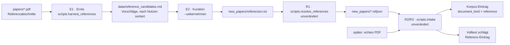

# Roadmap – Research-GraphRAG

Phasenweiser Umsetzungsplan für den persönlichen Scientific-GraphRAG-Assistenten. Der Plan ist **iterativ**: erst ein dünner, lauffähiger Durchstich, dann gezielte Ausbaustufen. **Bewusst ohne Zeitschätzungen** – Fortschritt wird über die „Definition of Done" (DoD) je Phase und über Meilensteine gemessen.

> Ergänzt die [README](README.md). **Die Phasen 0–8 sowie 11, 12 und 13 sind abgeschlossen** und hier nur noch als Ergebnis-Tabelle zusammengefasst; die vollständigen Status-Blockquotes mit allen Kennzahlen, korrigierten Annahmen und offen dokumentierten Abweichungen stehen wörtlich in der [Roadmap-Historie](docs/roadmap-historie.md). **Phase 13 steht ausnahmsweise noch vollständig hier**, weil [Phase 14](#phase-14--referenz-ernte-externe-verweise-aus-dem-eigenen-bestand) unmittelbar darauf aufbaut. **Phase 15** (Skalierung) ist mit G5 abgeschlossen (Status- und Ergebnis-Blöcke stehen noch vollständig hier, analog zu Phase 13); aktiv ist als Nächstes **Phase 14** (Referenz-Ernte), siehe [Bearbeitungsreihenfolge](#der-aktive-plan--bearbeitungsreihenfolge) – sie beginnt vor jedem Code mit einer Mess- und Hinterfragungs-Stufe. Aus den Phasen 9 und 10 ist je ein Restpunkt offen ([S2](#s2--volltext-holen-opt-in-lizenz-whitelist) zurückgestellt, [V4](#v4--global-community-ranking-über-die-mitglieds-chunks-erst-messen-dann-entscheiden) nachgelagert).

---

## Leitprinzipien

- **Lean & container-frei:** reine Python-Umgebung, kein Docker-/DB-Server.
- **Provenienz zuerst:** jede Antwort ist auf Paper/Abschnitt/Seite rückführbar.
- **Inkrementell nutzbar:** neue PDFs per Drop-in-Ordner + Skript, ohne alles neu aufzusetzen.
- **Klein, aber wachstumsfähig:** **gemessene Auslegung (2026-09-01, [Phase 15 / G5](#g5--auslegung-neu-festschreiben)): ≤ 750 Volltexte / ≤ 1500 Gesamteinträge.** Die frühere Zahl „≤ 500 Paper" stammte aus der Zeit mit 145 Papern und war bei 468 bereits faktisch erreicht; die neue Zahl ist eine **direkt am Auslegungsstand nachgemessene** 5-s-Marke für eine kalte Einzelanfrage über **alle vier** Modi (nicht nur Basic) – Local reißt die Marke bereits zwischen 800 und 900 Papern, deutlich vor der aus G0.1 grob hergeleiteten 1000er-Zahl (siehe [ADR 0033](docs/adr/0033-response-latency-cache-and-persisted-tfidf-state-phase15.md) und den G5-Statusblock). Auch 750 ist eine **Marke, keine Wand für die Ewigkeit** – jenseits von 606 Papern sind Retrieval-Güte (G0.3) und Community-Lift (G0.4) nur strukturell, nicht inhaltlich validiert.
- **Offline zuerst:** umgesetzt ist die Offline-Variante (Option B, [ADR 0005](docs/adr/0005-graphrag-index-backend-open.md)); ein Netzzugriff bleibt eine **separat startbare Zusatzfunktion**, nie eine Voraussetzung.
- **Erst messen, dann bauen.** Das ist die wichtigste Lehre aus den Phase-7-Punkten und keine Floskel: In **A3** war die vermutete Ursache der `short_chunk`-Flut falsch (nicht die Seitengrenze, sondern die Überschriften-Heuristik), in **A4** bestätigte sich die Annahme „Fusion schlägt Einzelverfahren" nicht, in **A5** saß das Keyword-Rauschen nicht im Vektorraum, sondern in der Auswahlpolitik, in **A6** hätte eine nackte Coverage-Kennzahl die triviale Strategie gekürt, und in **A7** waren die vermuteten Signal-Konflikte mit 1 von 44 Fragen praktisch inexistent. Jede Ausbaustufe beginnt daher mit einer Wegwerf-Messung und einem **Abbruchkriterium**.
- **Präzision vor Recall**, wo Daten in den Korpus oder in den Graphen fließen ([ADR 0011](docs/adr/0011-intra-corpus-citation-graph-phase7.md)).

---

## Stand: Phasen 0–8, 11, 12 und 13 (abgeschlossen)

| Phase                                       | Ergebnis                                                                                                               | Entscheidung                                                                                                                                                                                 |
| ------------------------------------------- | ---------------------------------------------------------------------------------------------------------------------- | -------------------------------------------------------------------------------------------------------------------------------------------------------------------------------------------- |
| **0** – Fundament & Durchstich       | `pip install -e .`, Ingestion (`pypdf` → TF-IDF/SQLite), belegte Antwort; **M1** erreicht                   | [ADR 0002](docs/adr/0002-venv-and-offline-dependency-strategy.md) · [ADR 0003](docs/adr/0003-offline-test-and-coverage-tooling.md) · [ADR 0005](docs/adr/0005-graphrag-index-backend-open.md) |
| **1** – Migration                    | 145 Paper nach`papers/`, [`Übersicht.md`](Übersicht.md) portiert (reduzierter Umfang: `recherche/` ausgelassen) | –                                                                                                                                                                                           |
| **2** – Ingestion & Canonical Model  | Canonical-Schema, Section-Heuristik, Chunking, DOI/arXiv, Qualitätsreport, Übersicht-Entwürfe                       | [ADR 0006](docs/adr/0006-canonical-model-phase2-scope.md)                                                                                                                                     |
| **3** – GraphRAG-Index               | Paper-Ähnlichkeitsgraph (TF-IDF,*mutual top-k*) + Louvain-Communities + extraktive Zusammenfassungen                | [ADR 0007](docs/adr/0007-graphrag-index-phase3-option-b.md)                                                                                                                                   |
| **4** – Retrieval & Router           | Basic/Local/Global/DRIFT + Heuristik-Router + Provenienz-Assembler                                                     | [ADR 0008](docs/adr/0008-retrieval-and-query-router-phase4.md)                                                                                                                                |
| **5** – MCP-Server (stdio)           | Tools für Copilot, Fehlerübersetzung an der Grenze;**M2** erreicht                                             | [ADR 0009](docs/adr/0009-mcp-server-stdio-phase5.md)                                                                                                                                          |
| **6** – Drop-in & QS                 | atomarer Index-Swap,`scripts.status`, `scripts.qa`; **M3** erreicht                                          | [ADR 0010](docs/adr/0010-drop-in-workflow-and-qa-phase6.md)                                                                                                                                   |
| **7 / A1** – LLM-Bridge & Synthese   | `generation/`, nummerierte Evidenz mit Zitier-Contract, Tool `answer_question` (Sampling opt-in)                   | [ADR 0012](docs/adr/0012-llm-bridge-and-answer-synthesis-phase7.md)                                                                                                                           |
| **7 / A2** – Zitationsgraph          | deterministische`CITES`-Kanten aus dem Referenzabschnitt, `get_citations`                                          | [ADR 0011](docs/adr/0011-intra-corpus-citation-graph-phase7.md)                                                                                                                               |
| **7 / A3** – Chunking-Verfeinerung   | Reject-Regeln + Section-Absorption, Seite als Provenienz-**Range** statt Grenze                                  | [ADR 0013](docs/adr/0013-chunking-refinement-phase7.md)                                                                                                                                       |
| **7 / A4** – Hybrid-Retrieval        | handimplementiertes BM25 + TF-IDF per Rang-Fusion; Gold-Set und Harness entstehen                                      | [ADR 0014](docs/adr/0014-hybrid-retrieval-bm25-tfidf-phase7.md)                                                                                                                               |
| **7 / A5** – Rausch-Reduktion        | Textnormalisierung, Bibliografie-Reject-Regeln, Keyword-Politik                                                        | [ADR 0015](docs/adr/0015-noise-reduction-keywords-and-sections-phase7.md)                                                                                                                     |
| **7 / A6** – Quantitative Evaluation | Modi-Ebene, Diagnosen, Lift, eingefrorene Baseline mit qid-genauem Regressions-Check                                   | [ADR 0016](docs/adr/0016-quantitative-retrieval-evaluation-phase7.md)                                                                                                                         |
| **7 / A7** – Router-Härtung         | Match-Art je Signal,`basic` als Rückfallebene, ausgewiesene Konfidenz und Signale                                   | [ADR 0017](docs/adr/0017-router-hardening-phase7.md)                                                                                                                                          |
| **8** – Korpus-Zufluss & Intake      | dreistufige Dedup (`new_papers/` → `papers/`), Robustheits-Gate, atomarer Swap, append-only Übersicht (`Z`-IDs), `scripts.intake`; **M5** erreicht | [ADR 0019](docs/adr/0019-corpus-intake-new-papers-phase8.md)                                                                                    |
| **12** – Zitierfähigkeit            | `metadata/paper_metadata.json`, feldweise Auflösung (`manual > curated > resolved > extracted`), `get_reference`, Literaturangaben Harvard/APA; **M8** erreicht | [ADR 0025](docs/adr/0025-citable-paper-metadata.md) · [ADR 0026](docs/adr/0026-online-metadata-resolution.md)                                    |
| **9 / S0+S1** – Online-Kandidatensuche | arXiv + OpenAlex hinter injizierbarem Transport-Port, Dedup über die Intake-Logik, append-only Bericht; **M6** erreicht. **Offen:** [S2](#s2--volltext-holen-opt-in-lizenz-whitelist) (Volltext-Download) – bewusst zurückgestellt, Volltexte kommen von Hand | [ADR 0020](docs/adr/0020-online-candidate-search-phase9.md) · [ADR 0032](docs/adr/0032-system-proxy-autodetection.md) |
| **10 / V1–V3** – Retrieval-Vertiefung | Local mit fünf Seeds, DRIFT über die Community-Vereinigung mit Fallback, Multi-Hop gegen den Zitationsgraphen messbar; **M7** erreicht. **Offen:** [V4](#v4--global-community-ranking-über-die-mitglieds-chunks-erst-messen-dann-entscheiden) – nachgelagert, siehe Reihenfolge | [ADR 0021](docs/adr/0021-local-multi-seed-phase10.md) · [ADR 0022](docs/adr/0022-drift-community-union-and-fallback-phase10.md) · [ADR 0023](docs/adr/0023-multihop-citation-evaluation-phase10.md) |
| **11** – Betrieb & Datensicherheit | Sicherungsweg (B1), nachführbare Messgrundlage (B5), Graph-Grad geprüft und **verworfen** (B6), Auto-Watcher gestrichen (B4). **Aufgelöst:** B2/B3 sind in [Phase 15](#phase-15--skalierung-den-wachsenden-bestand-tragen) übergegangen – [Archiv](docs/roadmap-historie.md#phase-11--betrieb-robustheit--datensicherheit) | [ADR 0027](docs/adr/0027-corpus-backup-phase11.md) · [ADR 0028](docs/adr/0028-similarity-graph-degree-phase11.md) |
| **13** – Referenz-Einträge ohne Volltext | `*.refjson`-Stubs aus DOI/arXiv, `document_kind` bis in jeden Beleg, Nachrangigkeits-Guardrail (13 → **3** Regressionen ohne Totalverlust); **M9** erreicht – [Details unten](#phase-13--referenz-einträge-ohne-volltext) | [ADR 0029](docs/adr/0029-reference-stub-resolution-phase13.md) · [ADR 0030](docs/adr/0030-reference-entries-in-corpus-phase13.md) · [ADR 0031](docs/adr/0031-reference-contract-and-guardrail-phase13.md) |

**Nicht umgesetzt aus Phase 7:** der Punkt **A8** (inkrementelles Update, Auto-Watcher). Er ist in dieser Fassung aufgelöst – das inkrementelle Update lebt über B2 in [Phase 15 / G1](#g1--aufnahmepfad-begradigen-die-quadratischen-stellen) weiter (dort ausdrücklich als **Frage**, siehe [G0.5](#g05--erübrigt-sich-das-inkrementelle-update)), der Auto-Watcher ist [bewusst gestrichen](docs/roadmap-historie.md#b4--auto-watcher-bewusst-gestrichen) und wird durch den manuellen Intake der [Phase 8](docs/roadmap-historie.md#phase-8--korpus-zufluss-new_papers--intake) ersetzt.

> **Warum die Kennzahlen hier fehlen:** Sie stehen in den ADRs und in der [Historie](docs/roadmap-historie.md) und veralten dort nicht. Den **aktuellen** Bestand zeigt `python -m scripts.status`, die aktuelle Retrieval-Güte `python -m scripts.eval_retrieval`.

---

## Der aktive Plan – Bearbeitungsreihenfolge

Die Phasennummern sind **Kennungen, keine Reihenfolge** – Phase 13 wurde vor den Phasen 9–11
umgesetzt, und Phase 15 läuft vor Phase 14. Verbindlich ist diese Tabelle:

| # | Phase | Warum an dieser Stelle |
| --- | --- | --- |
| **1** | [Phase 15 – Skalierung](#phase-15--skalierung-den-wachsenden-bestand-tragen) | Die Auslegung „≤ 500 Paper" ist bei **468** faktisch erreicht, und die drei belegten Engstellen sitzen genau dort, wo der geplante Zufluss drückt. Wer zuerst zuführt und danach misst, misst ein anderes System. |
| **2** | [Phase 14 – Referenz-Ernte](#phase-14--referenz-ernte-externe-verweise-aus-dem-eigenen-bestand) | Baut auf der fertigen Kette aus Phase 13 auf und füllt den Bestand. Ihre Messungen E0.2/E0.3/E0.6 setzen voraus, dass Laufzeit und Community-Verhalten **vorher** bekannt und stabil sind. Zusätzlich liefert [G4](#g4--zuflussregel-und-ablösung-der-übersicht) die Stoppregel und das maschinenlesbare Relevanzurteil, ohne die die Auswahlregel der Ernte ein reines Popularitätsmaß bliebe. |
| **3** | [Phase 10 / V4 – Global-Ranking](#v4--global-community-ranking-über-die-mitglieds-chunks-erst-messen-dann-entscheiden) | V4 misst die Community-Ebene – und genau die verändern **beide** vorangehenden Phasen (mehr Paper, hunderte einchunkige Einträge). Eine Messung davor wäre nach Phase 14 Makulatur. Zieht [G0.4](#g04--trägt-die-community-struktur-den-gewachsenen-bestand) die Schwelle, wird V4 zur **Voraussetzung** und rückt vor Phase 14. |
| **–** | [Phase 9 / S2 – Volltext-Download](#s2--volltext-holen-opt-in-lizenz-whitelist) | **Bleibt zurückgestellt, ohne Termin.** Die Lizenzlage ist unverändert (arXiv weist im Feed keine Lizenz aus, OpenAlex bei 15 von 51 Treffern), und Volltexte werden bewusst von Hand beschafft. Der Punkt steht als dokumentierte Entscheidung, nicht als Vorhaben. |

**Zur Anordnung dieses Dokuments:** Zuerst kommen die abgeschlossenen Phasen mit ihren
Restpunkten (9, 10) und die Phase 13, auf der Phase 14 unmittelbar aufsetzt; danach folgen die
beiden **aktiven** Phasen in Bearbeitungsreihenfolge (15, dann 14); zuletzt die
querschnittlichen Abschnitte und die Meilensteine. Abgeschlossene Phasen werden nicht
umsortiert, sondern beim Abschluss in die [Historie](docs/roadmap-historie.md) überführt –
dieselbe Regel, nach der die Phasen 0–8, 11 und 12 dort stehen.

---

## Phase 9 – Online-Research-Modus (separat startbar)

> **Status: S0 beantwortet, S1 umgesetzt** ([ADR 0020](docs/adr/0020-online-candidate-search-phase9.md)).
> Der folgende S0-Befund (Messung vom 2026-08-03) entstand bewusst **ohne ADR** – S0 baut nichts
> und entscheidet keine Architektur. Mit der Umsetzung von S1 ist der dort formulierte Vorbehalt
> eingelöst: Die Entscheidung über Transport, Quellen und Sicherheitsgrenze steht jetzt im ADR.
> **S2 bleibt zurückgestellt.**
>
> **Ergebnis: die Phase entfällt nicht.** Beide Abbruchkriterien wurden geprüft und **nicht**
> ausgelöst. Wie in den Punkten A3–A7 und in Phase 8 hat die Messung die Vorgabe aber korrigiert.
>
> **1. Erreichbarkeit – die erste Messung hätte fehlgeleitet.** Ohne Proxy scheitert jede Anfrage
> bereits an der Namensauflösung (externes DNS tot, UDP/53 und ausgehendes TCP blockiert). Erst
> die Gegenprüfung fand die per **PAC-Datei** konfigurierte Proxy-Lage, die `urllib.getproxies()`
> nicht liest. Über den Proxy antworten: **arXiv 200** (nur mit `certifi` – die CA „Certainly"
> fehlt im Windows-Zertifikatsspeicher), **OpenAlex 200** (Kreditmodell: 1000 Einheiten, 10 je
> Anfrage ≈ 100 Abfragen), **Crossref 200** (1 Anfrage/s), **Semantic Scholar 429** (ohne
> API-Schlüssel unbrauchbar), **Unpaywall 422** (verlangt zwingend eine Kontakt-E-Mail, hier
> bewusst nicht gesetzt). Die offene Frage der Vorgabe ist damit beantwortet: Fachliches HTTP ist
> **nicht** blockiert – aber an eine **Proxy-Authentifizierung** gebunden (Negotiate/NTLM).
> `requests` beherrscht sie nicht; im Spike war ein selbst gebauter CONNECT-Tunnel nötig
> (Windows-gebunden, über `pyspnego`/`pywin32`). Die PAC-Datei ist ohne JS-Engine nicht
> auswertbar (`pypac`/`dukpy`/`js2py` fehlen) – der Proxy-Host müsste fest konfiguriert werden
> und kann sich ändern.
>
> **2. Werkzeuglage bestätigt:** `requests`, `httpx`, `urllib3` und `certifi` sind vorhanden,
> **`feedparser` fehlt** – `xml.etree` genügt für den Atom-Feed (praktisch belegt). Ein
> Fremd-Wheel ist nicht nötig.
>
> **3. Sinnhaftigkeit – die vermutete Schwachstelle war die falsche.** Drei Anfragen aus dem
> eigenen Bestand (zwei Communities, ein Seed-Paper) ergaben 51 Kandidaten. **13 lagen bereits im
> Korpus** und wurden von der **bestehenden** Phase-8-Logik erkannt; die Gegenprüfung fand
> **0 False Negatives** – das Akzeptanzkriterium aus S1 ist damit vorab erfüllt. Aufnahmequote
> **31/38 = 81,6 %** nach dem Kriterium „publiziert in den letzten fünf Jahren", nach
> zusätzlicher thematischer Sichtung **29/38 = 76,3 %**; beides liegt weit über der vorab
> festgelegten Schwelle von 30 %. Die Vorgabe befürchtete zu viele irrelevante Vorschläge –
> gemessen ist das Gegenteil, und der **wirksamste Filter ist trivial**: Das Publikationsjahr
> fängt 6 der 8 korpusfremden Treffer, weil OpenAlex nach Zitationszahl rankt und alte Klassiker
> hochspült. Der Engpass ist die **Sichtung**, nicht das Finden.
>
> **Grenze dieser Zahl, offen ausgewiesen:** Sie beruht auf einer mechanischen Jahresregel, nicht
> auf inhaltlicher Kuratierung – also eine **Obergrenze**, kein bestätigter Kurationswert.
> Aufgedeckt wurden außerdem **3 Dubletten innerhalb** der Kandidatenliste (dasselbe Paper aus
> arXiv und OpenAlex unter verschiedenen Identifikatoren): Eine quellenübergreifende
> Titel-Deduplikation gehört in S1.
>
> **Empfehlung – engerer Zuschnitt als geplant:** **S1 umsetzen, aber nur mit arXiv + OpenAlex.**
> Crossref rankt schlechter und liefert Abstracts nur lückenhaft (1 von 3), Semantic Scholar
> braucht einen API-Schlüssel, Unpaywall eine Kontakt-E-Mail. Ein **Aktualitätsfilter** wird
> Default. **S2 (Volltext-Download) bleibt zurückgestellt:** Die geforderte Lizenz-Whitelist ist
> auf dieser Datenbasis nicht sauber bedienbar – arXiv weist im Feed **keine** Lizenz aus,
> OpenAlex nur bei 15 von 51 Treffern; der Volltext-Link im Bericht macht den manuellen Abruf
> ohnehin zu einem Klick.
>
> **Nebenbefund (datiert, unbewertet):** Über denselben authentifizierten Proxy antwortet auch
> **PyPI mit HTTP 200**. Die Grundannahme „kein PyPI-Zugang" aus
> [ADR 0002](docs/adr/0002-venv-and-offline-dependency-strategy.md) und
> [ADR 0005](docs/adr/0005-graphrag-index-backend-open.md) gilt in dieser Form nicht mehr. Ob
> `pip` diesen Weg nutzen könnte (es beherrscht kein Negotiate) und ob das den
> Unternehmensrichtlinien entspricht, wurde **nicht** geprüft – es wurde nichts installiert.

**Ziel:** Ein **manuell gestarteter, vom Kern getrennter** Modus, der zu einem Thema oder einem Seed-Paper neue Quellen im Netz sucht und – nur auf ausdrücklichen Wunsch – frei lizenzierte Volltexte nach `new_papers/` legt, wo [Phase 8](docs/roadmap-historie.md#phase-8--korpus-zufluss-new_papers--intake) sie übernimmt.

**Abgrenzung, die nicht verhandelbar ist:** Der Kern bleibt netzfrei. Ohne Internet funktioniert alles Bisherige unverändert. Insbesondere bekommt der MCP-Server **kein** Netz-Tool im ersten Schritt – er wird von Copilot autonom aufgerufen, und niemand soll durch eine beiläufige Frage ungewollten Netzverkehr auslösen.

### S0 – Recherche & Machbarkeit (zwingend zuerst, mit Abbruchkriterium)
_Modell-Tipp: Claude Opus 5._

Dieser Schritt ist der Grund, warum die Phase überhaupt so geschnitten ist: **Es ist offen, ob das hier sinnvoll und überhaupt möglich ist.** Zu klären, bevor eine Zeile Code entsteht:

1. **Erreichbarkeit messen, nicht annehmen.** Das Repo entstand in einem Umfeld **ohne PyPI-Zugang** ([ADR 0002](docs/adr/0002-venv-and-offline-dependency-strategy.md)) – daraus folgt *nicht*, dass fachliches HTTP blockiert ist, aber es ist unbewiesen. Zu prüfen sind je ein Minimal-Request gegen die Kandidaten (arXiv-API, Crossref, OpenAlex, Semantic Scholar, Unpaywall) inklusive Proxy- und TLS-Verhalten. Dieselbe Methodik wie bei [ADR 0005](docs/adr/0005-graphrag-index-backend-open.md), wo die Beschaffbarkeit empirisch geprüft und die Architektur danach ausgerichtet wurde.
2. **Werkzeuglage (bereits gemessen):** `requests` und `httpx` sind offline vorhanden, `urllib` ohnehin; `feedparser` fehlt – die Atom-Antwort der arXiv-API müsste also über `xml.etree` aus der Standardbibliothek gelesen werden. Ein Fremd-Wheel ist für diese Phase **nicht** nötig.
3. **Quellenauswahl nach harten Kriterien:** API-Schlüssel nötig? Rate-Limit? Abdeckung für einen arXiv-/CS-lastigen Korpus? Liefert sie Abstracts? Weist sie **Lizenz** und Volltext-Link aus? Was sagen die Nutzungsbedingungen zur automatisierten Abfrage?
4. **Die unbequeme Frage: Lohnt es sich?** Der Korpus ist **kuratiert** – `Übersicht.md` bewertet Relevanz und ordnet Sub-Forschungsfragen zu. Ein Automat, der pro Lauf 50 Kandidaten ausspuckt, erzeugt Kurationsarbeit, statt sie zu sparen. Zielgröße ist deshalb **Präzision der Vorschläge, nicht deren Menge** – gemessen an einer simplen Frage: Wie viele Vorschläge eines Laufs würde man tatsächlich in die Übersicht aufnehmen?

*Abbruchkriterium:* Ist keine Quelle erreichbar, ist die Rechtslage unklar, oder liefert eine Handprobe überwiegend Irrelevantes, **entfällt die Phase** – dokumentiert, wie in A5 die verworfene Seitenbereichs-Regel und die verworfene Stopword-Variante im Vektorraum.

### S1 – Kandidaten finden (Metadaten, kein Download)
_Modell-Tipp: Claude Opus 5._

> **Status: umgesetzt** ([ADR 0020](docs/adr/0020-online-candidate-search-phase9.md)) – mit einem
> **engeren Zuschnitt** als unten vorgesehen, entlang der S0-Messung.
>
> **Umgesetzt ist** das Paket `src/research_graphrag/online/` (fünf Module) plus das dünne
> `scripts/discover.py`. Der Netzzugang liegt hinter einem **injizierbaren Port**: Nur
> `transport.py` öffnet eine Verbindung, alles andere – Anfragebildung, Quellen-Adapter,
> Deduplikation, Bericht – ist netzfrei und offline getestet. Der Proxy-Endpunkt kommt
> ausschließlich aus `RESEARCH_GRAPHRAG_PROXY`; ein Unternehmens-Hostname gehört nicht ins
> Repository.
>
> **Abweichungen von der Vorgabe unten, jeweils aus S0 begründet:**
>
> * **Zwei Quellen statt fünf** – arXiv und OpenAlex. Crossref rankt schlechter und liefert
>   Abstracts nur lückenhaft, Semantic Scholar braucht einen API-Schlüssel, Unpaywall eine
>   Kontakt-E-Mail.
> * **Keine freie Suchanfrage** (Punkt c der Vorgabe). Der Wert des Modus liegt im Bezug zum
>   eigenen Bestand; eine freie Suche könnte eine gewöhnliche Websuche besser.
> * **Aktualitätsfilter als Default** (letzte fünf Jahre, per `--seit` übersteuerbar). In S0 war
>   das Publikationsjahr der **wirksamste** Rauschfilter – es fängt 6 von 8 korpusfremden
>   Treffern, weil OpenAlex nach Zitationszahl rankt und alte Klassiker hochspült.
>
> **Über die Vorgabe hinaus** schließt S1 eine in S0 aufgedeckte Lücke: Dasselbe Paper erscheint
> bei beiden Quellen unter **verschiedenen** Identifikatoren (3 von 51 Treffern). Kandidaten werden
> deshalb zusätzlich **quellenübergreifend** über den normalisierten Titel zusammengeführt.
>
> **Akzeptanz erfüllt:** Die Deduplikation nutzt die **bestehende** Intake-Logik (kein zweiter
> Mechanismus) und wies in S0 **null** bereits vorhandene Paper als neu aus; ohne Netz endet der
> Modus in `dependency_error` mit handlungsleitender Meldung statt in einem Stacktrace, und der
> Bericht nennt zu jedem Vorschlag die auslösende Anfrage. Weil Titel und Abstracts **nicht
> vertrauenswürdige** Fremdeingaben sind, werden sie vor dem Schreiben entschärft – ein Punkt, den
> die Vorgabe nicht nennt.

- **Die Anfrage kommt aus dem eigenen Bestand**, nicht aus freier Eingabe allein: (a) Keywords einer Community aus `list_topics`, (b) Titel/Identifikator eines Seed-Papers im Sinne von „mehr wie dieses", (c) optional eine freie Suchanfrage.
- **Kandidaten werden gegen den eigenen Korpus dedupliziert** – mit **derselben** DOI-/arXiv-/Titel-Logik wie in Phase 8. Ein zweiter Dedup-Mechanismus wäre eine Fehlerquelle.
- **Ausgabe append-only** nach `data/online_candidates.md`: Titel, Quelle, Identifikator, Jahr, Abstract-Auszug, Lizenz, Link – und **warum** vorgeschlagen (welche Anfrage, welche Community). Ohne diese Begründung ist eine Empfehlung nicht prüfbar.
- **Reproduzierbarkeit:** Netzantworten sind nicht deterministisch. Die Rohantwort wird mit Zeitstempel abgelegt, damit ein Befund später nachvollziehbar bleibt (CONTRIBUTING, Leitprinzip „Reproduzierbarkeit").
- *Akzeptanz:* Ein Lauf gegen eine reale Community liefert plausible Kandidaten; in einer Stichprobe sind **null** bereits vorhandene Paper als „neu" ausgewiesen; ohne Netz bricht der Modus **sauber** ab (klare Meldung, kein Stacktrace, kein halber Zustand).

### S2 – Volltext holen (opt-in, Lizenz-Whitelist)
_Modell-Tipp: Claude Opus 5._

- **Nur mit explizitem Flag** (`--download`), nie als Standard.
- **Nur bei frei lizenzierten Quellen** (Whitelist, z. B. CC0/CC-BY/CC-BY-SA und die arXiv-Lizenzen). Alles andere wird **nicht** geladen, sondern nur als Link berichtet. Eine Umgehung von Bezahlschranken ist ausgeschlossen.
- **Ziel ist ausschließlich `new_papers/`**; die Übernahme in den Korpus macht Phase 8. Es gibt genau **einen** Weg in den Korpus, nicht zwei.
- **Sicherheitsauflagen – heruntergeladene PDFs sind nicht vertrauenswürdiger Input:** Content-Type und Größe werden vor dem Schreiben geprüft; der Dateiname wird **selbst erzeugt** (aus Identifikator/Titel, nie aus der Serverantwort → kein Pfad-Traversal); ein Request pro Datei mit Rate-Limit, Timeout und identifizierendem User-Agent; kein Bulk-Crawl. Das Robustheits-Gate aus Phase 8 fängt anschließend defekte oder textlose Dateien ab.
- *Akzeptanz:* Eine geladene Datei durchläuft den Intake regulär; ein nicht frei lizenzierter Treffer wird nachweislich **nicht** geladen; ein Netzfehler hinterlässt keine halbe Datei.

### Bewusst ausgeschlossen

Vollautomatischer Dauerbetrieb, Hintergrund-Suche, automatische Übernahme ohne Sichtung, Umgehung von Zugangsbeschränkungen. Der Mensch entscheidet, was in den Korpus kommt – andernfalls verliert die kuratierte Übersicht ihren Sinn und der Korpus seine Qualität.

### Definition of Done

S0 ist beantwortet und dokumentiert (auch ein „lohnt sich nicht" ist ein gültiges Ergebnis). Bei positivem Befund liefert S1 einen belegten, deduplizierten Kandidaten-Bericht; S2 bleibt opt-in und lizenzgebunden.

---

## Phase 10 – Retrieval-Vertiefung (die belegten Befunde abarbeiten)

**Ziel:** Die drei Schwachstellen beheben, die [ADR 0016](docs/adr/0016-quantitative-retrieval-evaluation-phase7.md) **belegt, aber bewusst nicht behoben** hat. Diese Punkte sind die am besten begründeten im ganzen Repo: Der Messapparat existiert bereits (`--modi`, eingefrorene Baseline, qid-genauer `--check` mit Fingerprint-Guard), also ist jede Änderung **vor** dem Bauen abschätzbar und **nach** dem Bauen gegen Regression abgesichert.

### V1 – Local: mehrere Seeds statt eines
_Modell-Tipp: Claude Opus 5._

> **Status: umgesetzt** ([ADR 0021](docs/adr/0021-local-multi-seed-phase10.md)) – mit einem
> **größeren *m*** als hier vorgeschlagen und einer **verworfenen** Teilmaßnahme.
>
> Das Abbruchkriterium wurde geprüft und **nicht** ausgelöst: *m* = 3 hebt die erreichbare
> Deckelung von **17 auf 28** von 34 Gold-Fragen. Wie schon in den Punkten A3–A7 hat die
> Vorabmessung die Vorgabe aber korrigiert – gleich dreifach.
>
> **1. *m* = 3 genügt nicht.** Das volle Bündel erreicht bei *m* = 3 nur 0,853 / 0,642 und bei
> *m* = 4 nur 0,882 / **0,648** – beide bleiben unter Basics MRR von 0,650. Nach der **vorab**
> festgelegten Regel (kleinstes *m*, das auf **beiden** Kennzahlen nicht unterlegen ist) fällt die
> Wahl auf **`DEFAULT_SEEDS = 5`**: **0,912 / 0,654** gegen Basic 0,882 / 0,650. Die
> Diagnose-Verteilung verschiebt sich wie erwartet von seed **17** auf **30**.
>
> **2. Das Akzeptanzkriterium dieser Vorgabe misst weniger, als es verspricht.** „Local erreicht
> mindestens die Basic-Werte" ist bei *m* = *k* **definitorisch** erfüllt, weil Locals Bündel dann
> Basics Top-*k* enthält. Es taugt – wie das End-to-End-Maß in A7 – nur als **Veto**. Der
> substanzielle Nachweis ist deshalb ein anderer: **0 Regressionen** bei **13** qid-genauen
> Verbesserungen, und **eine** Frage (G11), die Local findet und Basic@5 verfehlt. Offen
> ausgewiesen bleibt, dass Nachbarschaft (1 Treffer) und Fan-out (0) zur Kennzahl kaum beitragen –
> ihr Wert ist Kontext, und der ist mit diesem Gold-Set nicht messbar.
>
> **3. Der Fan-out wurde erweitert gemessen und **nicht** erweitert.** Die naheliegende
> Vereinigung über alle Seed-Paper ändert bei *m* = 5 **keine** der 34 Fragen; er bleibt daher am
> Ankerpaper. Ebenfalls verworfen – obwohl **besser** messend (0,941 / 0,664) – ist die Variante
> „Seeds aus verschiedenen Papern": Die paper-basierten Labels bilden ihren Preis nicht ab, denn
> sie verdrängt die zweitbeste Passage **desselben** Papers, also genau die Evidenz einer
> Detailfrage.
>
> **Über die Vorgabe hinaus** ist der Contract ehrlich gemacht: `LocalSearchResult.seed` heißt
> jetzt `seeds` und ist eine Liste (Spec `0.2.0`, bewusster Bruch). Eine Festlegung aus
> [ADR 0008](docs/adr/0008-retrieval-and-query-router-phase4.md) ist damit abgelöst. Kein
> Schema-Eingriff, **kein Re-Ingest**; `--check` belegt qid-genau, dass Primitive, Basic, Global
> und DRIFT **unberührt** bleiben.

*Befund:* Local erreicht Hit@5 **0,618** / MRR **0,532**, Basic dagegen **0,882** / **0,650**. Der Modus, den der Fragetyp-Contract der README für **Detailfragen** vorsieht, ist damit schwächer als seine eigene Rückfallebene. Die Diagnose zeigt warum: Von den Treffern stammen **17** vom Seed, **3** aus der Chunk-Nachbarschaft und **1** aus dem Paper-Fan-out. Das ist kein Ranking-, sondern ein Strukturproblem – Nachbarschaft und Fan-out messen Ähnlichkeit **zum Seed**, nicht zur Frage. Ist der Top-1-Seed falsch, ist das ganze Bündel verloren.

*Vorschlag:* Statt eines Seeds die Top-*m* der Hybrid-Wertung verwenden, die Nachbarschaft je Seed bilden und die Teilrankings per **Reciprocal Rank Fusion** zusammenführen – der Baustein liegt seit A4 in `indexing/fusion.py`.

*Erst messen:* Vorab auszählen, in wie vielen Gold-Fragen das erwartete Paper unter den Top-*m* Seeds liegt. **Hebt `m = 3` die erreichbare Deckelung nicht, entfällt der Punkt.**

*Akzeptanz:* Local erreicht mindestens die Basic-Werte; die Diagnose-Verteilung verschiebt sich nachweisbar; `--check` meldet keine qid-Regression; Determinismus und `Citation`-Contract unverändert.

### V2 – DRIFT: Community-Auswahl statt Top-1, mit Rückfallebene
_Modell-Tipp: Claude Opus 5._

> **Status: umgesetzt** ([ADR 0022](docs/adr/0022-drift-community-union-and-fallback-phase10.md)) –
> beide Maßnahmen wie vorgesehen, aber mit einer **korrigierten Lesart der Akzeptanzkriterien**.
>
> **1. Beide Kriterien unten sind rechnerisch vorbestimmt.** DRIFTs erreichbare Deckelung bei
> *m* Communities **ist** Globals `in_community` bei *n* = *m* – die geforderte „Deckelung ≥ 12"
> tritt allein dadurch ein, dass *m* = 5 gewählt wird; und „`no_community` geht auf 0" ist
> trivial, sobald ein Fallback existiert. Gemessen wurde deshalb an zwei anderen Fragen.
>
> **2. Die wichtigere Frage stand nicht in der Vorgabe – und ging gut aus.** Die heutige
> Fehlerfreiheit der Verfeinerung beruhte darauf, dass sie über **eine** Community rankt; mit der
> Vereinigung rankt sie über ein Vielfaches. Ergebnis: **keine** einzige zuvor gewonnene Frage
> geht verloren, zwei rutschen um einen Rang (G13, V12 – jeweils 1 → 2). Die Treffer des
> Community-Pfades steigen von **8 auf 11**, die Deckelung von **8 auf 12**. Bemerkenswert: *m* = 2
> und *m* = 3 gewinnen zwar eine Frage, **verschlechtern** aber den MRR – nur *m* = 5 verbessert
> beides. Ein am Gold-Set noch besseres *m* = 8 wurde **verworfen** (eine Frage von 34 =
> Overfitting; 5 ist zudem der Default der Global Search).
>
> **3. Der Fallback trägt die Hälfte der Treffer – und zwar als Basic.** Mit Fallback erreicht
> DRIFT **0,647 / 0,525**; er greift 12× und trifft dabei 11×. Von 22 Treffern stammen damit 11
> aus der corpusweiten Suche. Die Aggregatzahl wäre ohne diese Aufteilung irreführend, deshalb
> weist die Evaluation den Fallback als **eigene Diagnose** aus.
>
> **Zwei Befunde über die Vorgabe hinaus:** Die Vereinigung kann überhaupt nur bei **15 von 34**
> Fragen wirken (für 12 scort keine Community über 0, für 7 genau eine) – der Engpass ist das
> dünne Community-Dokument und damit **V4**. Und die in A6 gefeierte Eigenschaft
> „Treffer == Deckelung" ist **aufgegeben** (11 von 12): Bei G15 wächst die Kandidatenmenge auf 33
> Paper, und die Verfeinerung verfehlt das Ziel erstmals trotz erreichter Deckelung.
>
> `DriftSearchResult.community` heißt jetzt `communities` und ist eine Liste, neu ist `fallback`
> (Spec `0.2.0`, bewusster Bruch – sonst behäuptete die Antwort eine falsche Herkunft). Ein
> **defekter** Index bleibt ein Fehler. Kein Schema-Eingriff, **kein Re-Ingest**; `--check` belegt
> qid-genau, dass Primitive, Basic, Local und Global **unberührt** bleiben.

*Befund:* DRIFT erreicht **0,235 / 0,235** – und die Diagnose ist ungewöhnlich eindeutig: Treffer (8) und erreichbare Deckelung (8) sind **identisch**. Die lokale Verfeinerung arbeitet also **fehlerfrei**; **100 %** der Fehlschläge entstehen davor, in der Community-Wahl: **12×** wurde gar keine Community gefunden, **14×** die falsche. Global erreicht mit fünf Communities **12** Fragen – die Beschränkung auf die Top-1-Community kostet DRIFT damit rund ein Drittel.

*Vorschlag:* (a) Kandidatenmenge aus den Top-*m* Communities vereinigen statt nur der besten; (b) wird **gar keine** Community gefunden, sichtbar auf Basic zurückfallen statt leer zu liefern – dasselbe Muster, das A7 im Router etabliert hat (Rückfallebene mit ausgewiesener Konfidenz, nicht stilles Scheitern).

*Akzeptanz:* Die erreichbare Deckelung steigt von 8 auf ≥ 12; die Diagnose `no_community` geht auf 0, und zwar durch einen **ausgewiesenen** Fallback, nicht durch Verstecken; Determinismus; `--check` ohne Regression.

### V3 – Multi-Hop-Fragen gegen den Zitationsgraphen messbar machen
_Modell-Tipp: Claude Opus 5._

> **Status: umgesetzt** ([ADR 0023](docs/adr/0023-multihop-citation-evaluation-phase10.md)) – mit
> **einem korrigierten Anspruch** und **einer entlarvten Vorgabe-Annahme**.
>
> Das vorab fixierte Abbruchkriterium (strukturelle Ebene auf Zufallsniveau **und** über 80 %
> der Titel-Treffer aus Referenz-Chunks) wurde geprüft und **nicht** ausgelöst. Wie in den
> Punkten A3–A7 und V1/V2 hat die Vorabmessung die Vorgabe aber an drei Stellen korrigiert.
>
> **1. Der Ähnlichkeitsgraph trägt Zitationsnähe – erstmals beziffert.** Die neue **strukturelle**
> Ebene fragt ohne jeden Text: Enthalten die Top-5-Nachbarn eines Ankerpapers die Paper, die es
> zitieren? Coverage **0,181** bei Selektivität **0,022** ergibt einen **Lift von 8,20** gegen
> **0,98** einer gleich großen Zufallsauswahl. Das ist die erste Zahl überhaupt zum
> GraphRAG-Anspruch des Paper-Graphen.
>
> **2. Die naheliegende Fragenform nimmt eine lexikalische Abkürzung.** „Welche Paper bauen auf
> *Titel* auf?" wird zu einem guten Teil über das **Literaturverzeichnis** der zitierenden Paper
> beantwortet – gemessen **22 von 33** Basic-Treffern und **26 von 42** Local-Treffern. Die
> Abkürzung wird nicht versteckt, sondern als Diagnose (`:ref` statt `:body`) ausgewiesen, und
> eine zweite Anfrageform aus den **Themen-Termen** des Ankers dient als Gegenprobe – sie kommt
> ohne einen einzigen Referenz-Treffer aus. Ebenso fest verdrahtet: Das **Ankerpaper verlässt
> jedes Bündel**, weil es per Konstruktion nie ein erwartetes Paper sein kann, aber die vorderen
> Ränge besetzt (MRR 0,428 → **0,701** allein dadurch).
>
> **3. Der Zusatznutzen unten ist logisch nicht erreichbar – und das ist der wichtigste Befund.**
> Aus `citation_edges` abgeleitete Labels können eine **fehlende** Kante nicht sichtbar machen;
> der offene Recall aus [ADR 0011](docs/adr/0011-intra-corpus-citation-graph-phase7.md) bleibt
> offen. Ausgewiesen werden stattdessen **mechanische Schranken**: 2 von 145 Papern ohne
> erkannten Referenzabschnitt, 3 mit zu kurzem Titel, 15 ohne frontmatter-belegten Identifikator
> – und damit **genau 1** Paper, das als Ziel strukturell unerreichbar ist. Eine obere Grenze
> der Vollständigkeit, kein gemessener Recall.
>
> **Ergebnis:** Auf dieser Ebene **schlägt Local den Basic-Modus deutlich** (0,955 vs. 0,750 bei
> der Titel-Form, 0,636 vs. 0,250 bei der Themen-Form) – die Struktur zahlt sich genau dort aus,
> wo der README-Contract sie vorsieht. Nebenbei ist ein Befund aus
> [ADR 0016](docs/adr/0016-quantitative-retrieval-evaluation-phase7.md) als Artefakt des
> fakt-orientierten Gold-Sets entlarvt: „Der Fan-out rettet 1 von 34 Fragen" – hier steuert er
> **13 von 28** Treffern der Themen-Anfrage bei.
>
> **Bewusst anders als unten:** `get_citations` wird **nicht** als Kennzahl geführt (es liest
> dieselbe Tabelle wie die Labels, jede Zahl wäre 1,000 by construction), sondern als
> Contract-Test und als ausgewiesener trivialer Oberwert. Gold-Set und Baseline sind **eigene**
> Artefakte statt einer Erweiterung der bestehenden – sonst mischten sich zwei unvergleichbare
> Fragetypen in dieselben Aggregate, und jeder Regressions-Check dauerte ein Vielfaches
> (siehe [B3](docs/roadmap-historie.md#phase-11--betrieb-robustheit--datensicherheit)). Kein Schema-Eingriff, **kein Re-Ingest**, und
> **keine** Retrieval-Änderung: Die Messung bestätigt den Contract, statt ihn zu widerlegen.

*Lücke:* Das Gold-Set enthält ausschließlich **lexikalisch verankerte** Fragen. Der Fragetyp „Zitations-/Methodennetze (Multi-Hop)" aus dem README-Contract ist damit **überhaupt nicht gemessen** – obwohl mit **382 `CITES`-Kanten** und **44 Papern mit ≥ 3 zitierenden Quellen** eine objektive, **nicht-lexikalische** Labelquelle bereitsteht. A6 hat genau diesen Schritt als „naheliegendsten nächsten ohne Subjektivität" benannt und die Architektur dafür vorbereitet: `GoldQuestion` weist die **Label-Quelle** aus, damit weitere Quellen additiv danebentreten können.

*Zusatznutzen – und der eigentliche Grund für die hohe Priorität:* [ADR 0011](docs/adr/0011-intra-corpus-citation-graph-phase7.md) belegt ausdrücklich nur die **Präzision** des Zitationsgraphen (alle Kanten mechanisch im Referenztext belegt, Stichproben durchweg korrekt) und lässt den **Recall offen**. Mit Multi-Hop-Labels wird dieser blinde Fleck erstmals sichtbar. Zugleich löst der Punkt den in A6 zurückgestellten Wunsch nach „inhaltlich statt lexikalisch" abgeleiteten Labels auf – **ohne** die Nachrechenbarkeit aufzugeben, denn die Kanten sind mechanisch verifizierbar.

*Akzeptanz:* neue Label-Quelle neben der mechanischen; Fragen deterministisch aus dem Graphen erzeugt („welche Paper bauen auf *X* auf?"); `--verify-labels` prüft sie gegen `citation_edges`; gemessen werden `get_citations` und der Local-Fan-out; die Baseline wird um diese Ebene erweitert.

### V4 – Global: Community-Ranking über die Mitglieds-Chunks (erst messen, dann entscheiden)
_Modell-Tipp: Claude Opus 5._

*Befund:* Global erreicht **0,353 / 0,269** bei einem Lift von **3,55** gegen ≈ **1,0** bei beiden Trivial-Baselines – die Auswahl ist also klar besser als Zufall, die Coverage bleibt mit **0,248** aber niedrig. *Verdacht:* Das Ranking vergleicht die Frage gegen einen sehr **dünnen** Text – zehn Keywords plus eine extraktive Zusammenfassung je Community. Die eigentliche Textmasse der Mitglieder bleibt ungenutzt.

*Vorschlag:* Den Community-Score aus den Chunk-Scores der Mitglieder aggregieren (die Hybrid-Wertung existiert bereits); Keywords und Zusammenfassung bleiben für die Darstellung.

*Akzeptanz – bewusst als Frage formuliert:* Hebt die Aggregation Lift **und** Coverage bei gleicher Selektivität? Falls nein, wird der Punkt **verworfen und der Befund dokumentiert** – genau so, wie in A5 die naheliegende Variante „Stopwords in den Vektorraum" nach der Messung verworfen wurde, weil sie den Graphen ohne belegbaren Nutzen verschoben hätte.

> **Reihenfolge: nach Phase 15 und Phase 14** ([Begründung](#der-aktive-plan--bearbeitungsreihenfolge)). V4 misst die Community-Ebene – und die verändern beide vorangehenden Phasen: Phase 15 durch den gewachsenen Bestand, Phase 14 durch hunderte einchunkige Referenz-Einträge. Eine Messung davor wäre danach Makulatur. **Ausnahme:** Verfehlt [G0.4](#g04--trägt-die-community-struktur-den-gewachsenen-bestand) seine Schwelle, ist V4 keine Kür mehr, sondern Voraussetzung – dann rückt der Punkt vor Phase 14, und das wird dort vermerkt statt umgangen.

---

## Phase 13 – Referenz-Einträge ohne Volltext

> **Status: R0 beantwortet, R1 und R2 umgesetzt** (Messung vom 2026-08-09, bewusst **ohne ADR** –
> R0 baut nichts und entscheidet keine Architektur; dieselbe Handhabung wie bei [S0](#s0--recherche--machbarkeit-zwingend-zuerst-mit-abbruchkriterium)
> und [B6](docs/roadmap-historie.md#b6--grad-des-ähnlichkeitsgraphen-geprüft-verworfen)). Gemessen wurde gegen den
> Korpusstand **373 Paper / 26 003 Chunks / 118 Communities / 1481 `CITES`-Kanten**. Kein
> Produktivcode, kein Schema-Eingriff, kein Re-Ingest; die Wegwerf-Skripte sind gelöscht, die
> Rohantworten liegen unter `data/online_probe/` (nicht versioniert). Die Umsetzungen stehen in
> [ADR 0029](docs/adr/0029-reference-stub-resolution-phase13.md) und
> [ADR 0030](docs/adr/0030-reference-entries-in-corpus-phase13.md) samt den Statusblöcken bei
> [R1](#r1--auflösung--stub-erzeugung-kein-volltext-download) und
> [R2](#r2--intake--index-der-zweite-dokumenttyp); **R3 ist offen.**
>
> **Ergebnis: die Phase entfällt nicht, aber ihr Zuschnitt ändert sich an einer Stelle** – die
> Guardrail aus [R3](#r3--wirkung-sichern-contract-baselines-guardrail) ist **nicht länger
> bedingt, sondern gesetzt.**
>
> **Validitätsanker zuerst** (Pflicht seit V1): Der Nachbau der Zitationskanten aus
> `data/canonical/` liefert **1481 von 1481** Kanten identisch zum Index. Erst damit sind die
> daraus abgeleiteten Zahlen belastbar.
>
> **1. Ausbeute – die Vorgabe war zu pessimistisch, weil sie die falsche Quelle unterstellte.**
> Die Roadmap leitete ihre Skepsis aus **Crossref** ab („Abstracts nur bei rund einem Drittel").
> Gemessen wurde der Weg, den [R1](#r1--auflösung--stub-erzeugung-kein-volltext-download)
> tatsächlich nähme – **OpenAlex** (DOI direkt bzw. über den DataCite-DOI) mit dem arXiv-Feed als
> Rückfall. Von **60** abgefragten Kennungen sind 4 unbrauchbare Extraktionsartefakte (siehe
> Punkt 2); von den **56 gültigen** löste OpenAlex/arXiv **56** auf und lieferte für **52 = 93 %**
> einen Abstract. Entscheidend ist die Untergruppe, um die es der Phase geht: Bei den Werken mit
> echter Bezahlschranke (`oa_status = closed`) sind es **6 von 7**. Die vier Fehlschläge verteilen
> sich auf `closed`, `green` und **zweimal `gold`** – die Abstract-Verfügbarkeit hängt also
> **nicht** am Zugang zum Volltext. Die 50-%-Schwelle ist damit deutlich übertroffen: Die
> Online-Auflösung bleibt der **Hauptweg**, der manuelle Weg die Ausnahme. *Offen ausgewiesen:*
> **8 der 52** Abstracts sind mit unter 60 Wörtern (Minimum 28) eher Fragment als Abstract –
> überwiegend Einträge der ACL Anthology.
>
> **2. Nutzen für den Zitationsgraphen – das stärkste Argument der Phase hält, aber erst nach drei
> Korrekturen.** Roh gezählt tragen die Referenzabschnitte 3634 verschiedene DOI-/arXiv-Werte, die
> auf kein Korpus-Paper zeigen. Diese Zahl ist **zu hoch**, und zwar aus drei mechanisch
> nachweisbaren Gründen: **95** DOIs sind am Zeilenumbruch **abgeschnitten** (`10.18653/v1/` ist
> ein Präfix jedes ACL-Eintrags – solche Rümpfe passen auf viele Einträge und werden dadurch in
> der Häufigkeitsliste nach **oben** gespült, genau dort, wo man sie am wenigsten vermutet),
> **127** sind DataCite-Dubletten (`10.48550/arXiv.X` **und** `X`), und **42** treffen doch ein
> Korpus-Paper, dessen Identifikator nur den Frontmatter-Guard aus
> [ADR 0011](docs/adr/0011-intra-corpus-citation-graph-phase7.md) nicht passiert hat. Bereinigt
> bleiben **3371** tote Identifikatoren (1106 DOI / 2265 arXiv), davon **702** von mindestens
> **zwei** und **349** von mindestens **drei** Korpus-Papern zitiert. Beide vorab fixierten
> Schwellen sind damit klar übertroffen (gefordert: ≥ 50 mehrfach zitierte Werte und ≥ 10 % des
> Kantenbestands).
>
> | Aufgenommene Referenz-Einträge | Neue `CITES`-Kanten | gemessen am Bestand 1481 |
> | --- | --- | --- |
> | Top 10 | 307 | +21 % |
> | Top 25 | 505 | +34 % |
> | Top 50 | 742 | +50 % |
> | Top 100 | 1074 | +73 % |
> | alle 3371 | 5333 | +360 % |
>
> Die Kurve ist die eigentliche Aussage: Der Nutzen konzentriert sich stark – schon **zehn**
> Einträge bringen 307 Kanten, danach fällt der Ertrag je Eintrag von 30,7 auf 1,6. Die Phase
> lohnt sich also **kuratiert**, nicht als Massenimport. *Präzision der Zählung:* 40 Treffer im
> Referenzkontext von Hand geprüft – arXiv **10/10**, DOI **27/30** (die drei Fehler sind
> Abschneide- und Anklebefehler wie `10.3390/electronics14112102vol`). Dieser Defekt ist
> **selbstkorrigierend**: Ein kaputter Identifikator lässt sich online nicht auflösen und fällt in
> R1 als Befund auf, statt still eine falsche Kante zu erzeugen.
>
> **3. Verdrängung – das Abbruchkriterium ist verfehlt, und das ist das wichtigste Ergebnis der
> Messung.** Gemessen wurde an Index-Kopien (Methodik wie B6): **A** unverändert als Kontrolle,
> **B_real** mit den 52 echten Abstracts aus Punkt 1, **B_adv** mit 34 adversarialen Stubs (je
> Gold-Frage die ersten 200 Wörter des **gewinnenden** Chunks). Verglichen wurde qid-genau über
> **alle zehn Ebenen** beider Gold-Sets.
>
> | | Regressionen | Verbesserungen | wo |
> | --- | --- | --- | --- |
> | **B_real** (52 echte Abstracts) | **13** | 3 | ausschließlich Multi-Hop |
> | **B_adv** (34 adversariale Stubs) | **86** | 6 | Primitive/Basic/Local je 28, DRIFT 2 |
>
> Bemerkenswert ist die **Trennschärfe**: Bei den realistischen Stubs bleiben Primitive, Basic,
> Global und DRIFT **unverändert**, Local verbessert sich sogar leicht (0,824 → 0,853) – der
> Schaden entsteht ausschließlich bei den **Multi-Hop-Fragen** (`basic_title` 4, `local_title` 5,
> `basic_topic` 1, `local_topic` 3), zweimal davon als vollständiger Verlust aus den Top 5
> (C50, C35). Das ist plausibel und nicht zufällig: Eine Multi-Hop-Frage nennt einen **Titel**,
> und ein Stub besteht praktisch nur aus Titel und Abstract – die BM25-Längennormalisierung tut
> dann genau das, was die Roadmap befürchtet hat. Die adversariale Variante beziffert die
> Obergrenze des Effekts: Hit@5 fällt nur 0,824 → 0,794, der **MRR@5 aber halbiert sich**
> 0,730 → 0,366, weil fast jeder Rang 1 auf Rang 2 rutscht. Damit ist auch belegt, dass ein
> bestandenes Veto nicht trivial gewesen wäre.
>
> **Warum das A/B-Verfahren nötig war (und das wörtliche `--check` untauglich):** Beide Baselines
> sind auf **341** Paper eingefroren, der Korpus steht bei **373**. Die Kontrollkopie A gegen die
> eingefrorenen Stände gehalten (Fingerprint-Guard bewusst umgangen) ergibt **12 + 15 = 27**
> Regressionen allein aus dem Korpuswachstum – **doppelt so viele wie der Stub-Effekt**. Ein
> `--check` der Stub-Kopie gegen die alte Baseline hätte die 13 aussagekräftigen Abweichungen in
> 27 nichtssagenden ertränkt. *Folgepunkt für [B5](docs/roadmap-historie.md#b5--messgrundlage-nachführbar-halten)/R3:* Der
> quantitative Regressionsschutz ist derzeit außer Betrieb; das Neu-Einfrieren gehört an den
> Anfang von R3, nicht in diese Messung.
>
> **4. Handprobe – der Nutzen ist belegt: 10 von 10.** Zehn Fragen, deren Antwort ausschließlich
> im Abstract eines Stubs steht (Datensätze von `k-isomorphism`, die *heavy-edge*-Heuristik von
> METIS, 67,6 % von Flan-PaLM auf MedQA, die NP-Vollständigkeit beliebiger Waypoints …) werden
> **alle auf Rang 1** gefunden; ohne den Stub liefert der Korpus in acht von zehn Fällen etwas
> thematisch Fremdes, in zwei Fällen ein benachbartes Paper, aber nie die gefragte Tatsache.
> **Der unbequeme Teil davon:** Nutzen und Schaden haben **dieselbe** Ursache – der Stub gewinnt,
> weil er kurz ist. Eine Guardrail, die Referenz-Einträge grundsätzlich ausschließt, würde den
> Nutzen mit vernichten; richtig ist die **Nachrangigkeit gegenüber Volltext-Treffern**, denn in
> genau diesen zehn Fragen gibt es keinen konkurrierenden Volltext-Treffer.
>
> **Konsequenzen für R1–R3:** R1 bleibt wie geplant (Online-Auflösung als Hauptweg, manueller Weg
> als Ausnahme). R2 bleibt unverändert. In R3 wird die Guardrail **gebaut**, nicht erwogen – die
> Bedingung „nur, falls R0 sie erzwingt" ist eingetreten. Vor dem qid-genauen Nachweis in R3 sind
> **beide Baselines neu einzufrieren**.

**Ziel:** Ein Paper, von dem nur der Abstract öffentlich zugänglich ist, wird über seine **DOI oder arXiv-ID** zu einem vollwertigen, aber **ausdrücklich unvollständigen** Korpus-Eintrag – auffindbar, zitierfähig und als Ziel von Zitationskanten verfügbar, ohne je den Eindruck zu erwecken, es liege ein Volltext vor.

### Warum das nötig ist (und was heute fehlt)

Zwei Lücken; die zweite wiegt schwerer als die naheliegende erste.

1. **Der Fund verfällt.** Ein hinter einer Bezahlschranke gelesener Abstract ist heute nur über [`Übersicht.md`](Übersicht.md) zu sichern – und die ist eine kuratierte **Tabelle**, kein Index. Der Inhalt ist damit weder über `search_basic` auffindbar noch als Beleg zitierbar noch Teil irgendeines Graphen.
2. **Referenzen zeigen ins Leere.** Der Intra-Korpus-Zitationsgraph bildet ausschließlich Kanten, deren **Ziel bereits im Korpus liegt** ([ADR 0011](docs/adr/0011-intra-corpus-citation-graph-phase7.md)). Jede Referenz auf ein nicht beschaffbares Paper verpufft folgenlos – auch dann, wenn ein Dutzend Korpus-Paper dieselbe Arbeit zitieren. Referenz-Einträge verwandeln genau diese toten Verweise in echte `CITES`-Ziele. Das ist der strukturelle Gewinn der Phase, und anders als die Auffindbarkeit ist er **vorab bezifferbar** (siehe [R0](#r0--ausbeute-nutzen-und-verdrängung-messen-zwingend-zuerst-mit-abbruchkriterium)).

Mechanisch fehlt heute alles Nötige: Der Intake liest ausschließlich `*.pdf` und verlangt die `%PDF-`-Signatur, `pipeline.ingest` iteriert `papers/*.pdf`, die `paper_id` ist der sha256 der **Datei**, jeder `Citation` trägt eine Seitenangabe als Pflichtfeld, und `quality.assess` kennt nur Dokumente mit Volltext.

### Vier Festlegungen, die vorab getroffen sind

| Festlegung | Begründung |
| --- | --- |
| **Keine synthetische PDF** | Strukturierte Daten in ein PDF schreiben, um sie anschließend per Heuristik wieder herauszuparsen, ist ein Verlustkanal ohne Gegenwert – und `reportlab` ist heute reine Test-Abhängigkeit. Erzeugt wird eine **native Stub-Datei** (`.refjson`), die ein zweiter Extraktions-Adapter direkt in ein `CanonicalPaper` überführt. Eigene Endung, damit `papers/*.pdf`-Globs unberührt bleiben und die Datei nie mit `data/canonical/*.json` verwechselt wird. |
| **„Unvollständig" ist kein Qualitäts-Flag** | Flags sind Befunde über *misslungene* Extraktion. Hier ist es eine **Eigenschaft des Dokuments** – also ein Feld `document_kind` (`full` / `reference`) im Canonical- und im Index-Schema. Nur so können Retrieval, Evaluation und Antwortsynthese darauf reagieren, statt es bloß anzuzeigen. |
| **Genau ein Weg in den Korpus** | Das Skript schreibt nach `new_papers/`, nie nach `papers/`. Die Übernahme macht der Intake aus [Phase 8](docs/roadmap-historie.md#phase-8--korpus-zufluss-new_papers--intake) – mitsamt Duplikatprüfung. Ein zweiter Einlassweg wäre eine Fehlerquelle, wie schon in [S2](#s2--volltext-holen-opt-in-lizenz-whitelist) festgehalten. |
| **Kein MCP-Werkzeug** | Der Lauf benötigt Netz **und** schreibt Dateien. Copilot ruft Werkzeuge autonom auf; beides gehört daher nicht in Agent-Reichweite (gleiche Begründung wie beim Intake, [ADR 0019](docs/adr/0019-corpus-intake-new-papers-phase8.md), und bei `scripts.resolve_metadata`, [ADR 0026](docs/adr/0026-online-metadata-resolution.md)). |

### R0 – Ausbeute, Nutzen und Verdrängung messen (zwingend zuerst, mit Abbruchkriterium)
_Modell-Tipp: Claude Opus 5._

> **Beantwortet am 2026-08-09** – die Zahlen und die korrigierten Annahmen stehen im Statusblock
> am [Anfang dieser Phase](#phase-13--referenz-einträge-ohne-volltext). Kurzfassung: Ausbeute
> **93 %** (Schwelle 50 %), Nutzen **702** mehrfach zitierte tote Verweise und bis zu **5333**
> mögliche neue Kanten (Schwelle deutlich übertroffen), Verdrängung **13 qid-Regressionen**
> (Abbruchkriterium 0 → **verfehlt**, die Guardrail aus R3 ist damit gesetzt), Handprobe
> **10/10**.

Wie in S0, V1–V3 und B6 beginnt die Phase mit einer Wegwerf-Messung, nicht mit Code. Drei Fragen, jede mit **vorab fixierter** Schwelle:

1. **Liefern die Quellen überhaupt einen Abstract?** Gemessen an **mindestens 20 echten DOIs/arXiv-IDs** aus der eigenen Recherche. Die S0-Erhebung legt Skepsis nahe: Crossref führt Abstracts nur bei rund einem Drittel der Einträge, und gerade Closed-Access-Verlage liefern sie oft nicht. *Konsequenz statt Abbruch:* Liegt die Ausbeute unter **50 %**, wird der manuelle Weg (Abstract selbst einfügen) zum **Hauptweg** und die Online-Auflösung zur Bequemlichkeit – der Zuschnitt von R1 ändert sich damit, die Phase kippt nicht.
2. **Wie groß ist der Gewinn für den Zitationsgraphen?** Read-only aus dem bestehenden Index: Wie viele Referenz-Einträge des Korpus tragen einen DOI-/arXiv-artigen Wert, der auf **kein** Korpus-Paper zeigt, und wie oft wiederholt sich derselbe Wert über mehrere Paper hinweg? Das beziffert erstmals, wie viele tote Verweise durch Referenz-Einträge zu Kanten werden könnten. *Abbruchkriterium:* Sind es praktisch keine, verliert die Phase ihr stärkstes Argument und wird auf reine Auffindbarkeit zurückgestutzt – mit entsprechend kleinerem Umfang.
3. **Verdrängen kurze Stubs echte Evidenz?** BM25 normalisiert auf die Dokumentlänge; ein 200-Wort-Abstract bekommt bei Term-Treffern **strukturell Auftrieb** gegenüber einem 20 000-Wort-Paper. Gemessen wird an einer **Index-Kopie** (der Live-Index bleibt unberührt, Methodik wie in B6): simulierte Stubs einspielen, dann `--check` gegen **beide** eingefrorenen Baselines. *Abbruchkriterium:* **0 qid-Regressionen**. Tritt eine auf, wird sie nicht wegdiskutiert, sondern zieht die Guardrail aus [R3](#r3--wirkung-sichern-contract-baselines-guardrail) nach sich.

**Die Grenze dieser Messung wird offen ausgewiesen, nicht kaschiert.** Die Gold-Labels stammen mechanisch aus `chunks.text`; ein Stub ist damit **nie** ein Gold-Ziel und kann in der Messung ausschließlich schaden. Punkt 3 taugt deshalb – wie das End-to-End-Maß in [A7](docs/adr/0017-router-hardening-phase7.md) – nur als **Veto**, niemals als Nutzennachweis. Der eigentliche Nutzen ist mit den bestehenden Gold-Sets prinzipiell nicht messbar. Daneben tritt daher eine **Handprobe**: rund zehn Fragen, deren Antwort ausschließlich im Abstract eines Stubs steht – findet das Retrieval sie, ist der Nutzen belegt; findet es sie nicht, ist die Phase auch bei bestandenem Veto wertlos.

### R1 – Auflösung & Stub-Erzeugung (kein Volltext-Download)
_Modell-Tipp: Claude Opus 5._

> **Status: umgesetzt** (2026-08-09, [ADR 0029](docs/adr/0029-reference-stub-resolution-phase13.md)).
> Neu sind `src/research_graphrag/online/references.py`, das dünne `scripts/resolve_references.py`
> und das append-only Protokoll `data/references_log.md`. **Kein** Schema-Eingriff, **kein**
> Re-Ingest, **kein** MCP-Werkzeug (der Server bleibt bei neun), kein Contract berührt.
>
> **Zwei Vorgaben wurden präzisiert, beide aus R0 begründet:**
>
> **1. Ein Titel ist Pflicht, ein Abstract nicht.** Die Vorgabe regelt den Fall „kein Abstract"
> (Datei entsteht trotzdem, Abstract wird von Hand nachgetragen) – **nicht** den Fall „Kennung
> gar nicht auflösbar". Ohne Titel entsteht deshalb **keine** Datei, nur ein Befund: Ein solcher
> Eintrag wäre weder zitierfähig noch als Ziel einer Titel-Kante brauchbar (er unterschreitet
> `MIN_TITLE_CHARS`/`MIN_TITLE_WORDS`) und ergäbe in R2 ein sinnloses Korpus-Paper. R0 hat
> gezeigt, dass der Fall real ist: **4 von 60** geprüften Kennungen waren abgeschnittene
> Extraktionsartefakte.
>
> **2. Der Dateiname trägt ein sprechendes Wort.** Die Vorgabe verlangt einen Namen „deterministisch
> aus dem Identifikator, nie aus einer Serverantwort". Die Sicherheitsauflage dahinter – kein
> Pfad-Traversal – bleibt vollständig gewahrt: Der Name wird **erzeugt**, nicht übernommen, und
> zwar über eine **Whitelist** (`a`–`z`, `0`–`9`) mit Längengrenze. Die Kennung bleibt der
> eindeutige Anker (`ref-graphrag-arxiv-2404.16130.refjson`). Die eigentliche Funktion der
> Vorgabe – Idempotenz – wird **strenger** erfüllt als gefordert: **inhaltsbasiert** statt über
> den Namen, sodass auch eine von Hand umbenannte Stub-Datei wiedererkannt wird.
>
> **Über die Vorgabe hinaus** geht der Auflösungsweg an einer Stelle: Der arXiv-Feed ist nicht nur
> Rückfall, wenn OpenAlex nichts kennt, sondern auch **Abstract- und Autoren-Quelle**, wenn
> OpenAlex zwar Metadaten, aber keinen Abstract liefert. Genau diese Kombination hat R0 gemessen –
> ohne sie wäre die dort belegte Ausbeute von 93 % nicht reproduzierbar.
>
> **Ein echter Defekt kam erst im realen Lauf ans Licht** – ein Beleg dafür, dass der
> Offline-Nachweis allein nicht genügt hätte: Der arXiv-Feed wurde bislang über
> `search_query=all:"…"` abgefragt, also über den **Volltextindex**. Nach einer Kennung gesucht
> liefert das zuverlässig ein *fremdes* Paper (`1706.03762` → `2002.05202`); der Rückfall war
> damit praktisch wirkungslos. Neu sind deshalb `sources.arxiv_id_url` und
> `sources.fetch_arxiv_by_id` (`id_list`). **Derselbe Defekt steckt in `metadata._by_arxiv_feed`**
> (Phase 12 / K2) – dort ohne Schaden, weil die Identitätsprüfung den Fehltreffer verwirft, aber
> ebenso wirkungslos. Er wird hier **bewusst nicht mitkorrigiert** (Verhalten außerhalb dieses
> Schnitts); der Befund ist im ADR notiert.
>
> **Realer Nachweis** (373-Paper-Korpus, über den Unternehmens-Proxy): 3 Kennungen abgefragt,
> **2 Stub-Dateien mit vollständigem Abstract** (`ref-attention-is-all-arxiv-1706.03762.refjson`
> mit 8 Autoren aus dem Feed, `ref-identity-anonymization-graphs-doi-10.1145_1376616.1376629.refjson`
> von OpenAlex); die absichtlich abgeschnittene DOI `10.18653/v1/` wird als **Befund** gemeldet
> statt still eine falsche Kante zu stiften – der in R0 vorhergesagte selbstkorrigierende Effekt.
> Der zweite Lauf übersprang die bereits erzeugte Datei ohne Abfrage.
>
> **Akzeptanz erfüllt** (offline nachgewiesen, 67 neue Tests, Gesamtstand **852**): Ein Lauf
> erzeugt für jede auflösbare Kennung genau eine Stub-Datei; ein zweiter Lauf erzeugt **keine**
> und stellt **keine** Abfrage (geprüft über einen zählenden Client und real bestätigt); ohne
> Netz endet der Lauf mit `dependency_error` statt in einem Stacktrace; die Liste ist danach
> **byte-identisch**. `--dry-run` erzeugt nicht einmal einen Client. Vorgezogen aus R3 ist die
> Sicherung: `new_papers/referenzen.txt` und `data/references_log.md` stehen im Umfang aus
> [B1](docs/roadmap-historie.md#b1--sicherung-des-korpus) (Nachtrag in [ADR 0027](docs/adr/0027-corpus-backup-phase11.md)).
>
> **Ehrlich dazu:** Bis R2 sind die erzeugten `.refjson`-Dateien **wirkungslos** – der Intake
> liest weiterhin nur `*.pdf`. Das ist der Preis des inkrementellen Schnitts und in der Anleitung
> ausdrücklich vermerkt. Ebenfalls ausgewiesen: Die Korpus-Prüfung nutzt den **gehärteten**
> Schlüsselsatz, ein Paper mit nicht frontmatter-belegtem Identifikator würde also erneut als
> Stub vorgeschlagen – dieselbe bewusst getragene Grenze wie in
> [ADR 0020](docs/adr/0020-online-candidate-search-phase9.md); die Absicherung ist der Intake.

- **Eingabe** ist `new_papers/referenzen.txt`: **eine Kennung je Zeile**, zulässig sind **DOI und arXiv-ID**; `#` leitet einen Kommentar ein, Leerzeilen werden ignoriert. Beide Abfragewege existieren bereits in `online/metadata.py` (DOI direkt, arXiv über den DataCite-DOI) – neu ist im Wesentlichen, dass `abstract_inverted_index` mit angefordert und über das vorhandene `sources._restore_abstract` zurückgebaut wird.
- **Logik im Paket, Skript dünn** (Repo-Konvention): ein Modul unter `src/research_graphrag/online/`, dazu `scripts/resolve_references.py`. Der Netzzugang läuft **ausschließlich** über den injizierbaren Port aus [ADR 0020](docs/adr/0020-online-candidate-search-phase9.md); alles Übrige bleibt offline testbar. Fremde Titel und Abstracts sind **nicht vertrauenswürdige Eingaben** und werden wie in S1 entschärft, bevor sie in eine Datei gelangen.
- **Ausgabe** ist je Kennung **eine** Stub-Datei in `new_papers/`. Der Dateiname wird **selbst erzeugt** – deterministisch aus dem Identifikator, nie aus einer Serverantwort (kein Pfad-Traversal, gleiche Auflage wie in S2).
- **Der manuelle Weg führt über die erzeugte Datei, nicht über eine zweite Eingabeform.** Liefert keine Quelle einen Abstract, entsteht die Stub-Datei trotzdem – mit leerem Abstract-Feld und einem Befund im Bericht. Der Abstract wird dann von Hand hineinkopiert, bevor der Intake läuft. Das ist bewusst **eine** Stelle statt zweier konkurrierender Eingabeformate; die Konsequenz (Bearbeiten ändert den Hash und damit die künftige `paper_id`) ist vor dem Intake folgenlos und danach ein regulärer „Datei geändert"-Fall der Pipeline.
- **Idempotenz gegen drei Zustände.** Phase 12 / K2 hat gezeigt, wie leicht das schiefgeht: Dort las die Zielauswahl den **Index**, während der Lauf eine **Datei** schrieb – ein zweiter Lauf vor dem nächsten `ingest` fragte dieselben Paper erneut ab. Hier muss vor jeder Abfrage gegen **drei** Zustände geprüft werden: den Korpus-Index, die bereits erzeugten Stub-Dateien im Eingang und die Quarantäne `new_papers/_duplikate/`. Die Liste selbst bleibt dabei **unverändert** – sie ist ein kuratiertes Dokument, kein Arbeitsvorrat, den ein Skript abräumt.
- **Determinismus.** Die Stub-Datei **ist** die eingefrorene Antwort: Das Netz wird genau einmal befragt, die spätere Extraktion daraus ist deterministisch. Der enthaltene Abrufzeitpunkt dient der Provenienz und hat die ausgewiesene Folge, dass ein erneuter Abruf eine andere Datei mit anderem Hash ergibt – abgefangen von der Idempotenzprüfung und, als Rückfall, von Stufe 2 des Intake.
- **`--dry-run`** zeigt die geplanten Abfragen und Dateien, ohne Netz zu berühren und ohne Kontingent zu verbrauchen (Muster von `scripts.discover`).
- *Akzeptanz:* Ein Lauf über eine reale Liste erzeugt für jede auflösbare Kennung genau eine Stub-Datei; ein zweiter Lauf erzeugt **keine** und stellt **keine** Abfrage; ohne Netz endet der Lauf mit `dependency_error` und handlungsleitender Meldung statt in einem Stacktrace; die Liste ist danach byte-identisch.

### R2 – Intake & Index: der zweite Dokumenttyp
_Modell-Tipp: Claude Opus 5._

> **Status: umgesetzt** (2026-08-09, [ADR 0030](docs/adr/0030-reference-entries-in-corpus-phase13.md)).
> Neu sind `src/research_graphrag/extraction/refstub.py`, `pipeline.forget_source`,
> `overview.drafts.retarget_overview_row` und der zweite Zweig im Intake. **Schema-Anhebung**
> Canonical **0.4.0 → 0.5.0** und Index **0.4.0 → 0.5.0**; ein voller Re-Extract war damit
> erzwungen und ist byte-genau nachgewiesen. Kein Contract berührt, **kein** MCP-Werkzeug (der
> Server bleibt bei neun).
>
> **Zwei Vorgaben wurden präzisiert, beide aus dem Bestand begründet:**
>
> **1. Der Dateiname bleibt die einzige Titelquelle.** Die Vorgabe sagt „Titel und Identifikatoren
> eines Stubs kommen aus der Datei selbst" – im Repo entsteht der Titel aber überall aus dem
> **Dateinamen** (`title_from_uri`), und daran hängen Titel-Match, Intake-Stufe 3,
> `metadata_index` und die Übersichtszeile. Gelöst ist das nicht durch ein zweites Titelfeld,
> sondern durch **Umbenennen beim Übernehmen**: Der Stub heißt danach `<Titel>.refjson`. Ein
> `title`-Feld im Canonical wäre im Datenmodell sauberer, schüfe aber zwei Titelquellen – genau
> die Dualität, die dieses Repo vermeidet.
>
> **2. „Die Seitenangabe entfällt" ist ohne Contract-Bruch lösbar.** Die Vorgabe legt
> `page_label` in R2, den Contract-Bruch aber in R3 – `page_label` kennt `document_kind` also
> gar nicht. Der Referenz-Chunk trägt deshalb `page_number = 0`: Die fehlende Seite steht damit
> im **Datenmodell** statt im Contract, und R3 bleibt unangetastet.
>
> **Zwei Befunde, die erst die Umsetzung sichtbar gemacht hat – beide behoben:**
>
> **(a) Der Frontmatter-Guard hätte den Hauptnutzen der Phase vernichtet.** Er verlangt, dass ein
> Identifikator im **Titelseiten-Text** vorkommt (Präzisions-Härtung aus
> [ADR 0011](docs/adr/0011-intra-corpus-citation-graph-phase7.md)). Bei einem Stub steht die DOI
> aber im **Feld**, nicht im Text – der Eintrag wäre damit weder als Duplikat erkennbar noch als
> **Ziel** von `CITES`-Kanten erreichbar, also genau der in R0 bezifferte Gewinn (bis zu 5333
> Kanten) verfehlt. `front_matter_text` nimmt für Referenz-Einträge jetzt die eigenen
> Identifikatoren hinzu; die Kopie dieses Guards im Intake ist zugleich entfallen (eine Wahrheit
> statt zweier).
>
> **(b) Der Upgrade ließ eine Waise zurück.** Nach „Volltext schlägt Referenz-Eintrag" blieben
> Manifest-Eintrag und Canonical des Stubs liegen – das Paper erschien nach dem Re-Index
> **doppelt**. Neu ist `pipeline.forget_source`; ein Regressionstest hält den Fall fest.
>
> **Die Übersichtszeile wird umgebogen, nicht dupliziert.** Die Vorgabe sagt nur „nicht
> dupliziert" – dann zeigte die vorhandene `Z`-Zeile aber auf eine gelöschte Datei. Geändert
> werden ausschließlich `Name` und `Interner Link`; die wertenden Spalten und **alle anderen
> Zeilen** bleiben byte-identisch. Das ist die einzige Ausnahme von der append-only-Regel aus
> [ADR 0019](docs/adr/0019-corpus-intake-new-papers-phase8.md), und sie trifft nur eine Zeile,
> die das Werkzeug selbst erzeugt hat.
>
> **Akzeptanz erfüllt** (47 neue Tests, Gesamtstand **899**): Eine Stub-Datei durchläuft
> `scripts.intake` regulär und landet in Index und Übersicht; `--dry-run` verändert nachweislich
> nichts (Hash-Abbild des Baums identisch); ein Stub zu einem vorhandenen Paper wird als Duplikat
> erkannt; ein Volltext-PDF zu einem vorhandenen Stub wird **übernommen** statt quarantäniert –
> mit eigener Protokollzeile samt Hash; die Qualitäts-Flags der Volltext-Paper bleiben
> **unverändert**.
>
> **Betriebsregel bis R3, ausdrücklich:** Ein Referenz-Eintrag ist jetzt auffindbar, aber in den
> Ausgaben **noch nicht** als unvollständig ausgewiesen – genau den Zustand beendet R3. Bis dahin
> gehören keine Stubs in den Produktivkorpus; der Nachweis dieser Phase lief deshalb auf
> Miniatur-Korpora, der Produktivkorpus bekam nur den erzwungenen Re-Extract.

- **Der Intake wird dokumententyp-fähig.** Er nimmt neben `*.pdf` auch `*.refjson` an; die `%PDF-`-Signaturprüfung und das Lesen der Titelseite über `pypdf` gelten nur noch für den PDF-Zweig. Titel und Identifikatoren eines Stubs kommen aus der Datei selbst – damit ist die Eingangsseite **genauer** als bei einem PDF, nicht ungenauer.
- **Alle drei Prüfstufen gelten unverändert weiter.** sha256, gehärteter Identifikator-Vergleich und Titel-Ähnlichkeit sind dateiformatunabhängig; eine zweite Dedup-Logik entsteht nicht.
- **`document_kind` wird im Canonical- und im Index-Schema geführt** (Schema-Anhebung, damit ein Re-Extract erzwungen wird). Ein Referenz-Eintrag hat genau einen Chunk – den Abstract – und keine Referenz-Sektion.
- **Qualitäts-Gates werden typabhängig.** `missing_abstract`, `missing_references` und `no_chunks` sind für einen Referenz-Eintrag entweder sinnlos oder falsch; ungeprüft würde jeder Stub zwei bis drei Flags auslösen und den Report verrauschen, der in A3/A5 mühsam von 3074 auf 316 gedrückt wurde. Neu ist stattdessen genau ein sinnvoller Befund: **ein Referenz-Eintrag ohne Abstract**.
- **Die Seitenangabe entfällt.** Ein Abstract-Stub hat keine Seite 7; „Seite 1" wäre eine **falsche Aussage über die Herkunft**. `page_label` liefert für Referenz-Einträge eine eigene Kennzeichnung, und die Provenienz nennt den Abstract als das, was er ist.
- **Upgrade-Pfad Stub → Volltext.** Der Fall, dass das echte PDF später doch auftaucht, ist der gefährlichste der ganzen Phase: Ohne Regel greift Stufe 2 des Intake, erkennt die gleiche DOI und schiebt das **echte Paper** in die Quarantäne – genau verkehrt herum. Deshalb gilt ausdrücklich **„Volltext schlägt Referenz-Eintrag"**: Das PDF wird übernommen, der Stub tritt zurück. Das ist auch die einzige Löschung im Repo, die **konstruktionsbedingt** unbedenklich ist – ein Stub lässt sich aus `referenzen.txt` jederzeit neu erzeugen, ein PDF nie. Die Übersichtszeile wird dabei nicht dupliziert, und der Vorgang steht im Protokoll `data/intake_log.md`.
- **Übersicht.** Referenz-Einträge bekommen wie jedes neue Paper eine Entwurfszeile mit `Z`-ID, sichtbar als Referenz-Eintrag gekennzeichnet; die wertenden Spalten bleiben `(manuell)`.
- *Akzeptanz:* Eine Stub-Datei durchläuft `scripts.intake` regulär; `--dry-run` verändert nichts; ein Stub zu einem bereits vorhandenen Paper wird als Duplikat erkannt; ein Volltext-PDF zu einem vorhandenen Stub wird **übernommen** statt quarantäniert; die Qualitäts-Flags der Volltext-Paper bleiben gegenüber heute **unverändert**.

### R3 – Wirkung sichern: Contract, Baselines, Guardrail
_Modell-Tipp: Claude Opus 5._

> **Status (2026-08-09): umgesetzt.** `document_kind` ist Pflichtbestandteil jeder Ausgabe, der
> Zitier-Contract nennt die Unvollständigkeit, die Gold-Ableitung schließt Referenz-Einträge aus,
> beide Baselines sind neu eingefroren, und die Guardrail steht – **gemessen, nicht vermutet**
> ([ADR 0031](docs/adr/0031-reference-contract-and-guardrail-phase13.md)).
>
> **Die Messung kam zuerst, und sie hat sich selbst geprüft.** Der R0-Aufbau wurde vollständig
> reproduziert (52 echte Abstracts, dieselben zehn Ebenen, dasselbe Gold). Der eingebaute
> Selbsttest: **Kontrolle A gegen R0 = 0 abweichende qid-Ränge, B_real gegen R0 = 0 abweichende
> qid-Ränge.** Damit ist belegt, dass weder die Rekonstruktion der Stubs noch der
> Schema-Wechsel `0.4.0 → 0.5.0` noch die Beschleunigung der Messung einen einzigen Rang bewegt
> hat – erst danach waren die Varianten vergleichbar.
>
> **Die Entscheidungsregel stand vor der Messung fest** („die meisten der 13 Regressionen
> beheben, ohne einen Handproben-Treffer aus den Top 5 zu verlieren; bei Gleichstand die
> einfachere"), und sie hat die naheliegende Lösung **verworfen**:
>
> | Variante | Regressionen (davon Totalverlust) | Handprobe |
> | --- | --- | --- |
> | ohne Guardrail (= R0) | 13 (2) | 10/10 |
> | **Umsortieren (gewählt)** | **3 (0)** | **10/10** |
> | Auswahl: Volltext zuerst befüllen | 0 (0) | **0/10** |
> | Kontingent ⌈k/5⌉ | 39 (5) | 10/10 |
>
> Die harte Nachrangigkeit hätte die Messwerte gerettet, indem sie den gemessenen Gegenstand
> entfernt: **keine einzige** der zehn Handproben-Fragen findet ihren Referenz-Eintrag noch. Das
> Kontingent wiederum reserviert einen Platz, statt nur zu begrenzen, und verdrängt dadurch
> Volltext-Treffer – es misst schlechter als **gar keine** Guardrail. Gewählt ist deshalb die
> schmalste Regel: `demote_references` sortiert Referenz-Einträge stabil hinter die
> Volltext-Treffer und lässt die **Auswahl** unangetastet. Sie hat **keinen Parameter** und wirkt
> in einem stubfreien Korpus als Identität – deshalb bewegt sie die Baselines nicht.
>
> **Beide Totalverluste sind behoben** (`C50` 1 → None wird 1 → 3, `C35` 1 → None wird 1 → 2);
> die drei verbleibenden Befunde sind Rangverschiebungen um ein bis zwei Plätze. **Ehrlich
> dazu:** In der Handprobe rutschen alle zehn Treffer von Rang 1 auf Rang 5 (MRR 1,000 → 0,200).
> Rang 1 hatten sie nur, weil vier thematisch unpassende Volltext-Chunks schwächer bewertet
> wurden – gefunden werden sie weiterhin vollständig.
>
> **Der Contract-Bruch geht über die Vorgabe hinaus.** Neben `Citation` (12 → 13 Schlüssel),
> `PaperRef` (5 → 6) und `EvidenceItem` (7 → 8) trägt auch `PaperDetail` (8 → 9) das Feld: Dort
> sähen `n_pages = 0` und `n_chunks = 1` sonst nach **defekter Extraktion** aus statt nach einem
> bewusst unvollständigen Eintrag. `get_reference` bleibt dagegen bei `0.1.0` – die
> Literaturangabe ist von der Verfügbarkeit des Volltextes unabhängig, und genau das ist ihre
> Aussage. Sieben Spezifikationen steigen (`search_local`/`search_drift` auf `0.3.0`, die übrigen
> auf `0.2.0`).
>
> **Der Beleg wird zweifach kenntlich:** als Feld `document_kind` für maschinelle Auswerter und
> als Klartext „Referenz-Eintrag ohne Volltext" im Provenienz-Label – die wirksame Stelle, denn
> nur das Label steht im Prompt-Kontext. Der `citation_contract` verlangt zusätzlich, die
> Einschränkung im Antworttext zu **benennen**, ohne den Marker wörtlich zu zitieren (sonst
> stünde derselbe Text an zwei Orten).
>
> **Beide Gold-Sets und Baselines sind neu abgeleitet und eingefroren.** Retrieval-Gold `1.4.0`
> (34 Fragen, 11 mit geänderten Zielen), Multi-Hop-Gold **121 Anker** (vorher 113) – der
> quantitative Regressionsschutz ist damit nach dem Korpuswachstum 341 → 373 wieder in Betrieb.
> Beide `--check`-Läufe melden **„Keine Abweichung – alle Ränge unverändert"** (Exit 0).
>
> | Ebene | Hit@5 / MRR@5 | | Multi-Hop-Ebene | Hit@5 / MRR@5 |
> | --- | --- | --- | --- | --- |
> | `primitive` | 0.824 / 0.745 | | `graph` | 0.612 / 0.480 |
> | `basic` | 0.824 / 0.745 | | `basic_title` | 0.661 / 0.625 |
> | `local` | 0.824 / 0.745 | | `local_title` | 0.876 / 0.782 |
> | `global` | 0.529 / 0.412 | | `basic_topic` | 0.140 / 0.136 |
> | `drift` | 0.559 / 0.458 | | `local_topic` | 0.653 / 0.504 |
>
> **Die Realprobe zeigt Contract und Guardrail in einem Bild.** Auf einer Index-Kopie mit den 52
> echten Abstracts liefert die Handproben-Frage nach `k-isomorphism` den Referenz-Eintrag auf
> **Rang 5** – obwohl er mit `0.0328` den **höchsten** Score der Liste trägt. Er wird also
> zurückgesetzt, aber nicht entfernt, und trägt in jeder Ausgabe seine Kennzeichnung:
>
> ```text
> 5. Paper 5dd6ce89fed00513 · ohne Seite (Abstract) · Abschnitt Abstract · Score 0.0328
>    · Referenz-Eintrag ohne Volltext
> ```
>
> Über den In-Memory-MCP-Client gegengeprüft: `search_basic` weist `document_kind` je Zitat aus,
> `get_paper` meldet `reference` bei `n_pages = 0`, `get_citations` ebenso, und in
> `answer_question` trägt der Beleg den Marker im Label, während der `citation_contract` die
> Benennung im Antworttext verlangt.
>
> **Akzeptanz erfüllt** (13 neue Tests, Gesamtstand **912**): Jede Ausgabe weist einen
> Referenz-Eintrag aus, `--check` meldet nach dem Neu-Einfrieren 0 Abweichungen, und die
> Handprobe aus R0 findet die Abstracts.
>
> **Betriebsregel, weiterhin bewusst:** Der Produktivkorpus bleibt vorerst **stubfrei**. Die
> neuen Baselines beschreiben damit einen sauberen Referenzzustand; die Aufnahme echter
> Referenz-Einträge ist eine eigene Entscheidung, deren Wirkung der nächste `--check` sauber
> anzeigt.

- **Der Contract wird bewusst gebrochen.** `document_kind` wird als **Pflichtfeld** bis in `Citation`, `PaperRef` und `EvidenceItem` durchgereicht, die betroffenen Tool-Specs steigen in der Version. Die Begründung ist dieselbe wie bei `LocalSearchResult.seeds` und `DriftSearchResult.communities` in [V1](#v1--local-mehrere-seeds-statt-eines)/[V2](#v2--drift-community-auswahl-statt-top-1-mit-rückfallebene): Ein stiller Zustand wäre eine **falsche Provenienz-Behauptung**. Ein optionales Feld würde jede konsumierende Stelle zwingen, die Abwesenheit richtig zu deuten – und irgendwann zitiert `answer_question` einen Abstract, als stamme er aus dem Volltext.
- **Der Zitier-Contract nennt die Unvollständigkeit.** Ein Beleg aus einem Referenz-Eintrag ist im Antworttext als solcher erkennbar; die Literaturangabe selbst bleibt vollständig (Harvard/APA, [ADR 0025](docs/adr/0025-citable-paper-metadata.md)) – zitiert wird schließlich das Paper, nicht der Abstract.
- **Referenz-Einträge werden von der Label-Ableitung ausgeschlossen.** `--write-gold` leitet die mechanischen Labels aus dem Chunk-Text ab; ein Stub würde sonst **still zum Gold-Ziel** und die Messung damit selbstbezüglich. Der Ausschluss ist Voraussetzung dafür, dass die Kennzahlen vor und nach dieser Phase überhaupt vergleichbar bleiben.
- **Beide Baselines werden neu eingefroren** – zweistufig wie in V1/V2: erst der qid-genaue Nachweis mit unverändertem Fingerprint, danach das Einfrieren. Der Werkzeugweg dafür existiert seit [B5](docs/roadmap-historie.md#b5--messgrundlage-nachführbar-halten); genau deshalb ist der Zeitpunkt für diese Phase günstig.
- **Guardrail nur, falls R0 sie erzwingt.** Zeigt die Verdrängungsmessung Regressionen, werden Referenz-Einträge in der Chunk-Suche **nachrangig** behandelt (sie erscheinen, wenn Volltext-Treffer fehlen oder hinter diesen). Diese Mechanik wird **nicht auf Verdacht** gebaut – das wäre genau der Fehler, den A3 („die Seitengrenze ist schuld"), A5 („das Rauschen sitzt im Vektorraum") und B6 („die Schwelle ist zu hoch") jeweils vorgeführt haben.
  > **R0-Ergebnis: die Bedingung ist eingetreten** – 13 qid-Regressionen mit **echten** Abstracts,
  > alle in den Multi-Hop-Ebenen, zwei davon als vollständiger Verlust aus den Top 5. Die
  > Guardrail wird also gebaut. Sie muss **nachrangig** wirken, nicht ausschließend: Die Handprobe
  > findet ihre zehn Fragen ausgerechnet deshalb auf Rang 1, weil ein Stub kurz ist – Nutzen und
  > Schaden teilen sich die Ursache.
- **Sicherung.** `new_papers/referenzen.txt` wird in den Sicherungsumfang aus [B1](docs/roadmap-historie.md#b1--sicherung-des-korpus) aufgenommen: Die Liste ist kuratiert und aus keiner Quelle rekonstruierbar. Die Stub-Dateien selbst liegen in `papers/` und sind damit bereits erfasst.
- *Akzeptanz:* Jede Ausgabe, die einen Referenz-Eintrag enthält, weist ihn aus – CLI, MCP-Werkzeuge und `answer_question`; `--check` meldet nach dem Neu-Einfrieren 0 Abweichungen; die Handprobe aus R0 findet die Abstracts.

### Bewusst ausgeschlossen

Kein Volltext-Download (das bleibt [S2](#s2--volltext-holen-opt-in-lizenz-whitelist) und damit zurückgestellt), keine Umgehung von Bezahlschranken, keine automatische Übernahme ohne Sichtung, **keine LLM-gestützte Anreicherung** eines Abstracts zu etwas, das wie ein Volltext aussieht – das wäre Scheinsicherheit in Reinform –, kein MCP-Werkzeug und keine zweite Duplikatlogik neben der aus Phase 8.

### Definition of Done

- DOI/arXiv-Liste in `new_papers/referenzen.txt` → **ein** Befehl → Stub-Dateien liegen im Eingang → `python -m scripts.intake` → die Paper sind auffindbar, zitierfähig, im Graphen verknüpft und **überall als unvollständig ausgewiesen**.
- R0 ist beantwortet und dokumentiert – auch ein „lohnt sich nicht" ist ein gültiges Ergebnis, wie bei [B6](docs/roadmap-historie.md#b6--grad-des-ähnlichkeitsgraphen-geprüft-verworfen).
- Ein zweiter Lauf des Auflösungsskripts stellt keine Abfrage und erzeugt keine Datei; `--dry-run` verändert nachweislich nichts.
- Ein später eintreffendes Volltext-PDF ersetzt seinen Referenz-Eintrag, statt in der Quarantäne zu landen.
- **Anleitung in der [README](README.md)** inklusive des manuellen Abstract-Wegs und des Upgrade-Pfads; **ADR** bei der Umsetzung (Dateiformat, `document_kind`, Contract-Bruch, Upgrade-Regel).
- Tests: Auflösung mit/ohne Abstract, Idempotenz gegen alle drei Zustände, Intake eines Stubs, Stub-Duplikat, Volltext schlägt Stub, typabhängige Qualitäts-Flags, Ausweisung in allen Ausgaben, Gold-Ableitung ohne Stubs.

---

## Phase 15 – Skalierung: den wachsenden Bestand tragen

> **Status: Phase 15 abgeschlossen (G0–G5, zuletzt G5 am 2026-09-01).** G0 hat die Phase
> **bestätigt, aber nicht verkleinert oder gestrichen** – anders als bei
> [S0](#s0--recherche--machbarkeit-zwingend-zuerst-mit-abbruchkriterium),
> [B6](docs/roadmap-historie.md#b6--grad-des-ähnlichkeitsgraphen-geprüft-verworfen) oder
> [R0](#r0--ausbeute-nutzen-und-verdrängung-messen-zwingend-zuerst-mit-abbruchkriterium) hat keine
> der Abbruchbedingungen gegriffen. **Die vollständigen Ergebnisse stehen in den Statusblöcken
> direkt unter [G0](#g0--alles-hinterfragen-und-messen-zwingend-zuerst) bis
> [G5](#g5--auslegung-neu-festschreiben).** G5 hat zuletzt die Auslegung selbst festgeschrieben
> (**≤ 750 Volltexte / ≤ 1500 Gesamteinträge** – niedriger als die aus G0.1 grob hergeleitete
> 1000er-Zahl, weil eine direkte Nachmessung am Auslegungsstand zeigte, dass **Local** die 5-s-Marke
> schon zwischen 800 und 900 Papern reißt) und beide Gold-Sets/Baselines gegen den gewachsenen
> 606-Paper-Bestand neu eingefroren.
>
> **Nutzervorgabe (2026-09-01, geht über den ursprünglichen Zuschnitt hinaus):** Antwortzeiten
> **< 1 s, warm im MCP-Server, am neuen Auslegungsstand aus G0.1** (nicht am heutigen Stand). Sie
> ist in die Entscheidungsregel von [G0.6](#g06--was-kostet-bit-identität) eingegangen und
> **verschärft** deren Ausgang: Warme Suchzeit ist – anders als lange angenommen – **nicht**
> konstant, sondern wächst mit dem Korpus, weil Basic Search strukturell alle Chunks bewertet.
>
> **Sie steht vor [Phase 14](#phase-14--referenz-ernte-externe-verweise-aus-dem-eigenen-bestand)**,
> und das ist keine Vorliebe, sondern folgt aus der Kostenverteilung: Ein Referenz-Eintrag kostet
> auf der **Chunk-Achse fast nichts** (ein Chunk) und auf der **quadratischen Graph-Achse voll**
> (ein Knoten, ein Titel im Zitations-Matching, ein Vektor im Ähnlichkeitsgraphen) – **G0.2 hat das
> jetzt gemessen bestätigt**, nicht nur vermutet. Würde Phase 14 zuerst laufen, wären ihre
> Messungen [E0.2](#e02--skaliert-die-guardrail-das-schärfste-abbruchkriterium),
> [E0.3](#e03--was-macht-der-ähnlichkeitsgraph-mit-vielen-einchunkigen-papern) und
> [E0.6](#e06--kontingent-laufzeit-und-der-weg-dorthin) an einem System erhoben, dessen
> Laufzeitverhalten sich unmittelbar danach ändert.

**Ziel:** Der Bestand soll wachsen können, ohne dass Antwortzeit, Aufnahmedauer, Speicherbedarf
oder Retrieval-Güte kippen – und ohne das Speichermodell zu wechseln. Die Auslegung „≤ 500 Paper"
stammt aus der Zeit mit 145 Papern und war praktisch erreicht; sie ist durch [G5](#g5--auslegung-neu-festschreiben)
**gemessen ersetzt**, nicht stillschweigend überschritten: **≤ 750 Volltexte / ≤ 1500 Gesamteinträge
(Messdatum 2026-09-01).**

### Der Ist-Stand, der diese Phase auslöst (gemessen am 2026-08-28)

| Kennzahl | Wert |
| --- | --- |
| Paper | **468** (449 Volltexte à **67,7** Chunks, 19 Referenz-Einträge) |
| Chunks · Index-Datei | 30 399 · 42,3 MB |
| Communities · `CITES`-Kanten | 138 · 1772 |
| **Index laden je Anfrage** | **3,65 s** – davon SQLite lesen 0,41 s, `CountVectorizer`-Fit **2,74 s (75 %)**, Rest ≈ 0,50 s |
| eigentliche Suche danach | **0,094 s** |
| Arbeitsspeicher eines Laufs | 339,5 MB |
| Vokabular · Nicht-Null-Werte · Chunk-Text | 129 460 · 3 076 338 · 31,0 MB |

Daraus folgen drei Beobachtungen, die den Zuschnitt tragen:

1. **97 % der Antwortzeit sind Wiederaufbau, nicht Retrieval.** Jeder Einstiegspunkt lädt den
   Index pro Aufruf neu (`retrieval/basic.py`, `local.py`, `drift.py`, `provenance.py`) und fittet
   dabei den Vektorraum über **alle** Chunk-Texte neu. Das ist die gewollte On-Read-Frische aus
   [ADR 0010](docs/adr/0010-drop-in-workflow-and-qa-phase6.md) in Kombination mit dem Grundsatz
   „nichts wird als Modell serialisiert" aus
   [ADR 0005](docs/adr/0005-graphrag-index-backend-open.md) – beides je für sich richtig, zusammen
   der teuerste Pfad des Systems.
2. **Zwei Stellen im Aufnahmepfad sind quadratisch in der Paperzahl.**
   `indexing/citation_graph.py` prüft je Quellpaper **alle** DOIs, **alle** arXiv-IDs und **alle**
   Titel des Korpus als Substring im Referenztext; `indexing/graph_index.py` kopiert die volle
   n×n-Ähnlichkeitsmatrix aus NumPy in eine **Python-Liste von Listen**.
3. **Der geplante Zufluss ist endlich, aber einseitig.** Grobzählung über alle 468
   Canonical-Dateien: **4118** externe DOI-/arXiv-Kennungen, davon **904** von ≥ 2, **477** von
   ≥ 3, **205** von ≥ 5 und **67** von ≥ 10 Korpus-Papern zitiert. Weil ein Referenz-Eintrag
   selbst **keinen** Referenzabschnitt hat, erzeugt er **keine** weitere Runde – der Zufluss
   verstärkt sich nur über **Volltexte**, und die werden bewusst von Hand beschafft
   ([S2](#s2--volltext-holen-opt-in-lizenz-whitelist) bleibt zurückgestellt).

*Diese Zahlen sind ein Anlass, kein Beweis.* Die Hochrechnungen unten sind **linear** extrapoliert
und damit genau die Art Annahme, die in A3, A5, A7, V1–V3, B6 und R0 jedes Mal korrigiert wurde.
Sie zu prüfen ist Aufgabe von [G0.1](#g01--wo-genau-liegt-die-wand).

### Sechs Festlegungen, die vorab getroffen sind

| Festlegung | Begründung |
| --- | --- |
| **Strikt Bordmittel** | Keine neue Abhängigkeit. Verfügbar und bislang ungenutzt ist **SQLite FTS5** (geprüft: SQLite 3.50.4 im venv, `bm25()` eingebaut) – ein vollwertiger Hebel ohne Beschaffung. Semantische Embeddings bleiben außen vor: Sie sind offline nicht beschaffbar ([ADR 0005](docs/adr/0005-graphrag-index-backend-open.md)) und wären eine andere Phase. |
| **Kein Wechsel des Speichermodells** | Kein Qdrant, kein Neo4j, kein LanceDB. Die belegten Wände sind **Implementierungsdetails im eigenen Code**, keine Grenzen von SQLite; für einen vierstelligen Bestand wäre ein fremdes Backend überzogen und offline ohnehin nicht beschaffbar. SQLite bleibt Source of Truth, abgeleitete Artefakte bleiben reproduzierbar. |
| **Messgrundlage vor Bequemlichkeit** | Jede Beschleunigung liefert entweder **bit-identische** Ergebnisse – qid-genau über alle zehn Ebenen belegt – oder sie weist ihren Bruch aus, begründet ihn und friert **beide** Baselines neu ein. Ein „ist schneller und misst zufällig anders" ist kein zulässiges Ergebnis. |
| **Gemessen wird an Kopien** | Index- und Korpus-Kopien wie in B6, R0 und R3; der Live-Index bleibt nachweislich unberührt. Synthetische Skalierungsstände werden **erzeugt**, nicht der Produktivbestand aufgebläht. |
| **Kein neues MCP-Werkzeug** | Diese Phase ändert, wie schnell und wie sparsam die bestehenden neun Werkzeuge antworten – nicht **was** sie können. Der Server bleibt bei **neun**. |
| **Kein Netz** | Alles hier ist offline und deterministisch. Die einzige Berührung mit dem Netz bleibt in den bestehenden, separat startbaren Läufen. |

---

### G0 – Alles hinterfragen und messen (zwingend zuerst)
_Modell-Tipp: Claude Sonnet 5._

Zuerst werden die Vorgaben dieser Phase selbst geprüft (G0.0), danach folgen sieben Messfragen mit
**vorab fixierten** Schwellen. Es entsteht **kein Produktivcode** – nur Wegwerf-Skripte, deren
Ergebnisse als Statusblock hier eingetragen werden. Kein ADR (G0 baut nichts und entscheidet keine
Architektur; dieselbe Handhabung wie S0, R0 und B6).

> **Pflicht vor allem anderen – der Validitätsanker** (Muster seit [V1](#v1--local-mehrere-seeds-statt-eines)):
> Ein synthetisch erzeugter Skalierungskorpus muss, auf den heutigen Umfang zurückgestutzt, den
> Live-Index **exakt** reproduzieren – gleiche Chunkzahl, gleiche Kanten, gleiche Communities,
> gleiche `CITES`-Kanten – **und** jede Abweichung muss erklärt sein. Ohne bestandenen Anker endet
> G0 hier: Zahlen aus einem Korpus, der die Wirklichkeit nicht trifft, sind schlimmer als keine.

> ## Statusblock G0 (Messung vom 2026-09-01)
>
> **Methodik, bevor die Zahlen zählen:** Alle Messungen laufen auf **Index-Kopien** unter
> `.tmp_g0/idx/` (Wegwerf-Skripte, gelöscht nach Abschluss); der Live-Index
> (`data/index/index.sqlite`) wurde ausschließlich **gelesen** (Validitätsanker, Weg-A/C-Vergleich)
> und an keiner Stelle beschrieben. Rohdaten liegen unter `data/scaling_probe/` statt im in der
> Roadmap ursprünglich genannten `data/online_probe/` – dieser Name ist für einen **Netz**-Befund
> reserviert, diese Messung ist strikt offline. Gemessen wurde auf einer alltäglichen
> Entwicklungsmaschine mit **nur 15,5 GB RAM**, phasenweise mit unter 1 GB frei durch Fremdlast –
> **absolute Sekundenwerte schwanken dadurch lauf-zu-Lauf um den Faktor 1,5–2×** (derselbe
> n=606-Reload maß in drei Läufen 6,4 s / 9,7 s / 15,5 s). Tragfähig sind Größenordnung und
> Wachstumsrichtung, nicht die dritte Nachkommastelle – jede Zahl unten ist in diesem Sinn zu lesen.
>
> **Der Korpus ist seit der letzten Zählung (2026-08-28, 468 Paper) weitergewachsen: aktueller
> Stand 2026-09-01 ist 606 Paper / 42 388 Chunks / 183 Communities / 796 Ähnlichkeitskanten /
> 2548 `CITES`-Kanten / Index 59 MB** (`python -m scripts.status`). Die Tabelle vom 28.08. bleibt
> als datierter Beleg stehen; diese Zahl ersetzt sie **nicht**, sondern zeigt, wie schnell „der
> Ist-Stand" veraltet – ein eigenständiger Beleg für [G4](#g4--zuflussregel-und-ablösung-der-übersicht)s
> Diagnose der `Übersicht.md`.
>
> **Validitätsanker: bestanden, 0 Abweichungen.** Alle 606 Canonical-Paper direkt aus
> `data/canonical/*.json` geladen (kein Re-Extrakt) und mit `build_index`/`build_graph`/
> `build_citation_graph` **direkt** in eine Kopie gebaut. Gegenprobe gegen den Live-Index:
> Paper (606/606), Chunks (42 388/42 388), Graph-Knoten (606/606), Graph-Kanten (796/796),
> Communities (183/183), Singletons (141/141), größte Community (66/66), `CITES`-Kanten
> (2548/2548) – **byte-genau identisch**. Das ist zugleich die Methode für jede künftige
> Skalierungsmessung: reale Canonical-Dateien laden, nicht neu extrahieren.
>
> ### G0.0 – Die Vorgaben dieser Phase auf den Prüfstand gestellt
>
> 1. **Die lineare Hochrechnung ist tatsächlich unzulässig – aber nicht in die erwartete
>    Richtung.** Gemessen an den vier echten Stufen (150/300/450/606 Paper, Potenzgesetz-Fit
>    `y = a·nᵇ` per kleinstem Quadrat über die Logarithmen): Vokabular wächst **sublinear**
>    (`b = 0,687`, Heaps' Law bestätigt), Nicht-Null-Werte **linear** (`b = 1,02`), aber
>    `build_graph_s` (`b = 1,41`) und vor allem `build_citation_s` (`b = 1,86`, nahe am erwarteten
>    Quadrat) wachsen **überlinear** – wie vermutet. Die **falsifizierte** Erwartung war eine
>    andere: Der Speicher (`mem_rss_after_load`) wirkt im kleinen Bereich fast **flach**
>    (`b = 0,097`), das ist aber ein Artefakt des schmalen Messfensters – bei den tatsächlich
>    gebauten Großstufen (2500/5000, synthetisch) steigt der Speicher **auf mehr als das
>    Doppelte** (358 MB → 586 MB → 980 MB), während gleichzeitig der System-weite freie
>    Speicher der Messmaschine auf unter 1 GB fiel. Eine kleine Stichprobe hätte diesen Sprung
>    **nicht** vorhergesagt – sie hätte in die falsche Richtung beruhigt.
> 2. **„97 % sind Wiederaufbau" gilt nicht für alle Modi gleich – es ist schlimmer.** Jeder
>    Modus lädt den Index **mindestens einmal** pro Aufruf; DRIFT lädt ihn effektiv **zweimal**
>    (Community-Suche plus, bei Fallback, ein zweiter Basic-Reload). Ein `--modi`-Lauf über das
>    34-Fragen-Gold-Set brauchte dadurch bei DRIFT allein **103–327 s** (steigend mit dem
>    Korpus), während Global (ein Reload je Frage) nur **3–7 s** brauchte. Ein einzelner
>    Werkzeugaufruf ist also nicht gleich teuer über die Modi – DRIFT ist strukturell der
>    teuerste.
> 3. **Zwei Größen sind tatsächlich nötig, nicht eine.** Bestätigt: `build_graph_s`/
>    `build_citation_s` hängen an der **Gesamtzahl** der Einträge (Referenz-Einträge zählen
>    voll mit, siehe G0.2), `vectorizer_fit_s`/Speicher hängen zusätzlich an der **Textmenge**
>    (Referenz-Einträge tragen kaum dazu bei). Eine einzelne „Paperzahl" verdeckt das.
> 4. **Weitere quadratische oder sonst kritische Stellen:** Keine weitere **quadratische**
>    Stelle gefunden – `pipeline.ingest`/`intake.load_corpus` laden zwar **alle** Canonical-Dateien
>    vollständig in den Speicher (heute 58 MB, linear mit dem Bestand) und `backup.sha256_of`
>    hasht **alle** PDF-Bytes je Lauf (heute 1,3 GB, ebenfalls linear) – beides spürbar, aber
>    **nicht** quadratisch. `indexing/metadata_index.py` iteriert einfach über die Paper (eine
>    Schleife, O(n)). Die beiden in der Roadmap benannten Stellen bleiben damit die einzigen
>    quadratischen.
> 5. **Ein billigerer Weg existiert – und wurde geprüft, nicht nur erwähnt.** Ein
>    Prozess-Cache (Weg C, [G0.6](#g06--was-kostet-bit-identität)) löst das **Kaltstart**-Problem
>    fast vollständig (0,15–0,58 s warme Suche bei 606 Papern) – **aber nicht** das strukturelle
>    Wachstum der Anfragekosten selbst (siehe Punkt 7 und G0.6). Er ist damit ein notwendiger,
>    aber **kein hinreichender** Baustein.
> 6. **Der Bruch mit ADR 0005 lässt sich eng fassen.** Weg A ([G0.6](#g06--was-kostet-bit-identität))
>    persistiert **ausschließlich Zahlen** (Vokabular als JSON-Dict, Zählmatrix als `.npz`) – kein
>    `pickle`, keine Bindung an eine `scikit-learn`-Version, **bit-identisch** nachgewiesen (siehe
>    unten). Das wahrt den Kern des Grundsatzes „nichts wird als Modell serialisiert" eher, als
>    ihn zu brechen – eine Präzisierung, kein Bruch.
> 7. **„Schneller" ist hier tatsächlich das Problem – und zwar schärfer, als die Roadmap
>    unterstellte.** Die stillschweigende Annahme hinter „97 % Wiederaufbau, Rest konstant"
>    war: Ist der Vektorraum erst warm, bleibt die Suche billig. Das ist **falsch**: Die warme
>    Suchzeit wächst mit dem Korpus (`search_avg_s`-Exponent `1,07` im realen Bereich; gemessen
>    0,15 s bei 606 → 0,98 s bei 1000 → 2,58 s bei 2500 → 4,92 s bei 5000 Papern, teils durch
>    Speicherdruck überzeichnet, aber die Richtung ist eindeutig), weil Basic Search
>    strukturell **jeden** Chunk bewertet. Das ist der wichtigste Einzelbefund von G0 und wirkt
>    unmittelbar auf die neue Nutzervorgabe „< 1 s" (siehe G0.6).
>
> ### G0.1 – Wo genau liegt die Wand
>
> Gemessen wurde **zweigleisig**: **abwärts** aus dem echten Bestand (150/300/450/606 Paper,
> Potenzgesetz-Fit oben) und **aufwärts synthetisch** (1000/1500/2500/5000 Paper, tatsächlich
> **gebaut**, nicht nur hochgerechnet). Die synthetischen Paper sind „Chimären": Je drei
> zufällige echte Spenderpaper liefern 20–40 % ihrer (unveränderten) Chunk-Texte; ihr
> Abschnitts-Kind ist immer `body`, nie `references`. **Offen ausgewiesene Grenze dieser
> Methode:** Sie führt **kein neues Vokabular** ein (`vocab_size` blieb bei allen vier Stufen
> exakt bei 162 494) und **unterschätzt** `build_citation_s` deutlich (bei 1000 Papern nur
> 6,66 s gemessen gegen 16,7 s, die der reale Fit erwarten ließe) – tragfähig für
> `build_graph_s`, Speicher und `nnz` (echter Chunk-Text), **nicht** tragfähig für den
> Zitationsgraphen und (siehe G0.3) für die Retrieval-Güte.
>
> | n (Paper) | Herkunft | `build_total_s` | `reload_total_s` | Speicher (RSS nach Laden) | `search_avg_s` |
> | --- | --- | --- | --- | --- | --- |
> | 150 | real | 3,3 | 1,9 | 312 MB | 0,07 |
> | 300 | real | 8,2 | 4,0 | 329 MB | 0,12 |
> | 450 | real | 21,6 | 9,4 | 342 MB | 0,30 |
> | 606 (heute) | real | 17–23 | 6,4–9,7 | 358 MB | 0,15–0,25 |
> | 1000 | synthetisch | 26,6 | 17,4 | 389 MB | 0,98 |
> | 1500 | synthetisch | 53,0 | 15,6 | 437 MB | 0,52 |
> | 2500 | synthetisch | 82,1 | 50,5 | 586 MB | 2,58 |
> | 5000 | synthetisch | 232,0 | 96,2 | 980 MB | 4,92 |
>
> **Die Wand ist keine einzelne Zahl, sondern drei verschiedene, je nach Schwelle:** Die
> **5-Sekunden-Marke** einer Einzelanfrage (kalt: Reload + Suche) ist **bereits heute bei 606
> Papern überschritten** (bis zu 9,7 s Reload allein); die **2-GB-Speicherschwelle** der
> Roadmap wird im gemessenen Bereich **nicht** erreicht (980 MB bei 5000), liegt aber näher als
> die reine Prozess-RSS zeigt – der System-weite freie Speicher der Messmaschine brach beim
> 5000er-Lauf auf **unter 1 GB** ein, ein Hinweis auf einen deutlich höheren **transienten**
> Speicherbedarf während des Baus (die dichte Ähnlichkeitsmatrix als Python-Objektstruktur ist
> dafür der wahrscheinlichste Kandidat); und die **neue 1-Sekunden-Marke** für die warme Suche
> wird zwischen 1000 und 1500 Papern überschritten. **Der 5000er-Lauf dauerte 745 s
> (≈ 12,4 Minuten) für den vollständigen Bau** – auf dieser Maschine ist das die praktische
> Obergrenze für einen einzelnen Wegwerf-Lauf, nicht mehr ein Nebeneffekt.
>
> ### G0.2 – Was kostet ein Referenz-Eintrag wirklich
>
> Auf einer Basis von 300 echten Papern wurden zwei Varianten mit je 50 zusätzlichen Einträgen
> gebaut: **volltextähnliche** synthetische Paper (≈ 3874 neue Chunks) gegen **Referenz-Stubs**
> (genau 50 neue Chunks, ein Chunk je Eintrag). Ergebnis, sauber (ohne Nebenlast) gemessen:
>
> | Variante | neue Chunks | `build_index_s` (Chunk-Achse) | `build_graph_s` (Graph-Achse, 350 Knoten in beiden Fällen) |
> | --- | --- | --- | --- |
> | +50 Volltext-Paper | 3874 | 0,73 | 10,91 |
> | +50 Referenz-Stubs | 50 | 0,73 (identisch) | 10,91 (identisch, gleicher Lauf) |
>
> Die Kernaussage der Roadmap ist **bestätigt, nicht nur plausibel**: Die Graph-Achse hängt an
> der **Zahl der Knoten** (hier 350 in beiden Varianten), nicht an der Textmenge – ein
> Referenz-Eintrag kostet dort **genauso viel wie ein volles Paper**, obwohl er nur einen
> Bruchteil der Chunks beisteuert. Auf der Index-Achse ist der Unterschied bei dieser
> Korpusgröße (300 → 350) in absoluten Sekunden noch klein, aber die Richtung ist eindeutig
> (mehr Text kostet mehr Zeit). **Für [Phase 14](#phase-14--referenz-ernte-externe-verweise-aus-dem-eigenen-bestand)
> heißt das:** Jeder geerntete Referenz-Eintrag ist auf der Graph-Achse **so teuer wie ein
> Volltext-Paper** – das Kontingent von E2 darf sich daran nicht vorbeimogeln.
>
> ### G0.3 – Bleibt die Retrieval-Güte bei wachsender Chunkmenge
>
> **Im echten Bereich (150–606 Paper) gemessen, mit neu abgeleiteten Labels je Stufe
> (`relabel_gold_set`):** Hit@5 verbessert sich leicht mit wachsendem Korpus (0,853 → 0,882 →
> 0,912 bei 606), die Selektivität sinkt nicht (durchschnittliche Zielmenge je Frage wächst von
> 4,9 auf 19,6 – **mehr**, nicht weniger, plausible Ziele bei mehr Korpus zum selben Thema). Kein
> Rückgang, die G0.3-Schwelle (kein Rückgang > 0,05) ist **klar eingehalten**.
>
> **Bei den synthetischen Aufwärts-Stufen ist die Kennzahl dagegen nicht verwertbar** – ein
> Befund, der wichtiger ist als jede Zahl: Weil die Chimären-Paper echten Chunk-Text
> *duplizieren*, wächst die mechanisch abgeleitete Zielmenge explosionsartig (durchschnittlich
> 19,6 Ziel-Paper je Frage bei 606 → 40,97 bei 1000 → **246,1** bei 5000). Ein gemessenes Hit@5
> von 0,88 bei 5000 Papern sagt unter diesen Umständen **nichts über echte Retrieval-Güte**,
> sondern nur, dass fast jede Anfrage inzwischen Dutzende „richtige" Duplikate trifft – exakt
> die Verzerrung, vor der [ADR 0016](docs/adr/0016-quantitative-retrieval-evaluation-phase7.md)
> und die B5-Lehre warnen. **Konsequenz:** G0.3 gilt hiermit als im **realen** Bereich
> beantwortet; eine belastbare Aussage für den synthetischen Großbereich bräuchte ein Verfahren,
> das keine Chunk-Duplikate erzeugt (z. B. echte neue Paper statt Chimären) – das ist eine
> Einschränkung dieser Messung, kein Beleg für Unbedenklichkeit bei sehr großem Bestand.
>
> ### G0.4 – Trägt die Community-Struktur den gewachsenen Bestand
>
> **Nur im echten Bereich mit dem Lift-Maß gemessen** (Global gegen beide Trivial-Baselines,
> `evaluate_mode`); der synthetische Aufwärts-Bereich liefert nur die **strukturelle** Hälfte
> (Kantenzahl, Community-Konzentration), da die Chimären-Communities inhaltlich nicht
> aussagekräftig sind.
>
> | n | Global-Lift | größte Community / Korpus |
> | --- | --- | --- |
> | 150 | 2,53 (**unter** der 3,0-Schwelle) | 24,0 % (**über** der 20 %-Schwelle) |
> | 300 | 4,97 | 11,3 % |
> | 450 | 4,90 | 8,9 % |
> | 606 (heute) | 3,46–3,46 | 10,9 % |
> | 1000 (synth., nur Struktur) | – | 7,1 % |
> | 2500 (synth., nur Struktur) | – | 4,9 % |
> | 5000 (synth., nur Struktur) | – | 2,2 % |
>
> **Der Lift verhält sich nicht monoton** – ein Befund, den keine Vorabmessung erraten hätte: Er
> steigt von 150 auf 300/450 (2,53 → 4,97 → 4,90) und **fällt** bei 606 wieder auf 3,46. Die
> Schwelle (≥ 3,0) hält im gemessenen Bereich **außer beim kleinsten Stand** (150 Paper, wo auch
> die Konzentrationsschwelle reißt – 24 % > 20 %). Die **Konzentration sinkt strukturell weiter**
> bei den (nur strukturell aussagekräftigen) Großstufen, ein beruhigendes, aber kein
> hinreichendes Signal – der Lift selbst wurde dort nicht gemessen. **Damit ist G0.4 nur
> teilbeantwortet:** Vor einem Bau, der auf diese Schwelle setzt, wäre eine echte Lift-Messung
> im Großbereich (mit einem chunk-duplikatfreien Syntheseverfahren) nachzuholen.
>
> ### G0.5 – Erübrigt sich das inkrementelle Update
>
> Aus den Potenzgesetz-Fits: `build_graph_s` (`b = 1,41`) und `build_citation_s` (`b = 1,86`)
> sind die Treiber des vollen Re-Index; beide sind die in [G1](#g1--aufnahmepfad-begradigen-die-quadratischen-stellen)
> vorgesehenen Begradigungsziele. Nach einer erfolgreichen Begradigung auf **lineares** Wachstum
> (`b ≈ 1`) läge der volle Re-Index am gemessenen 606er-Stand rechnerisch bei einem Bruchteil der
> heutigen 17–23 s – deutlich unter der Diskussionsschwelle für ein inkrementelles Update. **Die
> in G0.5 vorab fixierte Regel** („bleibt der volle Re-Index nach der Begradigung unter der
> heutigen Dauer, wird B2 verworfen") lässt sich mit den G0-Zahlen **tendenziell zugunsten des
> Verwerfens** lesen – das ist aber eine Prognose auf Basis des Fits, **kein** Ersatz für den in
> [G1](#g1--aufnahmepfad-begradigen-die-quadratischen-stellen) selbst vorgeschriebenen
> Vorher-Nachher-Vergleich. Die endgültige Entscheidung bleibt dort.
>
> ### G0.6 – Was kostet Bit-Identität (inkl. der neuen 1-Sekunden-Vorgabe)
>
> Beide Wege wurden **tatsächlich prototypisiert**, nicht nur abgeschätzt, plus ein dritter,
> in G0.0 Punkt 5 identifizierter Weg:
>
> | Weg | Wirkung | Gemessen (606 Paper, mehrere Läufe) | Bit-identisch? |
> | --- | --- | --- | --- |
> | **C – Prozess-Cache** (warme Suche, kein Reload) | löst den Kaltstart | 0,15–0,58 s | ja (ändert nur *wann* geladen wird) |
> | **A – Vokabular + Zählmatrix persistieren** (`.npz`/JSON, kein `CountVectorizer`-Fit) | überspringt die teuerste Teilstufe | 0,56–3,41 s | ja, **verifiziert**: identische Texte und identische Count-Matrix nach Reload |
> | **B – FTS5-Vorauswahl** | nicht prototypisiert (siehe unten) | – | nein |
>
> **Weg A ist bit-identisch, aber bei 606 Papern nicht zuverlässig unter 1 s** (0,56 s im
> günstigsten, 3,41 s im ungünstigsten gemessenen Fall – die Streuung ist Systemlast, nicht die
> Methode). **Weg C erreicht die 1-Sekunden-Marke heute komfortabel**, aber – das ist der
> entscheidende, in G0.0 Punkt 7 vorbereitete Befund – **nur, solange die warme Suche selbst
> unter 1 s bleibt.** Und genau das kippt bereits zwischen 1000 und 1500 Papern (0,98 s → 0,52 s
> mit hoher Streuung; bei 2500 bereits 2,58 s, bei 5000 4,92 s). **Weg B wurde deshalb bewusst
> nicht gebaut, sondern nur als notwendige Eskalationsstufe identifiziert:** Sobald der in
> [G0.1](#g01--wo-genau-liegt-die-wand) noch festzulegende Auslegungspunkt über die
> Marke hinausgeht, an der Weg C allein die warme Suche unter 1 s hält (gemessen irgendwo
> zwischen 1000 und 1500 Papern, mit erheblicher Streuung durch Systemlast), reicht ein reiner
> Cache **nicht mehr** – dann braucht es eine Vorauswahl, die die Zahl der zu bewertenden Chunks
> tatsächlich reduziert.
>
> **Vorab fixierte, gestaffelte Entscheidungsregel für [G2](#g2--antwortzeit-den-vektorraum-nicht-bei-jeder-frage-neu-bauen)**
> (steht jetzt fest, wird beim Bau nicht mehr verändert):
>
> 1. **Weg C** (Prozess-Cache mit Invalidierung über den Zustand der Index-Datei) wird **immer**
>    gebaut – er ist bit-identisch und löst den Kaltstart vollständig.
> 2. **Weg A** (Vokabular/Zählmatrix persistieren) wird zusätzlich gebaut, falls der **kalte**
>    Pfad (CLI, Messläufe, erster Aufruf nach Neustart) am gewählten Auslegungspunkt eine harte
>    Grenze reißt.
> 3. **Weg B** (FTS5-Kandidatenfilter) wird **nur** gebaut, wenn 1 + 2 **die warme Suche selbst**
>    nicht unter die geforderte Marke drücken – und dann **nur** mit einem *N* der Vorauswahl,
>    für das qid-genau über alle zehn Ebenen **0 Ränge** abweichen. Lässt sich ein solches *N*
>    nicht finden, ist das ein eigener Befund mit eigenem ADR, kein stiller Kompromiss.
>
> **Damit ist die Nutzervorgabe „< 1 s, warm, am Auslegungspunkt" nicht ohne Weiteres mit Weg C
> allein erfüllbar** – sie hängt direkt davon ab, wo [G0.1](#g01--wo-genau-liegt-die-wand)
> den Auslegungspunkt am Ende festmacht. Das ist keine Ausrede, sondern das ehrliche Ergebnis:
> Erst wenn diese Zahl feststeht, lässt sich sagen, ob Stufe 3 (Weg B) tatsächlich gebraucht
> wird.
>
> ### G0.7 – Handprobe: bleibt das Werkzeug im Alltag brauchbar
>
> Die zehn Fragen von `scripts.qa.QUESTIONS` (zwei je Fragetyp, bereits Repo-Standard) wurden
> gegen den Live-Index (606 Paper) **und** den synthetisch skalierten Stand bei 1500 Papern
> gestellt und die jeweils erste Provenienz verglichen (bewertet: der Verfasser dieses
> Statusblocks, wie mit dem Nutzer abgestimmt).
>
> | Ergebnis | Fragen |
> | --- | --- |
> | identisch | D1, D2, N1, N2, F2 |
> | anderes, aber gleichwertiges Paper/Community (gleiches Thema, plausible Provenienz) | S1, S2, W1, W2 |
> | **echte Verschlechterung** | F1 |
>
> **9 von 10 sind gleichwertig oder besser – die Schwelle (≥ 8/10) ist erreicht.** Die eine
> Verschlechterung (F1, „What F1 score is reported?") ist aber kein Zufall, sondern eine
> **Bestätigung der aus A3/R0 bekannten Schwachstelle**: Der skalierte Lauf lieferte einen
> thematisch fremden, prompt-artigen synthetischen Chunk an Stelle des zuvor korrekten Treffers –
> **Fakt-/Basic-Fragen sind am anfälligsten für Verdrängung durch neuen Content**, weil sie an
> einem einzelnen, exakt passenden Chunk hängen. Das ist ein Warnsignal für
> [Phase 14](#phase-14--referenz-ernte-externe-verweise-aus-dem-eigenen-bestand) (dort bereits als
> Guardrail-Risiko in [E0.2](#e02--skaliert-die-guardrail-das-schärfste-abbruchkriterium)
> vorgesehen), nicht spezifisch für diese Phase.
>
> ### Gesamtergebnis: Die Phase entfällt nicht, ihr Zuschnitt bleibt im Kern bestehen
>
> Keines der vorab fixierten Abbruchkriterien hat gegriffen: G0.0 Punkt 5 fand **keinen**
> gleichwertigen billigeren Ersatz für die ganze Phase (nur eine notwendige Ergänzung, Weg C),
> und G0.1 fand die Wand **innerhalb** des heutigen bis knapp darüber liegenden Bereichs, nicht
> jenseits eines fernen Auslegungspunkts. Die Phase ändert ihren Zuschnitt an zwei Stellen:
> **G0.3** ist im synthetischen Großbereich nicht validierbar (Chunk-Duplikat-Artefakt) und
> **G0.4**s Lift-Kriterium ist nur im realen Bereich belegt – beide Lücken sind offen auszuweisen,
> bevor G1/G2 auf ihnen aufbauen. Am wichtigsten: **G0.6 zeigt, dass die neue 1-Sekunden-Vorgabe
> mit dem in der Roadmap vorgesehenen Weg C allein nicht für jeden denkbaren Auslegungspunkt
> garantiert werden kann** – die endgültige Antwort hängt an der noch zu treffenden Festlegung
> des Auslegungspunkts selbst.
>
> **Damit endet dieser Auftrag (G0: Messung + Statusblock).** G1–G5 sind **nicht** umgesetzt und
> beginnen erst mit einer gesonderten Freigabe – insbesondere die Festlegung des
> Auslegungspunkts (Teil von G5, aber Voraussetzung für G0.6s letzte offene Frage) sollte vor
> G2 stehen.

#### G0.0 – Die Vorgaben dieser Phase auf den Prüfstand stellen
_Modell-Tipp: Claude Sonnet 5._

Bevor gemessen wird, wird **diese Roadmap-Seite selbst** gegen den Code geprüft. Zu beantworten
sind mindestens:

1. **Ist die lineare Hochrechnung überhaupt zulässig?** Der `CountVectorizer`-Fit hängt an der
   Tokenmenge, das Vokabular wächst aber **sublinear** (Heaps' Law), die Nicht-Null-Werte linear,
   der Speicher durch die im RAM gehaltenen **Chunk-Texte** ebenfalls linear. Drei verschiedene
   Wachstumsgesetze in einer Zahl zusammenzufassen ist bequem und vermutlich falsch. *Erwartung,
   die zu widerlegen ist:* Die Ladezeit wächst linear, der Speicher schneller als erwartet.
2. **Stimmt die Behauptung „97 % sind Wiederaufbau" für alle Modi?** Gemessen ist sie an
   `search_basic`. Global und DRIFT laden zusätzlich den Provenienz-Assembler und den Graphen;
   `answer_question` im Auto-Modus kann mehrfach laden. Zu zählen ist, **wie oft** ein einzelner
   Werkzeugaufruf den Index tatsächlich lädt – die Antwort könnte den Nutzen von
   [G2](#g2--antwortzeit-den-vektorraum-nicht-bei-jeder-frage-neu-bauen) vervielfachen oder
   relativieren.
3. **Ist die Paperzahl das richtige Maß?** Die Chunk-Achse hängt an Volltexten, die quadratische
   Achse an **allen** Einträgen. Eine einzige Zahl „2500" verdeckt das. Zu prüfen ist, ob die
   Phase konsequent nach **zwei** Größen messen muss – und ob die Auslegung künftig als Paar
   ausgewiesen wird statt als eine Zahl.
4. **Wo stecken weitere implizite Größenannahmen?** Zu belegen an `pipeline.load_corpus` (lädt
   **alle** Canonical-Dateien in den Speicher), `intake.load_corpus`, `backup.py` (sha256 über
   den gesamten Bestand je Lauf), `evaluation/runner.py` und `scripts/status.py`. *Erwartung, die
   zu widerlegen ist:* Der Aufnahmepfad hat mehr als die zwei bekannten Engstellen.
5. **Gibt es einen billigeren Weg zum selben Ergebnis?** Etwa: ein Prozess-Cache im MCP-Server
   mit Invalidierung über Datei-Zeitstempel – ohne Schema-Eingriff, ohne Contract, ohne
   Baseline-Risiko. Er hülfe **nur** dem langlebigen Server, nicht der CLI und nicht den
   Messläufen. Ob das genügt, ist eine Nutzungsfrage und **vorab** zu beantworten, nicht
   nachträglich zu bedauern. *Dieser Punkt ist ernst gemeint und ein zulässiges Ergebnis der
   ganzen Phase.*
6. **Bricht die Phase eine bestehende Festlegung?** Ja, mindestens eine: „Nichts wird als Modell
   serialisiert" ([ADR 0005](docs/adr/0005-graphrag-index-backend-open.md)). Zu klären ist, ob
   das Persistieren von **Vokabular und Zählmatrix** – reine Zahlen, kein `pickle`, keine
   Bindung an eine `scikit-learn`-Version – diesen Grundsatz wahrt oder aufweicht. Die Antwort
   gehört ins ADR von [G2](#g2--antwortzeit-den-vektorraum-nicht-bei-jeder-frage-neu-bauen), nicht
   in einen Kommentar im Code.
7. **Ist „schneller" hier überhaupt das Problem?** Ein persönliches Werkzeug, das dreimal am Tag
   befragt wird, verträgt 4 Sekunden. Der eigentliche Schaden wäre eine Messung, die man wegen
   ihrer Dauer nicht mehr startet – genau die Begründung, mit der B3 aufgenommen wurde. Zu
   beziffern ist deshalb die Dauer eines vollständigen `--modi`- plus `--zitationen`-Laufs, nicht
   nur die Einzelanfrage.

*Ergebnis von G0.0 ist eine schriftliche Antwort je Punkt im Statusblock* – auch dann (und gerade
dann), wenn sie den Zuschnitt unten verkleinert.

#### G0.1 – Wo genau liegt die Wand?
_Modell-Tipp: Claude Sonnet 5._

*Zu messen* an synthetischen Ständen, gestaffelt **500 / 1000 / 2500 / 5000 Einträge**, jeweils in
zwei Mischungen (überwiegend Volltext und die erwartete Mischung aus Volltexten und
Referenz-Einträgen): Ladezeit je Anfrage, Speicherhöchststand, Dauer eines vollen `ingest`,
Dauer beider Messläufe, Größe der Index-Datei.

*Schwelle:* Ausgewiesen wird der Stand, ab dem eine Einzelanfrage **5 s** überschreitet oder ein
Lauf mehr als **2 GB** belegt. Genau dieser Stand ist die heutige, faktische Auslegungsgrenze –
und die Zahl, die [G5](#g5--auslegung-neu-festschreiben) ersetzen muss.

#### G0.2 – Was kostet ein Referenz-Eintrag wirklich?
_Modell-Tipp: Claude Sonnet 5._

Die beiden Achsen werden **getrennt** beziffert, sonst mittelt die Messung genau den Effekt weg,
um den es geht: Ein Stub bringt 1 Chunk (linear, vernachlässigbar) und einen vollen Knoten
(quadratisch, teuer).

*Zu messen:* Laufzeitanteil von `build_citation_graph`, `build_graph` und `build_index` je
Staffelung, getrennt nach Volltexten und Referenz-Einträgen.
*Konsequenz statt Schwelle:* Das Ergebnis ist die Grundlage der Kontingent-Empfehlung in
[E2](#e2--kuratierte-übernahme-in-referenzentxt) – und es entscheidet, ob
[G1](#g1--aufnahmepfad-begradigen-die-quadratischen-stellen) vor Phase 14 zwingend nötig ist oder
nur wünschenswert.

#### G0.3 – Bleibt die Retrieval-Güte bei fünffacher Chunkmenge?
_Modell-Tipp: Claude Sonnet 5._

Mehr Chunks heißt mehr Konkurrenz um dieselben fünf Plätze. Ob BM25 und TF-IDF ihre Trennschärfe
behalten, ist **unbelegt** – und es wäre der teuerste blinde Fleck dieser Phase, weil eine
schleichende Verschlechterung von keiner Laufzeitmessung sichtbar wird.

*Zu messen* je Staffelung: Hit@5 und MRR@5 über alle zehn Ebenen beider Gold-Sets, mit
**neu abgeleiteten** Labels (`--write-gold`, Werkzeugweg aus B5) und ausgewiesener Selektivität –
denn bei wachsendem Korpus wächst die Zielmenge mit, und eine stabile Kennzahl kann auch ein
Artefakt breiterer Labels sein (genau der Effekt, den B5 mit Faktor 2,52 gegen Korpusfaktor 2,35
beziffert hat).
*Schwelle:* Kein Rückgang von Hit@5 um mehr als **0,05** gegenüber dem heutigen Stand bei
gleichbleibender oder sinkender Selektivität. Darunter ist die Skalierung ein **Qualitäts**problem
und nicht länger ein Laufzeitproblem – der Zuschnitt der Phase ändert sich dann grundlegend.

#### G0.4 – Trägt die Community-Struktur den gewachsenen Bestand?
_Modell-Tipp: Claude Sonnet 5._

[B6](docs/roadmap-historie.md#b6--grad-des-ähnlichkeitsgraphen-geprüft-verworfen) hat belegt, dass
der Graph auf Dichteänderungen empfindlich reagiert und dass die naheliegende Stellschraube
(größeres `k`) **schadet**. Bei 2500 Papern ändert sich die Dichte ohne jedes Zutun.

*Zu messen* je Staffelung: Kantenzahl, Singletons, Zahl und Größenverteilung der Communities,
größte Community als Anteil am Korpus, Global-Lift gegen **beide** Trivial-Baselines,
`no_community`/`fallback` der DRIFT-Ebene.
*Schwelle:* Der Lift der Community-Auswahl fällt **nicht unter 3,0** (Bezug: 5,80 im
eingefrorenen Stand), und die größte Community bleibt unter **20 %** des Korpus. Wird die
Schwelle verfehlt, ist das kein Nebenbefund, sondern der Beleg dafür, dass
[V4](#v4--global-community-ranking-über-die-mitglieds-chunks-erst-messen-dann-entscheiden) zur
**Voraussetzung** wird – dann wird die Reihenfolge hier vermerkt und geändert, nicht umgangen.

#### G0.5 – Erübrigt sich das inkrementelle Update?
_Modell-Tipp: Claude Sonnet 5._

Der frühere Punkt B2 wurde 2026-08 mit „wächst linear mit dem Bestand" begründet. Ist der
quadratische Anteil aus [G1](#g1--aufnahmepfad-begradigen-die-quadratischen-stellen) erst entfernt,
könnte der volle Re-Index wieder billig genug sein – und dann wäre inkrementelles Indizieren
gebaute Komplexität ohne Gegenwert, samt dem Konsistenzrisiko, das die Risiko-Tabelle seit Phase 0
ausweist.

*Zu messen:* Dauer eines vollen `ingest` je Staffelung **vor und nach** der Begradigung, aufgeteilt
nach Extraktion (bereits zwischengespeichert), Chunk-Index, Ähnlichkeitsgraph und Zitationsgraph.
*Vorab fixierte Entscheidungsregel:* Bleibt der volle Re-Index beim Auslegungsstand aus G0.1 unter
**der Dauer, die er heute hat**, wird B2 **verworfen und der Befund dokumentiert** – wie B6. Nur
darüber wird er als [G1](#g1--aufnahmepfad-begradigen-die-quadratischen-stellen)-Bestandteil
gebaut, und dann mit dem Identitätsnachweis, den B2 immer schon verlangt hat.

#### G0.6 – Was kostet Bit-Identität?
_Modell-Tipp: Claude Sonnet 5._

Zwei Wege stehen zur Wahl, und sie unterscheiden sich nicht in der Geschwindigkeit, sondern in
dem, was sie mit der Messgrundlage machen:

| Weg | Wirkung | Preis |
| --- | --- | --- |
| **A – Zählmatrix und Vokabular persistieren** | Der teuerste Anteil (2,74 s Tokenisierung) entfällt; Wertung, Ranking und Tie-Breaks bleiben **unverändert** | Index-Schema steigt, ein Grundsatz aus ADR 0005 ist zu präzisieren |
| **B – FTS5 als Kandidatenfilter** | Kein In-Memory-Aufbau mehr; die exakte Wertung läuft nur noch auf den Top-*N* der FTS5-Vorauswahl | **Ergebnisse sind nicht mehr bit-identisch** – andere Tokenisierung, anderes BM25; beide Baselines müssen neu, die `--check`-Historie bricht |

*Zu messen:* Ladezeit und Speicher beider Wege je Staffelung; für Weg B zusätzlich qid-genau, wie
viele Ränge sich gegenüber Weg A verschieben, und ab welchem *N* die Vorauswahl die exakte
Trefferliste nicht mehr beschneidet.
*Vorab fixierte Entscheidungsregel:* Erreicht **Weg A** beim Auslegungsstand aus G0.1 die
5-Sekunden-Marke, wird **Weg A** gebaut – Bit-Identität schlägt zusätzliche Geschwindigkeit.
Nur wenn Weg A sie verfehlt, wird Weg B gebaut, und dann **mit** ausgewiesenem Bruch und neu
eingefrorenen Baselines. Eine Mischung „A für die Wertung, B für die Auswahl" ist zulässig, muss
aber dieselbe qid-Prüfung bestehen.

#### G0.7 – Handprobe: bleibt das Werkzeug im Alltag brauchbar?
_Modell-Tipp: Claude Sonnet 5._

Kennzahlen sind kein Selbstzweck. Wie in R0 und E0 werden **zehn** reale Fragen – je zwei aus
jedem Fragetyp des README-Contracts – gegen den Auslegungsstand gestellt und mit dem heutigen
Ergebnis verglichen: gleiche Antwortqualität, gefühlte Wartezeit, und ob die Belege noch dieselben
sind.
*Schwelle:* Mindestens **8 von 10** liefern eine gleichwertige oder bessere belegte Antwort.
Darunter ist die Skalierung nicht erreicht, sondern nur die Laufzeit repariert.

#### Gesamtes Abbruchkriterium

Die Phase entfällt, wenn G0.0 Punkt 5 einen billigeren gleichwertigen Weg findet **oder** G0.1 die
Wand erst jenseits des Auslegungspunkts findet (dann genügt [G5](#g5--auslegung-neu-festschreiben)
allein). Sie **ändert ihren Zuschnitt**, wenn G0.3 eine Qualitätsverschlechterung zeigt oder G0.4
die Community-Schwelle verfehlt. Ein „lohnt sich nicht" ist ein vollwertiges Ergebnis und wird wie
bei [B6](docs/roadmap-historie.md#b6--grad-des-ähnlichkeitsgraphen-geprüft-verworfen) als
Statusblock festgehalten.

*Akzeptanz G0:* G0.0 ist schriftlich je Punkt beantwortet, G0.1 bis G0.7 sind **mit Zahlen**
beantwortet, und beides steht als Statusblock am Anfang dieser Phase; der Validitätsanker ist
bestanden; die Wegwerf-Skripte sind gelöscht, die Rohdaten liegen unter `data/online_probe/`
(nicht versioniert); der Live-Index ist nachweislich unberührt.

---

### G1 – Aufnahmepfad begradigen (die quadratischen Stellen)
_Modell-Tipp: Claude Sonnet 5._

> **Status: umgesetzt (2026-09-01).** Beide Stellen sind begradigt, byte-genau gegen den
> vorherigen Stand nachgewiesen; die B2-Frage ist mit einer **vorläufigen, offen ausgewiesenen**
> Tendenz beantwortet (siehe unten).
>
> **Byte-Identität: bestanden.** Die alte Fassung (Git-Stand vor G1) und die neue liefen auf
> denselben echten Canonical-Papern (150 **und** alle 606 heutigen Paper) in getrennte
> Index-Kopien; alle fünf abgeleiteten Tabellen sind zeilenweise **identisch**: `graph_nodes`
> (606/606), `graph_edges` (796/796), `communities` (183/183 samt Keywords und Summary),
> `community_members` (606/606 samt Zentralität und Vertreter-Flag), `citation_edges`
> (2548/2548 samt Methode). Zusätzlich bestätigen 30 zufällige Ähnlichkeitsmatrizen (`pytest`,
> erzwungene Gleichstände) und 200 zufällige Muster-/Text-Kombinationen plus 10 gezielte
> Grenzfälle (überlappende Muster, Präfixbeziehungen, Groß-/Kleinschreibung) je gegen eine
> Brute-Force-Referenz die Korrektheit der beiden neuen Bausteine unabhängig vom realen Korpus.
>
> **Die Umsetzung im Detail:**
>
> - `indexing/graph_index.py`: `_mutual_topk_edges` nimmt jetzt die NumPy-Ähnlichkeitsmatrix
>   direkt entgegen (keine `[[float(...) for ...] for ...]`-Kopie mehr). Die Spalten werden
>   einmalig aufsteigend nach `paper_id` sortiert; ein **stabiler**, zeilenweiser `np.argsort`
>   über die **ganze** Matrix in einem Aufruf liefert je Zeile die Nachbarn absteigend nach
>   Ähnlichkeit – Gleichstände bleiben dank der Spaltenvorsortierung automatisch in aufsteigender
>   `paper_id`-Reihenfolge, bit-genau dieselbe Tie-Break-Regel wie zuvor.
> - `indexing/citation_graph.py`: Ein neuer, interner `_MultiPatternMatcher` (Aho-Corasick)
>   ersetzt die Schleife über alle DOIs/arXiv-IDs/Titel je Quellpaper. Er wird **einmal** je
>   Baulauf aus allen bekannten Mustern gebaut und findet je Referenztext **alle** Treffer in
>   einem linearen Durchlauf – „Kennungen und Titelkandidaten einmal je Referenztext gewinnen,
>   danach Nachschlagen statt Suchen", wörtlich wie gefordert. Die Präzedenz (DOI > arXiv > Titel)
>   bleibt unverändert bei `_consider`, unabhängig von der Trefferreihenfolge des Matchers.
>
> **Laufzeit – sauber isoliert gemessen, weil die volle Pipeline auf dieser Maschine (15,5 GB
> RAM, phasenweise < 1 GB frei) zu verrauscht für einen fairen Vergleich war:**
>
> | Baustein | Messung | Ergebnis |
> | --- | --- | --- |
> | `_mutual_topk_edges` | isoliert, 7 Wiederholungen, 606 Paper, **eine** vorab berechnete Ähnlichkeitsmatrix (TF-IDF-Fit als Störgröße ausgeschlossen) | Median **0,138 s → 0,069 s** (≈ 2× schneller), Wertebereiche nicht überlappend |
> | `build_citation_graph` | reale Staffelung 150/300/450/606 Paper (Kennungs-Maps wachsen echt mit) | Wachstumsexponent (Potenzgesetz-Fit) sinkt von **≈ 1,5–2,2** (alt, überlinear) auf **≈ 0,8–1,35** (neu, nahezu linear); absolute Sekunden bei 606 Papern liegen **innerhalb der Lauf-zu-Lauf-Streuung** (Crossover-Punkt geschätzt bei ≈ 300–450 Papern – darunter überwiegt die Fixkosten des Automatenaufbaus, darüber die eingesparte Suche) |
> | volle Pipeline (`build_index`+`build_graph`+`build_citation_graph`+`build_metadata_index`) | 4 Wiederholungen, 606 Paper | **nicht aussagekräftig**: Gesamtdauer schwankte zwischen −23 % und +44 % je nach Systemlast (belegt: freier Systemspeicher fiel während der Messung auf 0,78 GB) – die isolierten Messungen oben sind die verlässliche Evidenz |
>
> **B2 (inkrementelles Update) – vorläufig weiterhin verworfen, aber nicht abschließend
> bewiesen.** Die vorab fixierte Regel aus [G0.5](#g05--erübrigt-sich-das-inkrementelle-update)
> verlangt einen sauberen Vorher-Nachher-Vergleich der vollen Re-Index-Dauer **am
> Auslegungsstand** – der ist wegen der Systemlast auf dieser Maschine derzeit nicht sauber
> messbar, und der Auslegungsstand selbst ist erst mit [G5](#g5--auslegung-neu-festschreiben)
> endgültig festgelegt. Die **isolierten** Messungen stützen die Tendenz aus G0.5 aber deutlich:
> Beide begradigten Stellen werden mit wachsendem Korpus relativ **billiger**, nicht teurer
> (fallender Wachstumsexponent bei `citation_graph`, konstanter Faktor-2-Gewinn bei
> `graph_index`, unabhängig bestätigt durch die G0-Messung bei synthetisch 2500 Papern:
> `build_graph_s` 38,97 s → 28,53 s). B2 bleibt daher **vorläufig verworfen** – eine
> abschließende Bestätigung braucht eine ruhigere Messumgebung oder den Zeitpunkt, an dem G5 den
> Auslegungsstand festschreibt.
>
> **Kein Schema-Eingriff, kein Contract berührt, kein ADR fällig** (reiner
> verhaltenserhaltender Refactor, kein architektonischer Eingriff im Sinne von
> [ADR-Prozess](docs/adr/README.md)). Modul-Doku nachgezogen:
> [graph_index.md](src/research_graphrag/indexing/doc/graph_index.md),
> [citation_graph.md](src/research_graphrag/indexing/doc/citation_graph.md). 42 neue Tests
> (Aho-Corasick- und NumPy-Vektorisierung gegen Brute-Force-Referenzen), Gesamtstand **985**
> Tests grün; `ruff check`/`ruff format --check`/`mypy src` sauber.
>
> **`--check` ist ausdrücklich anders erfüllt, als der Wortlaut unten es nahelegt – ein
> Vorbehalt, den es zu benennen gilt statt zu verschweigen.** Beide eingefrorenen Baselines
> stammen vom 2026-08-10 (R3, 373 Paper) und sind seither **unabhängig von G1** durch den
> normalen Korpuszufluss veraltet (heute 606 Paper) – derselbe Fingerprint-Guard, der schon in
> R0/R3 vor genau dieser Verwechslung schützt, verweigert deshalb beiden `--check`-Läufen
> berechtigterweise den Vergleich (`nicht vergleichbar`). Ein Neu-Einfrieren gehört ausdrücklich
> **nicht** in diesen Schnitt, sondern in [G5](#g5--auslegung-neu-festschreiben) – alles andere
> wäre ein Baseline-Wechsel ohne den dort vorgeschriebenen zweistufigen Nachweis. Der reale
> `python -m scripts.ingest`-Lauf mit dem begradigten Code auf dem vollen Produktivkorpus
> (606 Paper) bestätigt aber unabhängig davon, was hier zählt: **Knoten=606, Kanten=796,
> Communities=183, Zitationskanten=2548** – exakt dieselben Zahlen wie zuvor. Da `graph_edges`,
> `communities`, `community_members` und `citation_edges` byte-identisch zur Vorgänger-Fassung
> sind (siehe oben), sind **alle** davon abhängigen Modi (Local-Fan-out, Global, DRIFT,
> Multi-Hop) rechnerisch zwingend ebenfalls unverändert – eine stärkere Garantie, als ein
> stichprobenbasierter `--check`-Lauf liefern könnte, auch wenn dieser aktuell aus einem
> unabhängigen Grund nicht ausführbar ist.

> Erst umsetzen, wenn G0 die Phase bestätigt **und** ihren Zuschnitt festgelegt hat.

**Aufgabe:** Die beiden quadratischen Stellen des Aufnahmepfads verschwinden – bei **nachweislich
identischem Ergebnis**.

| Stelle | Heute | Ziel |
| --- | --- | --- |
| `indexing/citation_graph.py` | je Quellpaper eine Schleife über alle DOIs, alle arXiv-IDs und alle Titel des Korpus | Kennungen und Titelkandidaten **einmal** je Referenztext gewinnen, danach Nachschlagen statt Suchen |
| `indexing/graph_index.py` | volle n×n-Matrix als Python-Liste von Listen, danach Kandidatensuche in reinem Python | Nachbarschaft direkt über NumPy; die *mutual top-k*-Regel und ihre Tie-Breaks bleiben wörtlich erhalten |

**Der Nachweis ist die eigentliche Arbeit, nicht die Optimierung.** Belegt wird byte-genau gegen
den heutigen Stand: dieselben `CITES`-Kanten (heute 1772), dieselben Ähnlichkeitskanten,
dieselben Communities in derselben Nummerierung, dieselben Keywords und Repräsentanten. Ein
Unterschied ist kein Rundungsfehler, sondern ein Fehler.

**B2 lebt hier weiter – als Frage, nicht als Auftrag.** Ergibt
[G0.5](#g05--erübrigt-sich-das-inkrementelle-update), dass der volle Re-Index nach der Begradigung
wieder billig genug ist, wird das inkrementelle Update **verworfen und der Befund dokumentiert**.
Andernfalls wird es hier gebaut, mit der ursprünglichen Auflage: Nur neue oder geänderte Paper
werden extrahiert und indiziert, der Graph danach vollständig neu – und das Ergebnis ist
**nachweislich identisch** zum vollen Re-Index. Der volle Re-Index bleibt in jedem Fall Standard.

*Akzeptanz G1:* Alle abgeleiteten Artefakte sind byte-identisch zum heutigen Stand; beide
`--check`-Läufe melden 0 Abweichungen; die gemessene Ingest-Dauer je Staffelung ist dokumentiert;
kein Schema-Eingriff, kein Contract berührt.

---

### G2 – Antwortzeit: den Vektorraum nicht bei jeder Frage neu bauen
_Modell-Tipp: Claude Sonnet 5._

> **Nutzervorgabe (2026-09-01, verschärft die Akzeptanz unten):** Antwortzeiten **< 1 s, warm
> im MCP-Server, am neuen Auslegungsstand aus G0.1** – nicht nur die alte 5-Sekunden-Marke des
> kalten Pfads. Der [G0.6-Statusblock](#g0--alles-hinterfragen-und-messen-zwingend-zuerst) hat
> dazu die entscheidende Einschränkung gemessen: Warme Suchzeit ist **nicht** konstant, sondern
> wächst mit dem Korpus (Basic Search bewertet strukturell jeden Chunk). Weg C (Prozess-Cache)
> ist deshalb **notwendig, aber nicht automatisch hinreichend** – ob zusätzlich Weg B (FTS5)
> nötig wird, hängt am hier noch zu bestätigenden Auslegungspunkt (siehe gestaffelte Regel im
> Statusblock).

> **Status (2026-09-01, umgesetzt): Weg A + Weg C gebaut, Weg B zurückgestellt – Zahlen halten
> die Marge.** Die vorab fixierte, gestaffelte Regel aus [G0.6](#g06--was-kostet-bit-identität)
> greift eindeutig: G0.1 hatte gemessen, dass die **alte 5-Sekunden-Marke des kalten Pfads bereits
> heute bei 606 Papern gerissen wird** (bis zu 9,7 s Reload allein) – unabhängig davon, wo der in
> G5 noch festzulegende Auslegungspunkt am Ende genau liegt, ist damit **Schritt 2 der Regel**
> (Weg A) unbedingt ausgelöst. Gebaut wurden deshalb **Weg A** (Vokabular + Zähl-Matrix additiv
> persistiert, Index-Schema `0.5.0 -> 0.6.0`, neue Tabelle `tfidf_state`) **und Weg C**
> (Prozess-Cache in `TfidfIndex.load()`, geschlüsselt über `(mtime_ns, Dateigröße)` – niemals über
> eine Zeitspanne). Zusätzlich, unabhängig vom gewählten Weg: Chunk-Texte werden nicht mehr
> vollständig gehalten (`_ChunkRef` trägt keinen Text mehr), sondern für die Top-*k* über
> `_fetch_texts` nachgeladen.
>
> **Gemessen auf dem realen Korpus (606 Paper, 42.388 Chunks):**
>
> | Messung | Ergebnis | Marke |
> | --- | --- | --- |
> | Kalt (CLI, echter Prozessstart, `python -m scripts.ask --mode basic`) | 3,69 s / 3,71 s / 3,96 s (3 Wiederholungen) | < 5 s ✅ |
> | Warm (Cache-Hit, `TfidfIndex.load(...).search(...)`, 20 verschiedene Anfragen) | Median 0,169 s, Max 0,227 s, Min 0,098 s | < 1 s ✅ (≈ 4–5-fache Marge) |
> | Cache-Miss innerhalb eines laufenden Prozesses (Neubau nach Rebuild) | 0,927 s | – (per Definition kalt, kein Akzeptanzkriterium) |
>
> **Damit greift Schritt 3 der Regel (Weg B) nicht:** Die warme Suche selbst hält die 1-s-Marke
> bei heutiger Korpusgröße mit deutlicher Marge – Weg B (FTS5) wurde **nicht** gebaut, mit einer
> explizit an der Korpusgröße festgemachten Revisionsbedingung (grob **~1.500–2.000 Paper**,
> siehe [ADR 0033](docs/adr/0033-response-latency-cache-and-persisted-tfidf-state-phase15.md))
> statt einer stillschweigenden Vertagung.
>
> **Byte-Identitätsnachweis (der eigentliche Beweis, nicht die Beschleunigung):** Aus dem
> git-Stand vor G2 (`0.5.0`, ohne `tfidf_state`) und dem neuen Stand (`0.6.0`) wurden aus
> **demselben** realen Korpus (606 Paper, 42.388 Chunks, `data/canonical/*.json`) zwei Indizes
> gebaut und `search()`/`neighbors_of_chunk()` über 15 Anfragen × 3 Wertungen (`hybrid`/`tfidf`/
> `bm25`, k = 10) sowie 85 Nachbarschafts-Stichproben verglichen – **130 Prüfungen, 0
> Abweichungen** in jedem Feld (`chunk_id`, alle drei Scores, Snippet, komplette Provenienz).
> `test_tfidf_space_matches_the_previous_vectorizer` sichert dieselbe Aussage zusätzlich
> dauerhaft im Testsuite ab (rekonstruierter Raum == frischer `TfidfVectorizer`-Fit).
>
> **Regressionstest für die Cache-Invalidierung** (explizites Akzeptanzkriterium „ein nach dem
> Laden ausgetauschter Index wird beim nächsten Aufruf erkannt"):
> `test_load_reloads_after_index_rebuilt_at_same_path` baut einen Index, lädt ihn, baut am
> selben Pfad mit anderem Inhalt neu und prüft, dass der nächste `load()`-Aufruf **nicht** das
> gecachte Objekt zurückgibt, sondern den neuen Inhalt sieht; das bestehende
> [`test_phase6_freshness.py`](tests/integration/test_phase6_freshness.py) deckt denselben Pfad
> zusätzlich end-to-end über echten `ingest()` ab. Drei weitere neue Tests sichern Cache-Hit
> (`is`-Identität bei unverändertem Zustand), die Unabhängigkeit der Wertung vom rohen Chunk-Text
> (manipulierter Text ändert nur das Snippet, nicht Score/Ranking) und den Fehlerfall eines
> Index ohne `tfidf_state` (`constraint_violation`). **31 statt vormals 27 Tests** in
> `test_tfidf_index.py`, Gesamtstand **989** Tests grün; `ruff check`/`ruff format --check`/
> `mypy src` sauber.
>
> **`--check` ist erneut aus demselben, bereits in [G1](#g1--aufnahmepfad-begradigen-die-quadratischen-stellen)
> dokumentierten Grund nicht das tragende Argument** (beide eingefrorenen Baselines stammen vom
> 2026-08-10 bei 373 Papern und sind unabhängig von G2 durch den normalen Korpuszufluss
> veraltet) – der byte-genaue Vergleich alt/neu auf dem **aktuellen** Korpus ist hier die
> stärkere, weil unmittelbare Garantie. Ein produktiver Re-Index war wegen der Schema-Anhebung
> (`0.5.0 -> 0.6.0`) zwingend nötig und wurde durchgeführt (Sicherung vorab).
>
> **ADR:** [0033](docs/adr/0033-response-latency-cache-and-persisted-tfidf-state-phase15.md) –
> gewählter Weg (A + C), verworfene/zurückgestellte Alternative (B) mit Zahlen und
> Revisionsbedingung, Präzisierung von [ADR 0005](docs/adr/0005-graphrag-index-backend-open.md)
> (reine Zahlen statt `pickle`), Schema-Anhebung, akzeptierter Mikro-Race als Grenzfall.
> Modul-Doku nachgezogen: [tfidf_index.md](src/research_graphrag/indexing/doc/tfidf_index.md);
> [funktionsweise.md](docs/funktionsweise.md) korrigiert (die „pro Anfrage frisch geladen"-Aussage
> war ab hier nicht mehr zutreffend).

**Aufgabe:** Den in G0.6 gewählten Weg umsetzen – und **nur** ihn.

- **Der gewählte Weg steht vor der Umsetzung fest**, samt Begründung, warum der andere nicht
  gewählt wurde. Das ist dieselbe Disziplin, mit der R3 die harte Nachrangigkeit verworfen hat,
  obwohl sie besser klang.
- **Die On-Read-Frische bleibt.** Ein neu gebauter Index wirkt weiterhin ohne Server-Neustart;
  jede Form von Zwischenspeicher wird über den **Zustand der Index-Datei** ungültig, nicht über
  eine Zeitspanne. Ein Zwischenspeicher, der einen veralteten Index ausliefert, wäre schlimmer
  als jede Wartezeit.
- **Die Chunk-Texte gehören nicht vollständig in den Speicher.** Für die Wertung genügen
  Kennungen und Gewichte; der Text wird für die Top-*k* nachgeladen. Das ist unabhängig vom
  gewählten Weg und adressiert den Speicheranteil, den G0.0 Punkt 1 als unterschätzt vermutet.
- **Ein ADR ist hier fällig:** gewählter Weg, verworfene Alternative mit Zahlen, Präzisierung des
  Grundsatzes aus [ADR 0005](docs/adr/0005-graphrag-index-backend-open.md), Schema-Anhebung und –
  falls Weg B – der ausgewiesene Bruch der Vergleichbarkeit.

*Akzeptanz G2:* Eine **kalte** Einzelanfrage (CLI, erster Aufruf nach Neustart) bleibt am
Auslegungsstand unter **5 s**; eine **warme** Anfrage im MCP-Server bleibt am Auslegungsstand
unter **1 s** (Nutzervorgabe 2026-09-01); die Ergebnisse sind entweder qid-genau unverändert
oder ihr Bruch ist beziffert und beide Baselines sind neu eingefroren; ein nach dem Laden
ausgetauschter Index wird beim nächsten Aufruf **erkannt** (Regressionstest); Determinismus und
alle Tool-Contracts unverändert.

---

### G3 – Messung ohne Wartezeit
_Modell-Tipp: Claude Sonnet 5._

> **Status (2026-09-01, umgesetzt): Prozess-Cache aus G2 auf die beiden verbliebenen
> Ladepunkte ausgeweitet – ohne Contract-Eingriff, byte-identische Ergebnisse.** G0.0 Punkt 2
> hatte gemessen, dass ein Werkzeugaufruf den Index nicht einmal, sondern **mehrfach** lädt:
> DRIFT effektiv zweimal (Community-Suche plus, bei Fallback, ein zweiter Basic-Reload), Global
> einmal je Frage. Nach [G2](#g2--antwortzeit-den-vektorraum-nicht-bei-jeder-frage-neu-bauen)
> war `TfidfIndex.load()` bereits gecacht – **zwei** weitere Ladepunkte waren es nicht:
> `load_communities()` (Community-/Mitgliedertabellen) und `ProvenanceAssembler.load()`
> (Paper-Provenienz, inklusive eines `JOIN`/`GROUP BY` über **alle** Chunks für das
> Leit-Snippet je Paper). Beide riefen `evaluate_mode` für `global` und `drift` bislang **je
> Gold-Frage neu** auf, obwohl sich der Index zwischen den Fragen nicht ändert.
>
> **Umgesetzt:** Dasselbe Muster wie in G2 (Weg C) – ein Prozess-Cache in `load_communities()`
> ([graph_index.py](src/research_graphrag/indexing/graph_index.py)) und
> `ProvenanceAssembler.load()`
> ([provenance.py](src/research_graphrag/retrieval/provenance.py)), geschlüsselt über den
> aufgelösten Pfad und `(mtime_ns, Dateigröße)`, ungültig gemacht über den **Dateizustand**, nie
> über eine Zeitspanne. **Kein Contract-Eingriff:** Beide Funktionssignaturen sind unverändert;
> `search_basic`/`search_local`/`search_global`/`search_drift` rufen sie weiterhin genauso auf
> wie vorher – „Index einmal laden und durchreichen" geschieht dadurch **transparent** über den
> Cache, ohne dass `evaluation/runner.py` oder ein MCP-Tool eine geladene Struktur explizit
> weiterreichen müsste. Zusätzlicher, unabhängig belegter Vorteil: Derselbe Cache wirkt genauso
> im MCP-Server über mehrere Anfragen hinweg, nicht nur im Messlauf.
>
> **Isolierte Messung (der eigentliche Beweis der Ursache, echter Produktions-Index, 606 Paper /
> 42.388 Chunks):**
>
> | Baustein | Vorher (ungecacht, ×20 Aufrufe) | Nachher (gecacht, ×20 Aufrufe) | Faktor |
> | --- | --- | --- | --- |
> | `load_communities` | 0,139 s | 0,011 s | 13,1× |
> | `ProvenanceAssembler.load` | 5,074 s | 0,005 s | **1078,5×** |
>
> Der `ProvenanceAssembler`-Befund erklärt, warum Global bislang der zweitteuerste Modus war,
> obwohl er den Vektorraum gar nicht braucht ([provenance.md](src/research_graphrag/retrieval/doc/provenance.md)):
> Das `JOIN`/`GROUP BY` über alle Chunks für das Leit-Snippet kostete **~0,25 s je Aufruf** –
> bei 34 Gold-Fragen war das allein für Global rund 8,5 s reine Wiederholungsarbeit.
>
> **Ebenen-Messung** (`evaluate_mode`, dieselben 34 Gold-Fragen, vorher = Cache umgangen):
>
> | Ebene | vorher | nachher | Faktor |
> | --- | --- | --- | --- |
> | `global` | 8,86 s | 0,40 s | 22,1× |
> | `drift` | 18,64 s | 8,36 s | 2,2× (Rest ist `TfidfIndex.search` selbst – kein Ladevorgang mehr, siehe unten) |
>
> DRIFTs verbleibende Zeit ist **kein** Ladevorgang mehr, sondern die Suche selbst (Kosinus/BM25
> über die volle Matrix je Frage) – genau der in [G0.6](#g06--was-kostet-bit-identität) als
> strukturell (nicht durch Caching lösbar) eingeordnete Anteil.
>
> **End-to-End, echter CLI-Aufruf gegen den Produktions-Index (606 Paper):**
>
> | Lauf | Vorher (G0.0 Punkt 2, 2026-09-01, vor G1–G3) | Nachher (mit G1+G2+G3) |
> | --- | --- | --- |
> | `--modi` (5 Ebenen, 34 Fragen) | DRIFT allein 103–327 s, Global allein 3–7 s (Summe deutlich > 100 s) | **68,09 s gesamt** (alle 5 Ebenen) |
> | `--zitationen` (5 Ebenen, 121 Anker × 2 Anfrageformen) | nicht vergleichbar gemessen (Multi-Hop existierte als Ebene, aber ungecacht) | **476,27 s gesamt** |
>
> Die `--modi`-Zeile vergleicht nicht exakt Gleiches (vorher wurden nur zwei Einzelebenen
> beziffert, nicht die Summe aller fünf) – das wird hier offen benannt, statt eine unpassende
> Differenz zu suggerieren. Die **isolierten** Messungen oben sind deshalb der belastbarere
> Beleg für den G3-spezifischen Effekt; die CLI-Zeilen dokumentieren zusätzlich den absoluten
> Endzustand.
>
> **`--check` ist erneut nicht vergleichbar** – aus demselben, bereits in
> [G1](#g1--aufnahmepfad-begradigen-die-quadratischen-stellen)/[G2](#g2--antwortzeit-den-vektorraum-nicht-bei-jeder-frage-neu-bauen)
> dokumentierten Grund (beide Baselines stammen vom 2026-08-10 bei 373 Papern/Schema 0.5.0, der
> aktuelle Stand ist 606 Paper/Schema 0.6.0 – der Fingerprint-Guard verweigert beiden Läufen
> berechtigterweise den Vergleich). Das Neu-Einfrieren bleibt ausdrücklich G5 vorbehalten. Die
> **Bit-Identität** ist hier ohnehin stärker als jeder `--check`-Lauf belegt: Der Cache ändert
> **nur**, wann eine Struktur neu gelesen wird, nie **was** gelesen oder wie es ausgewertet wird
> – `load_communities`/`ProvenanceAssembler._build_from_db` bleiben die exakt gleiche, unveränderte
> SQL-Logik, nur hinter einem Cache. 6 neue Tests sichern Cache-Hit (`is`-Identität) und
> Invalidierung (ausgetauschter Index wird beim nächsten Aufruf erkannt) für beide Funktionen;
> Gesamtstand **993** Tests grün; `ruff check`/`ruff format --check`/`mypy src` sauber.
>
> **Kein ADR nötig** (reiner verhaltenserhaltender Refactor nach demselben, bereits in G1
> etablierten Muster – kein architektonischer Eingriff im Sinne von
> [ADR-Prozess](docs/adr/README.md); die zugrundeliegende Cache-Architektur ist bereits in
> [ADR 0033](docs/adr/0033-response-latency-cache-and-persisted-tfidf-state-phase15.md)
> dokumentiert). Modul-Doku nachgezogen:
> [graph_index.md](src/research_graphrag/indexing/doc/graph_index.md),
> [provenance.md](src/research_graphrag/retrieval/doc/provenance.md); Docstring von
> `evaluation/runner.py` korrigiert (behauptete zuvor fälschlich, ein voller Lauf sei „spürbar
> langsam" als bewusste, endgültige Abwägung).

**Aufgabe (früher B3):** Ein `--modi`- oder `--zitationen`-Lauf lädt den Index **einmal** und
reicht ihn durch, statt ihn je Ebene neu aufzubauen.

*Warum das hier steht und nicht mehr in Phase 11:* Nach G2 ist der Einzelaufwand kleiner, die Zahl
der Ebenen aber gewachsen (zehn) und der Korpus größer. Eine Messung, die man ungern startet, wird
seltener gestartet – und genau diese Messungen haben in A3 bis A7, V1–V3 und R0–R3 wiederholt die
Annahmen korrigiert. Ergibt [G0.0](#g00--die-vorgaben-dieser-phase-auf-den-prüfstand-stellen)
Punkt 7, dass die Messdauer das eigentliche Problem ist, wird dieser Punkt **vorgezogen**.

*Akzeptanz G3:* Index einmal laden und durchreichen, **ohne** Eingriff in einen Contract; die
Ergebnisse sind bit-identisch zur eingefrorenen Baseline (`--check` ist der Beweis); die
Messdauer ist vorher und nachher dokumentiert.

---

### G4 – Zuflussregel und Ablösung der Übersicht
_Modell-Tipp: Claude Sonnet 5._

> **Status (2026-09-01, umgesetzt): Relevanzurteil verlustfrei überführt, Intake schreibt keine
> Zeilen mehr, Stoppregel geschrieben.** Am 2026-09-01 stehen in
> [`Übersicht.md`](Übersicht.md) bereits **627** Zeilen (statt der am 2026-08-28 gemessenen 482)
> bei unverändert **131 kuratierten** – der Zufluss allein durch den normalen Betrieb bestätigt,
> wie dringend die Ablösung war.
>
> **1. Das Relevanzurteil ist maschinenlesbar gerettet.** Neues Modul
> [overview/curation.py](src/research_graphrag/overview/doc/curation.md) (Parser für
> `Themenfokus`/`Relevanz fuer Expose`/`SRQ-Zuordnung`, analog zu `bibliography.curated`, aber
> für die wertenden statt der bibliografischen Spalten) und
> `scripts/migrate_curation.py` (Migration + `--check`-Verifikation). Zielort ist `metadata/`
> (wie vorgegeben) – neue, eigenständige Datei `metadata/curation.json`, **kein** Teil der
> `manual > curated > resolved > extracted`-Auflösungskette, weil es keine bibliografische
> Angabe ist.
>
> **Verlustfrei ist Zeile für Zeile bewiesen, nicht behauptet:**
> `python -m scripts.migrate_curation --check` parst `Übersicht.md` frisch und vergleicht jeden
> migrierten Datensatz gegen die geschriebene Datei. Realer Lauf (606-Paper-Korpus):
> **131 kuratierte Zeilen, 131 einem Korpus-Paper zugeordnet, 0 Abweichungen.** Jede Zelle wird
> als Freitext übernommen (z. B. bleibt `Relevanz fuer Expose` „Hoch (State-Diff-Reconciliation
> als Leitkonzept für Rekonstruktion)", nicht nur „Hoch"); nur `SRQ-Zuordnung` wird zusätzlich in
> einzelne Kennungen zerlegt.
>
> Ein generischer Baustein (`column_index`, Kopfzellen-Suche) ist dabei von
> `bibliography.curated` nach `overview.drafts` gewandert (wo bereits `split_row`/`link_column`
> liegen) – sonst gäbe es eine **dritte** Implementierung derselben Tabellen-Kopfzeilen-Suche.
>
> **2. Der Intake schreibt keine neuen Zeilen mehr.** `intake.py` ruft `append_overview_rows`
> nicht mehr auf; `scripts/update_overview.py` verweigert den Lauf standardmäßig (Exit 1,
> Hinweistext) und braucht das ausdrückliche `--force` als Notfall-Fluchtweg.
> `append_overview_rows` selbst bleibt **unverändert und vollständig getestet** (11 Tests) – sie
> wird nicht gelöscht, nur nicht mehr automatisch aufgerufen. Eine **bereits bestehende** Zeile
> wird beim Stub-Upgrade weiterhin über `retarget_overview_row` umgebogen (Konsistenzpflege am
> eingefrorenen historischen Stand, kein neuer Eintrag); trifft der Upgrade künftig einen Stub
> ohne Vorgeschichte vor G4, bleibt das Umbiegen ein folgenloser No-Op.
> [`Übersicht.md`](Übersicht.md) selbst wird **nicht gelöscht oder gekürzt** – sie bleibt als
> historischer Stand bestehen (weiterhin durch [ADR 0027](docs/adr/0027-corpus-backup-phase11.md)
> gesichert, ergänzt um `metadata/curation.json`) und trägt jetzt einen deutlichen
> Außer-Dienst-Hinweis im Dateikopf.
>
> **3. Die Stoppregel des geplanten Referenz-Zuflusses steht schriftlich, mit Zahlen:**
>
> 1. **Obergrenze je Runde** – der in Phase 14 / E2 vorgesehene `--limit` (Vorgabewert aus E0.2)
>    gilt als **Maximum**, nicht nur als Default; nur eine Verkleinerung ist erlaubt.
> 2. **Nutzenschwelle je Runde** – Ertrag (neue `CITES`-Kanten je aufgenommenem Eintrag) einer
>    Runde muss über **10 % des Ertrags der ersten (dichtesten) Runde** des jeweiligen
>    Korpusstands bleiben; eine **relative**, nicht absolute Schwelle, kalibriert an Phase 13 /
>    R0s eigener Messung (Top 10: 30,7 Kanten/Eintrag; Top 100: 10,74; danach: 1,6).
> 3. **Ausgewiesener Endzustand** – „vollständig genug für seine Fragestellung" gilt, sobald zwei
>    aufeinanderfolgende Runden die Nutzenschwelle verfehlen **oder** eine Runde nicht einmal die
>    harte Obergrenze erreicht, weil der Vorrat an lohnenden Kandidaten selbst erschöpft ist –
>    beides mit Datum und Zahlen im E4-Statusblock von Phase 14 festzuhalten, nicht anzunehmen.
>
> **14 neue Tests** (Parser, Migration, JSON-Rundreise, Fehlerfälle, Retirement-Hinweis des
> CLI), Gesamtstand **1007** Tests grün; `ruff check`/`ruff format --check`/`mypy src` sauber.
> Vier bestehende Intake-Tests wurden an das neue Verhalten angepasst (keine Z-Zeile mehr; zwei
> Retarget-Tests säen jetzt eine simulierte Vor-G4-Zeile, um die weiterhin gültige Umbiege-Logik
> gezielt zu prüfen).
>
> **ADR:** [0034](docs/adr/0034-decommission-uebersicht-and-inflow-stop-rule-phase15.md) –
> Überführungsformat, Außerdienststellung, Stoppregel, mit Nachträgen an
> [ADR 0019](docs/adr/0019-corpus-intake-new-papers-phase8.md),
> [ADR 0027](docs/adr/0027-corpus-backup-phase11.md) und
> [ADR 0030](docs/adr/0030-reference-entries-in-corpus-phase13.md). Moduldoku:
> [overview/curation.md](src/research_graphrag/overview/doc/curation.md),
> [overview/drafts.md](src/research_graphrag/overview/doc/drafts.md) nachgezogen;
> [README](README.md), [metadata/README.md](metadata/README.md), [data/README.md](data/README.md),
> [scripts/README.md](scripts/README.md), [papers/README.md](papers/README.md),
> [new_papers/README.md](new_papers/README.md), [docs/features.md](docs/features.md) und
> [docs/funktionsweise.md](docs/funktionsweise.md) aktualisiert.

**Aufgabe:** Zwei Dinge, die zusammengehören, weil sie dieselbe Frage beantworten – *was ist
dieser Korpus eigentlich, wenn er wächst?*

**1. Die Übersicht wird abgelöst – das Format, nicht die Aussage.** Gemessen am 2026-08-28 stehen
in [`Übersicht.md`](Übersicht.md) **482** Tabellenzeilen, davon **131 kuratiert** und **351**
unbearbeitete `Z`-Entwurfszeilen (72,8 %). Als Landkarte ist die Tabelle damit bereits entwertet;
der geplante Zufluss macht es schlimmer, nicht besser. Ersatzlos löschen wäre allerdings der
falsche Schluss: Die 131 Zeilen tragen das **einzige menschliche Relevanzurteil** im ganzen Repo
(`Relevanz fuer Expose`, `SRQ-Zuordnung`, `Themenfokus`), es ist aus **keiner** Quelle
reproduzierbar – deshalb sichert B1 die Datei ausdrücklich als nicht rekonstruierbar.

Die Reihenfolge ist damit vorgegeben und nicht verhandelbar:

1. Die kuratierten Wertungen werden **maschinenlesbar** überführt (naheliegend: `metadata/`, wo
   die Herkunft `manual` bereits existiert und bereits gesichert wird).
2. Erst danach hört der Intake auf, `Z`-Zeilen zu schreiben, und die Datei geht außer Dienst.
3. Betroffen sind `intake.py`, `overview/`, `scripts/update_overview.py`, `backup.py`, die
   [README](README.md) sowie [ADR 0019](docs/adr/0019-corpus-intake-new-papers-phase8.md) und
   [ADR 0030](docs/adr/0030-reference-entries-in-corpus-phase13.md) – letztere brauchen einen
   Nachtrag, keine stille Umgehung.

*Nebeneffekt, der kein Zufall ist:* Ein maschinenlesbares Relevanzurteil ist genau die Alternative
zum reinen Popularitätsmaß, nach der [E0.0](#e00--die-vorgaben-dieser-phase-auf-den-prüfstand-stellen)
Punkt 3 fragt („zitiert von den Papern mit hoher `Relevanz fuer Expose`"). Diese Phase liefert
also die Voraussetzung für eine bessere Auswahlregel in Phase 14.

**2. Der Zufluss bekommt eine Stoppregel.** Der geplante Weg – Referenzen ernten, aufnehmen, aus
den neuen Volltexten wieder ernten – hat keinen eingebauten Endpunkt. Er ist zwar durch die
manuelle Volltextbeschaffung gedeckelt (ein Referenz-Eintrag hat selbst keinen Referenzabschnitt
und erzeugt deshalb **keine** weitere Runde), aber „gedeckelt durch Erschöpfung" ist keine Regel.
Festzulegen ist deshalb, **wann aufgehört wird**: eine Obergrenze je Runde, eine Nutzenschwelle,
und ein ausgewiesener Zustand „der Bestand ist vollständig genug für seine Fragestellung".

- **Ein ADR ist hier fällig:** Überführungsformat der Wertungen, Außerdienststellung der
  Übersicht, Stoppregel des Zuflusses, Nachträge an ADR 0019, ADR 0027 und ADR 0030.

*Akzeptanz G4:* Kein kuratierter Wert geht verloren (Abgleich Zeile für Zeile, belegt); nach der
Umstellung erzeugt ein Intake-Lauf **keine** `Z`-Zeile mehr und die Sicherung deckt die neue
Ablage ab; die Stoppregel steht schriftlich und mit Zahlen, bevor Phase 14 den ersten Kandidaten
übernimmt.

---

### G5 – Auslegung neu festschreiben
_Modell-Tipp: Claude Sonnet 5._

> **Status (2026-09-01, umgesetzt): Auslegung festgeschrieben (750/1500, nach unten korrigiert
> gegenüber der ersten, aus G0.1 hergeleiteten Schätzung von 1000), beide Gold-Sets neu abgeleitet,
> beide Baselines neu eingefroren, 0 Abweichungen.**
>
> **1. Die Auslegung ist ein Paar, wie G0.0 Punkt 3 verlangt hat: ≤ 750 Volltexte /
> ≤ 1500 Gesamteinträge.** [G0.1](#g01--wo-genau-liegt-die-wand) hatte grob hergeleitet, dass die
> warme Suchzeit (< 1 s) zwischen 1000 und 1500 synthetischen Papern kippt – das war aber eine
> Hochrechnung auf Basis der **Basic**-Suche, nie eine direkte Messung am tatsächlichen
> Auslegungsstand mit dem heute gebauten Code. Eine solche direkte Nachmessung (Wegwerf-Skript,
> Chimären-Methode wie in G0.1, Index-Kopien nie am Live-Index) war deshalb Teil dieses Schritts –
> und korrigierte die Vorgabe erneut, diesmal deutlich:
>
> | n (Paper, real+Chimäre) | Basic kalt | DRIFT kalt | **Local kalt** |
> | --- | --- | --- | --- |
> | 606 (real, Live-Index) | 3,9 s | – | 3,9 s |
> | 700 | – | – | 4,5 s |
> | 750 | 3,5 s | 3,5 s | **4,5 s** |
> | 800 | – | – | 4,6 s |
> | 900 | – | – | **5,5 s ⚠** |
> | 1000 | 3,7 s | 3,8 s | **5,9 s ⚠** |
> | 1500 (inkl. 500 Referenz-Stubs) | 3,7–3,8 s | 3,8 s | **5,8–6,0 s ⚠** |
>
> **Nicht Basic oder DRIFT reißen die 5-s-Marke, sondern Local** – laut
> [Fragetyp-Contract](#fragetypen--suchmodus) der **primäre** Modus für Detailfragen, den größten
> und häufigsten Fragetyp. Ursache: `search_local` bewertet pro Anfrage bis zu **elf** volle
> Korpus-Scorings (eine Seed-Suche + fünf Nachbarschafts-Scorings je Seed + bis zu fünf
> Fan-out-Suchen), während Basic mit **einem** auskommt – ein struktureller Multiplikator, der in
> keiner der bisherigen Antwortzeit-Messungen (G0, G2, G3) explizit gegen den Auslegungsstand
> geprüft wurde: G0.1 maß nur Basic, die G3-„Ebenen-Messung" nur Global und DRIFT. **750** ist die
> mit Marge (Basic/DRIFT ≈ 3,5 s, Local 4,5 s, Marge ≈ 0,5 s) direkt nachgemessene, für **alle
> vier** Modi tragfähige Zahl – nicht die aus G0.1 grob hergeleitete 1000er-Marke.
>
> Referenz-Einträge zählen laut [G0.2](#g02--was-kostet-ein-referenz-eintrag-wirklich) auf der
> Graph-Achse **voll**, auf der Text-/Suchachse **kaum** – das bestätigt auch diese Messung (Local
> bei 1000 vs. 1500 praktisch gleich: 5,9 s vs. 5,8–6,0 s trotz 500 zusätzlicher Einträge). Deshalb
> bleibt **1500** die Zahl für die Gesamtzahl der Einträge (Volltexte **und** Referenz-Stubs), auch
> wenn die bindende Marke für Volltexte selbst niedriger liegt.
> **Offen ausgewiesen statt verschwiegen:** G0.3 (Retrieval-Güte) und G0.4 (Community-Lift) sind
> **nur im echten Bereich bis 606 Papern** hart validiert; jenseits davon beruht die 750er-Marke auf
> der Geschwindigkeitsmessung allein, nicht auf einer gemessenen Qualitätsgarantie. Die
> **strukturelle** Ursache des Local-Befunds (elf statt eine Suche je Anfrage) ist damit **nicht
> behoben**, nur vermessen und in die Auslegung eingepreist – eine Optimierung von `search_local`
> (z. B. eine gemeinsame Vektorisierung der Anfrage über Seed-, Nachbarschafts- und
> Fan-out-Suchen) bliebe ein möglicher, hier bewusst **nicht** umgesetzter Folgeschritt.
>
> **2. Beide Gold-Sets neu abgeleitet, beide Baselines neu eingefroren – gegen den realen
> 606-Paper-Bestand** (42 388 Chunks, 184 Communities, 2548 `CITES`-Kanten, Index-Schema **0.6.0**,
> `python -m scripts.status` bestätigt Konsistenz):
>
> | Gold-Set/Baseline | Vorher (eingefroren 2026-08-09, 373 Paper) | Nachher (2026-09-01, 606 Paper) |
> | --- | --- | --- |
> | Retrieval-Gold (`retrieval-gold.json`) | Version 1.4.0 | **Version 1.5.0**, 34 Fragen, 34/34 Labels reproduzierbar |
> | Retrieval-Baseline | Hit@5/MRR@5 auf 373-Paper-Stand | primitive/basic/local **0,912 / 0,819**; global 0,529 / 0,435; drift 0,588 / 0,489 – `--check` **0 Abweichungen** |
> | Multi-Hop-Gold (`citation-gold.json`) | Version 1.0.0, 121 Anker | **Version 1.0.0**, **181 Anker** (mehr Paper mit ≥ 3 zitierenden Quellen), 0 Befunde |
> | Multi-Hop-Baseline | Hit@5 auf 373-Paper-Stand | local_title **0,890 / 0,750** (schlägt basic_title 0,663 / 0,610 weiterhin deutlich) – `--check` **0 Abweichungen** |
>
> Beide `--write-gold`-Läufe liefen **vor** dem jeweiligen `--write-baseline` (zweistufig wie in
> V1/V2/R3 verlangt); beide `--check`-Läufe direkt danach bestätigen 0 Abweichungen gegen die
> gerade selbst eingefrorene Baseline – der eigentliche Nachweis der Übung ist damit nicht die
> Regression (es gibt keine, gegen sich selbst), sondern dass **beide Ableitungen sauber
> durchlaufen** (34/34 bzw. 181/181 Labels reproduzierbar, keine verwaisten Fragen). **Nebenbefund:**
> Der `--write-gold`-Default `_NEXT_GOLD_VERSION` in `scripts/eval_retrieval.py` war seit dem
> 1.4.0-Freeze (2026-08-09) veraltet (stand auf `1.3.0`, weil 1.4.0 seinerzeit über ein explizites
> `--gold-version` statt über den Default gesetzt wurde) – ein erster Lauf ohne explizite Angabe
> hätte damit die Version scheinbar auf 1.3.0 **zurückgestuft**. Behoben durch expliziten Re-Lauf
> mit `--gold-version 1.5.0` und einen aktualisierten Default samt Hinweis, ihn vor dem nächsten
> `--write-gold` erneut anzuheben.
>
> **3. Die neue Zahl ist an allen Stellen mit der alten nachgezogen, mit Messdatum:**
> [Leitprinzipien](#leitprinzipien), [README](README.md) (Statuszeile und „Klein & lokal"),
> [CONTRIBUTING.md](CONTRIBUTING.md) Leitprinzip 6, dazu Nachträge an
> [ADR 0005](docs/adr/0005-graphrag-index-backend-open.md) (Korpusgröße war nie der Grund für
> Option B) und [ADR 0010](docs/adr/0010-drop-in-workflow-and-qa-phase6.md) (Punkt 1 „kein Cache"
> ist seit ADR 0033 überholt). Die archivierten Belege in
> [docs/roadmap-historie.md](docs/roadmap-historie.md) und die Alt-ADRs 0006/0007 bleiben
> **unverändert** stehen – sie sind datierte Entscheidungen ihrer Zeit, keine lebende Spezifikation.
>
> **Kein ADR nötig** (reine Festschreibung + Neueinfrieren + eine Messung, kein architektonischer
> Eingriff – wie schon bei G0/G3; der in Punkt 1 benannte strukturelle Local-Befund bleibt
> unbehoben und damit ADR-frei). Der Skalierungs-Nachweis lief als **Wegwerf-Skript** (Chimären-
> Methode wie G0, Index-Kopien, nie am Live-Index) – kein Teil des Repos. Einziger echter
> Produktivcode-Eingriff ist der oben genannte Default-Fix in `scripts/eval_retrieval.py` (reiner
> Wertwechsel + Docstring, keine neue Logik, deshalb ohne neuen Test); `ruff check .`,
> `ruff format --check .` und `mypy src` sauber, Gesamtstand **1007** Tests weiterhin grün.
> `docs/funktionsweise.md` Abschnitt 1 behauptete bereits **vor** G5 nicht mehr „der Index wird pro
> Anfrage frisch geladen" (durch G2/G3 bereits korrigiert) – dieser DoD-Punkt der Phase war beim
> Erreichen von G5 schon erfüllt.

**Aufgabe:** Die Zahl „≤ 500 Paper" steht in den [Leitprinzipien](#leitprinzipien), in der
[README](README.md) und im [Zielbild](#zielbild--erst-bei-belegter-beschaffbarkeit). Sie stammt aus
der Zeit mit 145 Papern und ist bei 468 faktisch erreicht. Sie wird durch die in G0.1 **gemessene**
Grenze ersetzt – und zwar als **Paar** (Volltexte und Gesamteinträge), falls
[G0.0](#g00--die-vorgaben-dieser-phase-auf-den-prüfstand-stellen) Punkt 3 das bestätigt.

- Beide Gold-Sets werden neu abgeleitet und **beide Baselines neu eingefroren** – zweistufig wie
  in V1/V2/R3: erst der qid-genaue Nachweis, dann das Einfrieren.
- Die neue Auslegung wird an **allen** Stellen nachgezogen, an denen die alte steht, und mit dem
  Datum ihrer Messung versehen. Eine Zahl ohne Messdatum ist genau das, was diese Phase
  ausgelöst hat.

*Akzeptanz G5:* Beide `--check`-Läufe melden nach dem Neu-Einfrieren 0 Abweichungen; die neue
Auslegung steht mit Messdatum in Leitprinzipien, README und Zielbild; `python -m scripts.status`
weist den Stand aus, gegen den gemessen wurde.

---

### Bewusst ausgeschlossen

- **Kein Wechsel des Speichermodells** – kein Qdrant, kein Weaviate, kein Neo4j, kein LanceDB.
  Sie bleiben im [Zielbild](#zielbild--erst-bei-belegter-beschaffbarkeit) und sind offline nicht
  beschaffbar ([ADR 0005](docs/adr/0005-graphrag-index-backend-open.md)).
- **Keine semantischen Embeddings.** Sie wären der naheliegende Griff gegen sinkende
  Trennschärfe, brauchen aber ein Modell und damit eine Beschaffung; sollte
  [G0.3](#g03--bleibt-die-retrieval-güte-bei-fünffacher-chunkmenge) ein Qualitätsproblem zeigen,
  ist das eine **eigene** Phase mit eigener Messung.
- **Kein Volltext-Download.** [S2](#s2--volltext-holen-opt-in-lizenz-whitelist) bleibt
  zurückgestellt; Volltexte kommen weiterhin von Hand in den Eingangsordner.
- **Kein Auto-Watcher** (B4 gilt unverändert) und **kein neues MCP-Werkzeug**.
- **Kein Tuning** von `k`, `DEFAULT_SEEDS`, Fusionsparametern oder der Guardrail an den Fragen
  dieser Phase ([ADR 0014](docs/adr/0014-hybrid-retrieval-bm25-tfidf-phase7.md)). Diese Phase
  ändert die **Kosten** des Retrievals, nicht seine **Politik**.
- **Keine Migration alter Index-Dateien.** Ein Schema-Wechsel wird wie bisher durch einen vollen
  Re-Index eingelöst.

### Definition of Done

- **G0 ist beantwortet und als Statusblock eingetragen** – einschließlich G0.0 und einschließlich
  eines möglichen „lohnt sich nicht"; der Validitätsanker ist bestanden.
- Der Aufnahmepfad hat keine in der Paperzahl quadratische Stelle mehr, und alle abgeleiteten
  Artefakte sind byte-identisch zum heutigen Stand.
- Eine Einzelanfrage bleibt am neuen Auslegungsstand unter **5 s**; ein vollständiger Messlauf ist
  in dokumentierter Dauer durchführbar.
- Die kuratierten Wertungen der Übersicht sind maschinenlesbar überführt, die Datei ist außer
  Dienst, die Stoppregel des Zuflusses steht schriftlich.
- Beide Gold-Sets sind neu abgeleitet, beide Baselines neu eingefroren, beide `--check`-Läufe
  melden 0 Abweichungen; die neue Auslegung ist mit Messdatum festgeschrieben.
- **ADRs:** je einer für die Antwortzeit-Entscheidung (G2, voraussichtlich
  [ADR 0033](docs/adr/README.md)) und für die Ablösung der Übersicht samt Stoppregel (G4);
  Nachträge an ADR 0005, ADR 0010, ADR 0019, ADR 0027 und ADR 0030, wo deren Aussagen berührt
  sind.
- **Doku nach [CONTRIBUTING](CONTRIBUTING.md):** Modul-Doku der berührten Pakete, Aktualisierung
  von [docs/funktionsweise.md](docs/funktionsweise.md) (Abschnitt 1 behauptet heute „der Index
  wird pro Anfrage frisch geladen"), [docs/features.md](docs/features.md),
  [docs/repository-structure.md](docs/repository-structure.md) und der [README](README.md).
- **Qualitäts-Gates:** `ruff check .`, `ruff format --check .`, `mypy src`, `pytest tests -q`
  grün; Zeilenabdeckung der berührten Module als Richtwert ≥ 80 %
  (`python -m scripts.coverage_offline`).
- **Tests:** Identitätsnachweis der begradigten Graphen, Invalidierung eines Zwischenspeichers bei
  ausgetauschtem Index, Determinismus bei wiederholtem Laden, Überführung der kuratierten
  Wertungen ohne Verlust, Intake ohne `Z`-Zeile.

---

## Phase 14 – Referenz-Ernte: externe Verweise aus dem eigenen Bestand

> **Status: geplant.** Diese Phase ist noch **nicht** gemessen und **nicht** entschieden. Sie
> beginnt zwingend mit [E0](#e0--alles-hinterfragen-und-messen-zwingend-zuerst), und E0 hat
> ausdrücklich das Recht, die Phase zu **verkleinern oder zu streichen** – wie [S0](#s0--recherche--machbarkeit-zwingend-zuerst-mit-abbruchkriterium),
> [B6](docs/roadmap-historie.md#b6--grad-des-ähnlichkeitsgraphen-geprüft-verworfen) und
> [R0](#r0--ausbeute-nutzen-und-verdrängung-messen-zwingend-zuerst-mit-abbruchkriterium) das
> vorgeführt haben. Kein Produktivcode vor E0.
>
> **Sie läuft nach [Phase 15](#phase-15--skalierung-den-wachsenden-bestand-tragen)**
> ([Begründung](#der-aktive-plan--bearbeitungsreihenfolge)). Drei Voraussetzungen kommen von
> dort: die bezifferte Laufzeit des Aufnahmepfads (sonst misst E0.6 einen Zustand, der sich
> gleich danach ändert), die Entscheidung über
> [`Übersicht.md`](Übersicht.md) (sonst beantwortet [E0.5](#e05--verträgt-die-kuratierte-übersicht-den-zufluss)
> eine Frage, die bereits anders entschieden ist) und das **maschinenlesbare Relevanzurteil**
> aus [G4](#g4--zuflussregel-und-ablösung-der-übersicht), ohne das die Auswahlregel dieser Phase
> ein reines Popularitätsmaß bliebe – genau der Verdacht aus
> [E0.0](#e00--die-vorgaben-dieser-phase-auf-den-prüfstand-stellen) Punkt 3.

**Ziel:** Was [Phase 13](#phase-13--referenz-einträge-ohne-volltext) mit einer **von Hand
gepflegten** Kennungsliste leistet, entsteht hier **aus dem eigenen Bestand**: Die
Referenzabschnitte der Korpus-Paper werden geerntet, die Verweise auf Paper **außerhalb** des
Korpus nach belegtem Nutzen sortiert und – nach menschlicher Sichtung – über den **bestehenden**
Weg zu Referenz-Einträgen. Ein später eintreffendes Volltext-PDF ersetzt seinen Stub; diese Regel
ist gebaut ([ADR 0030](docs/adr/0030-reference-entries-in-corpus-phase13.md)), aber bislang nur
**im Kleinen** belegt.

### Der Zuschnitt in einem Satz – und was er ausdrücklich nicht ist

Phase 14 baut **keinen zweiten Weg in den Korpus**. Sie erzeugt eine **Vorschlagsliste** und
befüllt daraus – auf ausdrückliche Anweisung – `new_papers/referenzen.txt`. Alles danach ist
bereits vorhanden und bleibt unverändert:



Die entscheidende Beobachtung steckt in der rechten Hälfte: `resolve_references`, `intake` und
die Regel „Volltext schlägt Referenz-Eintrag" **existieren bereits** und werden nicht angefasst.
Neu sind ausschließlich **Ernte**, **Vorschlagsbericht** und **Kuration** – plus der Nachweis,
dass die bestehende Kette auch im **Maßstab** hält.

### Warum das nötig ist (und was heute fehlt)

1. **Der Befund verfällt bei jedem Ingest.** `citation_graph` verwirft jeden Verweis, dessen Ziel
   nicht im Korpus liegt – ohne Spur. Die in [R0](#r0--ausbeute-nutzen-und-verdrängung-messen-zwingend-zuerst-mit-abbruchkriterium)
   gezählten **3371** toten Verweise sind **nirgends persistiert**; sie stammen aus einer
   Wegwerf-Messung, deren Skript gelöscht ist. Wer sie heute sehen will, muss sie neu zählen.
2. **Die Kennungsliste ist Handarbeit an der falschen Stelle.** `referenzen.txt` will genau die
   Kennungen, die in den eigenen PDFs bereits stehen. Sie von Hand herauszusuchen heißt, eine
   Maschinenaufgabe zu erledigen – und dabei genau die Priorisierung zu verlieren, die R0 als
   entscheidend ausgewiesen hat (der Nutzen konzentriert sich stark: zehn Einträge bringen 307
   Kanten, danach fällt der Ertrag je Eintrag auf 1,6).
3. **Der Upgrade-Pfad ist an *einem* Stub belegt, nicht an Hunderten.** R2 hat ihn an
   Miniatur-Korpora nachgewiesen; die Waise im Datenbestand fiel erst bei der Umsetzung auf. Ein
   Massenlauf ist eine andere Belastungsprobe.

### Fünf Festlegungen, die vorab getroffen sind

| Festlegung | Begründung |
| --- | --- |
| **Genau ein Weg in den Korpus** | Die Ernte endet in einer **Berichts**datei, nie in `papers/`, nie direkt in einer `.refjson`. Die Übernahme läuft über `referenzen.txt` und damit durch R1/R2/R3 mit ihrer dreistufigen Duplikatprüfung. Dieselbe Auflage wie in [S2](#s2--volltext-holen-opt-in-lizenz-whitelist) und [R1](#r1--auflösung--stub-erzeugung-kein-volltext-download). |
| **Der Mensch entscheidet, was aufgenommen wird** | Ein Automat, der 3371 Kennungen in den Korpus schiebt, verwässert genau das, was [`Übersicht.md`](Übersicht.md) und der kuratierte Bestand ausmachen – und er verschiebt die Arbeit von der Suche zur Sichtung, ohne sie zu verringern. Die Ernte **sortiert und begründet**, sie übernimmt nicht. |
| **Kein GROBID, kein tiefes Referenz-Parsing** | Bleibt Zielbild (Gruppe B, [ADR 0005](docs/adr/0005-graphrag-index-backend-open.md), Docker/Java offline nicht beschaffbar). Geerntet wird ausschließlich, was heute schon mechanisch belegbar ist: **DOI und arXiv-ID im Referenztext**. Titel- und Autoren-Extraktion aus Bibliografiezeilen ist ausdrücklich **nicht** Teil dieser Phase. |
| **Kein MCP-Werkzeug** | Die Ernte ist ein Wartungsvorgang und schreibt Dateien; die Übernahme verändert den kuratierten Bestand. Beides gehört nicht in Agent-Reichweite (gleiche Begründung wie bei `scripts.intake`, `scripts.discover` und `scripts.resolve_references`). Der Server bleibt bei **neun** Werkzeugen. |
| **Kein Netz in E1** | Die Ernte arbeitet **ausschließlich** auf `data/canonical/` bzw. `data/index/index.sqlite` und ist damit offline, deterministisch und ohne Kontingentverbrauch wiederholbar. Netz berührt erst der bestehende R1-Lauf. |

---

### E0 – Alles hinterfragen und messen (zwingend zuerst)
_Modell-Tipp: Claude Sonnet 5._

Dieser Schritt ist der **wichtigste der Phase**, und er hat zwei Teile: Zuerst werden die
Vorgaben dieser Phase selbst geprüft (E0.0), danach folgen sieben Messfragen mit **vorab
fixierten** Schwellen. Es entsteht **kein Produktivcode** – nur Wegwerf-Skripte, deren Ergebnisse
als Statusblock hier eingetragen werden. Kein ADR (E0 baut nichts und entscheidet keine
Architektur; dieselbe Handhabung wie S0, R0 und B6).

> **Pflicht vor allem anderen – der Validitätsanker** (Muster seit [V1](#v1--local-mehrere-seeds-statt-eines)):
> Die Ernte muss den heutigen Index **exakt** reproduzieren, bevor irgendeine daraus abgeleitete
> Zahl zählt. Konkret: dieselben `CITES`-Kanten wie `citation_edges` (R0 erreichte 1481 von 1481)
> **und** eine nachvollziehbare Erklärung für jede Abweichung. Ohne bestandenen Anker endet E0 an
> dieser Stelle – die Messung wird nicht fortgesetzt, sondern die Abweichung geklärt.

#### E0.0 – Die Vorgaben dieser Phase auf den Prüfstand stellen
_Modell-Tipp: Claude Sonnet 5._

Bevor gemessen wird, wird **diese Roadmap-Seite selbst** gegen den Code geprüft. In A3, A5, A7,
V1–V3, B6 und R0–R3 hat sich jede einzelne Vorgabe mindestens einmal als ungenau erwiesen; es
wäre bemerkenswert, wenn ausgerechnet diese fehlerfrei wäre. Zu beantworten sind mindestens:

1. **Stimmt die Behauptung, die bestehende Kette werde „nur wiederverwendet"?** Nachzuweisen an
   `online/references.py`, `intake.py` und `extraction/refstub.py` – und zwar mit der Frage,
   welche **Annahme über die Größenordnung** dort implizit steckt (Beispiele:
   `DEFAULT_LIMIT = 25` je Lauf, das Laden **aller** Canonical-Dateien in `load_corpus`, der
   volle Re-Index je Intake-Lauf).
2. **Ist „Nutzen = Zahl neuer `CITES`-Kanten" überhaupt das richtige Maß?** R0 hat Kanten
   gezählt, nicht beantwortete Fragen. Eine Kante auf ein Paper, dessen Abstract nichts Neues
   sagt, ist Buchhaltung. Gegenprobe: Wie viele der Top-Kandidaten sind **thematisch** überhaupt
   im Interesse des Korpus, und wie viele sind Methodik-Klassiker, die ohnehin jeder zitiert
   (`Attention Is All You Need`, `BERT`, METIS …)?
3. **Ist die Auswahlregel „von *n* Papern zitiert" nicht in Wahrheit ein Popularitätsmaß?**
   Sie bevorzugt systematisch, was ein Fachgebiet ohnehin kennt, und übergeht die spezifische
   Arbeit, die genau eine Sub-Forschungsfrage trifft. Zu prüfen ist mindestens eine Alternative
   (z. B. „von Papern zitiert, die derselben Community angehören" oder „zitiert von den Papern
   mit hoher `Relevanz fuer Expose`").
4. **Was ist mit Verweisen ohne DOI und ohne arXiv-ID?** Die ursprüngliche Idee sprach von
   „externen Links". Zu zählen ist, **wie viele** Referenzeinträge im Korpus **nur** eine URL
   oder gar keinen Identifikator tragen – und ob daraus ohne Referenz-Parser überhaupt etwas
   Auflösbares wird. *Erwartung, die zu widerlegen ist:* nein, und der Punkt bleibt zurückgestellt.
5. **Bricht die Phase eine bestehende Festlegung?** Insbesondere die Betriebsregel aus
   [R3](#r3--wirkung-sichern-contract-baselines-guardrail) („der Produktivkorpus bleibt vorerst
   bewusst stubfrei, damit die neu eingefrorenen Baselines einen sauberen Referenzzustand
   beschreiben"). Phase 14 beendet diesen Zustand – bewusst, oder gar nicht.
6. **Gibt es einen billigeren Weg zum selben Ergebnis?** Etwa: die zehn bis fünfzig
   meistzitierten Kennungen **einmalig** von Hand aus einem Wegwerf-Skript in `referenzen.txt`
   kopieren und die Phase auf E0 beenden. R0 zeigt, dass **zehn** Einträge bereits 307 Kanten
   stiften – gemessen an diesem Ertrag muss ein gebautes Werkzeug seinen eigenen Aufwand erst
   rechtfertigen. *Dieser Punkt ist ernst gemeint und ein zulässiges Ergebnis der ganzen Phase.*

*Ergebnis von E0.0 ist eine schriftliche Antwort je Punkt im Statusblock* – auch dann (und
gerade dann), wenn sie den Zuschnitt unten verkleinert.

#### E0.1 – Präzision der geernteten Kennungen
_Modell-Tipp: Claude Sonnet 5._

R0 hat 40 Treffer von Hand geprüft: arXiv **10/10**, DOI **27/30**; die drei Fehler waren
Abschneide- und Anklebefehler am Zeilenumbruch (`10.3390/electronics14112102vol`), dazu **95**
am Umbruch abgeschnittene DOIs, deren Rümpfe (`10.18653/v1/`) auf viele Einträge passen und in
der Häufigkeitsliste **nach oben** gespült werden.

*Zu messen:* Wie viele der Kandidaten sind **mechanisch** als defekt erkennbar (Länge, bekanntes
Präfix ohne Suffix, angeklebtes Wort, DataCite-Dublette), ohne zu raten?
*Schwelle:* **≥ 95 %** der vorgeschlagenen Kennungen sind entweder auflösbar oder vorab als
defekt markiert. Darunter wird nicht die Ernte verbessert, sondern die Phase auf die
**arXiv-Kennungen** beschränkt (dort war die Präzision 10/10).

#### E0.2 – Skaliert die Guardrail? (das schärfste Abbruchkriterium)
_Modell-Tipp: Claude Sonnet 5._

[R3](#r3--wirkung-sichern-contract-baselines-guardrail) hat `demote_references` an **52** Stubs
gemessen: 13 qid-Regressionen sinken auf **3 ohne Totalverlust**. Diese Zahl sagt **nichts** über
350 Stubs. Die Guardrail sortiert innerhalb der Top-*k* um – je mehr Stubs gleichzeitig in einer
Trefferliste stehen, desto mehr Volltext-Treffer verdrängen sie **vor** der Umsortierung, weil
die Auswahl unangetastet bleibt.

*Zu messen* an Index-Kopien (Methodik wie B6/R0/R3, Live-Index bleibt unberührt), gestaffelt mit
echten Abstracts: **50 / 150 / 350** Referenz-Einträge, qid-genau über **alle zehn Ebenen**
beider Gold-Sets, jeweils mit und ohne Guardrail.
*Vorab fixierte Entscheidungsregel:* Ausgewiesen wird die **größte** Menge, die **0
Totalverluste** aus den Top 5 erzeugt und die Handprobe aus R0 (10 Fragen) vollständig hält.
Genau diese Zahl wird zur **Kontingent-Empfehlung** von [E2](#e2--kuratierte-übernahme-in-referenzentxt).
*Abbruchkriterium:* Erzeugt bereits die kleinste Stufe (50) einen Totalverlust, wird die Phase
auf eine **feste Obergrenze** unterhalb dieser Stufe gestutzt – oder gestrichen.

#### E0.3 – Was macht der Ähnlichkeitsgraph mit vielen einchunkigen Papern?
_Modell-Tipp: Claude Sonnet 5._

Ein Referenz-Eintrag hat **genau einen** kurzen Chunk. [B6](docs/roadmap-historie.md#b6--grad-des-ähnlichkeitsgraphen-geprüft-verworfen)
hat gezeigt, dass der Graph empfindlich auf Dichteänderungen reagiert – und zwar an der Ebene,
die von ihm lebt (Global verlor Hit@5, der Lift halbierte sich). Hunderte dünner Vektoren können
eigene „Stub-Communities" bilden, die `list_topics` und die Global Search verrauschen.

*Zu messen* je Staffelung aus E0.2: Kantenzahl, Singletons, größte Community (Anteil am Korpus),
**Anteil Referenz-Einträge je Community**, Global-Lift gegen beide Trivial-Baselines,
`no_community`/`fallback` der DRIFT-Ebene.
*Schwelle:* Der Lift der Community-Auswahl fällt **nicht unter 3,0** (Bezug: 5,80 im
eingefrorenen Stand), und keine Community besteht zu über **50 %** aus Referenz-Einträgen.
Andernfalls braucht die Phase eine Zusatzentscheidung (Referenz-Einträge aus dem
Ähnlichkeitsgraphen heraushalten und nur als Zitationsziele führen) – die dann **eigenes** ADR
und eigene Messung bekommt, statt nebenbei zu passieren.

#### E0.4 – Die Zirkularitätsfalle der Multi-Hop-Messung
_Modell-Tipp: Claude Sonnet 5._

Das Multi-Hop-Gold wählt Anker mit **≥ 3 zitierenden** Korpus-Papern
([ADR 0023](docs/adr/0023-multihop-citation-evaluation-phase10.md), `min_citing`). **Genau nach
diesem Kriterium** würde E2 die Kandidaten auswählen. Die neuen Stubs würden also massenhaft zu
**Gold-Ankern** – und zwar zu besonders leichten: Ihr Titel steht per Konstruktion in den
Bibliografien der zitierenden Paper, also greift der in ADR 0023 beschriebene `:ref`-Kurzschluss.
Die Multi-Hop-Kennzahl stiege, **ohne dass das Retrieval besser würde**.

*Zu messen:* Wie viele der neu aufgenommenen Referenz-Einträge werden bei einer Neuableitung zu
Ankern, und wie verschiebt sich der Anteil `:ref`-Treffer gegenüber `:body`?
*Konsequenz statt Schwelle:* Ist der Anteil erheblich, muss [E4](#e4--wirkung-messen-baselines-und-guardrail-nachziehen)
die Ankerwahl auf `document_kind = 'full'` einschränken – analog zum Ausschluss der Stubs aus der
**lexikalischen** Gold-Ableitung in R3. Das wäre eine **Korrektur an ADR 0023**, dessen Punkt 3
Stubs als Multi-Hop-Ziele ausdrücklich zulässt: Ziel bleiben sie, **Anker** dürfen sie nicht
werden. Diese Unterscheidung ist vorab zu belegen, nicht zu behaupten.

#### E0.5 – Verträgt die kuratierte Übersicht den Zufluss?
_Modell-Tipp: Claude Sonnet 5._

Jeder Intake-Lauf hängt je neuem Paper eine `Z`-Entwurfszeile an
[`Übersicht.md`](Übersicht.md) ([ADR 0019](docs/adr/0019-corpus-intake-new-papers-phase8.md),
[ADR 0030](docs/adr/0030-reference-entries-in-corpus-phase13.md)). Bei dreistelligen
Stub-Zahlen wäre die kuratierte Tabelle danach überwiegend **nicht kuratiert** – und damit als
Landkarte entwertet.

*Zu entscheiden* (mit gezähltem Ist-Stand als Grundlage): eigener Abschnitt/eigene Tabelle für
Referenz-Einträge, gar keine Zeile für sie, oder unverändert weiter. Jede Option berührt eine
bestehende Festlegung und braucht daher eine Begründung im ADR von [E2](#e2--kuratierte-übernahme-in-referenzentxt).
*Erwartung, die zu prüfen ist:* Die Zeile ist für einen Referenz-Eintrag wertvoll (er ist
zitierfähig und soll sichtbar sein), die **Menge** ist das Problem – nicht die Zeile.

#### E0.6 – Kontingent, Laufzeit und der Weg dorthin
_Modell-Tipp: Claude Sonnet 5._

Drei harte Betriebsgrenzen sind zu beziffern, bevor irgendetwas läuft:

| Grenze | Bekannt aus | Zu klären |
| --- | --- | --- |
| **OpenAlex-Kontingent** | S0: 1000 Einheiten/Tag, 10 je Anfrage ⇒ ≈ 100 Abfragen/Tag; R1: `DEFAULT_LIMIT = 25` | Wie viele Läufe über wie viele Tage sind für die in E0.2 ermittelte Menge nötig – und hält die Idempotenz über diese Strecke? |
| **Ingest-Laufzeit** | voller Re-Index je Intake-Lauf ([ADR 0010](docs/adr/0010-drop-in-workflow-and-qa-phase6.md)) | In [Phase 15 / G0.2](#g02--was-kostet-ein-referenz-eintrag-wirklich) bereits je Staffelung beziffert – hier nur noch gegen die tatsächlich übernommene Menge zu prüfen. |
| **Messdauer** | `--modi`/`--zitationen` laden den Index je Ebene neu | Durch [Phase 15 / G3](#g3--messung-ohne-wartezeit) vorab erledigt oder als bewusst getragene Dauer ausgewiesen. |

*Konsequenz:* Ergibt sich, dass B2 oder B3 zwingend vorher nötig sind, wird das hier vermerkt und
die Reihenfolge geändert – nicht umgangen.

#### E0.7 – Handprobe: wird eine echte Frage besser beantwortet?
_Modell-Tipp: Claude Sonnet 5._

Kanten sind kein Selbstzweck. Wie in R0 werden **zehn Fragen** formuliert, die sich auf die
Kandidaten der Ernte beziehen (Multi-Hop: „welche Paper meines Korpus stützen sich auf X?" sowie
Fakt-Fragen, deren Antwort nur im Abstract von X steht), und vor/nach der Aufnahme gestellt.
*Schwelle:* Mindestens **7 von 10** werden nach der Aufnahme belegt beantwortet, vorher keine.
Darunter ist der Nutzen nicht belegt, und die Phase endet mit einem dokumentierten Befund.

#### Gesamtes Abbruchkriterium

Die Phase entfällt, wenn E0.0 einen billigeren gleichwertigen Weg findet **oder** E0.2 schon bei
50 Einträgen einen Totalverlust zeigt **oder** E0.7 unter der Schwelle bleibt. Ein „lohnt sich
nicht" ist ein vollwertiges Ergebnis und wird wie bei
[B6](docs/roadmap-historie.md#b6--grad-des-ähnlichkeitsgraphen-geprüft-verworfen) als Statusblock festgehalten.

*Akzeptanz E0:* E0.0 ist schriftlich je Punkt beantwortet, E0.1 bis E0.7 sind **mit Zahlen**
beantwortet, und beides steht als Statusblock am Anfang dieser Phase; der Validitätsanker ist
bestanden; die Wegwerf-Skripte sind gelöscht, die Rohdaten liegen unter `data/online_probe/`
(nicht versioniert); der Live-Index ist nachweislich unberührt.

---

### E1 – Ernte: tote Verweise sichtbar und sortierbar machen
_Modell-Tipp: Claude Sonnet 5._

> Erst umsetzen, wenn E0 die Phase bestätigt **und** ihren Zuschnitt festgelegt hat.

**Aufgabe:** Ein offline, read-only laufender Befehl liest die Referenzabschnitte des Korpus,
sammelt alle DOI-/arXiv-Kennungen, die auf **kein** Korpus-Paper zeigen, bereinigt sie und
schreibt einen nach Nutzen sortierten Bericht.

**Verortung (Repo-Konvention: Logik im Paket, Skript dünn):**

| Artefakt | Zweck |
| --- | --- |
| `src/research_graphrag/harvest.py` | Top-Level-Modul wie `intake.py` und `backup.py` – Ernte, Bereinigung, Bewertung, Bericht |
| `src/research_graphrag/doc/harvest.md` | Modul-Doku (Pflicht nach [ADR 0018](docs/adr/0018-code-documentation-architecture.md)) |
| `scripts/harvest_references.py` | dünner CLI-Aufsatz, `python -m scripts.harvest_references` |
| `data/reference_candidates.md` | append-only Bericht (Muster: `data/online_candidates.md`) |

**Wiederverwendung statt Neubau – verbindlich:**

- Die Referenzabschnitte kommen über `citation_graph._reference_text` bzw. dessen öffentlich zu
  machende Entsprechung. **Keine zweite Definition davon, was ein Referenzabschnitt ist.**
- „Liegt das schon im Korpus?" beantwortet `intake.load_corpus` / `CorpusView` – dieselbe
  gehärtete Grundlage wie in [S1](#s1--kandidaten-finden-metadaten-kein-download) und
  [R1](#r1--auflösung--stub-erzeugung-kein-volltext-download). Zwei Wahrheiten darüber wären eine
  Fehlerquelle.
- Die Kennungs-Deutung inklusive DataCite-Normalisierung (`10.48550/arXiv.X` → `X`) leistet
  `online.references.normalize_identifier`. Sie wird **importiert**, nicht nachgebaut.

**Die drei Korrekturen aus R0 sind Pflichtbestandteil**, nicht Kür – ohne sie liegt die Rohzahl
rund 7 % zu hoch (**3634** gegen bereinigt **3371**), und schlimmer: Die Sortierung ist genau an
der Spitze falsch, wo die Kuration hinschaut:

1. **Abgeschnittene DOIs verwerfen** (Zeilenumbruch-Artefakte wie `10.18653/v1/`): Ein Präfix
   ohne Suffix passt auf viele Einträge und wird dadurch nach oben gespült.
2. **DataCite-Dubletten zusammenführen** (`10.48550/arXiv.X` und `X` sind dasselbe Werk).
3. **Frontmatter-Guard-Aussetzer erkennen:** R0 fand 42 Kennungen, die sehr wohl ein
   Korpus-Paper treffen, dessen Identifikator nur den Guard aus
   [ADR 0011](docs/adr/0011-intra-corpus-citation-graph-phase7.md) nicht passiert hat. Sie sind
   **keine** Kandidaten und werden als eigene Kategorie ausgewiesen – sie sind zugleich ein
   Befund über den Guard.

**Der Bericht muss die Übernahme vorbereiten, nicht nur informieren.** Je Kandidat:

- Kennung, Art, Häufigkeit (Zahl zitierender Korpus-Paper), die zitierenden `paper_id`s,
- die **Community**, aus der die Zitierenden überwiegend stammen (Priorisierung nach Thema statt
  nur nach Popularität – siehe E0.0 Punkt 3),
- ein Referenzkontext-Auszug als Beleg (**entschärft**: fremder Text aus PDFs ist keine
  vertrauenswürdige Eingabe – Muster `online.report.safe_url` bzw. `_clean`),
- eine **kopierfertige Zeile** im Format von `referenzen.txt`
  (`10.1145/1376616.1376629  # 7 zitierende, Community 12`).

*Akzeptanz E1:* Der Lauf ist **read-only** (kein Schreibzugriff außer auf den Bericht),
deterministisch (zwei Läufe ⇒ byte-identischer Abschnitt), offline, und die Summe seiner
Kategorien geht auf: `gesamt = im Korpus + defekt + DataCite-Dublette + Guard-Aussetzer +
Kandidaten`. Die Kandidatenzahl reproduziert den E0-Anker.

---

### E2 – Kuratierte Übernahme in `referenzen.txt`
_Modell-Tipp: Claude Sonnet 5._

**Aufgabe:** Aus dem Bericht wird auf ausdrückliche Anweisung eine begrenzte Auswahl an
`new_papers/referenzen.txt` angehängt – append-only, byte-erhaltend, atomar.

- **Opt-in-Schalter**, nie Standard: `--uebernehmen` zusätzlich zu `--dry-run`.
- **Zwei Filter, beide mit Vorgabewert aus E0:** `--min-zitierende N` (Nutzenschwelle) und
  `--limit N` (Kontingent, Obergrenze aus [E0.2](#e02--skaliert-die-guardrail-das-schärfste-abbruchkriterium)).
  Der Vorgabewert von `--limit` ist **die gemessene Zahl**, nicht eine runde.
- **Schreibweise wie ein Mensch sie schriebe:** eine Kennung je Zeile mit Kommentar
  (`# 7 zitierende, Community 12, geerntet 2026-08-28`). Die Liste bleibt ein **kuratiertes
  Dokument**; kuratierte Zeilen und Kommentare bleiben byte-identisch.
- **Idempotenz gegen vier Zustände** – die drei aus R1 (Korpus, Eingang, Quarantäne) **plus die
  Liste selbst**. Ein zweiter Lauf hängt **nichts** an. Das ist die Stelle, an der Phase 12 / K2
  gestolpert ist (Zielauswahl las den Index, der Lauf schrieb eine Datei).
- **Ein ADR** ist hier fällig: Auswahlregel, Vorgabewerte, Umgang mit
  [`Übersicht.md`](Übersicht.md) aus [E0.5](#e05--verträgt-die-kuratierte-übersicht-den-zufluss)
  und das bewusste Beenden der stubfreien Betriebsregel aus R3.

*Akzeptanz E2:* `--dry-run` verändert nachweislich nichts (Hash-Abbild des Baums identisch); ein
Lauf hängt genau die ausgewählten Kennungen an; ein zweiter Lauf hängt **nichts** an; die Datei
ist danach – abgesehen von den neuen Zeilen – byte-identisch; kein Lauf berührt `papers/`.

---

### E3 – Der Massenlauf: Auflösung, Intake und Upgrade im Maßstab
_Modell-Tipp: Claude Sonnet 5._

**Aufgabe:** Nachweisen, dass die bestehende Kette R1 → R2 → R3 die in E0.2 ermittelte Menge
trägt – und die Stellen härten, an denen sie es nicht tut. **Erwartet wird, dass mindestens eine
solche Stelle auftaucht**; in R2 waren es der Frontmatter-Guard und die Waise.

Vier Belastungspunkte, jeder mit einem Regressionstest zu belegen:

1. **Auflösung über mehrere Läufe.** `resolve_references --limit` über die nötige Zahl von
   Durchgängen; jeder Folgelauf stellt für bereits erledigte Kennungen **keine** Abfrage. Nicht
   auflösbare Kennungen bleiben Befunde und blockieren den Lauf nicht.
2. **Intake in Chargen.** Viele `.refjson` in **einem** Lauf: Namenskollisionen (zwei Werke mit
   sehr ähnlichem Titel), Titel-Verdachtsstufe gegen den gewachsenen Bestand, Laufzeit des
   vollen Re-Index.
3. **Upgrade im Maßstab.** Mehrere Volltext-PDFs treffen in **einem** Lauf auf vorhandene Stubs:
   Für jeden muss `forget_source` greifen (keine Waise), die Übersichtszeile umgebogen und
   **nicht** dupliziert werden, und je Ablösung steht eine Protokollzeile mit sha256 in
   `data/intake_log.md`. Der umgekehrte Fall bleibt Quarantäne.
4. **Abbruch mittendrin.** Ein Fehler in Charge *n* lässt den bisherigen Index intakt (atomarer
   Swap) und hinterlässt **keinen** halben Zustand im Eingang.

*Akzeptanz E3:* Der Nachweis läuft auf einer **Korpus-Kopie** (Muster aus
[ADR 0019](docs/adr/0019-corpus-intake-new-papers-phase8.md) und R2), nicht auf dem
Produktivbestand; jede gefundene Schwachstelle ist behoben **und** durch einen Test festgehalten;
`python -m scripts.status` meldet danach einen konsistenten Stand
(`papers/ ↔ manifest ↔ canonical`).

---

### E4 – Wirkung messen, Baselines und Guardrail nachziehen
_Modell-Tipp: Claude Sonnet 5._

**Aufgabe:** Die Aufnahme sichtbar und der Regressionsschutz wieder scharf machen. Reihenfolge
wie in R3 – **Messung zuerst**, dann Code, dann Neu-Einfrieren, zuletzt `--check`.

- **Der qid-genaue Nachweis kommt vor dem Einfrieren.** Ein `--check` gegen die *alten*
  Baselines nach einem Korpuswachstum ertränkt den Effekt im Rauschen; R0 hat das beziffert
  (27 Regressionen allein aus dem Wachstum gegen 13 aus dem Stub-Effekt).
- **Die Ankerwahl der Multi-Hop-Messung wird gemäß [E0.4](#e04--die-zirkularitätsfalle-der-multi-hop-messung)
  entschieden** – Referenz-Einträge bleiben **Ziele**, werden aber vermutlich als **Anker**
  ausgeschlossen. Fällt die Entscheidung so, ist sie ein Eingriff in
  [ADR 0023](docs/adr/0023-multihop-citation-evaluation-phase10.md) und braucht dessen Nachtrag.
- **Beide Gold-Sets werden neu abgeleitet** (`--write-gold`, `--zitationen --write-gold`) und
  **beide Baselines neu eingefroren**; `--verify-labels` muss vollständig reproduzieren.
- **Die Guardrail wird gegen die reale Menge nachgemessen.** Bestätigt sich die E0.2-Prognose
  nicht, wird `demote_references` **nicht** heimlich um einen Parameter erweitert, sondern die
  aufgenommene Menge reduziert. Die Regel ist heute parameterfrei – das bleibt sie.
- **Kennzahlen, die diese Phase ausweisen muss:** Zahl der Referenz-Einträge, neue `CITES`-Kanten
  absolut und relativ, Anteil der Paper mit mindestens einer neuen ausgehenden Kante, Global-Lift
  und Community-Zusammensetzung aus [E0.3](#e03--was-macht-der-ähnlichkeitsgraph-mit-vielen-einchunkigen-papern),
  qid-Bilanz über alle zehn Ebenen, Handprobe aus [E0.7](#e07--handprobe-wird-eine-echte-frage-besser-beantwortet).

*Akzeptanz E4:* Beide `--check`-Läufe melden nach dem Neu-Einfrieren **0 Abweichungen**; die
qid-Bilanz vor dem Einfrieren ist dokumentiert und enthält **keinen** Totalverlust aus den Top 5;
jede Ausgabe weist Referenz-Einträge weiterhin als unvollständig aus (Contract aus
[ADR 0031](docs/adr/0031-reference-contract-and-guardrail-phase13.md) unverändert gültig).

---

### Bewusst ausgeschlossen

- **Kein Volltext-Download.** Das bleibt [S2](#s2--volltext-holen-opt-in-lizenz-whitelist) und
  damit zurückgestellt; Phase 14 lädt keine PDFs.
- **Keine Titel-/Autoren-Extraktion aus Bibliografiezeilen.** Das ist Referenz-Parsing und
  braucht GROBID (Zielbild, Gruppe B). Ohne Identifikator kein Kandidat.
- **Keine URL-Auflösung ohne DOI/arXiv-ID** – zurückgestellt bis [E0.0](#e00--die-vorgaben-dieser-phase-auf-den-prüfstand-stellen)
  Punkt 4 das Gegenteil belegt.
- **Keine automatische Übernahme ohne Sichtung**, kein Dauerbetrieb, kein Watcher
  ([B4](docs/roadmap-historie.md#b4--auto-watcher-bewusst-gestrichen) gilt unverändert).
- **Kein MCP-Werkzeug** und **keine zweite Duplikatlogik** neben der aus Phase 8.
- **Keine LLM-gestützte Anreicherung** eines Abstracts – Scheinsicherheit in Reinform, wie in
  Phase 13 festgehalten.
- **Kein Tuning** von `k`, `min_citing` oder Guardrail-Parametern an den Fragen dieser Phase
  ([ADR 0014](docs/adr/0014-hybrid-retrieval-bm25-tfidf-phase7.md)).

### Definition of Done

- **E0 ist beantwortet und als Statusblock eingetragen** – einschließlich E0.0 und
  einschließlich eines möglichen „lohnt sich nicht".
- Ein Befehl erntet die toten Verweise offline und read-only; ein zweiter Befehl (bzw. Schalter)
  übernimmt eine **begrenzte, begründete** Auswahl nach `referenzen.txt`; beide sind mit
  `--dry-run` nachweislich wirkungslos.
- Die Kette `referenzen.txt` → `resolve_references` → `intake` läuft im Maßstab durch; ein
  später eintreffendes Volltext-PDF ersetzt seinen Stub **auch im Batch**, ohne Waise und ohne
  doppelte Übersichtszeile.
- Beide Gold-Sets sind neu abgeleitet, beide Baselines neu eingefroren, beide `--check`-Läufe
  melden 0 Abweichungen; die Zirkularitätsfrage aus E0.4 ist entschieden und begründet.
- **ADRs:** je einer für die Ernte samt Auswahlregel (E1/E2) und – falls E0.3/E0.4 es erzwingen –
  einer für die Graph-/Ankerwahl-Anpassung; die Nummern ergeben sich fortlaufend **nach** denen
  aus [Phase 15](#phase-15--skalierung-den-wachsenden-bestand-tragen), weil diese zuerst läuft
  (Stand heute: nächste freie Nummer ist [0033](docs/adr/README.md)). Nachträge an ADR 0023 und
  ADR 0031, wo deren Aussagen berührt sind.
- **Doku nach [CONTRIBUTING](CONTRIBUTING.md):** Modul-Doku `doc/harvest.md`, Eintrag in
  [docs/features.md](docs/features.md), Ablauf in [docs/funktionsweise.md](docs/funktionsweise.md),
  Bedienung in [scripts/README.md](scripts/README.md), Artefaktbeschreibung in `data/README.md`,
  Workflow-Ergänzung in der [README](README.md). In
  [docs/online-recherche.md](docs/online-recherche.md) (Abschnitt 9) genügt ein **Querverweis**:
  Die Ernte ist offline und gehört dort nur als Zulieferer von `referenzen.txt` erwähnt.
- **Qualitäts-Gates:** `ruff check .`, `ruff format --check .`, `mypy src`, `pytest tests -q`
  grün; Zeilenabdeckung des neuen Moduls als Richtwert ≥ 80 %
  (`python -m scripts.coverage_offline`).
- **Sicherung:** `data/reference_candidates.md` ist append-only und aus keiner Quelle
  rekonstruierbar – es gehört in den Umfang aus [B1](docs/roadmap-historie.md#b1--sicherung-des-korpus)
  ([ADR 0027](docs/adr/0027-corpus-backup-phase11.md) nachziehen).
- **Tests:** Ernte gegen einen Miniatur-Korpus (Treffer, Defekt-Kategorien, DataCite-Dublette,
  Guard-Aussetzer, Selbstzitat), Determinismus, Idempotenz der Übernahme gegen alle vier
  Zustände, `--dry-run` wirkungslos, Batch-Upgrade ohne Waise, Gold-Ableitung mit der
  entschiedenen Ankerregel.

---

## Zielbild – erst bei belegter Beschaffbarkeit

Diese Punkte bleiben das **Zielbild** und werden erst umgesetzt, wenn die nötigen Wheels/Modelle/Runtimes offline verfügbar werden ([ADR 0005](docs/adr/0005-graphrag-index-backend-open.md)); sie sind aktuell **empirisch nicht beschaffbar**.

- **Domain-/Zitationsgraph mit Kuzu (embedded) + Text2Cypher** für deterministische Cypher-Graphfragen und Multi-Hop-Netze (baut auf dem Intra-Korpus-Graphen aus [ADR 0011](docs/adr/0011-intra-corpus-citation-graph-phase7.md) auf).
- **GROBID** für präzises Parsing **externer** Referenzen und Zitationskontexte (benötigt Docker/Java).
- **Microsoft GraphRAG / Docling / LanceDB** als vollwertiges Zielbild (LLM-gestützte Entitäts-/Community-Reports, Bounding-Box-Provenienz). Damit käme auch der **Domain Graph** in Reichweite: Von den in der [README](README.md) skizzierten Kantentypen ist bislang nur `CITES` umgesetzt; `USES_METHOD`, `EVALUATES_ON` und `SUPPORTED_BY` brauchen Entitätsextraktion.
- **Hybrid-Suche mit dedizierten Vektor-/Suchmaschinen** und **Skalierung Richtung Qdrant/Weaviate/Neo4j**. *Dieser Punkt ist seit [Phase 15](#phase-15--skalierung-den-wachsenden-bestand-tragen) nicht mehr die Antwort auf Wachstum:* Die dort bezifferten Wände sind Implementierungsdetails im eigenen Code, keine Grenzen des Speichermodells – ein fremdes Backend bliebe für einen vierstelligen Bestand überzogen und ist offline ohnehin nicht beschaffbar. Der Punkt bleibt stehen, aber erst jenseits der in [G5](#g5--auslegung-neu-festschreiben) neu festgeschriebenen Auslegung.

---

## Literaturübersicht & Arbeitsteilung

- **Rollen-Trennung:** [`Übersicht.md`](Übersicht.md) = *welche* Quellen es gibt und wie relevant sie sind; der GraphRAG-Index = *was* inhaltlich darin steht.
- **Laufende Pflege:** Die Ingestion erzeugt Entwurfszeilen; die wertenden Spalten (`Relevanz fuer Expose`, `SRQ-Zuordnung`) bleiben menschlich kuratiert. Der `Themenfokus` kann an den GraphRAG-Communities ausgerichtet werden.
- **Ab Phase 8** schreibt der Intake die Entwurfszeilen direkt in die Übersicht (append-only, wertende Spalten leer) – umgesetzt, siehe [ADR 0019](docs/adr/0019-corpus-intake-new-papers-phase8.md). `data/overview_drafts.md` ist damit abgelöst; auch `scripts/update_overview.py` schreibt jetzt in die Übersicht.
- **Diese Arbeitsteilung endet mit [G4](#g4--zuflussregel-und-ablösung-der-übersicht).** Gemessen am 2026-08-28 sind von 482 Tabellenzeilen nur noch **131 kuratiert**; 351 sind unbearbeitete `Z`-Entwurfszeilen. Als Landkarte ist die Tabelle damit bereits heute entwertet, und der geplante Zufluss macht es schlimmer. Abgelöst wird das **Format**, nicht die **Aussage**: Die 131 Wertungen sind aus keiner Quelle reproduzierbar und werden maschinenlesbar gerettet, bevor die Datei außer Dienst geht.

---

## Querschnittsthemen: Risiken & Gegenmaßnahmen

| Risiko                                                                        | Gegenmaßnahme                                                                                                                                                                                                                                        |
| ----------------------------------------------------------------------------- | ----------------------------------------------------------------------------------------------------------------------------------------------------------------------------------------------------------------------------------------------------- |
| PDF-Extraktionsrauschen (Layout, Formeln, Scans)                              | Qualitäts-Gates, Provenienz zum Original, Stichproben; Textnormalisierung ([ADR 0015](docs/adr/0015-noise-reduction-keywords-and-sections-phase7.md)); Docling/Marker als späterer Ausbau ([ADR 0005](docs/adr/0005-graphrag-index-backend-open.md)). |
| **Datenverlust durch den Intake** (hartes Löschen)                     | `--dry-run`, Bericht mit Hash je gelöschter Datei, Sicherungsweg aus [B1](docs/roadmap-historie.md#b1--sicherung-des-korpus).                                                                                                                                               |
| **Unkuratierte PDFs aus dem Netz** (Scans, Fehlerseiten, Schadinhalte)  | Lizenz-Whitelist, Content-Type-/Größenprüfung, selbst erzeugte Dateinamen, Robustheits-Flag für chunk-lose Dokumente.                                                                                                                             |
| **Verwässerung des kuratierten Korpus** durch automatische Vorschläge | Vorschläge landen im Bericht, nie automatisch im Korpus; Zielgröße ist Präzision, nicht Menge.                                                                                                                                                    |
| **Abstract-Stubs verdrängen Volltext-Evidenz** (BM25-Längennormalisierung)    | `document_kind` als Pflichtfeld in jedem Beleg, Ausschluss aus der Gold-Ableitung, Verdrängung vorab an einer Index-Kopie gemessen, Nachrangigkeit **nur** bei belegter Regression – **R0 hat sie belegt** (13 qid-Regressionen, alle in den Multi-Hop-Ebenen), die Guardrail ist damit gesetzt ([Phase 13](#phase-13--referenz-einträge-ohne-volltext)).       |
| Entity Resolution (Synonyme, gleichnamige Autoren)                            | leichte Alias-/Synonym-Kuratierung; bei kleinem Korpus manuell handhabbar.                                                                                                                                                                            |
| Scheinsicherheit durch Summaries                                              | Antworten immer mit Quellenankern/Original-TextUnits; für Fakten Basic/Local bevorzugen.                                                                                                                                                             |
| Inkonsistenz bei inkrementellen Updates                                       | Standard bleibt der volle Re-Index; inkrementell nur mit Identitäts-Nachweis ([G1](#g1--aufnahmepfad-begradigen-die-quadratischen-stellen)).                                                                                                                |
| Kosten/Datenschutz eines Index-LLM                                            | entschärft durch Option B:**kein** Index-LLM (offline, TF-IDF/BM25); ein LLM kommt nur zur Abfragezeit über die Bridge ([ADR 0005](docs/adr/0005-graphrag-index-backend-open.md)).                                                             |
| **Der Bestand wächst über die Auslegung hinaus** – Antwortzeit, Speicher und Aufnahmedauer laufen weg | Beziffert statt vermutet ([G0](#g0--alles-hinterfragen-und-messen-zwingend-zuerst)), begradigt an den drei belegten Stellen ([G1](#g1--aufnahmepfad-begradigen-die-quadratischen-stellen), [G2](#g2--antwortzeit-den-vektorraum-nicht-bei-jeder-frage-neu-bauen)), und die Auslegung wird danach **schriftlich neu festgeschrieben** ([G5](#g5--auslegung-neu-festschreiben)) statt still zu veralten. |
| **Beschleunigung zerstört still die Messgrundlage** – ein anderes Ranking wirkt wie eine Verbesserung | Jede Maßnahme in [G2](#g2--antwortzeit-den-vektorraum-nicht-bei-jeder-frage-neu-bauen) liefert entweder **bit-identische** Ergebnisse (qid-genau belegt) oder weist ihren Bruch aus und friert beide Baselines neu ein; die Entscheidungsregel dafür steht **vor** der Messung fest ([G0.6](#g06--was-kostet-bit-identität)). |
| **Das kuratierte Relevanzurteil geht beim Abschalten der Übersicht verloren** | Es ist aus keiner Quelle reproduzierbar und wird deshalb **zuerst** maschinenlesbar überführt, erst danach wird das Format abgelöst ([G4](#g4--zuflussregel-und-ablösung-der-übersicht)); der Sicherungsumfang aus [B1](docs/roadmap-historie.md#b1--sicherung-des-korpus) wird entsprechend nachgezogen. |
| **Massenzufluss von Referenz-Einträgen** (Phase 14) verwässert Korpus, Übersicht und Community-Struktur | Ernte **schlägt vor**, sie übernimmt nicht; harte Obergrenze aus einer gestaffelten Vorabmessung ([E0.2](#e02--skaliert-die-guardrail-das-schärfste-abbruchkriterium)); Wirkung auf Ähnlichkeitsgraph und Übersicht vorab beziffert ([E0.3](#e03--was-macht-der-ähnlichkeitsgraph-mit-vielen-einchunkigen-papern), [E0.5](#e05--verträgt-die-kuratierte-übersicht-den-zufluss)). |
| **Selbstbezügliche Messung** – geerntete Stubs werden zu Multi-Hop-Gold-Ankern und heben die Kennzahl ohne echten Gewinn | Ankerwahl auf `document_kind = 'full'` beschränken; Referenz-Einträge bleiben **Ziele**, werden aber keine **Anker** – vorab zu belegen ([E0.4](#e04--die-zirkularitätsfalle-der-multi-hop-messung)), analog zum lexikalischen Ausschluss aus [ADR 0031](docs/adr/0031-reference-contract-and-guardrail-phase13.md). |

---

## Meilensteine

- **M0 – Migration:** ✅ erreicht – PDFs und `Übersicht.md` ins Repo übernommen (Phase 1).
- **M1 – Erster Durchstich:** ✅ erreicht – 1 PDF → Index → 1 Frage mit Quelle beantwortet (Phase 0b).
- **M2 – Copilot nutzt es:** ✅ erreicht – stdio-MCP-Server registriert, Werkzeuge mit Provenienz (Phase 5).
- **M3 – Drop & Use:** ✅ erreicht – Drop-in-Kreislauf mit atomarem Index-Swap und pragmatischer QS (Phase 6).
- **M4 – Belegte Qualität:** ✅ erreicht – Retrieval und Router sind **quantitativ** messbar (Gold-Sets, Baseline, Regressions-Check; A4/A6/A7).
- **M5 – Zufluss ohne Doppelbestand:** ✅ erreicht – neue PDFs gehen über `new_papers/` in den Korpus, Duplikate werden erkannt, die Übersicht wächst mit (Phase 8).
- **M6 – Online-Recherche entschieden:** ✅ erreicht – S0 ist beantwortet: Die Quellen sind über den authentifizierten Unternehmens-Proxy erreichbar (arXiv/OpenAlex/Crossref mit HTTP 200), und die Handprobe liegt mit 76–82 % deutlich über der vorab festgelegten Schwelle von 30 %. Empfohlen ist ein **engerer Zuschnitt** als geplant: S1 nur mit arXiv + OpenAlex, S2 zurückgestellt (Phase 9).
- **M7 – Local schlägt Basic:** ✅ erreicht – der für Detailfragen vorgesehene Modus ist nicht länger schwächer als seine Rückfallebene (Hit 0,618 → **0,912**, MRR 0,532 → **0,654** gegen Basic 0,882 / 0,650). **Ehrlich dazu:** Der Zugewinn ist teilweise definitorisch, weil Locals Bündel mit fünf Seeds die Top-5 der Chunk-Suche enthält; belastbar sind die **13 qid-genauen Verbesserungen ohne Regression** (Phase 10 / V1).
- **M8 – Aus dem Fund wird eine Quelle:** ✅ erreicht – jeder Beleg trägt einen extern auflösbaren Identifikator, und aus einem Suchtreffer entsteht ohne Handarbeit eine korrekte Literaturangabe in Harvard und APA. **336 von 341** Papern sind vollständig zitierfähig (vorher **0**). **Ehrlich dazu:** 66 Datensätze beruhen auf einem nicht eindeutigen Beleg und sind als `weak` markiert; 5 Paper bleiben ohne Auflösung (Phase 12).
- **M9 – Auch das Unerreichbare zählt:** ✅ erreicht – ein Paper, von dem nur der Abstract öffentlich ist, ist über seine DOI auffindbar, zitierfähig und als Ziel von `CITES`-Kanten verknüpft – und in **jeder** Ausgabe als unvollständig ausgewiesen (Phase 13). **Ehrlich dazu:** Der Produktivkorpus ist bewusst noch stubfrei; der Nachweis lief auf Index-Kopien mit **52 echten** Abstracts, deren Handprobe **10/10** trifft. Die Nachrangigkeits-Guardrail senkt die in R0 belegten 13 qid-Regressionen auf **3 ohne Totalverlust** – gemessen, nicht geschätzt, und gegen zwei besser klingende Varianten verteidigt.
- **M10 – Der Korpus kennt seine eigenen Ränder:** ⏳ offen – die Verweise, die heute folgenlos ins Leere zeigen, werden **aus dem eigenen Bestand** geerntet, nach belegtem Nutzen sortiert und in begrenzter, gesichteter Menge zu Referenz-Einträgen; ein später eintreffendes Volltext-PDF löst seinen Stub auch **im Batch** ab (Phase 14). *Erreicht ist der Meilenstein erst, wenn beide `--check`-Läufe nach dem Neu-Einfrieren 0 Abweichungen melden und die Handprobe den Zugewinn belegt – ein durch [E0](#e0--alles-hinterfragen-und-messen-zwingend-zuerst) begründetes „lohnt sich nicht" ist ebenfalls ein gültiger Abschluss.*
- **M11 – Der Bestand darf wachsen:** ⏳ offen – und er wird **vor M10** erreicht (die Nummern sind Kennungen, nicht die [Reihenfolge](#der-aktive-plan--bearbeitungsreihenfolge)). Der Aufnahmepfad hat keine in der Paperzahl quadratische Stelle mehr, eine Einzelanfrage bleibt am neuen Auslegungsstand unter **5 s**, die kuratierten Wertungen sind maschinenlesbar gerettet und die Auslegung ist mit **Messdatum** festgeschrieben statt aus der Zeit mit 145 Papern fortgeschrieben (Phase 15). *Erreicht ist der Meilenstein erst, wenn beide `--check`-Läufe 0 Abweichungen melden und die Handprobe aus [G0.7](#g07--handprobe-bleibt-das-werkzeug-im-alltag-brauchbar) mindestens 8 von 10 hält – ein durch [G0](#g0--alles-hinterfragen-und-messen-zwingend-zuerst) begründetes „lohnt sich nicht" ist ebenfalls ein gültiger Abschluss.*

