# Funktionsweise

Dieses Dokument erklärt, **wie** Research-GraphRAG arbeitet: die Abläufe von der PDF-Datei bis
zur belegten Antwort, im Zusammenspiel der Pakete. Es ist die Brücke zwischen der
Feature-Landkarte und dem Code.

> **Abgrenzung ([ADR 0018](adr/0018-code-documentation-architecture.md)):** *Welche* Features es
> gibt, steht in [features.md](features.md). *Warum* eine Lösung so gebaut ist, steht in den
> [ADRs](adr/README.md). *Wo* eine Datei liegt, steht in
> [repository-structure.md](repository-structure.md). *Wie ein einzelnes Modul* im Detail
> funktioniert, steht in dessen Modul-Doku unter `src/research_graphrag/<paket>/doc/` –
> verlinkt in Abschnitt 10.
>
> Dieses Dokument ist **beschreibend**: Bei einem Widerspruch gelten Tool-Spezifikation und
> Code.

---

## 1. Das große Bild

Das System kennt drei Kreisläufe, die sich nur über **Dateien** berühren – nie über einen
laufenden Prozess:

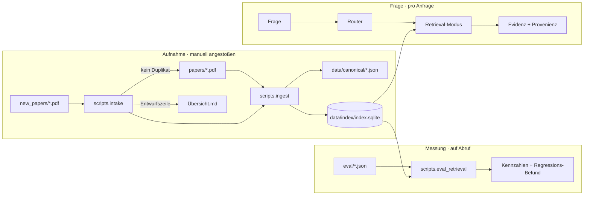

Daraus folgen drei Eigenschaften, die den Rest der Architektur erklären:

- **Der Index ist die einzige Quelle der Wahrheit zur Abfragezeit.** Kein Retrieval-Modus liest
  eine PDF-Datei oder ein Canonical JSON.
- **Der Index wird pro Anfrage frisch geladen** („On-Read"). Neue Paper wirken deshalb ohne
  Server-Neustart – der Preis ist Ladezeit je Aufruf
  ([ADR 0010](adr/0010-drop-in-workflow-and-qa-phase6.md)).
- **Nichts wird als Modell serialisiert.** Der Vektorraum wird beim Laden aus dem Chunk-Text
  rekonstruiert; die SQLite-Datei enthält Text und Struktur, keine `pickle`-Artefakte
  ([ADR 0005](adr/0005-graphrag-index-backend-open.md)).

---

## 2. Aufnahme: von der PDF zum Index

`ingest` verarbeitet **nur neue oder geänderte** PDFs, baut Index und Graphen aber **vollständig**
neu. Das ist bei dieser Korpusgröße günstiger als inkrementelle Pflege und schließt
Inkonsistenzen aus.

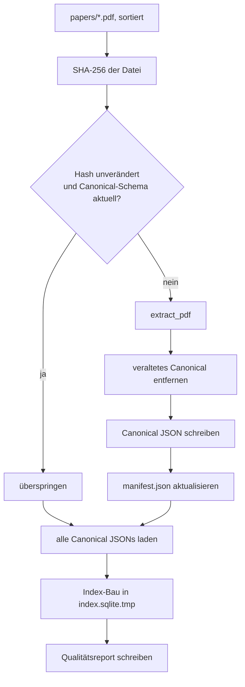

Zwei Entwurfsentscheidungen sind hier zentral:

**Der Schema-Trigger.** Übersprungen wird nur, wenn der Datei-Hash *und* die Schema-Version des
gespeicherten Canonical JSON stimmen. Eine Änderung am Extraktions-Contract erzwingt dadurch
automatisch die Neu-Extraktion des gesamten Korpus, ohne dass jemand einen Cache löschen muss –
so wurde etwa die Textnormalisierung ausgerollt
([ADR 0015](adr/0015-noise-reduction-keywords-and-sections-phase7.md)).

**Der atomare Swap.** Weil der Server den Index pro Anfrage liest, dürfte ein Neuaufbau niemals
einen halbfertigen Zustand sichtbar machen:

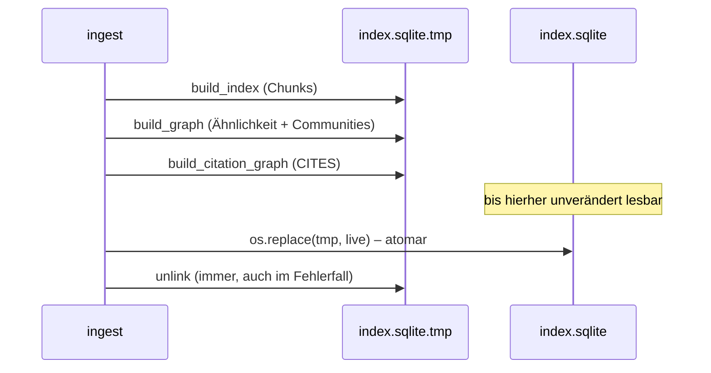

Schlägt ein Schritt fehl, bleibt der bisherige Index unangetastet und weiterhin abfragbar
([ADR 0010](adr/0010-drop-in-workflow-and-qa-phase6.md)).

### Der Intake davor: was überhaupt in `papers/` landet

`ingest` erkennt Duplikate nur an **Dateiname → Hash**. Ein inhaltsgleiches PDF unter anderem
Namen würde deshalb ein zweites Mal indiziert. Der Intake schaltet sich davor und prüft in drei
Stufen mit **fallender Sicherheit und fallender Konsequenz**:

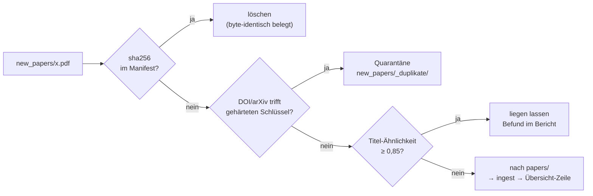

Entscheidend ist, dass nur die **erste** Stufe löscht: Dort und nur dort ist bewiesen, dass kein
Bit verloren geht. Stufe 2 vergleicht eine heuristisch extrahierte Metadate und ist deshalb
umkehrbar; Stufe 3 ist ein Verdacht und bleibt folgenlos. Warum der Identifikator-Vergleich
zusätzlich gehärtet werden musste – und welche zwei Fehlerquellen im eigenen Korpus dafür
gemessen wurden – steht in
[ADR 0019](adr/0019-corpus-intake-new-papers-phase8.md); die innere Funktionsweise beschreibt die
[Modul-Doku](../src/research_graphrag/doc/intake.md).

### Und davor: woher ein Kandidat überhaupt kommt

Der Online-Modus ist der einzige Teil des Systems, der eine Netzverbindung öffnet – und er ist
**separat startbar**, damit das eine bewusste Handlung bleibt. Er sucht nicht frei, sondern
ausgehend vom eigenen Bestand:

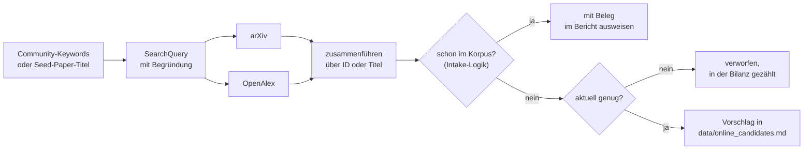

Drei Dinge sind daran wesentlich. **Erstens** endet der Weg bei einem Bericht, nicht im Korpus –
wer einen Vorschlag übernehmen will, lädt die Datei selbst und legt sie in `new_papers/`, wo der
Intake sie prüft. Es gibt genau **einen** Weg in den Korpus. **Zweitens** ist die Frage „kenne ich
das schon?" nicht neu implementiert, sondern dieselbe wie beim Intake; zwei Wahrheiten darüber
wären eine Fehlerquelle. **Drittens** liegt der gesamte Netzzugang hinter einem injizierbaren
Port, weshalb alles außer dem Transport ohne Netz testbar ist
([ADR 0020](adr/0020-online-candidate-search-phase9.md),
[Modul-Doku](../src/research_graphrag/online/doc/search.md)). Wie der Modus **bedient** wird –
Proxy einrichten, Anfrage wählen, Bericht lesen, Vorschlag übernehmen – steht in
[online-recherche.md](online-recherche.md).

### Und wenn es den Volltext gar nicht gibt

Manches Paper ist nur als Abstract öffentlich. Dafür gibt es einen zweiten, ebenso separat
startbaren Weg: Eine kuratierte Liste von DOI- und arXiv-Kennungen wird zu **Stub-Dateien**
`*.refjson` im selben Eingangsordner – mit Titel, Autoren, Jahr, Venue und Abstract, aber ohne
jeden Volltext.

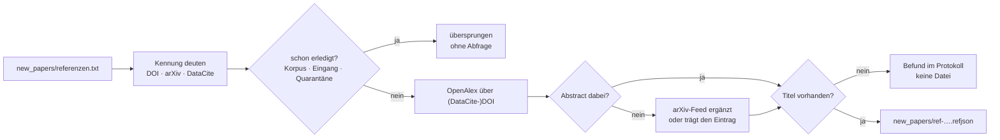

Drei Eigenschaften sind hier wesentlich, und alle drei folgen demselben Muster wie oben. Die
Prüfung „kenne ich das schon?" nutzt wieder die **Intake-Grundlage** und findet **vor** der
ersten Abfrage statt – ein Wiederholungslauf verbraucht also weder Kontingent noch erzeugt er
eine zweite Datei. Die Stub-Datei **ist** die eingefrorene Antwort: Das Netz wird genau einmal
befragt, alles Weitere ist deterministisch. Und der Weg endet wieder im Eingang, nicht im Korpus
([ADR 0029](adr/0029-reference-stub-resolution-phase13.md),
[Modul-Doku](../src/research_graphrag/online/doc/references.md)).

> **Und dann?** Seit Phase 13 / R2 nimmt der Intake `*.refjson` regulär an: dieselben drei
> Prüfstufen, Benennung nach dem **Titel**, `document_kind` im Canonical- und Index-Schema. Ein
> Referenz-Eintrag hat genau einen Chunk (Titel + Abstract) und **keine** Seitenangabe. Taucht
> später das echte PDF auf, gilt **„Volltext schlägt Referenz-Eintrag"** – es wird übernommen,
> der Stub abgelöst und seine Übersichtszeile umgebogen statt dupliziert
> ([ADR 0030](adr/0030-reference-entries-in-corpus-phase13.md)).
>
> **Seit R3 ist die Unvollständigkeit sichtbar und folgenlos zugleich.** Sichtbar: `document_kind`
> steht in jedem Zitat, jeder Paper-Referenz, jedem Beleg und in `get_paper`; ein Abstract-Beleg
> trägt zusätzlich den Klartext „Referenz-Eintrag ohne Volltext" im Provenienz-Label, und der
> Zitier-Contract verlangt, das in der Antwort zu benennen. Folgenlos für die Messung: Die
> mechanische Gold-Ableitung überspringt Referenz-Einträge, und in der Chunk-Suche stehen sie
> **hinter** den Volltext-Treffern – umsortiert, nicht aussortiert, damit sie dort weiterhin
> vorn stehen, wo kein Volltext antworten kann
> ([ADR 0031](adr/0031-reference-contract-and-guardrail-phase13.md)).
---

## 3. Extraktion: von Seitentext zu Chunks

`extract_pdf` ist eine lineare Kette. Jede Stufe hat genau eine Aufgabe, und jede Stufe wurde
durch eine Messung geformt – nicht durch eine Vermutung.

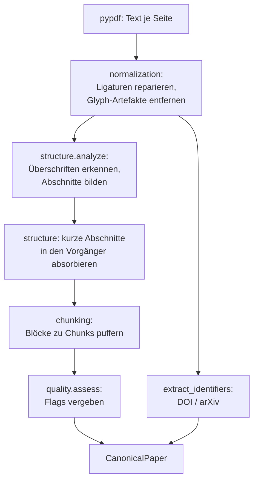

**Warum die Reihenfolge zählt.** Die Normalisierung läuft **vor** der Strukturanalyse, weil eine
Ligatur mitten in einem Wort sowohl die Auffindbarkeit als auch die Überschriften-Erkennung
verfälscht. Die Absorption läuft **nach** der Abschnittsbildung, weil sie die tatsächliche
Textmasse eines Abschnitts kennen muss.

**Eine Überschrift landet nicht im Chunk-Text.** Deshalb ist jede fälschlich als Überschrift
erkannte Zeile ein doppelter Schaden: Sie zersplittert die Struktur *und* entzieht dem Retrieval
den Text. Aus diesem Grund verwirft die Erkennung Bibliografie- und Tabellenzeilen aktiv, statt
im Zweifel eine Überschrift anzunehmen
([ADR 0015](adr/0015-noise-reduction-keywords-and-sections-phase7.md)).

**Die Seite ist keine Grenze mehr, sondern eine Angabe.** Chunks brechen an Abschnittswechseln
und an einer Größenschwelle; läuft ein Chunk über einen Seitenumbruch, trägt er eine
Seiten-*Range* statt einer Seitenzahl
([ADR 0013](adr/0013-chunking-refinement-phase7.md)).

Vertiefung: [structure](../src/research_graphrag/extraction/doc/structure.md),
[chunking](../src/research_graphrag/extraction/doc/chunking.md),
[normalization](../src/research_graphrag/extraction/doc/normalization.md).

---

## 4. Der Index: eine Datei, fünf Sichten

Alle Artefakte liegen in **einer** SQLite-Datei. Sie werden im selben atomaren Fenster gebaut und
sind damit immer zueinander konsistent.

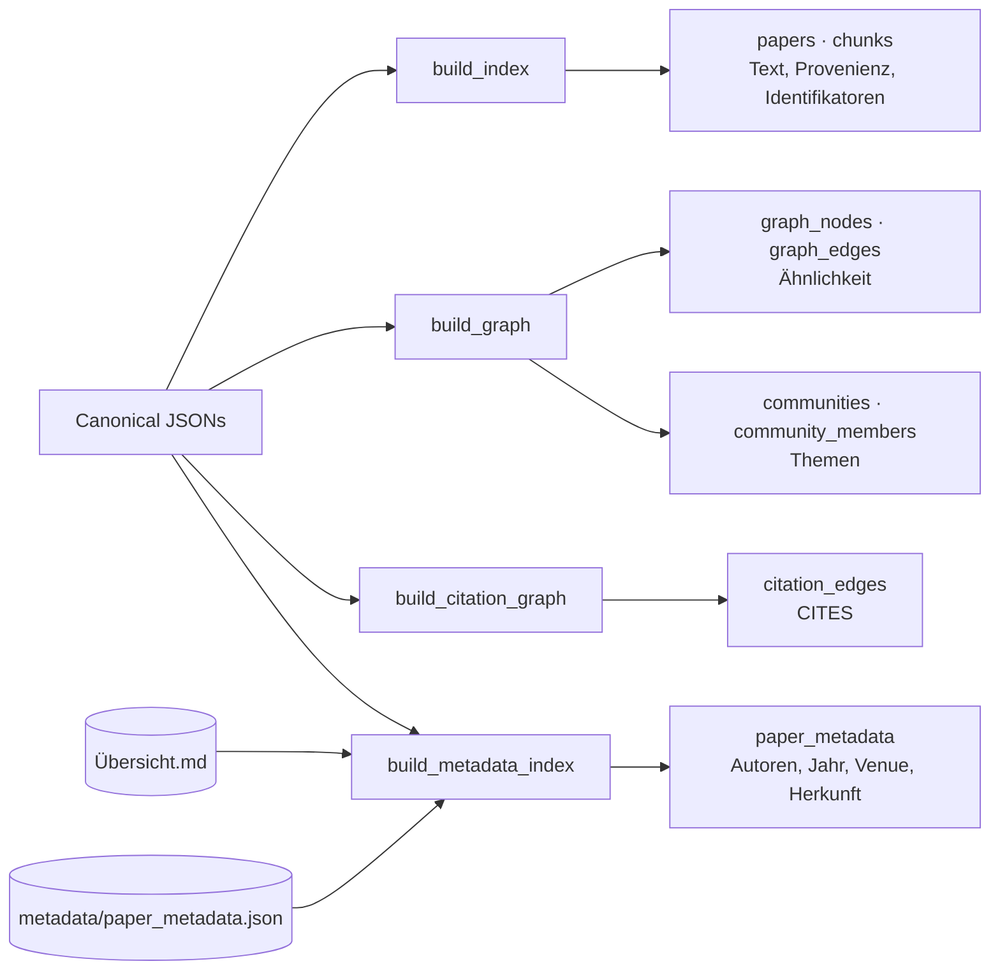

| Sicht | Entsteht aus | Beantwortet |
| --- | --- | --- |
| Chunks | Chunk-Text und Provenienz | „Wo genau steht das?" |
| Ähnlichkeitsgraph | wechselseitige Top-k-Nachbarschaft der Paper-Vektoren | „Was ist thematisch benachbart?" |
| Communities | Louvain-Gruppierung des Ähnlichkeitsgraphen | „Welche Themen gibt es im Korpus?" |
| Zitationen | Referenzabschnitt gegen Korpus-Identifikatoren und -Titel | „Wer zitiert wen – tatsächlich?" |
| Zitierdaten | vier Herkünfte, feldweise aufgelöst | „Wie zitiere ich das korrekt?" |

**Ähnlichkeit ist nicht Zitation.** Der Ähnlichkeitsgraph verbindet Paper, die *ähnlich klingen*;
`CITES` verbindet Paper, die einander *nachweislich zitieren*. Beide sind bewusst getrennt
([ADR 0007](adr/0007-graphrag-index-phase3-option-b.md),
[ADR 0011](adr/0011-intra-corpus-citation-graph-phase7.md)).

**Die fünfte Sicht ist die einzige mit einer Quelle außerhalb des Korpus.** Sie führt Handpflege,
kuratierte Übersicht, Online-Auflösung und Extraktion **feldweise** zusammen und merkt sich je
Feld, welche Herkunft gewonnen hat. Damit bleibt prüfbar, ob eine DOI aus menschlicher Hand oder
aus einer Regex stammt ([ADR 0025](adr/0025-citable-paper-metadata.md)).

Vertiefung: [tfidf_index](../src/research_graphrag/indexing/doc/tfidf_index.md),
[graph_index](../src/research_graphrag/indexing/doc/graph_index.md),
[citation_graph](../src/research_graphrag/indexing/doc/citation_graph.md),
[metadata_index](../src/research_graphrag/indexing/doc/metadata_index.md).

---

## 5. Die Wertung: zwei Verfahren, ein Vokabular

Beim Laden entsteht aus **einem** Tokenisierungs-Durchlauf sowohl die TF-IDF-Matrix als auch die
BM25-Gewichtung. Beide Verfahren sehen damit exakt dasselbe Vokabular; ein Unterschied im
Ergebnis ist ein Unterschied der Bewertung, nicht der Vorverarbeitung.

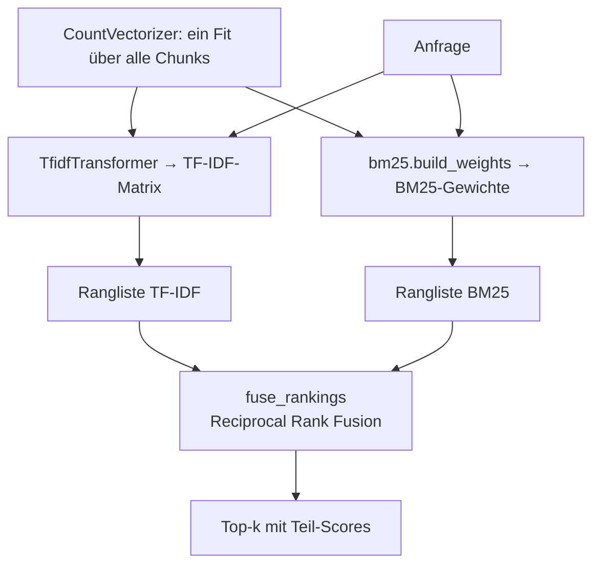

Die Fusion arbeitet über **Ränge**, nicht über Score-Werte – dadurch müssen die beiden
Wertungsskalen nicht vergleichbar gemacht werden. Beide Teil-Scores werden immer mitgeführt und
in jedem Zitat ausgewiesen, damit nachvollziehbar bleibt, welches Verfahren einen Treffer
getragen hat.

> **Achtung bei der Interpretation:** Der Score der Standard-Wertung ist ein *Fusionswert*, keine
> Ähnlichkeit. Er ist nur innerhalb einer Antwort vergleichbar, nicht zwischen Anfragen
> ([ADR 0014](adr/0014-hybrid-retrieval-bm25-tfidf-phase7.md)).

Vertiefung: [bm25](../src/research_graphrag/indexing/doc/bm25.md),
[fusion](../src/research_graphrag/indexing/doc/fusion.md).

---

## 6. Die vier Modi

Alle Modi liefern **Evidenz mit Provenienz** – nie eine formulierte Antwort. Sie unterscheiden
sich darin, *wo* sie ansetzen und *wie weit* sie ausgreifen.

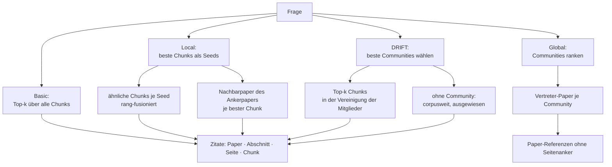

| Modus | Ansatzpunkt | Belegebene | Charakteristische Schwäche |
| --- | --- | --- | --- |
| Basic | ganzer Chunk-Bestand | Chunk | kein Kontext über die Passage hinaus |
| Local | beste Chunks (Seeds) | Chunk | greift über die Passagen hinaus nur über Ähnlichkeit aus |
| Global | Community-Dokumente | Paper | keine Passagen-Provenienz möglich |
| DRIFT | beste Communities | Chunk | steht und fällt mit der Community-Wahl |

Die Schwächen sind nicht Vermutung, sondern gemessen: Local hing ursprünglich an **einem** Seed
und lag damit hinter Basic – seit der Verankerung an mehreren Seeds ist das behoben, der Gewinn
ist allerdings teilweise definitorisch
([ADR 0021](adr/0021-local-multi-seed-phase10.md)). Bei DRIFT entstanden **alle**
Fehlschläge in der Community-Wahl; seit der Vereinigung mehrerer Communities und dem
ausgewiesenen Rückfall auf die corpusweite Suche antwortet der Modus nie mehr leer – die
Hälfte seiner Treffer stammt allerdings aus genau diesem Fallback und damit aus Basic
([ADR 0022](adr/0022-drift-community-union-and-fallback-phase10.md)).

**Global liefert bewusst keine Seiten-Provenienz.** Eine corpusweite Aussage ist nicht auf eine
einzelne Passage zurückführbar; das Ergebnis nennt deshalb repräsentative Paper statt Chunks.

Vertiefung: [basic](../src/research_graphrag/retrieval/doc/basic.md),
[local](../src/research_graphrag/retrieval/doc/local.md),
[global_search](../src/research_graphrag/retrieval/doc/global_search.md),
[drift](../src/research_graphrag/retrieval/doc/drift.md).

---

## 7. Der Router: sichtbar entscheiden statt still raten

Der Router ist ein reiner Textklassifikator ohne Datenbankzugriff. Er wertet ein Lexikon aus
Signalen aus, die jeweils **deklarieren**, wie sie treffen dürfen.

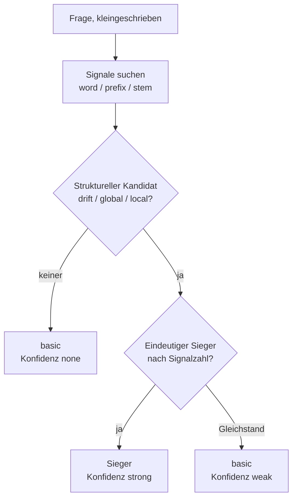

Drei Festlegungen tragen das Verhalten:

1. **Die Match-Art gehört zum Signal.** Englische Signale greifen an Wortgrenzen oder
   wortanfangs-verankert; Teilwort-Treffer bleiben deutschen Wortstämmen vorbehalten, wo sie für
   Komposita gebraucht werden und gemessen fehlalarmfrei sind.
2. **`basic` ist Rückfallebene, nicht Kandidat.** Fakt-Signale *bestätigen* die Rückfallebene,
   verschieben aber nie eine Entscheidung – sonst zöge „Vergleiche den F1-Score" zum falschen
   Modus.
3. **Unsicherheit wird ausgewiesen.** Bei Gleichstand gewinnt niemand: Die Entscheidung fällt
   sichtbar auf `basic` zurück, mit Konfidenzstufe `weak` und den Konkurrenten in der Begründung.

Jede Entscheidung trägt Modus, Konfidenzstufe, auslösende Signale und einen Begründungstext –
in der Kommandozeile und als Feld `routing` in `answer_question`
([ADR 0017](adr/0017-router-hardening-phase7.md)).

Vertiefung: [router](../src/research_graphrag/retrieval/doc/router.md).

---

## 8. Der Antwortweg und die Modell-Grenze

`answer_question` ist der einzige Pfad, der von der Frage bis zur fertigen Belegliste führt –
gemeinsam genutzt von Kommandozeile und MCP-Werkzeug.

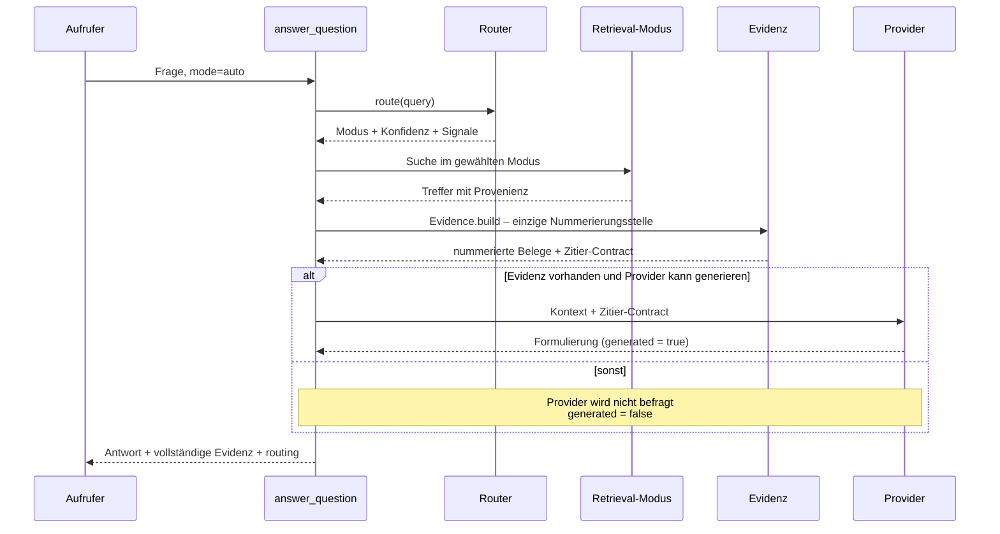

Vier Eigenschaften sind hier wichtig:

- **Die Nummerierung entsteht an genau einer Stelle.** Damit stimmen die Marken `[1]`, `[2]` …
  im Prompt, in der Ausgabe und in der Provenienz zwingend überein.
- **Ohne Modell geht nichts verloren.** Fehlt die Sampling-Fähigkeit, bleibt `generated = false`
  und die Evidenz vollständig – die Degradation ist sichtbar, nicht still.
- **Leere Evidenz befragt kein Modell.** Ohne Treffer wird gar nicht erst generiert.
- **Der Modellzugriff liegt ausschließlich an der Serverkante.** Die Generierungsschicht kennt
  nur einen synchronen Port; die asynchrone Anbindung an das Client-Modell existiert nur im
  Server ([ADR 0004](adr/0004-llm-bridge-via-mcp-sampling.md),
  [ADR 0012](adr/0012-llm-bridge-and-answer-synthesis-phase7.md)).

Am MCP-Server selbst ist jedes Werkzeug ein **dünner Wrapper**: Er reicht Parameter an die
Kernfunktion durch und übersetzt Fehler.

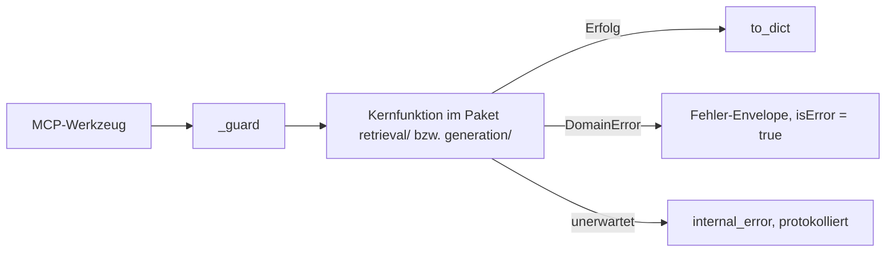

Vertiefung: [answer](../src/research_graphrag/generation/doc/answer.md),
[synthesis](../src/research_graphrag/generation/doc/synthesis.md),
[server](../src/research_graphrag/mcp_server/doc/server.md),
[sampling](../src/research_graphrag/mcp_server/doc/sampling.md).

### Vom Beleg zur Quellenangabe

Ein Beleg beantwortet „wo steht das?" – zum Zitieren fehlt „woher stammt es?". Diese zweite Frage
beantwortet eine eigene Kette, die **einseitig gerichtet** verläuft:

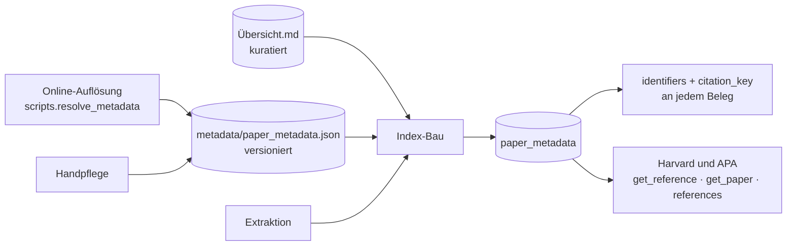

Drei Eigenschaften halten diese Kette zusammen:

- **Der Identifikator reist mit.** Jedes Zitat und jede Paper-Referenz trägt DOI, arXiv-ID oder
  URL – ohne einen zweiten Werkzeugaufruf. Die **vollständige** Angabe steht dagegen nur einmal
  je Paper, nicht in jedem Beleg.
- **Die Herkunft wird ausgewiesen, nicht verwischt.** Weicht ein kuratierter Publisher-DOI von
  der extrahierten arXiv-ID ab, gewinnt der kuratierte Wert – und das Feld `origins` sagt, dass
  er es war.
- **Der Kern bleibt netzfrei.** Die Auflösung ist ein separater, beobachteter Lauf; sie schreibt
  eine Datei, und erst der nächste Ingest macht sie wirksam
  ([ADR 0025](adr/0025-citable-paper-metadata.md),
  [ADR 0026](adr/0026-online-metadata-resolution.md)).

Vertiefung: [reference](../src/research_graphrag/retrieval/doc/reference.md),
[styles](../src/research_graphrag/bibliography/doc/styles.md),
[resolve](../src/research_graphrag/bibliography/doc/resolve.md),
[online/metadata](../src/research_graphrag/online/doc/metadata.md).

---

## 9. Messung: was gemessen wird und was das Maß taugt

Die Evaluation misst auf drei Ebenen und benutzt für jede Ebene ein anderes Instrument.

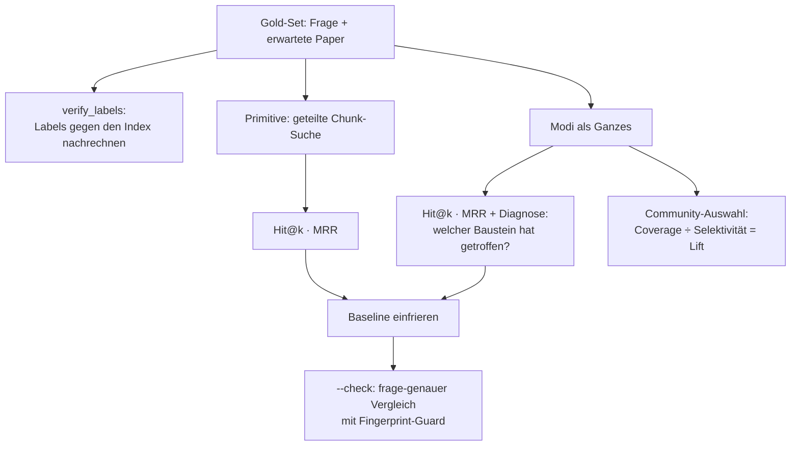

Drei methodische Festlegungen:

- **Labels müssen nachrechenbar sein.** Sie werden mechanisch aus dem Chunk-Text abgeleitet und
  lassen sich per `--verify-labels` gegen den Index prüfen. Inhaltliche Labels wären
  aussagekräftiger, aber nicht überprüfbar – und damit als Absicherung eines Re-Ingests wertlos.
- **Coverage allein ordnet nicht.** Die nackte Trefferabdeckung würde die triviale Strategie
  „nimm die größten Communities" zum Sieger küren. Erst der **Lift** – Coverage geteilt durch
  Selektivität – zeigt, ob eine Auswahl besser ist als Zufall.
- **Der Fingerprint schützt vor Scheinvergleichen.** Passt der Korpus nicht mehr zur
  eingefrorenen Baseline, verweigert der Vergleich die Aussage, statt eine falsche zu liefern.

Damit ein solcher Guard nicht zur Sackgasse wird, gibt es den Gegenweg: `--write-gold` leitet die
Labels aus dem aktuellen Index **neu** ab, ohne die Fragen anzufassen – und meldet eine Frage,
die im neuen Bestand kein Ziel mehr hat, als Befund. Nötig ist das, weil die Labels Paper-IDs
sind und eine Paper-ID der Hash der Datei ist: Ein durch eine neuere Fassung **ersetztes** PDF
bekommt eine neue ID, das eingefrorene Label zeigt danach ins Leere.

Der Router wird **getrennt** gemessen, gegen die Fragetyp-Tabelle der
[README](../README.md) – ohne Index und in Sekunden. Das End-to-End-Maß dient dabei nur als
**Veto**, nie als Optimierungsziel: Auf mechanisch abgeleitete Labels hin optimiert, wäre „immer
Basic" die beste Strategie ([ADR 0016](adr/0016-quantitative-retrieval-evaluation-phase7.md),
[ADR 0017](adr/0017-router-hardening-phase7.md)).

### Die dritte Ebene: Multi-Hop mit nicht-lexikalischen Labels

Die beiden Ebenen oben teilen eine Schwäche: Ihre Labels hängen am **Wortlaut** – einmal am
Chunk-Text, einmal an Signalwörtern. Der Fragetyp „Zitations-/Methodennetze" lässt sich so nicht
messen. Dafür gibt es eine dritte Quelle, die schon im System liegt: die `CITES`-Kanten.

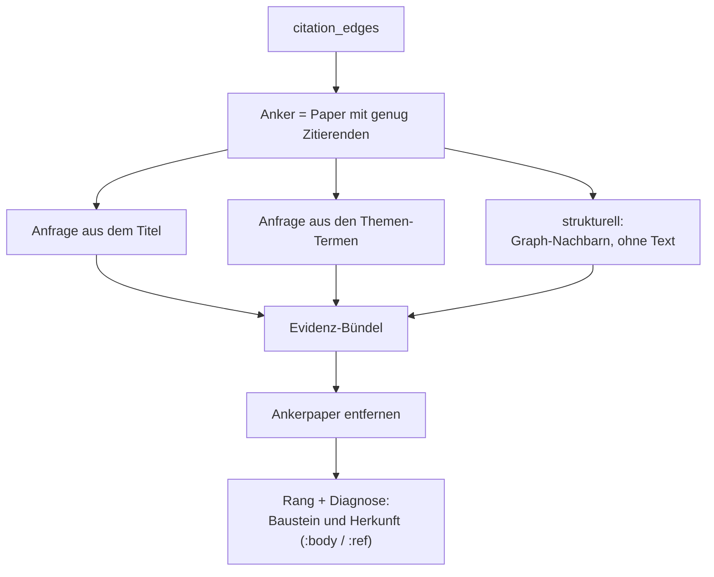

Drei Eigenheiten machen diese Messung erst belastbar:

- **Der Anker verlässt das Bündel.** Er kann nie ein erwartetes Paper sein (Selbstzitate sind
  ausgeschlossen), würde aber die vorderen Ränge besetzen.
- **Die Herkunft jedes Belegs wird ausgewiesen.** Eine Anfrage aus dem *Titel* eines Papers
  findet die zitierenden Paper häufig über deren **Literaturverzeichnis** – ein lexikalischer
  Kurzschluss. Die Diagnose `:ref` macht ihn sichtbar; die Anfrage aus den *Themen-Termen* ist
  die Gegenprobe.
- **Der triviale Oberwert steht daneben.** `get_citations` liest dieselbe Tabelle wie die Labels
  und träfe per Konstruktion immer – es ist deshalb Bezugsgröße, keine Kennzahl.

Was dabei **nicht** herauskommt, ist der Recall des Zitationsgraphen: Eine fehlende Kante fehlt
in Labels und Messung gleichermaßen. Ausgewiesen werden stattdessen **strukturelle Schranken** –
welche Paper als Quelle oder Ziel prinzipiell ausscheiden
([ADR 0023](adr/0023-multihop-citation-evaluation-phase10.md)).

Vertiefung: [gold](../src/research_graphrag/evaluation/doc/gold.md),
[metrics](../src/research_graphrag/evaluation/doc/metrics.md),
[runner](../src/research_graphrag/evaluation/doc/runner.md),
[baseline](../src/research_graphrag/evaluation/doc/baseline.md),
[routing](../src/research_graphrag/evaluation/doc/routing.md),
[multihop](../src/research_graphrag/evaluation/doc/multihop.md).

---

## 10. Determinismus als Querschnitt

Gleiche Eingabe, gleiches Ergebnis – das gilt in jeder Schicht und ist die Voraussetzung dafür,
dass ein Regressions-Check überhaupt etwas aussagt.

| Schicht | Woher der Determinismus kommt |
| --- | --- |
| Extraktion | reine Textheuristik ohne Zufall; Paper-ID aus dem Datei-Hash |
| Index | feste Zeilenreihenfolge; Vektorraum aus dem gespeicherten Text rekonstruiert |
| Graph | fester Seed für Louvain; Tie-Breaks über die Paper-ID; Community-IDs nach fester Ordnung |
| Retrieval | Sortierung nach Score mit Tie-Break über die Chunk-ID |
| Evidenz | Nummerierung an genau einer Stelle |
| Evaluation | fester Seed für Zufalls-Baselines, über viele Ziehungen gemittelt |

Die einzige nicht-deterministische Komponente ist die **optionale** Formulierung durch das
Client-Modell. Sie ist opt-in, verändert die Evidenz nicht und ist am Feld `generated`
erkennbar.

---

## 11. Vertiefung: alle Modul-Dokus

| Paket | Modul-Dokus |
| --- | --- |
| Top-Level | [errors](../src/research_graphrag/doc/errors.md) · [intake](../src/research_graphrag/doc/intake.md) · [keywords](../src/research_graphrag/doc/keywords.md) · [pipeline](../src/research_graphrag/doc/pipeline.md) |
| `extraction/` | [model](../src/research_graphrag/extraction/doc/model.md) · [normalization](../src/research_graphrag/extraction/doc/normalization.md) · [structure](../src/research_graphrag/extraction/doc/structure.md) · [chunking](../src/research_graphrag/extraction/doc/chunking.md) · [quality](../src/research_graphrag/extraction/doc/quality.md) · [pdf](../src/research_graphrag/extraction/doc/pdf.md) · [refstub](../src/research_graphrag/extraction/doc/refstub.md) |
| `indexing/` | [tfidf_index](../src/research_graphrag/indexing/doc/tfidf_index.md) · [bm25](../src/research_graphrag/indexing/doc/bm25.md) · [fusion](../src/research_graphrag/indexing/doc/fusion.md) · [graph_index](../src/research_graphrag/indexing/doc/graph_index.md) · [citation_graph](../src/research_graphrag/indexing/doc/citation_graph.md) · [metadata_index](../src/research_graphrag/indexing/doc/metadata_index.md) |
| `retrieval/` | [basic](../src/research_graphrag/retrieval/doc/basic.md) · [local](../src/research_graphrag/retrieval/doc/local.md) · [global_search](../src/research_graphrag/retrieval/doc/global_search.md) · [drift](../src/research_graphrag/retrieval/doc/drift.md) · [router](../src/research_graphrag/retrieval/doc/router.md) · [provenance](../src/research_graphrag/retrieval/doc/provenance.md) · [paper](../src/research_graphrag/retrieval/doc/paper.md) · [citations](../src/research_graphrag/retrieval/doc/citations.md) · [reference](../src/research_graphrag/retrieval/doc/reference.md) |
| `generation/` | [provider](../src/research_graphrag/generation/doc/provider.md) · [synthesis](../src/research_graphrag/generation/doc/synthesis.md) · [evidence](../src/research_graphrag/generation/doc/evidence.md) · [answer](../src/research_graphrag/generation/doc/answer.md) |
| `evaluation/` | [gold](../src/research_graphrag/evaluation/doc/gold.md) · [metrics](../src/research_graphrag/evaluation/doc/metrics.md) · [runner](../src/research_graphrag/evaluation/doc/runner.md) · [baseline](../src/research_graphrag/evaluation/doc/baseline.md) · [routing](../src/research_graphrag/evaluation/doc/routing.md) · [multihop](../src/research_graphrag/evaluation/doc/multihop.md) · [report](../src/research_graphrag/evaluation/doc/report.md) |
| `overview/` | [drafts](../src/research_graphrag/overview/doc/drafts.md) |
| `online/` | [transport](../src/research_graphrag/online/doc/transport.md) · [sources](../src/research_graphrag/online/doc/sources.md) · [candidates](../src/research_graphrag/online/doc/candidates.md) · [search](../src/research_graphrag/online/doc/search.md) · [metadata](../src/research_graphrag/online/doc/metadata.md) · [references](../src/research_graphrag/online/doc/references.md) · [report](../src/research_graphrag/online/doc/report.md) |
| `bibliography/` | [model](../src/research_graphrag/bibliography/doc/model.md) · [resolve](../src/research_graphrag/bibliography/doc/resolve.md) · [curated](../src/research_graphrag/bibliography/doc/curated.md) · [store](../src/research_graphrag/bibliography/doc/store.md) · [styles](../src/research_graphrag/bibliography/doc/styles.md) |
| `mcp_server/` | [server](../src/research_graphrag/mcp_server/doc/server.md) · [sampling](../src/research_graphrag/mcp_server/doc/sampling.md) |
