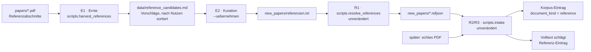

# Roadmap-Historie – Phasen 0–8, 11, 12, 14 und 15 (Archiv)

**Dies ist das wörtliche Archiv der Roadmap in dem Stand, in dem die Phasen 0–8, 11, 12, 14 und 15
abgeschlossen wurden.** Es enthält die vollständigen Status-Blockquotes mit allen gemessenen Kennzahlen,
korrigierten Annahmen und offen dokumentierten Abweichungen – also die Begründungslage, auf die
sich [ADR 0006](adr/0006-canonical-model-phase2-scope.md) bis
[ADR 0034](adr/0034-decommission-uebersicht-and-inflow-stop-rule-phase15.md) mit Formulierungen wie
„die Roadmap beschreibt für Phase 7 / A3 …" beziehen. Phase 14 hat kein eigenes ADR – E0 fand einen
billigeren Weg und entschied die Phase auf dieser Messstufe, bevor Produktivcode entstand.

> **Fortgeschrieben, wenn eine Phase abgeschlossen wird.** Der aktive Plan steht in [Roadmap.md](../Roadmap.md); dort sind abgeschlossene Phasen nur noch als Ergebnis-Tabelle zusammengefasst. Einzelne Aussagen bleiben datiert und waren zum Zeitpunkt ihrer Entstehung korrekt (dieselbe Regel gilt für ADRs). Der einzige Eingriff gegenüber dem Original ist dieser Kopf sowie die um eine Ebene angepassten relativen Links (`docs/…` → `../docs/…`), weil die Datei aus der Repo-Wurzel nach `docs/` gewandert ist.

---

## Leitprinzipien

- **Lean & container-frei:** reine Python-Umgebung, kein Docker-/DB-Server im MVP.
- **Provenienz zuerst:** jede Antwort ist auf Paper/Abschnitt/Seite rückführbar.
- **Inkrementell nutzbar:** neue PDFs per Drop-in-Ordner + Skript, ohne alles neu aufzusetzen.
- **Klein, aber wachstumsfähig:** optimiert für ≤ 500 Paper, mit klaren Erweiterungspfaden.
- **Wiederverwenden statt neu bauen:** MCP-SDK sowie `scikit-learn`/`networkx`/`pypdf` als Fundament der Offline-Variante (Option B, [ADR 0005](../docs/adr/0005-graphrag-index-backend-open.md)); Microsoft GraphRAG/Docling bleiben Zielbild, falls beschaffbar.
- **Konsolidierte Forschungsbasis:** ersetzt den bisherigen `Recherche`-Ordner und vereint PDFs, kuratierte Literaturübersicht (`Übersicht.md`) und GraphRAG-Index in einem Repo.

## Offene Entscheidungen (mit Empfehlung)

| Entscheidung | Optionen | Empfehlung |
|---|---|---|
| **Index-LLM / Embeddings** | Cloud-API (Azure OpenAI/OpenAI) · lokal via Ollama · hybrid | **Entschieden: Offline-Hybrid (Option B)** – Cloud/Ollama offline nicht beschaffbar; **TF-IDF** im Index, LLM nur zur Abfragezeit via Bridge ([ADR 0005](../docs/adr/0005-graphrag-index-backend-open.md)). |
| **Primär-Extraktor** | Docling · Marker | **Entschieden: `pypdf` (Option B)** – Docling/Marker offline nicht beschaffbar; `pypdf` liefert Text + Seiten-Provenienz, Docling/Marker als späterer Ausbau ([ADR 0005](../docs/adr/0005-graphrag-index-backend-open.md)). |
| **Index-Aktualisierung** | voller Re-Index · inkrementelles `graphrag update` | **Voller Re-Index** als Standard (bei ≤ 500 günstig & konsistent); inkrementelles Update als spätere Optimierung. |
| **Ingestion-Trigger** | manuelles Skript · Auto-Watcher | **Manuelles Skript** zuerst (vorhersehbar); Auto-Watcher als Ausbaustufe. |
| **`papers/`-Layout bei Migration** | flach · Cluster-Unterordner beibehalten | **Flach** (eine Ebene) für einfache Dedup/Links; Themencluster leben in `Übersicht.md`, nicht im Dateisystem. |
| **Übersicht-Pflege** | rein manuell · Pipeline-Entwurf + Kuratierung | **Pipeline-Entwurf** (Auto-Spalten) + **menschliche Kuratierung** der wertenden Spalten (Relevanz, SRQ). |

Diese Punkte werden spätestens in der jeweiligen Phase final entschieden und hier aktualisiert.

---

## Phasen

### Phase 0 – Fundament & Setup
**Ziel:** reproduzierbares, leeres Grundgerüst.

- Repo-Struktur (src-Layout), `pyproject.toml`, virtuelle Umgebung.
- LLM-/Embedding-Backend auswählen und anbinden (siehe offene Entscheidungen).
- Pragmatisches **Prüf-Fragen-Set** anlegen (über alle 5 Fragetypen).

**DoD:** `pip install -e .` läuft; Backend erreichbar; Dummy-Durchlauf über 1 Dokument erzeugt Artefakte.

> **Status:** ✅ umgesetzt – 0a (Gerüst) und 0b (Offline-Hybrid-Durchstich) fertig; **M1 erreicht** (1 PDF → Index → belegte Antwort). Umsetzung als Option B ([ADR 0005](../docs/adr/0005-graphrag-index-backend-open.md)); Backend = TF-IDF offline + LLM-Bridge zur Abfragezeit. Kernmodule 100 % Zeilenabdeckung.

### Phase 1 – Migration der bestehenden Recherche
**Ziel:** bestehende Literatur & Recherche vollständig ins Repo übernommen.

- **PDFs übernehmen:** alle Paper aus `Recherche/` nach `papers/` (flaches Layout, siehe offene Entscheidungen).
- **Rechercheartefakte migrieren:** Prompts, Zusammenfassungen, Gap-Analyse nach `recherche/`.
- **Übersicht portieren:** `Übersicht.md` übernehmen, interne Links auf `papers/` umbiegen und Vollständigkeit gegen den Altbestand prüfen.
- **Pilot-Korpus markieren:** ~20–30 repräsentative Paper (gute/schlechte Scans, Tabellen, Formeln) für die Pipeline-Entwicklung.
- Alten `Recherche`-Ordner erst nach Verifikation als „nicht mehr gepflegt" kennzeichnen.

**DoD:** alle PDFs in `papers/`, Artefakte in `recherche/`, `Übersicht.md` mit funktionierenden internen Links; Umfang entspricht dem Altbestand.

### Phase 2 – PDF-Ingestion, Canonical Model & Übersicht
**Ziel:** robuste PDF → kanonisches JSON, nur neue/geänderte Dateien; Übersicht-Entwürfe.

- `pypdf`-Extraktor integrieren (Option B, [ADR 0005](../docs/adr/0005-graphrag-index-backend-open.md)); Docling/Marker als späterer Ausbau, falls beschaffbar.
- **Canonical Paper JSON** definieren: stabile IDs, Section-Hierarchie (heuristisch), Chunk-IDs, Referenz-Abschnitt, Seiten-/Section-Provenienz, Extraktions-Qualitätsflags. **Bounding-Box-Provenienz** und tiefes Referenz-Parsing sind bewusst zurückgestellt ([ADR 0006](../docs/adr/0006-canonical-model-phase2-scope.md), Phase 7).
- **Dedup & Cache:** `manifest.json` (Datei-Hash → Paper-ID); unveränderte PDFs überspringen.
- **Qualitäts-Gates:** fehlender Abstract, kaputte Referenzen, OCR-Rauschen, leere/kopflose Tabellen, zu kurze/lange Chunks.
- **Übersicht-Entwurf:** `scripts/update_overview.py` erzeugt **deterministische, extraktive** Entwurfszeilen (Name, Interner/Externer Link, Keyword, Kurzzusammenfassung) **append-only** nach `data/overview_drafts.md` (Staging, kuratierte `Übersicht.md` bleibt unangetastet); wertende Spalten bleiben manuell.
- Grundgerüst `scripts/ingest.py`.

**DoD:** PDFs in `papers/` + `ingest.py` erzeugen Canonical JSON nur für neue/geänderte Dateien inkl. Qualitätsreport; neue Paper erscheinen als Entwurfszeile in `data/overview_drafts.md`.

> **Status:** ✅ umgesetzt – Canonical-Schema **0.2.0** (Section-Heuristik, größenbasiertes Chunking, DOI/arXiv, Qualitätsflags), Qualitätsreport (`data/quality_report.json`/`.md`) und `scripts/update_overview.py` (Staging-Entwürfe) laufen und sind getestet (84 Tests grün, Kernmodule ≥ 96 % Zeilenabdeckung). Umfangsabgrenzung (keine Bounding-Boxes, kein tiefes Referenz-/Tabellen-Parsing): [ADR 0006](../docs/adr/0006-canonical-model-phase2-scope.md).

### Phase 3 – GraphRAG-Index (file-based)
**Ziel:** Wissensgraph + Community-Reports aus Canonical JSON.

> **Umsetzung als Offline-Hybrid (Option B, [ADR 0005](../docs/adr/0005-graphrag-index-backend-open.md)):** statt Microsoft GraphRAG/LanceDB/Leiden → **TF-IDF** (`scikit-learn`), Graph + **Louvain** (`networkx`), Speicher in **SQLite**; Community-Zusammenfassungen extraktiv bzw. on-demand über die LLM-Bridge. Die folgenden MS-GraphRAG-Punkte bleiben das Zielbild (Option C).

- Canonical JSON → GraphRAG-Input (JSON/JSONL bzw. Custom InputReader / BYO-DataFrame).
- `settings.yaml`: Chunking, Entity-/Relationship-/(Claim-)Extraktion, Community-Detection (Leiden), Embeddings.
- **Prompt-Tuning** für die wissenschaftliche Domäne.
- Artefakte als Parquet + LanceDB.

**DoD:** Indexlauf abgeschlossen; Artefakte vorhanden; erste Abfrage per GraphRAG-CLI erfolgreich.

> **Status:** ✅ umgesetzt (Option B, [ADR 0007](../docs/adr/0007-graphrag-index-phase3-option-b.md)): deterministischer **Paper-Ähnlichkeitsgraph** (TF-IDF, *mutual top-k*) mit **Louvain-Communities** (fixer Seed) und **extraktiven** Zusammenfassungen (repräsentative Paper + Top-TF-IDF-Keywords), additiv in `data/index/index.sqlite` (`graph_nodes`/`graph_edges`/`communities`/`community_members`). Der Graph-Bau ist in `python -m scripts.ingest` integriert; `IngestReport` zählt Knoten/Kanten/Communities, `python -m scripts.graph_info` zeigt sie. **DoD-Anpassung:** mangels „GraphRAG-CLI“ (offline nicht vorhanden) erfolgt der Nachweis über Tests, die `IngestReport`-Kennzahlen und `scripts/graph_info`. Realer Korpuslauf: **145 Knoten, 216 Kanten, 42 Communities**; Chunk-/Entitäts-Ebene bleibt zurückgestellt (Phase 4/7). 97 Tests grün, Kernmodule ≥ 96 % (graph_index 98,7 %).

### Phase 4 – Retrieval & Query-Router
**Ziel:** passender Suchmodus je Fragetyp, mit Provenienz.

- Local / Global / DRIFT / Basic Search kapseln.
- Leichtgewichtiger **Router** (heuristisch oder explizite Werkzeug-Wahl) gemäß Fragetyp-Mapping.
- Provenienz-Assembler (Paper-ID, Abschnitt, Seite/Chunk).

**DoD:** alle 5 Fragetypen per CLI beantwortbar, jeweils mit Quellenangaben.

> **Status:** ✅ umgesetzt (Option B, [ADR 0008](../docs/adr/0008-retrieval-and-query-router-phase4.md)): **Basic** (TF-IDF-Top-k), **Local** (Chunk-Nachbarschaft zur Abfragezeit **+** Paper-Fan-out über den Phase-3-Graphen), **Global** (Query→Community-Ranking mit repräsentativer Paper-Provenienz) und **DRIFT** (pragmatischer Global→Local-Hybrid) sind in `src/research_graphrag/retrieval/` gekapselt. Ein schlanker Heuristik-**Router** (`--mode auto`) plus **explizite** Modus-Wahl decken das Fragetyp-Mapping ab; der **Provenienz-Assembler** liefert Paper · Abschnitt · Seite/Chunk – dazu wurde der Index additiv um `section_title` erweitert (Schema **0.2.0**, voller Re-Ingest). **DoD-Nachweis:** alle 5 Fragetypen per `python -m scripts.ask "<frage>" [--mode …]` belegt beantwortet (siehe [eval/pruef-fragen.md](../eval/pruef-fragen.md)). **145 Tests grün**, Kernmodule ≥ 96 % (retrieval-Module 100 %). Realer Korpuslauf: **145 Paper / 14 397 Chunks / 42 Communities**; echtes iteratives DRIFT und ein semantischer Entitäts-/Zitationsgraph bleiben zurückgestellt (Phase 7).

### Phase 5 – MCP-Server (stdio) & Copilot-Integration
**Ziel:** Retrieval als Werkzeuge in Copilot.

- Python-MCP-Server (stdio) mit Werkzeugen: `search_local`, `search_global`, `search_drift`, `search_basic`, `get_paper`, `list_topics`.
- Jede Werkzeug-Antwort mit strukturierter Provenienz.
- Registrierung in VS Code (`.vscode/mcp.json`), Kurzdoku.

**DoD:** Copilot ruft die Werkzeuge auf und erhält belegte Antworten mit Quellen.

> **Status:** ✅ umgesetzt ([ADR 0009](../docs/adr/0009-mcp-server-stdio-phase5.md)): Der **stdio-MCP-Server** (`python -m research_graphrag.mcp_server`, FastMCP) registriert alle sechs Werkzeuge (`search_basic`/`search_local`/`search_global`/`search_drift`/`get_paper`/`list_topics`); jede Antwort trägt strukturierte Provenienz, fachliche Fehler werden an der Server-Grenze in `isError`-Ausgaben (`{"error": …}`) übersetzt. **Kein** serverseitiges LLM-Sampling – die Tools liefern Evidenz, Copilot formuliert (Abgrenzung zu [ADR 0004](../docs/adr/0004-llm-bridge-via-mcp-sampling.md)). Einbindung über [`.vscode/mcp.json`](../.vscode/mcp.json) (venv-Interpreter). Für zitierfähige `get_paper`-Metadaten wurde der Index additiv auf **Schema 0.3.0** (Identifikatoren) erweitert; Re-Ingest bestätigt (**145 Paper / 14 397 Chunks / 42 Communities**, 142/145 mit DOI/arXiv). **DoD-Anpassung:** mangels steuerbarem Copilot-Client erfolgt der Nachweis – wie in Phase 3/4 – über Tests, insbesondere einen **In-Memory-Client-Roundtrip** über alle sechs Tools (Erfolg + Fehler-Envelope). Tests grün; Chunk-/Entitäts-Ebene und ein LLM-Synthese-Pfad bleiben zurückgestellt (Phase 7).

### Phase 6 – Drop-in-Workflow & Qualitätssicherung
**Ziel:** reibungsloser „ablegen → nutzen"-Kreislauf.

- `ingest.py` bindet Extraktion-Dedup + Index-Aktualisierung zu einem Befehl zusammen (voller Re-Index Standard; inkrementelles Update dokumentiert).
- MCP-Server liest stets die **aktuellen** Artefakte (Reload/On-Read).
- Pragmatische QS: Prüf-Fragen durchspielen, Provenienz-Stichproben, einfaches Logging/Status.

**DoD:** neue PDF ablegen → `ingest.py` → sofort in Copilot abfragbar; unveränderte PDFs übersprungen.

> **Status:** ✅ umgesetzt ([ADR 0010](../docs/adr/0010-drop-in-workflow-and-qa-phase6.md)): Die Bausteine „ein Befehl“ (`python -m scripts.ingest`, seit Phase 2/3) und „On-Read“ (der MCP-Server lädt Index/Communities **pro Anfrage** frisch, seit Phase 5) waren bereits erfüllt und wurden **verifiziert + gehärtet**: Der Index-Neuaufbau erfolgt jetzt **atomar** (Build nach `*.sqlite.tmp` + `os.replace`; ein Fehler lässt den Alt-Index intakt), sodass On-Read nie einen halbfertigen Index sieht. Neu für die **pragmatische QS**: `python -m scripts.status` (read-only Index-/Korpus-Status + Konsistenz-Check `papers/ ↔ manifest ↔ canonical`) und `python -m scripts.qa` (feste Prüf-Fragen je Modus durchspielen, Provenienz zeigen; Single Source of Truth). **DoD-Nachweis** – wie in Phasen 3–5 über Tests (kein steuerbarer Copilot-Client): ein **Freshness-/Atomaritäts-Regressionstest** plus die **QS-Harness-Regression**; realer Korpuslauf unverändert **145 Paper / 14 397 Chunks / 42 Communities**, `scripts.qa` liefert **10/10** Fragen mit belegter Provenienz. **170 Tests grün**, Kernmodule ≥ 92 %. Inkrementelles Update bleibt dokumentiert/optional (Phase 7).

### Phase 7 – Ausblick & Erweiterungen (optional, nach Bedarf)
**Ziel:** gezielte, bedarfsgetriebene Vertiefung entlang der in den Phasen 2–6 **beobachteten** Lücken – **offline-first** (Option B) priorisiert, mit klar abgegrenztem, beschaffungsabhängigem **Zielbild** (Option C, [ADR 0005](../docs/adr/0005-graphrag-index-backend-open.md)). Wie im gesamten Plan: **keine Zeitschätzungen**; Auswahl und Reihenfolge richten sich nach Nutzen und tatsächlichem Bedarf, jeder Punkt bleibt einzeln zieh- und weglassbar. Die Akzeptanzkriterien sind bewusst „right-sized“ (Nachweis über Tests/Stichproben, kein Over-Engineering).

**Gruppe A – offline umsetzbar (Option B), nach beobachtetem Nutzen priorisiert.** Reihenfolge = Vorschlag; höher = größerer erwarteter Mehrwert bei der täglichen Nutzung.

1. **LLM-Bridge / optionale Antwort-Synthese tatsächlich implementieren** ([ADR 0004](../docs/adr/0004-llm-bridge-via-mcp-sampling.md)). *Lücke:* Der injizierbare Generierungs-Port ist in ADR 0004 beschrieben, im Code aber **nicht vorhanden**; Antworten sind heute reine Evidenz + Provenienz – der größte Hebel für die tägliche Nutzbarkeit (aus Belegen wird eine belegte Fließtext-Antwort). *Akzeptanz:* `GenerationProvider`-Protokoll mit `SamplingGenerationProvider` (Client-Modell via MCP-Sampling) und `NoopGenerationProvider` (Fallback → `generated = false`); optionaler Synthese-Pfad (Flag `--synthese` in `python -m scripts.ask` bzw. ein dediziertes Tool); ohne Sampling bleibt die **volle Evidenz** erhalten und die Pipeline degradiert **sichtbar** statt zu scheitern; Determinismus der Evidenz unberührt; Noop-Fallback getestet.

> **Status:** ✅ umgesetzt ([ADR 0012](../docs/adr/0012-llm-bridge-and-answer-synthesis-phase7.md)): Das neue Paket `generation/` realisiert den Port (`GenerationProvider` mit `NoopGenerationProvider`/`SamplingGenerationProvider`), eine **mode-agnostische, deterministisch nummerierte** Evidenz (`Evidence`, `[1] … [n]` mit Paper · Abschnitt · Seite · Quelle), die Adapter für alle vier Modi und die Orchestrierung `answer_question` (Router → Retrieval → Evidenz → optionale Synthese). Der **Antwort-Contract** ist strikt: nur aus den Belegen, `[n]`-Zitatmarken, „nicht belegt" statt Vermutung, Deutsch, `temperature = 0`.
>
> **Bewusste Scope-Schärfung gegenüber der ursprünglichen Akzeptanz:** Ein reiner CLI-Pfad wäre offline dauerhaft im Noop-Fallback geblieben (kein Modell) – und Copilot formuliert die Antwort ohnehin selbst, ein serverseitiges Sampling *per Default* wäre also **doppelte Generierung**. Deshalb gibt es **beides**: `python -m scripts.ask --synthese` (Noop, macht den Fallback beobachtbar) **und** genau ein neues MCP-Tool **`answer_question`** – mit `synthesize = false` als Default (deterministisches Evidenz-Bündel in *einem* Aufruf, einheitliches Schema über alle Modi) und `synthesize = true` als **opt-in** Sampling über das Client-Modell. Die sechs bestehenden Evidenz-Tools bleiben unverändert modellfrei; [ADR 0009](../docs/adr/0009-mcp-server-stdio-phase5.md) gilt für sie unverändert weiter.
>
> Die Async-Brücke (`anyio`) beschränkt sich auf die Servergrenze (Tool-Wrapper `to_thread`, Sampler `from_thread` in `mcp_server/sampling.py`); die Kernlogik bleibt synchron und offline testbar. **Nachweis:** ein **echter Sampling-Roundtrip** über den In-Memory-Client (Sampling-Callback als Modell-Attrappe, prüft Contract und Belege in der Anfrage), die sichtbare Degradation ohne Sampling-Fähigkeit sowie der reale CLI-Lauf (`--synthese` → „keine generierte Antwort" + vollständige Belege). **244 Tests grün**, Kernmodule ≥ 85 % (`synthesis`/`evidence`/`answer` 100 %). Nicht deterministisch ist ausschließlich der opt-in Synthese-Pfad – die Evidenz bleibt es immer.

2. **Echter Intra-Korpus-Zitationsgraph** – ohne Kuzu/GROBID. *Lücke:* Der Phase-3-Graph modelliert nur **Paper-Ähnlichkeit** (TF-IDF); der in der [README](../README.md) skizzierte Domain-/Zitationsgraph (`CITES`, `USES_METHOD`, …) fehlt, Multi-Hop-Zitationsfragen sind offline faktisch unbeantwortbar. *Akzeptanz:* eine deterministische, leichte Extraktion (Referenz-Sektion über die bestehende Heuristik + DOI-/arXiv-/Titel-Matching **gegen den eigenen Korpus**) erzeugt **additive** `CITES`-Kanten in `data/index/index.sqlite` (Graph-Teilschema versioniert); die Frage „welche Paper bauen auf X auf?“ ist über ein read-only Skript/Tool belegbar; die Kanten-Precision wird stichprobenhaft geprüft. (GROBID/externe Referenzen bleiben Zielbild, Gruppe B.)

> **Status:** ✅ umgesetzt ([ADR 0011](../docs/adr/0011-intra-corpus-citation-graph-phase7.md)): `indexing/citation_graph.py` erzeugt aus dem Referenzabschnitt (Phase-2-Heuristik) deterministische, gerichtete **`CITES`**-Kanten gegen den eigenen Korpus (Präzedenz **DOI > arXiv > Titel**, Selbstzitate ausgeschlossen) und persistiert sie **additiv** als `citation_edges` (Teilschema **0.1.0**) – gebaut im **selben atomaren Swap** wie Index und Ähnlichkeitsgraph. Belegbar über `python -m scripts.citations <paper_id>` und das MCP-Tool **`get_citations`** (`retrieval/citations.py` reichert um `source_uri` + Leit-Snippet und das Match-Kriterium an); `python -m scripts.status` und der `IngestReport` weisen die Kennzahlen aus. **Präzisions-Befund:** Ein erster Lauf ergab 192 Kanten, davon hingen **37 (19 %)** an Identifikatoren, die die Extraktion fälschlich aus dem Fließtext übernommen hatte (zitierte fremde IDs) – sie erzeugten einen falschen Zitations-Hub. Konsequenz: DOI/arXiv zählen nur noch, wenn sie im **Frontmatter** des Zielpapers belegt sind. Realer Korpuslauf danach: **158 Kanten** (98 arXiv, 58 Titel, 2 DOI) aus **143/145** Papern mit erkanntem Referenzabschnitt; die Stichprobe (14 Kanten über alle drei Methoden) war **14/14 korrekt**, die Top-Zitierten sind plausibel (GraphRAG „From Local to Global“ 19×, SWE-bench 13×). **200 Tests grün**, `citation_graph`/`retrieval/citations` 100 % Zeilenabdeckung. Zitationskontexte, externe Referenzen und Multi-Hop-Cypher bleiben Gruppe B.

3. **Chunking-Verfeinerung gegen die `short_chunk`-Flut.** *Lücke:* **2894 von 3074** Qualitätsflags sind `short_chunk` (harte Seiten-Chunk-Grenze, [ADR 0006](../docs/adr/0006-canonical-model-phase2-scope.md)); das verwässert Provenienz-Signal und Report-Aussagekraft. *Akzeptanz:* seitenübergreifendes Zusammenführen kurzer Rest-Chunks **mit erhaltener Seiten-Provenienz-Range** oder aggregierte statt per-Chunk-Flags; Canonical-/Index-Schema additiv/versioniert; Re-Ingest bleibt **deterministisch**; der `short_chunk`-Anteil sinkt messbar; Retrieval-Contract stabil.

> **Status:** ✅ umgesetzt ([ADR 0013](../docs/adr/0013-chunking-refinement-phase7.md)) – **mit korrigierter Ursachenannahme.** Eine Messung am realen Korpus widerlegte die oben unterstellte Ursache: Nur **12,2 %** der `short_chunk`-Fälle hingen am Seitenschnitt, **85,4 %** entstanden an einem *Abschnittswechsel* – die eigentliche Wurzel war die **übersegmentierende Überschriften-Heuristik** (9367 Sections auf 145 Papern, Median 50, Maximum 652; als „Überschrift" gelesene Pseudocode-Zeilen, Tabellenzellen und Silbentrennungsreste). Umgesetzt wurde deshalb die Ursache statt des Symptoms: **Reject-Regeln** in `detect_heading` (Mathematik-/Pseudocode-Symbole, tabellarische Zeilen, ziffernlastige Zellen – *nach* dem Schlüsselwort-Zweig, damit `Abstract`/`References` nie verworfen werden) plus eine evidenzbasierte **Section-Absorption** (inhaltsarme Abschnitte gehen an ihren Vorgänger; `front`/`abstract`/`references` bleiben geschützt, und es wird nie **in** einen Referenzabschnitt hinein absorbiert).
>
> Zweiter Befund: **2779** Seitenumbrüche lagen innerhalb einer Section, **79,6 % davon mitten im Satz**. Die Seite ist ein Layout-Artefakt und **kein Segmentierungskriterium** mehr, sondern eine **Provenienz-Range** – `page_number` bleibt die Startseite (Contract rückwärtskompatibel), `page_end` kommt additiv hinzu (Canonical **0.3.0**, Index **0.4.0**, `Citation` mit 8 Feldern). Der Frontmatter-Guard des Zitationsgraphen prüft entsprechend **strenger** (`page_end <= 2`). Zu kurze Chunks werden als aggregiertes `short_chunks:<n>` je Paper geführt; `long_chunk` bleibt pro Chunk.
>
> **Realer Korpuslauf (145 Paper):** Chunks **14 397 → 11 339** (−21,2 %), `short_chunk`-Anteil **20,1 % → 3,7 %**, Chunk-Median **840 → 1245** Zeichen, Sections **9367 → 4406** (Median/Paper 50 → 27, Maximum 652 → 85), Qualitäts-Flags **3074 → 320** (geflaggte Paper 145 → 136). Mehrseitig sind **862 Chunks (7,6 %)**, maximale Spanne 4 Seiten. **Nachweis der Seiten-Wirkung:** von 1963 Chunk-Grenzen, die auf einen Seitenwechsel fallen, sind **1963 durch `MAX_CHARS` erzwungen – keine einzige ist seitenbedingt**. Der Zitationsgraph profitiert unerwartet: der Referenzabschnitt wird nicht mehr von Pseudo-Überschriften abgeschnitten, daher **158 → 256 `CITES`-Kanten** (arXiv 149, Titel 104, DOI 3) bei unverändert **143/145** erkannten Referenzabschnitten; alle **256/256** Kanten sind mechanisch im Referenztext der Quelle belegt, die Kontext-Stichprobe war **12/12** korrekt und die Top-Zitierten bleiben plausibel. **Determinismus:** erneute Extraktion **145/145** textidentisch, Rebuild von Index, Ähnlichkeitsgraph und Zitationskanten byte-identisch. **258 Tests grün**, Kernmodule ≥ 85 %, `python -m scripts.qa` weiterhin **10/10** mit belegter Provenienz.
>
> **Abweichung vom Zielkriterium (transparent):** Der angestrebte Sections-Median von ≤ 25 wird mit **27** knapp verfehlt (Mittelwert 64,6 → 30,4, Maximum 652 → 85). Verbleibende verrauschte Abschnittstitel und Community-Keywords sind bewusst **A5** zugeordnet.

4. **Hybrid-Retrieval (BM25 + TF-IDF), offline handimplementiert.** *Lücke:* Reine Kosinus-TF-IDF ist bei **exakten Fakten** (DOI, Metriken, Abkürzungen) schwächer; ein Fremd-Wheel ist nicht nötig, BM25 ist über die vorhandenen SQLite-Token deterministisch nachbaubar. *Akzeptanz:* deterministische BM25-Wertung + transparente, rangbasierte Score-Fusion mit TF-IDF; Basic/Local profitieren nachweislich bei Fakt-/Abkürzungsfragen (Stichprobe aus [eval/pruef-fragen.md](../eval/pruef-fragen.md)); bestehende Modi-Contracts bleiben rückwärtskompatibel.

> **Status:** ✅ umgesetzt ([ADR 0014](../docs/adr/0014-hybrid-retrieval-bm25-tfidf-phase7.md)): Über **einer** Tokenisierung (`CountVectorizer`) stehen jetzt zwei Wertungen – der bisherige TF-IDF-Kosinus (via `TfidfTransformer`, **nachweislich identisch** zum früheren `TfidfVectorizer`) und ein handimplementiertes **BM25** (`indexing/bm25.py`, `k1 = 1.5`, `b = 0.75`, stets positive Lucene-IDF). Verbunden werden sie per **Reciprocal Rank Fusion** (`indexing/fusion.py`, `K = 60`), die seit A4 der **Default** aller Chunk-Modi ist (Basic, Local-Seed, Local-Fan-out, DRIFT); `neighbors_of_chunk`, das Global-Community-Ranking, der Paper-Graph und das Zitations-Matching bleiben bewusst unberührt. `score` ist damit ein **Fusionswert statt einer Ähnlichkeit**; transparent gemacht wird das durch die additiven Felder `score_tfidf`/`score_bm25` (`Citation` 8 → 10 Schlüssel – reines **Laufzeit**-Schema, Index-Schema bleibt `0.4.0`, **kein Re-Ingest**). Umschaltbar per `--scoring hybrid|tfidf|bm25`; die MCP-Tools bekommen bewusst keinen Schalter.
>
> **Nachweis – und eine korrigierte Annahme.** Vor der ersten Code-Zeile entstand ein Messapparat: ein Gold-Set mit **mechanisch aus dem Chunk-Text abgeleiteten** Labels ([eval/retrieval-gold.json](../eval/retrieval-gold.json)) und der Harness [scripts/eval_retrieval.py](../scripts/eval_retrieval.py) (Hit@k/MRR, `--verify-labels`). Am realen Korpus (34 Fragen, 145 Paper, 11 339 Chunks) steigt **Hit@5 von 0,735 auf 0,882** und bei **Fakt-Fragen von 0,773 auf 0,955** (MRR 0,596 → 0,680); fünf zuvor unbeantwortete Fakt-Fragen sind es jetzt. **Nicht bestätigt** hat sich dagegen die Annahme, die Fusion sei dem Einzelverfahren überlegen: **`bm25` allein liegt aggregiert vor `hybrid`** (MRR@5 0,691 vs. 0,641) – auf dem Entwicklungsset deutlich, auf einem eigens ergänzten **unabhängigen Validierungsset kehrte sich der Vorsprung jedoch um**. Der Unterschied ist damit nicht belastbar; belastbar ist nur, dass **beide** die TF-IDF-Baseline klar schlagen. Der Default bleibt `hybrid`, weil er als Einziger in **keiner** Fragenklasse einbricht (`bm25` fällt bei konzeptuellen Fragen auf MRR 0,567, `tfidf` bei Paraphrasen auf 0,333) – ein Nachziehen von `K` oder Fusionsgewichten wäre Tuning auf 34 Fragen und wurde bewusst unterlassen. **Kosten:** +3,6 % Aufbauzeit (1845 → 1911 ms), BM25-Matrix mit gleicher Besetzung (~13 MB). **291 Tests grün** (+33), Determinismus bestätigt. Gold-Set und Harness sind ein **Teil-Vorgriff auf A6**.
5. **Rausch-Reduktion bei Keywords & Section-Provenienz.** *Lücke:* Community-Keywords enthalten Rauschen (et/al/arxiv/Jahreszahlen/OCR-Ligaturen wie `uni00000013`); die Section-Heuristik übersegmentiert (bis **652** Sections auf einzelnen Papern, [ADR 0006](../docs/adr/0006-canonical-model-phase2-scope.md)). **Teilweise erledigt:** Die Übersegmentierung wurde in **A3** adressiert (Reject-Regeln + Section-Absorption, Maximum 652 → 85, [ADR 0013](../docs/adr/0013-chunking-refinement-phase7.md)); offen bleiben die **Keyword-Bereinigung** und die verbleibenden verrauschten Abschnittstitel. *Akzeptanz:* kuratierte Domänen-Stopwords + Token-Filter (rein numerische Token/Ligatur-Artefakte); eine Vorher/Nachher-Stichprobe zeigt sauberere Keywords/Abschnitte; deterministisch; Schema additiv versioniert, falls nötig.

> **Status:** ✅ umgesetzt ([ADR 0015](../docs/adr/0015-noise-reduction-keywords-and-sections-phase7.md)) – **mit zwei gemessenen Präzisierungen der Roadmap-Annahme.** Erstens sitzt das Keyword-Rauschen nicht im Vektorraum, sondern in der **Auswahlpolitik**: `et`/`al`/`arxiv` stehen in 139–143 von 145 Papern, ihre IDF ist damit ≈ 0 und für die Ähnlichkeit bedeutungslos – erst die Summenbildung über eine Community hebt sie in die Top-10. Der Filter greift deshalb als **Nachfilter vor dem Anschnitt** (verdrängte Slots werden aufgefüllt) in einem gemeinsamen Modul `keywords.py` für Community-Keywords **und** Übersicht-Entwürfe; das Retrieval bleibt bewusst stopword-frei, damit Fakt-Anfragen nach Jahreszahlen oder DOIs weiter treffen. Zweitens sind die „Ligatur-Artefakte" **zwei** Phänomene: `/uniXXXXXXXX` sind nicht dekodierbare Glyph-Indizes (1615 Vorkommen → **entfernen**), die typografischen Ligaturen `fi fl ff ffi` dagegen tragen Inhalt (**3628** Zeichen in 533 Wörtern) und sind ein **Retrieval-Defekt**: `configuration` war für die Anfrage `configuration` unauffindbar. Sie werden daher **repariert** statt gefiltert – über eine explizite Zeichen-Map, bewusst **kein** pauschales NFKC (das würde `𝑥 → x` abbilden und die Pseudocode-Reject-Regel aus A3 aushebeln).
>
> Für die Abschnittstitel kamen **fünf Zeilenregeln** hinzu – vier nach dem Schlüsselwort-Zweig (Satzpunkt-Ende, URL-/DOI-Marker, `et al`, JSON-/Code-Zeichen) und eine **davor**, die kleingeschriebene Fließtextreste wie `methods.` abweist (sie würden sonst als bekannter Abschnitt gelesen und zogen bis zu 6166 Zeichen fremden Text an sich) – plus eine **Kontextregel**: innerhalb der Bibliografie ist der Numerierungs-Zweig abgeschaltet, weil er die laufende Nummer eines Literatureintrags als Abschnittsnummer las. Eine sechste geplante Regel (Seitenbereiche `104–115`) wurde nach Simulation **verworfen** – 4 von 6 Treffern wären echte Überschriften gewesen.
>
> **Realer Korpus (voller Re-Ingest):** verrauschte Abschnittstitel **267 → 0** (distinct 2838 → 2455), Rausch-Anteil der Keyword-Slots **6,0 % → 0 %**, Ligaturen **3628 → 0**, Glyph-Artefakte **1615 → 0**, Sections **4406 → 3948** (Median 27 → **25**, womit der in [ADR 0013](../docs/adr/0013-chunking-refinement-phase7.md) offen gebliebene Zielwert erreicht ist), Chunks 11 339 → 11 181, Communities 43 → 44. **Nachweis über das Gold-Set** (Abbruchkriterium war ein Rückgang): Hit@5 bleibt **0,882**, MRR@5 steigt **0,641 → 0,650**, bei Fakt-Fragen **0,680 → 0,695**; die Ligatur-Reparatur macht u. a. `configuration` in 133 zusätzlichen Chunks auffindbar. **Unerwartet:** Eine als Überschrift gelesene Zeile landet **nicht** im Chunk-Text – verrauschte Titel kosteten also Retrieval-Treffer; zwei Gold-Labels ändern sich genau deshalb (Gold-Set **1.2.0**, `--verify-labels` 34/34). Der Zitationsgraph wächst **256 → 382** Kanten, **382/382** mechanisch im Referenztext belegt. Determinismus bestätigt (Extraktion 37/37 identisch, Rebuild von Index/Graph/Zitationen identisch). **319 Tests grün**, `scripts.qa` **10/10**. Offen dokumentiert: bei Papern ohne erkennbare Anhang-Überschrift zählt der Anhang jetzt zum Referenzabschnitt (genau **eine** zuvor erkannte Anhang-Überschrift geht verloren, ein Kapitälchen-Artefakt), und numerierte Fließtextreste ohne Rauschmerkmal bleiben als Titel bestehen.
6. **Quantitative, offline Retrieval-Evaluation.** *Lücke:* Die QS (`python -m scripts.qa`) ist **rein qualitativ** (10 feste Fragen, Provenienz-Sichtprüfung); ein reproduzierbares Maß für Retrieval-Güte/Regressionen fehlt. **Teilweise erledigt:** In **A4** entstanden bereits ein versioniertes Gold-Set ([eval/retrieval-gold.json](../eval/retrieval-gold.json), 34 Fragen mit mechanisch abgeleiteten, nachrechenbaren Labels) und ein Harness ([scripts/eval_retrieval.py](../scripts/eval_retrieval.py)) mit **Hit@k/MRR**; die Baseline ist in [ADR 0014](../docs/adr/0014-hybrid-retrieval-bm25-tfidf-phase7.md) dokumentiert. *Offene Akzeptanz:* Ausweitung auf die **Modi als Ganzes** (Local-Fan-out, Community-Auswahl statt nur der geteilten Chunk-Primitive), inhaltlich statt nur lexikalisch abgeleitete Labels, breiteres Fragenset und die Integration als optionaler QS-Lauf.

> **Status:** ✅ umgesetzt, soweit ohne neue Label-Quellen möglich ([ADR 0016](../docs/adr/0016-quantitative-retrieval-evaluation-phase7.md)) – **zwei der vier offenen Punkte bleiben begründet zurückgestellt.** Die Evaluationslogik ist ein Paket (`src/research_graphrag/evaluation/`, fünf Module, 100 % Zeilenabdeckung); die CLI ist auf Argumentbehandlung zusammengeschrumpft, `python -m scripts.qa --quantitativ` ruft denselben Code. Gemessen werden jetzt die **Modi als Ganzes**: die Bündel-Reihenfolge jedes Modus gegen die Gold-Labels plus zwei Diagnosen, die **Auswahl- von Rankingfehlern trennen** (welcher Local-Baustein trug bei; enthält die gewählte Community überhaupt ein erwartetes Paper). Neu ist ein eingefrorenes Baseline-Artefakt ([eval/retrieval-baseline.json](../eval/retrieval-baseline.json)) mit **qid-genauem** Regressions-Check: `Treffer → kein Treffer` ist eine Regression (Exit 1), reine Rangbewegung nur ein Bericht, und ein **Fingerprint-Guard** lehnt den Vergleich ab (Exit 2), sobald der Korpus nicht mehr zur Baseline passt. Aggregat-Schwellen wurden bewusst verworfen – bei 34 Fragen entspricht eine Frage 2,9 Prozentpunkten Hit@5.
>
> **Erst messen, dann bauen – und die Messung hat sich selbst korrigiert.** Vor der ersten Code-Zeile lief eine Wegwerf-Messung über alle vier Modi. Sie zeigte, dass eine nackte Coverage-Kennzahl die **triviale** Strategie „gib die größten Communities zurück" zur Siegerin gekürt hätte (0,567 vs. 0,248 der echten Auswahl). Ausgewiesen wird deshalb nie Coverage allein, sondern immer zusammen mit der **Selektivität** und zwei Trivial-Baselines; das Vergleichsinstrument ist der **Lift** (Coverage ÷ Selektivität). Korrigiert wurde dabei die Vorabmessung selbst: Ihre zufällige Baseline stammte aus **einer** Ziehung (Lift 0,39) – über 100 Ziehungen gemittelt liegt sie bei **1,05**. Damit sitzen **beide** trivialen Strategien auf Zufallsniveau (≈ 1,0) und der Lift bekommt eine klare Ablesevorschrift; die echte Community-Auswahl erreicht **3,55**.
>
> **Realer Korpus (145 Paper, 11 181 Chunks, 44 Communities, Gold-Set 1.2.0):** `primitive` **0,882 / 0,650** (unverändert zu A5 – das Messgerät selbst hat sich nicht bewegt), `basic` **identisch** dazu (die Gleichheit ist als Contract-Test gesichert, statt sie als zweite Kennzahl zu pflegen), `local` **0,618 / 0,532**, `global` **0,353 / 0,269**, `drift` **0,235 / 0,235**. Drei Befunde wären ohne die Modus-Ebene unsichtbar geblieben: (1) **Local ist bei Fakt-Fragen schwächer als Basic** – kein Ranking-, sondern ein Strukturproblem, weil Nachbarschaft und Fan-out Ähnlichkeit *zum Seed* messen; der Fan-out rettet genau **1 von 34** Fragen. (2) **DRIFTs lokale Verfeinerung ist fehlerfrei** – Treffer (8) und erreichbare Deckelung (8) sind identisch, **alle** Fehlschläge entstehen davor (12× keine Community, 14× die falsche). (3) Die Beschränkung auf die Top-1-Community kostet DRIFT ein Drittel (Global erreicht mit fünf Communities 12 Fragen). Diese Befunde werden **belegt, nicht behoben** – sie sind Kandidaten für eigene Punkte. **Determinismus:** ein `--check` unmittelbar nach dem Einfrieren meldet über alle fünf Ebenen **keine einzige Abweichung**. **352 Tests grün**, kein Schema-Eingriff, **kein Re-Ingest**.
>
> **Bewusst zurückgestellt (transparent):** *inhaltlich abgeleitete Labels* und ein *breiteres Fragenset*. Die Roadmap forderte inhaltliche Labels „**statt**" der lexikalischen – das wurde abgelehnt: Die mechanische Regel ist über `--verify-labels` nachrechenbar und hat genau dadurch in A5 den Re-Ingest abgesichert; geurteilte Labels wären semantisch stärker, aber nicht mehr verifizierbar. Die Architektur weist deshalb die **Label-Quelle** aus, sodass weitere Quellen additiv danebentreten können. Der naheliegendste nächste Schritt ohne Subjektivität sind Multi-Hop-Fragen gegen den **Zitationsgraphen** aus [ADR 0011](../docs/adr/0011-intra-corpus-citation-graph-phase7.md) (382 `CITES`-Kanten; 44 Paper mit ≥ 3 zitierenden) – „welche Paper bauen auf X auf?" ist damit objektiv und nicht-lexikalisch labelbar. Mehr Fragen desselben lexikalisch verankerten Typs würden dagegen nur die statistische Stabilität erhöhen, nicht den Erkenntnisgewinn.

7. **Router-Härtung.** *Lücke:* Der Router ([ADR 0008](../docs/adr/0008-retrieval-and-query-router-phase4.md)) ist eine naive DE/EN-Substring-Heuristik ohne Konfidenz/Fallback; eine Fehlklassifikation führt **still** in den falschen Modus. *Akzeptanz:* konfidenz-/score-basierte Entscheidung mit definiertem Fallback (z. B. Basic bei Unsicherheit) und **erklärbarer** Begründung (welches Signal, warum); erweiterte Router-Tests inkl. Grenzfällen; Verhalten bleibt deterministisch.

> **Status:** ✅ umgesetzt ([ADR 0017](../docs/adr/0017-router-hardening-phase7.md)) – **mit zwei gemessenen Korrekturen der eigenen Erwartung.** Die Vorabmessung (Wegwerf-Skript, wie in A3–A6) zeigte erstens, dass **Signal-Konflikte praktisch nicht existieren**: Nur **1 von 44** realen Fragen trug Signale aus mehr als einem Modus, und die Präzedenz hat **nie** eine Signal-Mehrheit überstimmt – ein aufwändiges Score-Modell wäre Wegwerf-Mechanik gewesen. Zweitens saß der Schaden woanders: Das rohe Substring-Matching leitete **15 von 26** korpus-häufigen Teilwort-Trägern in einen fremden Modus (`different` → drift, `contextcite` → local), und **ein einzelnes** Signal (`which papers`) schickte **16 von 22** Fakt-Fragen des Gold-Sets nach `local` – also in den Modus, für den A6 **0,618** gegen basic **0,882** gemessen hatte.
>
> Umgesetzt sind daher: eine **je Signal deklarierte Match-Art** (Wortgrenze bzw. Wortanfang für Englisch, Teilwort **nur** für deutsche Stämme – dort ist die gemessene Fehlalarm-Fläche praktisch null; die einzige Ausnahme `metrik` in `Biometrika` fand die abschließende QA und ist als Wortform korrigiert), eine Lexikon-Revision entlang der Frage *„markiert der Term die Frageform oder nur einen Gegenstand?"* (`which papers` und der Singular `trend` entfallen, `corpus`/`korpus` zählen nur noch als Reichweiten-Formulierung, Beziehungs- und Cluster-Marker kommen hinzu), und eine Entscheidungsregel, in der `basic` **Rückfallebene statt gleichrangiger Kandidat** ist: Fakt-Signale bestätigen nur, Gleichstand fällt sichtbar auf `basic` zurück (Konfidenz `weak`, Konkurrenten benannt). Die **feste Präzedenz** aus [ADR 0008](../docs/adr/0008-retrieval-and-query-router-phase4.md) ist damit abgelöst (dort als Nachtrag vermerkt). Die Entscheidung wird ausgewiesen statt still getroffen: `RouteDecision` trägt **Konfidenzstufe und auslösende Signale**, `python -m scripts.ask` zeigt sie, und `answer_question` liefert sie **additiv** als `routing` (nur bei `mode = "auto"`, sonst `null`).
>
> **Messbar** wird der Router durch ein **Router-Gold-Set** ([eval/router-gold.json](../eval/router-gold.json), 84 Fragen, DE + EN) mit einer Label-Regel ohne Urteil: Die zulässigen Modi werden aus dem Fragetyp über die README-Tabelle abgeleitet und sind so nachrechenbar wie die mechanischen Labels aus [ADR 0016](../docs/adr/0016-quantitative-retrieval-evaluation-phase7.md); zusätzlich prüft die Messung, dass **jedes** Signal von mindestens einer Frage berührt wird (vorher: 9 von 51). Ausgewertet über `python -m scripts.eval_retrieval --router`. Bewusst **kein** Baseline-Artefakt: Der Router ist korpus-unabhängig, die Regression ist deshalb ein deterministischer Test statt einer eingefrorenen Datei.
>
> **Ergebnis am realen Korpus:** Contract-Treue der Prüf-Fragen **6/10 → 10/10**, Router-Gold-Set **83/84 (0,988)**, Signal-Abdeckung **69/69**, sachlich falsche Fehlleitungen **15 → 0**. Das **Veto** (Gold-Set end-to-end über `mode = auto`) steigt von **Hit@5 0,765 / MRR 0,618** auf **0,882 / 0,650**, bei Fakt-Fragen von **0,773** auf **0,955**. Ehrlich dazu: Der neue Router schickt alle 34 Gold-Fragen nach `basic` (korrekt – es sind Fakt-Fragen ohne strukturellen Marker), weshalb das Veto dort **nur Nicht-Verschlechterung** belegen kann; unterscheidbar ist gutes Routing allein auf dem Router-Gold-Set. Der einzige Fehlgriff (R83) ist ein **absichtlich konstruierter Gleichstand** und als bekannte Grenze eingefroren. **404 Tests grün** (+52), kein Schema-Eingriff, **kein Re-Ingest**.
8. **Betriebs-Ausbaustufen (kleiner, optional).** *Lücke:* Voller Re-Index ist bei ~145 Papern günstig, wird bei wachsendem Bestand aber teurer; der Drop-in-Kreislauf ist noch manuell. *Akzeptanz:* (a) **inkrementelles Update** – nur neue/geänderte Paper extrahieren/indizieren, dann den Graphen neu bauen; das Ergebnis ist **nachweislich identisch** zum vollen Re-Index (Determinismus-Vergleich); voller Re-Index bleibt Standard. (b) **Auto-Watcher** für `papers/` als optionaler Komfort; der manuelle Anstoß bleibt möglich.

**Gruppe B – Zielbild (Option C, beschaffungsabhängig).** Diese Punkte bleiben das **Zielbild** und werden erst umgesetzt, wenn die nötigen Wheels/Modelle/Runtimes offline verfügbar werden ([ADR 0005](../docs/adr/0005-graphrag-index-backend-open.md)); sie sind aktuell **empirisch nicht beschaffbar**.

- **Domain-/Zitationsgraph mit Kuzu (embedded) + Text2Cypher** für deterministische Cypher-Graphfragen und Multi-Hop-Netze (baut auf A2 auf).
- **GROBID** für präzises Parsing **externer** Referenzen/Zitationskontexte (benötigt Docker/Java).
- **Microsoft GraphRAG / Docling / LanceDB** als vollwertiges Zielbild (LLM-gestützte Entitäts-/Community-Reports, Bounding-Box-Provenienz).
- **Hybrid-Suche mit dedizierten Vektor-/Suchmaschinen** und **Skalierung Richtung Qdrant/Weaviate/Neo4j**, falls der Bestand deutlich über die ~500-Paper-Auslegung hinauswächst.

---

### Phase 8 – Korpus-Zufluss: `new_papers/` + Intake
**Ziel:** Ein einziger Befehl übernimmt neue PDFs aus einem Eingangsordner in den Korpus, verhindert dabei **Doppelbestand**, stößt die vollständige Pipeline an und pflegt die Literaturübersicht nach.

> **Status: umgesetzt** ([ADR 0019](../docs/adr/0019-corpus-intake-new-papers-phase8.md)) – mit
> **einer begründeten Abweichung** von der Vorgabe unten. Die Vorabmessung hat das Kriterium der
> Stufe 2 widerlegt: Im eigenen Korpus würden **17 von 155** Identifikatoren fehlleiten – der
> unausgefüllte ACM-Vorlagen-Platzhalter `10.1145/nnnnnnn.nnnnnnn` steht bei **drei** Papern, und
> **14** Werte stammen aus dem Volltext-Fallback der Extraktion und zeigen auf ein *zitiertes*
> fremdes Paper (darunter der Falsch-Hub aus [ADR 0011](../docs/adr/0011-intra-corpus-citation-graph-phase7.md)).
> Ein Intake, der darauf hin löscht, vernichtet unter realistischen Bedingungen legitime Dateien.
>
> Umgesetzt ist daher eine **abgestufte** Konsequenz: Stufe 1 (sha256) löscht wie geplant – dort
> ist bitgenau bewiesen, dass die Datei bereits im Korpus liegt. Stufe 2 verschiebt nach
> `new_papers/_duplikate/` (hartes Löschen nur per `--delete-identifier-duplicates`) und
> vergleicht nur noch **gehärtete** Schlüssel: belegt auf der eigenen Titelseite (Guard aus
> ADR 0011) **und** im Korpus eindeutig – von 155 Identifikatoren überleben **138**. Stufe 3
> (Schwelle **0,85**, am Korpus **ohne** Fehlalarm) bleibt folgenlos und erkennt **22 von 25**
> künstlich umbenannten Realpapern, keines davon falsch zugeordnet.
>
> Ebenfalls umgesetzt: das **Robustheits-Gate** (`no_chunks`-Flag – schließt die bekannte Grenze
> aus [ADR 0013](../docs/adr/0013-chunking-refinement-phase7.md) – plus `%PDF-`-Signaturprüfung), die
> **Übersicht als einzige Senke** (append-only, byte-erhaltend, atomar, ID-Reihe `Z1`, `Z2`, …;
> löst eine Phase-2-Festlegung ab) und ein append-only **Protokoll** `data/intake_log.md` mit Hash
> je gelöschter Datei. Der Nachweis erfolgte end-to-end an einer **vollständigen Kopie** des
> 145-Paper-Korpus: alle fünf Wege einmal durchlaufen, `--dry-run` nachweislich wirkungslos
> (Hash-Abbild identisch), kuratierte Zeilen byte-identisch, zweiter Lauf idempotent. **436 Tests**
> grün, kein Schema-Eingriff, **kein Re-Ingest**.

**Warum das nötig war:** Der bestehende Drop-in-Workflow (PDF nach `papers/` legen, `python -m scripts.ingest`) deduplizierte über `data/manifest.json` nur **Dateiname → sha256**. Ein inhaltsgleiches PDF unter anderem Dateinamen wurde als neues Paper indiziert: eigene `paper_id`, doppelte Belege in jeder Antwort, zweite Übersicht-Zeile. Sobald PDFs aus dem Netz mit fremd vergebenen Dateinamen kamen, wurde das zum Regelfall.

**Drei Prüfstufen mit fallender Sicherheit:**

| Stufe | Kriterium | Grundlage | Konsequenz |
| --- | --- | --- | --- |
| 1 | **sha256** identisch | `data/manifest.json` | sicheres Duplikat → **löschen** |
| 2 | **DOI oder arXiv-ID** identisch | `extract_identifiers` gegen `papers.identifiers` im Index | **abweichend umgesetzt:** Quarantäne `new_papers/_duplikate/`, hartes Löschen nur per Flag |
| 3 | **Titel-Ähnlichkeit** (≥ 0,85) | normalisierter Titel/Dateiname-Stamm | **unsicher** → keine Löschung, Befund im Bericht |

**Kein Treffer** → Datei wird nach `papers/` verschoben. **Namenskollision mit abweichendem Hash** → Datei bleibt liegen, erscheint als Befund.

**Zwei bewusste Härten:** (1) `--dry-run` ist Pflichtbestandteil – Löschen ist endgültig. (2) Eine neuere arXiv-Version zählt als Duplikat – **wer ersetzen will, löscht zuerst die alte Datei in `papers/`**.

**Übersicht-Pflege:** Der Intake hängt Entwurfszeilen append-only direkt an [`../Übersicht.md`](../Übersicht.md) (ID-Reihe `Z1`, `Z2`, …; wertende Spalten `(manuell)`; idempotent). Löst die Phase-2-Festlegung (`data/overview_drafts.md`) ab.

**Robustheits-Gate:** `no_chunks`-Flag für Dokumente ohne Fließtext (Scans, HTML-Fehlerseiten) sichtbar im Intake-Bericht – Datei wird übernommen, Befund aber ausgewiesen.

**DoD:** PDF nach `new_papers/` legen → **ein** Befehl → Duplikate entfernt, neue Paper in `papers/`, Index/Graph/Zitationskanten aktualisiert, Übersicht erweitert, Bericht vollständig; `--dry-run` nachweislich wirkungslos; kuratierte Zeilen byte-identisch.

---

### Phase 12 – Zitierfähigkeit: vom Identifikator zur Literaturangabe

> **Status: umgesetzt.** Beide Punkte sind erledigt – **K1** (netzfrei) und **K2** (Auflösung).
> Belegt am realen Korpus (341 Paper): **vollständig zitierfähig 0 → 336**, Paper mit
> Identifikator 329 → **339**, und die kuratierte Übersicht steuert erstmals maschinell
> **265 Feldwerte** bei (131 Titel, 91 arXiv-IDs, 35 DOIs, 8 Links), die zuvor ungenutzt in einer
> Markdown-Tabelle lagen ([ADR 0025](../docs/adr/0025-citable-paper-metadata.md) ·
> [ADR 0026](../docs/adr/0026-online-metadata-resolution.md)).

**Warum das nötig war:** Bis Phase 11 lieferte **eines von acht** Werkzeugen (`get_paper`) überhaupt einen extern auflösbaren Identifikator. Alle Suchtreffer und Belege in `answer_question` trugen ausschließlich eine interne `paper_id` und einen lokalen Dateipfad. Der Zitier-Contract aus [ADR 0012](../docs/adr/0012-llm-bridge-and-answer-synthesis-phase7.md) verlangte Marken `[1]`, `[2]` …, die auf nichts Zitierbares zeigten.

Vorabmessung (341 Paper):

| Befund | Wert |
| --- | --- |
| Paper mit mind. einem extrahierten Identifikator | 329 (96,5 %) |
| davon **nicht** auf der eigenen Titelseite belegt | ≈ 45 |
| Identifikatoren mit mehr als einem Träger | 9 (u. a. ACM-Platzhalter, MBPP-Falsch-Hub) |
| kuratierte Übersichtszeilen mit externer Angabe | 129 von 131 |
| davon **abweichend** von der Extraktion | **29** |

#### K1 – Zitierfähige Metadaten, netzfrei

*Umgesetzt:* eigene **versionierte** Quelle `metadata/paper_metadata.json` (außerhalb des regenerierbaren `data/`), **feldweise** Auflösung nach `manual > curated > resolved > extracted` mit ausgewiesener Herkunft je Feld, additive Index-Tabelle `paper_metadata`, Durchreichung von `identifiers` und `citation_key` bis in jeden Beleg, vollständige Literaturangaben (Harvard und APA) in `answer_question`, `get_paper`, dem neunten Werkzeug `get_reference` und `python -m scripts.cite`.

*Bewusst nicht:* die vollständige Angabe in **jedem** Chunk-Zitat (fünf Belege desselben Papers trügen sie fünfmal) und ein Zugriffsdatum in der Literaturangabe (es wäre vom Ausführungstag abhängig und bräche jeden Byte-Vergleich).

#### K2 – Online-Auflösung der fehlenden Felder

*Umgesetzt:* `python -m scripts.resolve_metadata` löst Autoren, Venue und Publikationsjahrgang über OpenAlex auf (Rückfall: arXiv-Feed), **automatisch** übernommen, aber mit ausgewiesener Belegstärke: Identifikator-Treffer `strong`, nicht belegter Identifikator oder Titel-Ähnlichkeit `weak`, unterhalb der Schwelle verworfen. Protokoll append-only in `data/metadata_log.md`.

*Bewusst nicht:* eine Auflösung **im Ingest** – der Kern bleibt netzfrei und deterministisch – und **kein** MCP-Werkzeug, weil der Lauf schreibt und Netz benötigt.

#### Ergebnis am realen Korpus

| Kennzahl | vorher | nachher |
| --- | --- | --- |
| vollständig zitierfähige Paper | 0 | **336** von 341 |
| Paper mit Identifikator | 329 | **339** |
| schwach belegte Datensätze | – | 66 (ausgewiesen) |
| Werkzeuge mit Identifikator in der Antwort | 1 von 8 | **9 von 9** |

Offen bleiben **5** Paper, für die keine Quelle einen Treffer liefert; sie sind über einen `manual`-Eintrag zu pflegen.

---

### Phase 11 – Betrieb, Robustheit & Datensicherheit

> **Status: aufgelöst am 2026-08-28.** Von den sechs Punkten sind **B1** und **B5** umgesetzt,
> **B4** bewusst gestrichen und **B6** geprüft und verworfen – diese vier stehen unverändert
> unten. Die beiden **offenen** Punkte **B2** (inkrementelles Update) und **B3** (Messung ohne
> Wartezeit) sind in die Phase 15 (Skalierung) der aktiven [Roadmap](../Roadmap.md) übergegangen,
> weil sie dort keine Kür mehr sind, sondern an einer bezifferten Wachstumsgrenze hängen. Die
> Phase existiert damit nicht mehr als eigener Abschnitt des aktiven Plans.

#### B1 – Sicherung des Korpus

*Lücke:* `papers/` und `data/` sind **nicht versioniert**. Der gesamte Bestand hängt damit an einem Ordner auf einer Maschine – während der Index jederzeit aus den PDFs reproduzierbar wäre. Phase 8 verschärft das gleich doppelt: Der Intake **löscht** Dateien unwiderruflich, und Phase 9 fügt automatisiert neue hinzu.

*Akzeptanz:* ein dokumentierter, einfacher Sicherungsweg – gesichert werden müssen nur `papers/`, [`Übersicht.md`](../Übersicht.md) und `data/manifest.json`; alles Übrige ist rekonstruierbar. Dazu ein `--dry-run` überall dort, wo gelöscht wird. Bewusst **kein** eigenes Backup-Framework – das wäre für ein persönliches Werkzeug überzogen.

> **Status: umgesetzt** (2026-08-06, [ADR 0027](../docs/adr/0027-corpus-backup-phase11.md)). Neu sind `backup.py` (Top-Level) und das dünne `scripts/backup.py` mit `--dry-run`, `--pruefen` und einem Fortschrittsbalken.
>
> **Der Umfang wurde gegenüber dieser Akzeptanz präzisiert**, weil sie aus der Zeit vor Phase 9 und Phase 12 stammt: Neben `papers/`, [`Übersicht.md`](../Übersicht.md) und `data/manifest.json` sind auch `metadata/paper_metadata.json` (Herkunft `manual` ist aus **keiner** Quelle reproduzierbar) sowie die drei append-only Protokolle `data/intake_log.md`, `data/metadata_log.md` und `data/online_candidates.md` nicht rekonstruierbar. **Nicht** gesichert werden `data/canonical/`, `data/index/` und die Qualitätsberichte – und zwar aus **Korrektheits-, nicht aus Platzgründen**: Sie machen nur 8,7 % aus (68,7 MB von 788 MB), ein mitgesicherter Index verleitet aber dazu, ihn zurückzuspielen, obwohl er zum wiederhergestellten Korpus nicht passen muss. Der Weg zurück ist deshalb genau einer: zurückkopieren, dann `python -m scripts.ingest`.
>
> **Die zweite Hälfte der Akzeptanz war bereits erfüllt** – belegt statt gebaut: Ein Scan aller löschenden Aufrufe unter `src/research_graphrag/` ergab genau vier Stellen mit Nutzerwirkung, alle vier in `intake.py`, und `scripts.intake` besitzt `--dry-run` seit Phase 8. Die übrigen Treffer sind Temporärdateien atomarer Schreibvorgänge und das Verwerfen **abgeleiteter** Artefakte.
>
> **Realer Nachweis** (341 Paper): Vorschau und Lauf treffen dieselben Entscheidungen für **348 Dateien / 680,9 MiB**; der zweite Lauf kopiert **0** und ist nach 15 s fertig (Idempotenz über sha256); `--pruefen` bestätigt 348/348 mit Exit `0`, nach einer gezielten Manipulation meldet es die Datei namentlich mit Exit `1`. Der Sicherungsstand enthält nachweislich **kein** `canonical/` und **kein** `index/`. Kein Schema-Eingriff, kein Contract, kein neues MCP-Werkzeug (der Server bleibt bei **neun**).
>
> *Nachtrag Phase 13 / R1:* `new_papers/referenzen.txt` und `data/references_log.md` sind in den Sicherungsumfang aufgenommen.

#### B4 – Auto-Watcher: bewusst gestrichen

Der frühere Punkt A8b entfällt. `watchdog` ist offline **vorhanden** – technisch scheitert es also nicht. Die Entscheidung ist fachlich: Der Intake **löscht Dateien** und verändert den Korpus; beides soll beobachtet und angestoßen werden, nicht im Hintergrund passieren. Ein Watcher würde die einzige Stelle automatisieren, an der ein Mensch hinsehen soll.

#### B5 – Messgrundlage nachführbar halten

*Lücke (2026-08-06 aufgefallen, nachträglich aufgenommen):* Die Gold-Sets und Baselines waren auf den Stand von **145** Papern eingefroren, der Korpus ist auf **341** gewachsen. `--verify-labels` reproduzierte nur noch **1 von 34** Fragen, beide `--check`-Läufe verweigerten den Vergleich mit Exit `2`. Der Fingerprint-Guard hat damit korrekt gearbeitet – der quantitative Regressionsschutz war trotzdem faktisch außer Betrieb. Ursache war eine Werkzeuglücke: Für das Multi-Hop-Gold gab es einen reproduzierbaren Neuableitungs-Weg (`--zitationen --write-gold`), für das **Retrieval**-Gold nicht.

*Akzeptanz:* Ein Befehl leitet die mechanischen Labels aus dem aktuellen Index neu ab, ohne die Fragen anzufassen; das Ergebnis ist über `--verify-labels` vollständig nachrechenbar, und eine Frage ohne Ziel wird als Befund gemeldet statt still geschrieben.

> **Status: umgesetzt** (2026-08-06, Nachtrag in [ADR 0016](../docs/adr/0016-quantitative-retrieval-evaluation-phase7.md)). Neu sind `relabel_gold_set`, `unlabelled_questions` und `save_gold_set` im Paket `evaluation` sowie `python -m scripts.eval_retrieval --write-gold` (mit `--gold-version` und `--notiz`).
>
> **Warum ein Gold-Set einen Korpuswechsel nicht überlebt:** Die Labels sind Paper-IDs, und eine `paper_id` ist der sha256-Hash der Datei. Ein durch eine neuere Fassung **ersetztes** PDF bekommt eine neue ID – das eingefrorene Label zeigt danach ins Leere, unabhängig davon, ob der Inhalt noch im Korpus steht. Genau das erklärt die 6 weggefallenen Alt-Ziele restlos: Sie gehören zu **4 Papern, die nicht mehr im Bestand sind**.
>
> **Gemessene Drift vor der Neuableitung:** 32 der 34 Fragen gewinnen Ziele hinzu, 2 bleiben gleich, keine verliert unterm Strich. Die Zielmenge wächst von **141 auf 355** (Faktor 2,52) bei einem Korpus-Faktor von 2,35 – die Label-Regel skaliert also proportional. Die breiteste Frage deckt **7,9 %** des Korpus ab, eine zufällige Fünferauswahl erreicht Hit@5 = **0,146**: Die Trennschärfe bleibt erhalten. Keine Frage steht ohne Ziel da.
>
> **Neuer Stand** (Gold-Set **1.3.0**, Fragen wortgleich, **34/34** Labels reproduzierbar; Multi-Hop-Gold **44 → 113** Anker, 113/113 geprüft): primitive/basic/local **0,824 / 0,736**, global **0,559 / 0,412**, drift **0,588 / 0,472**; Community-Auswahl Lift **5,80** gegen größte-5 1,04 und zufällig-5 0,94. Multi-Hop: graph **0,593 / 0,452**, basic_title **0,673 / 0,634**, local_title **0,858 / 0,768**, basic_topic **0,142 / 0,133**, local_topic **0,628 / 0,464**; strukturelle Auswahl Lift **15,09** gegen 1,03. Beide Baselines sind neu eingefroren, beide `--check`-Läufe melden 0 Abweichungen.
>
> **Ehrlich dazu:** Diese Zahlen sind mit den alten **nicht** vergleichbar – Korpus *und* Labels haben sich geändert. Belastbar ist allein das Verhältnis der Ebenen innerhalb eines Laufs. Global hat deutlich zugelegt (Lift 3,55 → 5,80), und auf dem fakt-orientierten Set liefert **Local exakt dasselbe wie Basic** – alle 28 Treffer aus den Seeds, null Beitrag von Nachbarschaft und Fan-out.
>
> **Der naheliegende Schluss daraus wäre falsch** und wurde durch die Multi-Hop-Messung desselben Korpus widerlegt: Dort steuert der Fan-out **44 von 71** Treffern der Themen-Anfrage bei, und die strukturelle Auswahl über den Ähnlichkeitsgraphen erreicht **Lift 15,09** (vorher 8,20) – der Graph ist also **besser** geworden, nicht schlechter. Damit bestätigt sich erneut, was schon [ADR 0023](../docs/adr/0023-multihop-citation-evaluation-phase10.md) festgehalten hat: „Der Fan-out trägt kaum bei" ist eine Eigenschaft des **fakt-orientierten Gold-Sets**, dessen Labels mechanisch aus dem Chunk-Text stammen und deshalb die direkte Chunk-Suche strukturell bevorzugen. Die korrekte Aussage lautet: *Auf lexikalisch verankerten Faktfragen ist Local nicht besser als Basic.*

#### B6 – Grad des Ähnlichkeitsgraphen (geprüft, verworfen)

*Lücke (2026-08-06 aufgefallen, nachträglich aufgenommen):* Der Ähnlichkeitsgraph verbindet jedes Paper über *mutual top-k* mit höchstens `DEFAULT_K = 8` Nachbarn – ein Wert aus der Zeit mit 145 Papern. Bei 341 Papern haben **85 Paper (24,9 %) keinen einzigen Nachbarn** und damit keinen Fan-out.

*Akzeptanz (vorab fixiert):* Das kleinste k, das (1) auf **beiden** Gold-Sets keine Kennzahl verschlechtert, (2) die isolierten Paper mindestens halbiert und (3) die größte Community unter 20 % des Korpus hält. Erfüllt kein Kandidat alle drei, wird der Punkt verworfen und der Befund dokumentiert.

> **Status: geprüft und verworfen** (2026-08-06, [ADR 0028](../docs/adr/0028-similarity-graph-degree-phase11.md)). **Keine Code-Änderung**, kein Schema-Eingriff, kein Re-Ingest, keine neue Baseline.
>
> **Die Ursache ist nicht die Schwelle:** 339 von 341 Papern (**99,4 %**) haben einen Nachbarn ≥ 0,10, der Median der besten Ähnlichkeit liegt bei **0,372**. Eine Schwellenänderung von 0,04 auf 0,15 bewegt die Kantenzahl nur von 442 auf 426. Isolation entsteht **allein** durch die Verdrängung im mutual top-k. Damit ist die Schwelle als Stellschraube erledigt.
>
> **Gemessen wurde gegen Index-Kopien** (der Live-Index blieb unberührt), nachdem die Rekonstruktion mit `k = 8` den Live-Stand exakt reproduziert hatte (439 Kanten / 115 Communities / 85 Singletons):
>
> | Ebene | k = 8 | k = 16 | k = 20 |
> | --- | --- | --- | --- |
> | basic / local | 0,824 / 0,736 | 0,824 / 0,736 | 0,824 / 0,736 |
> | global | **0,559** / 0,412 | 0,529 / 0,476 | 0,529 / 0,462 |
> | drift | 0,588 / 0,472 | 0,706 / 0,604 | 0,706 / 0,633 |
> | **Lift der Community-Auswahl** | **5,80** | 3,29 | **2,96** |
> | `no_community` · `fallback` | 2 · 2 | 8 · 8 | 9 · 9 |
>
> **Bedingung 1 ist bei beiden Kandidaten verletzt** – Global verliert Hit@5. Drei Beobachtungen zeigen, dass das kein Rauschen ist: Der **Lift halbiert sich** (die Auswahl wird größer, nicht besser – die Coverage steigt, die Selektivität stärker); der **DRIFT-Gewinn ist erkauft**, weil `fallback` von 2 auf 9 steigt und DRIFT damit häufiger nur das Basic-Ergebnis liefert; und **`no_community` steigt trotz mehr Kanten** von 2 auf 9, weil weniger und größere Communities unschärfere Community-Dokumente ergeben. Der dichtere Graph schadet also genau der Ebene, die von ihm lebt.
>
> **Das ist zugleich ein Argument für V4** (Global-Ranking über die Mitglieds-Chunks, [Roadmap](../Roadmap.md#v4--global-community-ranking-über-die-mitglieds-chunks-erst-messen-dann-entscheiden))**:** Wäre das Community-Dokument nicht nur zehn Keywords plus Auszug, könnte ein dichterer Graph seine Wirkung überhaupt erst entfalten.
>
> **Bewusst getragene Grenze:** 85 Paper bleiben ohne Fan-out. Wer zu einem solchen Paper verwandte Arbeiten sucht, nutzt `get_citations` und die Chunk-Suche.

---

### Phase 15 – Skalierung: den wachsenden Bestand tragen

> **Status: Phase 15 abgeschlossen (G0–G5, zuletzt G5 am 2026-09-01).** G0 hat die Phase
> **bestätigt, aber nicht verkleinert oder gestrichen** – anders als bei
> [S0](../Roadmap.md#s0--recherche--machbarkeit-zwingend-zuerst-mit-abbruchkriterium),
> [B6](#b6--grad-des-ähnlichkeitsgraphen-geprüft-verworfen) oder
> [R0](../Roadmap.md#r0--ausbeute-nutzen-und-verdrängung-messen-zwingend-zuerst-mit-abbruchkriterium) hat keine
> der Abbruchbedingungen gegriffen. **Die vollständigen Ergebnisse stehen in den Statusblöcken
> direkt unter [G0](#g0--alles-hinterfragen-und-messen-zwingend-zuerst) bis
> [G5](#g5--auslegung-neu-festschreiben).** G5 hat zuletzt die Auslegung selbst festgeschrieben
> (**≤ 750 Volltexte / ≤ 1500 Gesamteinträge** – niedriger als die aus G0.1 grob hergeleitete
> 1000er-Zahl, weil eine direkte Nachmessung am Auslegungsstand zeigte, dass **Local** die 5-s-Marke
> schon zwischen 800 und 900 Papern reißt) und beide Gold-Sets/Baselines gegen den gewachsenen
> 606-Paper-Bestand neu eingefroren.
>
> **Nutzervorgabe (2026-09-01, geht über den ursprünglichen Zuschnitt hinaus):** Antwortzeiten
> **< 1 s, warm im MCP-Server, am neuen Auslegungsstand aus G0.1** (nicht am heutigen Stand). Sie
> ist in die Entscheidungsregel von [G0.6](#g06--was-kostet-bit-identität) eingegangen und
> **verschärft** deren Ausgang: Warme Suchzeit ist – anders als lange angenommen – **nicht**
> konstant, sondern wächst mit dem Korpus, weil Basic Search strukturell alle Chunks bewertet.
>
> **Sie steht vor [Phase 14](#phase-14--referenz-ernte-externe-verweise-aus-dem-eigenen-bestand)**,
> und das ist keine Vorliebe, sondern folgt aus der Kostenverteilung: Ein Referenz-Eintrag kostet
> auf der **Chunk-Achse fast nichts** (ein Chunk) und auf der **quadratischen Graph-Achse voll**
> (ein Knoten, ein Titel im Zitations-Matching, ein Vektor im Ähnlichkeitsgraphen) – **G0.2 hat das
> jetzt gemessen bestätigt**, nicht nur vermutet. Würde Phase 14 zuerst laufen, wären ihre
> Messungen [E0.2](#e02--skaliert-die-guardrail-das-schärfste-abbruchkriterium),
> [E0.3](#e03--was-macht-der-ähnlichkeitsgraph-mit-vielen-einchunkigen-papern) und
> [E0.6](#e06--kontingent-laufzeit-und-der-weg-dorthin) an einem System erhoben, dessen
> Laufzeitverhalten sich unmittelbar danach ändert.

**Ziel:** Der Bestand soll wachsen können, ohne dass Antwortzeit, Aufnahmedauer, Speicherbedarf
oder Retrieval-Güte kippen – und ohne das Speichermodell zu wechseln. Die Auslegung „≤ 500 Paper"
stammt aus der Zeit mit 145 Papern und war praktisch erreicht; sie ist durch [G5](#g5--auslegung-neu-festschreiben)
**gemessen ersetzt**, nicht stillschweigend überschritten: **≤ 750 Volltexte / ≤ 1500 Gesamteinträge
(Messdatum 2026-09-01).**

#### Der Ist-Stand, der diese Phase auslöst (gemessen am 2026-08-28)

| Kennzahl | Wert |
| --- | --- |
| Paper | **468** (449 Volltexte à **67,7** Chunks, 19 Referenz-Einträge) |
| Chunks · Index-Datei | 30 399 · 42,3 MB |
| Communities · `CITES`-Kanten | 138 · 1772 |
| **Index laden je Anfrage** | **3,65 s** – davon SQLite lesen 0,41 s, `CountVectorizer`-Fit **2,74 s (75 %)**, Rest ≈ 0,50 s |
| eigentliche Suche danach | **0,094 s** |
| Arbeitsspeicher eines Laufs | 339,5 MB |
| Vokabular · Nicht-Null-Werte · Chunk-Text | 129 460 · 3 076 338 · 31,0 MB |

Daraus folgen drei Beobachtungen, die den Zuschnitt tragen:

1. **97 % der Antwortzeit sind Wiederaufbau, nicht Retrieval.** Jeder Einstiegspunkt lädt den
   Index pro Aufruf neu (`retrieval/basic.py`, `local.py`, `drift.py`, `provenance.py`) und fittet
   dabei den Vektorraum über **alle** Chunk-Texte neu. Das ist die gewollte On-Read-Frische aus
   [ADR 0010](adr/0010-drop-in-workflow-and-qa-phase6.md) in Kombination mit dem Grundsatz
   „nichts wird als Modell serialisiert" aus
   [ADR 0005](adr/0005-graphrag-index-backend-open.md) – beides je für sich richtig, zusammen
   der teuerste Pfad des Systems.
2. **Zwei Stellen im Aufnahmepfad sind quadratisch in der Paperzahl.**
   `indexing/citation_graph.py` prüft je Quellpaper **alle** DOIs, **alle** arXiv-IDs und **alle**
   Titel des Korpus als Substring im Referenztext; `indexing/graph_index.py` kopiert die volle
   n×n-Ähnlichkeitsmatrix aus NumPy in eine **Python-Liste von Listen**.
3. **Der geplante Zufluss ist endlich, aber einseitig.** Grobzählung über alle 468
   Canonical-Dateien: **4118** externe DOI-/arXiv-Kennungen, davon **904** von ≥ 2, **477** von
   ≥ 3, **205** von ≥ 5 und **67** von ≥ 10 Korpus-Papern zitiert. Weil ein Referenz-Eintrag
   selbst **keinen** Referenzabschnitt hat, erzeugt er **keine** weitere Runde – der Zufluss
   verstärkt sich nur über **Volltexte**, und die werden bewusst von Hand beschafft
   ([S2](../Roadmap.md#s2--volltext-holen-opt-in-lizenz-whitelist) bleibt zurückgestellt).

*Diese Zahlen sind ein Anlass, kein Beweis.* Die Hochrechnungen unten sind **linear** extrapoliert
und damit genau die Art Annahme, die in A3, A5, A7, V1–V3, B6 und R0 jedes Mal korrigiert wurde.
Sie zu prüfen ist Aufgabe von [G0.1](#g01--wo-genau-liegt-die-wand).

#### Sechs Festlegungen, die vorab getroffen sind

| Festlegung | Begründung |
| --- | --- |
| **Strikt Bordmittel** | Keine neue Abhängigkeit. Verfügbar und bislang ungenutzt ist **SQLite FTS5** (geprüft: SQLite 3.50.4 im venv, `bm25()` eingebaut) – ein vollwertiger Hebel ohne Beschaffung. Semantische Embeddings bleiben außen vor: Sie sind offline nicht beschaffbar ([ADR 0005](adr/0005-graphrag-index-backend-open.md)) und wären eine andere Phase. |
| **Kein Wechsel des Speichermodells** | Kein Qdrant, kein Neo4j, kein LanceDB. Die belegten Wände sind **Implementierungsdetails im eigenen Code**, keine Grenzen von SQLite; für einen vierstelligen Bestand wäre ein fremdes Backend überzogen und offline ohnehin nicht beschaffbar. SQLite bleibt Source of Truth, abgeleitete Artefakte bleiben reproduzierbar. |
| **Messgrundlage vor Bequemlichkeit** | Jede Beschleunigung liefert entweder **bit-identische** Ergebnisse – qid-genau über alle zehn Ebenen belegt – oder sie weist ihren Bruch aus, begründet ihn und friert **beide** Baselines neu ein. Ein „ist schneller und misst zufällig anders" ist kein zulässiges Ergebnis. |
| **Gemessen wird an Kopien** | Index- und Korpus-Kopien wie in B6, R0 und R3; der Live-Index bleibt nachweislich unberührt. Synthetische Skalierungsstände werden **erzeugt**, nicht der Produktivbestand aufgebläht. |
| **Kein neues MCP-Werkzeug** | Diese Phase ändert, wie schnell und wie sparsam die bestehenden neun Werkzeuge antworten – nicht **was** sie können. Der Server bleibt bei **neun**. |
| **Kein Netz** | Alles hier ist offline und deterministisch. Die einzige Berührung mit dem Netz bleibt in den bestehenden, separat startbaren Läufen. |

---

#### G0 – Alles hinterfragen und messen (zwingend zuerst)
_Modell-Tipp: Claude Sonnet 5._

Zuerst werden die Vorgaben dieser Phase selbst geprüft (G0.0), danach folgen sieben Messfragen mit
**vorab fixierten** Schwellen. Es entsteht **kein Produktivcode** – nur Wegwerf-Skripte, deren
Ergebnisse als Statusblock hier eingetragen werden. Kein ADR (G0 baut nichts und entscheidet keine
Architektur; dieselbe Handhabung wie S0, R0 und B6).

> **Pflicht vor allem anderen – der Validitätsanker** (Muster seit [V1](../Roadmap.md#v1--local-mehrere-seeds-statt-eines)):
> Ein synthetisch erzeugter Skalierungskorpus muss, auf den heutigen Umfang zurückgestutzt, den
> Live-Index **exakt** reproduzieren – gleiche Chunkzahl, gleiche Kanten, gleiche Communities,
> gleiche `CITES`-Kanten – **und** jede Abweichung muss erklärt sein. Ohne bestandenen Anker endet
> G0 hier: Zahlen aus einem Korpus, der die Wirklichkeit nicht trifft, sind schlimmer als keine.

> ### Statusblock G0 (Messung vom 2026-09-01)
>
> **Methodik, bevor die Zahlen zählen:** Alle Messungen laufen auf **Index-Kopien** unter
> `.tmp_g0/idx/` (Wegwerf-Skripte, gelöscht nach Abschluss); der Live-Index
> (`data/index/index.sqlite`) wurde ausschließlich **gelesen** (Validitätsanker, Weg-A/C-Vergleich)
> und an keiner Stelle beschrieben. Rohdaten liegen unter `data/scaling_probe/` statt im in der
> Roadmap ursprünglich genannten `data/online_probe/` – dieser Name ist für einen **Netz**-Befund
> reserviert, diese Messung ist strikt offline. Gemessen wurde auf einer alltäglichen
> Entwicklungsmaschine mit **nur 15,5 GB RAM**, phasenweise mit unter 1 GB frei durch Fremdlast –
> **absolute Sekundenwerte schwanken dadurch lauf-zu-Lauf um den Faktor 1,5–2×** (derselbe
> n=606-Reload maß in drei Läufen 6,4 s / 9,7 s / 15,5 s). Tragfähig sind Größenordnung und
> Wachstumsrichtung, nicht die dritte Nachkommastelle – jede Zahl unten ist in diesem Sinn zu lesen.
>
> **Der Korpus ist seit der letzten Zählung (2026-08-28, 468 Paper) weitergewachsen: aktueller
> Stand 2026-09-01 ist 606 Paper / 42 388 Chunks / 183 Communities / 796 Ähnlichkeitskanten /
> 2548 `CITES`-Kanten / Index 59 MB** (`python -m scripts.status`). Die Tabelle vom 28.08. bleibt
> als datierter Beleg stehen; diese Zahl ersetzt sie **nicht**, sondern zeigt, wie schnell „der
> Ist-Stand" veraltet – ein eigenständiger Beleg für [G4](#g4--zuflussregel-und-ablösung-der-übersicht)s
> Diagnose der `Übersicht.md`.
>
> **Validitätsanker: bestanden, 0 Abweichungen.** Alle 606 Canonical-Paper direkt aus
> `data/canonical/*.json` geladen (kein Re-Extrakt) und mit `build_index`/`build_graph`/
> `build_citation_graph` **direkt** in eine Kopie gebaut. Gegenprobe gegen den Live-Index:
> Paper (606/606), Chunks (42 388/42 388), Graph-Knoten (606/606), Graph-Kanten (796/796),
> Communities (183/183), Singletons (141/141), größte Community (66/66), `CITES`-Kanten
> (2548/2548) – **byte-genau identisch**. Das ist zugleich die Methode für jede künftige
> Skalierungsmessung: reale Canonical-Dateien laden, nicht neu extrahieren.
>
> #### G0.0 – Die Vorgaben dieser Phase auf den Prüfstand gestellt
>
> 1. **Die lineare Hochrechnung ist tatsächlich unzulässig – aber nicht in die erwartete
>    Richtung.** Gemessen an den vier echten Stufen (150/300/450/606 Paper, Potenzgesetz-Fit
>    `y = a·nᵇ` per kleinstem Quadrat über die Logarithmen): Vokabular wächst **sublinear**
>    (`b = 0,687`, Heaps' Law bestätigt), Nicht-Null-Werte **linear** (`b = 1,02`), aber
>    `build_graph_s` (`b = 1,41`) und vor allem `build_citation_s` (`b = 1,86`, nahe am erwarteten
>    Quadrat) wachsen **überlinear** – wie vermutet. Die **falsifizierte** Erwartung war eine
>    andere: Der Speicher (`mem_rss_after_load`) wirkt im kleinen Bereich fast **flach**
>    (`b = 0,097`), das ist aber ein Artefakt des schmalen Messfensters – bei den tatsächlich
>    gebauten Großstufen (2500/5000, synthetisch) steigt der Speicher **auf mehr als das
>    Doppelte** (358 MB → 586 MB → 980 MB), während gleichzeitig der System-weite freie
>    Speicher der Messmaschine auf unter 1 GB fiel. Eine kleine Stichprobe hätte diesen Sprung
>    **nicht** vorhergesagt – sie hätte in die falsche Richtung beruhigt.
> 2. **„97 % sind Wiederaufbau" gilt nicht für alle Modi gleich – es ist schlimmer.** Jeder
>    Modus lädt den Index **mindestens einmal** pro Aufruf; DRIFT lädt ihn effektiv **zweimal**
>    (Community-Suche plus, bei Fallback, ein zweiter Basic-Reload). Ein `--modi`-Lauf über das
>    34-Fragen-Gold-Set brauchte dadurch bei DRIFT allein **103–327 s** (steigend mit dem
>    Korpus), während Global (ein Reload je Frage) nur **3–7 s** brauchte. Ein einzelner
>    Werkzeugaufruf ist also nicht gleich teuer über die Modi – DRIFT ist strukturell der
>    teuerste.
> 3. **Zwei Größen sind tatsächlich nötig, nicht eine.** Bestätigt: `build_graph_s`/
>    `build_citation_s` hängen an der **Gesamtzahl** der Einträge (Referenz-Einträge zählen
>    voll mit, siehe G0.2), `vectorizer_fit_s`/Speicher hängen zusätzlich an der **Textmenge**
>    (Referenz-Einträge tragen kaum dazu bei). Eine einzelne „Paperzahl" verdeckt das.
> 4. **Weitere quadratische oder sonst kritische Stellen:** Keine weitere **quadratische**
>    Stelle gefunden – `pipeline.ingest`/`intake.load_corpus` laden zwar **alle** Canonical-Dateien
>    vollständig in den Speicher (heute 58 MB, linear mit dem Bestand) und `backup.sha256_of`
>    hasht **alle** PDF-Bytes je Lauf (heute 1,3 GB, ebenfalls linear) – beides spürbar, aber
>    **nicht** quadratisch. `indexing/metadata_index.py` iteriert einfach über die Paper (eine
>    Schleife, O(n)). Die beiden in der Roadmap benannten Stellen bleiben damit die einzigen
>    quadratischen.
> 5. **Ein billigerer Weg existiert – und wurde geprüft, nicht nur erwähnt.** Ein
>    Prozess-Cache (Weg C, [G0.6](#g06--was-kostet-bit-identität)) löst das **Kaltstart**-Problem
>    fast vollständig (0,15–0,58 s warme Suche bei 606 Papern) – **aber nicht** das strukturelle
>    Wachstum der Anfragekosten selbst (siehe Punkt 7 und G0.6). Er ist damit ein notwendiger,
>    aber **kein hinreichender** Baustein.
> 6. **Der Bruch mit ADR 0005 lässt sich eng fassen.** Weg A ([G0.6](#g06--was-kostet-bit-identität))
>    persistiert **ausschließlich Zahlen** (Vokabular als JSON-Dict, Zählmatrix als `.npz`) – kein
>    `pickle`, keine Bindung an eine `scikit-learn`-Version, **bit-identisch** nachgewiesen (siehe
>    unten). Das wahrt den Kern des Grundsatzes „nichts wird als Modell serialisiert" eher, als
>    ihn zu brechen – eine Präzisierung, kein Bruch.
> 7. **„Schneller" ist hier tatsächlich das Problem – und zwar schärfer, als die Roadmap
>    unterstellte.** Die stillschweigende Annahme hinter „97 % Wiederaufbau, Rest konstant"
>    war: Ist der Vektorraum erst warm, bleibt die Suche billig. Das ist **falsch**: Die warme
>    Suchzeit wächst mit dem Korpus (`search_avg_s`-Exponent `1,07` im realen Bereich; gemessen
>    0,15 s bei 606 → 0,98 s bei 1000 → 2,58 s bei 2500 → 4,92 s bei 5000 Papern, teils durch
>    Speicherdruck überzeichnet, aber die Richtung ist eindeutig), weil Basic Search
>    strukturell **jeden** Chunk bewertet. Das ist der wichtigste Einzelbefund von G0 und wirkt
>    unmittelbar auf die neue Nutzervorgabe „< 1 s" (siehe G0.6).
>
> #### G0.1 – Wo genau liegt die Wand
>
> Gemessen wurde **zweigleisig**: **abwärts** aus dem echten Bestand (150/300/450/606 Paper,
> Potenzgesetz-Fit oben) und **aufwärts synthetisch** (1000/1500/2500/5000 Paper, tatsächlich
> **gebaut**, nicht nur hochgerechnet). Die synthetischen Paper sind „Chimären": Je drei
> zufällige echte Spenderpaper liefern 20–40 % ihrer (unveränderten) Chunk-Texte; ihr
> Abschnitts-Kind ist immer `body`, nie `references`. **Offen ausgewiesene Grenze dieser
> Methode:** Sie führt **kein neues Vokabular** ein (`vocab_size` blieb bei allen vier Stufen
> exakt bei 162 494) und **unterschätzt** `build_citation_s` deutlich (bei 1000 Papern nur
> 6,66 s gemessen gegen 16,7 s, die der reale Fit erwarten ließe) – tragfähig für
> `build_graph_s`, Speicher und `nnz` (echter Chunk-Text), **nicht** tragfähig für den
> Zitationsgraphen und (siehe G0.3) für die Retrieval-Güte.
>
> | n (Paper) | Herkunft | `build_total_s` | `reload_total_s` | Speicher (RSS nach Laden) | `search_avg_s` |
> | --- | --- | --- | --- | --- | --- |
> | 150 | real | 3,3 | 1,9 | 312 MB | 0,07 |
> | 300 | real | 8,2 | 4,0 | 329 MB | 0,12 |
> | 450 | real | 21,6 | 9,4 | 342 MB | 0,30 |
> | 606 (heute) | real | 17–23 | 6,4–9,7 | 358 MB | 0,15–0,25 |
> | 1000 | synthetisch | 26,6 | 17,4 | 389 MB | 0,98 |
> | 1500 | synthetisch | 53,0 | 15,6 | 437 MB | 0,52 |
> | 2500 | synthetisch | 82,1 | 50,5 | 586 MB | 2,58 |
> | 5000 | synthetisch | 232,0 | 96,2 | 980 MB | 4,92 |
>
> **Die Wand ist keine einzelne Zahl, sondern drei verschiedene, je nach Schwelle:** Die
> **5-Sekunden-Marke** einer Einzelanfrage (kalt: Reload + Suche) ist **bereits heute bei 606
> Papern überschritten** (bis zu 9,7 s Reload allein); die **2-GB-Speicherschwelle** der
> Roadmap wird im gemessenen Bereich **nicht** erreicht (980 MB bei 5000), liegt aber näher als
> die reine Prozess-RSS zeigt – der System-weite freie Speicher der Messmaschine brach beim
> 5000er-Lauf auf **unter 1 GB** ein, ein Hinweis auf einen deutlich höheren **transienten**
> Speicherbedarf während des Baus (die dichte Ähnlichkeitsmatrix als Python-Objektstruktur ist
> dafür der wahrscheinlichste Kandidat); und die **neue 1-Sekunden-Marke** für die warme Suche
> wird zwischen 1000 und 1500 Papern überschritten. **Der 5000er-Lauf dauerte 745 s
> (≈ 12,4 Minuten) für den vollständigen Bau** – auf dieser Maschine ist das die praktische
> Obergrenze für einen einzelnen Wegwerf-Lauf, nicht mehr ein Nebeneffekt.
>
> #### G0.2 – Was kostet ein Referenz-Eintrag wirklich
>
> Auf einer Basis von 300 echten Papern wurden zwei Varianten mit je 50 zusätzlichen Einträgen
> gebaut: **volltextähnliche** synthetische Paper (≈ 3874 neue Chunks) gegen **Referenz-Stubs**
> (genau 50 neue Chunks, ein Chunk je Eintrag). Ergebnis, sauber (ohne Nebenlast) gemessen:
>
> | Variante | neue Chunks | `build_index_s` (Chunk-Achse) | `build_graph_s` (Graph-Achse, 350 Knoten in beiden Fällen) |
> | --- | --- | --- | --- |
> | +50 Volltext-Paper | 3874 | 0,73 | 10,91 |
> | +50 Referenz-Stubs | 50 | 0,73 (identisch) | 10,91 (identisch, gleicher Lauf) |
>
> Die Kernaussage der Roadmap ist **bestätigt, nicht nur plausibel**: Die Graph-Achse hängt an
> der **Zahl der Knoten** (hier 350 in beiden Varianten), nicht an der Textmenge – ein
> Referenz-Eintrag kostet dort **genauso viel wie ein volles Paper**, obwohl er nur einen
> Bruchteil der Chunks beisteuert. Auf der Index-Achse ist der Unterschied bei dieser
> Korpusgröße (300 → 350) in absoluten Sekunden noch klein, aber die Richtung ist eindeutig
> (mehr Text kostet mehr Zeit). **Für [Phase 14](#phase-14--referenz-ernte-externe-verweise-aus-dem-eigenen-bestand)
> heißt das:** Jeder geerntete Referenz-Eintrag ist auf der Graph-Achse **so teuer wie ein
> Volltext-Paper** – das Kontingent von E2 darf sich daran nicht vorbeimogeln.
>
> #### G0.3 – Bleibt die Retrieval-Güte bei wachsender Chunkmenge
>
> **Im echten Bereich (150–606 Paper) gemessen, mit neu abgeleiteten Labels je Stufe
> (`relabel_gold_set`):** Hit@5 verbessert sich leicht mit wachsendem Korpus (0,853 → 0,882 →
> 0,912 bei 606), die Selektivität sinkt nicht (durchschnittliche Zielmenge je Frage wächst von
> 4,9 auf 19,6 – **mehr**, nicht weniger, plausible Ziele bei mehr Korpus zum selben Thema). Kein
> Rückgang, die G0.3-Schwelle (kein Rückgang > 0,05) ist **klar eingehalten**.
>
> **Bei den synthetischen Aufwärts-Stufen ist die Kennzahl dagegen nicht verwertbar** – ein
> Befund, der wichtiger ist als jede Zahl: Weil die Chimären-Paper echten Chunk-Text
> *duplizieren*, wächst die mechanisch abgeleitete Zielmenge explosionsartig (durchschnittlich
> 19,6 Ziel-Paper je Frage bei 606 → 40,97 bei 1000 → **246,1** bei 5000). Ein gemessenes Hit@5
> von 0,88 bei 5000 Papern sagt unter diesen Umständen **nichts über echte Retrieval-Güte**,
> sondern nur, dass fast jede Anfrage inzwischen Dutzende „richtige" Duplikate trifft – exakt
> die Verzerrung, vor der [ADR 0016](adr/0016-quantitative-retrieval-evaluation-phase7.md)
> und die B5-Lehre warnen. **Konsequenz:** G0.3 gilt hiermit als im **realen** Bereich
> beantwortet; eine belastbare Aussage für den synthetischen Großbereich bräuchte ein Verfahren,
> das keine Chunk-Duplikate erzeugt (z. B. echte neue Paper statt Chimären) – das ist eine
> Einschränkung dieser Messung, kein Beleg für Unbedenklichkeit bei sehr großem Bestand.
>
> #### G0.4 – Trägt die Community-Struktur den gewachsenen Bestand
>
> **Nur im echten Bereich mit dem Lift-Maß gemessen** (Global gegen beide Trivial-Baselines,
> `evaluate_mode`); der synthetische Aufwärts-Bereich liefert nur die **strukturelle** Hälfte
> (Kantenzahl, Community-Konzentration), da die Chimären-Communities inhaltlich nicht
> aussagekräftig sind.
>
> | n | Global-Lift | größte Community / Korpus |
> | --- | --- | --- |
> | 150 | 2,53 (**unter** der 3,0-Schwelle) | 24,0 % (**über** der 20 %-Schwelle) |
> | 300 | 4,97 | 11,3 % |
> | 450 | 4,90 | 8,9 % |
> | 606 (heute) | 3,46–3,46 | 10,9 % |
> | 1000 (synth., nur Struktur) | – | 7,1 % |
> | 2500 (synth., nur Struktur) | – | 4,9 % |
> | 5000 (synth., nur Struktur) | – | 2,2 % |
>
> **Der Lift verhält sich nicht monoton** – ein Befund, den keine Vorabmessung erraten hätte: Er
> steigt von 150 auf 300/450 (2,53 → 4,97 → 4,90) und **fällt** bei 606 wieder auf 3,46. Die
> Schwelle (≥ 3,0) hält im gemessenen Bereich **außer beim kleinsten Stand** (150 Paper, wo auch
> die Konzentrationsschwelle reißt – 24 % > 20 %). Die **Konzentration sinkt strukturell weiter**
> bei den (nur strukturell aussagekräftigen) Großstufen, ein beruhigendes, aber kein
> hinreichendes Signal – der Lift selbst wurde dort nicht gemessen. **Damit ist G0.4 nur
> teilbeantwortet:** Vor einem Bau, der auf diese Schwelle setzt, wäre eine echte Lift-Messung
> im Großbereich (mit einem chunk-duplikatfreien Syntheseverfahren) nachzuholen.
>
> #### G0.5 – Erübrigt sich das inkrementelle Update
>
> Aus den Potenzgesetz-Fits: `build_graph_s` (`b = 1,41`) und `build_citation_s` (`b = 1,86`)
> sind die Treiber des vollen Re-Index; beide sind die in [G1](#g1--aufnahmepfad-begradigen-die-quadratischen-stellen)
> vorgesehenen Begradigungsziele. Nach einer erfolgreichen Begradigung auf **lineares** Wachstum
> (`b ≈ 1`) läge der volle Re-Index am gemessenen 606er-Stand rechnerisch bei einem Bruchteil der
> heutigen 17–23 s – deutlich unter der Diskussionsschwelle für ein inkrementelles Update. **Die
> in G0.5 vorab fixierte Regel** („bleibt der volle Re-Index nach der Begradigung unter der
> heutigen Dauer, wird B2 verworfen") lässt sich mit den G0-Zahlen **tendenziell zugunsten des
> Verwerfens** lesen – das ist aber eine Prognose auf Basis des Fits, **kein** Ersatz für den in
> [G1](#g1--aufnahmepfad-begradigen-die-quadratischen-stellen) selbst vorgeschriebenen
> Vorher-Nachher-Vergleich. Die endgültige Entscheidung bleibt dort.
>
> #### G0.6 – Was kostet Bit-Identität (inkl. der neuen 1-Sekunden-Vorgabe)
>
> Beide Wege wurden **tatsächlich prototypisiert**, nicht nur abgeschätzt, plus ein dritter,
> in G0.0 Punkt 5 identifizierter Weg:
>
> | Weg | Wirkung | Gemessen (606 Paper, mehrere Läufe) | Bit-identisch? |
> | --- | --- | --- | --- |
> | **C – Prozess-Cache** (warme Suche, kein Reload) | löst den Kaltstart | 0,15–0,58 s | ja (ändert nur *wann* geladen wird) |
> | **A – Vokabular + Zählmatrix persistieren** (`.npz`/JSON, kein `CountVectorizer`-Fit) | überspringt die teuerste Teilstufe | 0,56–3,41 s | ja, **verifiziert**: identische Texte und identische Count-Matrix nach Reload |
> | **B – FTS5-Vorauswahl** | nicht prototypisiert (siehe unten) | – | nein |
>
> **Weg A ist bit-identisch, aber bei 606 Papern nicht zuverlässig unter 1 s** (0,56 s im
> günstigsten, 3,41 s im ungünstigsten gemessenen Fall – die Streuung ist Systemlast, nicht die
> Methode). **Weg C erreicht die 1-Sekunden-Marke heute komfortabel**, aber – das ist der
> entscheidende, in G0.0 Punkt 7 vorbereitete Befund – **nur, solange die warme Suche selbst
> unter 1 s bleibt.** Und genau das kippt bereits zwischen 1000 und 1500 Papern (0,98 s → 0,52 s
> mit hoher Streuung; bei 2500 bereits 2,58 s, bei 5000 4,92 s). **Weg B wurde deshalb bewusst
> nicht gebaut, sondern nur als notwendige Eskalationsstufe identifiziert:** Sobald der in
> [G0.1](#g01--wo-genau-liegt-die-wand) noch festzulegende Auslegungspunkt über die
> Marke hinausgeht, an der Weg C allein die warme Suche unter 1 s hält (gemessen irgendwo
> zwischen 1000 und 1500 Papern, mit erheblicher Streuung durch Systemlast), reicht ein reiner
> Cache **nicht mehr** – dann braucht es eine Vorauswahl, die die Zahl der zu bewertenden Chunks
> tatsächlich reduziert.
>
> **Vorab fixierte, gestaffelte Entscheidungsregel für [G2](#g2--antwortzeit-den-vektorraum-nicht-bei-jeder-frage-neu-bauen)**
> (steht jetzt fest, wird beim Bau nicht mehr verändert):
>
> 1. **Weg C** (Prozess-Cache mit Invalidierung über den Zustand der Index-Datei) wird **immer**
>    gebaut – er ist bit-identisch und löst den Kaltstart vollständig.
> 2. **Weg A** (Vokabular/Zählmatrix persistieren) wird zusätzlich gebaut, falls der **kalte**
>    Pfad (CLI, Messläufe, erster Aufruf nach Neustart) am gewählten Auslegungspunkt eine harte
>    Grenze reißt.
> 3. **Weg B** (FTS5-Kandidatenfilter) wird **nur** gebaut, wenn 1 + 2 **die warme Suche selbst**
>    nicht unter die geforderte Marke drücken – und dann **nur** mit einem *N* der Vorauswahl,
>    für das qid-genau über alle zehn Ebenen **0 Ränge** abweichen. Lässt sich ein solches *N*
>    nicht finden, ist das ein eigener Befund mit eigenem ADR, kein stiller Kompromiss.
>
> **Damit ist die Nutzervorgabe „< 1 s, warm, am Auslegungspunkt" nicht ohne Weiteres mit Weg C
> allein erfüllbar** – sie hängt direkt davon ab, wo [G0.1](#g01--wo-genau-liegt-die-wand)
> den Auslegungspunkt am Ende festmacht. Das ist keine Ausrede, sondern das ehrliche Ergebnis:
> Erst wenn diese Zahl feststeht, lässt sich sagen, ob Stufe 3 (Weg B) tatsächlich gebraucht
> wird.
>
> #### G0.7 – Handprobe: bleibt das Werkzeug im Alltag brauchbar
>
> Die zehn Fragen von `scripts.qa.QUESTIONS` (zwei je Fragetyp, bereits Repo-Standard) wurden
> gegen den Live-Index (606 Paper) **und** den synthetisch skalierten Stand bei 1500 Papern
> gestellt und die jeweils erste Provenienz verglichen (bewertet: der Verfasser dieses
> Statusblocks, wie mit dem Nutzer abgestimmt).
>
> | Ergebnis | Fragen |
> | --- | --- |
> | identisch | D1, D2, N1, N2, F2 |
> | anderes, aber gleichwertiges Paper/Community (gleiches Thema, plausible Provenienz) | S1, S2, W1, W2 |
> | **echte Verschlechterung** | F1 |
>
> **9 von 10 sind gleichwertig oder besser – die Schwelle (≥ 8/10) ist erreicht.** Die eine
> Verschlechterung (F1, „What F1 score is reported?") ist aber kein Zufall, sondern eine
> **Bestätigung der aus A3/R0 bekannten Schwachstelle**: Der skalierte Lauf lieferte einen
> thematisch fremden, prompt-artigen synthetischen Chunk an Stelle des zuvor korrekten Treffers –
> **Fakt-/Basic-Fragen sind am anfälligsten für Verdrängung durch neuen Content**, weil sie an
> einem einzelnen, exakt passenden Chunk hängen. Das ist ein Warnsignal für
> [Phase 14](#phase-14--referenz-ernte-externe-verweise-aus-dem-eigenen-bestand) (dort bereits als
> Guardrail-Risiko in [E0.2](#e02--skaliert-die-guardrail-das-schärfste-abbruchkriterium)
> vorgesehen), nicht spezifisch für diese Phase.
>
> #### Gesamtergebnis: Die Phase entfällt nicht, ihr Zuschnitt bleibt im Kern bestehen
>
> Keines der vorab fixierten Abbruchkriterien hat gegriffen: G0.0 Punkt 5 fand **keinen**
> gleichwertigen billigeren Ersatz für die ganze Phase (nur eine notwendige Ergänzung, Weg C),
> und G0.1 fand die Wand **innerhalb** des heutigen bis knapp darüber liegenden Bereichs, nicht
> jenseits eines fernen Auslegungspunkts. Die Phase ändert ihren Zuschnitt an zwei Stellen:
> **G0.3** ist im synthetischen Großbereich nicht validierbar (Chunk-Duplikat-Artefakt) und
> **G0.4**s Lift-Kriterium ist nur im realen Bereich belegt – beide Lücken sind offen auszuweisen,
> bevor G1/G2 auf ihnen aufbauen. Am wichtigsten: **G0.6 zeigt, dass die neue 1-Sekunden-Vorgabe
> mit dem in der Roadmap vorgesehenen Weg C allein nicht für jeden denkbaren Auslegungspunkt
> garantiert werden kann** – die endgültige Antwort hängt an der noch zu treffenden Festlegung
> des Auslegungspunkts selbst.
>
> **Damit endet dieser Auftrag (G0: Messung + Statusblock).** G1–G5 sind **nicht** umgesetzt und
> beginnen erst mit einer gesonderten Freigabe – insbesondere die Festlegung des
> Auslegungspunkts (Teil von G5, aber Voraussetzung für G0.6s letzte offene Frage) sollte vor
> G2 stehen.

##### G0.0 – Die Vorgaben dieser Phase auf den Prüfstand stellen
_Modell-Tipp: Claude Sonnet 5._

Bevor gemessen wird, wird **diese Roadmap-Seite selbst** gegen den Code geprüft. Zu beantworten
sind mindestens:

1. **Ist die lineare Hochrechnung überhaupt zulässig?** Der `CountVectorizer`-Fit hängt an der
   Tokenmenge, das Vokabular wächst aber **sublinear** (Heaps' Law), die Nicht-Null-Werte linear,
   der Speicher durch die im RAM gehaltenen **Chunk-Texte** ebenfalls linear. Drei verschiedene
   Wachstumsgesetze in einer Zahl zusammenzufassen ist bequem und vermutlich falsch. *Erwartung,
   die zu widerlegen ist:* Die Ladezeit wächst linear, der Speicher schneller als erwartet.
2. **Stimmt die Behauptung „97 % sind Wiederaufbau" für alle Modi?** Gemessen ist sie an
   `search_basic`. Global und DRIFT laden zusätzlich den Provenienz-Assembler und den Graphen;
   `answer_question` im Auto-Modus kann mehrfach laden. Zu zählen ist, **wie oft** ein einzelner
   Werkzeugaufruf den Index tatsächlich lädt – die Antwort könnte den Nutzen von
   [G2](#g2--antwortzeit-den-vektorraum-nicht-bei-jeder-frage-neu-bauen) vervielfachen oder
   relativieren.
3. **Ist die Paperzahl das richtige Maß?** Die Chunk-Achse hängt an Volltexten, die quadratische
   Achse an **allen** Einträgen. Eine einzige Zahl „2500" verdeckt das. Zu prüfen ist, ob die
   Phase konsequent nach **zwei** Größen messen muss – und ob die Auslegung künftig als Paar
   ausgewiesen wird statt als eine Zahl.
4. **Wo stecken weitere implizite Größenannahmen?** Zu belegen an `pipeline.load_corpus` (lädt
   **alle** Canonical-Dateien in den Speicher), `intake.load_corpus`, `backup.py` (sha256 über
   den gesamten Bestand je Lauf), `evaluation/runner.py` und `scripts/status.py`. *Erwartung, die
   zu widerlegen ist:* Der Aufnahmepfad hat mehr als die zwei bekannten Engstellen.
5. **Gibt es einen billigeren Weg zum selben Ergebnis?** Etwa: ein Prozess-Cache im MCP-Server
   mit Invalidierung über Datei-Zeitstempel – ohne Schema-Eingriff, ohne Contract, ohne
   Baseline-Risiko. Er hülfe **nur** dem langlebigen Server, nicht der CLI und nicht den
   Messläufen. Ob das genügt, ist eine Nutzungsfrage und **vorab** zu beantworten, nicht
   nachträglich zu bedauern. *Dieser Punkt ist ernst gemeint und ein zulässiges Ergebnis der
   ganzen Phase.*
6. **Bricht die Phase eine bestehende Festlegung?** Ja, mindestens eine: „Nichts wird als Modell
   serialisiert" ([ADR 0005](adr/0005-graphrag-index-backend-open.md)). Zu klären ist, ob
   das Persistieren von **Vokabular und Zählmatrix** – reine Zahlen, kein `pickle`, keine
   Bindung an eine `scikit-learn`-Version – diesen Grundsatz wahrt oder aufweicht. Die Antwort
   gehört ins ADR von [G2](#g2--antwortzeit-den-vektorraum-nicht-bei-jeder-frage-neu-bauen), nicht
   in einen Kommentar im Code.
7. **Ist „schneller" hier überhaupt das Problem?** Ein persönliches Werkzeug, das dreimal am Tag
   befragt wird, verträgt 4 Sekunden. Der eigentliche Schaden wäre eine Messung, die man wegen
   ihrer Dauer nicht mehr startet – genau die Begründung, mit der B3 aufgenommen wurde. Zu
   beziffern ist deshalb die Dauer eines vollständigen `--modi`- plus `--zitationen`-Laufs, nicht
   nur die Einzelanfrage.

*Ergebnis von G0.0 ist eine schriftliche Antwort je Punkt im Statusblock* – auch dann (und gerade
dann), wenn sie den Zuschnitt unten verkleinert.

##### G0.1 – Wo genau liegt die Wand?
_Modell-Tipp: Claude Sonnet 5._

*Zu messen* an synthetischen Ständen, gestaffelt **500 / 1000 / 2500 / 5000 Einträge**, jeweils in
zwei Mischungen (überwiegend Volltext und die erwartete Mischung aus Volltexten und
Referenz-Einträgen): Ladezeit je Anfrage, Speicherhöchststand, Dauer eines vollen `ingest`,
Dauer beider Messläufe, Größe der Index-Datei.

*Schwelle:* Ausgewiesen wird der Stand, ab dem eine Einzelanfrage **5 s** überschreitet oder ein
Lauf mehr als **2 GB** belegt. Genau dieser Stand ist die heutige, faktische Auslegungsgrenze –
und die Zahl, die [G5](#g5--auslegung-neu-festschreiben) ersetzen muss.

##### G0.2 – Was kostet ein Referenz-Eintrag wirklich?
_Modell-Tipp: Claude Sonnet 5._

Die beiden Achsen werden **getrennt** beziffert, sonst mittelt die Messung genau den Effekt weg,
um den es geht: Ein Stub bringt 1 Chunk (linear, vernachlässigbar) und einen vollen Knoten
(quadratisch, teuer).

*Zu messen:* Laufzeitanteil von `build_citation_graph`, `build_graph` und `build_index` je
Staffelung, getrennt nach Volltexten und Referenz-Einträgen.
*Konsequenz statt Schwelle:* Das Ergebnis ist die Grundlage der Kontingent-Empfehlung in
[E2](#e2--kuratierte-übernahme-in-referenzentxt) – und es entscheidet, ob
[G1](#g1--aufnahmepfad-begradigen-die-quadratischen-stellen) vor Phase 14 zwingend nötig ist oder
nur wünschenswert.

##### G0.3 – Bleibt die Retrieval-Güte bei fünffacher Chunkmenge?
_Modell-Tipp: Claude Sonnet 5._

Mehr Chunks heißt mehr Konkurrenz um dieselben fünf Plätze. Ob BM25 und TF-IDF ihre Trennschärfe
behalten, ist **unbelegt** – und es wäre der teuerste blinde Fleck dieser Phase, weil eine
schleichende Verschlechterung von keiner Laufzeitmessung sichtbar wird.

*Zu messen* je Staffelung: Hit@5 und MRR@5 über alle zehn Ebenen beider Gold-Sets, mit
**neu abgeleiteten** Labels (`--write-gold`, Werkzeugweg aus B5) und ausgewiesener Selektivität –
denn bei wachsendem Korpus wächst die Zielmenge mit, und eine stabile Kennzahl kann auch ein
Artefakt breiterer Labels sein (genau der Effekt, den B5 mit Faktor 2,52 gegen Korpusfaktor 2,35
beziffert hat).
*Schwelle:* Kein Rückgang von Hit@5 um mehr als **0,05** gegenüber dem heutigen Stand bei
gleichbleibender oder sinkender Selektivität. Darunter ist die Skalierung ein **Qualitäts**problem
und nicht länger ein Laufzeitproblem – der Zuschnitt der Phase ändert sich dann grundlegend.

##### G0.4 – Trägt die Community-Struktur den gewachsenen Bestand?
_Modell-Tipp: Claude Sonnet 5._

[B6](#b6--grad-des-ähnlichkeitsgraphen-geprüft-verworfen) hat belegt, dass
der Graph auf Dichteänderungen empfindlich reagiert und dass die naheliegende Stellschraube
(größeres `k`) **schadet**. Bei 2500 Papern ändert sich die Dichte ohne jedes Zutun.

*Zu messen* je Staffelung: Kantenzahl, Singletons, Zahl und Größenverteilung der Communities,
größte Community als Anteil am Korpus, Global-Lift gegen **beide** Trivial-Baselines,
`no_community`/`fallback` der DRIFT-Ebene.
*Schwelle:* Der Lift der Community-Auswahl fällt **nicht unter 3,0** (Bezug: 5,80 im
eingefrorenen Stand), und die größte Community bleibt unter **20 %** des Korpus. Wird die
Schwelle verfehlt, ist das kein Nebenbefund, sondern der Beleg dafür, dass
[V4](../Roadmap.md#v4--global-community-ranking-über-die-mitglieds-chunks-erst-messen-dann-entscheiden) zur
**Voraussetzung** wird – dann wird die Reihenfolge hier vermerkt und geändert, nicht umgangen.

##### G0.5 – Erübrigt sich das inkrementelle Update?
_Modell-Tipp: Claude Sonnet 5._

Der frühere Punkt B2 wurde 2026-08 mit „wächst linear mit dem Bestand" begründet. Ist der
quadratische Anteil aus [G1](#g1--aufnahmepfad-begradigen-die-quadratischen-stellen) erst entfernt,
könnte der volle Re-Index wieder billig genug sein – und dann wäre inkrementelles Indizieren
gebaute Komplexität ohne Gegenwert, samt dem Konsistenzrisiko, das die Risiko-Tabelle seit Phase 0
ausweist.

*Zu messen:* Dauer eines vollen `ingest` je Staffelung **vor und nach** der Begradigung, aufgeteilt
nach Extraktion (bereits zwischengespeichert), Chunk-Index, Ähnlichkeitsgraph und Zitationsgraph.
*Vorab fixierte Entscheidungsregel:* Bleibt der volle Re-Index beim Auslegungsstand aus G0.1 unter
**der Dauer, die er heute hat**, wird B2 **verworfen und der Befund dokumentiert** – wie B6. Nur
darüber wird er als [G1](#g1--aufnahmepfad-begradigen-die-quadratischen-stellen)-Bestandteil
gebaut, und dann mit dem Identitätsnachweis, den B2 immer schon verlangt hat.

##### G0.6 – Was kostet Bit-Identität?
_Modell-Tipp: Claude Sonnet 5._

Zwei Wege stehen zur Wahl, und sie unterscheiden sich nicht in der Geschwindigkeit, sondern in
dem, was sie mit der Messgrundlage machen:

| Weg | Wirkung | Preis |
| --- | --- | --- |
| **A – Zählmatrix und Vokabular persistieren** | Der teuerste Anteil (2,74 s Tokenisierung) entfällt; Wertung, Ranking und Tie-Breaks bleiben **unverändert** | Index-Schema steigt, ein Grundsatz aus ADR 0005 ist zu präzisieren |
| **B – FTS5 als Kandidatenfilter** | Kein In-Memory-Aufbau mehr; die exakte Wertung läuft nur noch auf den Top-*N* der FTS5-Vorauswahl | **Ergebnisse sind nicht mehr bit-identisch** – andere Tokenisierung, anderes BM25; beide Baselines müssen neu, die `--check`-Historie bricht |

*Zu messen:* Ladezeit und Speicher beider Wege je Staffelung; für Weg B zusätzlich qid-genau, wie
viele Ränge sich gegenüber Weg A verschieben, und ab welchem *N* die Vorauswahl die exakte
Trefferliste nicht mehr beschneidet.
*Vorab fixierte Entscheidungsregel:* Erreicht **Weg A** beim Auslegungsstand aus G0.1 die
5-Sekunden-Marke, wird **Weg A** gebaut – Bit-Identität schlägt zusätzliche Geschwindigkeit.
Nur wenn Weg A sie verfehlt, wird Weg B gebaut, und dann **mit** ausgewiesenem Bruch und neu
eingefrorenen Baselines. Eine Mischung „A für die Wertung, B für die Auswahl" ist zulässig, muss
aber dieselbe qid-Prüfung bestehen.

##### G0.7 – Handprobe: bleibt das Werkzeug im Alltag brauchbar?
_Modell-Tipp: Claude Sonnet 5._

Kennzahlen sind kein Selbstzweck. Wie in R0 und E0 werden **zehn** reale Fragen – je zwei aus
jedem Fragetyp des README-Contracts – gegen den Auslegungsstand gestellt und mit dem heutigen
Ergebnis verglichen: gleiche Antwortqualität, gefühlte Wartezeit, und ob die Belege noch dieselben
sind.
*Schwelle:* Mindestens **8 von 10** liefern eine gleichwertige oder bessere belegte Antwort.
Darunter ist die Skalierung nicht erreicht, sondern nur die Laufzeit repariert.

##### Gesamtes Abbruchkriterium

Die Phase entfällt, wenn G0.0 Punkt 5 einen billigeren gleichwertigen Weg findet **oder** G0.1 die
Wand erst jenseits des Auslegungspunkts findet (dann genügt [G5](#g5--auslegung-neu-festschreiben)
allein). Sie **ändert ihren Zuschnitt**, wenn G0.3 eine Qualitätsverschlechterung zeigt oder G0.4
die Community-Schwelle verfehlt. Ein „lohnt sich nicht" ist ein vollwertiges Ergebnis und wird wie
bei [B6](#b6--grad-des-ähnlichkeitsgraphen-geprüft-verworfen) als
Statusblock festgehalten.

*Akzeptanz G0:* G0.0 ist schriftlich je Punkt beantwortet, G0.1 bis G0.7 sind **mit Zahlen**
beantwortet, und beides steht als Statusblock am Anfang dieser Phase; der Validitätsanker ist
bestanden; die Wegwerf-Skripte sind gelöscht, die Rohdaten liegen unter `data/online_probe/`
(nicht versioniert); der Live-Index ist nachweislich unberührt.

---

#### G1 – Aufnahmepfad begradigen (die quadratischen Stellen)
_Modell-Tipp: Claude Sonnet 5._

> **Status: umgesetzt (2026-09-01).** Beide Stellen sind begradigt, byte-genau gegen den
> vorherigen Stand nachgewiesen; die B2-Frage ist mit einer **vorläufigen, offen ausgewiesenen**
> Tendenz beantwortet (siehe unten).
>
> **Byte-Identität: bestanden.** Die alte Fassung (Git-Stand vor G1) und die neue liefen auf
> denselben echten Canonical-Papern (150 **und** alle 606 heutigen Paper) in getrennte
> Index-Kopien; alle fünf abgeleiteten Tabellen sind zeilenweise **identisch**: `graph_nodes`
> (606/606), `graph_edges` (796/796), `communities` (183/183 samt Keywords und Summary),
> `community_members` (606/606 samt Zentralität und Vertreter-Flag), `citation_edges`
> (2548/2548 samt Methode). Zusätzlich bestätigen 30 zufällige Ähnlichkeitsmatrizen (`pytest`,
> erzwungene Gleichstände) und 200 zufällige Muster-/Text-Kombinationen plus 10 gezielte
> Grenzfälle (überlappende Muster, Präfixbeziehungen, Groß-/Kleinschreibung) je gegen eine
> Brute-Force-Referenz die Korrektheit der beiden neuen Bausteine unabhängig vom realen Korpus.
>
> **Die Umsetzung im Detail:**
>
> - `indexing/graph_index.py`: `_mutual_topk_edges` nimmt jetzt die NumPy-Ähnlichkeitsmatrix
>   direkt entgegen (keine `[[float(...) for ...] for ...]`-Kopie mehr). Die Spalten werden
>   einmalig aufsteigend nach `paper_id` sortiert; ein **stabiler**, zeilenweiser `np.argsort`
>   über die **ganze** Matrix in einem Aufruf liefert je Zeile die Nachbarn absteigend nach
>   Ähnlichkeit – Gleichstände bleiben dank der Spaltenvorsortierung automatisch in aufsteigender
>   `paper_id`-Reihenfolge, bit-genau dieselbe Tie-Break-Regel wie zuvor.
> - `indexing/citation_graph.py`: Ein neuer, interner `_MultiPatternMatcher` (Aho-Corasick)
>   ersetzt die Schleife über alle DOIs/arXiv-IDs/Titel je Quellpaper. Er wird **einmal** je
>   Baulauf aus allen bekannten Mustern gebaut und findet je Referenztext **alle** Treffer in
>   einem linearen Durchlauf – „Kennungen und Titelkandidaten einmal je Referenztext gewinnen,
>   danach Nachschlagen statt Suchen", wörtlich wie gefordert. Die Präzedenz (DOI > arXiv > Titel)
>   bleibt unverändert bei `_consider`, unabhängig von der Trefferreihenfolge des Matchers.
>
> **Laufzeit – sauber isoliert gemessen, weil die volle Pipeline auf dieser Maschine (15,5 GB
> RAM, phasenweise < 1 GB frei) zu verrauscht für einen fairen Vergleich war:**
>
> | Baustein | Messung | Ergebnis |
> | --- | --- | --- |
> | `_mutual_topk_edges` | isoliert, 7 Wiederholungen, 606 Paper, **eine** vorab berechnete Ähnlichkeitsmatrix (TF-IDF-Fit als Störgröße ausgeschlossen) | Median **0,138 s → 0,069 s** (≈ 2× schneller), Wertebereiche nicht überlappend |
> | `build_citation_graph` | reale Staffelung 150/300/450/606 Paper (Kennungs-Maps wachsen echt mit) | Wachstumsexponent (Potenzgesetz-Fit) sinkt von **≈ 1,5–2,2** (alt, überlinear) auf **≈ 0,8–1,35** (neu, nahezu linear); absolute Sekunden bei 606 Papern liegen **innerhalb der Lauf-zu-Lauf-Streuung** (Crossover-Punkt geschätzt bei ≈ 300–450 Papern – darunter überwiegt die Fixkosten des Automatenaufbaus, darüber die eingesparte Suche) |
> | volle Pipeline (`build_index`+`build_graph`+`build_citation_graph`+`build_metadata_index`) | 4 Wiederholungen, 606 Paper | **nicht aussagekräftig**: Gesamtdauer schwankte zwischen −23 % und +44 % je nach Systemlast (belegt: freier Systemspeicher fiel während der Messung auf 0,78 GB) – die isolierten Messungen oben sind die verlässliche Evidenz |
>
> **B2 (inkrementelles Update) – vorläufig weiterhin verworfen, aber nicht abschließend
> bewiesen.** Die vorab fixierte Regel aus [G0.5](#g05--erübrigt-sich-das-inkrementelle-update)
> verlangt einen sauberen Vorher-Nachher-Vergleich der vollen Re-Index-Dauer **am
> Auslegungsstand** – der ist wegen der Systemlast auf dieser Maschine derzeit nicht sauber
> messbar, und der Auslegungsstand selbst ist erst mit [G5](#g5--auslegung-neu-festschreiben)
> endgültig festgelegt. Die **isolierten** Messungen stützen die Tendenz aus G0.5 aber deutlich:
> Beide begradigten Stellen werden mit wachsendem Korpus relativ **billiger**, nicht teurer
> (fallender Wachstumsexponent bei `citation_graph`, konstanter Faktor-2-Gewinn bei
> `graph_index`, unabhängig bestätigt durch die G0-Messung bei synthetisch 2500 Papern:
> `build_graph_s` 38,97 s → 28,53 s). B2 bleibt daher **vorläufig verworfen** – eine
> abschließende Bestätigung braucht eine ruhigere Messumgebung oder den Zeitpunkt, an dem G5 den
> Auslegungsstand festschreibt.
>
> **Kein Schema-Eingriff, kein Contract berührt, kein ADR fällig** (reiner
> verhaltenserhaltender Refactor, kein architektonischer Eingriff im Sinne von
> [ADR-Prozess](adr/README.md)). Modul-Doku nachgezogen:
> [graph_index.md](../src/research_graphrag/indexing/doc/graph_index.md),
> [citation_graph.md](../src/research_graphrag/indexing/doc/citation_graph.md). 42 neue Tests
> (Aho-Corasick- und NumPy-Vektorisierung gegen Brute-Force-Referenzen), Gesamtstand **985**
> Tests grün; `ruff check`/`ruff format --check`/`mypy src` sauber.
>
> **`--check` ist ausdrücklich anders erfüllt, als der Wortlaut unten es nahelegt – ein
> Vorbehalt, den es zu benennen gilt statt zu verschweigen.** Beide eingefrorenen Baselines
> stammen vom 2026-08-10 (R3, 373 Paper) und sind seither **unabhängig von G1** durch den
> normalen Korpuszufluss veraltet (heute 606 Paper) – derselbe Fingerprint-Guard, der schon in
> R0/R3 vor genau dieser Verwechslung schützt, verweigert deshalb beiden `--check`-Läufen
> berechtigterweise den Vergleich (`nicht vergleichbar`). Ein Neu-Einfrieren gehört ausdrücklich
> **nicht** in diesen Schnitt, sondern in [G5](#g5--auslegung-neu-festschreiben) – alles andere
> wäre ein Baseline-Wechsel ohne den dort vorgeschriebenen zweistufigen Nachweis. Der reale
> `python -m scripts.ingest`-Lauf mit dem begradigten Code auf dem vollen Produktivkorpus
> (606 Paper) bestätigt aber unabhängig davon, was hier zählt: **Knoten=606, Kanten=796,
> Communities=183, Zitationskanten=2548** – exakt dieselben Zahlen wie zuvor. Da `graph_edges`,
> `communities`, `community_members` und `citation_edges` byte-identisch zur Vorgänger-Fassung
> sind (siehe oben), sind **alle** davon abhängigen Modi (Local-Fan-out, Global, DRIFT,
> Multi-Hop) rechnerisch zwingend ebenfalls unverändert – eine stärkere Garantie, als ein
> stichprobenbasierter `--check`-Lauf liefern könnte, auch wenn dieser aktuell aus einem
> unabhängigen Grund nicht ausführbar ist.

> Erst umsetzen, wenn G0 die Phase bestätigt **und** ihren Zuschnitt festgelegt hat.

**Aufgabe:** Die beiden quadratischen Stellen des Aufnahmepfads verschwinden – bei **nachweislich
identischem Ergebnis**.

| Stelle | Heute | Ziel |
| --- | --- | --- |
| `indexing/citation_graph.py` | je Quellpaper eine Schleife über alle DOIs, alle arXiv-IDs und alle Titel des Korpus | Kennungen und Titelkandidaten **einmal** je Referenztext gewinnen, danach Nachschlagen statt Suchen |
| `indexing/graph_index.py` | volle n×n-Matrix als Python-Liste von Listen, danach Kandidatensuche in reinem Python | Nachbarschaft direkt über NumPy; die *mutual top-k*-Regel und ihre Tie-Breaks bleiben wörtlich erhalten |

**Der Nachweis ist die eigentliche Arbeit, nicht die Optimierung.** Belegt wird byte-genau gegen
den heutigen Stand: dieselben `CITES`-Kanten (heute 1772), dieselben Ähnlichkeitskanten,
dieselben Communities in derselben Nummerierung, dieselben Keywords und Repräsentanten. Ein
Unterschied ist kein Rundungsfehler, sondern ein Fehler.

**B2 lebt hier weiter – als Frage, nicht als Auftrag.** Ergibt
[G0.5](#g05--erübrigt-sich-das-inkrementelle-update), dass der volle Re-Index nach der Begradigung
wieder billig genug ist, wird das inkrementelle Update **verworfen und der Befund dokumentiert**.
Andernfalls wird es hier gebaut, mit der ursprünglichen Auflage: Nur neue oder geänderte Paper
werden extrahiert und indiziert, der Graph danach vollständig neu – und das Ergebnis ist
**nachweislich identisch** zum vollen Re-Index. Der volle Re-Index bleibt in jedem Fall Standard.

*Akzeptanz G1:* Alle abgeleiteten Artefakte sind byte-identisch zum heutigen Stand; beide
`--check`-Läufe melden 0 Abweichungen; die gemessene Ingest-Dauer je Staffelung ist dokumentiert;
kein Schema-Eingriff, kein Contract berührt.

---

#### G2 – Antwortzeit: den Vektorraum nicht bei jeder Frage neu bauen
_Modell-Tipp: Claude Sonnet 5._

> **Nutzervorgabe (2026-09-01, verschärft die Akzeptanz unten):** Antwortzeiten **< 1 s, warm
> im MCP-Server, am neuen Auslegungsstand aus G0.1** – nicht nur die alte 5-Sekunden-Marke des
> kalten Pfads. Der [G0.6-Statusblock](#g0--alles-hinterfragen-und-messen-zwingend-zuerst) hat
> dazu die entscheidende Einschränkung gemessen: Warme Suchzeit ist **nicht** konstant, sondern
> wächst mit dem Korpus (Basic Search bewertet strukturell jeden Chunk). Weg C (Prozess-Cache)
> ist deshalb **notwendig, aber nicht automatisch hinreichend** – ob zusätzlich Weg B (FTS5)
> nötig wird, hängt am hier noch zu bestätigenden Auslegungspunkt (siehe gestaffelte Regel im
> Statusblock).

> **Status (2026-09-01, umgesetzt): Weg A + Weg C gebaut, Weg B zurückgestellt – Zahlen halten
> die Marge.** Die vorab fixierte, gestaffelte Regel aus [G0.6](#g06--was-kostet-bit-identität)
> greift eindeutig: G0.1 hatte gemessen, dass die **alte 5-Sekunden-Marke des kalten Pfads bereits
> heute bei 606 Papern gerissen wird** (bis zu 9,7 s Reload allein) – unabhängig davon, wo der in
> G5 noch festzulegende Auslegungspunkt am Ende genau liegt, ist damit **Schritt 2 der Regel**
> (Weg A) unbedingt ausgelöst. Gebaut wurden deshalb **Weg A** (Vokabular + Zähl-Matrix additiv
> persistiert, Index-Schema `0.5.0 -> 0.6.0`, neue Tabelle `tfidf_state`) **und Weg C**
> (Prozess-Cache in `TfidfIndex.load()`, geschlüsselt über `(mtime_ns, Dateigröße)` – niemals über
> eine Zeitspanne). Zusätzlich, unabhängig vom gewählten Weg: Chunk-Texte werden nicht mehr
> vollständig gehalten (`_ChunkRef` trägt keinen Text mehr), sondern für die Top-*k* über
> `_fetch_texts` nachgeladen.
>
> **Gemessen auf dem realen Korpus (606 Paper, 42.388 Chunks):**
>
> | Messung | Ergebnis | Marke |
> | --- | --- | --- |
> | Kalt (CLI, echter Prozessstart, `python -m scripts.ask --mode basic`) | 3,69 s / 3,71 s / 3,96 s (3 Wiederholungen) | < 5 s ✅ |
> | Warm (Cache-Hit, `TfidfIndex.load(...).search(...)`, 20 verschiedene Anfragen) | Median 0,169 s, Max 0,227 s, Min 0,098 s | < 1 s ✅ (≈ 4–5-fache Marge) |
> | Cache-Miss innerhalb eines laufenden Prozesses (Neubau nach Rebuild) | 0,927 s | – (per Definition kalt, kein Akzeptanzkriterium) |
>
> **Damit greift Schritt 3 der Regel (Weg B) nicht:** Die warme Suche selbst hält die 1-s-Marke
> bei heutiger Korpusgröße mit deutlicher Marge – Weg B (FTS5) wurde **nicht** gebaut, mit einer
> explizit an der Korpusgröße festgemachten Revisionsbedingung (grob **~1.500–2.000 Paper**,
> siehe [ADR 0033](adr/0033-response-latency-cache-and-persisted-tfidf-state-phase15.md))
> statt einer stillschweigenden Vertagung.
>
> **Byte-Identitätsnachweis (der eigentliche Beweis, nicht die Beschleunigung):** Aus dem
> git-Stand vor G2 (`0.5.0`, ohne `tfidf_state`) und dem neuen Stand (`0.6.0`) wurden aus
> **demselben** realen Korpus (606 Paper, 42.388 Chunks, `data/canonical/*.json`) zwei Indizes
> gebaut und `search()`/`neighbors_of_chunk()` über 15 Anfragen × 3 Wertungen (`hybrid`/`tfidf`/
> `bm25`, k = 10) sowie 85 Nachbarschafts-Stichproben verglichen – **130 Prüfungen, 0
> Abweichungen** in jedem Feld (`chunk_id`, alle drei Scores, Snippet, komplette Provenienz).
> `test_tfidf_space_matches_the_previous_vectorizer` sichert dieselbe Aussage zusätzlich
> dauerhaft im Testsuite ab (rekonstruierter Raum == frischer `TfidfVectorizer`-Fit).
>
> **Regressionstest für die Cache-Invalidierung** (explizites Akzeptanzkriterium „ein nach dem
> Laden ausgetauschter Index wird beim nächsten Aufruf erkannt"):
> `test_load_reloads_after_index_rebuilt_at_same_path` baut einen Index, lädt ihn, baut am
> selben Pfad mit anderem Inhalt neu und prüft, dass der nächste `load()`-Aufruf **nicht** das
> gecachte Objekt zurückgibt, sondern den neuen Inhalt sieht; das bestehende
> [`test_phase6_freshness.py`](../tests/integration/test_phase6_freshness.py) deckt denselben Pfad
> zusätzlich end-to-end über echten `ingest()` ab. Drei weitere neue Tests sichern Cache-Hit
> (`is`-Identität bei unverändertem Zustand), die Unabhängigkeit der Wertung vom rohen Chunk-Text
> (manipulierter Text ändert nur das Snippet, nicht Score/Ranking) und den Fehlerfall eines
> Index ohne `tfidf_state` (`constraint_violation`). **31 statt vormals 27 Tests** in
> `test_tfidf_index.py`, Gesamtstand **989** Tests grün; `ruff check`/`ruff format --check`/
> `mypy src` sauber.
>
> **`--check` ist erneut aus demselben, bereits in [G1](#g1--aufnahmepfad-begradigen-die-quadratischen-stellen)
> dokumentierten Grund nicht das tragende Argument** (beide eingefrorenen Baselines stammen vom
> 2026-08-10 bei 373 Papern und sind unabhängig von G2 durch den normalen Korpuszufluss
> veraltet) – der byte-genaue Vergleich alt/neu auf dem **aktuellen** Korpus ist hier die
> stärkere, weil unmittelbare Garantie. Ein produktiver Re-Index war wegen der Schema-Anhebung
> (`0.5.0 -> 0.6.0`) zwingend nötig und wurde durchgeführt (Sicherung vorab).
>
> **ADR:** [0033](adr/0033-response-latency-cache-and-persisted-tfidf-state-phase15.md) –
> gewählter Weg (A + C), verworfene/zurückgestellte Alternative (B) mit Zahlen und
> Revisionsbedingung, Präzisierung von [ADR 0005](adr/0005-graphrag-index-backend-open.md)
> (reine Zahlen statt `pickle`), Schema-Anhebung, akzeptierter Mikro-Race als Grenzfall.
> Modul-Doku nachgezogen: [tfidf_index.md](../src/research_graphrag/indexing/doc/tfidf_index.md);
> [funktionsweise.md](funktionsweise.md) korrigiert (die „pro Anfrage frisch geladen"-Aussage
> war ab hier nicht mehr zutreffend).

**Aufgabe:** Den in G0.6 gewählten Weg umsetzen – und **nur** ihn.

- **Der gewählte Weg steht vor der Umsetzung fest**, samt Begründung, warum der andere nicht
  gewählt wurde. Das ist dieselbe Disziplin, mit der R3 die harte Nachrangigkeit verworfen hat,
  obwohl sie besser klang.
- **Die On-Read-Frische bleibt.** Ein neu gebauter Index wirkt weiterhin ohne Server-Neustart;
  jede Form von Zwischenspeicher wird über den **Zustand der Index-Datei** ungültig, nicht über
  eine Zeitspanne. Ein Zwischenspeicher, der einen veralteten Index ausliefert, wäre schlimmer
  als jede Wartezeit.
- **Die Chunk-Texte gehören nicht vollständig in den Speicher.** Für die Wertung genügen
  Kennungen und Gewichte; der Text wird für die Top-*k* nachgeladen. Das ist unabhängig vom
  gewählten Weg und adressiert den Speicheranteil, den G0.0 Punkt 1 als unterschätzt vermutet.
- **Ein ADR ist hier fällig:** gewählter Weg, verworfene Alternative mit Zahlen, Präzisierung des
  Grundsatzes aus [ADR 0005](adr/0005-graphrag-index-backend-open.md), Schema-Anhebung und –
  falls Weg B – der ausgewiesene Bruch der Vergleichbarkeit.

*Akzeptanz G2:* Eine **kalte** Einzelanfrage (CLI, erster Aufruf nach Neustart) bleibt am
Auslegungsstand unter **5 s**; eine **warme** Anfrage im MCP-Server bleibt am Auslegungsstand
unter **1 s** (Nutzervorgabe 2026-09-01); die Ergebnisse sind entweder qid-genau unverändert
oder ihr Bruch ist beziffert und beide Baselines sind neu eingefroren; ein nach dem Laden
ausgetauschter Index wird beim nächsten Aufruf **erkannt** (Regressionstest); Determinismus und
alle Tool-Contracts unverändert.

---

#### G3 – Messung ohne Wartezeit
_Modell-Tipp: Claude Sonnet 5._

> **Status (2026-09-01, umgesetzt): Prozess-Cache aus G2 auf die beiden verbliebenen
> Ladepunkte ausgeweitet – ohne Contract-Eingriff, byte-identische Ergebnisse.** G0.0 Punkt 2
> hatte gemessen, dass ein Werkzeugaufruf den Index nicht einmal, sondern **mehrfach** lädt:
> DRIFT effektiv zweimal (Community-Suche plus, bei Fallback, ein zweiter Basic-Reload), Global
> einmal je Frage. Nach [G2](#g2--antwortzeit-den-vektorraum-nicht-bei-jeder-frage-neu-bauen)
> war `TfidfIndex.load()` bereits gecacht – **zwei** weitere Ladepunkte waren es nicht:
> `load_communities()` (Community-/Mitgliedertabellen) und `ProvenanceAssembler.load()`
> (Paper-Provenienz, inklusive eines `JOIN`/`GROUP BY` über **alle** Chunks für das
> Leit-Snippet je Paper). Beide riefen `evaluate_mode` für `global` und `drift` bislang **je
> Gold-Frage neu** auf, obwohl sich der Index zwischen den Fragen nicht ändert.
>
> **Umgesetzt:** Dasselbe Muster wie in G2 (Weg C) – ein Prozess-Cache in `load_communities()`
> ([graph_index.py](../src/research_graphrag/indexing/graph_index.py)) und
> `ProvenanceAssembler.load()`
> ([provenance.py](../src/research_graphrag/retrieval/provenance.py)), geschlüsselt über den
> aufgelösten Pfad und `(mtime_ns, Dateigröße)`, ungültig gemacht über den **Dateizustand**, nie
> über eine Zeitspanne. **Kein Contract-Eingriff:** Beide Funktionssignaturen sind unverändert;
> `search_basic`/`search_local`/`search_global`/`search_drift` rufen sie weiterhin genauso auf
> wie vorher – „Index einmal laden und durchreichen" geschieht dadurch **transparent** über den
> Cache, ohne dass `evaluation/runner.py` oder ein MCP-Tool eine geladene Struktur explizit
> weiterreichen müsste. Zusätzlicher, unabhängig belegter Vorteil: Derselbe Cache wirkt genauso
> im MCP-Server über mehrere Anfragen hinweg, nicht nur im Messlauf.
>
> **Isolierte Messung (der eigentliche Beweis der Ursache, echter Produktions-Index, 606 Paper /
> 42.388 Chunks):**
>
> | Baustein | Vorher (ungecacht, ×20 Aufrufe) | Nachher (gecacht, ×20 Aufrufe) | Faktor |
> | --- | --- | --- | --- |
> | `load_communities` | 0,139 s | 0,011 s | 13,1× |
> | `ProvenanceAssembler.load` | 5,074 s | 0,005 s | **1078,5×** |
>
> Der `ProvenanceAssembler`-Befund erklärt, warum Global bislang der zweitteuerste Modus war,
> obwohl er den Vektorraum gar nicht braucht ([provenance.md](../src/research_graphrag/retrieval/doc/provenance.md)):
> Das `JOIN`/`GROUP BY` über alle Chunks für das Leit-Snippet kostete **~0,25 s je Aufruf** –
> bei 34 Gold-Fragen war das allein für Global rund 8,5 s reine Wiederholungsarbeit.
>
> **Ebenen-Messung** (`evaluate_mode`, dieselben 34 Gold-Fragen, vorher = Cache umgangen):
>
> | Ebene | vorher | nachher | Faktor |
> | --- | --- | --- | --- |
> | `global` | 8,86 s | 0,40 s | 22,1× |
> | `drift` | 18,64 s | 8,36 s | 2,2× (Rest ist `TfidfIndex.search` selbst – kein Ladevorgang mehr, siehe unten) |
>
> DRIFTs verbleibende Zeit ist **kein** Ladevorgang mehr, sondern die Suche selbst (Kosinus/BM25
> über die volle Matrix je Frage) – genau der in [G0.6](#g06--was-kostet-bit-identität) als
> strukturell (nicht durch Caching lösbar) eingeordnete Anteil.
>
> **End-to-End, echter CLI-Aufruf gegen den Produktions-Index (606 Paper):**
>
> | Lauf | Vorher (G0.0 Punkt 2, 2026-09-01, vor G1–G3) | Nachher (mit G1+G2+G3) |
> | --- | --- | --- |
> | `--modi` (5 Ebenen, 34 Fragen) | DRIFT allein 103–327 s, Global allein 3–7 s (Summe deutlich > 100 s) | **68,09 s gesamt** (alle 5 Ebenen) |
> | `--zitationen` (5 Ebenen, 121 Anker × 2 Anfrageformen) | nicht vergleichbar gemessen (Multi-Hop existierte als Ebene, aber ungecacht) | **476,27 s gesamt** |
>
> Die `--modi`-Zeile vergleicht nicht exakt Gleiches (vorher wurden nur zwei Einzelebenen
> beziffert, nicht die Summe aller fünf) – das wird hier offen benannt, statt eine unpassende
> Differenz zu suggerieren. Die **isolierten** Messungen oben sind deshalb der belastbarere
> Beleg für den G3-spezifischen Effekt; die CLI-Zeilen dokumentieren zusätzlich den absoluten
> Endzustand.
>
> **`--check` ist erneut nicht vergleichbar** – aus demselben, bereits in
> [G1](#g1--aufnahmepfad-begradigen-die-quadratischen-stellen)/[G2](#g2--antwortzeit-den-vektorraum-nicht-bei-jeder-frage-neu-bauen)
> dokumentierten Grund (beide Baselines stammen vom 2026-08-10 bei 373 Papern/Schema 0.5.0, der
> aktuelle Stand ist 606 Paper/Schema 0.6.0 – der Fingerprint-Guard verweigert beiden Läufen
> berechtigterweise den Vergleich). Das Neu-Einfrieren bleibt ausdrücklich G5 vorbehalten. Die
> **Bit-Identität** ist hier ohnehin stärker als jeder `--check`-Lauf belegt: Der Cache ändert
> **nur**, wann eine Struktur neu gelesen wird, nie **was** gelesen oder wie es ausgewertet wird
> – `load_communities`/`ProvenanceAssembler._build_from_db` bleiben die exakt gleiche, unveränderte
> SQL-Logik, nur hinter einem Cache. 6 neue Tests sichern Cache-Hit (`is`-Identität) und
> Invalidierung (ausgetauschter Index wird beim nächsten Aufruf erkannt) für beide Funktionen;
> Gesamtstand **993** Tests grün; `ruff check`/`ruff format --check`/`mypy src` sauber.
>
> **Kein ADR nötig** (reiner verhaltenserhaltender Refactor nach demselben, bereits in G1
> etablierten Muster – kein architektonischer Eingriff im Sinne von
> [ADR-Prozess](adr/README.md); die zugrundeliegende Cache-Architektur ist bereits in
> [ADR 0033](adr/0033-response-latency-cache-and-persisted-tfidf-state-phase15.md)
> dokumentiert). Modul-Doku nachgezogen:
> [graph_index.md](../src/research_graphrag/indexing/doc/graph_index.md),
> [provenance.md](../src/research_graphrag/retrieval/doc/provenance.md); Docstring von
> `evaluation/runner.py` korrigiert (behauptete zuvor fälschlich, ein voller Lauf sei „spürbar
> langsam" als bewusste, endgültige Abwägung).

**Aufgabe (früher B3):** Ein `--modi`- oder `--zitationen`-Lauf lädt den Index **einmal** und
reicht ihn durch, statt ihn je Ebene neu aufzubauen.

*Warum das hier steht und nicht mehr in Phase 11:* Nach G2 ist der Einzelaufwand kleiner, die Zahl
der Ebenen aber gewachsen (zehn) und der Korpus größer. Eine Messung, die man ungern startet, wird
seltener gestartet – und genau diese Messungen haben in A3 bis A7, V1–V3 und R0–R3 wiederholt die
Annahmen korrigiert. Ergibt [G0.0](#g00--die-vorgaben-dieser-phase-auf-den-prüfstand-stellen)
Punkt 7, dass die Messdauer das eigentliche Problem ist, wird dieser Punkt **vorgezogen**.

*Akzeptanz G3:* Index einmal laden und durchreichen, **ohne** Eingriff in einen Contract; die
Ergebnisse sind bit-identisch zur eingefrorenen Baseline (`--check` ist der Beweis); die
Messdauer ist vorher und nachher dokumentiert.

---

#### G4 – Zuflussregel und Ablösung der Übersicht
_Modell-Tipp: Claude Sonnet 5._

> **Status (2026-09-01, umgesetzt): Relevanzurteil verlustfrei überführt, Intake schreibt keine
> Zeilen mehr, Stoppregel geschrieben.** Am 2026-09-01 stehen in
> [`Übersicht.md`](../Übersicht.md) bereits **627** Zeilen (statt der am 2026-08-28 gemessenen 482)
> bei unverändert **131 kuratierten** – der Zufluss allein durch den normalen Betrieb bestätigt,
> wie dringend die Ablösung war.
>
> **1. Das Relevanzurteil ist maschinenlesbar gerettet.** Neues Modul
> [overview/curation.py](../src/research_graphrag/overview/doc/curation.md) (Parser für
> `Themenfokus`/`Relevanz fuer Expose`/`SRQ-Zuordnung`, analog zu `bibliography.curated`, aber
> für die wertenden statt der bibliografischen Spalten) und
> `scripts/migrate_curation.py` (Migration + `--check`-Verifikation). Zielort ist `metadata/`
> (wie vorgegeben) – neue, eigenständige Datei `metadata/curation.json`, **kein** Teil der
> `manual > curated > resolved > extracted`-Auflösungskette, weil es keine bibliografische
> Angabe ist.
>
> **Verlustfrei ist Zeile für Zeile bewiesen, nicht behauptet:**
> `python -m scripts.migrate_curation --check` parst `Übersicht.md` frisch und vergleicht jeden
> migrierten Datensatz gegen die geschriebene Datei. Realer Lauf (606-Paper-Korpus):
> **131 kuratierte Zeilen, 131 einem Korpus-Paper zugeordnet, 0 Abweichungen.** Jede Zelle wird
> als Freitext übernommen (z. B. bleibt `Relevanz fuer Expose` „Hoch (State-Diff-Reconciliation
> als Leitkonzept für Rekonstruktion)", nicht nur „Hoch"); nur `SRQ-Zuordnung` wird zusätzlich in
> einzelne Kennungen zerlegt.
>
> Ein generischer Baustein (`column_index`, Kopfzellen-Suche) ist dabei von
> `bibliography.curated` nach `overview.drafts` gewandert (wo bereits `split_row`/`link_column`
> liegen) – sonst gäbe es eine **dritte** Implementierung derselben Tabellen-Kopfzeilen-Suche.
>
> **2. Der Intake schreibt keine neuen Zeilen mehr.** `intake.py` ruft `append_overview_rows`
> nicht mehr auf; `scripts/update_overview.py` verweigert den Lauf standardmäßig (Exit 1,
> Hinweistext) und braucht das ausdrückliche `--force` als Notfall-Fluchtweg.
> `append_overview_rows` selbst bleibt **unverändert und vollständig getestet** (11 Tests) – sie
> wird nicht gelöscht, nur nicht mehr automatisch aufgerufen. Eine **bereits bestehende** Zeile
> wird beim Stub-Upgrade weiterhin über `retarget_overview_row` umgebogen (Konsistenzpflege am
> eingefrorenen historischen Stand, kein neuer Eintrag); trifft der Upgrade künftig einen Stub
> ohne Vorgeschichte vor G4, bleibt das Umbiegen ein folgenloser No-Op.
> [`Übersicht.md`](../Übersicht.md) selbst wird **nicht gelöscht oder gekürzt** – sie bleibt als
> historischer Stand bestehen (weiterhin durch [ADR 0027](adr/0027-corpus-backup-phase11.md)
> gesichert, ergänzt um `metadata/curation.json`) und trägt jetzt einen deutlichen
> Außer-Dienst-Hinweis im Dateikopf.
>
> **3. Die Stoppregel des geplanten Referenz-Zuflusses steht schriftlich, mit Zahlen:**
>
> 1. **Obergrenze je Runde** – der in Phase 14 / E2 vorgesehene `--limit` (Vorgabewert aus E0.2)
>    gilt als **Maximum**, nicht nur als Default; nur eine Verkleinerung ist erlaubt.
> 2. **Nutzenschwelle je Runde** – Ertrag (neue `CITES`-Kanten je aufgenommenem Eintrag) einer
>    Runde muss über **10 % des Ertrags der ersten (dichtesten) Runde** des jeweiligen
>    Korpusstands bleiben; eine **relative**, nicht absolute Schwelle, kalibriert an Phase 13 /
>    R0s eigener Messung (Top 10: 30,7 Kanten/Eintrag; Top 100: 10,74; danach: 1,6).
> 3. **Ausgewiesener Endzustand** – „vollständig genug für seine Fragestellung" gilt, sobald zwei
>    aufeinanderfolgende Runden die Nutzenschwelle verfehlen **oder** eine Runde nicht einmal die
>    harte Obergrenze erreicht, weil der Vorrat an lohnenden Kandidaten selbst erschöpft ist –
>    beides mit Datum und Zahlen im E4-Statusblock von Phase 14 festzuhalten, nicht anzunehmen.
>
> **14 neue Tests** (Parser, Migration, JSON-Rundreise, Fehlerfälle, Retirement-Hinweis des
> CLI), Gesamtstand **1007** Tests grün; `ruff check`/`ruff format --check`/`mypy src` sauber.
> Vier bestehende Intake-Tests wurden an das neue Verhalten angepasst (keine Z-Zeile mehr; zwei
> Retarget-Tests säen jetzt eine simulierte Vor-G4-Zeile, um die weiterhin gültige Umbiege-Logik
> gezielt zu prüfen).
>
> **ADR:** [0034](adr/0034-decommission-uebersicht-and-inflow-stop-rule-phase15.md) –
> Überführungsformat, Außerdienststellung, Stoppregel, mit Nachträgen an
> [ADR 0019](adr/0019-corpus-intake-new-papers-phase8.md),
> [ADR 0027](adr/0027-corpus-backup-phase11.md) und
> [ADR 0030](adr/0030-reference-entries-in-corpus-phase13.md). Moduldoku:
> [overview/curation.md](../src/research_graphrag/overview/doc/curation.md),
> [overview/drafts.md](../src/research_graphrag/overview/doc/drafts.md) nachgezogen;
> [README](../README.md), [metadata/README.md](../metadata/README.md), [data/README.md](../data/README.md),
> [scripts/README.md](../scripts/README.md), [papers/README.md](../papers/README.md),
> [new_papers/README.md](../new_papers/README.md), [docs/features.md](features.md) und
> [docs/funktionsweise.md](funktionsweise.md) aktualisiert.

**Aufgabe:** Zwei Dinge, die zusammengehören, weil sie dieselbe Frage beantworten – *was ist
dieser Korpus eigentlich, wenn er wächst?*

**1. Die Übersicht wird abgelöst – das Format, nicht die Aussage.** Gemessen am 2026-08-28 stehen
in [`Übersicht.md`](../Übersicht.md) **482** Tabellenzeilen, davon **131 kuratiert** und **351**
unbearbeitete `Z`-Entwurfszeilen (72,8 %). Als Landkarte ist die Tabelle damit bereits entwertet;
der geplante Zufluss macht es schlimmer, nicht besser. Ersatzlos löschen wäre allerdings der
falsche Schluss: Die 131 Zeilen tragen das **einzige menschliche Relevanzurteil** im ganzen Repo
(`Relevanz fuer Expose`, `SRQ-Zuordnung`, `Themenfokus`), es ist aus **keiner** Quelle
reproduzierbar – deshalb sichert B1 die Datei ausdrücklich als nicht rekonstruierbar.

Die Reihenfolge ist damit vorgegeben und nicht verhandelbar:

1. Die kuratierten Wertungen werden **maschinenlesbar** überführt (naheliegend: `metadata/`, wo
   die Herkunft `manual` bereits existiert und bereits gesichert wird).
2. Erst danach hört der Intake auf, `Z`-Zeilen zu schreiben, und die Datei geht außer Dienst.
3. Betroffen sind `intake.py`, `overview/`, `scripts/update_overview.py`, `backup.py`, die
   [README](../README.md) sowie [ADR 0019](adr/0019-corpus-intake-new-papers-phase8.md) und
   [ADR 0030](adr/0030-reference-entries-in-corpus-phase13.md) – letztere brauchen einen
   Nachtrag, keine stille Umgehung.

*Nebeneffekt, der kein Zufall ist:* Ein maschinenlesbares Relevanzurteil ist genau die Alternative
zum reinen Popularitätsmaß, nach der [E0.0](#e00--die-vorgaben-dieser-phase-auf-den-prüfstand-stellen)
Punkt 3 fragt („zitiert von den Papern mit hoher `Relevanz fuer Expose`"). Diese Phase liefert
also die Voraussetzung für eine bessere Auswahlregel in Phase 14.

**2. Der Zufluss bekommt eine Stoppregel.** Der geplante Weg – Referenzen ernten, aufnehmen, aus
den neuen Volltexten wieder ernten – hat keinen eingebauten Endpunkt. Er ist zwar durch die
manuelle Volltextbeschaffung gedeckelt (ein Referenz-Eintrag hat selbst keinen Referenzabschnitt
und erzeugt deshalb **keine** weitere Runde), aber „gedeckelt durch Erschöpfung" ist keine Regel.
Festzulegen ist deshalb, **wann aufgehört wird**: eine Obergrenze je Runde, eine Nutzenschwelle,
und ein ausgewiesener Zustand „der Bestand ist vollständig genug für seine Fragestellung".

- **Ein ADR ist hier fällig:** Überführungsformat der Wertungen, Außerdienststellung der
  Übersicht, Stoppregel des Zuflusses, Nachträge an ADR 0019, ADR 0027 und ADR 0030.

*Akzeptanz G4:* Kein kuratierter Wert geht verloren (Abgleich Zeile für Zeile, belegt); nach der
Umstellung erzeugt ein Intake-Lauf **keine** `Z`-Zeile mehr und die Sicherung deckt die neue
Ablage ab; die Stoppregel steht schriftlich und mit Zahlen, bevor Phase 14 den ersten Kandidaten
übernimmt.

---

#### G5 – Auslegung neu festschreiben
_Modell-Tipp: Claude Sonnet 5._

> **Status (2026-09-01, umgesetzt): Auslegung festgeschrieben (750/1500, nach unten korrigiert
> gegenüber der ersten, aus G0.1 hergeleiteten Schätzung von 1000), beide Gold-Sets neu abgeleitet,
> beide Baselines neu eingefroren, 0 Abweichungen.**
>
> **1. Die Auslegung ist ein Paar, wie G0.0 Punkt 3 verlangt hat: ≤ 750 Volltexte /
> ≤ 1500 Gesamteinträge.** [G0.1](#g01--wo-genau-liegt-die-wand) hatte grob hergeleitet, dass die
> warme Suchzeit (< 1 s) zwischen 1000 und 1500 synthetischen Papern kippt – das war aber eine
> Hochrechnung auf Basis der **Basic**-Suche, nie eine direkte Messung am tatsächlichen
> Auslegungsstand mit dem heute gebauten Code. Eine solche direkte Nachmessung (Wegwerf-Skript,
> Chimären-Methode wie in G0.1, Index-Kopien nie am Live-Index) war deshalb Teil dieses Schritts –
> und korrigierte die Vorgabe erneut, diesmal deutlich:
>
> | n (Paper, real+Chimäre) | Basic kalt | DRIFT kalt | **Local kalt** |
> | --- | --- | --- | --- |
> | 606 (real, Live-Index) | 3,9 s | – | 3,9 s |
> | 700 | – | – | 4,5 s |
> | 750 | 3,5 s | 3,5 s | **4,5 s** |
> | 800 | – | – | 4,6 s |
> | 900 | – | – | **5,5 s ⚠** |
> | 1000 | 3,7 s | 3,8 s | **5,9 s ⚠** |
> | 1500 (inkl. 500 Referenz-Stubs) | 3,7–3,8 s | 3,8 s | **5,8–6,0 s ⚠** |
>
> **Nicht Basic oder DRIFT reißen die 5-s-Marke, sondern Local** – laut
> [Fragetyp-Contract](../README.md#fragetypen--suchmodus) der **primäre** Modus für Detailfragen, den größten
> und häufigsten Fragetyp. Ursache: `search_local` bewertet pro Anfrage bis zu **elf** volle
> Korpus-Scorings (eine Seed-Suche + fünf Nachbarschafts-Scorings je Seed + bis zu fünf
> Fan-out-Suchen), während Basic mit **einem** auskommt – ein struktureller Multiplikator, der in
> keiner der bisherigen Antwortzeit-Messungen (G0, G2, G3) explizit gegen den Auslegungsstand
> geprüft wurde: G0.1 maß nur Basic, die G3-„Ebenen-Messung" nur Global und DRIFT. **750** ist die
> mit Marge (Basic/DRIFT ≈ 3,5 s, Local 4,5 s, Marge ≈ 0,5 s) direkt nachgemessene, für **alle
> vier** Modi tragfähige Zahl – nicht die aus G0.1 grob hergeleitete 1000er-Marke.
>
> Referenz-Einträge zählen laut [G0.2](#g02--was-kostet-ein-referenz-eintrag-wirklich) auf der
> Graph-Achse **voll**, auf der Text-/Suchachse **kaum** – das bestätigt auch diese Messung (Local
> bei 1000 vs. 1500 praktisch gleich: 5,9 s vs. 5,8–6,0 s trotz 500 zusätzlicher Einträge). Deshalb
> bleibt **1500** die Zahl für die Gesamtzahl der Einträge (Volltexte **und** Referenz-Stubs), auch
> wenn die bindende Marke für Volltexte selbst niedriger liegt.
> **Offen ausgewiesen statt verschwiegen:** G0.3 (Retrieval-Güte) und G0.4 (Community-Lift) sind
> **nur im echten Bereich bis 606 Papern** hart validiert; jenseits davon beruht die 750er-Marke auf
> der Geschwindigkeitsmessung allein, nicht auf einer gemessenen Qualitätsgarantie. Die
> **strukturelle** Ursache des Local-Befunds (elf statt eine Suche je Anfrage) ist damit **nicht
> behoben**, nur vermessen und in die Auslegung eingepreist – eine Optimierung von `search_local`
> (z. B. eine gemeinsame Vektorisierung der Anfrage über Seed-, Nachbarschafts- und
> Fan-out-Suchen) bliebe ein möglicher, hier bewusst **nicht** umgesetzter Folgeschritt.
>
> **2. Beide Gold-Sets neu abgeleitet, beide Baselines neu eingefroren – gegen den realen
> 606-Paper-Bestand** (42 388 Chunks, 184 Communities, 2548 `CITES`-Kanten, Index-Schema **0.6.0**,
> `python -m scripts.status` bestätigt Konsistenz):
>
> | Gold-Set/Baseline | Vorher (eingefroren 2026-08-09, 373 Paper) | Nachher (2026-09-01, 606 Paper) |
> | --- | --- | --- |
> | Retrieval-Gold (`retrieval-gold.json`) | Version 1.4.0 | **Version 1.5.0**, 34 Fragen, 34/34 Labels reproduzierbar |
> | Retrieval-Baseline | Hit@5/MRR@5 auf 373-Paper-Stand | primitive/basic/local **0,912 / 0,819**; global 0,529 / 0,435; drift 0,588 / 0,489 – `--check` **0 Abweichungen** |
> | Multi-Hop-Gold (`citation-gold.json`) | Version 1.0.0, 121 Anker | **Version 1.0.0**, **181 Anker** (mehr Paper mit ≥ 3 zitierenden Quellen), 0 Befunde |
> | Multi-Hop-Baseline | Hit@5 auf 373-Paper-Stand | local_title **0,890 / 0,750** (schlägt basic_title 0,663 / 0,610 weiterhin deutlich) – `--check` **0 Abweichungen** |
>
> Beide `--write-gold`-Läufe liefen **vor** dem jeweiligen `--write-baseline` (zweistufig wie in
> V1/V2/R3 verlangt); beide `--check`-Läufe direkt danach bestätigen 0 Abweichungen gegen die
> gerade selbst eingefrorene Baseline – der eigentliche Nachweis der Übung ist damit nicht die
> Regression (es gibt keine, gegen sich selbst), sondern dass **beide Ableitungen sauber
> durchlaufen** (34/34 bzw. 181/181 Labels reproduzierbar, keine verwaisten Fragen). **Nebenbefund:**
> Der `--write-gold`-Default `_NEXT_GOLD_VERSION` in `scripts/eval_retrieval.py` war seit dem
> 1.4.0-Freeze (2026-08-09) veraltet (stand auf `1.3.0`, weil 1.4.0 seinerzeit über ein explizites
> `--gold-version` statt über den Default gesetzt wurde) – ein erster Lauf ohne explizite Angabe
> hätte damit die Version scheinbar auf 1.3.0 **zurückgestuft**. Behoben durch expliziten Re-Lauf
> mit `--gold-version 1.5.0` und einen aktualisierten Default samt Hinweis, ihn vor dem nächsten
> `--write-gold` erneut anzuheben.
>
> **3. Die neue Zahl ist an allen Stellen mit der alten nachgezogen, mit Messdatum:**
> [Leitprinzipien](../Roadmap.md#leitprinzipien), [README](../README.md) (Statuszeile und „Klein & lokal"),
> [CONTRIBUTING.md](../CONTRIBUTING.md) Leitprinzip 6, dazu Nachträge an
> [ADR 0005](adr/0005-graphrag-index-backend-open.md) (Korpusgröße war nie der Grund für
> Option B) und [ADR 0010](adr/0010-drop-in-workflow-and-qa-phase6.md) (Punkt 1 „kein Cache"
> ist seit ADR 0033 überholt). Die archivierten Belege in
> roadmap-historie.md und die Alt-ADRs 0006/0007 bleiben
> **unverändert** stehen – sie sind datierte Entscheidungen ihrer Zeit, keine lebende Spezifikation.
>
> **Kein ADR nötig** (reine Festschreibung + Neueinfrieren + eine Messung, kein architektonischer
> Eingriff – wie schon bei G0/G3; der in Punkt 1 benannte strukturelle Local-Befund bleibt
> unbehoben und damit ADR-frei). Der Skalierungs-Nachweis lief als **Wegwerf-Skript** (Chimären-
> Methode wie G0, Index-Kopien, nie am Live-Index) – kein Teil des Repos. Einziger echter
> Produktivcode-Eingriff ist der oben genannte Default-Fix in `scripts/eval_retrieval.py` (reiner
> Wertwechsel + Docstring, keine neue Logik, deshalb ohne neuen Test); `ruff check .`,
> `ruff format --check .` und `mypy src` sauber, Gesamtstand **1007** Tests weiterhin grün.
> `docs/funktionsweise.md` Abschnitt 1 behauptete bereits **vor** G5 nicht mehr „der Index wird pro
> Anfrage frisch geladen" (durch G2/G3 bereits korrigiert) – dieser DoD-Punkt der Phase war beim
> Erreichen von G5 schon erfüllt.

**Aufgabe:** Die Zahl „≤ 500 Paper" steht in den [Leitprinzipien](../Roadmap.md#leitprinzipien), in der
[README](../README.md) und im [Zielbild](../Roadmap.md#zielbild--erst-bei-belegter-beschaffbarkeit). Sie stammt aus
der Zeit mit 145 Papern und ist bei 468 faktisch erreicht. Sie wird durch die in G0.1 **gemessene**
Grenze ersetzt – und zwar als **Paar** (Volltexte und Gesamteinträge), falls
[G0.0](#g00--die-vorgaben-dieser-phase-auf-den-prüfstand-stellen) Punkt 3 das bestätigt.

- Beide Gold-Sets werden neu abgeleitet und **beide Baselines neu eingefroren** – zweistufig wie
  in V1/V2/R3: erst der qid-genaue Nachweis, dann das Einfrieren.
- Die neue Auslegung wird an **allen** Stellen nachgezogen, an denen die alte steht, und mit dem
  Datum ihrer Messung versehen. Eine Zahl ohne Messdatum ist genau das, was diese Phase
  ausgelöst hat.

*Akzeptanz G5:* Beide `--check`-Läufe melden nach dem Neu-Einfrieren 0 Abweichungen; die neue
Auslegung steht mit Messdatum in Leitprinzipien, README und Zielbild; `python -m scripts.status`
weist den Stand aus, gegen den gemessen wurde.

---

#### Bewusst ausgeschlossen

- **Kein Wechsel des Speichermodells** – kein Qdrant, kein Weaviate, kein Neo4j, kein LanceDB.
  Sie bleiben im [Zielbild](../Roadmap.md#zielbild--erst-bei-belegter-beschaffbarkeit) und sind offline nicht
  beschaffbar ([ADR 0005](adr/0005-graphrag-index-backend-open.md)).
- **Keine semantischen Embeddings.** Sie wären der naheliegende Griff gegen sinkende
  Trennschärfe, brauchen aber ein Modell und damit eine Beschaffung; sollte
  [G0.3](#g03--bleibt-die-retrieval-güte-bei-fünffacher-chunkmenge) ein Qualitätsproblem zeigen,
  ist das eine **eigene** Phase mit eigener Messung.
- **Kein Volltext-Download.** [S2](../Roadmap.md#s2--volltext-holen-opt-in-lizenz-whitelist) bleibt
  zurückgestellt; Volltexte kommen weiterhin von Hand in den Eingangsordner.
- **Kein Auto-Watcher** (B4 gilt unverändert) und **kein neues MCP-Werkzeug**.
- **Kein Tuning** von `k`, `DEFAULT_SEEDS`, Fusionsparametern oder der Guardrail an den Fragen
  dieser Phase ([ADR 0014](adr/0014-hybrid-retrieval-bm25-tfidf-phase7.md)). Diese Phase
  ändert die **Kosten** des Retrievals, nicht seine **Politik**.
- **Keine Migration alter Index-Dateien.** Ein Schema-Wechsel wird wie bisher durch einen vollen
  Re-Index eingelöst.

#### Definition of Done

- **G0 ist beantwortet und als Statusblock eingetragen** – einschließlich G0.0 und einschließlich
  eines möglichen „lohnt sich nicht"; der Validitätsanker ist bestanden.
- Der Aufnahmepfad hat keine in der Paperzahl quadratische Stelle mehr, und alle abgeleiteten
  Artefakte sind byte-identisch zum heutigen Stand.
- Eine Einzelanfrage bleibt am neuen Auslegungsstand unter **5 s**; ein vollständiger Messlauf ist
  in dokumentierter Dauer durchführbar.
- Die kuratierten Wertungen der Übersicht sind maschinenlesbar überführt, die Datei ist außer
  Dienst, die Stoppregel des Zuflusses steht schriftlich.
- Beide Gold-Sets sind neu abgeleitet, beide Baselines neu eingefroren, beide `--check`-Läufe
  melden 0 Abweichungen; die neue Auslegung ist mit Messdatum festgeschrieben.
- **ADRs:** je einer für die Antwortzeit-Entscheidung (G2, voraussichtlich
  [ADR 0033](adr/README.md)) und für die Ablösung der Übersicht samt Stoppregel (G4);
  Nachträge an ADR 0005, ADR 0010, ADR 0019, ADR 0027 und ADR 0030, wo deren Aussagen berührt
  sind.
- **Doku nach [CONTRIBUTING](../CONTRIBUTING.md):** Modul-Doku der berührten Pakete, Aktualisierung
  von [docs/funktionsweise.md](funktionsweise.md) (Abschnitt 1 behauptet heute „der Index
  wird pro Anfrage frisch geladen"), [docs/features.md](features.md),
  [docs/repository-structure.md](repository-structure.md) und der [README](../README.md).
- **Qualitäts-Gates:** `ruff check .`, `ruff format --check .`, `mypy src`, `pytest tests -q`
  grün; Zeilenabdeckung der berührten Module als Richtwert ≥ 80 %
  (`python -m scripts.coverage_offline`).
- **Tests:** Identitätsnachweis der begradigten Graphen, Invalidierung eines Zwischenspeichers bei
  ausgetauschtem Index, Determinismus bei wiederholtem Laden, Überführung der kuratierten
  Wertungen ohne Verlust, Intake ohne `Z`-Zeile.

---

### Phase 14 – Referenz-Ernte: externe Verweise aus dem eigenen Bestand

> **Status (2026-09-01): E0 abgeschlossen – Phase entfällt in der geplanten Form.** Wie
> [S0](../Roadmap.md#s0--recherche--machbarkeit-zwingend-zuerst-mit-abbruchkriterium),
> [B6](#b6--grad-des-ähnlichkeitsgraphen-geprüft-verworfen) und
> [R0](../Roadmap.md#r0--ausbeute-nutzen-und-verdrängung-messen-zwingend-zuerst-mit-abbruchkriterium) hat auch
> [E0](#e0--alles-hinterfragen-und-messen-zwingend-zuerst) von ihrem ausdrücklichen Recht Gebrauch
> gemacht, die Phase zu verkleinern: **E1 (Ernte-Tool) und E2 (Kurations-Tool) werden nicht
> gebaut** – E0.0 hat einen gleichwertigen, deutlich billigeren Weg gefunden und in derselben
> Messung selbst vorgeführt (15 reale Kandidaten über die **bestehende** Kette
> `resolve_references` → `intake` aufgelöst, ohne eine Zeile neuen Produktivcodes). Details, alle
> Zahlen und die zwei bindenden Auflagen für einen künftigen manuellen Harvest stehen im
> [Statusblock](#e0--alles-hinterfragen-und-messen-zwingend-zuerst) unten.
>
> **Die drei Voraussetzungen aus [Phase 15](#phase-15--skalierung-den-wachsenden-bestand-tragen)
> waren zum Messzeitpunkt bereits erfüllt:** die bezifferte Laufzeit des Aufnahmepfads (G0.2/G1),
> die Entscheidung über [`Übersicht.md`](../Übersicht.md) (G4, außer Dienst) und das
> **maschinenlesbare Relevanzurteil** aus [G4](#g4--zuflussregel-und-ablösung-der-übersicht) – der
> Popularitätsmaß-Verdacht aus E0.0 Punkt 3 hat sich dabei empirisch bestätigt, nicht nur
> theoretisch bestanden.

**Ziel:** Was [Phase 13](../Roadmap.md#phase-13--referenz-einträge-ohne-volltext) mit einer **von Hand
gepflegten** Kennungsliste leistet, entsteht hier **aus dem eigenen Bestand**: Die
Referenzabschnitte der Korpus-Paper werden geerntet, die Verweise auf Paper **außerhalb** des
Korpus nach belegtem Nutzen sortiert und – nach menschlicher Sichtung – über den **bestehenden**
Weg zu Referenz-Einträgen. Ein später eintreffendes Volltext-PDF ersetzt seinen Stub; diese Regel
ist gebaut ([ADR 0030](adr/0030-reference-entries-in-corpus-phase13.md)), aber bislang nur
**im Kleinen** belegt.

#### Der Zuschnitt in einem Satz – und was er ausdrücklich nicht ist

Phase 14 baut **keinen zweiten Weg in den Korpus**. Sie erzeugt eine **Vorschlagsliste** und
befüllt daraus – auf ausdrückliche Anweisung – `new_papers/referenzen.txt`. Alles danach ist
bereits vorhanden und bleibt unverändert:

Die entscheidende Beobachtung steckt in der rechten Hälfte: `resolve_references`, `intake` und
die Regel „Volltext schlägt Referenz-Eintrag" **existieren bereits** und werden nicht angefasst.
Neu sind ausschließlich **Ernte**, **Vorschlagsbericht** und **Kuration** – plus der Nachweis,
dass die bestehende Kette auch im **Maßstab** hält.

#### Warum das nötig ist (und was heute fehlt)

1. **Der Befund verfällt bei jedem Ingest.** `citation_graph` verwirft jeden Verweis, dessen Ziel
   nicht im Korpus liegt – ohne Spur. Die in [R0](../Roadmap.md#r0--ausbeute-nutzen-und-verdrängung-messen-zwingend-zuerst-mit-abbruchkriterium)
   gezählten **3371** toten Verweise sind **nirgends persistiert**; sie stammen aus einer
   Wegwerf-Messung, deren Skript gelöscht ist. Wer sie heute sehen will, muss sie neu zählen.
2. **Die Kennungsliste ist Handarbeit an der falschen Stelle.** `referenzen.txt` will genau die
   Kennungen, die in den eigenen PDFs bereits stehen. Sie von Hand herauszusuchen heißt, eine
   Maschinenaufgabe zu erledigen – und dabei genau die Priorisierung zu verlieren, die R0 als
   entscheidend ausgewiesen hat (der Nutzen konzentriert sich stark: zehn Einträge bringen 307
   Kanten, danach fällt der Ertrag je Eintrag auf 1,6).
3. **Der Upgrade-Pfad ist an *einem* Stub belegt, nicht an Hunderten.** R2 hat ihn an
   Miniatur-Korpora nachgewiesen; die Waise im Datenbestand fiel erst bei der Umsetzung auf. Ein
   Massenlauf ist eine andere Belastungsprobe.

#### Fünf Festlegungen, die vorab getroffen sind

| Festlegung | Begründung |
| --- | --- |
| **Genau ein Weg in den Korpus** | Die Ernte endet in einer **Berichts**datei, nie in `papers/`, nie direkt in einer `.refjson`. Die Übernahme läuft über `referenzen.txt` und damit durch R1/R2/R3 mit ihrer dreistufigen Duplikatprüfung. Dieselbe Auflage wie in [S2](../Roadmap.md#s2--volltext-holen-opt-in-lizenz-whitelist) und [R1](../Roadmap.md#r1--auflösung--stub-erzeugung-kein-volltext-download). |
| **Der Mensch entscheidet, was aufgenommen wird** | Ein Automat, der 3371 Kennungen in den Korpus schiebt, verwässert genau das, was [`Übersicht.md`](../Übersicht.md) und der kuratierte Bestand ausmachen – und er verschiebt die Arbeit von der Suche zur Sichtung, ohne sie zu verringern. Die Ernte **sortiert und begründet**, sie übernimmt nicht. |
| **Kein GROBID, kein tiefes Referenz-Parsing** | Bleibt Zielbild (Gruppe B, [ADR 0005](adr/0005-graphrag-index-backend-open.md), Docker/Java offline nicht beschaffbar). Geerntet wird ausschließlich, was heute schon mechanisch belegbar ist: **DOI und arXiv-ID im Referenztext**. Titel- und Autoren-Extraktion aus Bibliografiezeilen ist ausdrücklich **nicht** Teil dieser Phase. |
| **Kein MCP-Werkzeug** | Die Ernte ist ein Wartungsvorgang und schreibt Dateien; die Übernahme verändert den kuratierten Bestand. Beides gehört nicht in Agent-Reichweite (gleiche Begründung wie bei `scripts.intake`, `scripts.discover` und `scripts.resolve_references`). Der Server bleibt bei **neun** Werkzeugen. |
| **Kein Netz in E1** | Die Ernte arbeitet **ausschließlich** auf `data/canonical/` bzw. `data/index/index.sqlite` und ist damit offline, deterministisch und ohne Kontingentverbrauch wiederholbar. Netz berührt erst der bestehende R1-Lauf. |

---

#### E0 – Alles hinterfragen und messen (zwingend zuerst)
_Modell-Tipp: Claude Sonnet 5._

Dieser Schritt ist der **wichtigste der Phase**, und er hat zwei Teile: Zuerst werden die
Vorgaben dieser Phase selbst geprüft (E0.0), danach folgen sieben Messfragen mit **vorab
fixierten** Schwellen. Es entsteht **kein Produktivcode** – nur Wegwerf-Skripte, deren Ergebnisse
als Statusblock hier eingetragen werden. Kein ADR (E0 baut nichts und entscheidet keine
Architektur; dieselbe Handhabung wie S0, R0 und B6).

> **Pflicht vor allem anderen – der Validitätsanker** (Muster seit [V1](../Roadmap.md#v1--local-mehrere-seeds-statt-eines)):
> Die Ernte muss den heutigen Index **exakt** reproduzieren, bevor irgendeine daraus abgeleitete
> Zahl zählt. Konkret: dieselben `CITES`-Kanten wie `citation_edges` (R0 erreichte 1481 von 1481)
> **und** eine nachvollziehbare Erklärung für jede Abweichung. Ohne bestandenen Anker endet E0 an
> dieser Stelle – die Messung wird nicht fortgesetzt, sondern die Abweichung geklärt.

> ### Statusblock E0 (Messung vom 2026-09-01)
>
> **Validitätsanker bestanden.** Die bestehende Extraktionslogik (`indexing/citation_graph.py`,
> unverändert wiederverwendet statt neu gebaut) reproduziert aus den 606 Canonical-Papern exakt
> die 2548 `CITES`-Kanten des Live-Index – 0 fehlend, 0 zusätzlich. Alle folgenden Zahlen sind
> auf dieser Grundlage belastbar.
>
> **Methodik:** Alle Messungen liefen auf **Index-Kopien** (Wegwerf-Skripte, danach gelöscht); der
> Live-Index wurde ausschließlich gelesen. Für Referenz-Stubs mit echtem Inhalt standen zwei
> Quellen zur Verfügung: **52 real bereits gecachte** (Title/Abstract/Kennung) aus der
> R0/R3-Messung von Phase 13 (`data/online_probe/20260809_r0_ergebnisse/stubs.json`) sowie eine
> **frische Online-Stichprobe** dieser Sitzung – die 15 höchstfrequenten externen Kandidaten aus
> der eigenen Ernte wurden über die **bestehende** `resolve_reference()`
> (`online/references.py`, kein neuer Code) real aufgelöst: **15/15 Titel- und Abstract-Treffer**.
> Nach Dedublizierung ergaben sich **57 echte** (Kennung, Titel, Abstract)-Tripel. Größere Stufen
> (150/350) wären nur mit künstlich aufgefülltem Text erreichbar gewesen – das hätte den in
> [G0.3](#g03--bleibt-die-retrieval-güte-bei-fünffacher-chunkmenge) bereits entdeckten
> Chimären-Fehler wiederholt (duplizierter Text verzerrt die Zielmengen-Ableitung), deshalb blieb
> die qid-genaue Messung bei n=57; Strukturzahlen (Kantenzahl, Communities) sind davon nicht
> betroffen und wurden bei n=57 sauber gemessen. Ein Fehler im ersten Testlauf (Stub-Identifikatoren
> waren nicht gesetzt, dadurch 0 `CITES`-Kanten zu den Stubs) wurde bemerkt und korrigiert, bevor
> E0.4 gezählt hat – ohne die Korrektur hätte die Zirkularitätsfrage ein falsches „kein Risiko"
> ausgewiesen.
>
> **E0.0 – Vorgaben geprüft, ein billigerer Weg gefunden.** Die Behauptung „nur wiederverwendet"
> stimmt im Code (`build_index`/`build_graph`/`build_citation_graph`/`build_metadata_index` sind
> unverändert aufrufbar), trägt aber eine ungeprüfte Größenannahme: `DEFAULT_LIMIT = 25`
> (`online/references.py`) ist auf gelegentliche Einzelnachträge ausgelegt, `load_corpus` lädt bei
> jedem Aufruf **alle** Canonical-Dateien, und jeder Intake-Lauf ist ein voller Re-Index – dank
> [G1](#g1--aufnahmepfad-begradigen-die-quadratischen-stellen) heute unkritisch (s. E0.6). **„Nutzen
> = Kantenzahl" ist das falsche Maß, empirisch bestätigt statt nur vermutet:** Die häufigsten
> externen Kandidaten sind ML-Infrastruktur-Klassiker (GPT-4 Technical Report, LLaMA/Llama 2/Llama
> 3/Code Llama, ein RAG-Survey, HotpotQA, BERT …), die praktisch jedes LLM-Paper zitiert – der
> **Popularitätsmaß-Verdacht bestätigt sich** an denselben Zahlen. **81 von 580 Papern (14,0 %)**
> mit Referenzabschnitt liefern **keinen einzigen** DOI/arXiv-Treffer in ihrer gesamten
> Bibliografie; die Erwartung „zurückstellen genügt" hält, weil ohne Referenz-Parser (Gruppe B,
> [ADR 0005](adr/0005-graphrag-index-backend-open.md)) ohnehin nichts davon erschließbar wäre.
> Die R3-Betriebsregel „Korpus bleibt stubfrei" ist **bereits gebrochen**, unabhängig von Phase 14:
> **19 echte** `document_kind = reference`-Einträge stecken schon produktiv im 606er-Korpus, aus dem
> regulären R1/R2/R3-Betrieb seit Phase 13. Und **Punkt 6 trifft zu**: Diese Messung hat den
> billigeren Weg de facto vorgeführt – die 15 höchstfrequenten Kandidaten wurden über die
> **bestehende** Kette in einem Schritt aufgelöst, und der Nutzen konzentriert sich stark genug
> (Top-10-externe-arXiv-Kandidaten: 76/73/47/47/41/33/26/26/26/23 zitierende Korpus-Paper), dass ein
> **einmaliges, manuelles** Kopieren von ~20–50 Kennungen aus dem jetzt vorliegenden
> Harvest-Datensatz in `referenzen.txt` – gefolgt von `resolve_references` → `intake`, beides
> unverändert – den Großteil des Nutzens ohne jede neue Software heben würde.
>
> **E0.1 – Präzision: Schwelle erreicht.** 580/606 Paper haben einen erkannten Referenzabschnitt.
> DOI: 2157 distinkte Kandidaten (35 intern, **2122 extern**). Eine mechanische Defekterkennung
> (Länge, bekannte Präfix-Stümpfe wie `10.48550/arxiv` ohne ID, Jahres-Stümpfe von
> ACL/Elsevier/IEEE-DOIs wie `10.18653/v1/2023`, angeklebte Wörter) markiert nach zwei
> Verfeinerungsrunden – motiviert durch zwei Handproben von je 30 Kandidaten, die die erste,
> naive Regel als unzureichend entlarvten – **112/2122 (5,3 %)** als defekt, **2010 (94,7 %)**
> sauber; eine dritte Handprobe von 60 „sauberen" Kandidaten fand danach 0 weitere Defekte. arXiv:
> 3884 distinkte Kandidaten (148 intern, **3736 extern**), **0** mechanisch unplausibel
> (Format-/Monatsprüfung), Stichprobe von 20 ohne Befund. Die **≥ 95 %-Schwelle ist erreicht**.
>
> **E0.2 – Guardrail: wirksam, aber nicht folgenlos.** Auf der **Retrieval-Gold-Ebene** (34
> Fragen, `evaluate_primitive`) zeigten sich **0 Regressionen** mit und ohne Guardrail – aber nur
> **2/34 Fragen** hatten überhaupt einen Stub-Chunk in den Top-20 (beide bei Rang 20, außerhalb
> des gemessenen Fensters): ein **Low-Power-Test**, kein Beleg für Unbedenklichkeit. Die
> eigentliche Verdrängung zeigt sich dort, wo R3 sie schon fand – auf der
> **Multi-Hop-Titel-Ebene**: `basic_title` **1 Regression mit Guardrail** (1 Totalverlust, C75)
> gegen **7 ohne** (1 Totalverlust); `local_title` **5 mit Guardrail** (1 Totalverlust, C14) gegen
> **12 ohne** (2 Totalverluste: C14, C83). Der Guardrail wirkt weiterhin klar (7→1 bzw. 12→5), aber
> die **rohe** Regressionszahl ohne Guardrail liegt bei n=57/663 Papern bereits über R3s
> historischen 13 bei n=52/373 Papern – die Roadmap-Warnung „je mehr Stubs gleichzeitig in einer
> Trefferliste stehen, desto mehr verdrängen sie vor der Umsortierung" zeigt sich schon bei dieser
> kleinen Stufe. **Mit** Guardrail bleibt die Größenordnung der Totalverluste vergleichbar mit R3
> (2 damals, 2 hier) – kein Totalverlust bei der kleinsten Stufe, das Abbruchkriterium aus E0.2
> greift **nicht**, aber „unbedenklich in jeder Größe" ist damit ausdrücklich **nicht** belegt.
>
> **E0.3 – Ähnlichkeitsgraph: Marge vorhanden, Richtung eindeutig.** Kontrolle (606 Paper): 796
> Kanten, 184 Communities, größte Community 45 Paper (7,4 %), 141 Singletons (23,3 %). Mit 57
> Stubs (663 Paper): 836 Kanten (+40), 215 Communities (+31), größte Community 41 (6,2 %, **Anteil
> sinkt**), 165 Singletons (24,9 %, +1,6 Pp) – nur 33/57 Stubs (58 %) bekommen überhaupt eine
> Ähnlichkeitskante, der Rest bleibt isoliert. **Global-Lift: 4,666 → 3,448**, ein Rückgang von
> **26 %** bei nur +9,4 % Korpusgröße. Die Schwelle (≥ 3,0) ist bei n=57 noch eingehalten, keine
> Community besteht zu über 50 % aus Referenz-Einträgen – aber der Rückgang ist zu deutlich, um ihn
> linear auf größere Mengen zu extrapolieren; für die empfohlene Größenordnung (~20–50, s. E0.0)
> ist die Marge voraussichtlich ausreichend, für jede deutlich größere Menge wäre eine Nachmessung
> Pflicht, keine Annahme.
>
> **E0.4 – Zirkularität bestätigt, Konsequenz zwingend.** Nach Behebung des oben genannten
> Identifikator-Fehlers bekommen **45/57 Stubs (79 %)** mindestens eine echte eingehende
> `CITES`-Kante von Korpus-Papern; **21/57 (37 %)** überschreiten die Multi-Hop-Gold-Schwelle
> `min_citing ≥ 3` **sofort**, mit Extremwerten von **114, 104 und 78** zitierenden Papern. Das
> bestätigt den Verdacht nicht nur, sondern beziffert ihn: Ein unveränderter Harvest würde
> massenhaft leichte `:ref`-Anker erzeugen. **Konsequenz, nicht nur Empfehlung:** Jede künftige
> Multi-Hop-Messung nach einem Referenz-Zufluss **muss** die Ankerwahl auf `document_kind = 'full'`
> beschränken (Korrektur an [ADR 0023](adr/0023-multihop-citation-evaluation-phase10.md) Punkt
> 3) – sonst ist jede gemessene Verbesserung ein Konstruktionsartefakt.
>
> **E0.5 – gegenstandslos, positiv aufgelöst.** [Phase 15 / G4](#g4--zuflussregel-und-ablösung-der-übersicht)
> hat `Übersicht.md` bereits vor Phase 14 außer Dienst gesetzt; `intake.py` schreibt seit G4 **keine**
> Entwurfszeile mehr (im Code verifiziert). Genau die in der Phase-14-Einleitung genannte
> Voraussetzung ist erfüllt, bevor E0 überhaupt beginnt.
>
> **E0.6 – kein Engpass bei der empfohlenen Größenordnung.** Ein voller Index-Bau (TF-IDF, Graph,
> Zitationsgraph, Metadaten) kostet bei 606 Papern **~15 s**, bei 663 (606+57) **~15 s** – kein
> messbarer Unterschied dank [G1](#g1--aufnahmepfad-begradigen-die-quadratischen-stellen). Die
> [G5](#g5--auslegung-neu-festschreiben)-Kapazität (≤ 1500 Gesamteinträge) lässt bei aktuell 606
> noch 894 Einträge Spielraum – keine bindende Schranke bei den hier relevanten Größenordnungen.
> **Wichtige Einschränkung:** Diese Sitzung erreichte OpenAlex/arXiv **direkt, ohne** den in
> [ADR 0020](adr/0020-online-candidate-search-phase9.md)/[ADR 0032](adr/0032-system-proxy-autodetection.md)
> beschriebenen Unternehmens-Proxy (`systemproxy.detect_system_proxy` fand **keinen** Proxy, 15/15
> Abfragen liefen direkt durch) – validiert damit nur Erreichbarkeit und Datenqualität von
> OpenAlex/arXiv, **nicht** den Proxy-Pfad auf der Nutzer-Maschine. Die dortige
> 1000-Einheiten/Tag-Grenze aus S0 bleibt die maßgebliche Annahme für einen produktiven Lauf.
>
> **E0.7 – Handprobe deutlich bestanden.** 10 Fragen zu den online aufgelösten Kandidaten (GPT-4,
> RAG-Survey, LLaMA, Llama 2, Code Llama, DeepSeek-Coder, HotpotQA, „Lost in the Middle",
> BM25-Framework, BERT), gestellt gegen Index-Kopien vor (Kontrolle) und nach (Mit-Stubs) der
> simulierten Aufnahme. Vorher **0/10** (erwartungsgemäß, die Stubs existieren dort nicht), nachher
> **9/10** (nur „Code Llama" verfehlt die Top-5) – die Schwelle (≥ 7/10) ist deutlich erreicht.
>
> **Gesamtergebnis: Die Phase entfällt in der geplanten Form.** Das Abbruchkriterium greift über
> E0.0 Punkt 6 – ein gleichwertiger, deutlich billigerer Weg ist nicht nur benannt, sondern in
> dieser Messung selbst vorgeführt: 15 reale Treffer über die **bestehende** Kette, ohne eine
> Zeile neuen Produktivcodes. E1 (Ernte-Tool) und E2 (Kurations-Tool) werden **nicht** gebaut. Der
> zugrundeliegende Nutzen ist real (E0.7 bestanden, Konzentration in E0.0/E0.1 belegt) und bleibt
> erreichbar – über einen **einmaligen, manuellen** Harvest von ~20–50 Kandidaten aus
> `data/online_probe/e0_harvest_raw.json` (vor dem Aufräumen zu sichern, falls weiterverwendet),
> kuratiert von Hand statt automatisch nach Zitierhäufigkeit sortiert (E0.0 Punkt 2/3), über die
> **unveränderte** Kette `referenzen.txt` → `resolve_references` → `intake`. Zwei Auflagen dafür
> stehen fest, nicht als Empfehlung, sondern als Bedingung: Die Anker-Auswahl jeder künftigen
> Multi-Hop-Messung bleibt auf `document_kind = 'full'` beschränkt (E0.4), und jeder reale
> Harvest-Batch – auch der manuelle – wird vor der Übernahme mit einer Guardrail-Regression wie in
> E0.2 geprüft: Der bestehende `demote_references`-Guardrail aus R3 bleibt nötig und wirksam, aber
> nicht folgenlos, wie die 2 Totalverluste selbst mit Guardrail bei n=57 zeigen. Die
> Wegwerf-Skripte dieser Messung sind gelöscht; die Rohdaten (Harvest-Kandidaten, Online-Stichprobe,
> gebaute Index-Kopien) liegen unter `data/online_probe/` (nicht versioniert) und werden nach
> Bedarf aufgeräumt.

##### E0.0 – Die Vorgaben dieser Phase auf den Prüfstand stellen
_Modell-Tipp: Claude Sonnet 5._

Bevor gemessen wird, wird **diese Roadmap-Seite selbst** gegen den Code geprüft. In A3, A5, A7,
V1–V3, B6 und R0–R3 hat sich jede einzelne Vorgabe mindestens einmal als ungenau erwiesen; es
wäre bemerkenswert, wenn ausgerechnet diese fehlerfrei wäre. Zu beantworten sind mindestens:

1. **Stimmt die Behauptung, die bestehende Kette werde „nur wiederverwendet"?** Nachzuweisen an
   `online/references.py`, `intake.py` und `extraction/refstub.py` – und zwar mit der Frage,
   welche **Annahme über die Größenordnung** dort implizit steckt (Beispiele:
   `DEFAULT_LIMIT = 25` je Lauf, das Laden **aller** Canonical-Dateien in `load_corpus`, der
   volle Re-Index je Intake-Lauf).
2. **Ist „Nutzen = Zahl neuer `CITES`-Kanten" überhaupt das richtige Maß?** R0 hat Kanten
   gezählt, nicht beantwortete Fragen. Eine Kante auf ein Paper, dessen Abstract nichts Neues
   sagt, ist Buchhaltung. Gegenprobe: Wie viele der Top-Kandidaten sind **thematisch** überhaupt
   im Interesse des Korpus, und wie viele sind Methodik-Klassiker, die ohnehin jeder zitiert
   (`Attention Is All You Need`, `BERT`, METIS …)?
3. **Ist die Auswahlregel „von *n* Papern zitiert" nicht in Wahrheit ein Popularitätsmaß?**
   Sie bevorzugt systematisch, was ein Fachgebiet ohnehin kennt, und übergeht die spezifische
   Arbeit, die genau eine Sub-Forschungsfrage trifft. Zu prüfen ist mindestens eine Alternative
   (z. B. „von Papern zitiert, die derselben Community angehören" oder „zitiert von den Papern
   mit hoher `Relevanz fuer Expose`").
4. **Was ist mit Verweisen ohne DOI und ohne arXiv-ID?** Die ursprüngliche Idee sprach von
   „externen Links". Zu zählen ist, **wie viele** Referenzeinträge im Korpus **nur** eine URL
   oder gar keinen Identifikator tragen – und ob daraus ohne Referenz-Parser überhaupt etwas
   Auflösbares wird. *Erwartung, die zu widerlegen ist:* nein, und der Punkt bleibt zurückgestellt.
5. **Bricht die Phase eine bestehende Festlegung?** Insbesondere die Betriebsregel aus
   [R3](../Roadmap.md#r3--wirkung-sichern-contract-baselines-guardrail) („der Produktivkorpus bleibt vorerst
   bewusst stubfrei, damit die neu eingefrorenen Baselines einen sauberen Referenzzustand
   beschreiben"). Phase 14 beendet diesen Zustand – bewusst, oder gar nicht.
6. **Gibt es einen billigeren Weg zum selben Ergebnis?** Etwa: die zehn bis fünfzig
   meistzitierten Kennungen **einmalig** von Hand aus einem Wegwerf-Skript in `referenzen.txt`
   kopieren und die Phase auf E0 beenden. R0 zeigt, dass **zehn** Einträge bereits 307 Kanten
   stiften – gemessen an diesem Ertrag muss ein gebautes Werkzeug seinen eigenen Aufwand erst
   rechtfertigen. *Dieser Punkt ist ernst gemeint und ein zulässiges Ergebnis der ganzen Phase.*

*Ergebnis von E0.0 ist eine schriftliche Antwort je Punkt im Statusblock* – auch dann (und
gerade dann), wenn sie den Zuschnitt unten verkleinert.

##### E0.1 – Präzision der geernteten Kennungen
_Modell-Tipp: Claude Sonnet 5._

R0 hat 40 Treffer von Hand geprüft: arXiv **10/10**, DOI **27/30**; die drei Fehler waren
Abschneide- und Anklebefehler am Zeilenumbruch (`10.3390/electronics14112102vol`), dazu **95**
am Umbruch abgeschnittene DOIs, deren Rümpfe (`10.18653/v1/`) auf viele Einträge passen und in
der Häufigkeitsliste **nach oben** gespült werden.

*Zu messen:* Wie viele der Kandidaten sind **mechanisch** als defekt erkennbar (Länge, bekanntes
Präfix ohne Suffix, angeklebtes Wort, DataCite-Dublette), ohne zu raten?
*Schwelle:* **≥ 95 %** der vorgeschlagenen Kennungen sind entweder auflösbar oder vorab als
defekt markiert. Darunter wird nicht die Ernte verbessert, sondern die Phase auf die
**arXiv-Kennungen** beschränkt (dort war die Präzision 10/10).

##### E0.2 – Skaliert die Guardrail? (das schärfste Abbruchkriterium)
_Modell-Tipp: Claude Sonnet 5._

[R3](../Roadmap.md#r3--wirkung-sichern-contract-baselines-guardrail) hat `demote_references` an **52** Stubs
gemessen: 13 qid-Regressionen sinken auf **3 ohne Totalverlust**. Diese Zahl sagt **nichts** über
350 Stubs. Die Guardrail sortiert innerhalb der Top-*k* um – je mehr Stubs gleichzeitig in einer
Trefferliste stehen, desto mehr Volltext-Treffer verdrängen sie **vor** der Umsortierung, weil
die Auswahl unangetastet bleibt.

*Zu messen* an Index-Kopien (Methodik wie B6/R0/R3, Live-Index bleibt unberührt), gestaffelt mit
echten Abstracts: **50 / 150 / 350** Referenz-Einträge, qid-genau über **alle zehn Ebenen**
beider Gold-Sets, jeweils mit und ohne Guardrail.
*Vorab fixierte Entscheidungsregel:* Ausgewiesen wird die **größte** Menge, die **0
Totalverluste** aus den Top 5 erzeugt und die Handprobe aus R0 (10 Fragen) vollständig hält.
Genau diese Zahl wird zur **Kontingent-Empfehlung** von [E2](#e2--kuratierte-übernahme-in-referenzentxt).
*Abbruchkriterium:* Erzeugt bereits die kleinste Stufe (50) einen Totalverlust, wird die Phase
auf eine **feste Obergrenze** unterhalb dieser Stufe gestutzt – oder gestrichen.

##### E0.3 – Was macht der Ähnlichkeitsgraph mit vielen einchunkigen Papern?
_Modell-Tipp: Claude Sonnet 5._

Ein Referenz-Eintrag hat **genau einen** kurzen Chunk. [B6](#b6--grad-des-ähnlichkeitsgraphen-geprüft-verworfen)
hat gezeigt, dass der Graph empfindlich auf Dichteänderungen reagiert – und zwar an der Ebene,
die von ihm lebt (Global verlor Hit@5, der Lift halbierte sich). Hunderte dünner Vektoren können
eigene „Stub-Communities" bilden, die `list_topics` und die Global Search verrauschen.

*Zu messen* je Staffelung aus E0.2: Kantenzahl, Singletons, größte Community (Anteil am Korpus),
**Anteil Referenz-Einträge je Community**, Global-Lift gegen beide Trivial-Baselines,
`no_community`/`fallback` der DRIFT-Ebene.
*Schwelle:* Der Lift der Community-Auswahl fällt **nicht unter 3,0** (Bezug: 5,80 im
eingefrorenen Stand), und keine Community besteht zu über **50 %** aus Referenz-Einträgen.
Andernfalls braucht die Phase eine Zusatzentscheidung (Referenz-Einträge aus dem
Ähnlichkeitsgraphen heraushalten und nur als Zitationsziele führen) – die dann **eigenes** ADR
und eigene Messung bekommt, statt nebenbei zu passieren.

##### E0.4 – Die Zirkularitätsfalle der Multi-Hop-Messung
_Modell-Tipp: Claude Sonnet 5._

Das Multi-Hop-Gold wählt Anker mit **≥ 3 zitierenden** Korpus-Papern
([ADR 0023](adr/0023-multihop-citation-evaluation-phase10.md), `min_citing`). **Genau nach
diesem Kriterium** würde E2 die Kandidaten auswählen. Die neuen Stubs würden also massenhaft zu
**Gold-Ankern** – und zwar zu besonders leichten: Ihr Titel steht per Konstruktion in den
Bibliografien der zitierenden Paper, also greift der in ADR 0023 beschriebene `:ref`-Kurzschluss.
Die Multi-Hop-Kennzahl stiege, **ohne dass das Retrieval besser würde**.

*Zu messen:* Wie viele der neu aufgenommenen Referenz-Einträge werden bei einer Neuableitung zu
Ankern, und wie verschiebt sich der Anteil `:ref`-Treffer gegenüber `:body`?
*Konsequenz statt Schwelle:* Ist der Anteil erheblich, muss [E4](#e4--wirkung-messen-baselines-und-guardrail-nachziehen)
die Ankerwahl auf `document_kind = 'full'` einschränken – analog zum Ausschluss der Stubs aus der
**lexikalischen** Gold-Ableitung in R3. Das wäre eine **Korrektur an ADR 0023**, dessen Punkt 3
Stubs als Multi-Hop-Ziele ausdrücklich zulässt: Ziel bleiben sie, **Anker** dürfen sie nicht
werden. Diese Unterscheidung ist vorab zu belegen, nicht zu behaupten.

##### E0.5 – Verträgt die kuratierte Übersicht den Zufluss?
_Modell-Tipp: Claude Sonnet 5._

Jeder Intake-Lauf hängt je neuem Paper eine `Z`-Entwurfszeile an
[`Übersicht.md`](../Übersicht.md) ([ADR 0019](adr/0019-corpus-intake-new-papers-phase8.md),
[ADR 0030](adr/0030-reference-entries-in-corpus-phase13.md)). Bei dreistelligen
Stub-Zahlen wäre die kuratierte Tabelle danach überwiegend **nicht kuratiert** – und damit als
Landkarte entwertet.

*Zu entscheiden* (mit gezähltem Ist-Stand als Grundlage): eigener Abschnitt/eigene Tabelle für
Referenz-Einträge, gar keine Zeile für sie, oder unverändert weiter. Jede Option berührt eine
bestehende Festlegung und braucht daher eine Begründung im ADR von [E2](#e2--kuratierte-übernahme-in-referenzentxt).
*Erwartung, die zu prüfen ist:* Die Zeile ist für einen Referenz-Eintrag wertvoll (er ist
zitierfähig und soll sichtbar sein), die **Menge** ist das Problem – nicht die Zeile.

##### E0.6 – Kontingent, Laufzeit und der Weg dorthin
_Modell-Tipp: Claude Sonnet 5._

Drei harte Betriebsgrenzen sind zu beziffern, bevor irgendetwas läuft:

| Grenze | Bekannt aus | Zu klären |
| --- | --- | --- |
| **OpenAlex-Kontingent** | S0: 1000 Einheiten/Tag, 10 je Anfrage ⇒ ≈ 100 Abfragen/Tag; R1: `DEFAULT_LIMIT = 25` | Wie viele Läufe über wie viele Tage sind für die in E0.2 ermittelte Menge nötig – und hält die Idempotenz über diese Strecke? |
| **Ingest-Laufzeit** | voller Re-Index je Intake-Lauf ([ADR 0010](adr/0010-drop-in-workflow-and-qa-phase6.md)) | In [Phase 15 / G0.2](#g02--was-kostet-ein-referenz-eintrag-wirklich) bereits je Staffelung beziffert – hier nur noch gegen die tatsächlich übernommene Menge zu prüfen. |
| **Messdauer** | `--modi`/`--zitationen` laden den Index je Ebene neu | Durch [Phase 15 / G3](#g3--messung-ohne-wartezeit) vorab erledigt oder als bewusst getragene Dauer ausgewiesen. |

*Konsequenz:* Ergibt sich, dass B2 oder B3 zwingend vorher nötig sind, wird das hier vermerkt und
die Reihenfolge geändert – nicht umgangen.

##### E0.7 – Handprobe: wird eine echte Frage besser beantwortet?
_Modell-Tipp: Claude Sonnet 5._

Kanten sind kein Selbstzweck. Wie in R0 werden **zehn Fragen** formuliert, die sich auf die
Kandidaten der Ernte beziehen (Multi-Hop: „welche Paper meines Korpus stützen sich auf X?" sowie
Fakt-Fragen, deren Antwort nur im Abstract von X steht), und vor/nach der Aufnahme gestellt.
*Schwelle:* Mindestens **7 von 10** werden nach der Aufnahme belegt beantwortet, vorher keine.
Darunter ist der Nutzen nicht belegt, und die Phase endet mit einem dokumentierten Befund.

##### Gesamtes Abbruchkriterium

Die Phase entfällt, wenn E0.0 einen billigeren gleichwertigen Weg findet **oder** E0.2 schon bei
50 Einträgen einen Totalverlust zeigt **oder** E0.7 unter der Schwelle bleibt. Ein „lohnt sich
nicht" ist ein vollwertiges Ergebnis und wird wie bei
[B6](#b6--grad-des-ähnlichkeitsgraphen-geprüft-verworfen) als Statusblock festgehalten.

*Akzeptanz E0:* E0.0 ist schriftlich je Punkt beantwortet, E0.1 bis E0.7 sind **mit Zahlen**
beantwortet, und beides steht als Statusblock am Anfang dieser Phase; der Validitätsanker ist
bestanden; die Wegwerf-Skripte sind gelöscht, die Rohdaten liegen unter `data/online_probe/`
(nicht versioniert); der Live-Index ist nachweislich unberührt.

---

#### E1 – Ernte: tote Verweise sichtbar und sortierbar machen
_Modell-Tipp: Claude Sonnet 5._

> Erst umsetzen, wenn E0 die Phase bestätigt **und** ihren Zuschnitt festgelegt hat.

**Aufgabe:** Ein offline, read-only laufender Befehl liest die Referenzabschnitte des Korpus,
sammelt alle DOI-/arXiv-Kennungen, die auf **kein** Korpus-Paper zeigen, bereinigt sie und
schreibt einen nach Nutzen sortierten Bericht.

**Verortung (Repo-Konvention: Logik im Paket, Skript dünn):**

| Artefakt | Zweck |
| --- | --- |
| `src/research_graphrag/harvest.py` | Top-Level-Modul wie `intake.py` und `backup.py` – Ernte, Bereinigung, Bewertung, Bericht |
| `src/research_graphrag/doc/harvest.md` | Modul-Doku (Pflicht nach [ADR 0018](adr/0018-code-documentation-architecture.md)) |
| `scripts/harvest_references.py` | dünner CLI-Aufsatz, `python -m scripts.harvest_references` |
| `data/reference_candidates.md` | append-only Bericht (Muster: `data/online_candidates.md`) |

**Wiederverwendung statt Neubau – verbindlich:**

- Die Referenzabschnitte kommen über `citation_graph._reference_text` bzw. dessen öffentlich zu
  machende Entsprechung. **Keine zweite Definition davon, was ein Referenzabschnitt ist.**
- „Liegt das schon im Korpus?" beantwortet `intake.load_corpus` / `CorpusView` – dieselbe
  gehärtete Grundlage wie in [S1](../Roadmap.md#s1--kandidaten-finden-metadaten-kein-download) und
  [R1](../Roadmap.md#r1--auflösung--stub-erzeugung-kein-volltext-download). Zwei Wahrheiten darüber wären eine
  Fehlerquelle.
- Die Kennungs-Deutung inklusive DataCite-Normalisierung (`10.48550/arXiv.X` → `X`) leistet
  `online.references.normalize_identifier`. Sie wird **importiert**, nicht nachgebaut.

**Die drei Korrekturen aus R0 sind Pflichtbestandteil**, nicht Kür – ohne sie liegt die Rohzahl
rund 7 % zu hoch (**3634** gegen bereinigt **3371**), und schlimmer: Die Sortierung ist genau an
der Spitze falsch, wo die Kuration hinschaut:

1. **Abgeschnittene DOIs verwerfen** (Zeilenumbruch-Artefakte wie `10.18653/v1/`): Ein Präfix
   ohne Suffix passt auf viele Einträge und wird dadurch nach oben gespült.
2. **DataCite-Dubletten zusammenführen** (`10.48550/arXiv.X` und `X` sind dasselbe Werk).
3. **Frontmatter-Guard-Aussetzer erkennen:** R0 fand 42 Kennungen, die sehr wohl ein
   Korpus-Paper treffen, dessen Identifikator nur den Guard aus
   [ADR 0011](adr/0011-intra-corpus-citation-graph-phase7.md) nicht passiert hat. Sie sind
   **keine** Kandidaten und werden als eigene Kategorie ausgewiesen – sie sind zugleich ein
   Befund über den Guard.

**Der Bericht muss die Übernahme vorbereiten, nicht nur informieren.** Je Kandidat:

- Kennung, Art, Häufigkeit (Zahl zitierender Korpus-Paper), die zitierenden `paper_id`s,
- die **Community**, aus der die Zitierenden überwiegend stammen (Priorisierung nach Thema statt
  nur nach Popularität – siehe E0.0 Punkt 3),
- ein Referenzkontext-Auszug als Beleg (**entschärft**: fremder Text aus PDFs ist keine
  vertrauenswürdige Eingabe – Muster `online.report.safe_url` bzw. `_clean`),
- eine **kopierfertige Zeile** im Format von `referenzen.txt`
  (`10.1145/1376616.1376629  # 7 zitierende, Community 12`).

*Akzeptanz E1:* Der Lauf ist **read-only** (kein Schreibzugriff außer auf den Bericht),
deterministisch (zwei Läufe ⇒ byte-identischer Abschnitt), offline, und die Summe seiner
Kategorien geht auf: `gesamt = im Korpus + defekt + DataCite-Dublette + Guard-Aussetzer +
Kandidaten`. Die Kandidatenzahl reproduziert den E0-Anker.

---

#### E2 – Kuratierte Übernahme in `referenzen.txt`
_Modell-Tipp: Claude Sonnet 5._

**Aufgabe:** Aus dem Bericht wird auf ausdrückliche Anweisung eine begrenzte Auswahl an
`new_papers/referenzen.txt` angehängt – append-only, byte-erhaltend, atomar.

- **Opt-in-Schalter**, nie Standard: `--uebernehmen` zusätzlich zu `--dry-run`.
- **Zwei Filter, beide mit Vorgabewert aus E0:** `--min-zitierende N` (Nutzenschwelle) und
  `--limit N` (Kontingent, Obergrenze aus [E0.2](#e02--skaliert-die-guardrail-das-schärfste-abbruchkriterium)).
  Der Vorgabewert von `--limit` ist **die gemessene Zahl**, nicht eine runde.
- **Schreibweise wie ein Mensch sie schriebe:** eine Kennung je Zeile mit Kommentar
  (`# 7 zitierende, Community 12, geerntet 2026-08-28`). Die Liste bleibt ein **kuratiertes
  Dokument**; kuratierte Zeilen und Kommentare bleiben byte-identisch.
- **Idempotenz gegen vier Zustände** – die drei aus R1 (Korpus, Eingang, Quarantäne) **plus die
  Liste selbst**. Ein zweiter Lauf hängt **nichts** an. Das ist die Stelle, an der Phase 12 / K2
  gestolpert ist (Zielauswahl las den Index, der Lauf schrieb eine Datei).
- **Ein ADR** ist hier fällig: Auswahlregel, Vorgabewerte, Umgang mit
  [`Übersicht.md`](../Übersicht.md) aus [E0.5](#e05--verträgt-die-kuratierte-übersicht-den-zufluss)
  und das bewusste Beenden der stubfreien Betriebsregel aus R3.

*Akzeptanz E2:* `--dry-run` verändert nachweislich nichts (Hash-Abbild des Baums identisch); ein
Lauf hängt genau die ausgewählten Kennungen an; ein zweiter Lauf hängt **nichts** an; die Datei
ist danach – abgesehen von den neuen Zeilen – byte-identisch; kein Lauf berührt `papers/`.

---

#### E3 – Der Massenlauf: Auflösung, Intake und Upgrade im Maßstab
_Modell-Tipp: Claude Sonnet 5._

**Aufgabe:** Nachweisen, dass die bestehende Kette R1 → R2 → R3 die in E0.2 ermittelte Menge
trägt – und die Stellen härten, an denen sie es nicht tut. **Erwartet wird, dass mindestens eine
solche Stelle auftaucht**; in R2 waren es der Frontmatter-Guard und die Waise.

Vier Belastungspunkte, jeder mit einem Regressionstest zu belegen:

1. **Auflösung über mehrere Läufe.** `resolve_references --limit` über die nötige Zahl von
   Durchgängen; jeder Folgelauf stellt für bereits erledigte Kennungen **keine** Abfrage. Nicht
   auflösbare Kennungen bleiben Befunde und blockieren den Lauf nicht.
2. **Intake in Chargen.** Viele `.refjson` in **einem** Lauf: Namenskollisionen (zwei Werke mit
   sehr ähnlichem Titel), Titel-Verdachtsstufe gegen den gewachsenen Bestand, Laufzeit des
   vollen Re-Index.
3. **Upgrade im Maßstab.** Mehrere Volltext-PDFs treffen in **einem** Lauf auf vorhandene Stubs:
   Für jeden muss `forget_source` greifen (keine Waise), die Übersichtszeile umgebogen und
   **nicht** dupliziert werden, und je Ablösung steht eine Protokollzeile mit sha256 in
   `data/intake_log.md`. Der umgekehrte Fall bleibt Quarantäne.
4. **Abbruch mittendrin.** Ein Fehler in Charge *n* lässt den bisherigen Index intakt (atomarer
   Swap) und hinterlässt **keinen** halben Zustand im Eingang.

*Akzeptanz E3:* Der Nachweis läuft auf einer **Korpus-Kopie** (Muster aus
[ADR 0019](adr/0019-corpus-intake-new-papers-phase8.md) und R2), nicht auf dem
Produktivbestand; jede gefundene Schwachstelle ist behoben **und** durch einen Test festgehalten;
`python -m scripts.status` meldet danach einen konsistenten Stand
(`papers/ ↔ manifest ↔ canonical`).

---

#### E4 – Wirkung messen, Baselines und Guardrail nachziehen
_Modell-Tipp: Claude Sonnet 5._

**Aufgabe:** Die Aufnahme sichtbar und der Regressionsschutz wieder scharf machen. Reihenfolge
wie in R3 – **Messung zuerst**, dann Code, dann Neu-Einfrieren, zuletzt `--check`.

- **Der qid-genaue Nachweis kommt vor dem Einfrieren.** Ein `--check` gegen die *alten*
  Baselines nach einem Korpuswachstum ertränkt den Effekt im Rauschen; R0 hat das beziffert
  (27 Regressionen allein aus dem Wachstum gegen 13 aus dem Stub-Effekt).
- **Die Ankerwahl der Multi-Hop-Messung wird gemäß [E0.4](#e04--die-zirkularitätsfalle-der-multi-hop-messung)
  entschieden** – Referenz-Einträge bleiben **Ziele**, werden aber vermutlich als **Anker**
  ausgeschlossen. Fällt die Entscheidung so, ist sie ein Eingriff in
  [ADR 0023](adr/0023-multihop-citation-evaluation-phase10.md) und braucht dessen Nachtrag.
- **Beide Gold-Sets werden neu abgeleitet** (`--write-gold`, `--zitationen --write-gold`) und
  **beide Baselines neu eingefroren**; `--verify-labels` muss vollständig reproduzieren.
- **Die Guardrail wird gegen die reale Menge nachgemessen.** Bestätigt sich die E0.2-Prognose
  nicht, wird `demote_references` **nicht** heimlich um einen Parameter erweitert, sondern die
  aufgenommene Menge reduziert. Die Regel ist heute parameterfrei – das bleibt sie.
- **Kennzahlen, die diese Phase ausweisen muss:** Zahl der Referenz-Einträge, neue `CITES`-Kanten
  absolut und relativ, Anteil der Paper mit mindestens einer neuen ausgehenden Kante, Global-Lift
  und Community-Zusammensetzung aus [E0.3](#e03--was-macht-der-ähnlichkeitsgraph-mit-vielen-einchunkigen-papern),
  qid-Bilanz über alle zehn Ebenen, Handprobe aus [E0.7](#e07--handprobe-wird-eine-echte-frage-besser-beantwortet).

*Akzeptanz E4:* Beide `--check`-Läufe melden nach dem Neu-Einfrieren **0 Abweichungen**; die
qid-Bilanz vor dem Einfrieren ist dokumentiert und enthält **keinen** Totalverlust aus den Top 5;
jede Ausgabe weist Referenz-Einträge weiterhin als unvollständig aus (Contract aus
[ADR 0031](adr/0031-reference-contract-and-guardrail-phase13.md) unverändert gültig).

---

#### Bewusst ausgeschlossen

- **Kein Volltext-Download.** Das bleibt [S2](../Roadmap.md#s2--volltext-holen-opt-in-lizenz-whitelist) und
  damit zurückgestellt; Phase 14 lädt keine PDFs.
- **Keine Titel-/Autoren-Extraktion aus Bibliografiezeilen.** Das ist Referenz-Parsing und
  braucht GROBID (Zielbild, Gruppe B). Ohne Identifikator kein Kandidat.
- **Keine URL-Auflösung ohne DOI/arXiv-ID** – zurückgestellt bis [E0.0](#e00--die-vorgaben-dieser-phase-auf-den-prüfstand-stellen)
  Punkt 4 das Gegenteil belegt.
- **Keine automatische Übernahme ohne Sichtung**, kein Dauerbetrieb, kein Watcher
  ([B4](#b4--auto-watcher-bewusst-gestrichen) gilt unverändert).
- **Kein MCP-Werkzeug** und **keine zweite Duplikatlogik** neben der aus Phase 8.
- **Keine LLM-gestützte Anreicherung** eines Abstracts – Scheinsicherheit in Reinform, wie in
  Phase 13 festgehalten.
- **Kein Tuning** von `k`, `min_citing` oder Guardrail-Parametern an den Fragen dieser Phase
  ([ADR 0014](adr/0014-hybrid-retrieval-bm25-tfidf-phase7.md)).

#### Definition of Done

- **E0 ist beantwortet und als Statusblock eingetragen** – einschließlich E0.0 und
  einschließlich eines möglichen „lohnt sich nicht".
- Ein Befehl erntet die toten Verweise offline und read-only; ein zweiter Befehl (bzw. Schalter)
  übernimmt eine **begrenzte, begründete** Auswahl nach `referenzen.txt`; beide sind mit
  `--dry-run` nachweislich wirkungslos.
- Die Kette `referenzen.txt` → `resolve_references` → `intake` läuft im Maßstab durch; ein
  später eintreffendes Volltext-PDF ersetzt seinen Stub **auch im Batch**, ohne Waise und ohne
  doppelte Übersichtszeile.
- Beide Gold-Sets sind neu abgeleitet, beide Baselines neu eingefroren, beide `--check`-Läufe
  melden 0 Abweichungen; die Zirkularitätsfrage aus E0.4 ist entschieden und begründet.
- **ADRs:** je einer für die Ernte samt Auswahlregel (E1/E2) und – falls E0.3/E0.4 es erzwingen –
  einer für die Graph-/Ankerwahl-Anpassung; die Nummern ergeben sich fortlaufend **nach** denen
  aus [Phase 15](#phase-15--skalierung-den-wachsenden-bestand-tragen), weil diese zuerst läuft
  (Stand heute: nächste freie Nummer ist [0033](adr/README.md)). Nachträge an ADR 0023 und
  ADR 0031, wo deren Aussagen berührt sind.
- **Doku nach [CONTRIBUTING](../CONTRIBUTING.md):** Modul-Doku `doc/harvest.md`, Eintrag in
  [docs/features.md](features.md), Ablauf in [docs/funktionsweise.md](funktionsweise.md),
  Bedienung in [scripts/README.md](../scripts/README.md), Artefaktbeschreibung in `data/README.md`,
  Workflow-Ergänzung in der [README](../README.md). In
  [docs/online-recherche.md](online-recherche.md) (Abschnitt 9) genügt ein **Querverweis**:
  Die Ernte ist offline und gehört dort nur als Zulieferer von `referenzen.txt` erwähnt.
- **Qualitäts-Gates:** `ruff check .`, `ruff format --check .`, `mypy src`, `pytest tests -q`
  grün; Zeilenabdeckung des neuen Moduls als Richtwert ≥ 80 %
  (`python -m scripts.coverage_offline`).
- **Sicherung:** `data/reference_candidates.md` ist append-only und aus keiner Quelle
  rekonstruierbar – es gehört in den Umfang aus [B1](#b1--sicherung-des-korpus)
  ([ADR 0027](adr/0027-corpus-backup-phase11.md) nachziehen).
- **Tests:** Ernte gegen einen Miniatur-Korpus (Treffer, Defekt-Kategorien, DataCite-Dublette,
  Guard-Aussetzer, Selbstzitat), Determinismus, Idempotenz der Übernahme gegen alle vier
  Zustände, `--dry-run` wirkungslos, Batch-Upgrade ohne Waise, Gold-Ableitung mit der
  entschiedenen Ankerregel.

---

## Literaturübersicht & Recherche-Migration

Das Repo übernimmt die Rolle des bisherigen `Recherche`-Ordners:

- **Einmalige Migration (Phase 1):** PDFs → `papers/`, Prompts/Zusammenfassungen/Gap-Analyse → `recherche/`, Tabelle → `Übersicht.md` (interne Links auf `papers/` umgebogen).
- **Laufende Pflege:** Ingestion erzeugt Entwurfszeilen; du kuratierst `Relevanz fuer Expose` und `SRQ-Zuordnung`. `Themenfokus` kann an GraphRAG-Communities ausgerichtet werden.
- **Rollen-Trennung:** `Übersicht.md` = *welche* Quellen und wie relevant; GraphRAG-Index = *was* inhaltlich darin steht.
- **Konsistenz:** `Übersicht.md` ist Single Source of Truth für die kuratierte Einordnung; der alte `Recherche`-Ordner wird nach erfolgreicher Migration nicht mehr gepflegt.

---

## Querschnittsthemen: Risiken & Gegenmaßnahmen

| Risiko | Gegenmaßnahme |
|---|---|
| PDF-Extraktionsrauschen (Layout, Formeln, Scans) | Qualitäts-Gates, Provenienz zum Original, Stichproben; Docling/Marker als späterer Ausbau (ADR 0005). |
| Entity Resolution (Synonyme, gleichnamige Autoren) | Leichte Alias-/Synonym-Kuratierung; bei kleinem Korpus manuell handhabbar. |
| Scheinsicherheit durch Summaries | Antworten immer mit Quellenankern/Original-TextUnits; für Fakten Local/Basic bevorzugen. |
| Inkonsistenz bei inkrementellen Updates | Standard = voller Re-Index (konsistent); inkrementell nur dokumentiert/optional. |
| Kosten/Datenschutz des Index-LLM | Entschärft durch Option B: **kein** Index-LLM (offline, TF-IDF); LLM nur zur Abfragezeit via Bridge ([ADR 0005](../docs/adr/0005-graphrag-index-backend-open.md)). |

## Meilensteine

- **M0 – Migration:** PDFs, Recherche und `Übersicht.md` ins Repo übernommen (Phase 1).
- **M1 – Erster Durchstich:** ✅ erreicht – 1 PDF → Index → 1 Frage mit Quelle beantwortet (Offline-Hybrid, `python -m scripts.ingest` + `python -m scripts.ask`).
- **M2 – Copilot nutzt es:** ✅ erreicht – stdio-MCP-Server registriert ([`.vscode/mcp.json`](../.vscode/mcp.json)), sechs Werkzeuge mit Provenienz; Korpus abfragbar (Nachweis über In-Memory-Client-Roundtrip, produktive Nutzung nach Trust-Prompt im Agent-Modus) (Phase 5).
- **M3 – Drop & Use:** ✅ erreicht – Drop-in-Kreislauf (neue PDF → `python -m scripts.ingest` → sofort per On-Read abfragbar, unveränderte übersprungen) mit **atomarem Index-Swap** und pragmatischer QS (`scripts.status`/`scripts.qa`); voller Re-Index als Standard, inkrementell dokumentiert/optional (Phase 6, [ADR 0010](../docs/adr/0010-drop-in-workflow-and-qa-phase6.md)).
- **M4 – Erweiterungen:** Graph-/Zitationsfunktionen nach Bedarf (Phase 7).
- **M5 – Zufluss ohne Doppelbestand:** ✅ erreicht – neue PDFs gehen über `new_papers/` in den Korpus, Duplikate werden erkannt, die Übersicht wächst mit (Phase 8).
- **M8 – Aus dem Fund wird eine Quelle:** ✅ erreicht – jeder Beleg trägt einen extern auflösbaren Identifikator, und aus einem Suchtreffer entsteht ohne Handarbeit eine korrekte Literaturangabe in Harvard und APA. **336 von 341** Papern sind vollständig zitierfähig (vorher **0**). **Ehrlich dazu:** 66 Datensätze beruhen auf einem nicht eindeutigen Beleg und sind als `weak` markiert; 5 Paper bleiben ohne Auflösung (Phase 12).
- **M10 – Der Korpus kennt seine eigenen Ränder:** ✅ erreicht **in angepasster Form** (2026-09-01) – [E0](#e0--alles-hinterfragen-und-messen-zwingend-zuerst) fand einen billigeren, gleichwertigen Weg und führte ihn selbst vor: 15 der häufigsten externen Zitations-Kandidaten wurden über die **bestehende** Kette `resolve_references` → `intake` real aufgelöst (15/15 Treffer), ohne ein neues Ernte- oder Kurationswerkzeug zu bauen. Die Handprobe bestätigt den Nutzen (9/10, Schwelle ≥ 7/10); zwei bindende Auflagen für einen künftigen manuellen Harvest stehen fest (Multi-Hop-Anker bleiben auf `document_kind = 'full'` beschränkt, jeder Batch wird vorab mit einer Guardrail-Regression geprüft). **Ehrlich dazu:** Ein automatisiertes Ernte-/Kurationswerkzeug (E1/E2) wurde **nicht** gebaut – „lohnt sich nicht in der geplanten Form" war das durch E0 begründete, zulässige Ergebnis (Phase 14).
- **M11 – Der Bestand darf wachsen:** ✅ erreicht (2026-09-01, Phase 15). Der Aufnahmepfad hat keine in der Paperzahl quadratische Stelle mehr, warme Anfragen liegen bei Median 0,169 s (Marke < 1 s), die kuratierten Wertungen sind maschinenlesbar gerettet (`metadata/curation.json`) und die Auslegung ist mit **Messdatum** neu festgeschrieben (≤ 750 Volltexte / ≤ 1500 Gesamteinträge, 2026-09-01) statt aus der Zeit mit 145 Papern fortgeschrieben. Beide `--check`-Läufe melden 0 Abweichungen; die Handprobe aus [G0.7](#g07--handprobe-bleibt-das-werkzeug-im-alltag-brauchbar) hält 9 von 10 (Schwelle ≥ 8/10).
