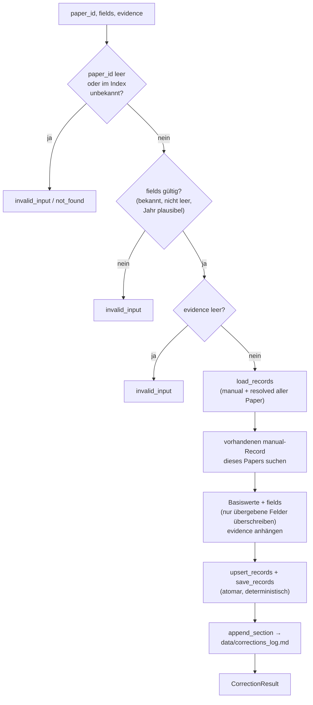
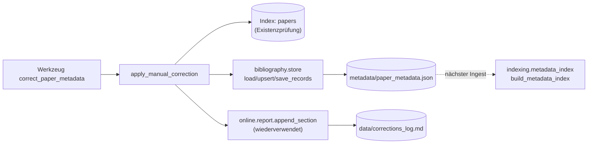

# Modul-Doku: `corrections.py`

| Feld | Wert |
| --- | --- |
| **Modul** | `src/research_graphrag/bibliography/corrections.py` |
| **Paket** | `bibliography` – zitierfähige Metadaten |
| **Phase** | – (ADR-getrieben, außerhalb der Roadmap-Phasenzählung) |
| **Grundlagen** | [ADR 0039](../../../../docs/adr/0039-correction-tool-and-pdf-file-access.md), [ADR 0025](../../../../docs/adr/0025-citable-paper-metadata.md), [ADR 0026](../../../../docs/adr/0026-online-metadata-resolution.md) |

---

## 1. Zweck

Schreibt eine **Korrektur** bibliografischer Felder (Titel, Autoren, Jahr, Venue, DOI/arXiv, URL)
als `manual`-Record nach `metadata/paper_metadata.json` – die bereits höchste Herkunft der
bestehenden Auflösungskette. Erstes **schreibendes** Modul, das über ein MCP-Tool erreichbar ist;
die eigentliche Persistenz bleibt vollständig in [store](store.md).

## 2. Öffentliche Schnittstelle

| Symbol | Art | Aufgabe |
| --- | --- | --- |
| `apply_manual_correction` | Funktion | Paper-ID + Felder + Beleg → `CorrectionResult` |
| `CorrectionResult` | Dataclass | Ergebnis mit `to_dict()` |
| `LOG_NAME` | Konstante | Dateiname des append-only Protokolls (`corrections_log.md`) |
| `EFFECTIVE_AFTER` | Konstante | Fester Hinweistext, wann eine Korrektur wirkt |

## 3. Ablauf

### Merge statt Ersetzen

`bibliography.store.upsert_records` ersetzt den **ganzen** `(paper_id, "manual")`-Record. Ohne
den in diesem Modul vorgeschalteten Merge-Schritt würde eine zweite Korrektur an einem anderen
Feld die erste stillschweigend löschen. `apply_manual_correction` lädt deshalb den vorhandenen
Record, überschreibt nur die übergebenen Felder und behält alle anderen unverändert bei.

### Zwei Nachvollziehbarkeits-Spuren

Das live gespeicherte `manual.evidence`-Feld trägt nur einen **kumulierten** Belegtext (neue
Belege werden mit `; ` angehängt) – ein einzelnes Feld kann nicht mehrere, feldspezifische Belege
tragen. Die **granulare** Spur (welches Feld wurde wann von welchem Wert auf welchen geändert,
mit welchem Beleg) steht stattdessen im append-only Protokoll `data/corrections_log.md`. Zusammen
mit der Git-Historie von `metadata/paper_metadata.json` ergibt das zwei unabhängige, sich
ergänzende Nachweise.

### Wirkung erst beim nächsten Ingest

Das Modul schreibt ausschließlich `metadata/paper_metadata.json`. `get_paper`/`get_reference`/
`answer_question` lesen bibliografische Daten jedoch aus der im Index gebauten Tabelle
`paper_metadata`, die nur ein voller `python -m scripts.ingest`-Lauf neu baut – dieselbe
Verzögerung wie beim bestehenden `python -m scripts.resolve_metadata`. `CorrectionResult.to_dict()`
weist das über das Feld `effective_after` aus.

## 4. Zusammenspiel

## 5. Fehler und Grenzfälle

| Situation | Fehlercode |
| --- | --- |
| leere `paper_id` | `invalid_input` |
| Index-Datei fehlt | `not_found` |
| `paper_id` im Index unbekannt | `not_found` |
| kein Feld-Parameter gesetzt | `invalid_input` |
| unbekannter Feldname | `invalid_input` |
| Text-Feld nach `strip()` leer | `invalid_input` |
| leere Autorenliste | `invalid_input` |
| `year` außerhalb `1000..aktuelles Jahr + 1` | `invalid_input` |
| leeres/fehlendes `evidence` | `invalid_input` |

Alle Prüfungen laufen **vor** jedem Schreibzugriff – ein ungültiger Aufruf hinterlässt weder eine
Änderung an `metadata/paper_metadata.json` noch einen Protokoll-Eintrag.

## 6. Determinismus

Atomares Schreiben (Temporärdatei + `os.replace`, geerbt von `bibliography.store.save_records`),
feste Feldreihenfolge, sortierte Schlüssel. Der einzige nicht-deterministische Anteil ist der
Zeitstempel im Protokoll-Eintrag (`data/corrections_log.md`), analog zu den bestehenden
append-only Protokollen (`metadata_log.md`, `references_log.md`).

## 7. Grenzen

- **Nur die sieben bibliografischen Felder** aus `bibliography.model.METADATA_FIELDS` – kein
  Volltext-/Chunk-Text, kein Kuratierungsurteil (siehe ADR 0039, Alternativen).
- **Kein Zurücksetzen/Löschen eines Feldes** über diese Schnittstelle; nur Überschreiben. Ein
  vollständiger Rückbau bleibt der Handbearbeitung von `metadata/paper_metadata.json`
  vorbehalten (git-versioniert).
- **Keine sofortige Wirkung** auf `get_paper`/`get_reference`/`answer_question` – siehe
  `EFFECTIVE_AFTER`.
