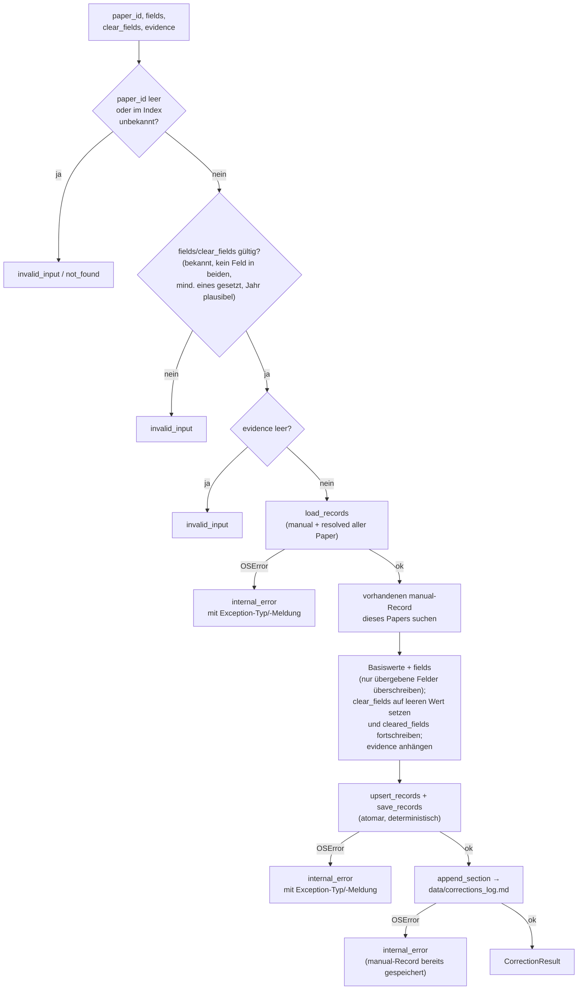
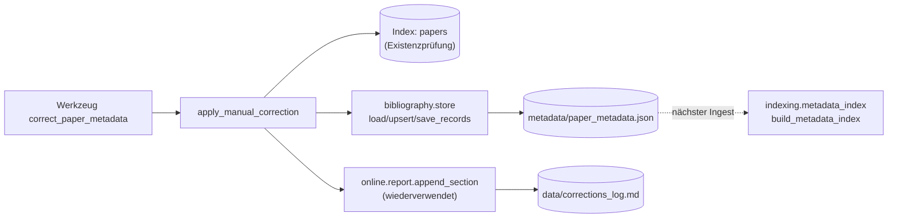

# Modul-Doku: `corrections.py`

| Feld | Wert |
| --- | --- |
| **Modul** | `src/research_graphrag/bibliography/corrections.py` |
| **Paket** | `bibliography` – zitierfähige Metadaten |
| **Phase** | – (ADR-getrieben, außerhalb der Roadmap-Phasenzählung) |
| **Grundlagen** | [ADR 0039](../../../../docs/adr/0039-correction-tool-and-pdf-file-access.md), [ADR 0040](../../../../docs/adr/0040-explicit-field-clearing.md), [ADR 0025](../../../../docs/adr/0025-citable-paper-metadata.md), [ADR 0026](../../../../docs/adr/0026-online-metadata-resolution.md) |

---

## 1. Zweck

Schreibt eine **Korrektur** bibliografischer Felder (Titel, Autoren, Jahr, Venue, DOI/arXiv, URL)
als `manual`-Record nach `metadata/paper_metadata.json` – die bereits höchste Herkunft der
bestehenden Auflösungskette. Erstes **schreibendes** Modul, das über ein MCP-Tool erreichbar ist;
die eigentliche Persistenz bleibt vollständig in [store](store.md).

## 2. Öffentliche Schnittstelle

| Symbol | Art | Aufgabe |
| --- | --- | --- |
| `apply_manual_correction` | Funktion | Paper-ID + Felder + Beleg (+ `clear_fields`) → `CorrectionResult` |
| `CorrectionResult` | Dataclass | Ergebnis mit `to_dict()` |
| `LOG_NAME` | Konstante | Dateiname des append-only Protokolls (`corrections_log.md`) |
| `EFFECTIVE_AFTER` | Konstante | Fester Hinweistext, wann eine Korrektur wirkt |
| `CLEARED_MARKER` | Konstante | Protokoll-Vermerk für ein explizit geleertes Feld (ADR 0040) |

## 3. Ablauf

### Merge statt Ersetzen

`bibliography.store.upsert_records` ersetzt den **ganzen** `(paper_id, "manual")`-Record. Ohne
den in diesem Modul vorgeschalteten Merge-Schritt würde eine zweite Korrektur an einem anderen
Feld die erste stillschweigend löschen. `apply_manual_correction` lädt deshalb den vorhandenen
Record, überschreibt nur die übergebenen Felder und behält alle anderen unverändert bei.

### Explizites Leeren statt bloßer Abwesenheit (ADR 0040)

Ein über `clear_fields` genanntes Feld wird auf seinen feldtyp-korrekten leeren Wert gesetzt
(`""`/`()`/`0`) **und** in `MetadataRecord.cleared_fields` aufgenommen – das unterscheidet
„geprüft: hat wirklich keinen Wert" von „nie geprüft". Ohne diese Unterscheidung würde
`bibliography.resolve.resolve_metadata` (über `MetadataRecord.has()`) weiterhin auf eine
niedrigerrangige, ggf. falsche Herkunft (typisch: ein per Regex extrahierter Fehltreffer)
zurückfallen, obwohl `manual` bereits geprüft hat. `cleared_fields` wird über Aufrufe hinweg
fortgeschrieben: Ein Feld verlässt die Menge erst wieder, wenn es in einem **späteren** Aufruf
tatsächlich **gesetzt** wird (`new_cleared = (previous_cleared - set(fields)) | set(clear_fields)`).
Ein Feld darf pro Aufruf nicht gleichzeitig gesetzt und geleert werden (`invalid_input`).

### Zwei Nachvollziehbarkeits-Spuren

Das live gespeicherte `manual.evidence`-Feld trägt nur einen **kumulierten** Belegtext (neue
Belege werden mit `; ` angehängt) – ein einzelnes Feld kann nicht mehrere, feldspezifische Belege
tragen. Die **granulare** Spur (welches Feld wurde wann von welchem Wert auf welchen geändert,
mit welchem Beleg) steht stattdessen im append-only Protokoll `data/corrections_log.md`. Zusammen
mit der Git-Historie von `metadata/paper_metadata.json` ergibt das zwei unabhängige, sich
ergänzende Nachweise.

### Wirkung erst beim nächsten Ingest

Das Modul schreibt ausschließlich `metadata/paper_metadata.json`. `get_paper`/`get_reference`/
`answer_question` lesen bibliografische Daten jedoch aus der im Index gebauten Tabelle
`paper_metadata`, die nur ein voller `python -m scripts.ingest`-Lauf neu baut – dieselbe
Verzögerung wie beim bestehenden `python -m scripts.resolve_metadata`. `CorrectionResult.to_dict()`
weist das über das Feld `effective_after` aus.

## 4. Zusammenspiel

## 5. Fehler und Grenzfälle

| Situation | Fehlercode |
| --- | --- |
| leere `paper_id` | `invalid_input` |
| Index-Datei fehlt | `not_found` |
| `paper_id` im Index unbekannt | `not_found` |
| weder ein Feld-Parameter noch `clear_fields` gesetzt | `invalid_input` |
| unbekannter Feldname (in `fields` oder `clear_fields`) | `invalid_input` |
| Feld gleichzeitig gesetzt **und** in `clear_fields` | `invalid_input` |
| Text-Feld nach `strip()` leer | `invalid_input` |
| leere Autorenliste | `invalid_input` |
| `year` außerhalb `1000..aktuelles Jahr + 1` | `invalid_input` |
| leeres/fehlendes `evidence` | `invalid_input` |
| `metadata_path` nicht lesbar (Sperre, Rechte) beim Laden vor dem Merge | `internal_error` (mit Exception-Typ/-Meldung, `details.metadata_path`) |
| `metadata_path` nicht schreibbar (Sperre, Rechte, falsches Arbeitsverzeichnis) | `internal_error` (mit Exception-Typ/-Meldung, `details.metadata_path`) |
| `data/corrections_log.md` nicht schreibbar, `manual`-Record aber bereits gespeichert | `internal_error` (mit Exception-Typ/-Meldung, `details.log_path`; Antworttext weist auf den bereits gespeicherten Record hin) |

Alle Validierungen laufen **vor** jedem Datei-Zugriff – ein ungültiger Aufruf hinterlässt weder
eine Änderung an `metadata/paper_metadata.json` noch einen Protokoll-Eintrag. Ein OS-Fehler kann
dagegen **während** der drei Datei-Zugriffe auftreten (Lesen vor dem Merge, zwei Schreibzugriffe
danach, siehe Tabelle) – anders als bei der generischen Absicherung in `mcp_server.server._guard`
liefert dieser anerkannte Fehlerfall Exception-Typ und -Meldung mit, statt in einer
nichtssagenden Meldung zu verschwinden (Analogie zu `extraction.pdf.extract_pdf`).

## 6. Determinismus

Atomares Schreiben über `atomic_write.atomic_write_bytes` (Temporärdatei je Aufruf + `os.replace`
mit Windows-Retry, geerbt von `bibliography.store.save_records`/`online.report.append_section`),
feste Feldreihenfolge, sortierte Schlüssel. Der einzige nicht-deterministische Anteil ist der
Zeitstempel im Protokoll-Eintrag (`data/corrections_log.md`), analog zu den bestehenden
append-only Protokollen (`metadata_log.md`, `references_log.md`).

## 7. Grenzen

- **Nur die sieben bibliografischen Felder** aus `bibliography.model.METADATA_FIELDS` – kein
  Volltext-/Chunk-Text, kein Kuratierungsurteil (siehe ADR 0039, Alternativen).
- **Kein vollständiges Entfernen** eines `manual`-Records oder eines Feldes aus der
  Speicherform; ein Feld kann überschrieben oder (seit ADR 0040) über `clear_fields` explizit
  auf leer gesetzt werden, aber nicht aus dem Record getilgt werden. Ein vollständiger Rückbau
  bleibt der Handbearbeitung von `metadata/paper_metadata.json` vorbehalten (git-versioniert).
- **Keine sofortige Wirkung** auf `get_paper`/`get_reference`/`answer_question` – siehe
  `EFFECTIVE_AFTER`.
- **Kein Lock über den ganzen Lade-Merge-Schreib-Zyklus.** Zwei nahezu gleichzeitige Korrekturen
  desselben Papers können sich weiterhin überschreiben (der letzte gewinnt, siehe
  `store.md`, Abschnitt 7) – bei einem persönlichen Werkzeug bewusst akzeptiert. Seit ADR 0039
  (Nachtrag 2026-09-19) führt das aber nicht mehr zum Absturz: `store.save_records` und
  `online.report.append_section` schreiben über
  [`atomic_write.atomic_write_bytes`](../../doc/atomic_write.md), das je Schreibversuch eine
  eindeutige Temporärdatei zieht (schließt die `FileNotFoundError`, wenn zwei Aufrufe ohne Warten
  auf die erste Antwort dieselbe Temporärdatei getroffen hätten) **und** einen kurzen Retry gegen
  eine gemessene, transiente `PermissionError` von `os.replace` auf dieselbe Zieldatei unternimmt
  (bemessen für wenige, nicht für beliebig viele gleichzeitige Aufrufe – siehe dessen Modul-Doku
  für die gemessenen Grenzwerte).
