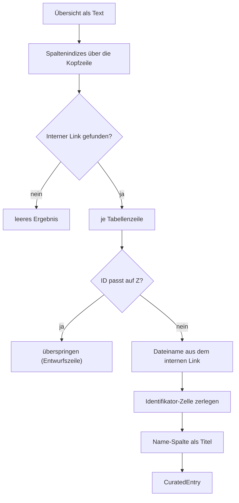
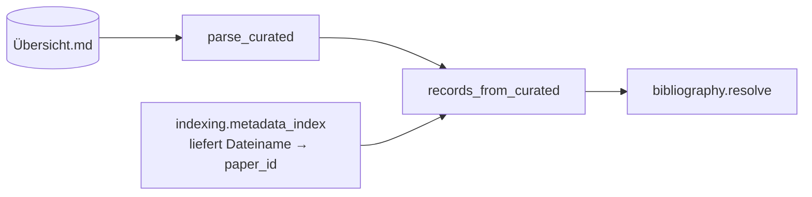

# Modul-Doku: `curated.py`

| Feld | Wert |
| --- | --- |
| **Modul** | `src/research_graphrag/bibliography/curated.py` |
| **Paket** | `bibliography` – zitierfähige Metadaten |
| **Phase** | 12 / K1 |
| **Grundlagen** | [ADR 0025](../../../../docs/adr/0025-citable-paper-metadata.md) · [ADR 0019](../../../../docs/adr/0019-corpus-intake-new-papers-phase8.md) |

---

## 1. Zweck

Macht die von Hand gepflegte Spalte `Externer Link/Indetifikator` der Literaturübersicht
maschinell nutzbar. Die Kernidee: Die beste vorhandene Identifikator-Quelle des Repositories lag
bis dahin ungenutzt in einer Markdown-Tabelle.

## 2. Öffentliche Schnittstelle

| Symbol | Art | Aufgabe |
| --- | --- | --- |
| `parse_curated` | Funktion | Übersichtstext → Einträge je Dateiname |
| `load_curated` | Funktion | Dateipfad-Einstieg (fehlende Datei ⇒ leer) |
| `parse_identifier` | Funktion | Zelle → `(doi, arxiv_id, url)` |
| `column_index` | Funktion | Spaltenindex über den Anfang der Kopfzelle |
| `records_from_curated` | Funktion | Einträge → `MetadataRecord` der Herkunft `curated` |
| `CuratedEntry` | Dataclass | eine kuratierte Zeile in maschinenlesbarer Form |
| `EXTERNAL_COLUMN_LABEL` / `NAME_COLUMN_LABEL` / `ARXIV_DOI_PREFIX` | Konstanten | Spaltenkennungen und arXiv-DOI-Präfix |

## 3. Ablauf

### Entwurfszeilen zählen nicht

Zeilen der ID-Reihe `Z1`, `Z2`, … stammen aus `overview.drafts.build_draft_row` und tragen dort
**exakt** die extrahierten Identifikatoren. Sie als eigene Quelle zu werten, wäre eine
Scheinbestätigung derselben Regex-Ausgabe – die Auflösung würde eine Bestätigung sehen, wo nur
eine Kopie steht.

### Spalten werden über die Kopfzeile gefunden

Der Index wird **nicht** hart kodiert, sondern über den Anfang der Kopfzelle bestimmt
(`externer link`, `name`). Damit übersteht das Modul eine Umsortierung der Übersicht und den
Tippfehler `Indetifikator` im Original.

### Erkannte Schreibweisen

| Zelle | Ergebnis |
| --- | --- |
| `[DOI:10.1145/abc](https://doi.org/10.1145/abc)` | `doi` |
| `[arXiv:2503.06689](https://arxiv.org/abs/2503.06689v2)` | `arxiv_id` (ohne Version) |
| `[…](https://openreview.net/forum?id=x)` | `url` |
| roher DOI `10.1145/abc` | `doi` |
| `(zu ergänzen)`, Fließtext | nichts |

Ein arXiv-DataCite-DOI (`10.48550/arXiv.…`) füllt **beide** Identifikator-Felder – die arXiv-ID
steckt darin und wäre sonst verloren.

### Der interne Link als Brücke zur Paper-ID

Die Übersicht kennt keine `paper_id`, sondern den Dateinamen. `records_from_curated` bekommt
deshalb die Zuordnung Dateiname → Paper-ID vom Aufrufer (dem Index-Bau), der beide kennt.

## 4. Zusammenspiel

## 5. Fehler und Grenzfälle

| Situation | Verhalten |
| --- | --- |
| Datei fehlt | leeres Ergebnis (kein Fehler) |
| kein Tabellenkopf erkennbar | leeres Ergebnis |
| Zeile ohne internen Link | übersprungen |
| Zeile ohne Titel **und** ohne Identifikator | erzeugt keinen Datensatz |
| Dateiname mit Klammern/Leerzeichen (`%28`, `%20`) | wird dekodiert |

Das Modul wirft keine `DomainError`: Eine unvollständige Übersicht ist ein Pflegezustand, kein
Fehlerzustand.

## 6. Determinismus

Die Einträge entstehen in Zeilenreihenfolge; `records_from_curated` sortiert zusätzlich nach
Dateiname. Bei gleicher Übersicht entsteht immer dieselbe Datensatzmenge.

## 7. Grenzen

- **Kein Autor, kein Jahr, keine Venue.** Die Übersicht führt diese Spalten nicht.
- **Kein Titel-Vertrauen bei Entwurfszeilen** – dort steht der Dateiname-Stamm.
- **Freitext-Zellen** wie `Findings ACL 2025, S. 1897-1913 (Identifier nachpflegen)` werden
  **nicht** interpretiert; sie liefern bewusst nichts, statt zu raten.
