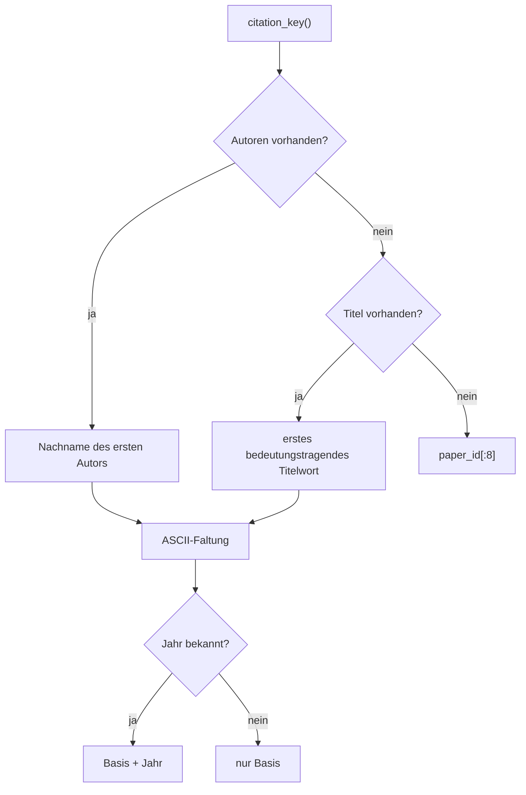
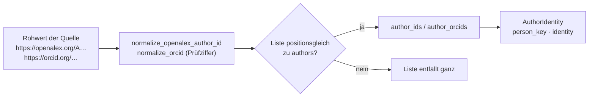
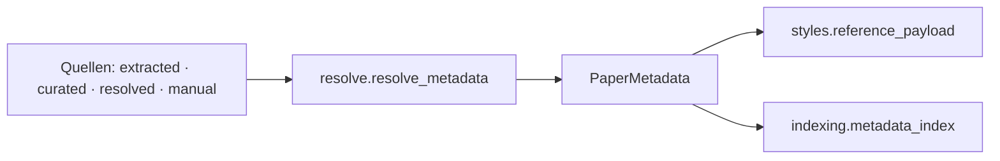

# Modul-Doku: `model.py`

| Feld | Wert |
| --- | --- |
| **Modul** | `src/research_graphrag/bibliography/model.py` |
| **Paket** | `bibliography` – zitierfähige Metadaten |
| **Phase** | 12 / K1, erweitert in 17 / A2 |
| **Grundlagen** | [ADR 0025](../../../../docs/adr/0025-citable-paper-metadata.md), [ADR 0040](../../../../docs/adr/0040-explicit-field-clearing.md), [ADR 0041](../../../../docs/adr/0041-author-identity-and-schema.md) |

---

## 1. Zweck

Definiert die beiden Datentypen, mit denen im Repository zitiert wird: die Aussage **einer**
Quelle über ein Paper (`MetadataRecord`) und den daraus **feldweise aufgelösten** Datensatz
(`PaperMetadata`). Die Kernidee ist die Trennung von *Beobachtung* und *Ergebnis* – nur so lässt
sich später beantworten, woher eine DOI stammt.

## 2. Öffentliche Schnittstelle

| Symbol | Art | Aufgabe |
| --- | --- | --- |
| `MetadataRecord` | Dataclass | Aussage einer Quelle inkl. Herkunft, Konfidenz und Beleg |
| `PaperMetadata` | Dataclass | aufgelöster Datensatz mit `origins`, `identifiers`, `citation_key()` |
| `empty_metadata` | Funktion | leerer Datensatz („nichts bekannt") |
| `surname_of` | Funktion | Nachname aus beiden Schreibweisen |
| `lowest_confidence` | Funktion | schwächste Stufe einer Menge |
| `AuthorIdentity` | Dataclass | Autorennennung mit OpenAlex-ID, ORCID, `person_key` und `identity` (ADR 0041) |
| `normalize_openalex_author_id` / `normalize_orcid` | Funktionen | prüfen und kürzen fremde Kennungen; ungültig ⇒ `""` |
| `person_name_key` | Funktion | Vergleichsschlüssel eines Namens (beide Schreibweisen, eine Faltung) |
| `person_key` | Funktion | Personenschlüssel: OpenAlex-ID, sonst `orcid:<ORCID>`, sonst `name:<normalisiert>` |
| `aligned_identifiers` / `read_identifier_list` / `identities_of` | Funktionen | Positionsgleichheit von Namen und Kennungen prüfen bzw. herstellen |
| `IDENTITY_OPENALEX` / `IDENTITY_ORCID` / `IDENTITY_NAME` | Konstanten | Identitätsstatus einer Nennung |
| `ORIGIN_MANUAL` / `ORIGIN_CURATED` / `ORIGIN_RESOLVED` / `ORIGIN_EXTRACTED` / `ORIGIN_PRECEDENCE` | Konstanten | Herkünfte und ihr Vorrang |
| `CONFIDENCE_STRONG` / `CONFIDENCE_WEAK` / `CONFIDENCE_NONE` / `CONFIDENCES` | Konstanten | Konfidenzstufen (aufsteigend) |
| `METADATA_FIELDS` / `CITABLE_FIELDS` | Konstanten | aufgelöste Felder bzw. Pflichtfelder |

## 3. Ablauf

Das Modul ist ein Datentyp-Modul ohne mehrstufigen Ablauf; die beiden erklärungsbedürftigen
Ableitungen sind der Zitierschlüssel und die Identifikator-Sicht.

### Der Zitierschlüssel

Die ASCII-Faltung **transliteriert** deutsche Umlaute (`ü` → `ue`, `ß` → `ss`) und verwirft alle
übrigen diakritischen Zeichen nach NFKD. Der Schlüssel ist eine **Anzeigehilfe**, kein
Identifikator: Zwei Paper desselben Erstautors und Jahres bekommen denselben Schlüssel.

### Identifikatoren und bevorzugter Link

`identifiers` liefert nur die tatsächlich belegten Schlüssel, in der Zitier-Präzedenz **DOI vor
arXiv vor URL**. `preferred_url` folgt derselben Reihenfolge und ist der Link, der in der
Literaturangabe erscheint.

### Explizites Leeren: `has()` und `cleared_fields` (ADR 0040)

`MetadataRecord.has(name)` beantwortet "hat diese Quelle eine Aussage zu diesem Feld?" – das ist
**nicht** dasselbe wie "ist der Wert nicht leer": Ein in `cleared_fields` genanntes Feld gilt auch
mit leerem Wert als "hat eine Aussage" (`True`), weil die Quelle das Feld ausdrücklich als leer
**bestätigt** hat, statt es nie geprüft zu haben. Ohne diese Unterscheidung würde
`resolve.resolve_metadata` ein leeres `manual`-Feld wie "keine Meinung" behandeln und auf eine
niedrigerrangige, ggf. falsche Herkunft zurückfallen. `cleared_fields` ist additiv (Default
leeres Frozenset) – ein Datensatz ohne diesen Schlüssel in der Speicherform verhält sich exakt
wie vor ADR 0040.

### Personenkennung: positionsgleiche Listen (ADR 0041)

`MetadataRecord` und `PaperMetadata` tragen je Autor die OpenAlex-Autor-ID und die ORCID als
**positionsgleiche** Listen `author_ids`/`author_orcids` neben `authors` (leerer String =
unbekannt). `authors` bleibt dabei unverändert ein Tupel von Namen in der Schreibweise der Quelle.
Jeder bestehende Verbraucher (Stile, Zitierschlüssel, Korrektur-Tool) bleibt deshalb unberührt.

Zwei Regeln tragen die Präzision:

- **Geprüft, nicht nur gekürzt.** Eine OpenAlex-Kennung muss dem Muster `A` + Ziffern folgen, eine
  ORCID der Prüfziffer nach ISO 7064 genügen. Eine falsche Kennung wäre schlimmer als keine, weil
  sie zwei Personen still verbinden könnte.
- **Verschoben ⇒ verworfen.** Passt die Länge einer Liste nicht mehr zu `authors`, etwa nach einer
  Handbearbeitung der Namen, entfällt die Liste ganz, statt Kennungen an falsche Namen zu heften.

`person_name_key` dreht „Nachname, Vorname" um und faltet über `ascii_fold`. Es gibt also **keine**
zweite Faltung, und „Asai, Akari" und „Akari Asai" fallen zusammen. `person_key` bevorzugt die
Kennung; eine reine Namensidentität trägt das Präfix `name:`, damit sie in keiner Ausgabe als
bestätigte Identität erscheint.

Die Speicherform schreibt `author_ids`/`author_orcids` nur, wenn mindestens eine Kennung vorliegt.
Ein Datensatz ohne Kennung bleibt so byte-identisch zur Form vor ADR 0041, und eine alte Datei lädt
ohne Migration.

### Warum keine feldweise Konfidenz

`PaperMetadata` trägt **eine** Konfidenz, nicht eine je Feld. Sie ist die **niedrigste** der
beteiligten Quellen: Eine Angabe ist nur so verlässlich wie ihr schwächster verwendeter
Bestandteil. Eine feinere Auflösung wäre möglich, aber für die Aussage „darf ich das so
zitieren?" ohne Gewinn.

## 4. Zusammenspiel

Das Modul kennt weder Dateien noch Netz noch Index – es ist reine Datenhaltung.

## 5. Fehler und Grenzfälle

| Situation | Verhalten |
| --- | --- |
| Autorenangabe ohne Vornamen (`"Cher"`) | Nachname = Eingabe, keine Initialen |
| Namenspräfixe (`van`, `de`) | zählen als Vorname – dokumentierte Grenze |
| `authors` als einzelne Zeichenkette in der Speicherform | wird zu einem Tupel normalisiert |
| unbekannte Herkunft in `origin` | kein Fehler; die Auflösung reiht sie hinten ein |
| `cleared_fields` fehlt in der Speicherform (jede Datei vor ADR 0040) | leeres Frozenset – unverändertes altes Verhalten |
| `author_ids`/`author_orcids` fehlen (jede Datei vor ADR 0041) | leere Tupel – alle Nennungen haben `identity = "name"` |
| Kennungsliste nicht positionsgleich zu `authors` | Liste entfällt ganz (keine Kennung am falschen Namen) |
| ungültige Kennung (Werk-ID statt Autor-ID, falsche ORCID-Prüfziffer) | wird zu `""` |
| Feld in `cleared_fields`, aber mit einem (widersprüchlich) nicht-leeren Wert | `has()` liefert `True` unabhängig vom Wert; die Erzeugung eines solchen Widerspruchs verhindert `corrections.py`, nicht dieses Modul |

## 6. Determinismus

Alle Ableitungen sind reine Funktionen der Felder; `to_dict()` hat eine feste Schlüsselreihenfolge.

## 7. Grenzen

- **Keine Formatierung.** Die Literaturangaben erzeugt [styles](styles.md); so bleibt das
  Datenmodell frei von Stilwissen.
- **Kein Eindeutigkeitsanspruch** des Zitierschlüssels.
- **Keine Validierung** von DOI- oder arXiv-Syntax; das leisten die schreibenden Quellen. Die
  Personenkennungen werden dagegen hier geprüft, weil sie zusätzlich aus handbearbeiteten Dateien
  stammen können.
- **Namensgleichheit ist keine Identität.** `person_name_key` trennt Gleichnamige nicht; das tut
  nur eine Kennung.
