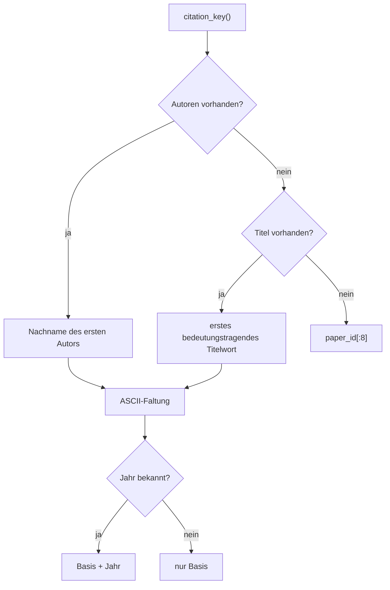
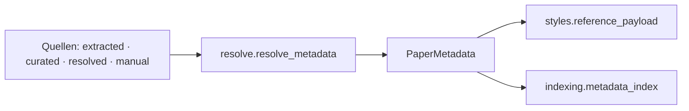

# Modul-Doku: `model.py`

| Feld | Wert |
| --- | --- |
| **Modul** | `src/research_graphrag/bibliography/model.py` |
| **Paket** | `bibliography` – zitierfähige Metadaten |
| **Phase** | 12 / K1 |
| **Grundlagen** | [ADR 0025](../../../../docs/adr/0025-citable-paper-metadata.md) |

---

## 1. Zweck

Definiert die beiden Datentypen, mit denen im Repository zitiert wird: die Aussage **einer**
Quelle über ein Paper (`MetadataRecord`) und den daraus **feldweise aufgelösten** Datensatz
(`PaperMetadata`). Die Kernidee ist die Trennung von *Beobachtung* und *Ergebnis* – nur so lässt
sich später beantworten, woher eine DOI stammt.

## 2. Öffentliche Schnittstelle

| Symbol | Art | Aufgabe |
| --- | --- | --- |
| `MetadataRecord` | Dataclass | Aussage einer Quelle inkl. Herkunft, Konfidenz und Beleg |
| `PaperMetadata` | Dataclass | aufgelöster Datensatz mit `origins`, `identifiers`, `citation_key()` |
| `empty_metadata` | Funktion | leerer Datensatz („nichts bekannt") |
| `surname_of` | Funktion | Nachname aus beiden Schreibweisen |
| `lowest_confidence` | Funktion | schwächste Stufe einer Menge |
| `ORIGIN_MANUAL` / `ORIGIN_CURATED` / `ORIGIN_RESOLVED` / `ORIGIN_EXTRACTED` / `ORIGIN_PRECEDENCE` | Konstanten | Herkünfte und ihr Vorrang |
| `CONFIDENCE_STRONG` / `CONFIDENCE_WEAK` / `CONFIDENCE_NONE` / `CONFIDENCES` | Konstanten | Konfidenzstufen (aufsteigend) |
| `METADATA_FIELDS` / `CITABLE_FIELDS` | Konstanten | aufgelöste Felder bzw. Pflichtfelder |

## 3. Ablauf

Das Modul ist ein Datentyp-Modul ohne mehrstufigen Ablauf; die beiden erklärungsbedürftigen
Ableitungen sind der Zitierschlüssel und die Identifikator-Sicht.

### Der Zitierschlüssel

Die ASCII-Faltung **transliteriert** deutsche Umlaute (`ü` → `ue`, `ß` → `ss`) und verwirft alle
übrigen diakritischen Zeichen nach NFKD. Der Schlüssel ist eine **Anzeigehilfe**, kein
Identifikator: Zwei Paper desselben Erstautors und Jahres bekommen denselben Schlüssel.

### Identifikatoren und bevorzugter Link

`identifiers` liefert nur die tatsächlich belegten Schlüssel, in der Zitier-Präzedenz **DOI vor
arXiv vor URL**. `preferred_url` folgt derselben Reihenfolge und ist der Link, der in der
Literaturangabe erscheint.

### Warum keine feldweise Konfidenz

`PaperMetadata` trägt **eine** Konfidenz, nicht eine je Feld. Sie ist die **niedrigste** der
beteiligten Quellen: Eine Angabe ist nur so verlässlich wie ihr schwächster verwendeter
Bestandteil. Eine feinere Auflösung wäre möglich, aber für die Aussage „darf ich das so
zitieren?" ohne Gewinn.

## 4. Zusammenspiel

Das Modul kennt weder Dateien noch Netz noch Index – es ist reine Datenhaltung.

## 5. Fehler und Grenzfälle

| Situation | Verhalten |
| --- | --- |
| Autorenangabe ohne Vornamen (`"Cher"`) | Nachname = Eingabe, keine Initialen |
| Namenspräfixe (`van`, `de`) | zählen als Vorname – dokumentierte Grenze |
| `authors` als einzelne Zeichenkette in der Speicherform | wird zu einem Tupel normalisiert |
| unbekannte Herkunft in `origin` | kein Fehler; die Auflösung reiht sie hinten ein |

## 6. Determinismus

Alle Ableitungen sind reine Funktionen der Felder; `to_dict()` hat eine feste Schlüsselreihenfolge.

## 7. Grenzen

- **Keine Formatierung.** Die Literaturangaben erzeugt [styles](styles.md); so bleibt das
  Datenmodell frei von Stilwissen.
- **Kein Eindeutigkeitsanspruch** des Zitierschlüssels.
- **Keine Validierung** von DOI- oder arXiv-Syntax; das leisten die schreibenden Quellen.
