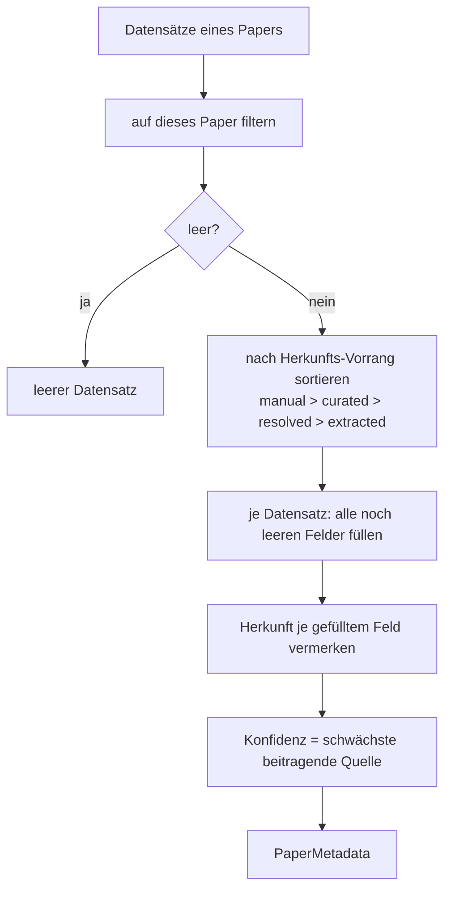
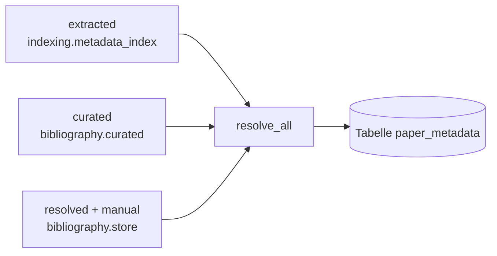

# Modul-Doku: `resolve.py`

| Feld | Wert |
| --- | --- |
| **Modul** | `src/research_graphrag/bibliography/resolve.py` |
| **Paket** | `bibliography` – zitierfähige Metadaten |
| **Phase** | 12 / K1 |
| **Grundlagen** | [ADR 0025](../../../../docs/adr/0025-citable-paper-metadata.md), [ADR 0040](../../../../docs/adr/0040-explicit-field-clearing.md) |

---

## 1. Zweck

Führt die Aussagen mehrerer Quellen über dasselbe Paper zu **einem** zitierfähigen Datensatz
zusammen. Die Kernidee ist die **feldweise** Auflösung: Nicht ein Datensatz gewinnt, sondern je
Feld die vertrauenswürdigste Quelle, die etwas dazu sagt.

## 2. Öffentliche Schnittstelle

| Symbol | Art | Aufgabe |
| --- | --- | --- |
| `resolve_metadata` | Funktion | Datensätze eines Papers → `PaperMetadata` |
| `resolve_all` | Funktion | mehrere Paper in einem Durchgang |

## 3. Ablauf

### Warum feldweise und nicht datensatzweise

Die Quellen sind **komplementär**, nicht konkurrierend: Die kuratierte Übersicht kennt den
Publisher-DOI, aber weder Autoren noch Venue; die Online-Auflösung kennt beides, nennt aber oft
nur den Preprint-DOI. Eine datensatzweise Auswahl müsste sich für eine Hälfte entscheiden und
die andere verwerfen.

### "Leer" heißt nicht immer "keine Meinung" (ADR 0040)

Der Schritt "alle noch leeren Felder füllen" fragt nicht den rohen Feldwert ab, sondern
`MetadataRecord.has(name)`. Ein Feld in `cleared_fields` liefert dort `True`, obwohl sein Wert
leer ist – die Quelle hat das Feld **geprüft** und ausdrücklich als leer bestätigt, statt es nie
befüllt zu haben. Ohne diese Unterscheidung würde ein leeres `manual`-Feld wie "keine Meinung"
behandelt und die Auflösung fiele auf eine niedrigerrangige, ggf. falsche Herkunft zurück (der
Auslöser war eine per Regex extrahierte arXiv-ID, die tatsächlich einem im Volltext zitierten
anderen Paper gehörte). Dieses Modul selbst ändert sich dadurch **nicht** – die neue Semantik
lebt vollständig in `MetadataRecord.has()`.

### Nur wer beiträgt, beeinflusst die Konfidenz

In die Konfidenz gehen ausschließlich die Datensätze ein, die **mindestens ein Feld** gefüllt
haben. Eine schwach belegte Quelle, deren Werte ohnehin schon von einer stärkeren stammen, zieht
das Ergebnis nicht herunter. Ohne diese Regel wäre praktisch jeder Datensatz `weak`, weil die
Extraktion immer den Dateinamen als Titel anbietet.

### Unbekannte Herkunft

Ein Herkunftsname außerhalb von `ORIGIN_PRECEDENCE` wird **hinten** einsortiert (stabil nach
Name). Er verdrängt damit keine bekannte Quelle, geht aber auch nicht verloren – eine künftige
fünfte Herkunft ist ohne Codeänderung lesbar.

## 4. Zusammenspiel

## 5. Fehler und Grenzfälle

| Situation | Verhalten |
| --- | --- |
| keine Datensätze | leerer `PaperMetadata`, Konfidenz `none` |
| Datensätze anderer Paper in der Eingabe | werden ignoriert |
| zwei Datensätze derselben Herkunft | beide werden gelesen (stabile Reihenfolge) |
| Paper in `resolve_all` ohne Datensatz | erscheint mit leerem Datensatz im Ergebnis |

Das Modul wirft **keine** `DomainError` – es hat keine Ein-/Ausgabe.

## 6. Determinismus

Die Sortierung ist total (Vorrangindex, dann Herkunftsname); bei gleicher Eingabe entsteht immer
dasselbe Ergebnis, unabhängig von der Reihenfolge der Datensätze.

## 7. Grenzen

- **Keine Plausibilitätsprüfung.** Ein kuratierter Tippfehler in der DOI gewinnt gegen eine
  korrekte extrahierte – das ist gewollt (der Mensch entscheidet), aber eine Fehlerquelle.
- **Keine Teilfeld-Zusammenführung.** Autorenlisten werden nicht gemischt; es gewinnt eine.
