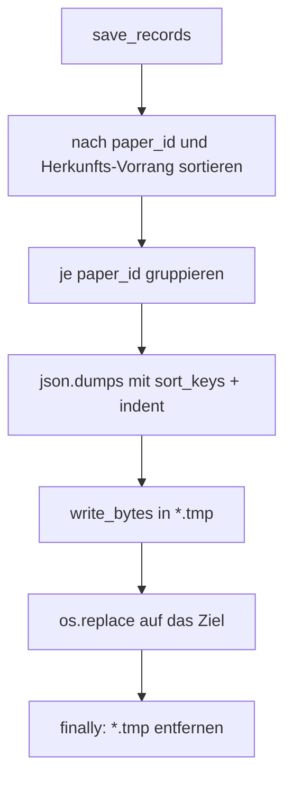
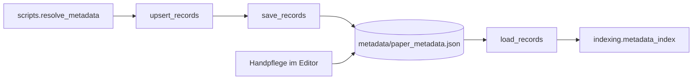

# Modul-Doku: `store.py`

| Feld | Wert |
| --- | --- |
| **Modul** | `src/research_graphrag/bibliography/store.py` |
| **Paket** | `bibliography` – zitierfähige Metadaten |
| **Phase** | 12 / K1 |
| **Grundlagen** | [ADR 0025](../../../../docs/adr/0025-citable-paper-metadata.md) · [ADR 0026](../../../../docs/adr/0026-online-metadata-resolution.md) |

---

## 1. Zweck

Verwaltet die **versionierte** Datei `metadata/paper_metadata.json` – die einzige Stelle, an der
extern aufgelöste (`resolved`) und von Hand gepflegte (`manual`) Zitationsdaten dauerhaft liegen.
Die Kernidee ist ein Format, das gleichzeitig maschinell geschrieben und von Hand bearbeitet
werden kann.

## 2. Öffentliche Schnittstelle

| Symbol | Art | Aufgabe |
| --- | --- | --- |
| `load_records` | Funktion | Datei → Datensätze (fehlende Datei ⇒ leer) |
| `save_records` | Funktion | Datensätze → Datei (deterministisch, atomar) |
| `upsert_records` | Funktion | je `(paper_id, origin)` ersetzen, Rest behalten |
| `metadata_path` | Funktion | Pfad unterhalb eines Wurzelverzeichnisses |
| `SCHEMA_VERSION` / `METADATA_DIR` / `METADATA_FILENAME` / `WRITABLE_ORIGINS` | Konstanten | Format und Ablageort |

## 3. Ablauf

### `write_bytes` statt `write_text`

Unter Windows würde `write_text` jedes `\n` zu `\r\n` machen. Die Datei wäre dann je nach
Plattform verschieden – ein Byte-Vergleich zwischen zwei Läufen würde scheitern, und in der
Versionsverwaltung erschiene sie bei jedem Wechsel als vollständig geändert. Deshalb wird der
fertige Text als **Bytes** geschrieben.

### Warum nur zwei Herkünfte gespeichert werden

`extracted` und `curated` werden bei **jedem** Index-Bau neu abgeleitet – aus den Canonical-Papern
bzw. der Übersicht. Sie hier zusätzlich zu speichern, hieße zwei Wahrheiten zu pflegen: Eine
Korrektur in der Übersicht würde von einer veralteten Kopie überstimmt. `WRITABLE_ORIGINS`
dokumentiert diese Festlegung.

### Der Schlüssel des Upsert

`upsert_records` ersetzt je **Paar** aus Paper und Herkunft. Damit überschreibt ein erneuter
Auflösungslauf ausschließlich seine eigenen früheren Ergebnisse; ein `manual`-Eintrag zum selben
Paper bleibt unangetastet.

## 4. Zusammenspiel

Der Weg ist **einseitig gerichtet**: Netz → Datei → Index. Kein Werkzeug schreibt zur Abfragezeit.

## 5. Fehler und Grenzfälle

| Situation | Fehlercode |
| --- | --- |
| Datei fehlt | kein Fehler – leeres Ergebnis |
| defektes JSON | `parse_error` |
| Wurzel ist kein Objekt | `constraint_violation` |
| unbekannte `schema_version` | `constraint_violation` |
| `papers` ist kein Objekt | `constraint_violation` |
| Datensatzliste eines Papers ist keine Liste bzw. enthält kein Objekt | `constraint_violation` |

Die strenge Prüfung ist Absicht: Eine von Hand bearbeitete Datei soll bei einem Tippfehler
**auffallen** und nicht stillschweigend als leer gelten.

## 6. Determinismus

Sortierte Schlüssel, feste Feldreihenfolge, `\n` als Zeilenende. Zwei Läufe mit derselben Menge
schreiben byte-identisch – auch bei umgekehrter Eingabereihenfolge.

## 7. Grenzen

- **Keine Historie.** Ein Upsert überschreibt; wer den Verlauf braucht, findet ihn in
  `data/metadata_log.md` und in der Versionsverwaltung.
- **Keine Sperren.** Zwei gleichzeitige Läufe können sich überschreiben (der letzte gewinnt);
  bei einem persönlichen Werkzeug ist das akzeptabel.
