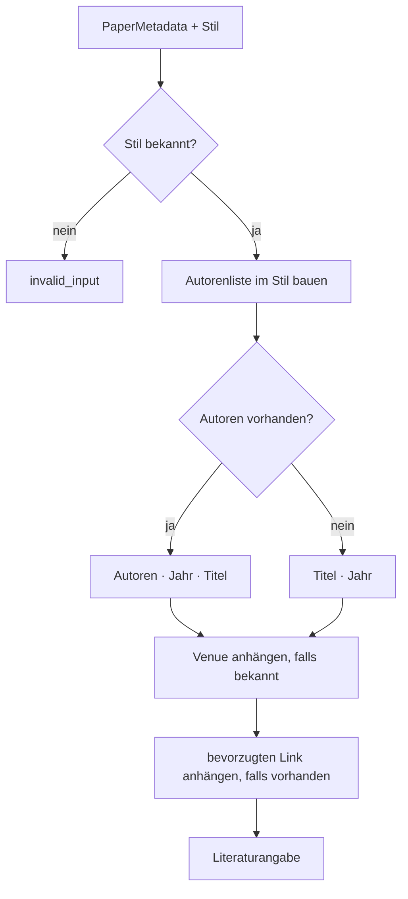
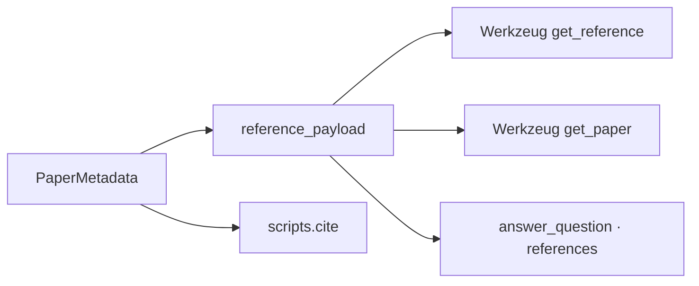

# Modul-Doku: `styles.py`

| Feld | Wert |
| --- | --- |
| **Modul** | `src/research_graphrag/bibliography/styles.py` |
| **Paket** | `bibliography` – zitierfähige Metadaten |
| **Phase** | 12 / K1 |
| **Grundlagen** | [ADR 0025](../../../../docs/adr/0025-citable-paper-metadata.md) |

---

## 1. Zweck

Erzeugt aus einem aufgelösten Datensatz die **fertige Literaturangabe** und den Kurzbeleg – in
Harvard (*Cite Them Right*) und APA 7. Die Kernidee ist eine rein funktionale Formatierung ohne
LLM, ohne Netz und ohne Datum, damit dieselben Daten immer denselben Text ergeben.

## 2. Öffentliche Schnittstelle

| Symbol | Art | Aufgabe |
| --- | --- | --- |
| `format_reference` | Funktion | vollständige Literaturangabe in einem Stil |
| `format_in_text` | Funktion | Kurzbeleg für den Fließtext |
| `reference_payload` | Funktion | Datensatz + beide Stile als Ausgabeform der Werkzeuge |
| `STYLE_HARVARD` / `STYLE_APA` / `STYLES` | Konstanten | unterstützte Stile |
| `APA_MAX_AUTHORS` / `HARVARD_MAX_AUTHORS` | Konstanten | Kürzungsgrenzen der Autorenliste |

## 3. Ablauf

### Die beiden Stile im Detail

| Merkmal | APA 7 | Harvard (Cite Them Right) |
| --- | --- | --- |
| Initialen | `A. M.` (mit Leerzeichen) | `A.M.` (ohne) |
| Verbindung | `, & ` vor dem letzten Namen | ` and ` vor dem letzten Namen |
| Kürzung | ab 21 Autoren (`…`, dann letzter) | ab 4 Autoren (`et al.`) |
| Titel | ohne Anführungszeichen, mit Punkt | in einfachen Anführungszeichen |
| Link | direkt am Ende | `Available at: …` |
| kein Jahr | `(n.d.)` | `(no date)` |

### Fehlende Angaben werden markiert, nicht geraten

Ohne Autoren rückt der **Titel** an die Autorenstelle – so verlangen es beide Stile. Fehlt auch
der Titel, erscheint `Ohne Titel`; das ist absichtlich auffällig. Ob eine Angabe vollständig ist,
beantwortet `PaperMetadata.is_citable()`, nicht dieses Modul.

### Kein Zugriffsdatum

Beide Stile sehen bei Online-Quellen ein Zugriffsdatum vor. Es wird bewusst **weggelassen**: Es
wäre vom Ausführungstag abhängig und würde jeden Byte-Vergleich brechen, auf dem die
Regressionsnachweise des Repositories beruhen.

### Der Punkt gehört zu den Initialen

Der Harvard-Zweig hängt an die Autorenliste **keinen** zusätzlichen Punkt an und schneidet auch
keinen ab – `Beispiel, A.M.` endet legitim mit einem Punkt, der zur Initiale gehört. Der Helfer
`_period` wird nur dort eingesetzt, wo ein Satzzeichen fehlen könnte.

## 4. Zusammenspiel

## 5. Fehler und Grenzfälle

| Situation | Verhalten |
| --- | --- |
| unbekannter Stilname | `invalid_input` |
| Stilname in Großschreibung | akzeptiert (Kleinschreibung wird normalisiert) |
| leerer Datensatz | `Ohne Titel. (n.d.).` bzw. `Ohne Titel (no date)` |
| kein Identifikator und keine URL | Linkteil entfällt vollständig |

## 6. Determinismus

Rein funktional: kein Zufall, kein Datum, kein Netz. Gleiche Felder ergeben denselben Text.

## 7. Grenzen

- **Nur zwei Stile.** Weitere (Chicago, IEEE) sind nicht umgesetzt.
- **Keine Werktypen.** Buch, Kapitel und Konferenzbeitrag werden gleich behandelt – der Korpus
  besteht aus Papern.
- **Namenspräfixe** (`van der`) werden nicht erkannt (siehe [model](model.md)).
- **Keine Seitenzahlen** in der Angabe; der Korpus liefert sie nicht verlässlich.
