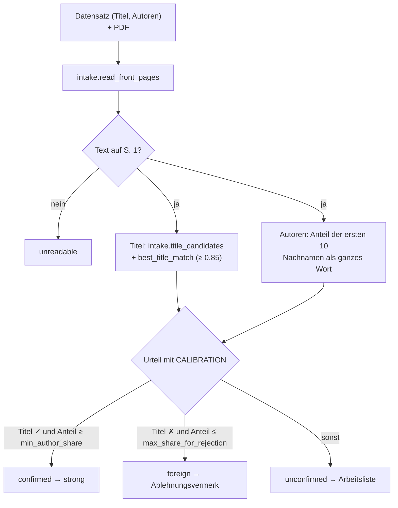
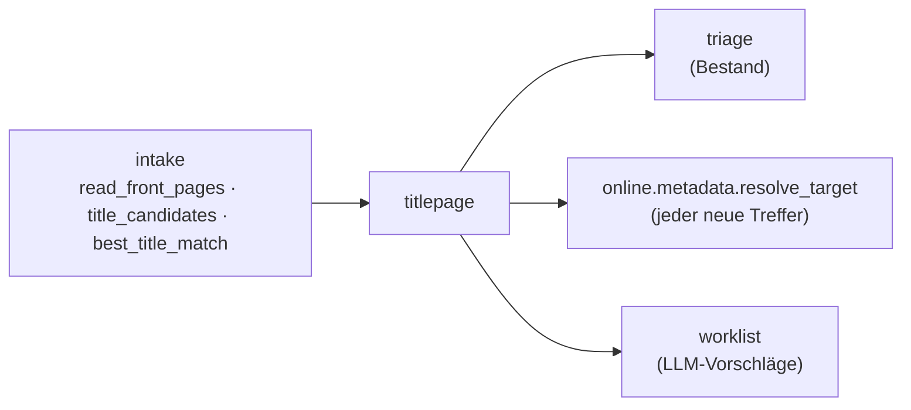

# Modul-Doku: `titlepage.py`

| Feld | Wert |
| --- | --- |
| **Modul** | `src/research_graphrag/bibliography/titlepage.py` |
| **Paket** | `bibliography` – zitierfähige Metadaten |
| **Phase** | 17 / A1 |
| **Grundlagen** | [ADR 0042](../../../../docs/adr/0042-title-page-evidence-and-rejections.md), [ADR 0026](../../../../docs/adr/0026-online-metadata-resolution.md), [ADR 0019](../../../../docs/adr/0019-corpus-intake-new-papers-phase8.md) |

---

## 1. Zweck

Beantwortet deterministisch die Frage: **Gehört dieser Metadaten-Datensatz zu diesem PDF?** Der
Anlass ist Befund 3 der Phase-17-Planung. Bei 44 von 92 online aufgelösten `weak`-Volltexten
standen weder Titel noch Autoren des Treffers auf Seite 1, und alle sechs geprüften Fälle waren
fremde Paper. Die Titelseite dient dabei nur als **Beleg**, nie als **Quelle**: Aus dem PDF-Text
wird kein Wert übernommen.

## 2. Öffentliche Schnittstelle

| Symbol | Art | Aufgabe |
| --- | --- | --- |
| `check_front_pages` | Funktion | Titel-Ähnlichkeit und Nachnamen-Anteil auf Seite 1 messen (rein funktional) |
| `check_pdf` | Funktion | dasselbe gegen ein lokales PDF; ein defektes PDF ist ein Befund, kein Fehler |
| `pdf_path_for` | Funktion | lokales PDF finden: Korpus-Ordner + Dateiname, Rückfall `file://`-URI |
| `TitlePageCheck` | Dataclass | Messwerte, `verdict(calibration)`, `summary()` |
| `Calibration` / `CALIBRATION` | Dataclass / Konstante | die beiden in A0 kalibrierten Schwellen; **nicht kalibriert** bis A0, Punkt 3 |
| `upgrade` | Funktion | Datensatz auf `strong`; Herkunft bleibt, Beleg wird angehängt |
| `rejection_for` / `is_rejected` | Funktionen | Ablehnungsvermerk bauen bzw. prüfen (DOI, arXiv oder Titel) |
| `VERDICT_*` | Konstanten | `confirmed`, `foreign`, `unconfirmed`, `unreadable` |
| `EVIDENCE_TITLE_PAGE` / `MAX_CHECKED_SURNAMES` | Konstanten | Belegklasse; zehn geprüfte Nachnamen |

## 3. Ablauf

### Zwei Schwellen, bewusst unkalibriert ausgeliefert

Aufwertung und Ablehnung haben je eine eigene Schwelle. Die Ablehnung verlangt, dass der Titel
fehlt **und** kaum ein Autor auf Seite 1 steht, denn eine unleserliche Titelzeile ist kein fremdes
Paper. Beide Schwellen stehen auf `None`, bis A0, Punkt 3, sie an mindestens 30 von Hand
geprüften Fällen kalibriert hat. Bis dahin lautet jedes Urteil über eine lesbare Seite
`unconfirmed`.

`verdict()` liest `CALIBRATION` erst beim Aufruf, nicht über einen eingefrorenen Default. Die
geltende Kalibrierung hat damit genau **eine** Stelle im Code, und Tests können sie gezielt
ersetzen.

## 4. Zusammenspiel

## 5. Fehler und Grenzfälle

| Situation | Verhalten |
| --- | --- |
| PDF fehlt, ist defekt oder ohne Text | `readable = False`, Urteil `unreadable`; kein Abbruch |
| Datensatz ohne Autoren | nie `confirmed`, nie `foreign` (nichts zu belegen) |
| sehr kurzer Titel (< 30 Zeichen / < 5 Wörter) | nie `confirmed`: Grenze des geteilten Titel-Mechanismus |
| Nachname „Li“, Seitentext „Library“ | kein Treffer (ganzes Wort) |
| Umlaute im Namen oder im PDF | beidseitig über `ascii_fold` gefaltet |

## 6. Determinismus

Die Messung ist eine reine Funktion aus Seitentext, Titel und Autoren. Das Urteil hängt
zusätzlich nur von der versionierten `CALIBRATION` ab.

## 7. Grenzen

- Geprüft wird nur **Seite 1**. Autorenlisten, die erst auf Seite 2 stehen, zählen nicht.
- Der Beleg prüft Zugehörigkeit, nicht Vollständigkeit. Ein richtig zugeordneter Datensatz mit
  fehlendem Venue bleibt unvollständig.
