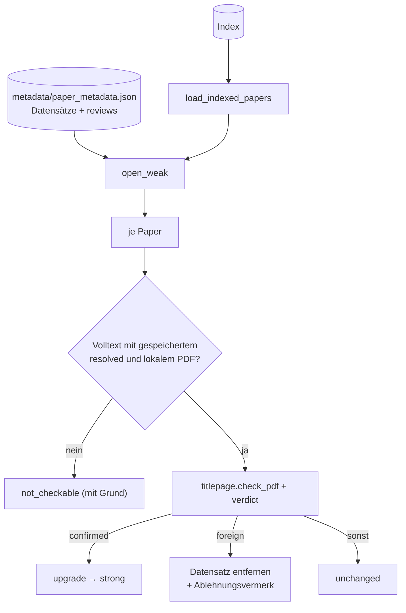

# Modul-Doku: `triage.py`

| Feld | Wert |
| --- | --- |
| **Modul** | `src/research_graphrag/bibliography/triage.py` |
| **Paket** | `bibliography` – zitierfähige Metadaten |
| **Phase** | 17 / A1 |
| **Grundlagen** | [ADR 0042](../../../../docs/adr/0042-title-page-evidence-and-rejections.md) |

---

## 1. Zweck

Wendet den [Seite-1-Beleg](titlepage.md) auf die **bereits gespeicherten** `resolved`-Datensätze
der offen schwach belegten Volltexte an. Bestätigte Treffer werden `strong`. Fremde werden
entfernt und mit einem **Ablehnungsvermerk** gesperrt. Alle übrigen bleiben unverändert und gehen
in die [Arbeitsliste](worklist.md). Einstiegspunkt ist `python -m scripts.verify_metadata`. Das
Modul greift nicht aufs Netz zu.

Welche Paper offen schwach belegt sind, stammt aus dem **Index**, also aus dem Stand des letzten
Ingest. Ein Datensatz, der erst nach dem Ingest in `metadata/paper_metadata.json` geschrieben
wurde, wird erst nach dem nächsten Ingest geprüft. Frische Treffer prüft ohnehin der
Auflösungslauf selbst.

## 2. Öffentliche Schnittstelle

| Symbol | Art | Aufgabe |
| --- | --- | --- |
| `load_indexed_papers` | Funktion | Quelle, Dokumentart und aufgelöste Metadaten je Paper aus dem Index |
| `open_weak` | Funktion | die schwach belegten Paper **ohne** ausgewiesenen Status |
| `triage_stored_records` | Funktion | Beleg anwenden, neuen Datenstand (nicht gespeichert) und Entscheidungen liefern |
| `render_triage` | Funktion | Abschnitt für `data/metadata_log.md` (samt Kalibrierungsstand) |
| `IndexedPaper` / `TriageDecision` / `TriageRun` | Dataclasses | Eingabe, Entscheidung, Ergebnis |
| `PdfChecker` | Typ | injizierbare Prüffunktion gegen ein PDF |
| `ACTION_*` | Konstanten | `upgraded`, `rejected`, `unchanged`, `not_checkable` |

## 3. Ablauf

Die neuen Datensätze und Vermerke gibt das Modul nur **zurück**. Der Aufrufer speichert beides
über `store.save_records(..., reviews=...)` in **einem** atomaren Schreibvorgang.

## 4. Zusammenspiel

Ein verworfenes Paper fällt auf seine übrigen Herkünfte zurück. Beim nächsten
`resolve_metadata`-Lauf wird es neu aufgelöst, über die Kennung der Titelseite bzw. den Titel aus
dem Dateinamen, wieder mit Seite-1-Beleg und unter Beachtung des Vermerks.

## 5. Fehler und Grenzfälle

| Situation | Verhalten |
| --- | --- |
| Index fehlt | `not_found` (aus `load_paper_metadata`) |
| Index nicht lesbar | `internal_error` |
| nur extrahierter Datensatz (kein `resolved`) | `not_checkable` – zuerst `resolve_metadata` |
| Referenz-Eintrag | `not_checkable` – keine Titelseite; Weg: `manual` |
| nicht kalibriert | jede Entscheidung `unchanged` oder `not_checkable`; das Protokoll sagt „nicht kalibriert“ |

## 6. Determinismus

Die Paper werden nach `paper_id` sortiert verarbeitet. Das Datum neuer Vermerke legt der Aufrufer
fest.

## 7. Grenzen

- Nur `weak`-Datensätze werden geprüft. Ein `strong` belegter Treffer wird nicht erneut geprüft.
