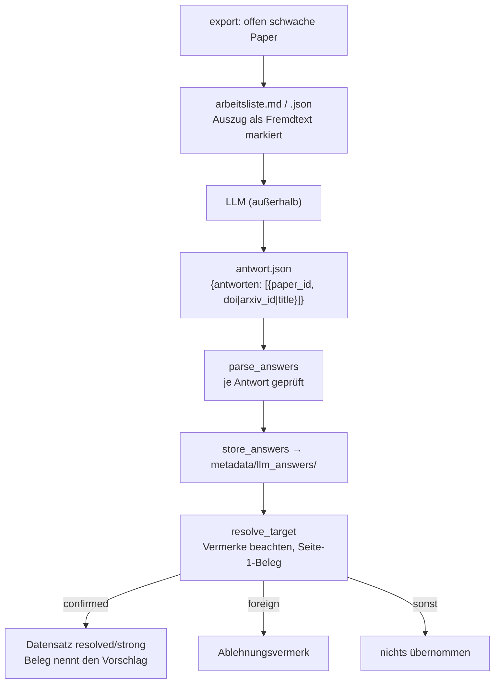

# Modul-Doku: `worklist.py`

| Feld | Wert |
| --- | --- |
| **Modul** | `src/research_graphrag/bibliography/worklist.py` |
| **Paket** | `bibliography` – zitierfähige Metadaten |
| **Phase** | 17 / A1 |
| **Grundlagen** | [ADR 0042](../../../../docs/adr/0042-title-page-evidence-and-rejections.md) |

---

## 1. Zweck

Die LLM-Arbeitsliste für die schwach belegten Paper, die der Seite-1-Beleg allein nicht klärt.
Grundsatz: **Das LLM schlägt vor, das Skript prüft.** Das LLM antwortet nur mit einer Kennung
oder einem Titel. Übernommen wird nur, was eine externe Quelle über diesen Vorschlag liefert
**und** der deterministische [Seite-1-Beleg](titlepage.md) bestätigt. Einstiegspunkt ist
`python -m scripts.metadata_worklist`.

## 2. Öffentliche Schnittstelle

| Symbol | Art | Aufgabe |
| --- | --- | --- |
| `build_worklist` | Funktion | Zeilen der Liste bauen (Datensatz, Befund, bereinigter Seitenauszug) |
| `render_worklist_markdown` / `render_worklist_json` / `write_worklist` | Funktionen | Liste mit Auftrag nach `data/worklists/<Zeitstempel>/` |
| `page_excerpt` | Funktion | Fremdtext bereinigen, begrenzen, Codezaun-Zeichen ersetzen |
| `parse_answers` | Funktion | Antwortdatei **einzeln** gegen das feste Format prüfen |
| `store_answers` | Funktion | Antwort unverändert unter `metadata/llm_answers/` ablegen |
| `import_suggestions` | Funktion | Vorschläge auflösen, nur Bestätigtes übernehmen, Fremdes verwerfen |
| `render_import` | Funktion | Abschnitt für `data/metadata_log.md` |
| `Suggestion` / `WorklistEntry` / `ImportOutcome` / `ImportRun` | Dataclasses | Vorschlag, Zeile, Ergebnis |
| `suggestion_target` | Funktion | Vorschlag → Auflösungsziel; `identifier_backed = False`, denn eine vorgeschlagene Kennung steht nicht belegt auf der Titelseite |
| `OUTCOME_*` | Konstanten | `accepted`, `not_confirmed`, `unresolved`, `not_checkable` |
| `WORKLIST_DIR` / `LLM_ANSWERS_DIR` | Konstanten | Ablageorte `data/worklists/` (regenerierbar) und `metadata/llm_answers/` (Sicherungsumfang) |
| `WORKLIST_FORMAT` / `ANSWER_KEY` / `SUGGESTION_KEYS` | Konstanten | Formatkennung, Antwortschlüssel `antworten`, erlaubte Angaben `doi`/`arxiv_id`/`title` |
| `MAX_EXCERPT_CHARS` / `MAX_LISTED_AUTHORS` / `MIN_TITLE_CHARS` / `MAX_SUGGESTION_CHARS` | Konstanten | Grenzen für Seitenauszug, Autorenzahl und Vorschlagslänge |

## 3. Ablauf



### Das Antwortformat

```json
{"antworten": [
  {"paper_id": "0123456789abcdef", "doi": "10.1145/1234567.1234568"},
  {"paper_id": "fedcba9876543210", "arxiv_id": "2401.00001"},
  {"paper_id": "00aa11bb22cc33dd", "title": "Der exakte Titel des Werks"}
]}
```

Je Paper gilt **genau eine** Angabe. Jedes weitere Feld macht die Antwort ungültig, auch Autoren,
Jahr oder Venue. Kennungen werden über `online.references.normalize_identifier` gedeutet; ein
DataCite-DOI von arXiv wird zur arXiv-ID. Eine Kennung mit Leerraum („siehe 10.1/x“) ist ungültig.

## 4. Zusammenspiel

Die Auflösung nutzt `online.metadata.resolve_target` mit `identifier_backed = False`. Eine
vorgeschlagene Kennung ist nicht lokal belegt, `strong` wird der Treffer allein über den Beleg.
Datensätze und Vermerke speichert der Aufrufer atomar über `store.save_records`.

## 5. Fehler und Grenzfälle

| Situation | Verhalten |
| --- | --- |
| Antwortdatei kein JSON oder ohne Liste `antworten` | `parse_error` – nichts geschieht |
| einzelne Antwort ungültig | nur diese entfällt, mit Grund im Bericht |
| zweite Antwort zum selben Paper | wird verworfen |
| Paper ohne lokales PDF / Referenz-Eintrag | `not_checkable` – Weg: `correct_paper_metadata` |
| Vorschlag trifft einen vermerkten Treffer | `unresolved` mit Hinweis auf den Vermerk |
| nicht kalibriert | nie `accepted` – der Import misst dann nur |

## 6. Determinismus

Liste und Bericht sind deterministisch aus Index, Metadatendatei und Titelseiten. Die Antwort des
LLM ist es nicht; sie wird deshalb unverändert und mit Zeitstempel abgelegt.

## 7. Grenzen

- Der Seitenauszug ist **nicht vertrauenswürdiger Fremdtext**. Er ist entschärft und markiert,
  aber eine Prompt-Injektion gegen das externe LLM lässt sich so nur begrenzen. Die eigentliche
  Sicherung liegt darin, dass kein LLM-Wert ungeprüft übernommen wird.
