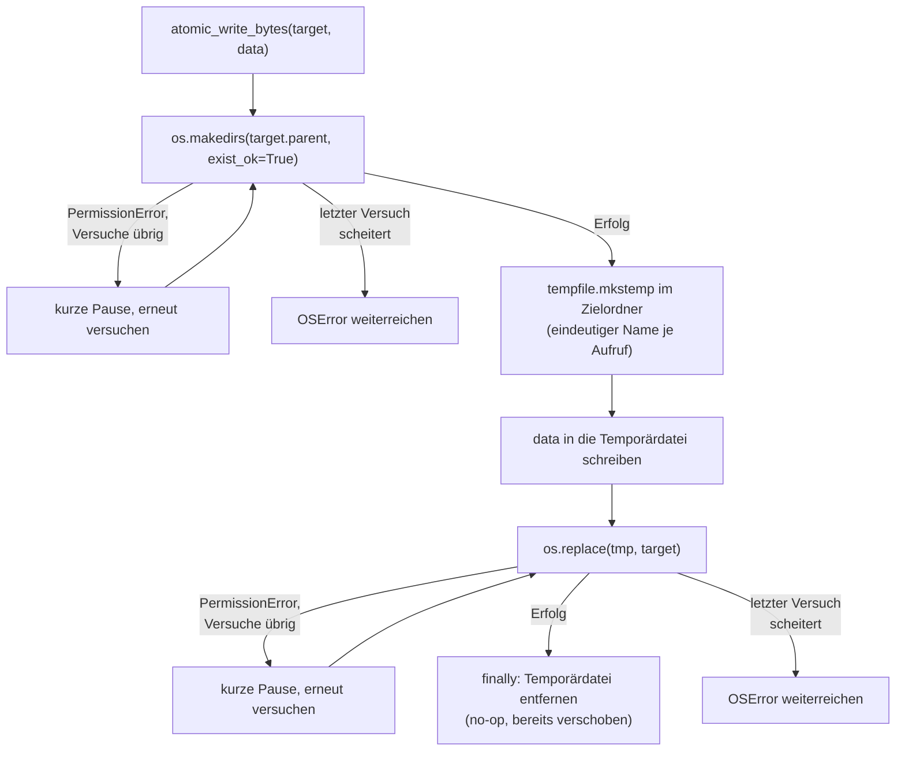
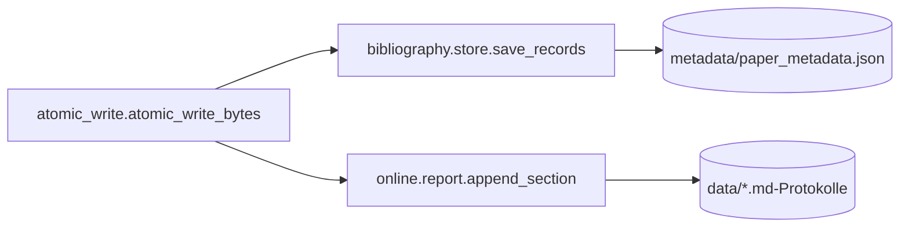

# Modul-Doku: `atomic_write.py`

| Feld | Wert |
| --- | --- |
| **Modul** | `src/research_graphrag/atomic_write.py` |
| **Paket** | Top-Level – Querschnitt |
| **Phase** | ADR 0039 (Nachträge 2026-09-19, 2026-09-23) |
| **Grundlagen** | [ADR 0039](../../../docs/adr/0039-correction-tool-and-pdf-file-access.md) |

---

## 1. Zweck

Die **eine** Stelle, die eine Datei deterministisch/atomar schreibt (Elternordner bei Bedarf
anlegen, Temporärdatei + `os.replace`), samt einem knappen Retry gegen einen gemessenen,
transienten Windows-Fehler – sowohl beim Anlegen des Zielordners als auch bei konkurrierenden
Schreibversuchen auf dieselbe Zieldatei. Vor diesem Modul hatten `bibliography.store.save_records`
und `online.report.append_section` je eine eigene, fast identische Kopie dieses Musters – eine
Änderung (wie diese Nachträge) hätte sonst beide Stellen treffen müssen.

## 2. Öffentliche Schnittstelle

| Symbol | Art | Aufgabe |
| --- | --- | --- |
| `atomic_write_bytes` | Funktion | Schreibt `data` atomar nach `target` |

## 3. Ablauf

### Warum eine eindeutige Temporärdatei je Aufruf

Ein fester `<name>.tmp`-Pfad wäre zwischen zwei nahezu gleichzeitigen Aufrufen geteilt: Der zuerst
fertige `os.replace` verschiebt ihn weg, ein zweiter, fast gleichzeitiger Aufruf träfe mit seinem
eigenen `os.replace` dann ins Leere (`FileNotFoundError`). `tempfile.mkstemp` macht diese Art
Kollision strukturell unmöglich.

### Warum zusätzlich ein Retry auf `os.replace`

Eine eindeutige **Quelle** reicht allein nicht: Zwei nahezu gleichzeitige `os.replace`-Aufrufe auf
**dieselbe Zieldatei** können unter Windows transient mit `PermissionError` (`[WinError 5]`)
scheitern, weil ein anderer, ebenfalls gerade ersetzender Aufruf die Zieldatei im selben Moment
kurz hält – gemessen mit acht parallelen Schreibversuchen in der Testsuite (ohne Retry schlugen
dabei reproduzierbar 2–4 von 8 Versuchen fehl). Ein knapper Retry (`_PERMISSION_RETRY_ATTEMPTS = 5`,
`_PERMISSION_RETRY_SECONDS = 0.05`) absorbiert dieses Millisekunden-Fenster; in derselben Messung
mit Retry traten über mehrere Wiederholungen **keine** Fehlschläge mehr auf. Der letzte Versuch
reicht eine fortbestehende `PermissionError` unverändert weiter, statt sie zu verschlucken.

**Der Retry ist eine bemessene, keine unbedingte Absicherung.** Eine ergänzende Messung mit mehr
Gleichzeitigkeit zeigt die Grenze: Bei 16–32 parallelen Schreibversuchen blieb die Fehlerquote bei
0, bei 50 parallelen Versuchen scheiterte 1 von 50, bei 100 waren es 7 von 100 (jeweils
`PermissionError` nach Erschöpfung der 5 Versuche). Für den tatsächlichen Anwendungsfall – ein
MCP-Client, der im schlechtesten Fall zwei bis wenige `correct_paper_metadata`-Aufrufe ohne
Warten abschickt, nicht Dutzende – ist die gewählte Bemessung reichlich; ein größeres
`_PERMISSION_RETRY_ATTEMPTS` für einen praktisch nicht auftretenden Grad an Gleichzeitigkeit wäre
für ein persönliches Werkzeug mit einem einzigen Nutzer unverhältnismäßig (right-sized,
CONTRIBUTING.md). Bleiben die Versuche dennoch erschöpft, ist das Verhalten unverändert zu vor
diesem Nachtrag: Die `PermissionError` wird weitergereicht und von `bibliography.corrections` in
einen diagnostizierbaren `internal_error` übersetzt statt in einem stillen oder nichtssagenden
Fehler zu enden.

### Warum zusätzlich ein Retry auf `os.makedirs` (Nachtrag 2026-09-23)

Zwei `correct_paper_metadata`-Aufrufe schlugen mit `PermissionError: [WinError 5] Zugriff
verweigert: 'metadata'` fehl, obwohl `metadata/paper_metadata.json` und ihr Elternordner
existierten und beschreibbar waren – der Ordner war kurz zuvor lokal als NTFS-Junction auf ein
externes Datenverzeichnis umgestellt worden (dasselbe Muster wie `data/` und `papers/`). Die
einzelne Path-Angabe `'metadata'` (kein `'quelle' -> 'ziel'` wie bei `os.replace`) zeigte auf einen
`os.mkdir`/`os.makedirs`-Aufruf, nicht auf `os.replace`: `store.save_records` und
`report.append_section` legten ihren Zielordner je selbst über `Path.mkdir(parents=True,
exist_ok=True)` an, **ohne** den Retry, den dieses Modul für `os.replace` bereits hatte – dessen
`exist_ok`-Behandlung schluckt eine `OSError` nur, wenn der anschließende Existenz-Check
(`is_dir`/`isdir`) im selben Moment ebenfalls gelingt; ein frisch eingerichteter Ordner (Junction
oder gerade erst angelegt) kann in diesem kurzen Fenster beides scheitern lassen. **Fix:**
`atomic_write_bytes` legt den Elternordner jetzt selbst an, mit demselben Retry-Mechanismus wie
`os.replace` (jetzt geteilte Konstanten `_PERMISSION_RETRY_ATTEMPTS`/`_PERMISSION_RETRY_SECONDS`);
`store.save_records` und `report.append_section` verloren dadurch ihre je eigene, ungeschützte
`mkdir`-Kopie. Eine gezielte Messung für diesen Fehlerfall (analog zu den acht parallelen
`os.replace`-Versuchen oben) steht noch aus – der Retry überträgt lediglich dieselbe, bereits
gemessene Fehlerklasse (transiente `PermissionError` bei frisch verändertem Verzeichniszustand)
auf eine zweite Stelle, an der sie nachweislich ebenfalls auftrat.

### Warum kein echtes Lock

Eine echte Sperre über den ganzen Lade-Merge-Schreib-Zyklus (nicht nur über den finalen
`os.replace`) würde auch inhaltliche Verluste bei zwei Korrekturen desselben Papers verhindern
(„letzter gewinnt", siehe `bibliography/doc/store.md`, Abschnitt 7). Das bleibt bewusst
unverändert: Für ein persönliches Werkzeug mit typischerweise sequenziellen Aufrufen ist eine
Prozess-/Thread-übergreifende Sperre unverhältnismäßiger Aufwand gegenüber dem gelösten Problem
(dem Absturz, nicht dem inhaltlichen Wettlauf).

## 4. Zusammenspiel

Das Modul liegt auf Top-Level und nicht in `bibliography/` oder `online/`, weil es von **beiden**
Paketen gebraucht wird (`errors.py`/`limits.py`/`keywords.py` folgen demselben Muster).

## 5. Fehler und Grenzfälle

Das Modul wirft **keine** `DomainError` – es liegt unterhalb der fachlichen Schicht. Aufrufer
übersetzen eine durchgereichte `OSError` in ihre eigene Fehlerkategorie (z. B.
`bibliography.corrections.apply_manual_correction` in `internal_error` mit Exception-Typ und
-Meldung, ADR 0039 Nachträge).

| Situation | Verhalten |
| --- | --- |
| Elternordner existiert noch nicht | wird angelegt (auch mehrstufig) |
| `PermissionError` bei `os.makedirs`, Versuche übrig | kurze Pause, erneuter Versuch |
| `PermissionError` bei `os.makedirs`, letzter Versuch | `OSError` weitergereicht, **keine** Temporärdatei angelegt |
| Zieldatei existiert noch nicht | wird angelegt |
| `PermissionError` bei `os.replace`, Versuche übrig | kurze Pause, erneuter Versuch |
| `PermissionError` bei `os.replace`, letzter Versuch | `OSError` weitergereicht |
| jede andere `OSError` (z. B. fehlende Schreibrechte auf den Ordner) | sofort weitergereicht, **kein** Retry |
| Abbruch vor `os.replace` (z. B. Schreibfehler in die Temporärdatei) | Temporärdatei wird im `finally` entfernt, Zieldatei bleibt unverändert |

## 6. Determinismus

Der Dateiinhalt ist deterministisch (vom Aufrufer vorgegeben); die einzige nicht-deterministische
Eigenschaft ist die Retry-Anzahl bei konkurrierenden Schreibversuchen (0 im Regelfall).

## 7. Grenzen

- **Kein Lock über den Lade-Merge-Schreib-Zyklus.** Siehe „Warum kein echtes Lock" oben – zwei
  fast gleichzeitige Korrekturen **desselben** Papers können sich weiterhin inhaltlich
  überschreiben, stürzen aber nicht mehr ab.
- **Nur `PermissionError` wird wiederholt.** Andere `OSError`-Unterklassen (z. B. ein fehlendes
  Verzeichnis) sind kein transientes Konkurrenzproblem – ein Retry würde dort nichts ändern.
- **Keine Byte-Diff-Prüfung.** Ein Aufruf ersetzt den Zielinhalt immer vollständig; ein Vergleich
  mit dem bisherigen Inhalt (um ein No-op-Schreiben zu vermeiden) ist nicht Teil dieses Moduls.
