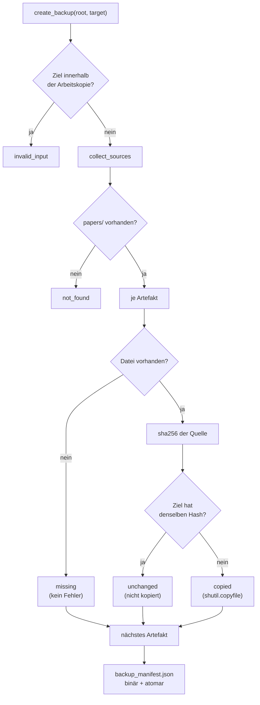

# Modul-Doku: `backup.py`

| Feld | Wert |
| --- | --- |
| **Modul** | `src/research_graphrag/backup.py` |
| **Paket** | Top-Level – Sicherung des nicht reproduzierbaren Bestandes |
| **Phase** | 11 / B1, erweitert in 17 / A1 |
| **Grundlagen** | [ADR 0027](../../../docs/adr/0027-corpus-backup-phase11.md), [ADR 0019](../../../docs/adr/0019-corpus-intake-new-papers-phase8.md), [ADR 0013](../../../docs/adr/0013-chunking-refinement-phase7.md), [ADR 0042](../../../docs/adr/0042-title-page-evidence-and-rejections.md) |

---

## 1. Zweck

Sichert den Teil des Bestandes, der **nicht** wiederherstellbar ist, in ein Verzeichnis außerhalb
der Arbeitskopie. Die Kernidee ist eine **Zweiteilung**: Was Quelle ist, wird gesichert; was
deterministisch aus der Quelle entsteht, bleibt draußen und wird nach einer Wiederherstellung neu
gebaut.

## 2. Öffentliche Schnittstelle

| Symbol | Art | Aufgabe |
| --- | --- | --- |
| `create_backup` | Funktion | Vollständiger Lauf: Umfang bestimmen, kopieren, Manifest schreiben |
| `verify_backup` | Funktion | Rechnet einen vorhandenen Stand gegen sein Manifest nach |
| `collect_sources` | Funktion | Bestimmt den Sicherungsumfang, deterministisch sortiert |
| `sha256_of` | Funktion | Blockweise Prüfsumme (auch für große PDFs) |
| `BackupItem` | Dataclass | Ergebnis für **eine** Datei (Pfad, Aktion, sha256, Größe) |
| `BackupReport` | Dataclass | Bilanz eines Laufs; Kennzahlen als abgeleitete Eigenschaften |
| `VerificationReport` | Dataclass | Befund der Nachrechnung (verändert / fehlend) |
| `SOURCE_DIRECTORIES`, `SOURCE_FILES` | Konstanten | Der festgelegte Sicherungsumfang; seit Phase 17 / A1 auch `metadata/llm_answers/` (LLM-Antworten der Metadaten-Arbeitsliste, nicht rekonstruierbar) |
| `REQUIRED_DIRECTORY` | Konstante | Ohne dieses Verzeichnis gibt es nichts zu sichern |
| `ACTION_COPIED` / `ACTION_UNCHANGED` / `ACTION_MISSING` | Konstanten | Stabiles Vokabular des Berichts |
| `BACKUP_MANIFEST_NAME`, `BACKUP_SCHEMA_VERSION` | Konstanten | Name und Format des Prüfnachweises |
| `ProgressCallback` | Typalias | Rückruf für eine Fortschrittsanzeige |

## 3. Ablauf

Drei Stellen im Ablauf sind bewusst so und nicht anders:

- **Die Prüfung des Ziels steht vor allem anderen.** Läge das Ziel in der Arbeitskopie, würde die
  Sicherung sich selbst mitsichern und bei jedem Lauf wachsen.
- **Eine fehlende Einzeldatei ist kein Fehler.** Die append-only Protokolle entstehen erst beim
  ersten Intake- bzw. Online-Lauf; ein frisches Repository hat sie nicht. Sie erscheinen als
  `missing` im Bericht und fehlen im Manifest – der Lauf bleibt erfolgreich.
- **Der Vergleich läuft über sha256, nicht über Zeitstempel oder Größe.** Ein geänderter Inhalt
  gleicher Länge wird dadurch zuverlässig erkannt; der Preis ist, dass beide Seiten gelesen
  werden.

## 4. Zusammenspiel

`backup.py` ist **read-only gegenüber der Arbeitskopie**: Es liest ausschließlich und schreibt
nur in das Ziel. Es kennt weder Index noch Canonical und importiert deshalb nichts aus
`indexing/` oder `extraction/` – die einzige Abhängigkeit ist die Fehlertaxonomie aus
`errors.py`. Die CLI `scripts/backup.py` bleibt ein dünner Wrapper (Argumente, Fortschritt,
Ausgabe, Exit-Code).

Der Weg zurück ist bewusst **nicht** automatisiert: Dateien zurückkopieren, dann
`python -m scripts.ingest`. Dass dieser Lauf denselben Index erzeugt, ist Voraussetzung der
gesamten Entscheidung – der Determinismus der Extraktion und des Index-Baus ist in
[ADR 0013](../../../docs/adr/0013-chunking-refinement-phase7.md) und
[ADR 0015](../../../docs/adr/0015-noise-reduction-keywords-and-sections-phase7.md) byte-genau
belegt.

## 5. Fehlerverhalten

| Fall | Kategorie |
| --- | --- |
| `papers/` fehlt | `not_found` |
| Ziel liegt in der Arbeitskopie (oder ist sie selbst) | `invalid_input` |
| Zielverzeichnis ohne `backup_manifest.json` geprüft | `not_found` |
| Manifest vorhanden, aber nicht lesbar | `parse_error` |

Kategorien gemäß [docs/error-model.md](../../../docs/error-model.md).

## 6. Grenzen

- **Kein Zeitplan.** Die Sicherung läuft nur, wenn sie gestartet wird.
- **Keine Aufbewahrungslogik.** Ein Ziel ist ein Stand; wer Generationen will, nutzt mehrere
  Zielverzeichnisse.
- **Kein Zurückschreiben.** Ein automatisches Wiederherstellen wäre eine zweite überschreibende
  Operation; der manuelle Weg steht in [data/README.md](../../../data/README.md).
- **Kein MCP-Werkzeug.** Eine Operation, die massenhaft Dateien schreibt, gehört nicht in die
  autonome Reichweite eines Agenten – dieselbe Abgrenzung wie beim Intake.
