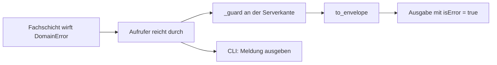
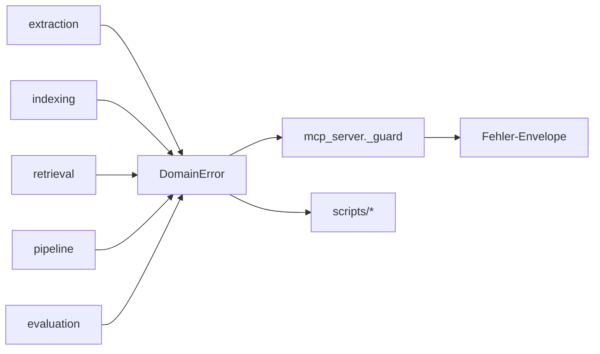

# Modul-Doku: `errors.py`

| Feld | Wert |
| --- | --- |
| **Modul** | `src/research_graphrag/errors.py` |
| **Paket** | Top-Level – Querschnitt |
| **Phase** | 0b |
| **Grundlagen** | [docs/error-model.md](../../../docs/error-model.md) |

---

## 1. Zweck

Eine **gemeinsame Fehlersprache** für alle Schichten. Extraktion, Indexierung, Retrieval,
Generierung und Server werfen denselben Fehlertyp mit derselben Kategorienmenge – dadurch braucht
die Serverkante keine Übersetzungstabelle, sondern nur eine Serialisierung.

## 2. Öffentliche Schnittstelle

| Symbol | Art | Aufgabe |
| --- | --- | --- |
| `ErrorCode` | Enum | Die sieben Fehlerkategorien |
| `DomainError` | Exception | Fachlicher Fehler mit Kategorie, Meldung und optionalen Details |
| `DomainError.to_envelope` | Methode | Erzeugt die strukturierte Fehlerausgabe |

## 3. Ablauf

Kein Kontrollfluss – das Modul ist eine Typdefinition. Entscheidend ist sein **Weg durch das
System**:

### Die Kategorien

| Kategorie | Bedeutung | Typisches Beispiel |
| --- | --- | --- |
| `invalid_input` | Eingabe ist fachlich unzulässig | leere Anfrage, `k <= 0`, unbekannter Modus |
| `not_found` | Angeforderte Ressource existiert nicht | Index-Datei fehlt, Paper-ID unbekannt |
| `permission_denied` | Zugriff nicht erlaubt | reserviert |
| `parse_error` | Eingabe nicht interpretierbar | PDF nicht lesbar |
| `dependency_error` | Externe Abhängigkeit versagt | reserviert |
| `constraint_violation` | Zustand erfüllt eine Voraussetzung nicht | Index ohne Chunks oder ohne Graph |
| `internal_error` | Unerwarteter Fehler | Betriebssystemfehler, letzte Sicherung |

Zwei Kategorien sind derzeit unbenutzt. Sie stehen bewusst im Katalog: Die Taxonomie ist an der
Dokumentation ausgerichtet, nicht am aktuellen Verwendungsstand – und eine nachträglich
eingeführte Kategorie wäre eine Änderung am Ausgabeformat.

### Warum die Kategorie am Fehler hängt

Der entscheidende Entwurfsgedanke: Die Kategorie wird **dort** vergeben, wo der Fehler entsteht –
die Fachschicht weiß am besten, ob eine Eingabe unzulässig oder eine Ressource abwesend ist. Der
Server ordnet nicht nach, sondern serialisiert nur.

Damit gibt es keine Stelle, an der ein Fehler „umgedeutet" werden könnte, und die Kategorie ist
über alle Aufrufwege hinweg identisch.

### Details ohne Preisgabe

`details` trägt strukturierte Zusatzinformation – etwa die Quell-URI eines fehlgeschlagenen
Extraktionsversuchs. Das Feld erscheint nur, wenn es gesetzt ist.

Was dort **nicht** hineingehört, ist in den Dokumentationsstandards festgelegt: keine Geheimnisse
und keine sensiblen Nutzdaten. Dieselbe Regel gilt für die Meldung selbst.

### Ein String-Enum

`ErrorCode` erbt von `str`. Dadurch ist der Wert unmittelbar serialisierbar, ohne dass an jeder
Ausgabestelle eine Umwandlung nötig wäre.

## 4. Zusammenspiel

Das Modul hat **keine** Abhängigkeiten außerhalb der Standardbibliothek und importiert nichts aus
dem Projekt – es liegt auf Top-Level, weil es von jeder Schicht benutzt wird und selbst keine
kennt.

## 5. Fehler und Grenzfälle

Das Modul definiert Fehler, es erzeugt keine. Ein `DomainError` ohne Details liefert einen
Envelope ohne Detail-Feld – nicht mit einem leeren.

## 6. Determinismus

Vollständig deterministisch. `to_envelope` ist eine reine Funktion mit fester Feldreihenfolge.

## 7. Grenzen

- **Keine Fehlerketten im Envelope.** Die auslösende Ausnahme bleibt intern.
- **Keine Mehrsprachigkeit.** Meldungen sind deutsch und für Menschen gedacht; maschinell
  auszuwerten ist die Kategorie.
- **Keine Wiederholungs-Semantik.** Der Fehler sagt nicht, ob ein erneuter Versuch sinnvoll wäre.
- **Zwei Kategorien sind reserviert** und werden derzeit nirgends geworfen.
