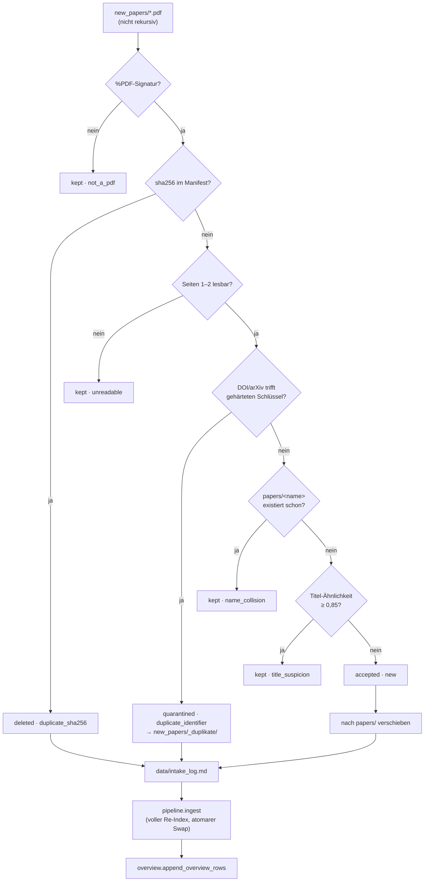
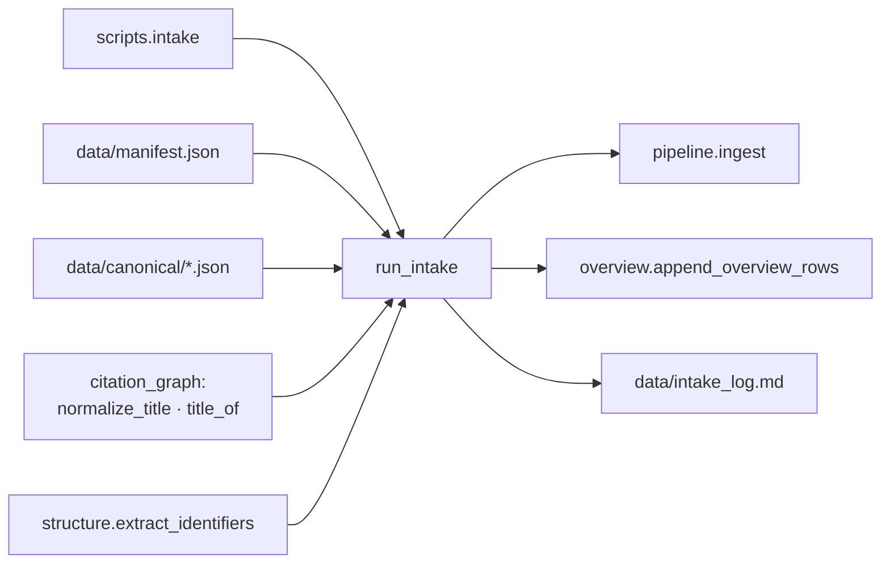

# Modul-Doku: `intake.py`

| Feld | Wert |
| --- | --- |
| **Modul** | `src/research_graphrag/intake.py` |
| **Paket** | Top-Level – Korpus-Zufluss über den Eingangsordner |
| **Phase** | 8 (eingeführt), 13 / R2 (zweiter Dokumenttyp) |
| **Grundlagen** | [ADR 0019](../../../docs/adr/0019-corpus-intake-new-papers-phase8.md), [ADR 0030](../../../docs/adr/0030-reference-entries-in-corpus-phase13.md), [ADR 0011](../../../docs/adr/0011-intra-corpus-citation-graph-phase7.md), [ADR 0010](../../../docs/adr/0010-drop-in-workflow-and-qa-phase6.md) |

---

## 1. Zweck

Übernimmt neue PDFs aus `new_papers/` in den Korpus und verhindert dabei **Doppelbestand**. Die
Kernidee ist eine **Abstufung**: Je sicherer der Duplikat-Nachweis, desto härter die Konsequenz –
und nur der bitgenaue Nachweis rechtfertigt eine unwiderrufliche Löschung.

## 2. Öffentliche Schnittstelle

| Symbol | Art | Aufgabe |
| --- | --- | --- |
| `run_intake` | Funktion | Vollständiger Lauf: prüfen, verschieben, indizieren, Übersicht ergänzen |
| `IntakeDecision` | Dataclass | Entscheidung über **eine** Datei (Aktion, Grund, Detail, Flags, Zielname, abgelöster Eintrag) |
| `IntakeReport` | Dataclass | Alle Entscheidungen + Ingest- und Übersicht-Bericht |
| `read_front_pages` | Funktion | Normalisierter Text der ersten beiden Seiten (ohne Volltext-Fallback) |
| `title_candidates` | Funktion | Titelkandidaten aus Dateiname und Titelseite |
| `best_title_match` | Funktion | Beste Titel-Ähnlichkeit gegen den Korpus |
| `safe_stub_name` | Funktion | Dateisystemsicherer Name eines Referenz-Eintrags aus seinem Titel |
| `load_corpus` | Funktion | Bestandssicht aus `manifest.json` und Index laden (auch vom Online-Modus genutzt) |
| `CorpusView` | Dataclass | Diese Bestandssicht: Hashes, gehärtete Identifikator-Schlüssel, Titel, Referenz-Einträge |
| `ACTION_*`, `REASON_*` | Konstanten | Stabiles Vokabular für Bericht und Protokoll |
| `TITLE_SIMILARITY`, `TITLE_CANDIDATE_LINES`, `QUARANTINE_DIR`, `INTAKE_LOG`, `PDF_MAGIC`, `MAX_STUB_NAME_CHARS` | Konstanten | Schwellen und Pfade |

## 2.1 Der zweite Dokumenttyp (Phase 13 / R2)

Der Eingang nimmt neben `*.pdf` auch `*.refjson` an. Die **drei Prüfstufen gelten unverändert**;
nur die Eingangsseite unterscheidet sich – und ist für einen Stub sogar **genauer**, weil Titel
und Identifikatoren aus der Datei stammen statt aus einer Heuristik über die Titelseite.

| Aspekt | PDF | Referenz-Eintrag |
| --- | --- | --- |
| Robustheits-Gate | `%PDF-`-Signatur | Formatprüfung (`parse_stub`): JSON, Dokumentart, Titel |
| Titelquelle | Dateiname + erste Seite | Feld `title` der Datei |
| Identifikatoren | Titelseite ohne Volltext-Fallback | Felder `doi` / `arxiv_id` |
| Zielname | unverändert | `safe_stub_name(titel)` – **der Dateiname ist der Titel** |

### Upgrade-Pfad: „Volltext schlägt Referenz-Eintrag"

Trifft ein eingehendes **PDF** in Stufe 2 auf einen Korpus-Eintrag, der ein **Referenz-Eintrag**
ist, wird es übernommen und der Stub aus `papers/` entfernt. Ohne diese Regel griffe die
Quarantäne – und das *echte* Paper landete im `_duplikate/`-Ordner, während der Abstract-Stub im
Korpus bliebe. Drei Dinge gehören dazu:

1. Der Stub wird gelöscht (die einzige Löschung in `papers/` – und die einzige, die
   konstruktionsbedingt unbedenklich ist, weil sie aus `new_papers/referenzen.txt` rückgängig
   gemacht werden kann).
2. Er wird **vergessen** (`pipeline.forget_source`): Manifest-Eintrag und Canonical verschwinden,
   sonst bliebe eine Waise liegen und das Paper erschiene nach dem Re-Index doppelt.
3. Seine Übersichtszeile wird **umgebogen**, nicht dupliziert
   (`overview.drafts.retarget_overview_row`) – und zwar **vor** den Entwurfszeilen.

Der Vorgang steht mit **eigenem Hash** im Protokoll (`superseded_by_full_text`).

## 3. Ablauf

### Warum die Konsequenzen abgestuft sind

Nur Stufe 1 beweist, dass **kein Bit** verloren geht: Der Hash zeigt auf eine byte-identische
Datei im Korpus. Stufe 2 vergleicht dagegen eine **heuristisch extrahierte Metadate**; die Datei
selbst ist eine andere (andere Fassung, anderes Layout, ggf. eine neuere Version). Deshalb wandert
sie in die Quarantäne statt in den Papierkorb. Stufe 3 ist ein Verdacht und bleibt folgenlos.

### Der Beleg der Löschung wird nachgerechnet

Ein Treffer in `manifest.json` allein rechtfertigt die Löschung **nicht**. Wird eine PDF aus
`papers/` entfernt, ohne neu zu indizieren, zeigt der Manifest-Eintrag ins Leere – und die einzige
verbliebene Kopie würde vernichtet. Vor dem Löschen wird deshalb am Dateisystem geprüft, ob unter
dem genannten Namen **tatsächlich** eine Datei mit genau diesem Hash liegt. Scheitert das, fällt
die Datei in die übrigen Stufen zurück und bleibt erhalten.

### Vorbedingungen werden vorab geprüft

Eingangsordner, `papers/` **und** die Zieldatei der Übersicht (Existenz *und* Spaltenlayout)
werden geprüft, bevor die erste Datei bewegt wird. Andernfalls könnte ein falscher
`--uebersicht`-Pfad dazu führen, dass PDFs verschoben und der Index neu gebaut wird und der Lauf
erst danach scheitert – ein halb erledigter Zustand, den ein Werkzeug mit Löschbefugnis nicht
erzeugen darf.

### Die zwei Härtungen des Identifikator-Vergleichs

Der Vergleich benutzt **nicht** einfach `papers.identifiers`, sondern eine gefilterte Menge:

1. **Frontmatter-Beleg.** Der Wert muss in einem Chunk mit `page_end ≤ 2` außerhalb des
   Referenzabschnitts stehen. Das ist derselbe Guard wie im Zitationsgraphen – dort gegen falsche
   Kanten, hier gegen falsche Löschungen. Ohne ihn zeigen fehl-extrahierte, *zitierte* fremde IDs
   auf das falsche Paper.
2. **Eindeutigkeit.** Ein Wert mit mehreren Trägern (typisch: ein unausgefüllter
   Vorlagen-Platzhalter) taugt nicht als Duplikat-Kriterium und fliegt raus.

Auf der Eingangsseite wird symmetrisch gelesen: nur Seite 1–2, **ohne** den Volltext-Fallback der
regulären Extraktion – genau dieser Fallback erzeugt die Fehlerklasse aus Punkt 1.

### Namenskollision vor Titel-Verdacht

Eine bestehende Datei gleichen Namens ist eine **Tatsache über den Zielort**, keine Vermutung –
und die handlungsleitendere Meldung. Sie wird daher vor der Ähnlichkeitsprüfung ausgewertet.

### Was als Titel gilt

Verglichen werden normalisierte Zeichenketten: der Dateiname-Stamm sowie die ersten Zeilen der
Titelseite, jeweils einzeln und paarweise verbunden. Kandidaten unterhalb der Mindestmaße des
Titel-Matchings (`MIN_TITLE_CHARS`, `MIN_TITLE_WORDS` aus dem Zitationsgraphen) entfallen – sonst
würden Kopfzeilen, Datumsangaben und Seitenzahlen als Titel gelten.

### Reihenfolge der Seiteneffekte

Erst werden alle Dateioperationen ausgeführt, dann das Protokoll geschrieben, dann indiziert. Der
Grund: Das Protokoll dokumentiert **Dateischicksale**. Scheitert der Index-Neubau, darf die Spur
der bereits gelöschten und verschobenen Dateien nicht verloren gehen.

## 4. Zusammenspiel

Der Intake ist eine **vorgelagerte** Schicht: Er ersetzt keinen bestehenden Baustein, sondern
entscheidet nur, *was* überhaupt in `papers/` landet. Index, Graph und Zitationskanten entstehen
unverändert über `pipeline.ingest`.

Er ist bewusst **nicht** als MCP-Werkzeug registriert: Copilot ruft Werkzeuge autonom auf, und eine
löschende, korpusändernde Operation gehört nicht in diese Reichweite. Der Zugang bleibt die
Kommandozeile.

## 5. Fehler und Grenzfälle

| Situation | Verhalten |
| --- | --- |
| Eingangs- oder `papers`-Ordner fehlt | `not_found` – **vor** jeder Dateioperation |
| Übersicht fehlt | `not_found` – **vor** jeder Dateioperation |
| Übersicht mit fremdem Spaltenlayout | `constraint_violation` – **vor** jeder Dateioperation |
| Eingangsordner leer | leerer Bericht, kein Ingest, kein Protokoll |
| Datei ohne `%PDF-`-Signatur | bleibt liegen, Befund `not_a_pdf` |
| PDF nicht parsebar | bleibt liegen, Befund `unreadable` – der Lauf **bricht nicht ab** |
| Manifest-Eintrag zeigt ins Leere | **keine** Löschung; die Datei durchläuft die übrigen Stufen |
| Keine Datei angenommen | kein Ingest, kein Übersicht-Anhang (aber Protokoll) |
| `dry_run` | keinerlei Seiteneffekt – auch kein Protokolleintrag |

## 6. Determinismus

- Eingangsdateien werden alphabetisch verarbeitet.
- Die Prüfstufen sind reine Vergleiche gegen den Korpusstand zu Laufbeginn.
- Die einzige nicht deterministische Angabe ist der Zeitstempel im Protokoll.

Eine `dry_run`-Vorschau und der anschließende echte Lauf treffen daher dieselben Entscheidungen.

## 7. Grenzen

- **Stufe 3 ist ein Verdacht.** Titel, die über viele Zeilen laufen, werden nicht erkannt; die
  gemessene Trefferquote steht im ADR.
- **Eine neuere Version gilt als Duplikat.** `arXiv:1234.5678v2` trägt dieselbe
  Identifikator-Wurzel wie `v1` und landet in der Quarantäne. Wer ersetzen will, löscht zuerst die
  alte Datei in `papers/`.
- **Kein inhaltlicher Volltext-Vergleich.** Zwei Fassungen ohne Identifikator und mit stark
  abweichendem Titel bleiben unerkannt.
- **Kein rekursives Einlesen.** Unterordner des Eingangs (inklusive der Quarantäne) werden
  ignoriert.
- **Die Quarantäne räumt sich nicht auf.** Das bleibt Handarbeit – bewusst, denn hier liegen
  Dateien, über die ein Mensch entscheiden soll.
