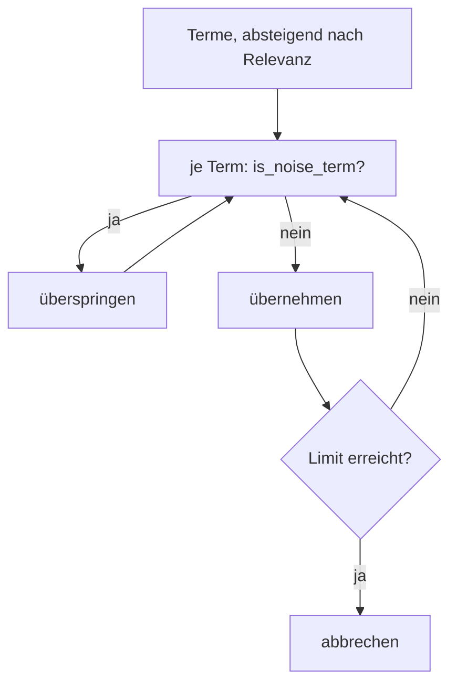
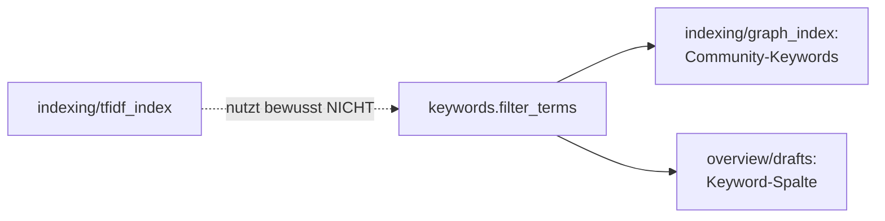

# Modul-Doku: `keywords.py`

| Feld | Wert |
| --- | --- |
| **Modul** | `src/research_graphrag/keywords.py` |
| **Paket** | Top-Level – Querschnitt |
| **Phase** | 7 / A5 |
| **Grundlagen** | [ADR 0015](../../../docs/adr/0015-noise-reduction-keywords-and-sections-phase7.md) |

---

## 1. Zweck

Eine kuratierte **Auswahl-Politik** für extraktive Keyword-Listen: Sie entfernt Terme, die zwar
statistisch hervorstechen, aber inhaltlich nichts aussagen – Bibliografie-Vokabular,
Webfragmente, nackte Zahlen, Glyph-Reste.

Genutzt wird sie an zwei Stellen: bei den Community-Keywords und bei den Entwurfszeilen der
Literaturübersicht.

## 2. Öffentliche Schnittstelle

| Symbol | Art | Aufgabe |
| --- | --- | --- |
| `filter_terms` | Funktion | Entfernt Rausch-Terme aus einer sortierten Termfolge |
| `is_noise_term` | Funktion | Entscheidet für einen einzelnen Term |
| `DOMAIN_STOPWORDS` | Konstante | Die kuratierte Stopword-Liste |

## 3. Ablauf

### Warum ein Nachfilter und kein Stopword-Set im Vektorraum

Das ist der interessanteste Punkt dieses Moduls, und er beruht auf einer Messung statt auf einer
Vermutung.

Die naheliegende Lösung wäre gewesen, die Rausch-Terme beim Vektorisieren zu entfernen. Die
Messung zeigte aber: Diese Terme kommen in **nahezu jedem** Paper vor. Ihre inverse
Dokumentfrequenz ist dadurch nahezu null – für die paarweise Ähnlichkeit sind sie praktisch
bedeutungslos.

Das Problem entsteht erst bei der **Auswahl**: Die Community-Keywords summieren über alle
Mitglieder, und dort schlägt die hohe Termhäufigkeit durch.

Der Filter setzt deshalb genau dort an. Der Vektorraum bleibt unangetastet – und das ist kein
Detail: Die Kantenbildung des Ähnlichkeitsgraphen ist eine Schwellenoperation, bei der schon
minimale Verschiebungen Nachbarschaften kippen. Eine Probeänderung am Vektorraum hätte die
Community-Struktur messbar verändert, **ohne** belegbaren Nutzen. Der Nachfilter ist damit
isoliert wirksam und isoliert belegbar.

### Der Filter greift vor dem Anschnitt

`filter_terms` filtert zuerst und schneidet dann auf die gewünschte Anzahl. Dadurch werden frei
werdende Plätze mit echten Themenbegriffen **aufgefüllt**, statt die Liste zu verkürzen.

Der Abbruch beim Erreichen des Limits sorgt dafür, dass bei langen Termlisten nicht unnötig
weitergeprüft wird.

### Was als Rauschen gilt

| Regel | Beispiel |
| --- | --- |
| Domänen-Stopword | Zitations-Vokabular, Webfragmente, inhaltsleere Füllwörter |
| rein numerisch | Jahreszahlen, Seitenzahlen |
| Glyph-Rest | Überbleibsel nicht dekodierbarer Zeichen |
| leer nach dem Trimmen | — |

Bewusst **nicht** gefiltert werden alphanumerische Mischformen wie Modellgrößen oder
Modellnamen – sie tragen Bedeutung.

Die Stopword-Liste ist bewusst **klein** und nur durch Stichproben gewachsen. Eine große Liste
würde irgendwann Fachbegriffe verschlucken; die kurze bleibt überprüfbar.

### Ausdrücklich nicht für das Retrieval

Die Suche arbeitet **ohne** Stopwords. Das ist Absicht: Fakt-Anfragen nach Jahreszahlen,
Bezeichnern oder Abkürzungen müssen weiterhin treffen. Dieses Modul ist eine
Darstellungs-Politik, keine Retrieval-Politik.

Der Glyph-Filter ist heute defensiv – die Textnormalisierung entfernt solche Reste bereits bei
der Extraktion. Er schützt Keyword-Listen, die aus älteren Daten stammen.

## 4. Zusammenspiel

Das Modul liegt auf Top-Level und nicht in einem Paket, weil es sonst eine Schichtkante von
`overview/` nach `indexing/` erzwungen hätte – dieselbe Überlegung wie bei der Fehlertaxonomie.

## 5. Fehler und Grenzfälle

Keine `DomainError`. Beide Funktionen sind total.

| Fall | Ergebnis |
| --- | --- |
| leerer Term | gilt als Rauschen |
| leere Termfolge | leere Liste |
| kein Limit | alle Signal-Terme |
| Limit größer als die Folge | so viele, wie es gibt |

## 6. Determinismus

Reine Filterung ohne Zufall; die Reihenfolge der Eingabe bleibt erhalten. Die Prüfung
normalisiert lediglich Groß-/Kleinschreibung und Leerraum.

## 7. Grenzen

- **Statische Liste.** Neue Rausch-Terme müssen manuell ergänzt werden.
- **Kein Stemming, keine Sprachlogik.** Beugungsformen müssen einzeln erfasst werden.
- **Einsprachig.** Die Liste enthält englisches Vokabular; deutsche Füllwörter kommen in den
  extraktiven Keyword-Listen kaum vor.
- **Keine Bewertung.** Nicht-Rauschen ist noch keine Aussage darüber, ob ein Term ein gutes
  Themenwort ist.
