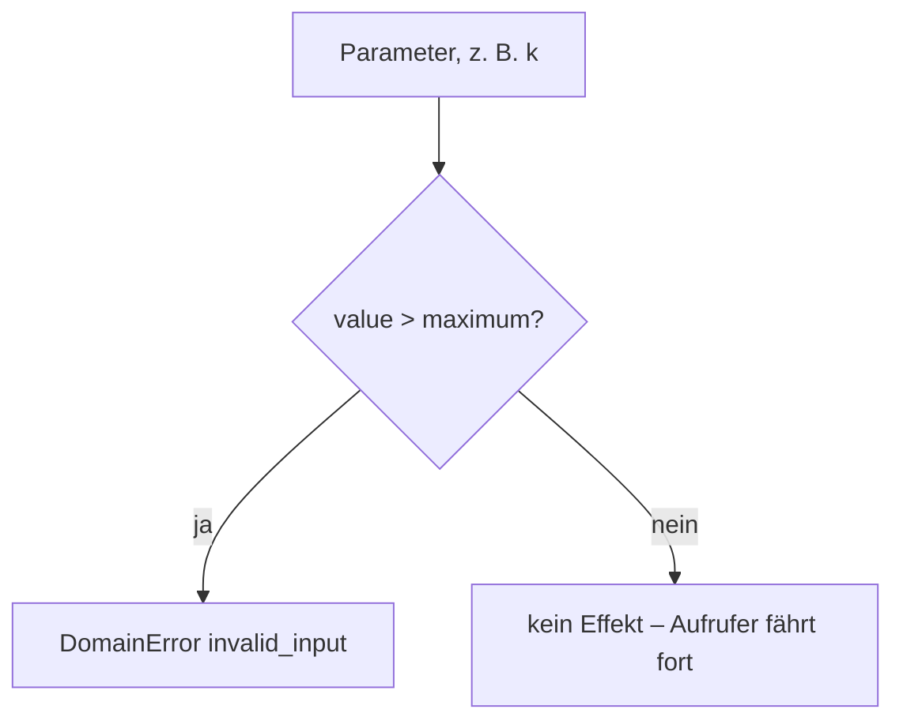
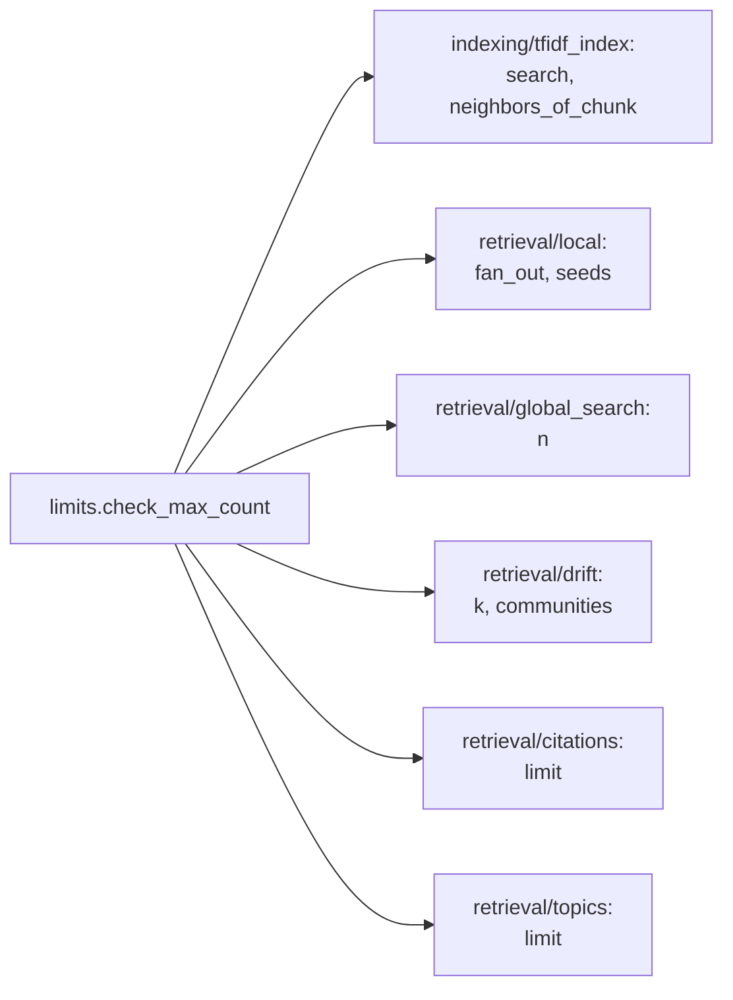

# Modul-Doku: `limits.py`

| Feld | Wert |
| --- | --- |
| **Modul** | `src/research_graphrag/limits.py` |
| **Paket** | Top-Level – Querschnitt |
| **Phase** | ADR 0037 |
| **Grundlagen** | [ADR 0037](../../../docs/adr/0037-mcp-tool-response-size-ceiling.md) |

---

## 1. Zweck

Die **einzige Quelle der Wahrheit** für die Obergrenze jedes Trefferzahl-Parameters (`k`, `n`,
`fan_out`, `communities`, `seeds`, `limit`) der Retrieval- und MCP-Werkzeuge. Ohne diese Grenze
wächst eine Tool-Antwort mit dem Parameter unbegrenzt – gemessen reicht das bis zur
1-MB-Transportgrenze des MCP-Servers.

## 2. Öffentliche Schnittstelle

| Symbol | Art | Aufgabe |
| --- | --- | --- |
| `MAX_RESULT_COUNT` | Konstante | Die geteilte Obergrenze (`50`) |
| `check_max_count` | Funktion | Lehnt einen zu großen Wert mit `invalid_input` ab |

## 3. Ablauf

### Warum eine geteilte Konstante statt einer Zahl je Modul

Vor diesem Modul prüfte jede Retrieval-Funktion nur eine Untergrenze (`k <= 0` usw.), jede an
ihrer eigenen Stelle. Eine Obergrenze **ad hoc** an denselben Stellen zu ergänzen hätte densselben
Wert mehrfach dupliziert – eine spätere Anpassung hätte mehrere Stellen treffen müssen, mit dem
Risiko, eine zu vergessen. `MAX_RESULT_COUNT` macht die Zahl **einmal** änderbar; jede Stelle, die
sie braucht, importiert dieselbe Konstante.

### Warum eine Ablehnung und kein stilles Kappen

`check_max_count` wirft, statt den Wert intern auf `maximum` zu reduzieren. Ein still gekürztes
Ergebnis sähe für den Aufrufer wie eine vollständige Trefferliste aus – das widerspräche den
Leitprinzipien „Provenienz zuerst" und „Nachvollziehbarkeit vor Tempo" (CONTRIBUTING.md,
Abschnitt 1) und dem etablierten Muster dieses Portfolios, jede Abweichung sichtbar zu machen
(DRIFTs `fallback`, `list_topics`s `truncated`) statt sie zu verstecken.

### Warum `50`

Jede gemessene Kombination aus den Retrieval-Werkzeugen bleibt bei diesem Wert weit unter 150 KB
serialisierter Antwortgröße – reichlich Marge unter der 1-MB-Transportgrenze, auch bei mehreren
gleichzeitig ausgeschöpften Parametern (siehe [ADR 0037](../../../docs/adr/0037-mcp-tool-response-size-ceiling.md)
für die vollständige Messtabelle).

## 4. Zusammenspiel

Das Modul liegt auf Top-Level und nicht in `indexing/` oder `retrieval/`, weil es von **beiden**
Paketen gebraucht wird (`errors.py` und `keywords.py` folgen demselben Muster) – eine Platzierung
in einem der beiden hätte eine Schichtkante zum jeweils anderen erzwungen.

## 5. Fehler und Grenzfälle

Keine eigene `DomainError`-Kategorie: `check_max_count` wirft `invalid_input`, dieselbe Kategorie,
mit der die bestehenden Untergrenzen bereits abgelehnt werden.

| Fall | Ergebnis |
| --- | --- |
| `value <= maximum` | kein Effekt |
| `value > maximum` | `DomainError(invalid_input)` mit Parametername und beiden Zahlen in der Meldung |

## 6. Determinismus

Eine reine Vergleichsoperation ohne Seiteneffekt oder Zufall.

## 7. Grenzen

- **Eine Zahl für alle Parameter.** Ein Werkzeug mit einem strukturell anderen Größenprofil
  bräuchte eine eigene, begründete Konstante statt `MAX_RESULT_COUNT` – bislang hat keines der neun
  Werkzeuge diesen Bedarf.
- **Kein Byte-Budget.** Das Modul zählt Elemente, nicht Bytes; das ergänzende Byte-Sicherheitsnetz
  liegt bewusst getrennt in `mcp_server/server.py::_guard` (ADR 0037).
