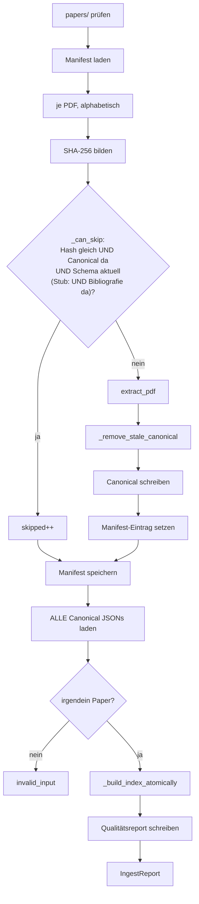
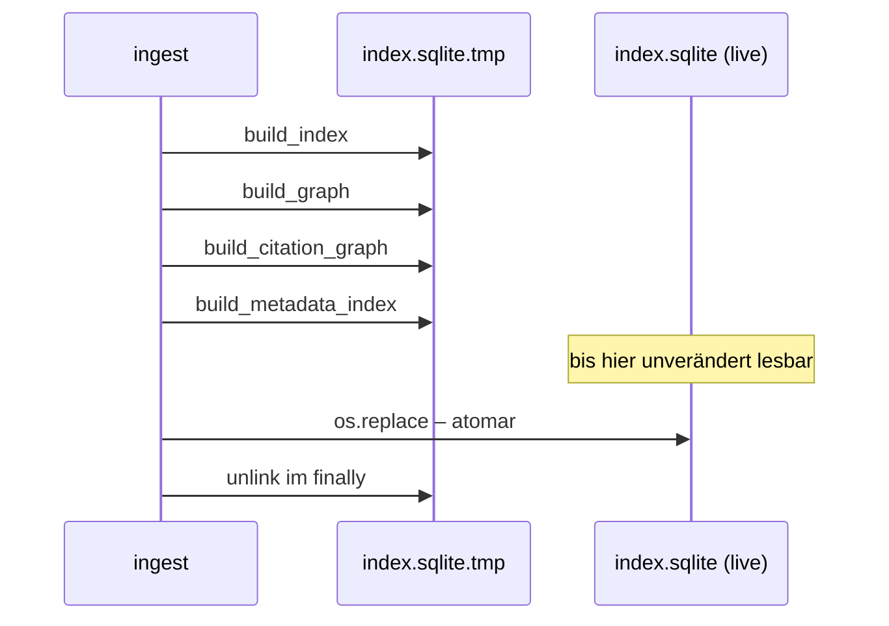
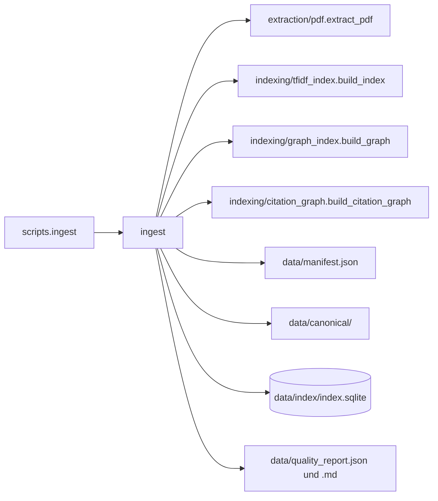

# Modul-Doku: `pipeline.py`

| Feld | Wert |
| --- | --- |
| **Modul** | `src/research_graphrag/pipeline.py` |
| **Paket** | Top-Level – Orchestrierung |
| **Phase** | 0b (eingeführt), 6 (atomarer Swap), 7 / A2 (Zitationsgraph), 12 / K1 (Zitierdaten), 13 / R2 (zweiter Dokumenttyp), 17 / A2 (Stub-Bibliografie, Autoren-Abdeckung) |
| **Grundlagen** | [ADR 0005](../../../docs/adr/0005-graphrag-index-backend-open.md), [ADR 0010](../../../docs/adr/0010-drop-in-workflow-and-qa-phase6.md), [ADR 0011](../../../docs/adr/0011-intra-corpus-citation-graph-phase7.md), [ADR 0041](../../../docs/adr/0041-author-identity-and-schema.md) |

---

## 1. Zweck

Der **Drop-in-Workflow** in einer Funktion: PDF-Ordner einlesen, nur Neues extrahieren, Index und
Graphen bauen, Qualitätsreport schreiben. Es ist die einzige Stelle im System, die schreibt – und
die einzige, die alle Schichten kennt.

Die Leitidee: **Extraktion inkrementell, Index vollständig.** Das Extrahieren einer PDF ist teuer
und lohnt sich zu vermeiden; der Index-Bau ist bei dieser Korpusgröße günstig, und ein voller
Neubau schließt Inkonsistenzen aus.

## 2. Öffentliche Schnittstelle

| Symbol | Art | Aufgabe |
| --- | --- | --- |
| `ingest` | Funktion | Führt den gesamten Lauf aus und liefert die Zählwerte |
| `forget_source` | Funktion | Vergisst eine nicht mehr vorhandene Korpus-Datei (Manifest-Eintrag und verwaistes Canonical) |
| `IngestReport` | Dataclass | Zählwerte: extrahiert, übersprungen, Chunks, Flags, Graph, Zitationen, Zitierdaten, seit Phase 17 die Autoren-Abdeckung (`author_coverage`) |
| `OVERVIEW_FILENAME` | Konstante | Dateiname der kuratierten Übersicht (Quelle der Herkunft `curated`) |

## 3. Ablauf

### Der Dedup-Test hat drei Bedingungen

Übersprungen wird nur, wenn **alle drei** zutreffen: gleicher Datei-Hash, vorhandenes Canonical
JSON und **aktuelle Schema-Version**.

Die dritte Bedingung ist der Hebel für Contract-Änderungen: Wird das Canonical-Schema angehoben,
gilt der gesamte Cache als veraltet und der Korpus wird neu extrahiert – ohne dass jemand ein
Verzeichnis löschen muss. Genau so wurden Chunking-Verfeinerung und Textnormalisierung ausgerollt.

Lesefehler beim Prüfen der Version führen zu „nicht überspringbar": Im Zweifel wird neu
extrahiert.

**Vierte Bedingung, nur für Referenz-Einträge (Phase 17 / A2):** Das Canonical eines Stubs muss
den Schlüssel `bibliography` tragen. Ein vor Phase 17 gelesener Stub wird dadurch **einmalig**
neu gelesen, und das dauert Millisekunden. Eine Anhebung der Schema-Version hätte denselben Zweck
erfüllt, aber jedes PDF neu extrahieren lassen, obwohl sich für PDFs nichts ändert
([ADR 0041](../../../docs/adr/0041-author-identity-and-schema.md)).

### Warum veraltete Canonical-Dateien entfernt werden

Die Paper-Identität ist der Datei-Hash. Ändert sich eine PDF, entsteht eine **neue** ID – die
alte Datei bliebe als Waise liegen und würde beim Index-Bau mitgezählt. Das Aufräumen prüft
zuvor, ob eine andere Datei dieselbe ID noch beansprucht (identischer Inhalt unter zwei Namen).

### Der atomare Swap

Der Grund liegt im Betrieb: Der Server liest den Index **pro Anfrage**. Ein Neuaufbau an Ort und
Stelle könnte deshalb kurzzeitig einen halbfertigen Zustand ausliefern.

Die Umsetzung baut vollständig in eine Nebendatei und hängt sie erst am Ende um. Zwei
Eigenschaften folgen daraus:

- **Crash-Sicherheit:** Schlägt ein Bauschritt fehl, bleibt der bisherige Index intakt und
  abfragbar.
- **Konsistenz:** Chunks, Ähnlichkeitsgraph, Zitationskanten und bibliografische Daten entstehen
  im **selben** Fenster und passen zwangsläufig zueinander.

Das Aufräumen läuft in jedem Fall: Im Erfolgsfall ist die Nebendatei bereits verschoben, im
Fehlerfall wird sie entfernt.

### Die Reihenfolge der Bauschritte

Chunk-Index zuerst, dann Ähnlichkeitsgraph, dann Zitationskanten, zuletzt die bibliografischen
Daten – die späteren Schritte schreiben **additiv** in dieselbe Datei und setzen die
Basistabellen voraus. Der Metadaten-Schritt liest zusätzlich zwei Dateien **außerhalb** des
Index: die kuratierte Übersicht und `metadata/paper_metadata.json`
([ADR 0025](../../../docs/adr/0025-citable-paper-metadata.md)). Fehlen sie, entfällt die
jeweilige Herkunft – der Bau scheitert nicht.

### Der Qualitätsreport

Nach dem Swap entsteht der Report in zwei Formen: maschinenlesbar und als Markdown-Übersicht.
Beide werden aus **allen** Papern erzeugt, nicht nur aus den neu extrahierten – der Report
beschreibt den Gesamtzustand.

### Das Manifest wird vor dem Index-Bau gespeichert

Bricht der Index-Bau ab, ist die geleistete Extraktionsarbeit dennoch verbucht. Ein erneuter Lauf
überspringt die bereits extrahierten Dateien und versucht nur den Bau erneut.

## 4. Zusammenspiel

## 5. Fehler und Grenzfälle

| Situation | Fehlercode |
| --- | --- |
| `papers/`-Ordner fehlt | `not_found` |
| keine Canonical-Paper vorhanden | `invalid_input` |
| eine PDF ist defekt | `parse_error` aus der Extraktion – der Lauf bricht ab |
| Index-Bau schlägt fehl | Fehler wird weitergereicht, Alt-Index bleibt intakt |

Dass ein defektes Dokument den gesamten Lauf abbricht, ist eine bewusste Setzung: Bei einem
manuell angestoßenen Vorgang über einen überschaubaren Korpus ist ein sichtbarer Abbruch
nützlicher als eine stille Teilverarbeitung.

## 6. Determinismus

- PDFs werden alphabetisch verarbeitet, Canonical JSONs alphabetisch geladen.
- Das Manifest wird mit sortierten Schlüsseln geschrieben.
- Der Qualitätsreport ist nach Paper-ID sortiert.
- Alle Bauschritte sind ihrerseits deterministisch.

Ein Neuaufbau aus denselben Canonical JSONs erzeugt byte-identische Kanten, Communities und
Zitationskanten.

## 7. Grenzen

- **Kein inkrementeller Index.** Jeder Lauf baut vollständig neu
  ([ADR 0010](../../../docs/adr/0010-drop-in-workflow-and-qa-phase6.md)).
- **Keine Beobachtung des Ordners.** Der Lauf wird bewusst manuell angestoßen.
- **Sequenziell.** Die Extraktion nutzt keine Nebenläufigkeit.
- **Kein Entfernen aus dem Manifest.** Eine gelöschte PDF hinterlässt ihren Eintrag und ihr
  Canonical JSON; der Konsistenz-Check von `scripts.status` weist das aus.
- **Nur `*.pdf` direkt in `papers/`.** Unterordner werden nicht durchsucht.
