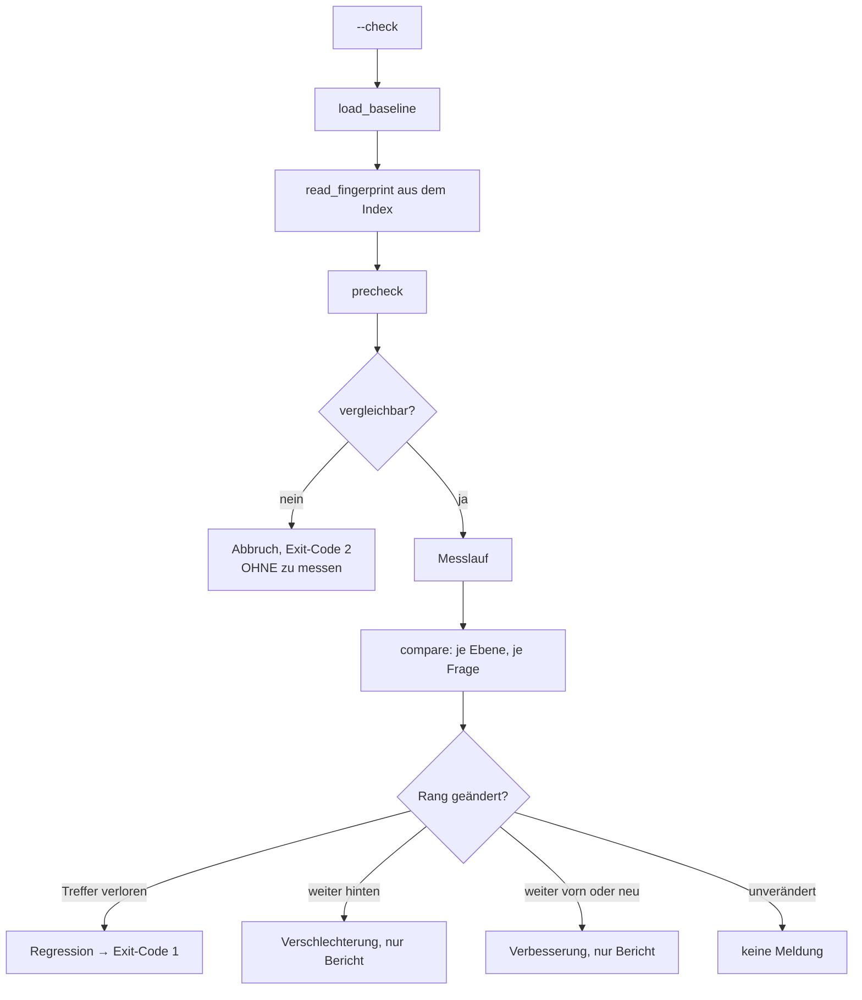
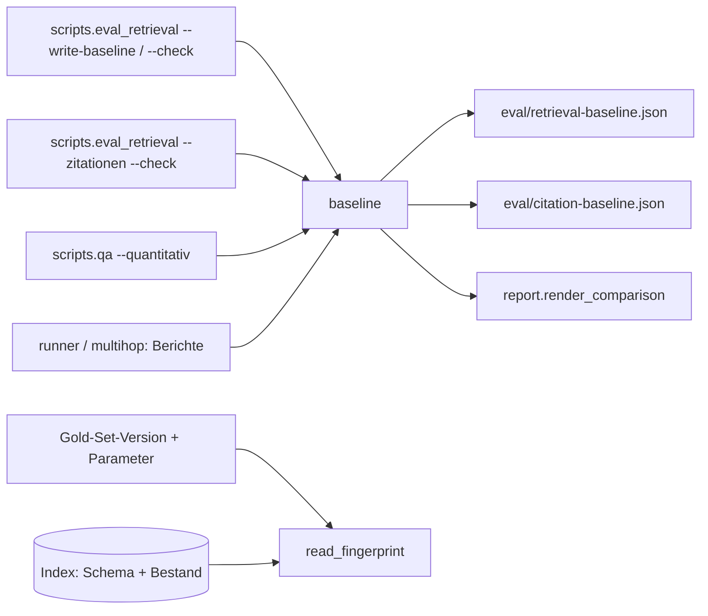

# Modul-Doku: `baseline.py`

| Feld | Wert |
| --- | --- |
| **Modul** | `src/research_graphrag/evaluation/baseline.py` |
| **Paket** | `evaluation` – quantitative Messung |
| **Phase** | 7 / A6 (entkoppelt in Phase 10 / V3) |
| **Grundlagen** | [ADR 0016](../../../../docs/adr/0016-quantitative-retrieval-evaluation-phase7.md), [ADR 0023](../../../../docs/adr/0023-multihop-citation-evaluation-phase10.md) |

---

## 1. Zweck

Friert einen Messstand ein und vergleicht spätere Läufe **frage-genau** damit. Das Modul
beantwortet nicht „ist die Kennzahl gesunken?", sondern die nützlichere Frage: **„welche Frage
ist kaputtgegangen?"**

Dazu kommt ein Schutzmechanismus, der verhindert, dass gegen einen Zustand verglichen wird, zu
dem die Baseline gar nicht mehr passt.

## 2. Öffentliche Schnittstelle

| Symbol | Art | Aufgabe |
| --- | --- | --- |
| `read_fingerprint` | Funktion | Liest den Zustands-Fingerprint aus dem Index |
| `build_baseline`, `save_baseline`, `load_baseline` | Funktionen | Einfrieren, schreiben, lesen |
| `precheck` | Funktion | Vergleichbarkeit prüfen, **bevor** gemessen wird |
| `compare` | Funktion | Frage-genauer Vergleich |
| `Fingerprint`, `Baseline`, `Change`, `Comparison` | Dataclasses | Die Datentypen |
| `REGRESSION`, `WORSE`, `BETTER` | Konstanten | Die drei Schweregrade |
| `BASELINE_VERSION` | Konstante | Version des Artefakt-Formats |

## 3. Ablauf

### Der Fingerprint-Guard

Der Fingerprint beschreibt den gemessenen Zustand: Gold-Set-Version, Index-Schema, Bestandszahlen
und die Messparameter. Passt er nicht, wird der Vergleich **abgelehnt**.

Ohne diesen Schutz hätte ein Regressions-Check die gefährlichste aller Eigenschaften: still zu
verrotten. Er liefe weiter, verglichen würde aber ein anderer Korpus – und die Meldungen wären
bedeutungslos.

Wichtig ist, **wann** geprüft wird: `precheck` läuft **vor** dem Messlauf. Ein vollständiger Lauf
dauert lange; erst zu messen und danach die Vergleichbarkeit zu verneinen wäre reine
Zeitverschwendung.

### Zwei Schweregrade statt einer Schwelle

| Änderung | Schweregrad | Wirkung |
| --- | --- | --- |
| Treffer → kein Treffer | Regression | Exit-Code 1 |
| Rang weiter hinten | Verschlechterung | nur Bericht |
| Rang weiter vorn oder neu gefunden | Verbesserung | nur Bericht |
| unverändert | — | keine Meldung |

Ein aggregierter Schwellenwert – etwa „MRR darf um höchstens 0,02 fallen" – wäre bei wenigen
Dutzend Fragen Scheingenauigkeit. Vor allem aber sagt er nicht, **welche** Frage betroffen ist.
Die frage-genaue Meldung ist die einzige, die zu einer Handlung führt.

### Nur eine Zahl je Frage

Die Baseline speichert ausschließlich den ersten relevanten Rang je Ebene und Frage. Alle
Aggregate lassen sich daraus ableiten; es gibt keine doppelt gepflegten Kennzahlen, die
auseinanderlaufen könnten.

### Drei Exit-Codes

`0` unauffällig, `1` Regression, `2` nicht vergleichbar. Der dritte Zustand ist wichtig genug für
einen eigenen Code: „Ich kann es nicht sagen" ist etwas anderes als „es ist in Ordnung".

Auch abweichende **Ebenen** führen zu Code 2: Wurde die Baseline nur über die Primitive
eingefroren, kann ein Lauf über alle Modi nicht dagegen geprüft werden.

### Das Erstellungsdatum wird injiziert

`build_baseline` bekommt das Datum als Argument, statt es selbst zu lesen. Damit bleiben Tests
deterministisch – dieselbe Disziplin wie beim Seed der Zufalls-Baseline.

### Das Modul kennt weder Gold-Set noch Runner

`read_fingerprint` nimmt eine Gold-Set-**Version** und ein Parameter-**Mapping** – keine
`GoldSet`- und keine `RunParameters`-Instanz. Dadurch bedient dasselbe Modul **zwei** Messungen
(Retrieval und Multi-Hop) mit **zwei** Artefakten, ohne von deren Datentypen abzuhängen. Das
Dateiformat der Baseline ist davon unberührt.

## 4. Zusammenspiel

## 5. Fehler und Grenzfälle

| Situation | Verhalten |
| --- | --- |
| Index-Datei fehlt | `not_found` beim Fingerprint |
| Baseline-Datei fehlt | `not_found` mit Hinweis auf `--write-baseline` |
| Fingerprint weicht ab | `Comparison` mit `comparable = false`, Exit-Code 2 |
| Ebenen weichen ab | ebenso Exit-Code 2 |
| Frage neu im Gold-Set | in der Baseline unbekannt und daher nicht verglichen |
| Frage in der Baseline, aber nicht mehr im Lauf | zählt als verlorener Treffer |

Ein fehlendes Artefakt wird bewusst als Fehler behandelt – ein stiller Vergleich gegen nichts
wäre schlimmer als ein Abbruch.

## 6. Determinismus

Die Baseline wird mit stabiler Reihenfolge und fester Einrückung geschrieben. Der Vergleich ist
eine reine Funktion über zwei Datenstrukturen.

## 7. Grenzen

- **Korpusgebunden.** Nach einem Re-Ingest muss neu eingefroren werden; der Guard erzwingt das.
- **Keine Historie.** Es gibt genau eine eingefrorene Baseline, keine Zeitreihe.
- **Kein Trend.** Eine über viele Läufe schleichende Verschlechterung ohne verlorenen Treffer
  bleibt unter dem Radar.
- **Vergleicht Ränge, keine Inhalte.** Ob die gefundenen Passagen inhaltlich besser wurden, ist
  damit nicht messbar.
