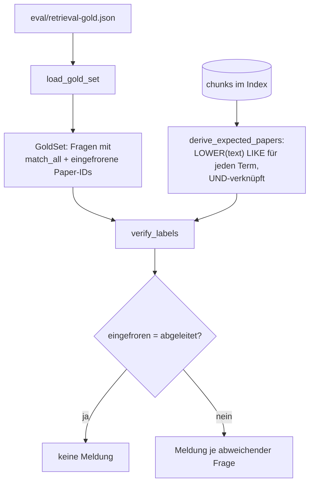
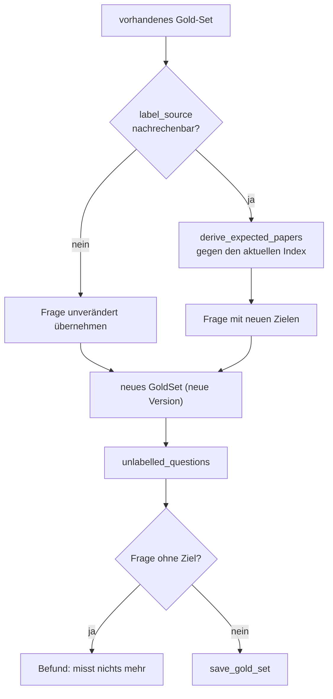
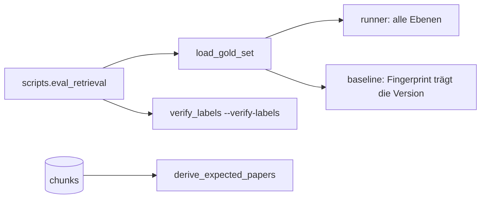

# Modul-Doku: `gold.py`

| Feld | Wert |
| --- | --- |
| **Modul** | `src/research_graphrag/evaluation/gold.py` |
| **Paket** | `evaluation` – quantitative Messung |
| **Phase** | 7 / A4 (eingeführt), A6 (ins Paket gezogen) |
| **Grundlagen** | [ADR 0014](../../../../docs/adr/0014-hybrid-retrieval-bm25-tfidf-phase7.md), [ADR 0016](../../../../docs/adr/0016-quantitative-retrieval-evaluation-phase7.md) |

---

## 1. Zweck

Definiert die **Ground Truth** der Retrieval-Messung – und zwar so, dass sie sich jederzeit
nachrechnen lässt. Ein Paper gilt für eine Frage genau dann als relevant, wenn mindestens einer
seiner Chunks **alle** Suchstrings der Regel enthält.

Das ist der zentrale methodische Punkt des gesamten Evaluationspakets: Die Labels stammen
**nicht** aus einem Urteil und **nicht** aus einem Retriever, sondern aus einer mechanischen
Regel über dem Chunk-Text.

## 2. Öffentliche Schnittstelle

| Symbol | Art | Aufgabe |
| --- | --- | --- |
| `load_gold_set` | Funktion | Gold-Set aus JSON laden |
| `save_gold_set` | Funktion | Gold-Set schreiben – samt Korpus, gegen den es abgeleitet wurde |
| `derive_expected_papers` | Funktion | Labels aus dem Index ableiten (die Regel selbst) |
| `relabel_gold_set` | Funktion | Mechanische Labels nach einem Korpuswechsel neu bestimmen |
| `unlabelled_questions` | Funktion | Fragen benennen, die im aktuellen Korpus kein Ziel mehr haben |
| `verify_labels` | Funktion | Eingefrorene Labels gegen die Ableitung prüfen |
| `GoldQuestion`, `GoldSet` | Dataclasses | Frage mit Regel, Labels und Label-Quelle |
| `MECHANICAL_LABELS`, `DEFAULT_LABEL_SOURCE` | Konstanten | Welche Quellen nachrechenbar sind |
| `CITATION_LABEL_SOURCE`, `CITATION_LABELS` | Konstanten | Bezeichner der Label-Quelle aus dem Zitationsgraphen |
| `LABEL_RULE`, `GOLD_SET_ORIGIN`, `GOLD_SET_SPLITS`, `INDEX_SCHEMA_VERSION` | Konstanten | Selbsterklärende Kopfangaben der Gold-Set-Datei |

> Das **Vokabular** der Label-Quellen liegt vollständig hier, auch wenn die zugehörigen Fragen
> in einem eigenen Gold-Set leben
> ([multihop](multihop.md), [ADR 0023](../../../../docs/adr/0023-multihop-citation-evaluation-phase10.md)).
> `verify_labels` überspringt jede Frage, deren Quelle nicht in `MECHANICAL_LABELS` steht – sie
> ist per Definition nicht über diese Regel nachrechenbar.

## 3. Ablauf

### Warum keine kuratierten Labels

Kuratierte Relevanzurteile wären inhaltlich besser – aber sie hätten einen Preis, der hier
untragbar ist: Sie sind nicht überprüfbar. Nach einer Änderung an Extraktion oder Chunking könnte
niemand sagen, ob eine gesunkene Kennzahl an der Änderung liegt oder daran, dass die Labels nicht
mehr zum Korpus passen.

Die mechanische Regel dagegen lässt sich nach jedem Re-Ingest gegen den Index nachrechnen. Genau
das hat sich bewährt: Bei einer Änderung der Textnormalisierung fielen die Labels messbar
anders aus – und statt einer stillen Verzerrung gab es einen sichtbaren Befund, der zu einer
neuen Gold-Set-Version führte.

Der Roadmap-Wunsch, die mechanischen Labels durch inhaltliche zu **ersetzen**, wurde deshalb
begründet abgelehnt ([ADR 0016](../../../../docs/adr/0016-quantitative-retrieval-evaluation-phase7.md)).

### Warum der Zirkelschluss vermieden wird

Würde man die Labels mit demselben Verfahren erzeugen, das später gemessen wird, bestätigte die
Messung nur sich selbst. Die Regel ist deshalb bewusst **rankingfrei**: reine
Teilzeichenketten-Prüfung, keine Gewichtung, keine Sortierung, kein Vektorraum.

### Die Label-Quelle als Erweiterungspunkt

Jede Frage weist aus, woher ihre Labels stammen. Heute ist das ausschließlich die mechanische
Regel; `verify_labels` überspringt alles andere, weil es per Definition nicht nachrechenbar ist.
Eine spätere Quelle – etwa der Zitationsgraph – kann additiv danebentreten, ohne die
verifizierbare Basis zu verdrängen.

### Warum ein Gold-Set einen Korpuswechsel nicht überlebt

Die Labels sind **Paper-IDs**, und eine `paper_id` ist der sha256-Hash der Datei. Wird ein PDF
durch eine andere Fassung ersetzt – etwa eine neuere arXiv-Version über den Intake –, entsteht
eine neue ID, und das eingefrorene Label zeigt ins Leere. Das passiert **unabhängig davon**, ob
der Inhalt noch im Korpus steht.

Deshalb gibt es `relabel_gold_set`: Es lässt die Fragen unangetastet (Wortlaut, Reihenfolge, Art,
Regel) und bestimmt allein die Ziele neu – und das nur für nachrechenbare Quellen, damit ein
geurteiltes Label nicht still überschrieben wird.

Eine Frage **ohne** Ziel ist dabei kein Randfall, sondern ein Befund: Sie kann nie einen Treffer
erzeugen, zieht die Kennzahlen nach unten und täuscht dabei eine Aussage vor. Die CLI meldet das
mit Exit-Code `1`, statt es stillschweigend zu schreiben.

### Die Datei ist die Wahrheit

Das Gold-Set ist versioniert und eingefroren. Eine Änderung des Korpus, die die Ableitung
verschiebt, verlangt eine neue Version – nicht ein stilles Nachziehen.

## 4. Zusammenspiel

## 5. Fehler und Grenzfälle

Keine `DomainError`. Fehlende Pflichtfelder in der Datei ergeben einen `KeyError`, ein defektes
JSON einen `JSONDecodeError` – beides sind Artefaktfehler, die sofort auffallen sollen.

`verify_labels` wirft nicht, sondern **berichtet**: Es liefert eine Liste von Meldungen, die die
Kommandozeile ausgibt.

## 6. Determinismus

Die Ableitung sortiert die Paper-IDs aufsteigend; das Laden bewahrt die Dateireihenfolge der
Fragen. Damit sind sowohl Labels als auch Fragereihenfolge zwischen Läufen identisch.

## 7. Grenzen

- **Lexikalische Labels.** Ein Paper, das den Sachverhalt mit anderen Worten beschreibt, gilt
  nicht als relevant – die Messung unterschätzt Paraphrasen-Fähigkeit systematisch.
- **Ein kleines Fragenset.** Die Zahlen tragen keine Nachkommastellen-Aussagen; ein breiteres
  Set bleibt bewusst zurückgestellt.
- **Regelabhängig.** Eine schlecht gewählte Termkombination erzeugt zu viele oder zu wenige
  Labels; die Prüfung deckt Abweichungen auf, nicht die Güte der Regel selbst.
- **Bindung an den Korpus.** Labels gelten nur für den Korpus, aus dem sie abgeleitet wurden.
