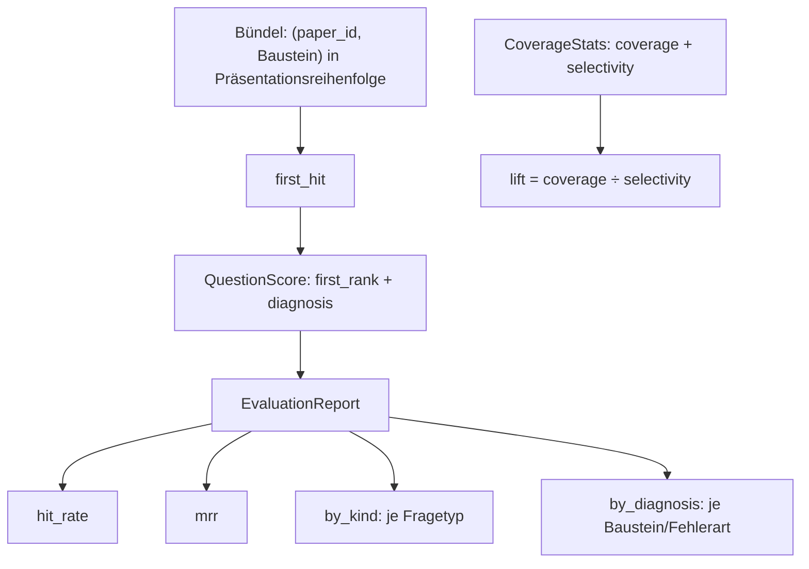
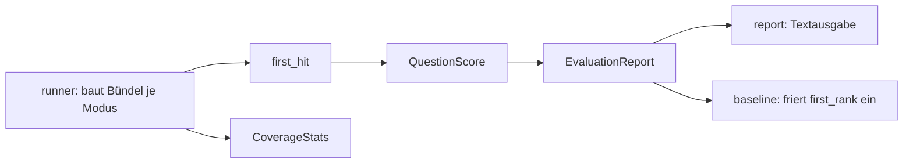

# Modul-Doku: `metrics.py`

| Feld | Wert |
| --- | --- |
| **Modul** | `src/research_graphrag/evaluation/metrics.py` |
| **Paket** | `evaluation` – quantitative Messung |
| **Phase** | 7 / A6 |
| **Grundlagen** | [ADR 0016](../../../../docs/adr/0016-quantitative-retrieval-evaluation-phase7.md) |

---

## 1. Zweck

Die **Kennzahlen** der Evaluation – und zwar bewusst **retrieval-frei**: Das Modul kennt weder
Index noch Suchmodi, sondern nur Ränge. Dadurch lassen sich die Kennzahlen ohne Korpus prüfen und
ihre Definition kann nicht von einer Retrieval-Änderung berührt werden.

## 2. Öffentliche Schnittstelle

| Symbol | Art | Aufgabe |
| --- | --- | --- |
| `first_hit` | Funktion | Erster relevanter Eintrag eines Bündels: Rang und Baustein |
| `QuestionScore` | Dataclass | Bewertung einer Frage – `first_rank` plus optionale Diagnose |
| `EvaluationReport` | Dataclass | Aggregat mit `hit_rate`, `mrr`, `by_kind()`, `by_diagnosis()` |
| `CoverageStats` | Dataclass | Coverage und Selektivität einer Auswahlstrategie, mit `lift` |

## 3. Ablauf

### Eine gespeicherte Zahl, alle Kennzahlen abgeleitet

`QuestionScore` speichert **ausschließlich** den ersten relevanten Rang. Ob ein Treffer vorliegt
und wie hoch der Kehrwert ist, sind berechnete Eigenschaften.

Das ist kein Sparsamkeits-Detail, sondern verhindert eine ganze Fehlerklasse: Es kann nicht
passieren, dass ein gespeicherter Treffer-Wert und ein gespeicherter Rang widersprüchlich werden.
Und es ist genau die Zahl, die auch die Baseline einfriert – Messung und Regressions-Check
sprechen dieselbe Sprache.

### Der Lift ordnet, die Coverage nicht

Das ist der wichtigste methodische Beitrag dieses Moduls. Für die Community-Auswahl ist die
nackte Trefferabdeckung irreführend: Eine Strategie, die einfach die größten Communities
zurückgibt, erreicht eine hohe Abdeckung – weil sie einen großen Teil des Korpus auswählt.

Deshalb wird Coverage **nie ohne Selektivität** ausgewiesen, und das Vergleichsinstrument ist
ihr Quotient:

$$\mathrm{Lift} = \frac{\text{Coverage}}{\text{Selektivität}}$$

Eine triviale Strategie landet damit bei ungefähr 1,0, eine echte Auswahl deutlich darüber.
Ohne den Lift hätte die Messung die triviale Strategie zur besseren erklärt.

### Die Diagnose trennt Fehlerarten

`first_hit` liefert nicht nur *ob* und *wo*, sondern auch **welcher Baustein** den Treffer
beisteuerte. Daraus entstehen zwei getrennte Aussagen:

| Modus | Diagnose-Werte | Was sie unterscheiden |
| --- | --- | --- |
| local | `seed`, `neighborhood`, `fan_out` | trug der Anker oder die Erweiterung? |
| global, drift | `in_community`, `community_missed`, `no_community` | scheiterte die Auswahl oder das Ranking? |
| basic | keine | es gibt nur eine Belegsorte |

Dass Basic bewusst **keine** Diagnose führt, ist Teil des Entwurfs: Eine Diagnose mit nur einem
möglichen Wert wäre eine leere Spalte.

### Was `first_hit` nicht misst

Nur der **erste** relevante Treffer zählt. Ein Bündel mit fünf relevanten Papern ab Rang 1 und
eines mit einem einzigen auf Rang 1 sind ununterscheidbar. Das ist bei dieser Fragestellung
angemessen – gesucht wird eine belegbare Antwort, nicht eine vollständige Trefferliste.

## 4. Zusammenspiel

## 5. Fehler und Grenzfälle

Keine `DomainError`. Grenzfälle liefern neutrale Werte statt Ausnahmen:

| Fall | Ergebnis |
| --- | --- |
| leeres Bündel | kein Treffer, `first_rank = None` |
| Bericht ohne Fragen | Trefferquote und MRR sind `0.0` |
| Selektivität null | `lift` ist `0.0` statt Division durch null |
| keine erwarteten Paper | Coverage `0.0` |

## 6. Determinismus

Reine Berechnungen ohne Zufall. Aggregate über Fragetypen und Diagnosen werden **sortiert**
zurückgegeben, sodass auch die Ausgabereihenfolge stabil ist.

## 7. Grenzen

- **Nur der erste Treffer.** Keine Precision, kein Recall, kein nDCG.
- **Keine Signifikanz.** Bei wenigen Dutzend Fragen sind kleine Unterschiede Rauschen; das
  Modul liefert Zahlen, keine statistische Absicherung.
- **Ungewichtete Relevanz.** Alle gelabelten Paper zählen gleich.
- **Der Lift braucht eine Bezugsgröße.** Ohne die Korpusgröße, die der Runner liefert, ist die
  Selektivität nicht berechenbar.
