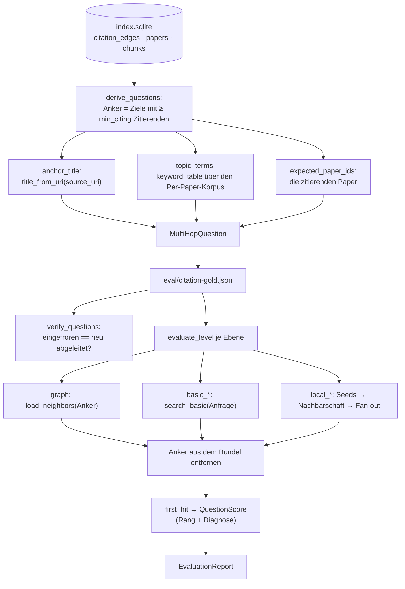

# Modul-Doku: `multihop.py`

| Feld | Wert |
| --- | --- |
| **Modul** | `src/research_graphrag/evaluation/multihop.py` |
| **Paket** | `evaluation` – quantitative Messung |
| **Phase** | 10 / V3 |
| **Grundlagen** | [ADR 0023](../../../../docs/adr/0023-multihop-citation-evaluation-phase10.md) · [ADR 0011](../../../../docs/adr/0011-intra-corpus-citation-graph-phase7.md) · [ADR 0016](../../../../docs/adr/0016-quantitative-retrieval-evaluation-phase7.md) |

---

## 1. Zweck

Misst den Fragetyp **„Zitations-/Methodennetze (Multi-Hop)"** aus dem Contract der
[README](../../../../README.md) – den einzigen, den das lexikalisch verankerte Retrieval-Gold-Set
nicht abdeckt. Die Labels stammen aus den `CITES`-Kanten: Zu einem **Ankerpaper** gelten genau
die Paper als relevant, die es zitieren. Damit ist die Ground Truth **nicht-lexikalisch** und
trotzdem mechanisch nachrechenbar.

Die Messung ist von der Retrieval-Messung getrennt – eigenes Gold-Set, eigene Ebenen, eigene
Baseline.

## 2. Öffentliche Schnittstelle

| Symbol | Art | Aufgabe |
| --- | --- | --- |
| `derive_questions` | Funktion | Fragen deterministisch aus `citation_edges` ableiten |
| `build_multihop_gold` | Funktion | Ein vollständiges Gold-Set zum Einfrieren bauen |
| `save_multihop_gold` / `load_multihop_gold` | Funktion | Gold-Set schreiben bzw. lesen |
| `verify_questions` | Funktion | Eingefrorenes Gold-Set gegen den Index nachrechnen |
| `recall_bounds` | Funktion | Strukturelle Grenzen des Zitationsgraphen ermitteln |
| `is_reference_section` | Funktion | Abschnittsüberschrift als Bibliografie erkennen |
| `evaluate_level` | Funktion | Eine Ebene gegen die Zitations-Labels bewerten |
| `evaluate_multihop` | Funktion | Alle Ebenen in einem Durchgang messen |
| `MultiHopQuestion`, `MultiHopGoldSet`, `MultiHopParameters`, `RecallBounds` | Dataclasses | Die Datentypen |
| `LEVELS`, `GRAPH`, `QUERY_FRAME`, `CITING_BUCKETS`, `MULTIHOP_GOLD_VERSION` | Konstanten | Ebenen, Anfrage-Rahmen, Gruppierung, Version |
| `RANDOM_DRAWS`, `RANDOM_SEED`, `DEFAULT_MULTIHOP_PARAMETERS` | Konstanten | Zufalls-Baseline und Vorgabewerte |

## 3. Ablauf

### Zwei Anfrageformen, ein Rahmen

Beide Textformen benutzen `QUERY_FRAME`; nur die Nutzlast unterscheidet sie. Dadurch isoliert der
Vergleich genau **einen** Unterschied:

| Form | Nutzlast | Eigenschaft |
| --- | --- | --- |
| `*_title` | der Titel des Ankerpapers | die realistische Nutzerfrage – trifft aber häufig die **Bibliografie** der zitierenden Paper |
| `*_topic` | die Top-Terme des Ankerpapers | die Gegenprobe ohne Titelwörter |

Der Unterschied ist keine Vermutung, sondern gemessen; die Zahlen stehen im
[ADR 0023](../../../../docs/adr/0023-multihop-citation-evaluation-phase10.md).

### Der Anker verlässt jedes Bündel

`evaluate_level` entfernt das Ankerpaper aus **jedem** Bündel – fest verdrahtet, nicht optional.
Begründung: Selbstzitate sind ausgeschlossen, das Ankerpaper kann also nie ein erwartetes Paper
sein; es würde nur vordere Ränge besetzen und den Kehrwert verzerren.

### Diagnose: Baustein **und** Herkunft

Die Diagnose eines Treffers nennt beides – welcher Baustein ihn beisteuerte und woher der Beleg
stammt:

| Diagnose | Bedeutung |
| --- | --- |
| `neighbor` | Nachbar im Paper-Ähnlichkeitsgraphen (nur Ebene `graph`) |
| `chunk:body` / `chunk:ref` | Beleg der Basic Search aus dem Fließtext bzw. aus einem Referenzabschnitt |
| `seed:*`, `neighborhood:*`, `fan_out*` | die drei Bausteine der Local Search, je mit Herkunft |

Das Suffix `:ref` markiert den **lexikalischen Kurzschluss**: Der Treffer stammt aus dem
Literaturverzeichnis des zitierenden Papers, nicht aus seinem Inhalt.

### Strukturelle Grenzen statt behauptetem Recall

`recall_bounds` beantwortet die Frage, welche Paper als Kante **prinzipiell** ausscheiden: ohne
erkannten Referenzabschnitt (können nicht zitieren), ohne ausreichend langen Titel und ohne
frontmatter-belegten Identifikator (können nicht zitiert werden). Das ist eine **obere Schranke
der Vollständigkeit** – der tatsächliche Recall bleibt offen, weil aus `citation_edges`
abgeleitete Labels eine fehlende Kante nicht sichtbar machen können.

## 4. Zusammenspiel

- **Liest** ausschließlich `data/index/index.sqlite` – Paper, Chunks und `citation_edges`. Die
  Canonical-Dateien werden **nicht** gebraucht: `is_reference_section` reproduziert die
  Section-Art aus dem gespeicherten `section_title`.
- **Nutzt** `indexing.graph_index.load_neighbors` (strukturelle Ebene),
  `retrieval.basic.search_basic` und `retrieval.local.search_local` (Textebenen),
  `indexing.citation_graph` (Titel-Ableitung und Mindestmaße) sowie
  `overview.drafts.keyword_table` (Themen-Terme – kein zweiter Keyword-Pfad).
- **Wird genutzt** von `evaluation.report.render_multihop_report` und der dünnen CLI
  [scripts/eval_retrieval.py](../../../../scripts/eval_retrieval.py) (`--zitationen`).
- **Teilt** `metrics.py` und `baseline.py` mit der Retrieval-Messung; die Baseline-Datei ist eine
  **eigene**.

## 5. Fehler und Grenzfälle

| Situation | Verhalten |
| --- | --- |
| Index-Datei fehlt | `not_found` |
| Index ohne `citation_edges` | `constraint_violation` – ein leerer Bericht wäre irreführend |
| Gold-Set-Datei fehlt | `not_found` mit dem Hinweis auf `--write-gold` |
| Unbekannte Ebene | `invalid_input` mit der Liste der erlaubten Ebenen |
| Kein Ziel erreicht `min_citing` | leeres Gold-Set – kein Fehler |
| Leeres Gold-Set / kein Paper im Index | keine Coverage statt Division durch null |

## 6. Determinismus

- Anker sind nach `paper_id` sortiert und fortlaufend nummeriert (`C01`, `C02`, …); die
  erwarteten Paper sind ebenfalls sortiert.
- Die Themen-Terme entstehen über die deterministische TF-IDF-Auswahl aus `keyword_table`
  (Tie-Break über den Term) auf dem nach `paper_id` geordneten Korpus.
- Die Zufalls-Baseline der strukturellen Ebene zieht mit festem `RANDOM_SEED` über
  `RANDOM_DRAWS` Ziehungen – eine Einzelziehung wäre Rauschen.
- Alle Ränge stammen aus `first_hit`; die Baseline friert genau diese Ränge ein.

## 7. Grenzen

- **Kein gemessener Recall** des Zitationsgraphen, nur Schranken (siehe oben).
- **Kein Tuning**: `k`, `fan_out`, `seeds` und `min_citing` werden nicht anhand dieser Fragen
  nachgezogen.
- **Keine Beschleunigung**: Jeder Modus-Aufruf lädt den Index erneut (On-Read,
  [ADR 0010](../../../../docs/adr/0010-drop-in-workflow-and-qa-phase6.md)); ein vollständiger
  Lauf dauert dadurch Minuten. Die Abhilfe ist Punkt B3 der
  [Roadmap](../../../../Roadmap.md).
- **Kein MCP-Werkzeug**: Evaluation ist ein Wartungsvorgang, kein Agenten-Werkzeug.
