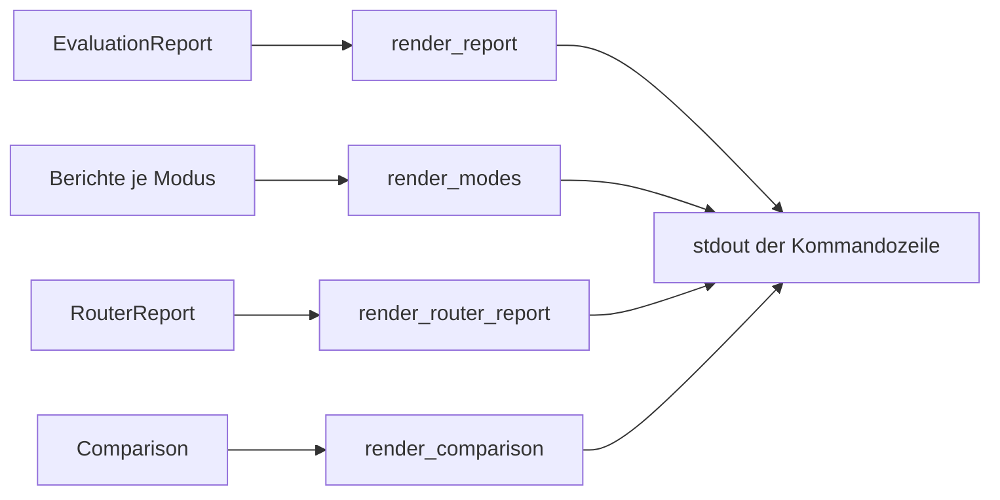
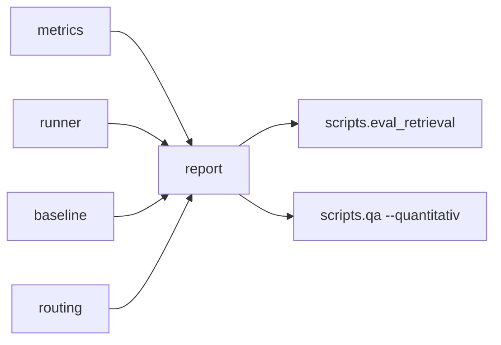

# Modul-Doku: `report.py`

| Feld | Wert |
| --- | --- |
| **Modul** | `src/research_graphrag/evaluation/report.py` |
| **Paket** | `evaluation` – quantitative Messung |
| **Phase** | 7 / A6 (Router-Bericht: A7) |
| **Grundlagen** | [ADR 0016](../../../../docs/adr/0016-quantitative-retrieval-evaluation-phase7.md), [ADR 0017](../../../../docs/adr/0017-router-hardening-phase7.md) |

---

## 1. Zweck

Die **Präsentationsschicht** der Evaluation: Sie formatiert Berichte als Text. Und sie trägt eine
inhaltliche Verantwortung, die über Formatierung hinausgeht – sie sorgt dafür, dass Zahlen
**nicht ohne ihre Bezugsgrößen** erscheinen.

## 2. Öffentliche Schnittstelle

| Symbol | Art | Aufgabe |
| --- | --- | --- |
| `render_report` | Funktion | Eine Ebene ausführlich: Zeile je Frage plus Aggregate |
| `render_modes` | Funktion | Modus-Vergleich mit Diagnosen und Community-Baselines |
| `render_router_report` | Funktion | Contract-Treue, Konfidenz, Fehlgriffe |
| `render_comparison` | Funktion | Regressions-Check, frage-genau |
| `LIMITATION`, `ROUTER_LIMITATION` | Konstanten | Die deklarierten Aussagegrenzen |

## 3. Ablauf

### Die Aussagegrenze steht im Bericht

Jeder Modus- und Router-Bericht endet mit einem Satz, der sagt, **was die Zahlen nicht bedeuten**.
Das ist bewusst nicht in die Dokumentation ausgelagert: Eine Zahl wird dort überinterpretiert, wo
sie gelesen wird. Wer den Bericht sieht, sieht auch ihre Grenze.

Beim Retrieval lautet sie sinngemäß: Gemessen wird, ob die thematisch richtige Nachbarschaft oben
landet – nicht die Güte einer corpusweiten Synthese. Beim Router: Gemessen wird die Contract-Treue,
nicht die Antwortqualität; eine Optimierung auf Hit@k hätte ein triviales Optimum.

### Coverage niemals allein

`render_modes` gibt die Community-Auswahl grundsätzlich als Dreiklang aus: **Coverage,
Selektivität, Lift** – und daneben die trivialen Vergleichsstrategien. Die Zeilenüberschrift sagt
es ausdrücklich: Coverage ist nur mit Selektivität lesbar.

Diese Formatierungsentscheidung verhindert genau den Fehlschluss, der in der Vorabmessung
beinahe passiert wäre: Die nackte Abdeckung hätte die triviale Strategie zur besseren erklärt.

### Diagnosen stehen neben der Kennzahl

Im Modus-Vergleich erscheint hinter jeder Zeile die Verteilung der Diagnosen. Damit steht neben
„dieser Modus trifft seltener" sofort die Erklärung „weil die Community-Wahl scheitert" oder
„weil der Seed danebenliegt".

### Der Regressions-Check erklärt sich selbst

`render_comparison` unterscheidet drei Ausgänge:

| Ausgang | Ausgabe |
| --- | --- |
| nicht vergleichbar | Grund plus Hinweis auf bewusstes Neu-Einfrieren |
| keine Abweichung | ein Satz |
| Abweichungen | je Zeile Schweregrad, Ebene, Frage und Rangänderung, Regressionen markiert |

Ein verlorener Treffer wird als „kein Treffer" ausgeschrieben statt als leeres Feld – die
Bedeutung soll nicht aus einer Lücke erschlossen werden müssen.

### Reine Textausgabe

Das Modul druckt nichts und schreibt keine Datei; es liefert Zeichenketten zurück. Die Ausgabe
verantwortet die Kommandozeile – die deshalb auch für die Encoding-Behandlung zuständig ist.

## 4. Zusammenspiel

## 5. Fehler und Grenzfälle

Keine `DomainError`.

| Fall | Verhalten |
| --- | --- |
| leerer Bericht | Kopfzeile mit Nullwerten |
| keine Diagnosen | kein Diagnose-Zusatz in der Zeile |
| keine Coverage-Daten | der Community-Block entfällt |
| keine Fehlgriffe | der Fehlgriff-Block entfällt |

`render_report` verlangt, dass Bewertungen und Gold-Fragen **paarweise** zusammenpassen – die
Kopplung wird beim Zusammenführen strikt geprüft, sodass eine verrutschte Zuordnung sofort
auffällt statt falsche Zeilen zu erzeugen.

## 6. Determinismus

Reine Formatierung. Die Reihenfolge folgt den bereits sortierten Aggregaten; Zahlen erscheinen
mit fester Nachkommastellenzahl.

## 7. Grenzen

- **Nur Text.** Keine Tabellen-, CSV- oder JSON-Ausgabe.
- **Keine Farben, keine Balken.** Bewusst nüchtern – die Ausgabe soll in eine Datei umlenkbar
  bleiben.
- **Feste Feldbreiten.** Sehr lange Fragen oder Bezeichner können die Ausrichtung sprengen.
- **Keine Interpretation.** Der Bericht ordnet ein, aber er zieht keine Schlüsse.
