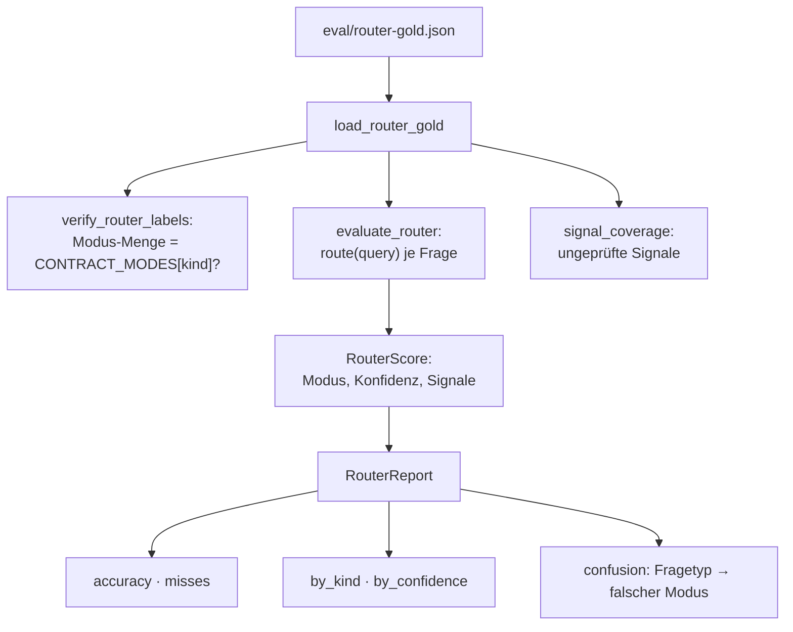
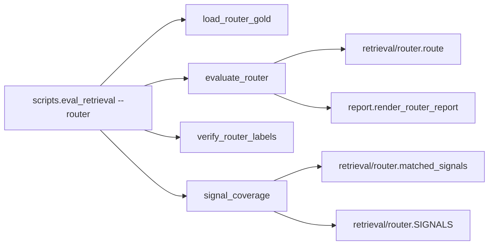

# Modul-Doku: `routing.py`

| Feld | Wert |
| --- | --- |
| **Modul** | `src/research_graphrag/evaluation/routing.py` |
| **Paket** | `evaluation` – quantitative Messung |
| **Phase** | 7 / A7 |
| **Grundlagen** | [ADR 0017](../../../../docs/adr/0017-router-hardening-phase7.md) |

---

## 1. Zweck

Misst, ob der Query-Router den **dokumentierten Contract** einhält: die Tabelle
„Fragetypen → Suchmodus" aus der [README](../../../../README.md). Die Messung braucht **keinen
Index** und läuft in Sekunden.

Sie ist bewusst von der Retrieval-Messung getrennt – sie prüft die Contract-Treue, nicht die
Antwortqualität.

## 2. Öffentliche Schnittstelle

| Symbol | Art | Aufgabe |
| --- | --- | --- |
| `load_router_gold` | Funktion | Router-Gold-Set aus JSON laden |
| `verify_router_labels` | Funktion | Eingefrorene Modus-Mengen gegen den Contract prüfen |
| `evaluate_router` | Funktion | Jede Gold-Frage routen und bewerten |
| `signal_coverage` | Funktion | Signale finden, die von keiner Frage berührt werden |
| `CONTRACT_MODES` | Konstante | Fragetyp → zulässige Modi (die Contract-Abbildung) |
| `RouterQuestion`, `RouterGoldSet`, `RouterScore`, `RouterReport` | Dataclasses | Die Datentypen |

## 3. Ablauf

### Labels ohne Urteil

Die zulässigen Modi einer Frage werden **nicht kuratiert**, sondern aus ihrem Fragetyp über
`CONTRACT_MODES` abgeleitet. Damit gilt für die Router-Messung dieselbe Disziplin wie für das
Retrieval-Gold-Set: Jedes Label ist mechanisch nachrechenbar.

Der Fragetyp `detail` trägt als einziger **zwei** zulässige Modi – weil die README für
Detailfragen ausdrücklich „Local + Basic" nennt. Das ist keine Nachsicht, sondern eine wörtliche
Übernahme des Contracts.

### Zwei Maßstäbe, nur einer steuert

Das ist der methodisch wichtigste Punkt:

| Maßstab | Rolle |
| --- | --- |
| Contract-Treue (dieses Modul) | **steuernd** – daran wird der Router entwickelt |
| Hit@k über `mode = auto` (Retrieval-Gold-Set) | **Veto** – darf sich nicht verschlechtern |

Auf das Veto zu optimieren wäre ein Fehler mit trivialem Ausgang: Weil die Retrieval-Labels
mechanisch aus dem Chunk-Text stammen, bevorzugen sie strukturell den Passagen-Modus. Das
Optimum wäre „immer basic" – ein Router, der nichts mehr tut.

### Die Signal-Abdeckung

`signal_coverage` prüft, ob jedes Signal des Router-Lexikons von mindestens einer Gold-Frage
ausgelöst wird. Ein Signal, das keine Frage berührt, ist eine **unbelegte Regel**: Es steht im
Code, aber niemand weiß, ob es das Richtige tut.

Diese Prüfung war produktiv – vor der Härtung wurde nur ein kleiner Teil der Signale überhaupt
berührt.

### Konfidenz als prüfbare Aussage

`by_confidence` beantwortet die Frage, ob die ausgewiesene Konfidenz etwas wert ist. Eine
Konfidenzstufe, die bei Fehlgriffen genauso häufig „sicher" meldet wie bei Treffern, wäre
Dekoration. Die Auswertung macht das messbar statt behauptbar.

### Kein Baseline-Artefakt

Anders als beim Retrieval gibt es hier **keine** eingefrorene Baseline-Datei. Der Grund: Die
Messung ist korpusunabhängig, sie hängt nur an Code und Gold-Set. Die Regressionssicherung ist
deshalb ein normaler Test mit einer erwarteten Fehlgriff-Liste – ein zusätzliches Artefakt wäre
Ballast.

## 4. Zusammenspiel

Das Modul importiert ausschließlich aus dem Router – kein Index, kein `sklearn`, keine Datenbank.
Daher die Sekunden-Laufzeit.

## 5. Fehler und Grenzfälle

Keine `DomainError`. Beide Prüffunktionen **berichten** statt zu werfen:

| Fall | Meldung |
| --- | --- |
| unbekannter Fragetyp im Gold-Set | Meldung aus `verify_router_labels` |
| eingefrorene Modus-Menge weicht ab | Meldung mit erwartetem Contract |
| Signal von keiner Frage ausgelöst | Meldung aus `signal_coverage` |
| leeres Gold-Set | Bericht mit Trefferquote `0.0` |

## 6. Determinismus

Vollständig deterministisch: Der Router ist eine reine Textheuristik, die Fragen werden in
Dateireihenfolge abgearbeitet, und alle Aggregate werden sortiert zurückgegeben.

## 7. Grenzen

- **Misst nur den Modus.** Ob die Suche im gewählten Modus etwas Gutes findet, ist nicht
  Gegenstand.
- **Der Contract ist eine Setzung.** Ändert sich die README-Tabelle, ändern sich alle Labels.
- **Ein bekannter Fehlgriff bleibt.** Der eine konstruierte Gleichstands-Fall ist als Grenze
  eingefroren.
- **Kein Vorschlagswesen.** Das Modul zeigt Verwechslungen, leitet daraus aber keine
  Signal-Änderungen ab.
