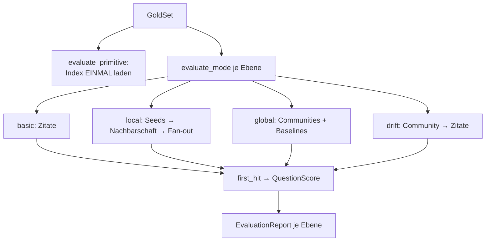
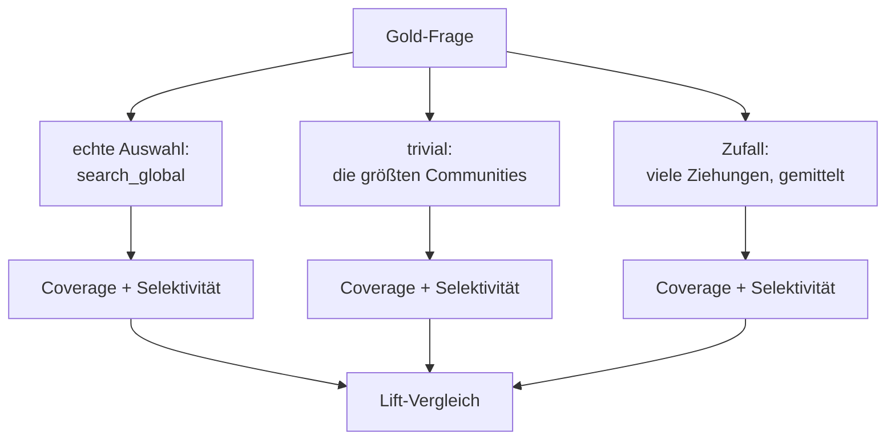
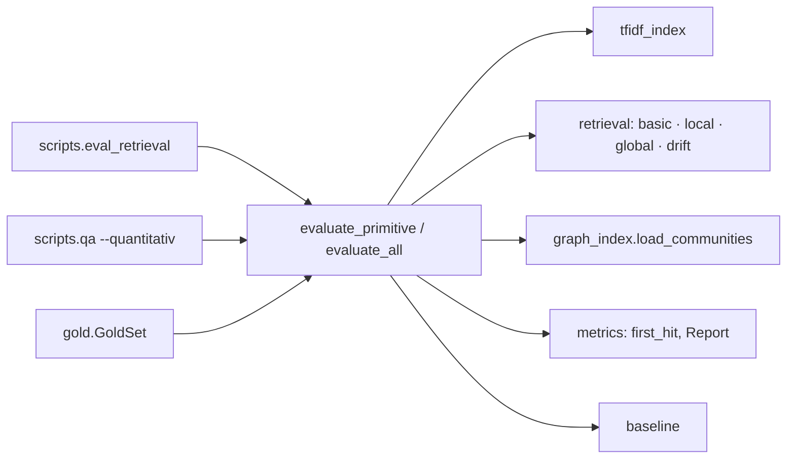

# Modul-Doku: `runner.py`

| Feld | Wert |
| --- | --- |
| **Modul** | `src/research_graphrag/evaluation/runner.py` |
| **Paket** | `evaluation` – quantitative Messung |
| **Phase** | 7 / A6 |
| **Grundlagen** | [ADR 0016](../../../../docs/adr/0016-quantitative-retrieval-evaluation-phase7.md) |

---

## 1. Zweck

Führt die Messung **gegen einen realen Index** aus – auf zwei Ebenen:

1. die geteilte **Chunk-Primitive**, also der Suchpfad, den Basic, der Local-Seed, der
   Local-Fan-out und die DRIFT-Verfeinerung gemeinsam nutzen,
2. die **Modi als Ganzes**, jeweils mit einer Diagnose, die Auswahlfehler von Rankingfehlern
   trennt.

## 2. Öffentliche Schnittstelle

| Symbol | Art | Aufgabe |
| --- | --- | --- |
| `evaluate_primitive` | Funktion | Misst die geteilte Chunk-Suche (ein Ladevorgang) |
| `evaluate_mode` | Funktion | Misst einen einzelnen Modus |
| `evaluate_all` | Funktion | Misst mehrere Ebenen in einem Lauf |
| `RunParameters` | Dataclass | Messparameter (inkl. `seeds` der Local Search); geht in den Fingerprint ein |
| `DEFAULT_PARAMETERS` | Konstante | Vorgabewerte als Singleton |
| `PRIMITIVE`, `MODES`, `LABELS` | Konstanten | Die messbaren Ebenen |
| `RANDOM_DRAWS`, `RANDOM_SEED` | Konstanten | Parameter der Zufalls-Baseline |

## 3. Ablauf

### Das Bündel als gemeinsame Währung

Jeder Modus wird auf dieselbe Form gebracht: eine Liste aus `(paper_id, Baustein)` **in der
Reihenfolge, in der der Modus seine Belege präsentiert**. Danach greift für alle dieselbe
Bewertung.

Das macht Modi vergleichbar, die intern völlig verschieden arbeiten – und es macht die Diagnose
möglich, weil der Baustein mitreist.

### Warum die Modi den Index selbst laden

`evaluate_primitive` lädt den Index **einmal** und ist entsprechend schnell. Die Modus-Funktionen
rufen dagegen die echten öffentlichen Funktionen auf – und die laden pro Aufruf neu, weil das der
On-Read-Betrieb so vorsieht.

Das ist eine bewusste Abwägung: Ein vollständiger Lauf dauert dadurch spürbar lange. Der
Alternativpfad – ein Sonderweg mit vorgeladenem Index – hätte aber bedeutet, dass die Messung
etwas anderes misst als das, was im Betrieb läuft. Für ein selten laufendes Werkzeug ist die
Laufzeit der geringere Preis.

### Basic als Contract, nicht als Kennzahl

Das Bündel von Basic ist per Konstruktion identisch zur Primitive. Beide werden trotzdem
gemessen – aber die Gleichheit ist eine **Prüfaussage**: Weichen sie ab, ist etwas kaputt, und
nicht etwa ein Modus besser geworden.

### Die Community-Messung und ihre Baselines

Die Zufalls-Baseline wird über **viele Ziehungen gemittelt**. Eine einzelne Ziehung war in der
Vorabmessung reines Rauschen und hätte zu einer falschen Schlussfolgerung geführt; erst der
Mittelwert legt sie erwartungsgemäß auf Zufallsniveau.

Der Seed ist fest – die Baseline ist damit reproduzierbar.

### Die DRIFT-Deckelung

Für DRIFT wird zusätzlich geprüft, ob die gewählte Community überhaupt ein relevantes Paper
**enthalten könnte**. Daraus entsteht die Unterscheidung zwischen „die Verfeinerung hat versagt"
und „die Auswahl hat versagt" – und genau diese Diagnose zeigte, dass die Verfeinerung fehlerfrei
arbeitet und **alle** Fehlschläge aus der Community-Wahl stammen.

### Die Parameter reisen in den Fingerprint

`RunParameters` beschreibt den Messaufbau. Es wird serialisiert und Teil des
Baseline-Fingerprints – ein Vergleich zweier Läufe mit unterschiedlichen Parametern wird dadurch
abgelehnt statt stillschweigend durchgeführt.

Die Vorgabewerte liegen als **Singleton** vor, weil Dataclass-Instanzen nicht als Standardwert
eines Parameters erzeugt werden sollen.

## 4. Zusammenspiel

## 5. Fehler und Grenzfälle

| Situation | Verhalten |
| --- | --- |
| unbekannte Ebene | `invalid_input` |
| Index fehlt | `not_found` aus der Retrieval-Schicht |
| kein Graph | `constraint_violation` bei den Community-Ebenen |
| Modus liefert nichts | kein Treffer, passende Diagnose |
| Gold-Set ohne Fragen | leerer Bericht mit Nullwerten |

## 6. Determinismus

- Fester Seed und feste Ziehungszahl für die Zufalls-Baseline.
- Alle Retrieval-Aufrufe sind deterministisch sortiert.
- Fragen werden in Dateireihenfolge abgearbeitet.

Zwei Läufe gegen denselben Index liefern identische Ränge – zweifach belegt, weil sowohl der
Regressions-Check als auch die QS-Harness direkt nach dem Einfrieren null Abweichungen melden.

## 7. Grenzen

- **Langsam bei vollem Lauf**, aus dem oben genannten Grund bewusst nicht optimiert.
- **Keine Nebenläufigkeit.** Die Fragen werden sequenziell abgearbeitet.
- **Feste Diagnose-Vokabulare.** Ein neuer Modus bräuchte eigene Diagnosewerte.
- **Misst Retrieval, nicht Antwortqualität.** Ob eine formulierte Antwort gut ist, bleibt
  außerhalb.
