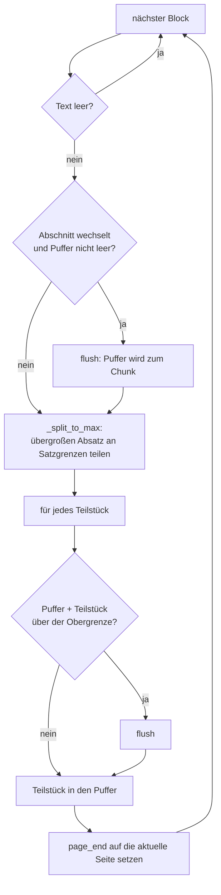
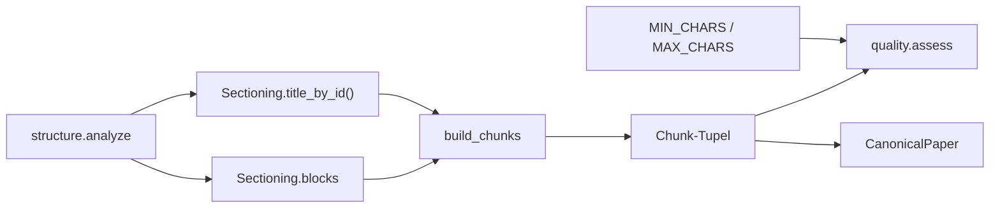

# Modul-Doku: `chunking.py`

| Feld | Wert |
| --- | --- |
| **Modul** | `src/research_graphrag/extraction/chunking.py` |
| **Paket** | `extraction` – PDF zu Canonical JSON |
| **Phase** | 2 (eingeführt), 7 / A3 (verfeinert) |
| **Grundlagen** | [ADR 0006](../../../../docs/adr/0006-canonical-model-phase2-scope.md), [ADR 0013](../../../../docs/adr/0013-chunking-refinement-phase7.md) |

---

## 1. Zweck

Wandelt die absatzweisen Blöcke der Strukturanalyse in **retrievbare Chunks** um. Ein Chunk ist
die Einheit, die später gefunden, bewertet und zitiert wird – seine Größe entscheidet damit
unmittelbar über die Qualität jeder Antwort.

Die Kernidee: Ein Chunk soll ein **inhaltlich zusammenhängendes Fenster** sein, begrenzt durch
den Abschnitt und eine Größenschwelle – nicht durch das Layout des Dokuments.

## 2. Öffentliche Schnittstelle

| Symbol | Art | Aufgabe |
| --- | --- | --- |
| `build_chunks` | Funktion | Blöcke → Chunks mit fortlaufender ID, Seiten-Range und Abschnittstitel |
| `MIN_CHARS` | Konstante | Untergrenze des Zielfensters (darunter zählt der Chunk in `short_chunks`) |
| `MAX_CHARS` | Konstante | Obergrenze des Zielfensters (darüber entsteht `long_chunk`) |

## 3. Ablauf

`build_chunks` ist eine Puffer-Maschine mit **zwei** Leerungsgründen:

Was **kein** Leerungsgrund ist: der Seitenumbruch. Er setzt lediglich `page_end` weiter.

### Die Seiten-Range statt der Seitengrenze

Vor der Verfeinerung war die Seite eine harte Grenze. Das erschien plausibel – exakte
Seitenprovenienz –, zerschnitt aber Sätze mitten am Umbruch und erzeugte massenhaft
Mini-Chunks. Die Messung zeigte allerdings, dass die Seitengrenze gar nicht der Hauptverursacher
war, sondern die übersegmentierende Überschriften-Erkennung; beide Ursachen wurden getrennt
behoben.

Heute gilt: Die Seite ist eine **Provenienz-Angabe**. Läuft ein Chunk über einen Umbruch, trägt
er `page_number` … `page_end`, und die Anzeige wird zu „Seiten 7–8"
([provenance.page_label](../../retrieval/doc/provenance.md)).

### Der Satz-Split

`_split_to_max` greift nur bei Absätzen oberhalb der Obergrenze. Es trennt an Satzenden und
akkumuliert Sätze bis zur Schwelle. Ein **einzelner** übergroßer Satz wird nicht weiter zerlegt:
Ein Schnitt mitten im Satz wäre schlechter als ein zu großer Chunk. Solche Fälle markiert
[quality](quality.md) als `long_chunk`.

### Kein Nachbearbeiten kleiner Reste

Ein früherer Tail-Merge, der kleine Endstücke an den Vorgänger hängte, erwies sich als toter
Code: Die Puffer-Akkumulation deckt diesen Fall bereits ab. Verbleibende kurze Reste werden
nicht verschoben, sondern **gezählt** – sie fließen in die aggregierte Kennzahl `short_chunks`.

## 4. Zusammenspiel

`quality.py` importiert die beiden Schwellen aus diesem Modul – die Grenzen des Zielfensters sind
damit nur an einer Stelle definiert.

## 5. Fehler und Grenzfälle

Keine `DomainError`. Grenzfälle:

- **Keine Blöcke:** leeres Ergebnis-Tupel. Ein Dokument, das nur aus Überschriftenzeilen besteht,
  erzeugt dadurch null Chunks **ohne** eigenes Flag – eine bekannte Lücke im Flag-Katalog, die
  real nicht auftritt und bewusst nicht behoben wurde
  ([ADR 0013](../../../../docs/adr/0013-chunking-refinement-phase7.md)).
- **Block ohne bekannten Abschnittstitel:** `section_title` bleibt leer, `section_id` bleibt
  gesetzt.
- **Übergroßer Einzelsatz:** bleibt ein Chunk und wird geflaggt.

## 6. Determinismus

Ein einziger Vorwärtsdurchlauf ohne Zufall; die `chunk_id` wird fortlaufend aus Paper-ID und
Laufindex gebildet. Gleiche Blockfolge ergibt zeichengleiche Chunks.

Der Merge ist **texterhaltend**: Er verliert und verdoppelt keinen Text – geprüft an echten
Dokumenten und über generierte Blockfolgen.

## 7. Grenzen

- **Keine semantische Segmentierung.** Themenwechsel innerhalb eines Abschnitts werden nicht
  erkannt.
- **Keine Überlappung.** Chunks überlappen nicht; ein Sachverhalt an einer Chunk-Grenze kann
  dadurch in beiden Teilen unvollständig wirken.
- **Feste Schwellen.** Die Größen sind Konstanten und nicht pro Dokumenttyp abgestimmt.
