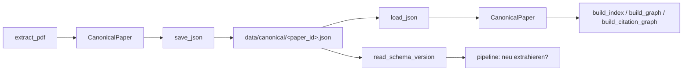

# Modul-Doku: `model.py`

| Feld | Wert |
| --- | --- |
| **Modul** | `src/research_graphrag/extraction/model.py` |
| **Paket** | `extraction` – PDF zu Canonical JSON |
| **Phase** | 2 (eingeführt), 7 / A3 + A5 (Schema geschärft), 13 / R2 (Dokumentart) |
| **Grundlagen** | [ADR 0006](../../../../docs/adr/0006-canonical-model-phase2-scope.md), [ADR 0013](../../../../docs/adr/0013-chunking-refinement-phase7.md), [ADR 0015](../../../../docs/adr/0015-noise-reduction-keywords-and-sections-phase7.md) |

---

## 1. Zweck

Das Datenmodell des **Canonical Paper JSON** – dem Zwischenformat zwischen PDF-Extraktion und
Index. Es enthält ausschließlich serialisierbare Datenstrukturen und hat **keine Abhängigkeit zu
`pypdf`**; dadurch bleiben Modell und Extraktions-Mechanik getrennt testbar.

## 2. Öffentliche Schnittstelle

| Symbol | Art | Aufgabe |
| --- | --- | --- |
| `CanonicalPaper` | Dataclass | Ein extrahiertes Paper: Identität, Dokumentart, Chunks, Abschnitte, Identifikatoren, Qualitäts-Flags |
| `Chunk` | Dataclass | Kleinste retrievbare Einheit mit Seiten-Range und Abschnitts-Provenienz |
| `Section` | Dataclass | Heuristisch erkannter Abschnitt als Provenienz-Anker |
| `SCHEMA_VERSION` | Konstante | Version des Canonical-Schemas |
| `SECTION_KIND_FRONT` / `_ABSTRACT` / `_BODY` / `_REFERENCES` | Konstanten | Klassifikation eines Abschnitts |
| `DOCUMENT_KIND_FULL` / `DOCUMENT_KIND_REFERENCE` | Konstanten | Dokumentart: Volltext bzw. Referenz-Eintrag ohne Volltext |
| `read_schema_version` | Funktion | Liest nur die Schema-Version einer Datei (für die Upgrade-Erkennung) |

> **`document_kind` ist bewusst kein Qualitäts-Flag.** Flags sind Befunde über *misslungene*
> Extraktion; die Dokumentart ist eine **Eigenschaft des Dokuments**. Nur so können Retrieval,
> Evaluation und Antwortsynthese darauf reagieren, statt sie bloß anzuzeigen
> ([ADR 0030](../../../../docs/adr/0030-reference-entries-in-corpus-phase13.md)).
> `from_dict` bleibt tolerant: Ein Alt-Artefakt ohne das Feld gilt als `full` – vor Schema 0.5.0
> gab es nur Volltext-Dokumente.

Jede Dataclass ist `frozen` und trägt `to_dict()` / `from_dict()`; `CanonicalPaper` zusätzlich
`save_json()` / `load_json()`.

## 3. Ablauf

Kein verzweigter Kontrollfluss – das Modul ist die Serialisierungsschicht:

### Die Schema-Version als Steuerinstrument

`SCHEMA_VERSION` ist nicht nur Metadatum, sondern **Auslöser**: Die Pipeline überspringt eine
unveränderte PDF-Datei nur dann, wenn auch die gespeicherte Schema-Version zur aktuellen passt.
Eine Anhebung erzwingt damit die Neu-Extraktion des gesamten Korpus, ohne dass ein Cache manuell
geleert werden muss.

Deshalb wurde die Version auch dann angehoben, als sich die *Struktur* gar nicht änderte, sondern
nur der **Inhalts-Contract** (normalisierter Text, verworfene Bibliografie-Zeilen).

### Die Seiten-Range

`page_number` ist die Start-, `page_end` die Endseite eines Chunks. `__post_init__` normalisiert
über `object.__setattr__` einen zu kleinen Wert auf die Startseite – nötig, weil die Dataclass
`frozen` ist. Dasselbe Muster verwendet `Citation` im Retrieval, damit beide Ebenen dieselbe
Invariante garantieren.

`from_dict` liest `page_end` mit Default `0` und ist damit **rückwärtstolerant**: Ein
Alt-Artefakt ohne dieses Feld ergibt über die Normalisierung wieder die Startseite.

## 4. Zusammenspiel

- **Erzeugt von** [pdf](pdf.md) (Orchestrator) aus den Ergebnissen von
  [structure](structure.md), [chunking](chunking.md) und [quality](quality.md).
- **Gelesen von** [pipeline](../../doc/pipeline.md) sowie allen drei Index-Bauten in
  `indexing/`.
- **Externe Ressource:** `data/canonical/*.json`.

## 5. Fehler und Grenzfälle

Das Modul wirft keine `DomainError`. `from_dict` erwartet die Pflichtfelder und meldet ein
fehlendes Feld als `KeyError`; `read_schema_version` liefert `"0.1.0"`, wenn das Feld fehlt –
so gilt ein Alt-Artefakt zuverlässig als veraltet. Die Pipeline fängt die Lesefehler ab und
behandelt sie als „nicht überspringbar".

## 6. Determinismus

- `to_dict` schreibt Identifikatoren **sortiert nach Schlüssel**.
- `save_json` nutzt feste Einrückung und `ensure_ascii=False`.
- Es gibt keine Zeitstempel, Zufallswerte oder Pfadabhängigkeiten im Inhalt.

> **Beim Vergleich beachten:** `save_json` schreibt über `write_text`, unter Windows also mit
> `CRLF`. Ein Byte-Vergleich gegen frisch erzeugtes JSON muss über `read_text()` laufen, sonst
> meldet er flächendeckende Unterschiede, die keine sind.

## 7. Grenzen

- **Keine Bounding-Boxen**, keine Abbildungen, keine Tabellenstrukturen – Provenienz endet bei
  Abschnitt und Seiten-Range ([ADR 0006](../../../../docs/adr/0006-canonical-model-phase2-scope.md)).
- **Keine Referenz-Einträge als Objekte.** Der Referenzabschnitt ist Text; die Zitationskanten
  entstehen erst in `indexing/citation_graph.py`.
- **Keine Migration.** Ein Schema-Wechsel wird durch Neu-Extraktion aufgelöst, nicht durch
  Umschreiben bestehender Dateien.
