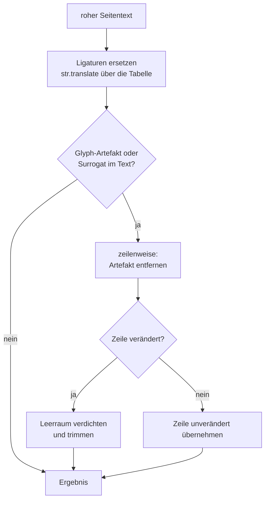
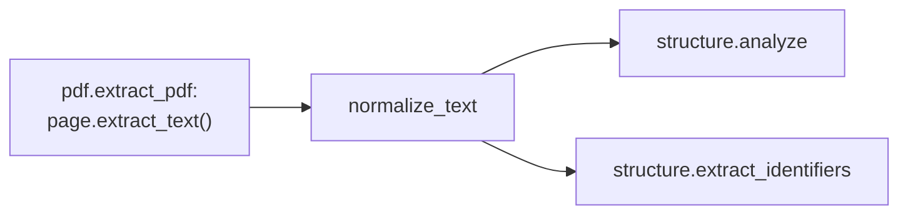

# Modul-Doku: `normalization.py`

| Feld | Wert |
| --- | --- |
| **Modul** | `src/research_graphrag/extraction/normalization.py` |
| **Paket** | `extraction` – PDF zu Canonical JSON |
| **Phase** | 7 / A5 |
| **Grundlagen** | [ADR 0015](../../../../docs/adr/0015-noise-reduction-keywords-and-sections-phase7.md) |

---

## 1. Zweck

Repariert Artefakte, die aus der PDF-Typografie in den extrahierten Text durchschlagen –
**bevor** Strukturanalyse, Chunking und Qualitäts-Gates darauf arbeiten. Die Artefakte
sehen ähnlich aus, verlangen aber unterschiedliche Behandlung:

| Artefakt | Beispiel | Behandlung | Warum |
| --- | --- | --- | --- |
| typografische Ligatur | `configuration` | **reparieren** zu `configuration` | trägt Inhalt; unrepariert ist das Wort für keine Anfrage auffindbar |
| Glyph-Verweis | `/uni00000013` | **entfernen** | ohne die Font-Zuordnung nicht rekonstruierbar, also reines Rauschen |
| einzelnes Surrogat | `U+D835` | **entfernen** | halbes Zeichen außerhalb der BMP; nicht rekonstruierbar und **nicht UTF-8-kodierbar** |

Das dritte Artefakt ist nicht nur Rauschen, sondern ein harter Blocker: Ein einzelnes Surrogat
lässt `save_json` mit `UnicodeEncodeError: surrogates not allowed` scheitern, das Paper wäre
nicht in den Korpus aufnehmbar.

## 2. Öffentliche Schnittstelle

| Symbol | Art | Aufgabe |
| --- | --- | --- |
| `normalize_text` | Funktion | Normalisiert einen Seitentext; idempotent |
| `LIGATURES` | Konstante | Abbildung der Ligaturen `U+FB00`–`U+FB06` auf ihre Buchstabenfolge |

## 3. Ablauf

Drei Details, die den Effekt bestimmen:

**Die Zeilenstruktur bleibt erhalten.** Die nachfolgende Strukturanalyse arbeitet zeilenweise;
ein pauschales Zusammenziehen von Whitespace würde Absatz- und Überschriftenerkennung zerstören.

**Leerraum wird nur in berührten Zeilen verdichtet.** Ein entferntes Artefakt hinterlässt eine
Lücke. Blieben diese Lücken stehen, würde die Tabellenerkennung `looks_tabular` – die auf
mehrfachen Leerzeichen beruht – die Zeile fälschlich als Tabellenzeile lesen. Unberührte Zeilen
bleiben dagegen exakt erhalten.

**Der Schnellpfad ist der Normalfall.** Enthält ein Text weder Glyph-Artefakt noch Surrogat,
kehrt die Funktion direkt nach der Ligatur-Ersetzung zurück, ohne zeilenweise zu arbeiten.

### Warum kein `NFKC`

Eine Unicode-Normalform würde die Ligaturen ebenfalls auflösen – aber auch die mathematischen
Alphanumerics `U+1D400`–`U+1D7FF` auf ASCII abbilden. Genau diese Zeichen sind das Erkennungsmerkmal
für Pseudocode- und Formelzeilen in [structure](structure.md); nach `NFKC` wäre die Reject-Regel
wirkungslos. Die Ersetzung bleibt deshalb bewusst auf eine explizite Tabelle beschränkt.

## 4. Zusammenspiel

Aufgerufen wird das Modul an **genau einer Stelle**: in `extract_pdf`, unmittelbar nach dem
Auslesen einer Seite und vor dem `strip()`. Alles Nachgelagerte sieht ausschließlich
normalisierten Text – auch der Zitationsgraph, der später auf den Referenzabschnitt zugreift.

## 5. Fehler und Grenzfälle

Keine `DomainError`. Der leere String ergibt den leeren String. Die Funktion ist **idempotent**:
Ein zweiter Durchlauf verändert nichts mehr, weil weder Ligaturen noch Artefakte zurückbleiben.
Das Ergebnis ist immer nach UTF-8 kodierbar – Voraussetzung dafür, dass `save_json` das
Canonical JSON schreiben kann.

## 6. Determinismus

Vollständig deterministisch: eine feste Übersetzungstabelle, ein fester regulärer Ausdruck, keine
Abhängigkeit von Locale, Zeit oder Umgebung.

## 7. Grenzen

- **Nur `U+FB00`–`U+FB06`.** Andere Präsentationsformen bleiben unangetastet.
- **Der Glyph-Inhalt ist verloren.** Entfernen ist die einzig ehrliche Option, solange die
  Font-Zuordnung fehlt – das Zeichen lässt sich nicht erraten. Dasselbe gilt für das einzelne
  Surrogat: Die fehlende zweite Hälfte ist nicht rekonstruierbar.
- **Keine Silbentrennung.** Ein am Zeilenende getrenntes Wort bleibt getrennt; dafür greift
  später eine Reject-Regel in [structure](structure.md).
- **Keine Spaltensortierung.** Mehrspaltige Layouts werden nicht entzerrt
  ([ADR 0006](../../../../docs/adr/0006-canonical-model-phase2-scope.md)).
