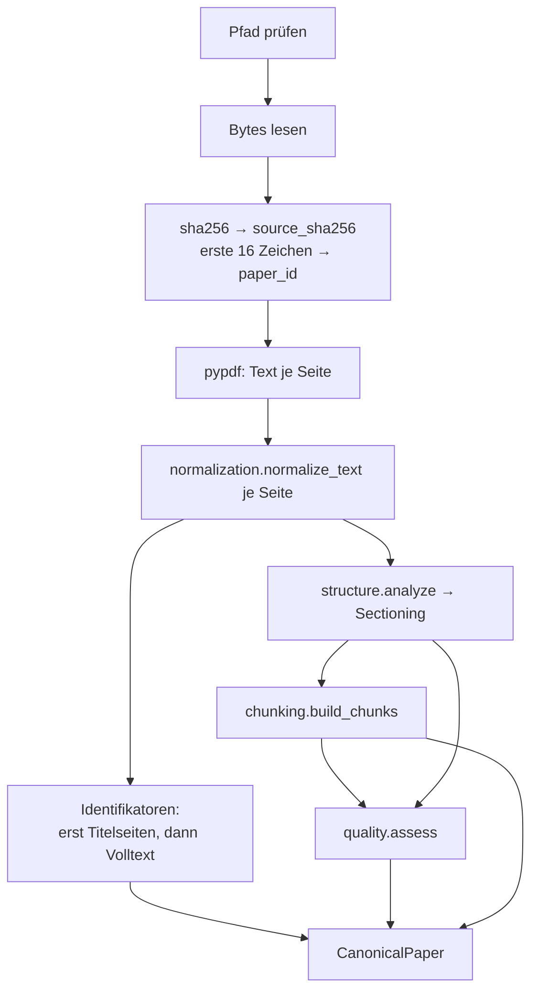
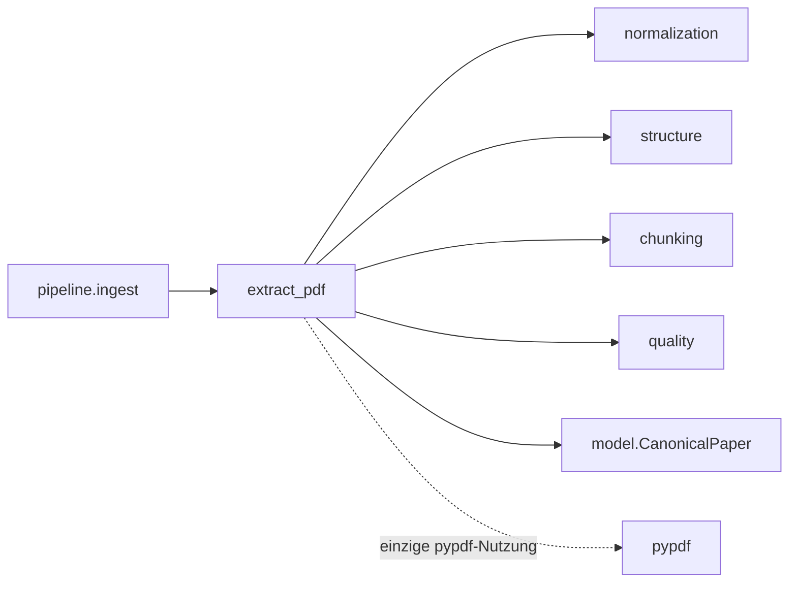

# Modul-Doku: `pdf.py`

| Feld | Wert |
| --- | --- |
| **Modul** | `src/research_graphrag/extraction/pdf.py` |
| **Paket** | `extraction` – PDF zu Canonical JSON |
| **Phase** | 0b (Durchstich), 2 (Aufteilung in Submodule) |
| **Grundlagen** | [ADR 0005](../../../../docs/adr/0005-graphrag-index-backend-open.md), [ADR 0006](../../../../docs/adr/0006-canonical-model-phase2-scope.md) |

---

## 1. Zweck

Der **Orchestrator** der Extraktion: die einzige Stelle, die `pypdf` berührt, und die einzige,
die alle Extraktions-Submodule zu einem `CanonicalPaper` zusammenführt. Alle fachlichen Regeln
liegen in den Submodulen; dieses Modul bestimmt die **Reihenfolge** und die **Identität** des
Papers.

## 2. Öffentliche Schnittstelle

| Symbol | Art | Aufgabe |
| --- | --- | --- |
| `extract_pdf` | Funktion | Dateipfad → vollständiges `CanonicalPaper` |
| `CanonicalPaper`, `Chunk`, `Section`, `SCHEMA_VERSION` | Re-Export | aus [model](model.md), damit Bestandscode und Tests einen stabilen Importpfad behalten |

## 3. Ablauf

### Die Identität des Papers

`paper_id` ist der gekürzte SHA-256 des **Dateiinhalts**. Daraus folgt:

- Dieselbe Datei ergibt immer dieselbe ID – auch nach Umbenennung oder Verschieben.
- Eine geänderte Datei ist ein anderes Paper; die Pipeline entfernt daraufhin das veraltete
  Canonical JSON.
- IDs sind ohne zentrale Vergabestelle stabil und über Rechner hinweg reproduzierbar.

Der vollständige Hash bleibt als `source_sha256` erhalten, die `source_uri` als `file://`-URI des
aufgelösten Pfads – das ist der Rückweg zum Original in jeder Antwort.

### Titelseite vor Volltext

Identifikatoren werden zuerst auf den **ersten beiden Seiten** gesucht und erst bei Fehlanzeige im
Volltext. Der Grund ist empirisch: Der erste arXiv-Treffer im Volltext ist häufig eine **zitierte
fremde** ID aus dem Literaturverzeichnis, nicht die eigene. Die Titelseiten-Präferenz vermeidet
diese Verwechslung – und der Zitationsgraph schützt sich zusätzlich mit einem eigenen
Frontmatter-Guard ([citation_graph](../../indexing/doc/citation_graph.md)).

### Warum die Reihenfolge feststeht

Normalisierung **vor** Strukturanalyse, Strukturanalyse **vor** Chunking, Qualitäts-Gates
**zuletzt** – jede Stufe konsumiert das Ergebnis der vorherigen. Die Qualitätsbewertung braucht
sowohl Abschnitte als auch Chunks und kann deshalb erst am Ende laufen.

## 4. Zusammenspiel

Dass `pypdf` nur hier vorkommt, ist beabsichtigt: Ein Wechsel des Extraktions-Backends – etwa auf
Docling, falls es beschaffbar wird – beträfe genau dieses Modul
([ADR 0005](../../../../docs/adr/0005-graphrag-index-backend-open.md)).

## 5. Fehler und Grenzfälle

| Situation | Fehlercode |
| --- | --- |
| leerer Pfad | `invalid_input` |
| Datei existiert nicht | `not_found` |
| Datei nicht lesbar (Betriebssystemfehler) | `internal_error` |
| Datei von `pypdf` nicht parsebar | `parse_error` |

Jeder Fehler trägt die `source_uri` als Detail mit, damit im Batch-Lauf erkennbar bleibt, welches
Dokument betroffen war. Eine Seite ohne extrahierbaren Text ist **kein** Fehler, sondern ein
Qualitäts-Flag.

## 6. Determinismus

Vollständig deterministisch: gleiche Datei ergibt byte-identisches Canonical JSON. Es gibt keine
Zeitstempel, keine Zufallswerte und keine Abhängigkeit vom Ablageort – die `source_uri` ist der
einzige pfadabhängige Wert und wird explizit aus dem aufgelösten Pfad gebildet.

## 7. Grenzen

- **Keine OCR.** Ein Scan ohne Textebene ergibt ein leeres Dokument mit `empty_document`.
- **Keine Layout-Analyse.** Mehrspaltige Seiten werden in der Reihenfolge geliefert, die `pypdf`
  vorgibt.
- **Keine Abbildungen, Tabellen oder Formeln als Objekte**
  ([ADR 0006](../../../../docs/adr/0006-canonical-model-phase2-scope.md)).
- **Keine Nebenläufigkeit.** Die Extraktion läuft je Datei sequenziell; die Parallelisierung wäre
  eine Optimierung ohne Contract-Änderung.
