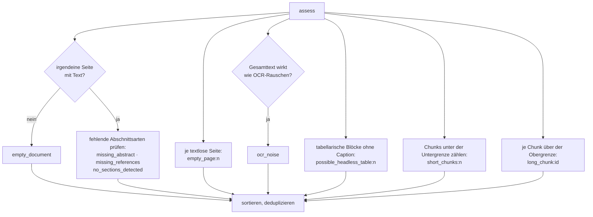
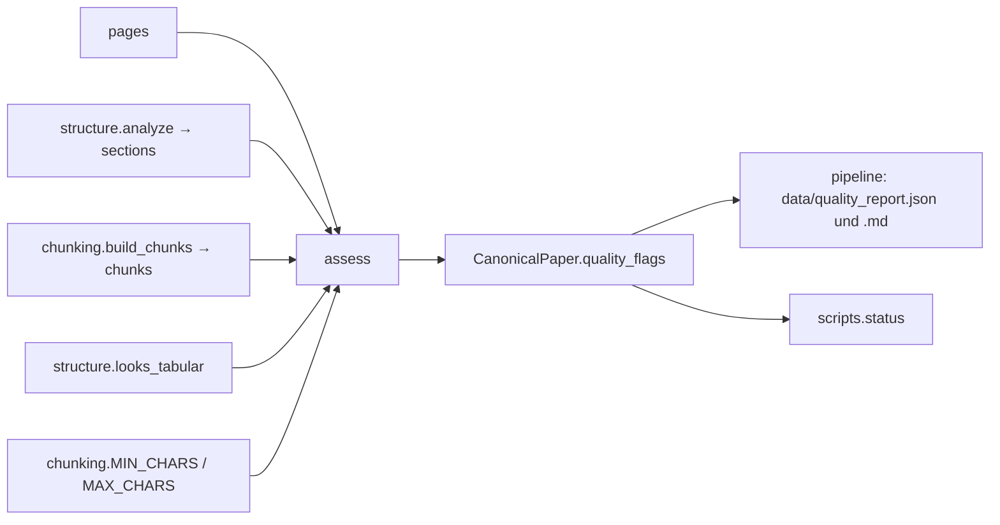

# Modul-Doku: `quality.py`

| Feld | Wert |
| --- | --- |
| **Modul** | `src/research_graphrag/extraction/quality.py` |
| **Paket** | `extraction` – PDF zu Canonical JSON |
| **Phase** | 2 (eingeführt), 7 / A3 (Flag-Katalog geschärft) |
| **Grundlagen** | [ADR 0006](../../../../docs/adr/0006-canonical-model-phase2-scope.md), [ADR 0013](../../../../docs/adr/0013-chunking-refinement-phase7.md) |

---

## 1. Zweck

Bewertet das Ergebnis einer Extraktion und erzeugt eine sortierte Liste von **Qualitäts-Flags**.
Die Flags blockieren nichts – sie sind **Signale für die Stichproben-QS**: Sie zeigen, wo die
Extraktion vermutlich unvollständig war, damit man dort gezielt nachsieht.

## 2. Öffentliche Schnittstelle

| Symbol | Art | Aufgabe |
| --- | --- | --- |
| `assess` | Funktion | Seiten, Abschnitte und Chunks → sortiertes, dedupliziertes Flag-Tupel |

## 3. Ablauf

### Der Flag-Katalog

| Flag | Bedeutung | Typische Ursache |
| --- | --- | --- |
| `empty_document` | kein extrahierbarer Text | reines Scan-PDF ohne Textebene |
| `empty_page:<n>` | Seite ohne Text | ganzseitige Abbildung |
| `missing_abstract` | kein Abstract-Abschnitt erkannt | abweichende Titelseite |
| `missing_references` | kein Referenzabschnitt erkannt | fehlende oder unerkannte Bibliografie |
| `no_sections_detected` | ausschließlich `front` | Layout ohne erkennbare Überschriften |
| `ocr_noise` | niedriger Alphanumerik-Anteil oder viele Ein-Zeichen-Token | fehlerhafte Texterkennung |
| `possible_headless_table:<n>` | tabellarischer Block ohne Caption darüber | verlorene Tabellenstruktur |
| `short_chunks:<n>` | **Anzahl** der Chunks unter dem Zielfenster | naturgemäße Restlängen |
| `long_chunk:<id>` | Chunk über dem Zielfenster | unteilbarer Übersatz |

### Warum kurze Chunks aggregiert, lange aber einzeln gemeldet werden

Das ist die zentrale Entwurfsentscheidung dieses Moduls. Kurze Chunks entstehen in großer Zahl
und sind einzeln nicht handlungsleitend – als Einzel-Flags haben sie den Report dominiert und die
seltenen, wirklich interessanten Befunde überdeckt. Als **Zahl** bleiben sie eine brauchbare
Gesundheitskennzahl.

Lange Chunks sind das Gegenteil: selten, und jeder einzelne verweist auf einen konkreten
unteilbaren Satz, den man ansehen kann. Deshalb bleibt hier die Chunk-ID erhalten.

### Die Tabellen-Erkennung

`_flag_headless_tables` sucht **zusammenhängende Läufe** von mindestens drei tabellarischen
Zeilen und prüft, ob in den zwei nicht-leeren Zeilen darüber eine „Table"/„Tabelle"-Caption
steht. Fehlt sie, ist die Tabellenstruktur vermutlich verloren gegangen. Die Zeilen-Erkennung
selbst stammt aus [structure.looks_tabular](structure.md) – dieselbe Regel, nur einmal
implementiert.

## 4. Zusammenspiel

## 5. Fehler und Grenzfälle

Keine `DomainError`; die Funktion ist total. Ohne Textseiten wird nur `empty_document` gemeldet –
die Abschnitts-Prüfungen entfallen, weil sie ohne Text keine Aussage hätten.

## 6. Determinismus

Das Ergebnis wird **sortiert und dedupliziert** zurückgegeben. Damit sind die Flags unabhängig
von der Auswertungsreihenfolge und eignen sich als stabiler Teil des Canonical JSON.

## 7. Grenzen

- **Heuristisch, nicht diagnostisch.** Ein Flag sagt „hier lohnt ein Blick", nicht „hier ist ein
  Fehler". Umgekehrt gilt: kein Flag ist keine Garantie.
- **Kein Flag für null Chunks.** Ein Dokument aus reinen Überschriftenzeilen bleibt unbemerkt –
  bekannte Lücke, real irrelevant
  ([ADR 0013](../../../../docs/adr/0013-chunking-refinement-phase7.md)).
- **Keine Bewertung des Inhalts.** Fachliche Richtigkeit oder Vollständigkeit werden nicht
  geprüft.
