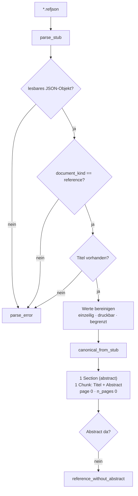

# Modul-Doku: `refstub.py`

| Feld | Wert |
| --- | --- |
| **Modul** | `src/research_graphrag/extraction/refstub.py` |
| **Paket** | `extraction` – Quelldatei zu Canonical JSON |
| **Phase** | 13 / R2 |
| **Grundlagen** | [ADR 0030](../../../../docs/adr/0030-reference-entries-in-corpus-phase13.md) · [ADR 0029](../../../../docs/adr/0029-reference-stub-resolution-phase13.md) · [ADR 0006](../../../../docs/adr/0006-canonical-model-phase2-scope.md) |

---

## 1. Zweck

Zweiter Extraktions-Adapter neben [`pdf.py`](pdf.md): Er liest die nativen Stub-Dateien
`*.refjson` – Paper, von denen nur der **Abstract** öffentlich ist – und überführt sie **ohne
Heuristik** in ein `CanonicalPaper`. Der Umweg über eine synthetische PDF wäre ein Verlustkanal
ohne Gegenwert.

Das Modul ist zugleich die **einzige Definitionsstelle des Stub-Formats**: Konstanten und Leser
leben hier, der schreibende Online-Lauf
([`online/references.py`](../../online/doc/references.md)) importiert sie. Wer ein Format schreibt
und wer es liest, teilen sich damit eine Wahrheit.

## 2. Öffentliche Schnittstelle

| Symbol | Art | Aufgabe |
| --- | --- | --- |
| `extract_stub` | Funktion | Datei → `CanonicalPaper` (der reguläre Weg) |
| `parse_stub` | Funktion | Rohbytes → `ReferenceStub` (Formatprüfung und Bereinigung) |
| `canonical_from_stub` | Funktion | Werte → `CanonicalPaper` (netzfrei, dateisystemfrei) |
| `ReferenceStub` | Dataclass | der geprüfte Inhalt einer Stub-Datei |
| `STUB_SUFFIX` / `STUB_SCHEMA_VERSION` | Konstanten | Endung und Formatversion |
| `ABSTRACT_SECTION_TITLE` | Konstante | Titel der einzigen Section |
| `MAX_TITLE_CHARS` / `MAX_ABSTRACT_CHARS` | Konstanten | Längengrenzen fremder Eingaben |

## 3. Ablauf

### Drei gesetzte Eigenschaften

| Eigenschaft | Warum |
| --- | --- |
| **Genau ein Chunk** aus Titel *und* Abstract | Fehlt der Abstract, bleibt der Titel – nur so ist der Eintrag auffindbar, und das ist Voraussetzung für die **Titel-Kanten** des Zitationsgraphen |
| **Keine Seitenangabe** (`page_number = page_end = 0`) | „Seite 1" wäre eine falsche Aussage über die Herkunft; die Anzeigeform liefert [`provenance.page_label`](../../retrieval/doc/provenance.md) |
| **Keine Referenz-Sektion** | Ein Stub ist **Ziel** von `CITES`-Kanten, nie deren Quelle |

### Warum vollständig geprüft wird, obwohl die Datei aus dem eigenen Werkzeug stammt

Der manuelle Weg führt ausdrücklich über **diese** Datei: Liefert keine Quelle einen Abstract,
wird er von Hand hineinkopiert ([ADR 0029](../../../../docs/adr/0029-reference-stub-resolution-phase13.md)).
Damit ist die Datei eine bearbeitete Eingabe – Titel, Autoren, Venue und Abstract werden auf
druckbare Zeichen reduziert, in Whitespace verdichtet und längenbegrenzt.

## 4. Grenzen

- Ein Stub trägt `n_pages = 0` und genau einen Chunk. Kennzahlen, die über Seiten oder
  Chunk-Größen mitteln, verschieben sich dadurch geringfügig.
- Die Dokumentart ist die **Signaturprüfung** dieses Dokumenttyps – was für PDFs die
  `%PDF-`-Signatur ist. Eine beliebige fremde `.refjson` im Eingang wird abgelehnt.
- Ob ein Referenz-Eintrag in Ausgaben als unvollständig **ausgewiesen** wird, entscheidet erst
  Phase 13 / R3 (Contract-Bruch bis in `Citation`).
