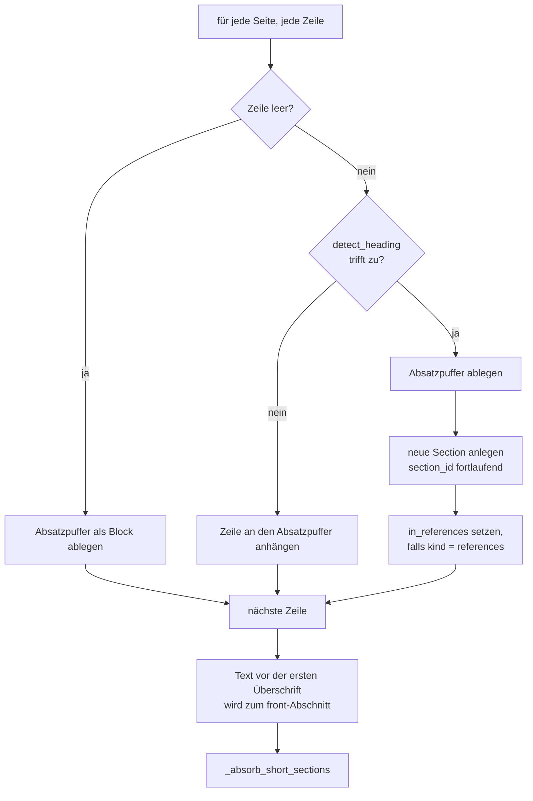
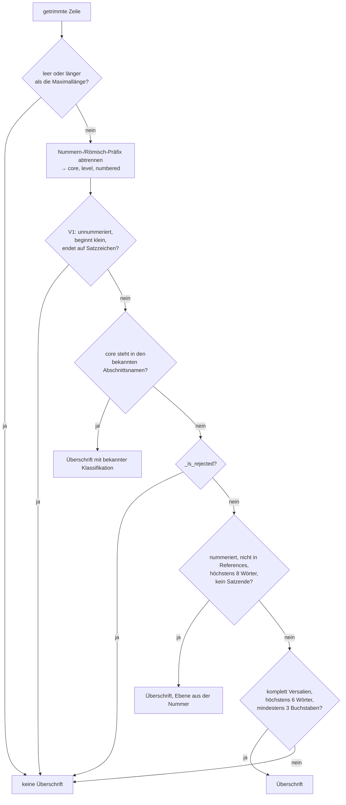
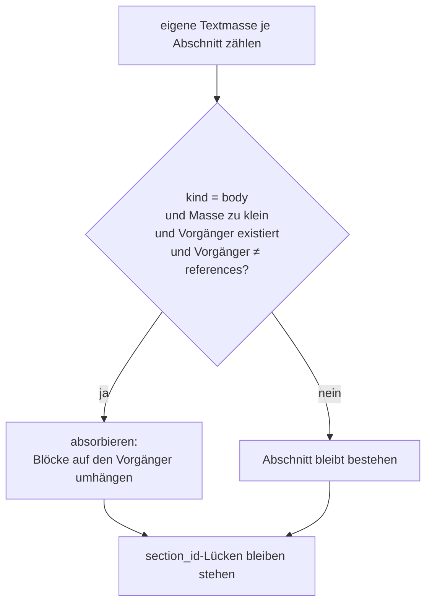
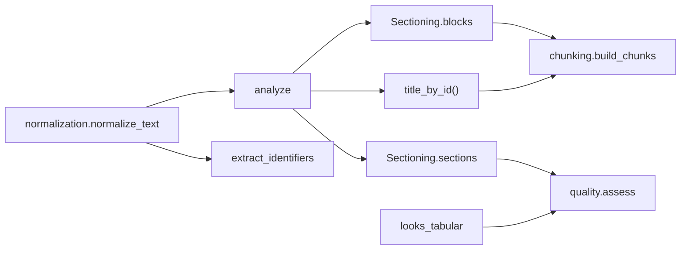

# Modul-Doku: `structure.py`

| Feld | Wert |
| --- | --- |
| **Modul** | `src/research_graphrag/extraction/structure.py` |
| **Paket** | `extraction` – PDF zu Canonical JSON |
| **Phase** | 2 (eingeführt), 7 / A3 + A5 (entschärft) |
| **Grundlagen** | [ADR 0006](../../../../docs/adr/0006-canonical-model-phase2-scope.md), [ADR 0013](../../../../docs/adr/0013-chunking-refinement-phase7.md), [ADR 0015](../../../../docs/adr/0015-noise-reduction-keywords-and-sections-phase7.md) |

---

## 1. Zweck

Erkennt aus reinem Seitentext die **Abschnittsstruktur** eines Papers, gruppiert den Fließtext
absatzweise und extrahiert **DOI/arXiv**. Das Modul arbeitet ohne `pypdf` und ist damit ohne
PDF-Fixtures testbar.

Der Kern ist eine Heuristik mit einem asymmetrischen Kostenprofil: Eine als Überschrift erkannte
Zeile landet **nicht** im Chunk-Text. Ein falsch positives Ergebnis zerlegt also nicht nur die
Struktur, sondern entzieht dem Retrieval Text. Die Regelmenge ist entsprechend darauf ausgelegt,
im Zweifel **keine** Überschrift anzunehmen.

## 2. Öffentliche Schnittstelle

| Symbol | Art | Aufgabe |
| --- | --- | --- |
| `analyze` | Funktion | Seitenfolge → `Sectioning` (Abschnitte + Fließtext-Blöcke) |
| `detect_heading` | Funktion | Entscheidet für **eine** Zeile, ob sie eine Überschrift ist |
| `extract_identifiers` | Funktion | DOI und arXiv-ID per regulärem Ausdruck |
| `looks_tabular` | Funktion | Erkennt eine tabellarisch anmutende Zeile (auch von `quality.py` genutzt) |
| `Sectioning` | Dataclass | Ergebnis von `analyze`, mit `title_by_id()` für die Chunk-Provenienz |
| `ContentBlock` | Dataclass | Ein Fließtext-Absatz mit Seite und Abschnittszuordnung |
| `MIN_SECTION_CHARS` | Konstante | Mindest-Textmasse eines eigenständigen Abschnitts |

## 3. Ablauf

### 3.1 `analyze` – Zeilen zu Abschnitten und Blöcken

Zwei Zustände laufen dabei mit: der aktuelle `section_id` (jeder Block wird ihm zugeordnet) und
`in_references` – das Signal dafür, dass sich die Analyse in der Bibliografie befindet.

### 3.2 `detect_heading` – die Regelreihenfolge

Die Reihenfolge ist die eigentliche Logik des Moduls; sie zu ändern verändert das Ergebnis
grundlegend:

**Warum V1 ganz vorn steht.** Ein Fließtextrest wie `methods.` steht im Lexikon der bekannten
Abschnittsnamen. Ohne die vorgelagerte Regel würde er als Abschnitt gelten und den nachfolgenden
Text an sich ziehen – und `_is_rejected` käme nie zum Zug, weil der Lexikon-Zweig vorher
zurückkehrt.

**Warum `_is_rejected` erst nach dem Lexikon greift.** Die Reject-Regeln sind unscharf.
Stünden sie vorn, könnten sie `Abstract` oder `References` verwerfen – genau die beiden
Abschnitte, an denen Qualitäts-Flags und der Zitationsgraph hängen.

**Warum die Numerierung in der Bibliografie abgeschaltet ist.** Ein Literatureintrag beginnt
mit einer laufenden Nummer (`27. REALM: …`) und ist von einer numerierten Überschrift
lexikalisch nicht zu unterscheiden. Der Kontext löst, was die Zeile allein nicht kann.

### 3.3 Die Reject-Regeln

`_is_rejected` prüft sechs Merkmale; ein einziges genügt zum Verwerfen:

| Merkmal | Fängt |
| --- | --- |
| mathematische Symbole, Pfeile, mathematische Alphanumerics | Pseudocode- und Formelzeilen |
| `looks_tabular` | Tabellenzellen und Running Header |
| Zeilenende auf `-` `;` `,` `.` | Silbentrennungsreste und Satzfragmente |
| URL-, DOI- oder arXiv-Marker | Link- und Literaturzeilen |
| `et al` | Literaturverweise |
| Code-Zeichen wie `"` `{` `}` `[` `]` `=` `<` `>` `\|` | JSON-/Code-Fragmente |
| Ziffern- und Prozentanteil über der Schwelle | numerische Tabellenzeilen |

### 3.4 `_absorb_short_sections` – gegen Übersegmentierung

Nach der Erkennung wird gemessen, wie viel **eigenen** Text jeder Abschnitt trägt. Liegt er unter
`MIN_SECTION_CHARS`, wandert er in seinen Vorgänger:

Drei Schutzregeln: `front`, `abstract` und `references` werden nie absorbiert, weil an ihnen
Flags und der Zitationsgraph hängen. Und es wird nie **in** einen `references`-Abschnitt hinein
absorbiert – sonst gälte ein nachfolgender Anhang als Bibliografie.

Die überlebenden Abschnitte behalten ihre ursprüngliche `section_id`. Die entstehenden Lücken in
der Numerierung sind gewollt: Sie machen nachvollziehbar, dass dort eine erkannte Überschrift
zurückgenommen wurde.

## 4. Zusammenspiel

`looks_tabular` ist öffentlich, weil `quality.py` dieselbe Erkennung für die Tabellen-Flags
braucht – die Regel existiert bewusst nur einmal.

## 5. Fehler und Grenzfälle

Keine `DomainError`. Grenzfälle:

- **Keine Überschrift erkannt:** Der gesamte Text bildet einen `front`-Abschnitt; `quality.py`
  setzt dann `no_sections_detected`.
- **Leere Seitenfolge:** `analyze` liefert einen `front`-Abschnitt ohne Blöcke.
- **Identifikatoren:** `extract_identifiers` liefert ein leeres Dict, wenn nichts passt – der
  Aufrufer entscheidet über den Rückfall auf den Volltext.

## 6. Determinismus

Rein textbasiert und ohne Zufall. Abschnitte werden in Lesereihenfolge numeriert; die Absorption
läuft in einem einzigen Vorwärtsdurchlauf, sodass das Ergebnis nur von der Eingabe abhängt.

## 7. Grenzen

- **Heuristik, kein Layout-Verständnis.** Ohne Schriftgrößen und Positionen bleiben
  Fehlklassifikationen möglich; numerierte Fließtextreste ohne Rauschmerkmal überleben als Titel.
- **Ein Anhang ohne erkennbare Überschrift** zählt nach der Bibliografie zum Referenzabschnitt –
  bewusst in Kauf genommen, weil die Alternative ganze Abschnitte gekostet hätte
  ([ADR 0015](../../../../docs/adr/0015-noise-reduction-keywords-and-sections-phase7.md)).
- **Nur eine Ebenen-Näherung.** `level` folgt der Gliederungsnummer; ohne Nummer ist es `1`.
- **Kein Referenz-Parsing.** Der Referenzabschnitt bleibt unstrukturierter Text
  ([ADR 0006](../../../../docs/adr/0006-canonical-model-phase2-scope.md)).
