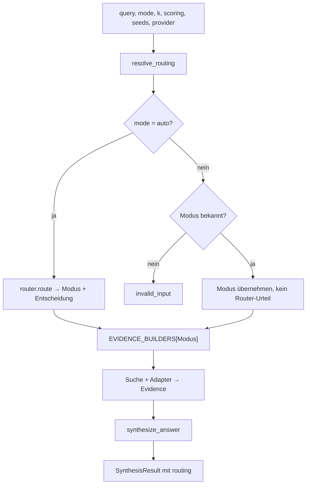
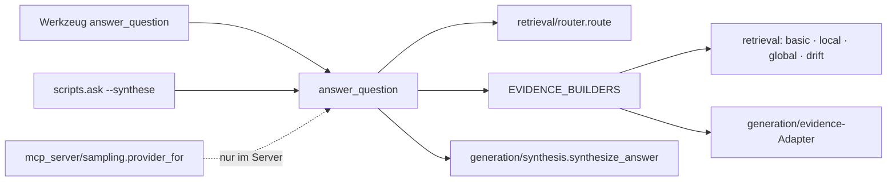

# Modul-Doku: `answer.py`

| Feld | Wert |
| --- | --- |
| **Modul** | `src/research_graphrag/generation/answer.py` |
| **Paket** | `generation` – LLM-Bridge und Antwort-Synthese |
| **Phase** | 7 / A1 (Routing-Ausweis: A7) |
| **Grundlagen** | [ADR 0012](../../../../docs/adr/0012-llm-bridge-and-answer-synthesis-phase7.md), [ADR 0017](../../../../docs/adr/0017-router-hardening-phase7.md) |

---

## 1. Zweck

Der **eine Weg** von einer Frage zu einer belegten Antwort: Modus bestimmen, suchen, Evidenz
aufbereiten, optional formulieren. Kommandozeile und MCP-Werkzeug rufen dieselbe Funktion auf und
teilen dadurch zwingend dieselbe Semantik.

## 2. Öffentliche Schnittstelle

| Symbol | Art | Aufgabe |
| --- | --- | --- |
| `answer_question` | Funktion | Frage → `SynthesisResult` mit Evidenz, Routing und optionaler Antwort |
| `resolve_routing` | Funktion | Löst `auto` auf und liefert Modus **plus** Router-Urteil |
| `resolve_mode` | Funktion | Wie oben, aber nur der Modus |
| `EVIDENCE_BUILDERS` | Konstante | Abbildung Modus → Such- und Adapteraufruf |
| `AUTO_MODE` | Konstante | Der Wert, der die Router-Heuristik auswählt |

## 3. Ablauf

### Die Modus-Abbildung als einzige Wahrheit

`EVIDENCE_BUILDERS` verbindet je Modus die Suche mit ihrem Adapter. Diese Abbildung ist zugleich
die **Gültigkeitsprüfung**: Ein Modus ist genau dann erlaubt, wenn er hier einen Eintrag hat. Es
gibt keine zweite Liste, die damit aus dem Tritt geraten könnte.

Alle Einträge haben dieselbe Signatur, obwohl Global die Wertung nicht braucht – es rankt
Communities, nicht Chunks – und nur Local die Zahl der Seeds. Die Parameter werden dort bewusst
ignoriert, statt die Abbildung uneinheitlich zu machen.

### `auto` versus expliziter Modus

| Aufruf | Modus-Herkunft | Feld `routing` |
| --- | --- | --- |
| `mode = "auto"` | Router-Heuristik | Entscheidung mit Konfidenz und Signalen |
| expliziter Modus | Aufrufer | leer |

Bei expliziter Wahl gibt es **nichts** zu begründen – ein Router-Urteil wäre dort irreführend.
`resolve_mode` existiert als schmale Variante für Aufrufer, die nur den Modus brauchen; sie
delegiert an `resolve_routing`, damit die Auflösungslogik nur einmal existiert.

### Der Provider ist optional

Ohne übergebenen Provider wird der Noop-Provider verwendet. Die Standardausgabe ist damit
**Evidenz ohne Formulierung** – Generierung ist eine bewusste Zusatzentscheidung des Aufrufers,
nicht der Normalfall. Für Copilot ist das die richtige Voreinstellung: Der Client ist selbst ein
Modell, und eine serverseitige Formulierung wäre doppelte Arbeit.

### Was die Funktion nicht tut

Sie sucht nicht selbst, nummeriert nicht und ruft kein Modell. Sie **verbindet** – die Logik
liegt in Router, Retrieval, Adaptern und Synthese. Genau deshalb ist sie kurz und gut prüfbar.

## 4. Zusammenspiel

## 5. Fehler und Grenzfälle

| Situation | Fehlercode |
| --- | --- |
| unbekannter Modus | `invalid_input` – mit Aufzählung der erlaubten Werte |
| leere Anfrage, `k <= 0`, unbekannte Wertung | `invalid_input` (aus dem Retrieval) |
| Index fehlt oder ist unvollständig | `not_found` / `constraint_violation` |
| kein Treffer | kein Fehler – leere Evidenz, keine Generierung |

Die Modus-Prüfung läuft **vor** jedem Index-Zugriff: Ein Tippfehler im Modus soll nicht als
Index-Problem erscheinen.

## 6. Determinismus

Deterministisch bis zum Provider: Der Router ist eine reine Textheuristik, Retrieval und Adapter
sind deterministisch sortiert, die Nummerierung ist fest. Nur die optionale Formulierung kann
variieren – erkennbar am `generated`-Flag.

## 7. Grenzen

- **Ein Modus je Aufruf.** Es werden keine Modi kombiniert und keine Ergebnisse zusammengeführt.
- **Kein Nachfassen.** Bei leerem Ergebnis wird nicht automatisch ein anderer Modus versucht –
  ein stiller Modus-Wechsel würde die ausgewiesene Routing-Begründung entwerten.
- **`k` gilt modusabhängig.** Die Zahl bedeutet je Modus etwas anderes (Passagen, Nachbarn,
  Communities).
- **Keine Zwischenspeicherung.** Jeder Aufruf lädt den Index neu – das ist die Voraussetzung
  dafür, dass neue Paper sofort wirken.
