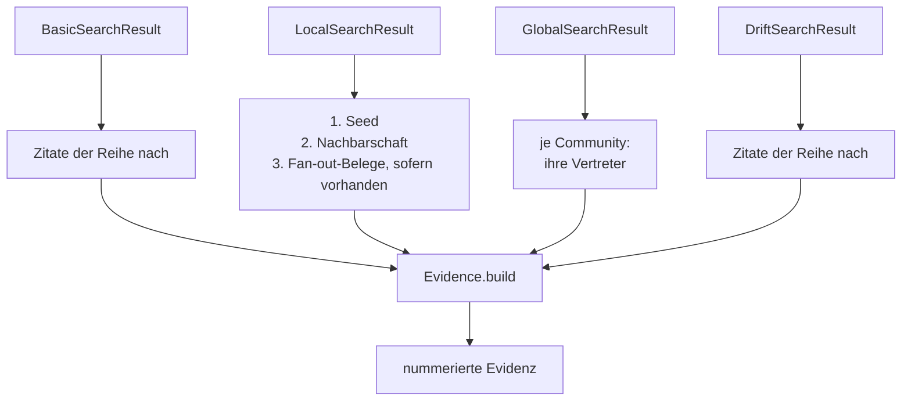
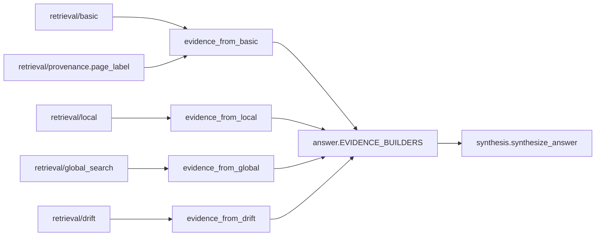

# Modul-Doku: `evidence.py`

| Feld | Wert |
| --- | --- |
| **Modul** | `src/research_graphrag/generation/evidence.py` |
| **Paket** | `generation` – LLM-Bridge und Antwort-Synthese |
| **Phase** | 7 / A1 |
| **Grundlagen** | [ADR 0012](../../../../docs/adr/0012-llm-bridge-and-answer-synthesis-phase7.md) |

---

## 1. Zweck

Die **Adapterschicht** zwischen Retrieval und Synthese: Sie übersetzt die vier unterschiedlich
geformten Modus-Ergebnisse in *eine* einheitliche Beleg-Sammlung.

Damit sieht ein Aufrufer über alle Modi hinweg dasselbe Beleg-Schema – unabhängig davon, ob die
Belege aus Passagen, aus einer Nachbarschaft oder aus Community-Vertretern stammen.

## 2. Öffentliche Schnittstelle

| Symbol | Art | Aufgabe |
| --- | --- | --- |
| `evidence_from_basic` | Funktion | Top-k-Zitate → Evidenz |
| `evidence_from_local` | Funktion | Seed, Nachbarschaft und Fan-out-Belege → Evidenz |
| `evidence_from_global` | Funktion | Vertreter je Top-Community → Evidenz |
| `evidence_from_drift` | Funktion | lokal verfeinerte Zitate → Evidenz |

## 3. Ablauf

### Zwei Beleg-Formen, ein Schema

| Herkunft | Label-Form | Modi |
| --- | --- | --- |
| Chunk-Zitat | `Paper <id> · Abschnitt <titel> · Seite(n) <n>` | basic, local, drift |
| Community-Vertreter | `Paper <id> · Community #<n>` | global |

Der Abschnitt erscheint nur, wenn ein Titel erkannt wurde; die Seitenangabe kommt aus
`page_label` und ist damit identisch zu allen anderen Ausgabekanälen.

Global ist die Ausnahme mit gutem Grund: Es gibt dort keine Passage, auf die man zeigen könnte.
Das Label nennt deshalb die Community statt einer Seite – ehrlicher als ein erfundener
Seitenanker.

### Die Reihenfolge bei Local ist die Aussage

Local liefert drei Bausteine, und ihre Reihenfolge ist bedeutungstragend: Der **Seed** steht als
Beleg `[1]` vorn, danach folgt sein Kontext, zuletzt die Belege aus den Nachbarpapern. Wer die
Antwort liest, sieht damit an der Nummer, wie weit ein Beleg vom Ausgangspunkt entfernt ist.

Nachbarpaper **ohne** Beleg werden übersprungen: Ein Paper, für das keine anfragerelevante
Passage gefunden wurde, ist eine Information über Ähnlichkeit, aber kein Beleg für eine Aussage.

### Warum die Adapter hier und nicht in der Synthese liegen

Diese Trennung ist eine bewusste Schichtentscheidung. Dieses Modul importiert Retrieval-Typen;
[synthesis](synthesis.md) darf das nicht. Dadurch bleibt die Synthese unabhängig vom
Retrieval und lässt sich ohne Index prüfen, während der Adapter genau die eine Aufgabe hat, die
beide Seiten kennt.

### Kein eigenes Nummerieren

Alle vier Funktionen enden bei `Evidence.build`. Die Nummerierung entsteht dort – nicht hier.

## 4. Zusammenspiel

## 5. Fehler und Grenzfälle

Keine `DomainError` – die Adapter sind reine Umformungen. Ein leeres Modus-Ergebnis ergibt eine
leere Evidenz; die Synthese behandelt diesen Fall.

| Fall | Verhalten |
| --- | --- |
| Local ohne Seed | keine Einträge, auch wenn Fan-out-Daten existierten |
| Fan-out-Nachbar ohne Beleg | übersprungen |
| Community ohne Vertreter | trägt keine Einträge bei |
| Zitat ohne Abschnittstitel | Label ohne Abschnittsteil |

## 6. Determinismus

Reine Umformung ohne Zufall. Die Reihenfolge folgt vollständig der Reihenfolge des
Modus-Ergebnisses, und die Modus-Ergebnisse sind ihrerseits deterministisch sortiert.

## 7. Grenzen

- **Keine Bewertung, keine Auswahl.** Die Adapter kürzen nicht und sortieren nicht um.
- **Keine Deduplizierung.** Erscheinen zwei Passagen desselben Papers, entstehen zwei Belege.
- **Keine Scores in der Evidenz.** Die Belege tragen Provenienz und Text; die Score-Werte
  bleiben in den Modus-Ergebnissen.
- **Nur diese vier Modi.** Ein neuer Modus braucht einen eigenen Adapter und einen Eintrag in
  der Modus-Abbildung von [answer](answer.md).
