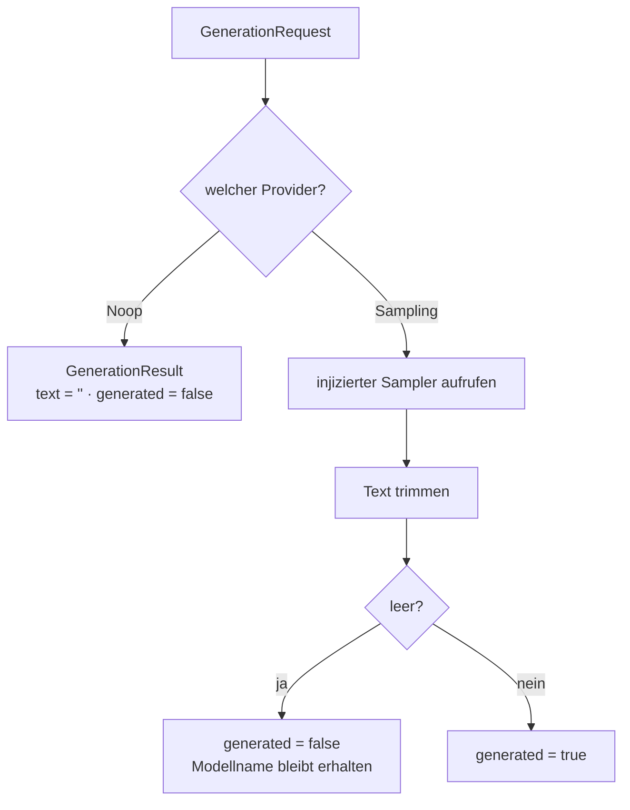
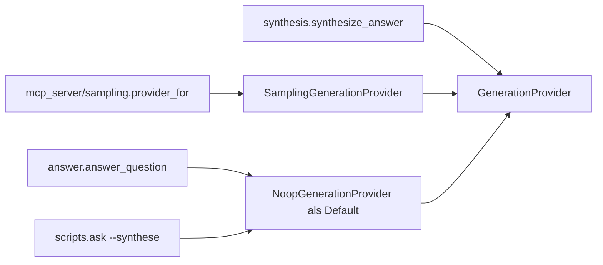

# Modul-Doku: `provider.py`

| Feld | Wert |
| --- | --- |
| **Modul** | `src/research_graphrag/generation/provider.py` |
| **Paket** | `generation` – LLM-Bridge und Antwort-Synthese |
| **Phase** | 7 / A1 |
| **Grundlagen** | [ADR 0004](../../../../docs/adr/0004-llm-bridge-via-mcp-sampling.md), [ADR 0012](../../../../docs/adr/0012-llm-bridge-and-answer-synthesis-phase7.md) |

---

## 1. Zweck

Definiert den **Port**, über den – und nur über den – ein Sprachmodell an dieses System
angeschlossen wird. Der Port ist bewusst **synchron** und modellagnostisch: Er weiß nichts über
MCP, nichts über Netzwerk und nichts über Anbieter.

Damit bleibt die gesamte Generierungslogik offline testbar, und das System kommt ohne gebundenes
Modell und ohne Zugangsdaten aus.

## 2. Öffentliche Schnittstelle

| Symbol | Art | Aufgabe |
| --- | --- | --- |
| `GenerationProvider` | Protocol | Der Port: `generate(request) -> result` |
| `NoopGenerationProvider` | Klasse | Standardfall ohne Modell – liefert nie eine Antwort |
| `SamplingGenerationProvider` | Klasse | Adaptiert einen injizierten synchronen Sampler |
| `GenerationRequest` | Dataclass | Frage, nummerierter Beleg-Kontext, System-Prompt |
| `GenerationResult` | Dataclass | Text, `generated`-Flag, Modellbezeichnung |
| `GenerationSampler` | Typ-Alias | Der synchrone Adapter auf ein Client-Modell |
| `DEFAULT_SYSTEM_PROMPT` | Konstante | Der Zitier-Contract |
| `MAX_ANSWER_TOKENS`, `SAMPLING_TEMPERATURE` | Konstanten | Parameter der Anforderung |

## 3. Ablauf

### Der Zitier-Contract

`DEFAULT_SYSTEM_PROMPT` ist mehr als eine Anweisung – er ist die **Vereinbarung**, unter der eine
generierte Antwort überhaupt akzeptabel ist:

- ausschließlich die nummerierten Belege verwenden, kein Vorwissen,
- jede Aussage mit einer Marke in eckigen Klammern belegen,
- Unbelegtes ausdrücklich als „nicht belegt" kennzeichnen statt zu spekulieren.

Der Contract wird nicht nur an das Modell gesendet, sondern auch **im Ergebnis mitgeliefert**, so
dass ein Aufrufer nachvollziehen kann, unter welcher Auflage die Antwort entstand.

### Das Flag `generated` als Ehrlichkeitsschalter

Das ist die zentrale Idee des Moduls. Es gibt keinen Zustand „vielleicht generiert": Entweder ein
Modell hat geantwortet, oder es hat nicht. Eine **leere** Completion gilt dabei ausdrücklich als
nicht generiert – sonst könnte eine inhaltsleere Antwort als Ergebnis durchgehen.

Der Noop-Provider ist damit kein Notbehelf, sondern die **korrekte Antwort auf die Abwesenheit
eines Modells**: Die Belege bleiben vollständig, und die Degradation ist am Flag ablesbar.

### Warum der Sampler synchron ist

Ein tatsächlicher Modellaufruf über MCP ist asynchron. Dieses Modul kennt davon nichts: Es
erwartet einen **synchronen** Aufruf und lässt die Übersetzung an der Servergrenze stattfinden
([sampling](../../mcp_server/doc/sampling.md)). Der Nutzen ist konkret – die Generierungslogik
lässt sich mit einem gewöhnlichen Funktions-Stub testen, ohne Event-Loop und ohne Client.

### Temperatur null

Die Anforderung wird mit Temperatur null gestellt. Reproduzierbarkeit ist damit zwar nicht
garantiert – das liegt beim Modell –, aber so weit angefordert, wie es das Protokoll erlaubt.

## 4. Zusammenspiel

Die Kommandozeile benutzt **immer** den Noop-Provider: Sie hat keinen MCP-Client und damit kein
Modell. Der `--synthese`-Schalter zeigt dort die nummerierte Evidenz samt sichtbarem Hinweis auf
die fehlende Generierung.

## 5. Fehler und Grenzfälle

Keine `DomainError`. Das Modul wirft grundsätzlich nicht – ein Ausfall des Modells ist kein
Fehlerfall, sondern eine Degradation. Fehler des Samplers werden eine Ebene höher abgefangen und
in ein nicht generiertes Ergebnis übersetzt.

| Situation | Ergebnis |
| --- | --- |
| kein Modell verfügbar | `generated = false`, Text leer |
| Modell liefert nur Leerraum | `generated = false`, Modellname erhalten |
| Modell liefert Text | `generated = true`, Text getrimmt |

## 6. Determinismus

Der Port selbst ist deterministisch; die Normalisierung – Trimmen und Leer-Prüfung – ist eine
reine Funktion. Der **einzige** nicht-deterministische Anteil des gesamten Systems liegt hinter
diesem Port, im tatsächlichen Modell.

## 7. Grenzen

- **Keine Modellbindung, keine Zugangsdaten.** Ein eigener Anbieter wird bewusst nicht
  unterstützt ([ADR 0004](../../../../docs/adr/0004-llm-bridge-via-mcp-sampling.md)).
- **Keine Streaming-Antworten**, keine Werkzeugaufrufe durch das Modell.
- **Keine inhaltliche Prüfung.** Ob die Antwort den Zitier-Contract einhält, wird nicht
  automatisch verifiziert – die Evidenz bleibt daher immer vollständig beigelegt.
- **Ein Versuch.** Es gibt keine Wiederholung bei fehlgeschlagener Generierung.
