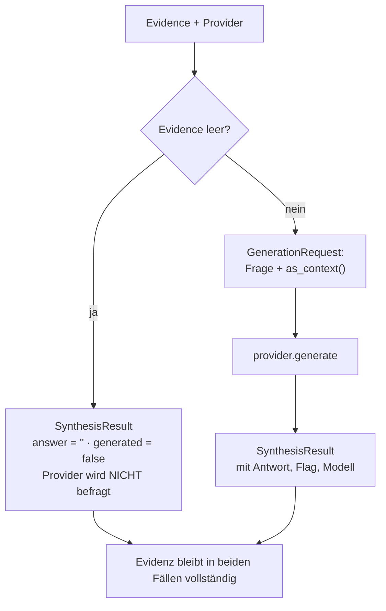
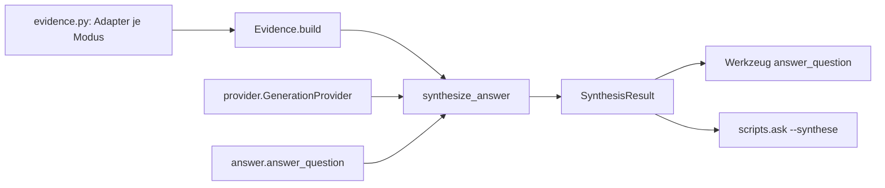

# Modul-Doku: `synthesis.py`

| Feld | Wert |
| --- | --- |
| **Modul** | `src/research_graphrag/generation/synthesis.py` |
| **Paket** | `generation` – LLM-Bridge und Antwort-Synthese |
| **Phase** | 7 / A1 (Routing-Feld: A7) |
| **Grundlagen** | [ADR 0012](../../../../docs/adr/0012-llm-bridge-and-answer-synthesis-phase7.md), [ADR 0017](../../../../docs/adr/0017-router-hardening-phase7.md) |

---

## 1. Zweck

Hält die **mode-agnostische Beleg-Repräsentation** und orchestriert die optionale Generierung.
Hier entsteht die Nummerierung, auf die sich eine Antwort später bezieht – und hier wird
entschieden, ob ein Modell überhaupt befragt wird.

Das Modul importiert bewusst **keine** Retrieval-Typen. Es kennt nur Belege als Tupel; die
Übersetzung aus den Modus-Ergebnissen liegt in [evidence](evidence.md). Diese Trennung hält die
Schichten sauber und macht die Synthese ohne Index testbar.

## 2. Öffentliche Schnittstelle

| Symbol | Art | Aufgabe |
| --- | --- | --- |
| `synthesize_answer` | Funktion | Evidenz + Provider → `SynthesisResult` |
| `Evidence` | Dataclass | Beleg-Sammlung mit `build()`, `as_context()`, `is_empty()`, `to_dict()` |
| `EvidenceSource` | Dataclass | Beleg-Eingabe **vor** der Nummerierung (benannt statt Tupel) |
| `EvidenceItem` | Dataclass | Ein nummerierter Beleg inkl. `identifiers` und `citation_key` |
| `SynthesisResult` | Dataclass | Antwort, Flag, Evidenz, Modell, Routing und Literaturangaben – mit `to_dict()` |

## 3. Ablauf

### Die einzige Nummerierungsstelle

`Evidence.build` vergibt die Marken `[1]`, `[2]`, … – und zwar **nur** hier. Das ist keine
Stilfrage, sondern die Voraussetzung dafür, dass die Marken im Prompt, in der ausgegebenen
Antwort und in der Provenienzliste zwangsläufig übereinstimmen. Gäbe es eine zweite Stelle,
könnten die Nummern auseinanderlaufen und eine Antwort auf den falschen Beleg verweisen.

### Der Kontext für das Modell

`as_context()` erzeugt aus den Belegen einen festen, dreizeiligen Block je Eintrag: Marke und
Provenienz-Label, Textausschnitt, Quelle. Die Struktur ist absichtlich schlicht und stabil –
das Modell soll die Marke unmissverständlich der Quelle zuordnen können.

### Leere Evidenz befragt kein Modell

Ohne Belege gäbe es nichts zu zitieren, und eine Antwort ohne Provenienz widerspräche dem
Leitprinzip des Projekts. Der Provider wird deshalb gar nicht erst aufgerufen – das spart nicht
nur einen Aufruf, es verhindert vor allem eine unbelegte Antwort.

### Die Evidenz überlebt immer

In **jedem** Pfad enthält das Ergebnis die vollständige Evidenz: mit Antwort, ohne Antwort, mit
leerer Evidenz. Eine fehlgeschlagene oder übersprungene Generierung kostet nie Provenienz.

### Das Routing-Feld als einfache Abbildung

`routing` wird als schlichtes Dictionary durchgereicht statt als Router-Typ. Das ist Absicht:
Ein Import des Routers würde die Schichtfreiheit dieses Moduls zerstören. Bei explizit gewähltem
Modus bleibt das Feld leer – es gab dann keine Entscheidung zu begründen.

### Der Contract reist mit

`to_dict()` legt den Zitier-Contract der Antwort bei. Ein Aufrufer sieht damit, unter welcher
Auflage formuliert wurde – und kann die Auflage selbst anwenden, wenn er die Antwort auf Basis
der Evidenz selbst formuliert.

## 4. Zusammenspiel

## 5. Fehler und Grenzfälle

Keine `DomainError`. Fehler aus dem Retrieval treten vorher auf, Fehler des Modells werden vom
Provider in `generated = false` übersetzt.

| Situation | Ergebnis |
| --- | --- |
| keine Belege | leere Antwort, Provider unberührt |
| Belege, kein Modell | leere Antwort, volle Evidenz |
| Belege und Modell | Antwort, volle Evidenz, Modellname |

## 6. Determinismus

Die Assemblierung ist vollständig deterministisch: feste Nummerierung, feste Kontextform, feste
Feldreihenfolge in der Serialisierung. Der einzige mögliche Nichtdeterminismus liegt hinter dem
Provider und ist am `generated`-Flag erkennbar.

## 7. Grenzen

- **Keine Umsortierung, keine Deduplizierung.** Die Belege erscheinen in der Reihenfolge, die
  der Adapter liefert; dasselbe Paper kann mehrfach vorkommen.
- **Keine Kürzung nach Kontextlänge.** Es gibt kein Token-Budget – bei sehr großem `k` kann der
  Kontext lang werden.
- **Keine Contract-Prüfung.** Ob die Antwort tatsächlich nur Belegtes behauptet, wird nicht
  automatisch verifiziert.
