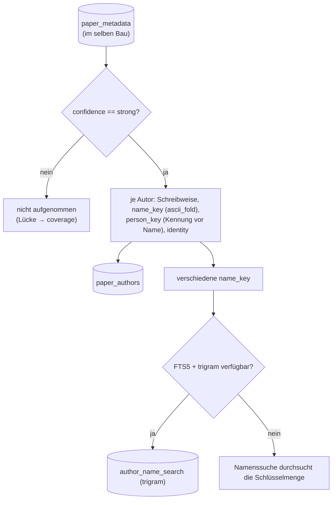
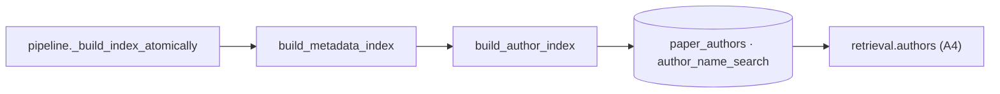

# Modul-Doku: `author_index.py`

| Feld | Wert |
| --- | --- |
| **Modul** | `src/research_graphrag/indexing/author_index.py` |
| **Paket** | `indexing` – Index, Graphen und Metadaten |
| **Phase** | 17 / A3 |
| **Grundlagen** | [ADR 0043](../../../../docs/adr/0043-author-index-and-person-tools.md) · [ADR 0041](../../../../docs/adr/0041-author-identity-and-schema.md) · [ADR 0010](../../../../docs/adr/0010-drop-in-workflow-and-qa-phase6.md) |

---

## 1. Zweck

Macht Personen zu einer eigenen Sicht des Index. Beim Index-Bau entsteht aus den aufgelösten
Zitierdaten die Tabelle `paper_authors`: je Paper und Autorposition eine Zeile mit Schreibweise der
Quelle, Namensschlüssel, Kennungen, Personenschlüssel und Dokumentart. Dazu kommt eine kleine
Trigramm-Suche über die Namen. Die Personen-Werkzeuge aus A4 lesen ausschließlich diese Sicht.

## 2. Öffentliche Schnittstelle

| Symbol | Art | Aufgabe |
| --- | --- | --- |
| `build_author_index` | Funktion | Tabelle und Namenssuche bauen (nach `build_metadata_index`, im atomaren Fenster) |
| `author_rows` | Funktion | Zeilen aus den aufgelösten Metadaten ableiten (nur `strong`, deterministisch) |
| `skipped_mentions` | Funktion | Zahl der Nennungen ohne Personenschlüssel (keine Kennung, kein verwertbarer Name); erscheint im Bau-Bericht als `n_skipped` und im Ingest als „ohne Personenschlüssel“ |
| `load_author_rows` | Funktion | Zeilen laden – alle oder gefiltert nach Personen, Papern bzw. Namensschlüsseln |
| `search_name_keys` | Funktion | Namensschlüssel zu einer Namensanfrage (Trigramm, Rückfall: Durchsuchen) |
| `author_coverage` | Funktion | `(Volltexte mit Autoren im Index, Volltexte gesamt)` – die ausgewiesene Lücke |
| `has_author_index` | Funktion | trägt der Index die Personenebene? |
| `AuthorRow` / `AuthorBuildReport` | Dataclasses | Zeile, Zählwerte |
| `AUTHOR_SCHEMA_VERSION` / `NAME_SEARCH_FTS` / `NAME_SEARCH_SCAN` | Konstanten | Teilschema-Version, Art der Namenssuche |

## 3. Ablauf

### Die Namenssuche

Die Anfrage wird wie ein Name normalisiert: „Asai, Akari“, „akari asai“ und „Asai Akari“ ergeben
dieselben Suchwörter. Jedes Suchwort muss vorkommen, und zwar je nach Länge unterschiedlich:

| Suchwort | Regel | Beispiel |
| --- | --- | --- |
| ≥ 3 Zeichen | Teilstring (Trigramm-Suche) | „wang“ findet „y wang“ und „yi wang“ |
| < 3 Zeichen | Wortanfang (der Tokenizer findet so kurze Wörter nicht) | „Y. Wang“ findet „y wang“ und „yi wang“; „Li“ findet „wei li“ |

Die Suchwörter werden über [`fts`](fts.md) als String-Literale gesetzt. FTS5-Operatoren in einem
Namen bleiben damit wirkungslos, und ein Syntaxfehler endet als `invalid_input`.

### Warum nur `strong`

Ein schwach belegter Datensatz kann ein fremdes Paper beschreiben (Befund 3). Seine Autoren
würden sonst einer Person Paper zuschreiben, die sie nie geschrieben hat. Bis A1 einen Datensatz
geklärt hat, fehlen seine Autoren in der Personenebene. Diese Lücke weist `author_coverage` aus.

## 4. Zusammenspiel

## 5. Fehler und Grenzfälle

| Situation | Verhalten |
| --- | --- |
| Index fehlt | `not_found` |
| Index ohne Personenebene (vor Phase 17) | leere Ergebnisse, `coverage = (0, n)` – kein Fehler |
| Anfrage ohne verwertbares Zeichen | `invalid_input` |
| FTS5-Operatoren in der Anfrage | entschärft |
| FTS5 oder `trigram` nicht verfügbar | Namenssuche über die Schlüsselmenge; `meta.author_name_search = scan` |
| Name ohne lateinische Buchstaben oder Ziffern, **mit** Kennung | Zeile mit leerem Namensschlüssel: über den Personenschlüssel erreichbar, nicht über die Namenssuche |
| Name ohne lateinische Buchstaben oder Ziffern, **ohne** Kennung | keine Zeile (die Position bleibt frei), gezählt in `n_skipped` |
| Name in zerlegter Unicode-Form (NFD) | gleicher Schlüssel wie die zusammengesetzte Form (`ascii_fold` setzt vorab nach NFC zusammen) |

## 6. Determinismus

Zeilen und Namensschlüssel werden sortiert geschrieben. Zwei Bauten aus demselben Stand ergeben
eine identische Tabelle.

## 7. Grenzen

- **Keine Gruppenbildung**, keine Zusammenführung reiner Namensidentitäten.
- Die Namenssuche ist **Teilstring-** und **Präfix**-basiert, nicht tippfehlertolerant. Umlaute
  werden transliteriert: „Müller“ und „Mueller“ finden dieselbe Person, „Muller“ nicht.
- Namen ohne lateinische Buchstaben (etwa nur in chinesischer oder kyrillischer Schrift) sind
  nicht über die Namenssuche auffindbar. Mit Kennung bleiben sie über den Personenschlüssel
  erreichbar; ohne Kennung fehlen sie auf der Personenebene, und der Ingest zählt sie.
- Positionen jenseits `MAX_AUTHORS` (25) fehlen, solange A2, Punkt 5, die Kürzung beibehält.
