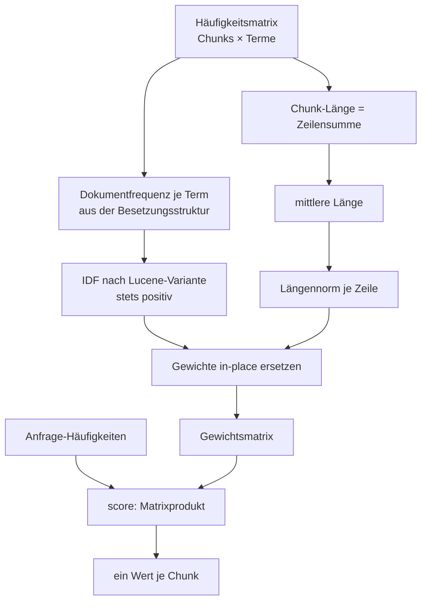
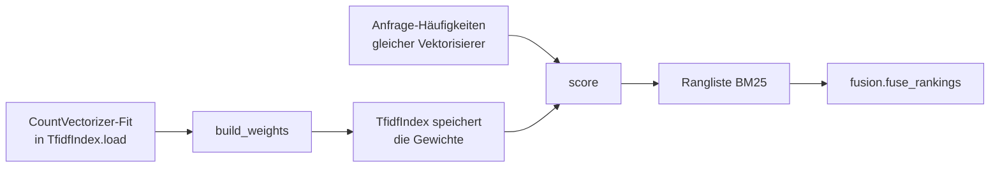

# Modul-Doku: `bm25.py`

| Feld | Wert |
| --- | --- |
| **Modul** | `src/research_graphrag/indexing/bm25.py` |
| **Paket** | `indexing` – Canonical JSON zum Offline-Hybrid-Index |
| **Phase** | 7 / A4, 16 / F3 (in place, bitgleich) |
| **Grundlagen** | [ADR 0014](../../../../docs/adr/0014-hybrid-retrieval-bm25-tfidf-phase7.md), [ADR 0044](../../../../docs/adr/0044-response-latency-bit-identical-scoring-and-fts5-phase16.md) |

---

## 1. Zweck

Eine **handimplementierte BM25-Wertung** über den Termhäufigkeiten, die der Index ohnehin
erzeugt. Sie ergänzt den TF-IDF-Kosinus um zwei Eigenschaften, die dieser nicht besitzt:

- **Term-Sättigung** – der zwanzigste Treffer eines Wortes trägt kaum mehr bei als der zweite.
  Entscheidend ist, *dass* ein Term vorkommt, nicht wie oft.
- **Längennormalisierung** – ein langer Chunk gewinnt nicht allein deshalb, weil er mehr Text
  enthält.

Handimplementiert, weil in der Offline-Umgebung keine BM25-Bibliothek beschaffbar ist – und weil
das Verfahren über einer bereits vorhandenen Häufigkeitsmatrix wenige Zeilen umfasst.

## 2. Öffentliche Schnittstelle

| Symbol | Art | Aufgabe |
| --- | --- | --- |
| `build_weights` | Funktion | Häufigkeitsmatrix → BM25-Gewichtsmatrix gleicher Besetzung; mit `copy=False` wird eine `float64`-CSR-Matrix in place umgerechnet (Phase 16 / F3) |
| `score` | Funktion | Anfrage-Häufigkeiten → ein Wert je Chunk |
| `K1` | Konstante | Sättigungsparameter |
| `B` | Konstante | Stärke der Längennormalisierung |

## 3. Ablauf

### Die Formel

Für einen Term $t$ in einem Chunk $d$:

$$
w_{d,t} = \mathrm{idf}_t \cdot \frac{f_{d,t}\,(k_1 + 1)}{f_{d,t} + k_1\left(1 - b + b\,\frac{|d|}{\overline{|d|}}\right)},
\qquad
\mathrm{idf}_t = \ln\left(1 + \frac{N - n_t + 0.5}{n_t + 0.5}\right)
$$

Der Wert eines Chunks für eine Anfrage ist die **Summe** der Gewichte aller Anfrage-Terme.

### Warum die Lucene-IDF-Variante

Die klassische BM25-IDF wird für Terme, die in mehr als der Hälfte aller Dokumente vorkommen,
**negativ**. Ein solcher Term würde einen Chunk aktiv abwerten und Rang-Inversionen erzeugen. Die
hier verwendete Variante ist stets positiv: Ein häufiger Term trägt wenig bei, aber nie negativ.

### Warum die Gewichte kein `scipy` brauchen

Die Umsetzung arbeitet direkt auf der internen Struktur der dünnbesetzten Matrix: Die
Dokumentfrequenz liest sie aus der Besetzung ab, und die Gewichte ersetzen die Werte an Ort und
Stelle. Gestalt und Besetzung bleiben identisch – gerechnet wird nur dort, wo ohnehin ein Wert
steht.

Voraussetzung ist die übliche Form ohne explizit gespeicherte Nullen, wie sie der
`CountVectorizer` liefert.

### Der Sonderfall leeres Vokabular

Ist die mittlere Chunk-Länge null, würde die Längennormalisierung durch null teilen. Der Fallback
auf `1.0` neutralisiert sie stattdessen – die Funktion bleibt total.

## 4. Zusammenspiel

Das Modul kennt weder Datenbank noch Retrieval; es rechnet ausschließlich auf Matrizen. Dadurch
ist es isoliert prüfbar – etwa gegen von Hand nachgerechnete Werte.

**Nichts wird persistiert.** Die Gewichte entstehen bei jedem Laden neu, weshalb die Einführung
von BM25 **keinen** Re-Ingest erforderte: Das Index-Schema blieb unverändert.

## 5. Fehler und Grenzfälle

Keine `DomainError` – beide Funktionen sind reine Berechnungen. Die Validierung von Anfrage und
`k` liegt beim Aufrufer.

Eine Anfrage mit ausschließlich unbekannten Termen ergibt einen Nullvektor; die aufrufende Suche
filtert nicht-positive Werte heraus.

## 6. Determinismus

Reine Arithmetik ohne Zufall und ohne Zeitbezug. Die Parameter sind **feste Konstanten** und
bewusst nicht konfigurierbar: Ein Tuning auf ein kleines Fragenset wäre Überanpassung, und ein
Schalter würde Ergebnisse zwischen Läufen unvergleichbar machen.

## 7. Grenzen

- **Keine Anfrage-Sättigung.** Ein in der Anfrage doppelt genanntes Wort zählt doppelt.
- **Keine Feldgewichtung.** Titel oder Abschnittsüberschrift zählen wie Fließtext.
- **Keine Parameter-Anpassung.** `K1` und `B` sind Standardwerte, nicht am Korpus optimiert.
- **Setzt die Besetzungsform voraus.** Eine Matrix mit explizit gespeicherten Nullen ergäbe
  falsche Dokumentfrequenzen.

## Nachtrag Phase 16 / F3: in place, bitgleich

Der Lader braucht die Zählwerte nach der TF-IDF-Rechnung nicht mehr. `build_weights(counts,
copy=False)` rechnet deshalb direkt auf ihnen. Die Operationen und ihre Reihenfolge sind dieselben
wie im früheren Ausdruck `data * (K1 + 1) / (data + norm) * idf`: Multiplikation, Division und
Multiplikation laufen nacheinander, die Addition im Nenner ist exakt kommutativ. Es entstehen nur
keine Zwischen-Arrays von Matrixgröße mehr. Die Dokumentfrequenz kommt jetzt per `bincount` statt
`getnnz(axis=0)`; das ist dieselbe Zählung. Ein Test vergleicht beide Varianten bitgenau
([ADR 0044](../../../../docs/adr/0044-response-latency-bit-identical-scoring-and-fts5-phase16.md)).
