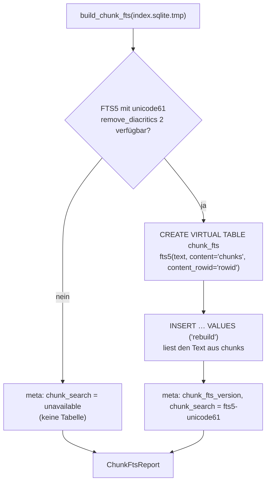
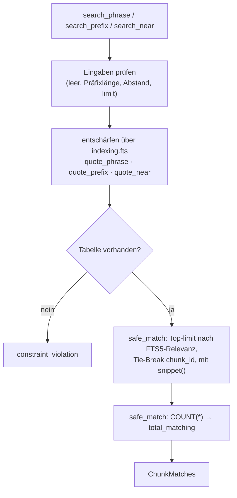
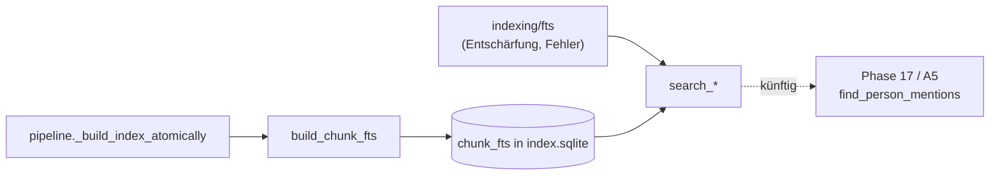

# Modul-Doku: `chunk_fts.py`

| Feld | Wert |
| --- | --- |
| **Modul** | `src/research_graphrag/indexing/chunk_fts.py` |
| **Paket** | `indexing` – Index, Graphen und Metadaten |
| **Phase** | 16 / F2 (eingeführt) |
| **Grundlagen** | [ADR 0044](../../../../docs/adr/0044-response-latency-bit-identical-scoring-and-fts5-phase16.md), [ADR 0043](../../../../docs/adr/0043-author-index-and-person-tools.md) (gemeinsame Entschärfung), [ADR 0037](../../../../docs/adr/0037-mcp-tool-response-size-ceiling.md) (Obergrenze) |

---

## 1. Zweck

Ein FTS5-Volltextindex über den Chunk-Text – als **Infrastruktur**, nicht als Suchmodus. Er
beantwortet drei Fragen, die die lexikalische Wertung nicht beantworten kann:

- Steht eine **Wortfolge** als Folge im Text („retrieval augmented generation“)?
- Welche Wörter **beginnen** mit einem Präfix („retriev“ → retrieval, retriever)?
- Stehen zwei Begriffe **nahe beieinander** („Patrick“ und „Lewis“, höchstens *n* Wörter)?

Grundlage für Phase 17 / A5 (Personen im Text). Die vier Retrieval-Modi lesen die Tabelle nicht;
ihr Ranking bleibt die Hybrid-Wertung. Eine FTS5-**Vorauswahl** für das Ranking hat Phase 16 / F0
gemessen und verworfen: Sie wäre langsamer als die exakte Wertung und nie bit-identisch.

## 2. Öffentliche Schnittstelle

| Symbol | Art | Aufgabe |
| --- | --- | --- |
| `build_chunk_fts` | Funktion | Legt `chunk_fts` im Index-Bau an und füllt sie; Ergebnis `ChunkFtsReport` |
| `search_phrase` | Funktion | Wortfolge finden |
| `search_prefix` | Funktion | Wortfolge, deren letztes Wort ein Präfix ist (mind. `MIN_PREFIX_CHARS` = 3 Zeichen) |
| `search_near` | Funktion | Alle Begriffe höchstens `distance` Wörter auseinander (`0 … MAX_NEAR_DISTANCE` = 50) |
| `ChunkMatch` | Dataclass | Fundstelle: `chunk_id`, `paper_id`, Seiten-Range, Abschnittstitel, Ausschnitt mit `«…»` |
| `ChunkMatches` | Dataclass | Fundstellen (höchstens `limit`) und `total_matching` |
| `CHUNK_FTS_VERSION`, `CHUNK_FTS_TOKENIZER` | Konstanten | `0.1.0` · `unicode61 remove_diacritics 2` |
| `CHUNK_SEARCH_FTS`, `CHUNK_SEARCH_UNAVAILABLE` | Konstanten | `meta`-Werte von `chunk_search` |

Alle drei Suchfunktionen nehmen optional `paper_ids` (nur in diesen Papern suchen) und `limit`
(Default 20, höchstens `MAX_RESULT_COUNT`).

## 3. Ablauf

### 3.1 Aufbau

**external content** heißt: Der Text liegt nur einmal in der Datei (in `chunks`), die
FTS5-Tabelle hält nur den invertierten Index mit Positionen (`detail=full`, nötig für Phrase und
Nähe). Gemessen am realen Bestand (225.126 Chunks): +16,0 % Indexgröße, +12,1 s bzw. +6,7 %
Ingest-Dauer (Phase 16 / F0.4). Der Bau läuft als letzter Schritt in
`pipeline._build_index_atomically` auf der Temporärdatei – die Tabelle ist damit Teil des
atomaren Swaps, und es gibt keinen zweiten Aktualisierungsweg.

**Eigener Versionsschlüssel.** Die `schema_version` des Index bleibt `0.6.0`: Sie steht im
Fingerprint der Baselines, und die Tabelle verändert kein Ranking. Dasselbe Muster nutzt der
[Autorenindex](author_index.md).

### 3.2 Anfrage

Der Ausschnitt markiert die Fundstelle mit `«` und `»` (16 Wörter Kontext) und fasst Leerraum
zusammen.

## 4. Zusammenspiel

## 5. Fehler und Grenzfälle

| Situation | Verhalten |
| --- | --- |
| leere Phrase, Präfix unter 3 Zeichen, weniger als zwei Nähe-Begriffe | `invalid_input` |
| `limit <= 0` oder `> MAX_RESULT_COUNT`, Abstand außerhalb `0 … 50` | `invalid_input` |
| FTS5-Syntaxfehler trotz Entschärfung | `invalid_input` (nie `sqlite3.OperationalError`) |
| Index ohne Tabelle (vor F2 gebaut, FTS5 fehlte beim Bau) | `constraint_violation` mit Hinweis auf `scripts.ingest` |
| Index-Datei fehlt | `not_found` |
| `paper_ids` leer | keine Fundstelle (kein Fehler) |

## 6. Determinismus

Die Tabelle entsteht aus `chunks` in fester Reihenfolge; die Fundstellen sind nach FTS5-Relevanz
und dann nach `chunk_id` geordnet. Zwei Bauten liefern dieselben Antworten (Test).

## 7. Grenzen

- **Ein Namenstreffer ist keine Identität.** Der Text trägt keine Personenkennung; das weist
  Phase 17 / A5 aus.
- **Gebunden an die `rowid` von `chunks`.** Das trägt, weil der Index nur als Ganzes neu gebaut und
  `chunks` danach nie geändert wird. Wer `chunks` in einer fertigen Datei ändert, muss die Tabelle
  mit `rebuild` neu füllen.
- **Tokenisierung wie `unicode61`:** Bindestriche und Satzzeichen trennen Wörter, Diakritika
  werden entfernt – „Müller“ findet „Muller“ und umgekehrt, `retrieval-augmented` ist die Folge
  `retrieval augmented`.
- Getestet mit SQLite 3.45.1; die genutzten Funktionen (external content, `remove_diacritics 2`,
  `snippet`, `NEAR`) gibt es seit Versionen weit vor 3.38.4, dem `sqlite3` der Offline-Umgebung.
