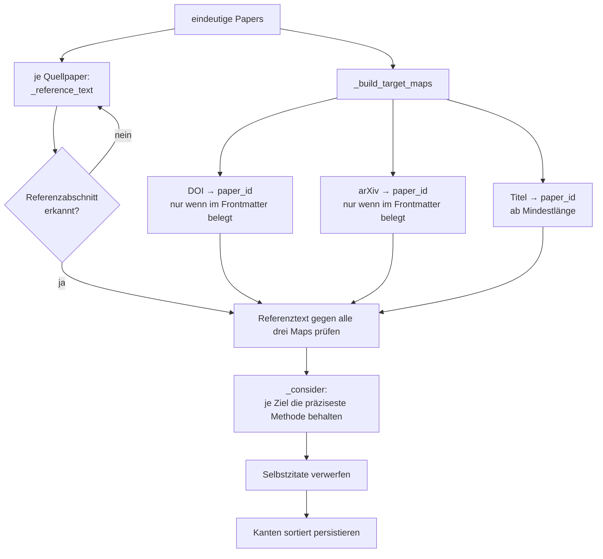
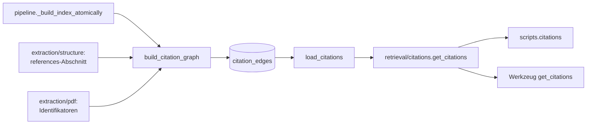

# Modul-Doku: `citation_graph.py`

| Feld | Wert |
| --- | --- |
| **Modul** | `src/research_graphrag/indexing/citation_graph.py` |
| **Paket** | `indexing` – Canonical JSON zum Offline-Hybrid-Index |
| **Phase** | 7 / A2 |
| **Grundlagen** | [ADR 0011](../../../../docs/adr/0011-intra-corpus-citation-graph-phase7.md) |

---

## 1. Zweck

Leitet aus dem **Referenzabschnitt** jedes Papers gerichtete `CITES`-Kanten **innerhalb des
Korpus** ab. Es ist die einzige umgesetzte Kante des Domain-Graphen – und die einzige, die ohne
Sprachmodell deterministisch entsteht.

Die Leitlinie ist durchgängig **Präzision vor Recall**: Eine fehlende Kante ist ärgerlich, eine
falsche Kante zerstört das Vertrauen in die gesamte Sicht. Zitationen auf Paper außerhalb des
Korpus werden bewusst ignoriert – über sie ließe sich ohnehin nichts belegen.

## 2. Öffentliche Schnittstelle

| Symbol | Art | Aufgabe |
| --- | --- | --- |
| `build_citation_graph` | Funktion | Papers → `citation_edges`; persistiert additiv |
| `load_citations` | Funktion | Beide Richtungen der Kanten eines Papers laden |
| `CitationEdge` | Dataclass | Eine Kante: Quelle, Ziel, Match-Kriterium |
| `CitationView` | Dataclass | `cites` und `cited_by` eines Papers |
| `CitationBuildReport` | Dataclass | Zählwerte eines Baulaufs |
| `CITATION_SCHEMA_VERSION` | Konstante | Version des Zitations-Teilschemas |
| `normalize_title` | Funktion | Titel-Normalisierung (auch vom Korpus-Intake genutzt) |
| `title_of` | Funktion | Paper-Titel aus der `source_uri` (Dateiname-Stamm) |
| `front_matter_text` | Funktion | Text der Titelseite(n) ohne Referenzabschnitt (Beleg-Fenster) |
| `title_from_uri` | Funktion | Dieselbe Ableitung direkt aus einer `source_uri` (vom Intake und der Multi-Hop-Messung genutzt; `title_of` delegiert dorthin); entfernt `.pdf` **und** `.refjson` |

> **Sonderfall Referenz-Eintrag:** In `front_matter_text` treten die eigenen Identifikatoren zum
> Fenster hinzu – sie stammen dort aus der Datei selbst, nicht aus einer Heuristik über
> Seitentext. Ohne diese Ergänzung wäre ein Stub als **Ziel** von `CITES`-Kanten unerreichbar,
> also genau der bezifferte Hauptnutzen der Phase 13 verfehlt
> ([ADR 0030](../../../../docs/adr/0030-reference-entries-in-corpus-phase13.md)).
| `MIN_TITLE_CHARS`, `MIN_TITLE_WORDS`, `TITLE_PAGE_PAGES` | Konstanten | Schwellen der Erkennung |

## 3. Ablauf

### Der Frontmatter-Guard

Das ist die wichtigste Präzisionsmaßnahme des Moduls. Ein Identifikator zählt nur dann als
Zielschlüssel, wenn er im **Titelbereich des eigenen Papers** belegt ist und **nicht** in dessen
Referenzabschnitt steht.

Der Grund: Die Extraktion liest DOI und arXiv-ID bevorzugt von der Titelseite, fällt aber auf den
Volltext zurück. Dabei kann eine **zitierte fremde** ID als eigene erfasst werden. Ohne Guard
würde ein solcher Fehlwert massenhaft falsche Kanten erzeugen – der falsche Wert steht in vielen
Referenzlisten und macht das betroffene Paper zum scheinbaren Zitations-Hub.

Seit der Seiten-Range zählt dabei bewusst die **Endseite**: Ein Chunk, der von der Titelseite auf
eine Folgeseite überläuft, gilt nicht mehr als Titelbereich. Das Fenster ist damit mindestens so
streng wie zuvor.

### Die drei Match-Kriterien und ihre Rangfolge

| Kriterium | Grundlage | Präzision |
| --- | --- | --- |
| `doi` | DOI im Referenztext | höchste |
| `arxiv` | arXiv-ID im Referenztext | hoch |
| `title` | normalisierter Titel als Teilzeichenkette | niedrigste |

Findet mehr als ein Kriterium dasselbe Ziel, gewinnt das präziseste – jede Kante trägt genau
**eine** Methode.

### Ein Durchlauf statt vieler Einzelsuchen (Phase 15 / G1)

Bis zur Begradigung prüfte `build_citation_graph` je Quellpaper **jeden** bekannten Korpus-DOI,
jede arXiv-ID und jeden Titel einzeln gegen den Referenztext (`wert in ref_lower`) – O(Paper²).
Seit G1 übernimmt das der interne `_MultiPatternMatcher` (ein Aho-Corasick-Automat): Er wird
**einmal** je Baulauf aus allen bekannten DOI-/arXiv-Mustern (gegen `ref_lower` geprüft) bzw.
Titel-Mustern (gegen `ref_norm` geprüft) errichtet und findet dann je Quellpaper **alle**
Treffer in **einem** linearen Durchlauf über den Referenztext – „Kennungen und Titelkandidaten
einmal je Referenztext gewinnen, danach Nachschlagen statt Suchen". Das Ergebnis ist **identisch**
zur Einzelsuche: Jedes Muster, das irgendwo als Teilstring vorkommt (auch als Teil eines
längeren Treffers oder überlappend mit einem anderen Muster), wird gefunden; welches Ziel und
welche Methode ein Treffer trägt, entscheidet weiterhin ausschließlich `_consider` (Präzedenz
DOI > arXiv > Titel), unabhängig von der Reihenfolge, in der der Matcher die Treffer liefert.
Nachweis: `tests/indexing/test_citation_graph.py` (Aho-Corasick gegen Brute-Force-Suche, u. a.
mit überlappenden und präfixgleichen Mustern) sowie ein byte-genauer Vergleich gegen die
vorherige Fassung auf dem realen Korpus (606 Paper, alle Tabellen identisch).

### Der Titel und seine Normalisierung

Der Titel wird aus dem **Dateinamen** der Quell-URI abgeleitet (URL-dekodiert, ohne Endung); ein
zuverlässiger Titel aus dem PDF-Text steht nicht zur Verfügung. Damit ein Titelvergleich gelingt,
werden beide Seiten normalisiert – nur alphanumerische Zeichen, Bindestriche zu Leerzeichen.
Ohne diese Normalisierung scheitert der Vergleich an Kleinigkeiten: Der Dateiname trennt mit
` - `, der Referenztext mit `: `.

Die Mindestlängen für Zeichen und Wörter verhindern, dass ein generischer Kurztitel wahllos
trifft.

### Warum der Referenzabschnitt so wichtig ist

Die gesamte Erkennung hängt daran, dass die Bibliografie als Abschnitt erkannt wurde – und dass
sie **vollständig** ist. Als in der Chunking-Verfeinerung Pseudo-Überschriften innerhalb der
Bibliografie verschwanden, stieg die Kantenzahl deutlich, ohne dass an diesem Modul etwas
geändert wurde: Der Referenzabschnitt war zuvor schlicht abgeschnitten worden.

## 4. Zusammenspiel

Die Schichtung folgt derselben Regel wie beim Ähnlichkeitsgraphen: Das Index-Modul liefert
**IDs**, die Provenienz kommt aus der Retrieval-Schicht.

## 5. Fehler und Grenzfälle

| Situation | Fehlercode |
| --- | --- |
| leere `paper_id` beim Laden | `invalid_input` (vor dem Index geprüft) |
| Index-Datei fehlt | `not_found` |
| Paper nicht im Index | `not_found` |
| `citation_edges` fehlt (nie gebaut) | `constraint_violation` |
| Paper ohne erkannten Referenzabschnitt | kein Fehler – es entstehen einfach keine Kanten |

Der Bau wirft für sich genommen keinen Fehler: Ein Korpus ohne jede Übereinstimmung ergibt eine
leere Kantenmenge.

## 6. Determinismus

- Paper werden dedupliziert und nach ID sortiert verarbeitet.
- Die Ziel-Maps übernehmen bei Kollision den **ersten** Eintrag in dieser stabilen Reihenfolge.
- Kanten werden sortiert geschrieben.
- Das Ergebnis eines Neuaufbaus ist byte-identisch.

## 7. Grenzen

- **Nur innerhalb des Korpus.** Zitationen nach außen werden nicht erfasst.
- **Kein Referenz-Parsing.** Es gibt keine strukturierten Referenz-Einträge, nur
  Teilzeichenketten-Treffer im Referenztext.
- **Titel aus dem Dateinamen.** Wird eine Datei unpassend benannt, entfällt der Titel-Zweig für
  dieses Paper.
- **Keine Belegspalte.** Die Tabelle speichert nur Quelle, Ziel und Methode – der konkrete
  Fundort muss für eine Nachprüfung rekonstruiert werden.
- **Ohne erkannten Referenzabschnitt keine Kanten.** Die Erkennungsqualität von
  [structure](../../extraction/doc/structure.md) begrenzt dieses Modul unmittelbar.
