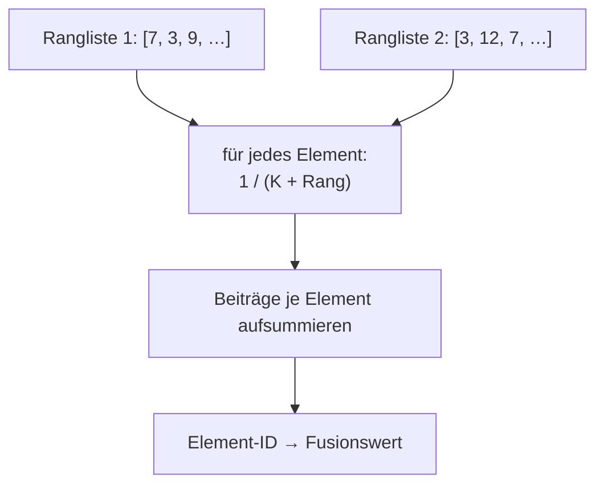
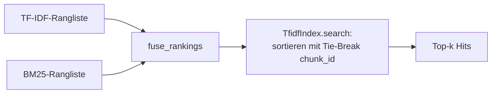

# Modul-Doku: `fusion.py`

| Feld | Wert |
| --- | --- |
| **Modul** | `src/research_graphrag/indexing/fusion.py` |
| **Paket** | `indexing` – Canonical JSON zum Offline-Hybrid-Index |
| **Phase** | 7 / A4 |
| **Grundlagen** | [ADR 0014](../../../../docs/adr/0014-hybrid-retrieval-bm25-tfidf-phase7.md) |

---

## 1. Zweck

Verbindet mehrere unabhängige Ranglisten zu **einer** Bewertung – ausschließlich über die
**Ränge**, nie über die rohen Scores. Das ist der Kniff, der die Hybrid-Wertung überhaupt
möglich macht.

## 2. Öffentliche Schnittstelle

| Symbol | Art | Aufgabe |
| --- | --- | --- |
| `fuse_rankings` | Funktion | Ranglisten → Abbildung Element-ID auf Fusionswert |
| `RRF_K` | Konstante | Dämpfungskonstante der Fusion |

## 3. Ablauf

Für ein Element $d$ gilt

$$\mathrm{RRF}(d) = \sum_{r \in R} \frac{1}{K + \mathrm{rank}_r(d)}$$

mit Rängen ab 1. Ein Element, das nur in **einer** Rangliste auftaucht, bekommt genau einen
Summanden – es wird also nicht bestraft, aber auch nicht doppelt belohnt.

### Warum Ränge und keine Scores

BM25-Werte und Kosinus-Ähnlichkeiten liegen auf verschiedenen, nicht vergleichbaren Skalen. Jede
Addition oder Normalisierung würde eine Umrechnung erfordern, deren Ergebnis von der
Trefferverteilung der jeweiligen Anfrage abhinge – zwei Anfragen wären damit unterschiedlich
gewichtet, ohne dass es jemand sähe.

Ränge sind skaleninvariant. Die Fusion braucht kein Wissen darüber, wie die Ranglisten entstanden
sind.

### Was die Konstante bewirkt

`K` dämpft den Einfluss der vorderen Plätze: Je größer der Wert, desto flacher der Abfall über
die Ränge. Kleine Werte lassen die jeweils ersten Plätze dominieren. Der Standardwert ist als
**feste Konstante** gesetzt – ohne Umgebungsvariable und ohne Kommandozeilenschalter, damit
Ergebnisse zwischen Läufen vergleichbar bleiben.

### Was das Modul bewusst nicht tut

Es sortiert nicht. Die zurückgegebene Abbildung ist eine Bewertung, keine Rangfolge –
Sortierung und Tie-Break bleiben beim Aufrufer, weil nur dieser die stabile Schlüsselordnung
(die Chunk-ID) kennt.

## 4. Zusammenspiel

Einziger Aufrufer ist die Suche in [tfidf_index](tfidf_index.md), und zwar nur in der
Hybrid-Wertung. Das Modul hat keine Abhängigkeiten außerhalb der Standardbibliothek.

## 5. Fehler und Grenzfälle

Keine `DomainError`. Leere Ranglisten sind zulässig; sind alle leer, ist das Ergebnis leer.
Doppelte Elemente innerhalb **einer** Rangliste sind nicht vorgesehen – die Aufrufer erzeugen
duplikatfreie Listen.

## 6. Determinismus

Reine Funktion ohne Zufall, Zeitbezug oder Zustand. Die Iterationsreihenfolge beeinflusst das
Ergebnis nicht, weil nur summiert wird.

## 7. Grenzen

- **Keine Gewichtung der Quellen.** Beide Ranglisten zählen gleich; eine gewichtete Variante
  wurde bewusst nicht eingeführt, weil sie am kleinen Fragenset überangepasst würde.
- **Nur Rangposition zählt.** Ein knapper und ein deutlicher Vorsprung sind ununterscheidbar.
- **Der Fusionswert ist keine Ähnlichkeit.** Er ist nur innerhalb einer Antwort vergleichbar.
