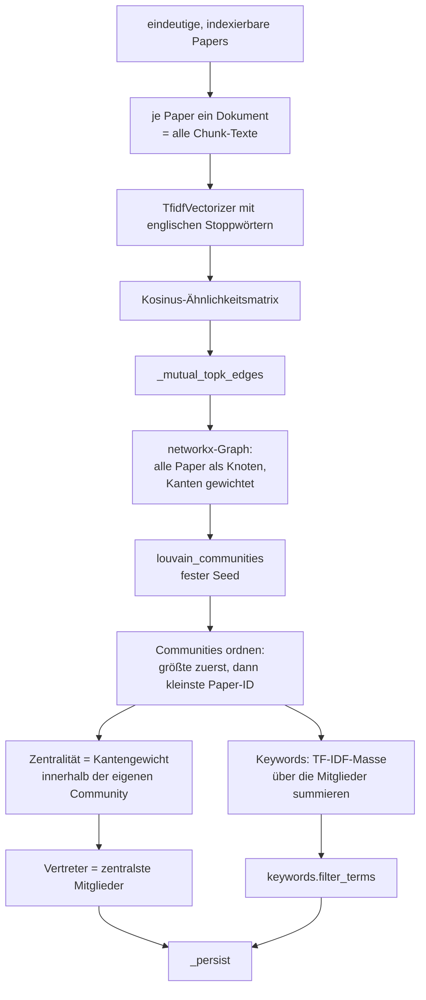
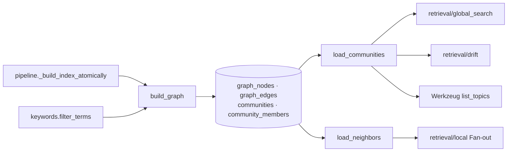

# Modul-Doku: `graph_index.py`

| Feld | Wert |
| --- | --- |
| **Modul** | `src/research_graphrag/indexing/graph_index.py` |
| **Paket** | `indexing` – Canonical JSON zum Offline-Hybrid-Index |
| **Phase** | 3 (eingeführt), 7 / A5 (Keyword-Nachfilter) |
| **Grundlagen** | [ADR 0007](../../../../docs/adr/0007-graphrag-index-phase3-option-b.md), [ADR 0015](../../../../docs/adr/0015-noise-reduction-keywords-and-sections-phase7.md) |

---

## 1. Zweck

Baut die **Themen-Ebene** des Systems: einen Ähnlichkeitsgraphen über den Papern und daraus
Communities mit Keywords, Zusammenfassung und Vertretern. Das ist der Offline-Ersatz für die
Community-Struktur von GraphRAG – ohne Sprachmodell, ohne Entitätsextraktion.

Die Kernidee: Ein Paper wird als **ein** Dokument aufgefasst (alle seine Chunks zusammengefügt),
Ähnlichkeit ist der Kosinus zwischen diesen Dokumenten, und Themen sind die Gruppen, die eine
Community-Detection darin findet.

## 2. Öffentliche Schnittstelle

| Symbol | Art | Aufgabe |
| --- | --- | --- |
| `build_graph` | Funktion | Papers → Knoten, Kanten, Communities; persistiert additiv |
| `load_communities` | Funktion | Communities aus dem Index laden |
| `load_neighbors` | Funktion | Nachbarpaper eines Papers über beide Kantenrichtungen |
| `CommunityView` | Dataclass | Community mit Keywords, Summary, Mitgliedern, Vertretern und `to_dict()` |
| `GraphBuildReport` | Dataclass | Zählwerte eines Baulaufs |
| `GRAPH_SCHEMA_VERSION` | Konstante | Version des Graph-Teilschemas |
| `DEFAULT_K`, `DEFAULT_MIN_SIMILARITY`, `DEFAULT_SEED`, `DEFAULT_RESOLUTION`, `TOP_KEYWORDS`, `TOP_REPRESENTATIVES` | Konstanten | Parameter des Aufbaus |

## 3. Ablauf

### Die *mutual top-k*-Kanten

Eine Kante entsteht nur, wenn **beide** Paper einander unter ihren Top-Nachbarn führen und die
Ähnlichkeit über der Schwelle liegt. Diese Wechselseitigkeit hält den Graphen dünn und verhindert
Hubs: Ein thematisch breites Übersichtspaper würde sonst mit fast allen anderen verbunden.

Die Konsequenz ist wichtig für die Wartung: Die Kantenbildung ist eine **Schwellenoperation**.
Schon eine minimale Verschiebung der Ähnlichkeiten kann Nachbarschaften kippen – deshalb wurde
der Keyword-Filter bewusst als Nachfilter gebaut und **nicht** in den Vektorraum gelegt.

### Die Community-Ordnung

Louvain liefert Mengen ohne Reihenfolge. Damit die IDs zwischen Läufen stabil bleiben, werden die
Communities nach **Größe absteigend** und bei Gleichstand nach der **kleinsten Paper-ID**
sortiert und dann fortlaufend numeriert. Zusammen mit dem festen Seed macht das den Aufbau
reproduzierbar.

Paper ohne Kante bleiben als Knoten erhalten und bilden eine eigene Ein-Element-Community – jedes
Paper gehört damit zu genau einer Community.

### Zentralität, Vertreter und Zusammenfassung

Die Zentralität ist die Summe der Kantengewichte **innerhalb der eigenen Community**; Kanten nach
außen zählen nicht. Die zentralsten Mitglieder werden zu Vertretern, und die Zusammenfassung ist
der **extraktive** Leitausschnitt des ersten Vertreters – ein echter Textausschnitt, kein
generierter Text. Das ist der Preis der Offline-Variante und zugleich ihre Ehrlichkeit: Es gibt
keine Zusammenfassung, die etwas behauptet, das nicht wörtlich im Korpus steht.

### Die Keywords

Keywords sind die Terme mit der größten aufsummierten TF-IDF-Masse über die Mitglieder. Genau
darin lag ein Rauschproblem: Bibliografie-Vokabular kommt in fast jedem Paper vor, hat dadurch
eine sehr niedrige Gewichtung – aber in der **Summe** über eine ganze Community trotzdem eine
hohe Masse. Der Filter greift **vor** dem Anschnitt, sodass frei werdende Plätze mit echten
Themenbegriffen aufgefüllt werden.

## 4. Zusammenspiel

Der Bau schreibt **additiv**: Die Graph-Tabellen werden verworfen und neu angelegt, `papers` und
`chunks` bleiben unangetastet. Er läuft im selben atomaren Fenster wie Index und Zitationsgraph.

## 5. Fehler und Grenzfälle

| Situation | Fehlercode |
| --- | --- |
| keine indexierbaren Paper | `invalid_input` |
| Index-Datei fehlt | `not_found` |
| Graph-Tabellen fehlen (Graph nie gebaut) | `constraint_violation` |
| Paper ohne jede Kante | kein Fehler – Ein-Element-Community |

`load_communities` prüft die Existenz der Tabelle explizit, damit ein Index ohne Graph eine
verständliche Meldung liefert statt eines Datenbankfehlers.

## 6. Determinismus

- Fester Seed für Louvain.
- Tie-Breaks über die Paper-ID an jeder Sortierstelle.
- Community-IDs aus einer festen Ordnung statt aus der Fundreihenfolge.
- Kanten normalisiert als `source < target`, sortiert geschrieben.

Ein Neuaufbau aus denselben Canonical JSONs liefert byte-identische Kanten, Communities und
Mitgliedschaften.

## 7. Grenzen

- **Ähnlichkeit ist keine Zitation.** Zwei Paper können verbunden sein, ohne voneinander zu
  wissen; dafür gibt es [citation_graph](citation_graph.md).
- **Keine Entitäten und keine Beziehungstypen.** Vom Ziel-Datenmodell ist nur die Themenebene
  umgesetzt ([ADR 0007](../../../../docs/adr/0007-graphrag-index-phase3-option-b.md)).
- **Extraktive Zusammenfassungen.** Kein Community-Report im GraphRAG-Sinn – dafür bräuchte es
  ein Modell zur Indexzeit.
- **Louvain statt Leiden.** Leiden wäre stabiler, ist offline aber nicht beschaffbar.
- **Feste Parameter.** Nachbarzahl, Schwelle und Auflösung sind Standardwerte; sie sind als
  Argumente überschreibbar, aber nicht am Korpus optimiert.
