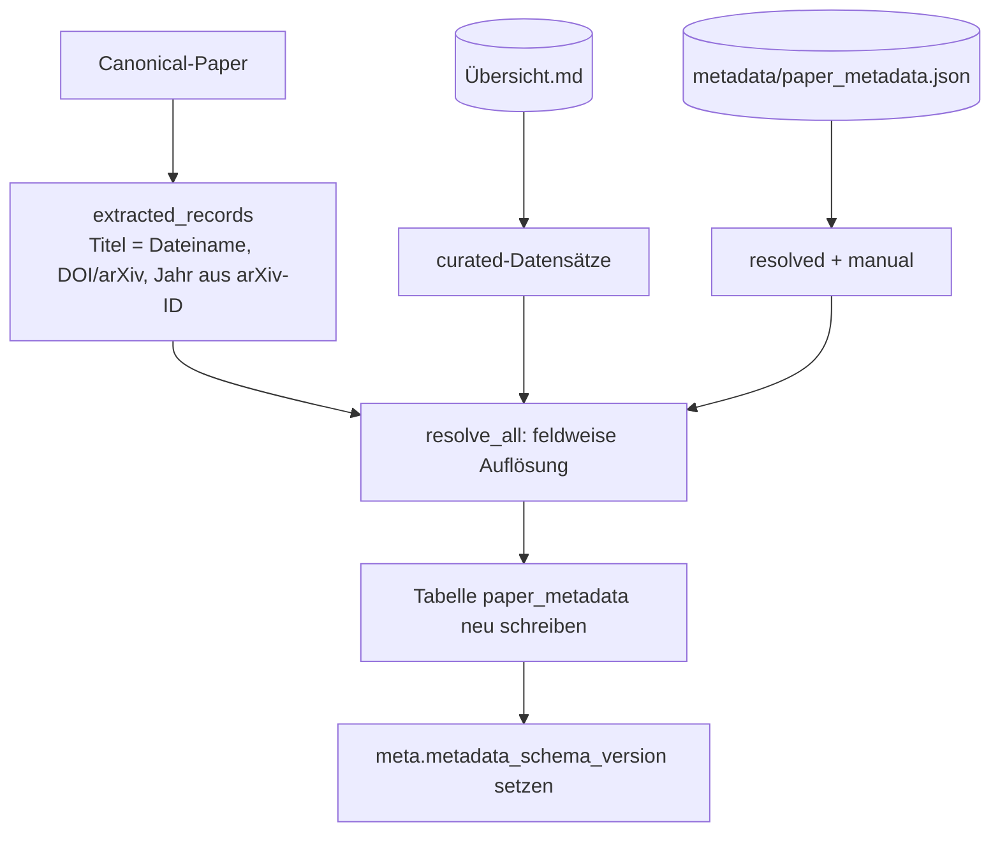
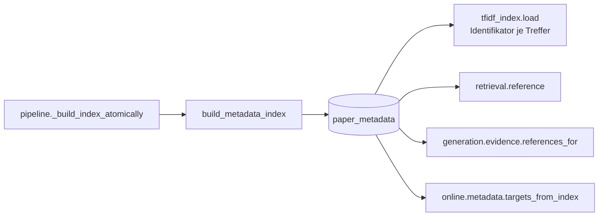

# Modul-Doku: `metadata_index.py`

| Feld | Wert |
| --- | --- |
| **Modul** | `src/research_graphrag/indexing/metadata_index.py` |
| **Paket** | `indexing` – Index, Graphen und Metadaten |
| **Phase** | 12 / K1 |
| **Grundlagen** | [ADR 0025](../../../../docs/adr/0025-citable-paper-metadata.md) · [ADR 0010](../../../../docs/adr/0010-drop-in-workflow-and-qa-phase6.md) |

---

## 1. Zweck

Führt die vier Herkünfte der Zitationsdaten zusammen und legt das Ergebnis **additiv** als
Tabelle `paper_metadata` im Index ab. Die Kernidee: Das Retrieval liest zur Abfragezeit **nur**
den Index – nie Markdown, nie JSON.

## 2. Öffentliche Schnittstelle

| Symbol | Art | Aufgabe |
| --- | --- | --- |
| `build_metadata_index` | Funktion | Bau und Persistenz der Tabelle |
| `collect_records` | Funktion | Datensätze aller Herkünfte einsammeln |
| `extracted_records` | Funktion | Canonical-Paper → Datensätze der Herkunft `extracted` |
| `load_paper_metadata` | Funktion | Tabelle → `PaperMetadata` je Paper |
| `metadata_for` | Funktion | Datensatz eines einzelnen Papers |
| `year_from_arxiv` | Funktion | Preprint-Jahr aus einer arXiv-ID |
| `MetadataBuildReport` | Dataclass | Zählwerte des Baus |
| `METADATA_SCHEMA_VERSION` | Konstante | Version des Teilschemas |

## 3. Ablauf

### Die Konfidenz der Extraktion

`extracted_records` bewertet jeden Identifikator mit **demselben Guard** wie der
Zitationsgraph ([citation_graph](citation_graph.md)):

| Lage | Konfidenz | Beleg im Datensatz |
| --- | --- | --- |
| kein Identifikator im PDF | `strong` | der Dateiname-Titel ist eine sichere Tatsache |
| Identifikator steht auf der eigenen Titelseite und ist im Korpus eindeutig | `strong` | „auf der Titelseite belegt" |
| Identifikator nur im Volltext gefunden | `weak` | nennt den betroffenen Wert |
| Identifikator im Korpus mehrfach vergeben | `weak` | nennt den betroffenen Wert |

Der Datensatz wird **nie verworfen** – ein zweifelhafter Identifikator ist besser als keiner,
solange der Zweifel sichtbar bleibt.

### Ein Datensatz, eine Konfidenz

Bewusst wird **nicht** je Feld eine eigene Konfidenz geführt, obwohl der Titel (Dateiname) auch
dann sicher ist, wenn der Identifikator zweifelhaft ist. Die Vereinfachung folgt der Leitlinie
aus [model](../../bibliography/doc/model.md): so verlässlich wie der schwächste Bestandteil.

### Das Jahr aus der arXiv-ID

`year_from_arxiv` liest das seit 2007 gültige Format `JJMM.NNNNN` und prüft den Monat. Das ist
das **einzige** Feld, das lokal ohne externe Quelle über den Identifikator hinaus gewonnen wird –
und es ist eine Näherung: Es nennt den Preprint-Jahrgang, nicht den der begutachteten Fassung.
Die Online-Auflösung überschreibt es.

### Eigene Teilschema-Version

Die Tabelle ist additiv und trägt `metadata_schema_version` in `meta` – wie
`graph_schema_version` und `citation_schema_version`. Das Kern-Schema aus
[tfidf_index](tfidf_index.md) bleibt dadurch **unverändert**, und ein älterer Index bleibt
lesbar (die Werkzeuge liefern dann keine Zitationsdaten).

## 4. Zusammenspiel

Der Bau läuft im **selben atomaren Fenster** wie Index, Ähnlichkeits- und Zitationsgraph: erst
vollständig in die Temporärdatei, dann ein `os.replace`.

## 5. Fehler und Grenzfälle

| Situation | Fehlercode |
| --- | --- |
| Index-Datei fehlt (Bau oder Lesen) | `not_found` |
| Tabelle fehlt (Index vor Phase 12) | kein Fehler – leeres Ergebnis |
| Paper ohne jeden Datensatz | kein Fehler – leerer `PaperMetadata` |
| defekte oder versionsfremde `metadata/paper_metadata.json` | `parse_error` / `constraint_violation` (aus dem Store) |

## 6. Determinismus

Paper werden sortiert verarbeitet, JSON-Spalten mit sortierten Schlüsseln geschrieben. Zwei Bauten
aus derselben Eingabe erzeugen dieselbe Tabelle – auch bei umgekehrter Paper-Reihenfolge.

## 7. Grenzen

- **Voller Neubau.** Die Tabelle wird bei jedem Lauf verworfen und neu geschrieben; das ist
  billig und schließt Waisen aus.
- **Kein Netz.** Autoren und Venue entstehen hier nicht – dafür ist
  [online/metadata](../../online/doc/metadata.md) zuständig.
- **Keine Titel-Verifikation.** Ein kuratierter Titel wird übernommen, wie er dasteht.
