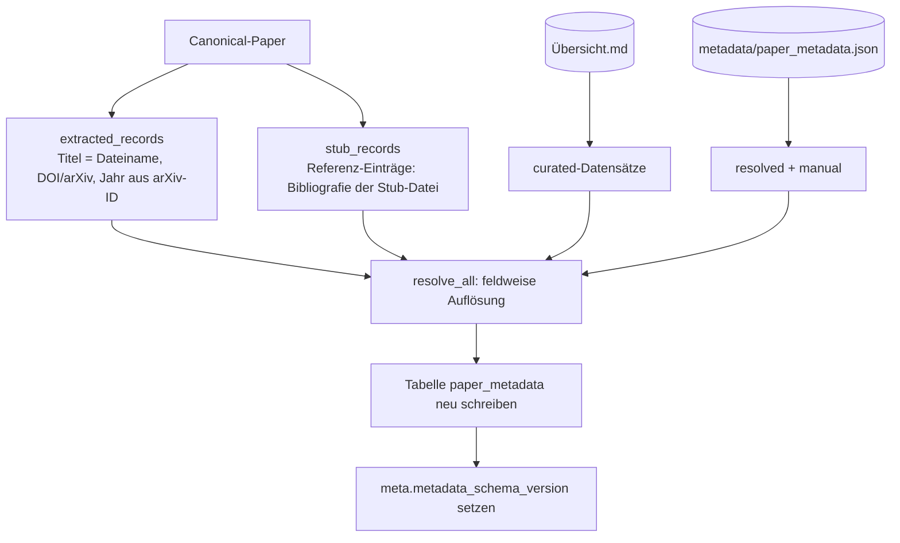
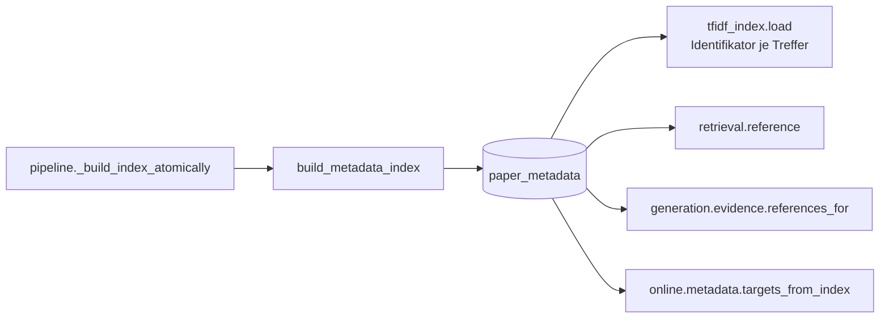

# Modul-Doku: `metadata_index.py`

| Feld | Wert |
| --- | --- |
| **Modul** | `src/research_graphrag/indexing/metadata_index.py` |
| **Paket** | `indexing` – Index, Graphen und Metadaten |
| **Phase** | 12 / K1, erweitert in 17 / A1 + A2 |
| **Grundlagen** | [ADR 0025](../../../../docs/adr/0025-citable-paper-metadata.md) · [ADR 0010](../../../../docs/adr/0010-drop-in-workflow-and-qa-phase6.md) · [ADR 0041](../../../../docs/adr/0041-author-identity-and-schema.md) · [ADR 0042](../../../../docs/adr/0042-title-page-evidence-and-rejections.md) |

---

## 1. Zweck

Führt die Herkünfte der Zitationsdaten zusammen und legt das Ergebnis **additiv** als
Tabelle `paper_metadata` im Index ab. Die Kernidee: Das Retrieval liest zur Abfragezeit **nur**
den Index – nie Markdown, nie JSON.

## 2. Öffentliche Schnittstelle

| Symbol | Art | Aufgabe |
| --- | --- | --- |
| `build_metadata_index` | Funktion | Bau und Persistenz der Tabelle |
| `collect_records` | Funktion | Datensätze aller Herkünfte einsammeln |
| `extracted_records` | Funktion | Canonical-Paper → Datensätze der Herkunft `extracted` |
| `stub_records` | Funktion | Referenz-Einträge → Datensätze der Herkunft `resolved` aus der Stub-Datei (Phase 17 / A2) |
| `load_paper_metadata` | Funktion | Tabelle → `PaperMetadata` je Paper |
| `metadata_for` | Funktion | Datensatz eines einzelnen Papers |
| `year_from_arxiv` | Funktion | Preprint-Jahr aus einer arXiv-ID |
| `MetadataBuildReport` | Dataclass | Zählwerte des Baus, seit Phase 17 inkl. `author_coverage` (Volltexte mit Autoren aus `strong`-Datensätzen) |
| `METADATA_SCHEMA_VERSION` | Konstante | Version des Teilschemas |

## 3. Ablauf

### Die Konfidenz der Extraktion

`extracted_records` bewertet jeden Identifikator mit **demselben Guard** wie der
Zitationsgraph ([citation_graph](citation_graph.md)):

| Lage | Konfidenz | Beleg im Datensatz |
| --- | --- | --- |
| kein Identifikator im PDF | `strong` | der Dateiname-Titel ist eine sichere Tatsache |
| Identifikator steht auf der eigenen Titelseite und ist im Korpus eindeutig | `strong` | „auf der Titelseite belegt" |
| Identifikator nur im Volltext gefunden | `weak` | nennt den betroffenen Wert |
| Identifikator im Korpus mehrfach vergeben | `weak` | nennt den betroffenen Wert |

Der Datensatz wird **nie verworfen** – ein zweifelhafter Identifikator ist besser als keiner,
solange der Zweifel sichtbar bleibt.

### Referenz-Einträge bringen ihre Angaben selbst mit (Phase 17 / A2)

Eine Stub-Datei entsteht ausschließlich aus einer Abfrage über ihre **eigene** DOI bzw. arXiv-ID.
`stub_records` macht aus ihrer `SourceBibliography` deshalb einen Datensatz der Herkunft
`resolved` mit Konfidenz `strong`. Der Beleg lautet `Referenz-Eintrag über <angefragte Kennung>,
<Dienst>`. Anders als beim PDF kann hier keine fremde Kennung aus einem Literaturverzeichnis
hineingeraten. Vorher gingen diese Angaben bei der Extraktion verloren (Roadmap Phase 17, Befund 2).

Innerhalb derselben Herkunft entscheidet die Reihenfolge in `collect_records`. Der
Stub-Datensatz steht **vor** einem gespeicherten `resolved`-Datensatz desselben Papers: Die
Stub-Datei beschreibt den Eintrag, ein späterer Auflösungslauf ergänzt nur fehlende Felder.

### Personenkennung und Abdeckung

Die Tabelle trägt seit Teilschema **0.2.0** die Spalten `author_ids` und `author_orcids`
(positionsgleich zu `authors`). Ein älterer Index bleibt lesbar: `load_paper_metadata` fragt die
Spalten nur ab, wenn es sie gibt. Der Bericht weist `author_coverage` aus, den Anteil der
Volltexte mit Autoren aus einem `strong`-Datensatz. Das ist die Kennzahl des
A0-Abbruchkriteriums (Schwelle 80 %), und `python -m scripts.ingest` gibt sie nach jedem Lauf aus.

### Ausgewiesener Prüfstatus (Teilschema 0.3.0, Phase 17 / A1)

Der Bau liest zusätzlich den Prüfstand der Metadatendatei. Ein gesetzter Status („nicht
auflösbar“ samt Grund) landet in der Spalte `review` und erscheint in `get_reference`,
`get_paper` und `answer_question` als `review`. Ein älterer Index ohne die Spalte bleibt lesbar
und liefert `review = None`.

### Ein Datensatz, eine Konfidenz

Bewusst wird **nicht** je Feld eine eigene Konfidenz geführt, obwohl der Titel (Dateiname) auch
dann sicher ist, wenn der Identifikator zweifelhaft ist. Die Vereinfachung folgt der Leitlinie
aus [model](../../bibliography/doc/model.md): so verlässlich wie der schwächste Bestandteil.

### Das Jahr aus der arXiv-ID

`year_from_arxiv` liest das seit 2007 gültige Format `JJMM.NNNNN` und prüft den Monat. Das ist
das **einzige** Feld, das lokal ohne externe Quelle über den Identifikator hinaus gewonnen wird –
und es ist eine Näherung: Es nennt den Preprint-Jahrgang, nicht den der begutachteten Fassung.
Die Online-Auflösung überschreibt es.

### Eigene Teilschema-Version

Die Tabelle ist additiv und trägt `metadata_schema_version` in `meta` – wie
`graph_schema_version` und `citation_schema_version`. Das Kern-Schema aus
[tfidf_index](tfidf_index.md) bleibt dadurch **unverändert**, und ein älterer Index bleibt
lesbar (die Werkzeuge liefern dann keine Zitationsdaten).

## 4. Zusammenspiel

Der Bau läuft im **selben atomaren Fenster** wie Index, Ähnlichkeits- und Zitationsgraph: erst
vollständig in die Temporärdatei, dann ein `os.replace`.

## 5. Fehler und Grenzfälle

| Situation | Fehlercode |
| --- | --- |
| Index-Datei fehlt (Bau oder Lesen) | `not_found` |
| Tabelle fehlt (Index vor Phase 12) | kein Fehler – leeres Ergebnis |
| Tabelle ohne Kennungsspalten (Teilschema 0.1.0) | kein Fehler – Metadaten ohne Kennungen |
| Tabelle ohne `review` (Teilschema 0.2.0) | kein Fehler – `review = None` |
| Paper ohne jeden Datensatz | kein Fehler – leerer `PaperMetadata` |
| defekte oder versionsfremde `metadata/paper_metadata.json` | `parse_error` / `constraint_violation` (aus dem Store) |

## 6. Determinismus

Paper werden sortiert verarbeitet, JSON-Spalten mit sortierten Schlüsseln geschrieben. Zwei Bauten
aus derselben Eingabe erzeugen dieselbe Tabelle – auch bei umgekehrter Paper-Reihenfolge.

## 7. Grenzen

- **Voller Neubau.** Die Tabelle wird bei jedem Lauf verworfen und neu geschrieben; das ist
  billig und schließt Waisen aus.
- **Kein Netz.** Autoren und Venue eines PDFs entstehen hier nicht – dafür ist
  [online/metadata](../../online/doc/metadata.md) zuständig. Referenz-Einträge bringen sie aus
  ihrer Stub-Datei mit.
- **Keine Titel-Verifikation.** Ein kuratierter Titel wird übernommen, wie er dasteht.
