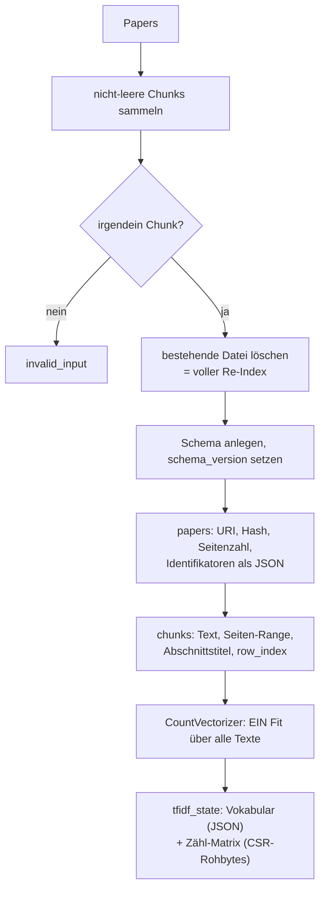
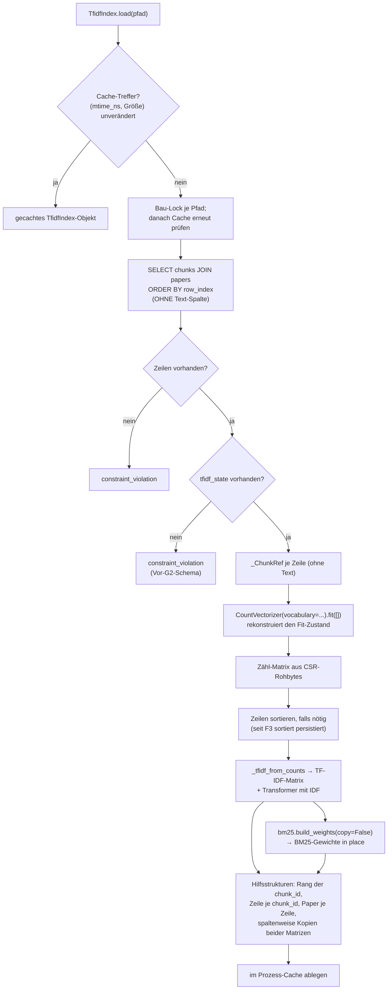
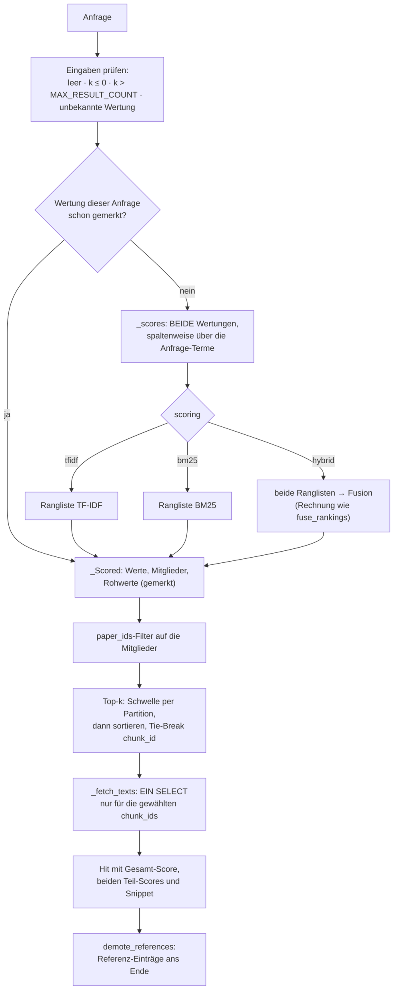
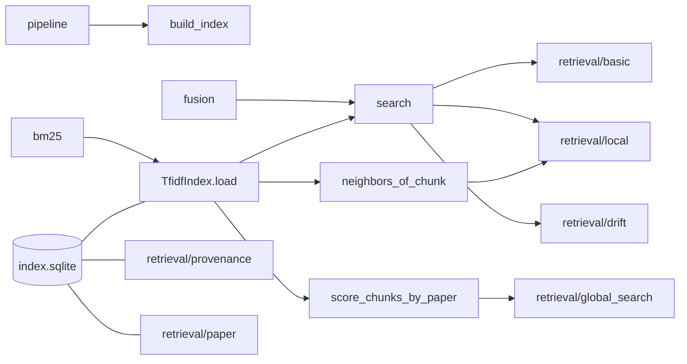

# Modul-Doku: `tfidf_index.py`

| Feld | Wert |
| --- | --- |
| **Modul** | `src/research_graphrag/indexing/tfidf_index.py` |
| **Paket** | `indexing` – Canonical JSON zum Offline-Hybrid-Index |
| **Phase** | 0b (eingeführt), 4 + 5 + 7 / A3 + A4 (erweitert), 13 / R2 (Dokumentart), 15 / G2 (Cache + persistierter Zustand), 10 / V4 (`score_chunks_by_paper`), 16 / F1 (bit-identische Begradigung der Wertung), 16 / F3 (schlanker Lader, Bau-Lock) |
| **Grundlagen** | [ADR 0005](../../../../docs/adr/0005-graphrag-index-backend-open.md), [ADR 0014](../../../../docs/adr/0014-hybrid-retrieval-bm25-tfidf-phase7.md), [ADR 0033](../../../../docs/adr/0033-response-latency-cache-and-persisted-tfidf-state-phase15.md), [ADR 0036](../../../../docs/adr/0036-global-community-ranking-over-member-chunks-phase10.md), [ADR 0044](../../../../docs/adr/0044-response-latency-bit-identical-scoring-and-fts5-phase16.md) |

---

## 1. Zweck

Das Herzstück des Retrievals: Es **schreibt** die Chunks samt Provenienz nach SQLite und
**lädt** sie zur Abfragezeit in zwei Bewertungsräume – TF-IDF-Kosinus und BM25 –, die es per
Rang-Fusion zu einer Wertung verbindet.

Die tragende Entwurfsentscheidung bleibt: **SQLite ist die alleinige Quelle der Wahrheit.** Seit
Phase 15 / G2 wird zusätzlich der **fertig tokenisierte Zustand** additiv persistiert (Vokabular
als JSON, Zähl-Matrix als Rohbytes fester Breite) – bewusst **kein** `pickle` eines
`scikit-learn`-Objekts, sondern reine Zahlen, aus denen `CountVectorizer`/`TfidfTransformer`
beim Laden denselben Raum **rekonstruieren**, den ein frischer Fit über denselben Text ergäbe.
Ein **Prozess-Cache** in `TfidfIndex.load()` erspart diese Rekonstruktion zusätzlich bei
unverändertem Index (Schlüssel: Dateigröße + Änderungszeit, nie eine Zeitspanne) – die
On-Read-Frische bleibt dadurch wörtlich erhalten. Details und Zahlen:
[ADR 0033](../../../../docs/adr/0033-response-latency-cache-and-persisted-tfidf-state-phase15.md).

Seit Phase 16 / F1 rechnet die Wertung **bit-identisch, aber ohne volle Matrixmultiplikation**:
Gewertet wird nur über die Spalten der Anfrage-Terme, Ranglisten und Top-*k* laufen vektorisiert,
und die Wertung einer Anfrage wird am Index-Objekt gemerkt. Am realen Bestand (225.126 Chunks)
sinkt Local warm von 6,9 s auf 0,17 s; jede Ausgabe bleibt bitgleich
([ADR 0044](../../../../docs/adr/0044-response-latency-bit-identical-scoring-and-fts5-phase16.md)).

## 2. Öffentliche Schnittstelle

| Symbol | Art | Aufgabe |
| --- | --- | --- |
| `build_index` | Funktion | Papers → SQLite-Index (voller Re-Index) |
| `TfidfIndex` | Klasse | Geladener Index mit `load()`, `search()`, `score_chunks_by_paper()`, `neighbors_of_chunk()`, `size` |
| `Hit` | Dataclass | Ein Treffer mit Provenienz, Gesamt-Score, beiden Teil-Scores, `identifiers`, `citation_key` und `document_kind` |
| `demote_references` | Funktion | Guardrail: sortiert Referenz-Einträge hinter die Volltext-Treffer |
| `Scoring` | Typ-Alias | `hybrid` · `tfidf` · `bm25` |
| `DEFAULT_SCORING` | Konstante | Die Standard-Wertung |
| `SCORE_MEMO_SIZE` | Konstante | Zahl der je Index-Objekt gemerkten Anfrage-Wertungen (Phase 16 / F1) |
| `SCHEMA_VERSION` | Konstante | Version des Index-Schemas (**0.6.0**: additive Tabelle `tfidf_state` – Vokabular + Zähl-Matrix) |

## 3. Ablauf

### 3.1 Aufbau

`row_index` ist lückenlos und bestimmt später die Zeilenreihenfolge der Matrix – dadurch sind
Zeilenindex und Chunk fest verknüpft. Seit Phase 15 / G2 wird die Tokenisierung **hier, einmal**
durchgeführt statt bei jedem späteren Laden neu.

Der Index wird **immer vollständig** neu gebaut. Bei dieser Korpusgröße ist das günstiger als
inkrementelle Pflege und schließt Inkonsistenzen zwischen Text und Vektorraum aus.

### 3.2 Laden

**Rekonstruktion statt Neu-Fit.** Der pro Aufbau persistierte Vokabular-/Zähl-Zustand macht das
frühere Tokenisieren beim Laden überflüssig; `CountVectorizer`/`TfidfTransformer` bauen denselben
Raum aus reinen Zahlen nach, den ein frischer Fit ergäbe (byte-genau nachgewiesen, siehe
[ADR 0033](../../../../docs/adr/0033-response-latency-cache-and-persisted-tfidf-state-phase15.md)).
BM25 bekommt weiterhin dieselben rohen Termhäufigkeiten und dasselbe Vokabular wie TF-IDF – ein
Unterschied zwischen den Verfahren ist damit garantiert ein Unterschied der Bewertung, nicht der
Vorverarbeitung.

**Sortierte Zeilen sind eine Invariante.** Vor Phase 16 waren die persistierten Spaltenindizes je
Zeile nicht sortiert; `scikit-learn` sortierte sie beim Fit nebenbei. Seit F1 sortiert der Lader
ausdrücklich direkt nach dem Deserialisieren, seit F3 persistiert `build_index` die Zeilen bereits
sortiert – ein neuer Index spart das Sortieren beim Laden, ein älterer wird weiter sortiert. Die
Werte beider Matrizen sind in beiden Fällen bitgleich (Test mit absichtlich umgekehrten Zeilen).

**Schlanker Lader (Phase 16 / F3).** Dieselbe Rechnung wie `TfidfTransformer().fit_transform` und
das frühere `bm25.build_weights`, aber ohne die Validierungs- und Typkopien: Die Zählwerte kommen
als `float64` mit `int32`-Indizes aus den Rohbytes; `_tfidf_from_counts` bildet die geglättete IDF
per `bincount`, multipliziert und normiert über dieselbe Routine wie `sklearn.preprocessing.normalize`
und gibt einen Transformer zurück, der Anfragen wie ein regulär gefitteter umwandelt; BM25 rechnet
danach **in place** auf den Zählwerten (`copy=False`), sodass alle drei Matrizen dieselbe Besetzung
teilen und `_by_term` mit **einer** Spaltenumwandlung über eine Positions-Permutation auskommt.
Am realen Bestand: Laden 12,0 s → 6,5 s, jedes Array bitgleich (SHA-256 über 15 Arrays).

**Ein Bau je Pfad.** Laden zwei Threads denselben Index gleichzeitig – das Vorladen des
MCP-Servers und die erste Anfrage –, baut nur einer; der andere wartet und erhält dasselbe Objekt.

**Der Prozess-Cache ist über den Dateizustand ungültig, nie über eine Zeitspanne.** Ein nach dem
Laden neu gebauter Index (atomarer Swap) wirkt beim nächsten Aufruf sofort – ohne Serverneustart,
ohne Wartezeit.

Es werden bewusst **keine Stoppwörter** entfernt: Für exakte Fakt-Fragen können auch häufige
Wörter tragend sein. Die Keyword-Politik wirkt an anderer Stelle, als Nachfilter.

### 3.3 Suche

Fünf Details, die das Verhalten prägen:

**Gewertet wird nur über die Terme der Anfrage.** `_by_term` addiert je Anfrage-Term dessen
Spalte (spaltenweise Kopie, einmal beim Laden) – statt die Anfrage gegen die ganze Matrix zu
multiplizieren. Die Summation je Chunk beginnt bei `0.0` und folgt derselben Termreihenfolge, in
der das frühere Sparse-Produkt akkumulierte: beim TF-IDF-Kosinus die gespeicherte Folge des
Anfragevektors, bei BM25 die aufsteigende Spaltenfolge. Das Ergebnis ist deshalb **bitgleich**,
nicht nur numerisch gleich; ein hypothesis-Test vergleicht gegen den früheren Algorithmus
wörtlich, und eine Mutationsprobe (vertauschte Reihenfolge) lässt ihn fehlschlagen.

**Dieselbe Anfrage wird einmal gewertet.** Local wertet eine Anfrage bis zu sechsmal (Seed +
Fan-out), DRIFT zwei- bis dreimal. `_scored` merkt sich die letzten `SCORE_MEMO_SIZE`
Wertungen am Index-Objekt; der Merker verfällt mit dem Objekt über den Dateizustand.

**Beide Score-Vektoren werden immer berechnet.** Das kostet wenig und sorgt dafür, dass jeder
Treffer seine Teil-Scores ausweisen kann – unabhängig davon, welche Wertung gewählt wurde.

**Der Filter wirkt nach der Wertung, vor der Sortierung.** `paper_ids` schneidet nicht den
Suchraum der Wertung: Die Werte – bei `hybrid` aus korpusweiten Rängen – sind dieselben wie ohne
Filter, sortiert werden aber nur noch die Zeilen der gewünschten Paper. Ein Filter **vor** der
Wertung würde die Ränge innerhalb der Teilmenge bilden und damit andere Fusionswerte liefern
(gemessen in Phase 16 / F0: 239 von 240 gefilterten Suchen weichen dann ab).

**Der Score der Hybrid-Wertung ist ein Fusionswert.** Er stammt aus Rängen, nicht aus
Ähnlichkeiten, und ist nur innerhalb einer Antwort vergleichbar.

**Referenz-Einträge sind nachrangig, nicht ausgeschlossen.** `demote_references` sortiert sie
ans Ende der fertigen Trefferliste – ihr Score ist mit dem eines Volltext-Chunks nicht
vergleichbar, weil die Längennormierung kurze Texte bevorzugt. Die **Auswahl** der Top-k bleibt
unangetastet: Ohne passenden Volltext steht der Referenz-Eintrag weiterhin vorn. Ein stubfreier
Korpus merkt von der Regel nichts (die Sortierung ist dann die Identität), weshalb sie die
eingefrorenen Baselines nicht bewegt ([ADR 0031](../../../../docs/adr/0031-reference-contract-and-guardrail-phase13.md)).

**Der Text wird erst für die fertige Top-k-Auswahl nachgeladen** (`_fetch_texts`, seit Phase 15 /
G2) – nie für alle Chunks des Index. `_ChunkRef` selbst trägt keinen Text mehr; die Wertung
braucht ihn nicht.

### 3.4 Chunk-Bewertung ohne Top-k-Grenze (`score_chunks_by_paper`)

Seit Phase 10 / V4 ([ADR 0036](../../../../docs/adr/0036-global-community-ranking-over-member-chunks-phase10.md))
teilt sich `search` seinen Bewertungskern mit einer zweiten Methode: `score_chunks_by_paper`
liefert **alle** positiv bewerteten Chunks einer Anfrage, gruppiert nach Paper – ohne
Top-k-Grenze und ohne den Text nachzuladen. Beide Methoden rufen intern denselben privaten
Baustein (`_scored`, ein Query-Vektor, eine Fusion, gemerkt) auf; `search` sortiert und begrenzt
zusätzlich, `score_chunks_by_paper` gruppiert nur. Grundlage für Aggregationen über
Chunk-**Mengen** statt über Einzeltreffer – bislang der einzige Aufrufer ist das
Community-Ranking in `retrieval/global_search.py`.

### 3.5 Chunk-Nachbarschaft

`neighbors_of_chunk` bewertet einen **Chunk gegen alle anderen** und bleibt bewusst beim reinen
Kosinus: BM25 ist ein Anfrage-Dokument-Modell und für Dokument-Dokument-Ähnlichkeit nicht
gedacht. Der Ausgangs-Chunk wird ausgeschlossen; `score_bm25` ist in diesen Treffern `0.0`.
Seit Phase 16 / F1 findet ein Wörterbuch die Zeile des Ausgangs-Chunks, und die Ähnlichkeit
entsteht wie in der Suche nur über dessen Terme; statt aller Zeilen wird nur die Top-*k*-Auswahl
sortiert.
Die Guardrail und das Nachladen der Texte wirken hier genauso wie in `search`.

## 4. Zusammenspiel

Andere Leser der Index-Datei – `provenance`, `paper`, `citations`, `graph_index` – greifen
**direkt per SQL** zu und rekonstruieren den Vektorraum nicht. Nur Modi, die tatsächlich
Ähnlichkeit brauchen, zahlen die Ladekosten.

## 5. Fehler und Grenzfälle

| Situation | Fehlercode |
| --- | --- |
| keine indexierbaren Chunks beim Aufbau | `invalid_input` |
| leere Anfrage, `k <= 0`, `k > MAX_RESULT_COUNT` (ADR 0037), unbekannte Wertung | `invalid_input` |
| `score_chunks_by_paper`: leere Anfrage, unbekannte Wertung (kein `k`) | `invalid_input` |
| Index-Datei fehlt | `not_found` |
| Index vorhanden, aber ohne Chunks | `constraint_violation` |
| Index vorhanden, aber ohne `tfidf_state` (Vor-G2-Schema) | `constraint_violation` |
| `neighbors_of_chunk` mit unbekannter Chunk-ID | `not_found` |
| `neighbors_of_chunk` mit `k > MAX_RESULT_COUNT` | `invalid_input` (ADR 0037) |

Kein Treffer ist **kein** Fehler: Die Suche liefert eine leere Liste. Ein Chunk erscheint nur,
wenn mindestens ein Verfahren ihn positiv bewertet.

## 6. Determinismus

- Feste Zeilenreihenfolge über `row_index`.
- Sortierung nach Score **mit Tie-Break über `chunk_id`** – bei Gleichstand entscheidet nie die
  Speicherreihenfolge.
- Der Vektorraum entsteht aus dem einmalig persistierten Vokabular-/Zähl-Zustand; gleicher Bau
  ergibt gleiche Matrizen – unabhängig davon, ob ein Cache-Treffer vorliegt oder neu geladen wird
  (byte-genau geprüft, siehe [ADR 0033](../../../../docs/adr/0033-response-latency-cache-and-persisted-tfidf-state-phase15.md)).
- Identifikatoren werden mit sortierten Schlüsseln serialisiert.
- Die Begradigung aus Phase 16 / F1 ist **bitgleich** zum früheren Algorithmus: Top-*k* behält alle
  Gleichstände an der Grenze, bevor der Tie-Break entscheidet; die Fusion rechnet `0.0 + 1/(K+Rang)`
  in derselben Reihenfolge wie `fuse_rankings`. Nachweis am realen Bestand: Byte-Vergleich aller
  Ausgaben alt gegen neu
  ([ADR 0044](../../../../docs/adr/0044-response-latency-bit-identical-scoring-and-fts5-phase16.md)).

## 7. Grenzen

- **Rein lexikalisch.** Ohne Embeddings findet der Index keine Synonyme; Paraphrasen sind die
  schwächste Fragenklasse.
- **Voller Neuaufbau.** Kein inkrementelles Update.
- **Der Prozess-Cache ist prozesslokal.** Mehrere getrennte Prozesse (z. B. mehrere CLI-Aufrufe
  hintereinander) teilen ihn nicht – nur ein langlebiger Prozess (MCP-Server) profitiert über
  mehrere Anfragen hinweg.
- **Spaltenweise Kopien kosten Ladezeit.** Beide Matrizen liegen zusätzlich spaltenweise im
  Speicher; die (seit F3 einzige) Umwandlung kostet am realen Bestand rund 1 s beim Laden.
- **Der Kaltstart bleibt über der 5-s-Marke** (CLI am realen Bestand 8,6–9,5 s): Das Laden ist
  O(Nicht-Null-Einträge). Der MCP-Server lädt deshalb beim Start vor (Phase 16 / F3). Der Spitzenspeicher entsteht
  weiterhin beim Laden selbst und steigt dadurch nicht (Phase 16 / F0).
- **Kein Feld-Ranking.** Titel, Abschnitt und Fließtext werden gleich gewichtet.
- **`k` ist gedeckelt.** Seit [ADR 0037](../../../../docs/adr/0037-mcp-tool-response-size-ceiling.md)
  gilt für `search`/`neighbors_of_chunk` dieselbe geteilte Obergrenze
  (`research_graphrag.limits.MAX_RESULT_COUNT`) wie für die übrigen Retrieval-Werkzeuge – eine
  MCP-Antwort soll nicht unbegrenzt mit dem angefragten `k` wachsen können.
