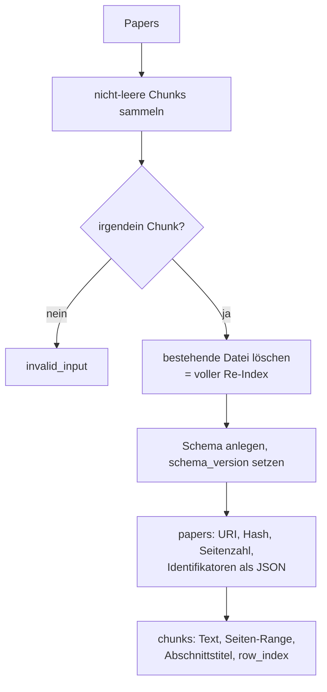
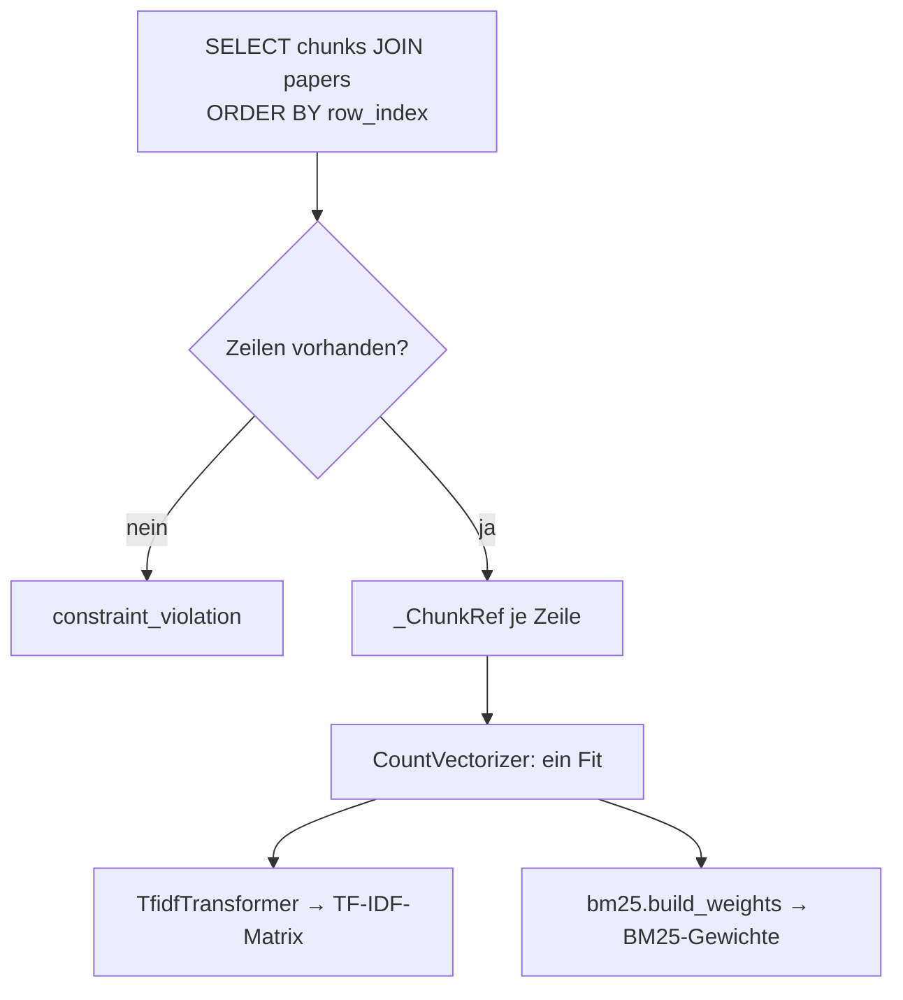
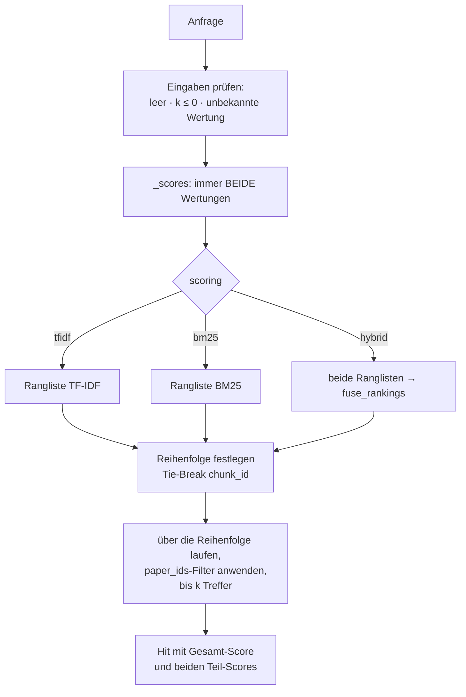
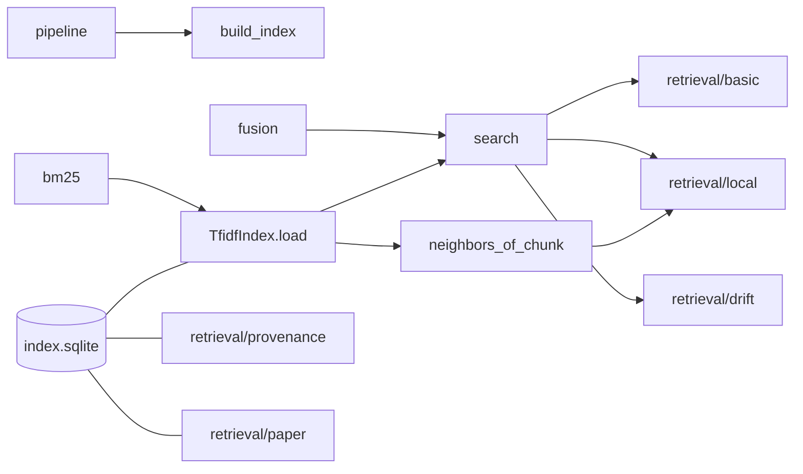

# Modul-Doku: `tfidf_index.py`

| Feld | Wert |
| --- | --- |
| **Modul** | `src/research_graphrag/indexing/tfidf_index.py` |
| **Paket** | `indexing` – Canonical JSON zum Offline-Hybrid-Index |
| **Phase** | 0b (eingeführt), 4 + 5 + 7 / A3 + A4 (erweitert) |
| **Grundlagen** | [ADR 0005](../../../../docs/adr/0005-graphrag-index-backend-open.md), [ADR 0014](../../../../docs/adr/0014-hybrid-retrieval-bm25-tfidf-phase7.md) |

---

## 1. Zweck

Das Herzstück des Retrievals: Es **schreibt** die Chunks samt Provenienz nach SQLite und
**lädt** sie zur Abfragezeit in zwei Bewertungsräume – TF-IDF-Kosinus und BM25 –, die es per
Rang-Fusion zu einer Wertung verbindet.

Die tragende Entwurfsentscheidung: **SQLite ist die alleinige Quelle der Wahrheit.** Es wird kein
Modell und kein Vektor persistiert; beide Räume entstehen beim Laden neu aus dem gespeicherten
Text. Das kostet Ladezeit, macht den Index aber inspizierbar, versionsunabhängig und frei von
`pickle`-Risiken.

## 2. Öffentliche Schnittstelle

| Symbol | Art | Aufgabe |
| --- | --- | --- |
| `build_index` | Funktion | Papers → SQLite-Index (voller Re-Index) |
| `TfidfIndex` | Klasse | Geladener Index mit `load()`, `search()`, `neighbors_of_chunk()`, `size` |
| `Hit` | Dataclass | Ein Treffer mit Provenienz, Gesamt-Score und beiden Teil-Scores |
| `Scoring` | Typ-Alias | `hybrid` · `tfidf` · `bm25` |
| `DEFAULT_SCORING` | Konstante | Die Standard-Wertung |
| `SCHEMA_VERSION` | Konstante | Version des Index-Schemas |

## 3. Ablauf

### 3.1 Aufbau

`row_index` ist lückenlos und bestimmt später die Zeilenreihenfolge der Matrix – dadurch sind
Zeilenindex und Chunk fest verknüpft.

Der Index wird **immer vollständig** neu gebaut. Bei dieser Korpusgröße ist das günstiger als
inkrementelle Pflege und schließt Inkonsistenzen zwischen Text und Vektorraum aus.

### 3.2 Laden

**Ein Fit für beide Räume.** Der Aufbau über `CountVectorizer` + `TfidfTransformer` ist
nachweislich identisch zum früheren direkten `TfidfVectorizer` – er wurde nur deshalb aufgeteilt,
damit BM25 dieselben rohen Termhäufigkeiten und **dasselbe Vokabular** bekommt. Ein Unterschied
zwischen den Verfahren ist damit garantiert ein Unterschied der Bewertung, nicht der
Vorverarbeitung.

Es werden bewusst **keine Stoppwörter** entfernt: Für exakte Fakt-Fragen können auch häufige
Wörter tragend sein. Die Keyword-Politik wirkt an anderer Stelle, als Nachfilter.

### 3.3 Suche

Drei Details, die das Verhalten prägen:

**Beide Score-Vektoren werden immer berechnet.** Das kostet wenig und sorgt dafür, dass jeder
Treffer seine Teil-Scores ausweisen kann – unabhängig davon, welche Wertung gewählt wurde.

**Der Filter wirkt nach der Sortierung.** `paper_ids` schneidet nicht den Suchraum, sondern
überspringt beim Einsammeln. Die Rangfolge innerhalb der gefilterten Menge ist dadurch identisch
zur ungefilterten Rangfolge – genau das brauchen Local-Fan-out und DRIFT.

**Der Score der Hybrid-Wertung ist ein Fusionswert.** Er stammt aus Rängen, nicht aus
Ähnlichkeiten, und ist nur innerhalb einer Antwort vergleichbar.

### 3.4 Chunk-Nachbarschaft

`neighbors_of_chunk` bewertet einen **Chunk gegen alle anderen** und bleibt bewusst beim reinen
Kosinus: BM25 ist ein Anfrage-Dokument-Modell und für Dokument-Dokument-Ähnlichkeit nicht
gedacht. Der Ausgangs-Chunk wird ausgeschlossen; `score_bm25` ist in diesen Treffern `0.0`.

## 4. Zusammenspiel

Andere Leser der Index-Datei – `provenance`, `paper`, `citations`, `graph_index` – greifen
**direkt per SQL** zu und rekonstruieren den Vektorraum nicht. Nur Modi, die tatsächlich
Ähnlichkeit brauchen, zahlen die Ladekosten.

## 5. Fehler und Grenzfälle

| Situation | Fehlercode |
| --- | --- |
| keine indexierbaren Chunks beim Aufbau | `invalid_input` |
| leere Anfrage, `k <= 0`, unbekannte Wertung | `invalid_input` |
| Index-Datei fehlt | `not_found` |
| Index vorhanden, aber ohne Chunks | `constraint_violation` |
| `neighbors_of_chunk` mit unbekannter Chunk-ID | `not_found` |

Kein Treffer ist **kein** Fehler: Die Suche liefert eine leere Liste. Ein Chunk erscheint nur,
wenn mindestens ein Verfahren ihn positiv bewertet.

## 6. Determinismus

- Feste Zeilenreihenfolge über `row_index`.
- Sortierung nach Score **mit Tie-Break über `chunk_id`** – bei Gleichstand entscheidet nie die
  Speicherreihenfolge.
- Der Vektorraum entsteht aus dem gespeicherten Text; gleiche Datei ergibt gleiche Matrizen.
- Identifikatoren werden mit sortierten Schlüsseln serialisiert.

## 7. Grenzen

- **Rein lexikalisch.** Ohne Embeddings findet der Index keine Synonyme; Paraphrasen sind die
  schwächste Fragenklasse.
- **Voller Neuaufbau.** Kein inkrementelles Update.
- **Ladekosten je Aufruf.** Der On-Read-Betrieb rekonstruiert den Vektorraum bei jeder Anfrage –
  bewusst nicht optimiert, weil ein Cache die Freshness-Garantie bräche.
- **Kein Feld-Ranking.** Titel, Abschnitt und Fließtext werden gleich gewichtet.
